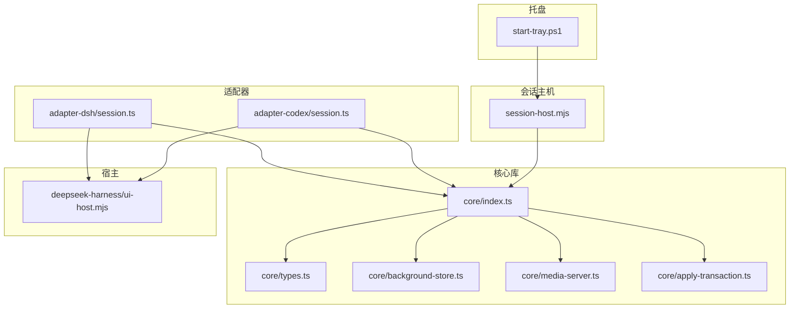
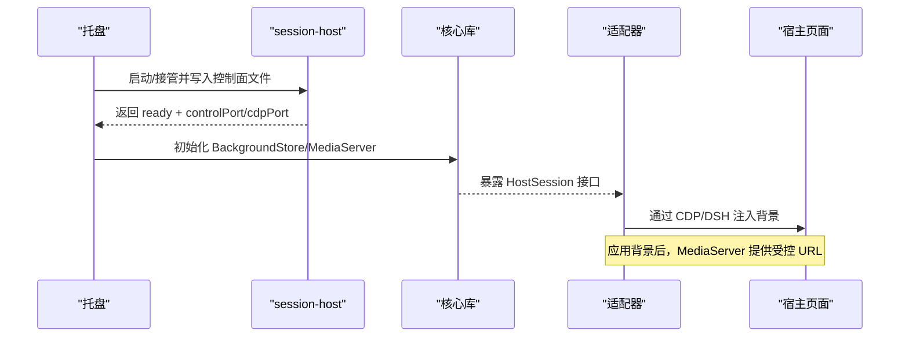
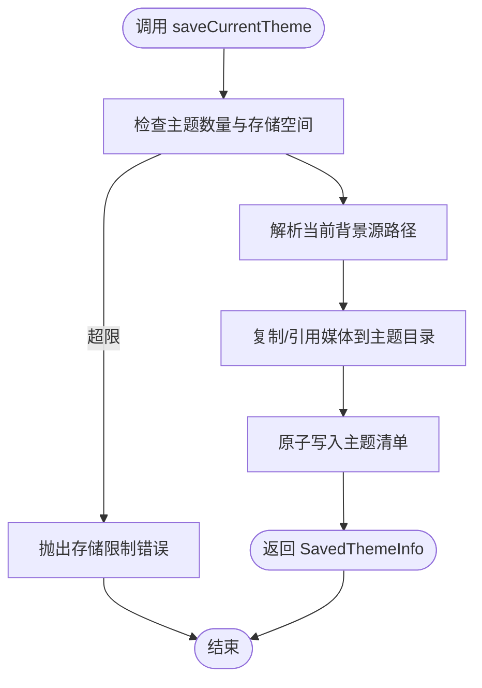
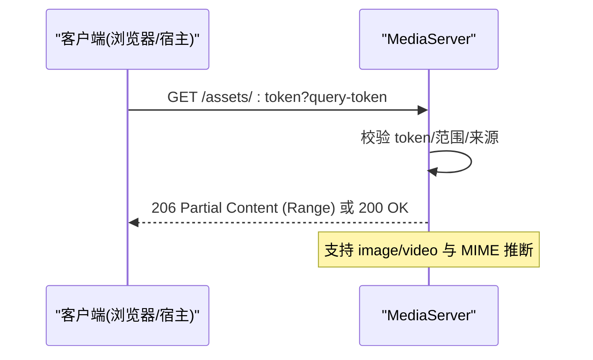
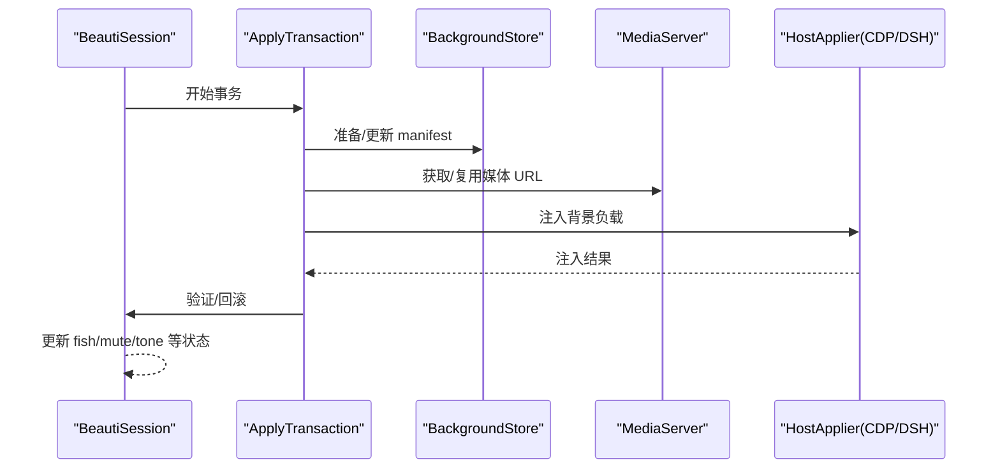
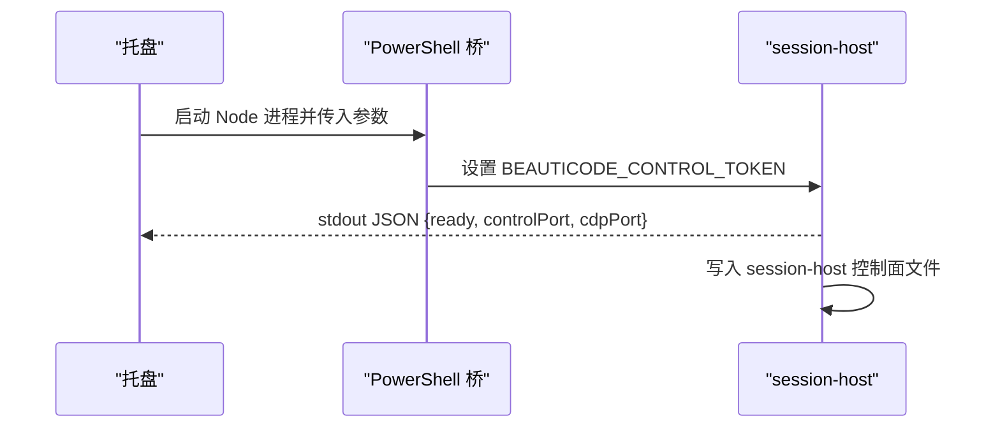
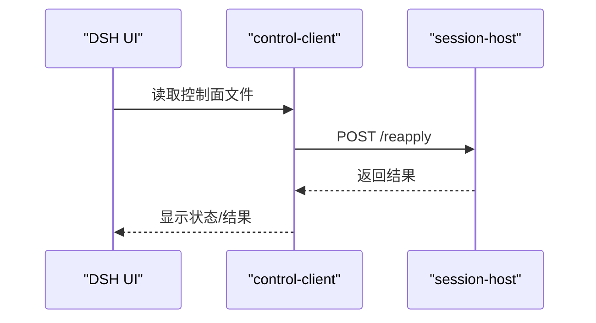
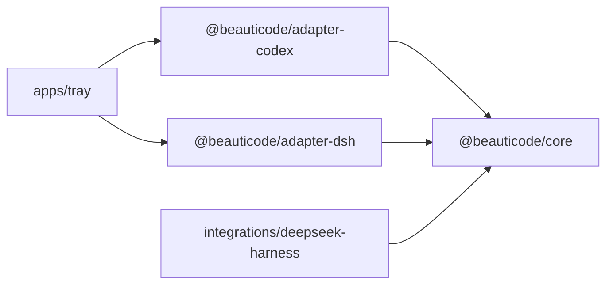

# API 参考

<cite>
**本文引用的文件**
- [README.md](file://README.md)
- [package.json](file://package.json)
- [packages/core/src/index.ts](file://packages/core/src/index.ts)
- [packages/core/src/types.ts](file://packages/core/src/types.ts)
- [packages/core/src/host-session.ts](file://packages/core/src/host-session.ts)
- [packages/core/src/background-store.ts](file://packages/core/src/background-store.ts)
- [packages/core/src/media-server.ts](file://packages/core/src/media-server.ts)
- [packages/core/src/apply-transaction.ts](file://packages/core/src/apply-transaction.ts)
- [packages/core/src/constants.ts](file://packages/core/src/constants.ts)
- [packages/core/src/media-validation.ts](file://packages/core/src/media-validation.ts)
- [packages/core/src/media-source.ts](file://packages/core/src/media-source.ts)
- [packages/core/src/paths.ts](file://packages/core/src/paths.ts)
- [packages/core/src/file-lock.ts](file://packages/core/src/file-lock.ts)
- [packages/core/src/error-message.ts](file://packages/core/src/error-message.ts)
- [packages/core/src/process-liveness.ts](file://packages/core/src/process-liveness.ts)
- [packages/core/package.json](file://packages/core/package.json)
- [packages/adapter-codex/src/session.ts](file://packages/adapter-codex/src/session.ts)
- [packages/adapter-dsh/src/session.ts](file://packages/adapter-dsh/src/session.ts)
- [apps/tray/start-tray.ps1](file://apps/tray/start-tray.ps1)
- [apps/tray/session-host.mjs](file://apps/tray/session-host.mjs)
- [integrations/deepseek-harness/control-client.mjs](file://integrations/deepseek-harness/control-client.mjs)
- [integrations/deepseek-harness/ui-host.mjs](file://integrations/deepseek-harness/ui-host.mjs)
</cite>

## 目录
1. [简介](#简介)
2. [项目结构](#项目结构)
3. [核心组件](#核心组件)
4. [架构总览](#架构总览)
5. [详细组件分析](#详细组件分析)
6. [依赖关系分析](#依赖关系分析)
7. [性能考量](#性能考量)
8. [故障排查指南](#故障排查指南)
9. [结论](#结论)
10. [附录：类型与契约](#附录类型与契约)

## 简介
beautiCode 是一个本地背景工具，主要为 DeepSeek Harness（DSH）和 Codex Desktop 提供图片、视频与动态壁纸背景能力。它通过托盘进程启动并管理 session-host，后者暴露受控的本地 HTTP 控制面；同时通过 CDP 或 DSH 桥接将渲染注入目标宿主页面，实现“安静地在对话和工作区后面播放”的背景体验。

本 API 参考聚焦以下公共接口与契约：
- HostSession 会话管理：连接建立、状态查询、应用背景、主题保存/切换等。
- BackgroundStore 主题管理：主题创建、保存、删除、列表与加载。
- MediaServer 媒体访问：本地安全上传/暂存、流式传输、Range 支持、鉴权。
- TypeScript 类型定义与接口契约：统一在 core 包导出，供适配器与上层使用。

## 项目结构
仓库采用 monorepo 组织：
- packages/core：核心类型、存储、媒体服务、事务与工具。
- packages/adapter-codex：基于 CDP 的 Codex Desktop 适配器。
- packages/adapter-dsh：基于 DSH 桥接的适配器。
- apps/tray：托盘入口，负责启动/接管 session-host 与控制面通信。
- integrations/deepseek-harness：DSH 插件侧 UI 与命令集成。



图表来源
- [apps/tray/start-tray.ps1:658-847](file://apps/tray/start-tray.ps1#L658-L847)
- [apps/tray/session-host.mjs:593-638](file://apps/tray/session-host.mjs#L593-L638)
- [packages/core/src/index.ts:1-19](file://packages/core/src/index.ts#L1-L19)
- [packages/core/src/types.ts:1-215](file://packages/core/src/types.ts#L1-L215)
- [packages/core/src/background-store.ts:123-151](file://packages/core/src/background-store.ts#L123-L151)
- [packages/core/src/media-server.ts:1-628](file://packages/core/src/media-server.ts#L1-L628)
- [packages/adapter-codex/src/session.ts:1-41](file://packages/adapter-codex/src/session.ts#L1-L41)
- [packages/adapter-dsh/src/session.ts:104-151](file://packages/adapter-dsh/src/session.ts#L104-L151)
- [integrations/deepseek-harness/ui-host.mjs:373-424](file://integrations/deepseek-harness/ui-host.mjs#L373-L424)

章节来源
- [README.md:19-35](file://README.md#L19-L35)
- [package.json:1-28](file://package.json#L1-L28)

## 核心组件
本节概述对外暴露的核心能力与职责边界：
- HostSession：统一的会话控制面，屏蔽底层 CDP/DSH 差异，提供 apply/status/reapply/save/list/delete/use theme/fish/mute/tone 等能力。
- BackgroundStore：持久化主题与当前激活背景，保证原子提交、恢复与容量限制。
- MediaServer：本地回环媒体服务器，提供带鉴权的图片/视频资源访问与 Range 流式传输。
- ApplyTransaction：对 apply 流程进行阶段化验证与回滚保障。

章节来源
- [packages/core/src/host-session.ts:10-48](file://packages/core/src/host-session.ts#L10-L48)
- [packages/core/src/background-store.ts:123-151](file://packages/core/src/background-store.ts#L123-L151)
- [packages/core/src/media-server.ts:24-628](file://packages/core/src/media-server.ts#L24-L628)
- [packages/core/src/apply-transaction.ts:1-200](file://packages/core/src/apply-transaction.ts#L1-L200)

## 架构总览
beautiCode 的控制平面由托盘进程驱动，启动或接管 session-host，并通过本地 HTTP 控制面与 DSH/Codex 侧交互。核心库提供类型、存储与媒体服务；适配器根据宿主类型选择 CDP 或 DSH 桥接方式完成注入。



图表来源
- [apps/tray/start-tray.ps1:658-847](file://apps/tray/start-tray.ps1#L658-L847)
- [apps/tray/session-host.mjs:593-638](file://apps/tray/session-host.mjs#L593-L638)
- [packages/core/src/media-server.ts:24-628](file://packages/core/src/media-server.ts#L24-L628)
- [packages/adapter-codex/src/session.ts:238-349](file://packages/adapter-codex/src/session.ts#L238-L349)
- [packages/adapter-dsh/src/session.ts:118-151](file://packages/adapter-dsh/src/session.ts#L118-L151)

## 详细组件分析

### HostSession 接口与会话管理
HostSession 是跨适配器的统一控制面，托盘与 UI 仅依赖该小表面。

- 关键方法
  - start(): Promise<{ port: number | null }>
  - stop(): Promise<void>
  - status(): Promise<HostSessionStatus>
  - apply(input): Promise<ApplyResult>
  - reapply(): Promise<ApplyResult>
  - saveCurrentTheme(name): Promise<SavedThemeInfo>
  - listSavedThemes(): Promise<SavedThemeInfo[]>
  - deleteSavedTheme(themeId): Promise<boolean>
  - useSavedTheme(themeId): Promise<ApplyResult>
  - setFishMode(enabled): Promise<{ ok: boolean }>
  - setMuted(muted): Promise<{ ok: boolean }>
  - setBackgroundTone(tone): Promise<{ ok: boolean }>

- 状态对象 HostSessionStatus
  - host: HostDescriptor
  - port: number | null
  - sessions: number
  - manifest: BackgroundManifest
  - mediaServer: string | null
  - fish: boolean
  - muted: boolean
  - tone: BackgroundTone
  - themeId?: string | null

- 行为说明
  - 连接建立：Codex 适配器通过 CDP 端口发现与连接；DSH 适配器通过桥接 token 与 baseUrl 连接。
  - 状态查询：status() 聚合 store 的 manifest、media server 地址、fish/mute/tone 等运行时状态。
  - 背景应用：apply() 走 ApplyTransaction，确保可验证与可回滚；reapply() 用于重放上次成功负载。
  - 主题管理：save/list/delete/use 委托给 BackgroundStore；use 会绑定连续进度写入到主题 ID。

```mermaid
classDiagram
class HostSession {
+descriptor : HostDescriptor
+cdpPort : number|null
+isBusy : boolean
+isOpen : boolean
+isHostReady : boolean
+start() Promise~{port : number|null}~
+stop() Promise~void~
+status() Promise~HostSessionStatus~
+apply(input) Promise~ApplyResult~
+reapply() Promise~ApplyResult~
+saveCurrentTheme(name) Promise~SavedThemeInfo~
+listSavedThemes() Promise~SavedThemeInfo[]~
+deleteSavedTheme(themeId) Promise~boolean~
+useSavedTheme(themeId) Promise~ApplyResult~
+setFishMode(enabled) Promise~{ok : boolean}~
+setMuted(muted) Promise~{ok : boolean}~
+setBackgroundTone(tone) Promise~{ok : boolean}~
}
```

图表来源
- [packages/core/src/host-session.ts:10-48](file://packages/core/src/host-session.ts#L10-L48)

章节来源
- [packages/core/src/host-session.ts:10-48](file://packages/core/src/host-session.ts#L10-L48)
- [packages/adapter-codex/src/session.ts:167-349](file://packages/adapter-codex/src/session.ts#L167-L349)
- [packages/adapter-dsh/src/session.ts:118-151](file://packages/adapter-dsh/src/session.ts#L118-L151)

### BackgroundStore 主题管理 API
BackgroundStore 负责主题与当前背景的持久化，提供原子提交、恢复与容量限制。

- 主要操作
  - init(): 初始化数据布局，恢复中断提交，确保 active 目录与 manifest 存在。
  - commitImport(input): 导入并生成新代次，校验大小与数量上限。
  - readActiveManifest(): 读取当前激活背景清单。
  - listSavedThemes(): 列出已保存主题（含内置主题）。
  - loadSavedTheme(themeId): 加载指定主题的输入与元信息。
  - saveCurrentTheme(name): 将当前背景保存为新主题。
  - deleteSavedTheme(themeId): 删除用户主题（内置主题不可删）。
  - updateSavedThemeVideoPosition(themeId, seconds): 为视频主题记录播放进度。

- 约束与保护
  - 最大保存主题数与字节数限制。
  - 内置主题（如“画窗”）始终可见且不可删除。
  - 原子提交与中断恢复，避免半写树。



图表来源
- [packages/core/src/background-store.ts:821-850](file://packages/core/src/background-store.ts#L821-L850)
- [packages/core/src/background-store.ts:1315-1345](file://packages/core/src/background-store.ts#L1315-L1345)

章节来源
- [packages/core/src/background-store.ts:123-151](file://packages/core/src/background-store.ts#L123-L151)
- [packages/core/src/background-store.ts:821-850](file://packages/core/src/background-store.ts#L821-L850)
- [packages/core/src/background-store.ts:1315-1345](file://packages/core/src/background-store.ts#L1315-L1345)

### MediaServer 媒体访问 API
MediaServer 提供本地回环的安全媒体服务，支持图片与视频，具备鉴权、Range 请求与 MIME 类型处理。

- 关键接口
  - addFile(filePath, opts): 添加文件并返回资产句柄（包含 url、srcUrl、token、mime、size 等）。
  - createMediaServer(filePath, opts): 单资产便捷封装（向后兼容）。
  - close(): 关闭服务器释放端口。

- 安全与协议
  - 仅监听 127.0.0.1。
  - 访问需携带不可猜测的路径 token 以及 header 或 query 中的 token。
  - 支持 Range 分块传输，提升大视频播放体验。
  - 可选可信来源白名单与最大文件大小限制。



图表来源
- [packages/core/src/media-server.ts:24-628](file://packages/core/src/media-server.ts#L24-L628)

章节来源
- [packages/core/src/media-server.ts:24-628](file://packages/core/src/media-server.ts#L24-L628)

### 应用背景的事务流程
apply() 通过 ApplyTransaction 串联媒体准备、宿主注入与结果验证，失败时回滚。



图表来源
- [packages/core/src/apply-transaction.ts:1-200](file://packages/core/src/apply-transaction.ts#L1-L200)
- [packages/adapter-codex/src/session.ts:275-349](file://packages/adapter-codex/src/session.ts#L275-L349)

章节来源
- [packages/core/src/apply-transaction.ts:1-200](file://packages/core/src/apply-transaction.ts#L1-L200)
- [packages/adapter-codex/src/session.ts:275-349](file://packages/adapter-codex/src/session.ts#L275-L349)

### 托盘与 session-host 协作
托盘负责启动或接管 session-host，写入控制面文件，并在 stdout 中输出就绪信息。



图表来源
- [apps/tray/start-tray.ps1:698-847](file://apps/tray/start-tray.ps1#L698-L847)
- [apps/tray/session-host.mjs:593-638](file://apps/tray/session-host.mjs#L593-L638)

章节来源
- [apps/tray/start-tray.ps1:658-847](file://apps/tray/start-tray.ps1#L658-L847)
- [apps/tray/session-host.mjs:593-638](file://apps/tray/session-host.mjs#L593-L638)

### DSH 控制面与 UI 集成
DSH 插件通过控制面文件发现并调用 session-host，UI 暴露 /status、/reapply 等端点。



图表来源
- [integrations/deepseek-harness/control-client.mjs:223-398](file://integrations/deepseek-harness/control-client.mjs#L223-L398)
- [integrations/deepseek-harness/ui-host.mjs:373-424](file://integrations/deepseek-harness/ui-host.mjs#L373-L424)

章节来源
- [integrations/deepseek-harness/control-client.mjs:223-398](file://integrations/deepseek-harness/control-client.mjs#L223-L398)
- [integrations/deepseek-harness/ui-host.mjs:373-424](file://integrations/deepseek-harness/ui-host.mjs#L373-L424)

## 依赖关系分析
- core 包作为基础层，导出类型、存储、媒体服务、事务与工具。
- adapter-codex 与 adapter-dsh 依赖 core，分别实现 CDP 与 DSH 桥接。
- tray 与 deepseek-harness 插件依赖适配器与 core，形成端到端链路。



图表来源
- [packages/core/package.json:1-32](file://packages/core/package.json#L1-L32)
- [packages/adapter-codex/src/session.ts:1-41](file://packages/adapter-codex/src/session.ts#L1-L41)
- [packages/adapter-dsh/src/session.ts:104-151](file://packages/adapter-dsh/src/session.ts#L104-L151)

章节来源
- [packages/core/package.json:1-32](file://packages/core/package.json#L1-L32)
- [packages/adapter-codex/src/session.ts:1-41](file://packages/adapter-codex/src/session.ts#L1-L41)
- [packages/adapter-dsh/src/session.ts:104-151](file://packages/adapter-dsh/src/session.ts#L104-L151)

## 性能考量
- 媒体流式传输：MediaServer 支持 Range 请求，适合大视频分段加载，减少首屏等待。
- 注入优化：适配器在同一代次健康负载下跳过重复注入与 blob 重新附加，降低闪烁与开销。
- 主题进度写入节流：视频主题连续进度写入按秒级节流，避免频繁磁盘 I/O。
- 容量限制：BackgroundStore 限制主题数量与总大小，防止磁盘占用失控。

[本节为通用指导，不直接分析具体文件]

## 故障排查指南
- 控制面文件无效或缺失：托盘/插件会尝试自动发现与接管；若失败，检查 BEAUTICODE_CONTROL_TOKEN 与端口可达性。
- CDP 身份漂移：Codex 重启后 CDP 身份变化，适配器会自动重建会话并重连。
- 媒体验证失败：MediaServer 对非 MP4 容器或超大文件拒绝；检查文件格式与大小限制。
- 主题保存失败：达到主题数量或字节上限；删除旧主题后再试。
- 无法注入背景：确认宿主页面可用、CSP 允许 loopback/data/blob 来源；必要时强制重建注入。

章节来源
- [integrations/deepseek-harness/control-client.mjs:223-398](file://integrations/deepseek-harness/control-client.mjs#L223-L398)
- [packages/adapter-codex/src/session.ts:238-273](file://packages/adapter-codex/src/session.ts#L238-L273)
- [packages/core/src/media-server.ts:220-254](file://packages/core/src/media-server.ts#L220-L254)
- [packages/core/src/background-store.ts:821-850](file://packages/core/src/background-store.ts#L821-L850)

## 结论
beautiCode 通过清晰的三层架构（托盘/会话主机、核心库、适配器）实现了稳定可靠的本地背景能力。HostSession 提供统一控制面，BackgroundStore 保证主题持久化的原子性与安全性，MediaServer 提供安全的媒体访问与流式传输。开发者可基于这些接口快速集成 DSH 或 Codex，获得一致的主题管理与背景应用体验。

[本节为总结，不直接分析具体文件]

## 附录：类型与契约
以下为 TypeScript 类型与接口契约摘要，便于开发者在 IDE 中获得准确提示与校验。

- 背景类型与色调
  - BackgroundType: "image" | "video" | "clear"
  - BackgroundTone: "dark" | "light" | "auto"

- 宿主描述与能力
  - HostDescriptor: { kind, displayName, capabilities }
  - HostCapabilities: { image, clear, reapply, savedThemes, video, fish, muted, tone }

- 背景媒体与清单
  - BackgroundMedia: { type, image?, video?, source?, effects? }
  - BackgroundManifest: { schema, generation, background, updatedAt }

- 应用输入与结果
  - ApplyInput: { type:"image", imagePath, source?, effects? } | { type:"video", imagePath?, videoPath, source?, startAt? } | { type:"clear" }
  - ApplyResult: { ok:true, generation, mode, sourceMode?, timings? } | { ok:false, error, rolledBack, sourceMode?, timings? }

- 宿主应用负载
  - HostApplyPayload: { generation, media, imageDataUrl, imageUrl?, video:{mode,dataUrl,url,srcUrl,token,localPath,startAt?}, cssText, atmosphere? }

- 会话状态
  - HostSessionStatus: { host, port, sessions, manifest, mediaServer, fish, muted, tone, themeId? }

- 媒体资产句柄
  - MediaAssetHandle: { kind, filePath, size, identity, device, inode, mtimeMs, ctimeMs, mime, validation, token, route, url, srcUrl }

- 其他
  - VerifyExpectation/VerifyResult：用于注入后的结果验证。
  - MediaSource：managed/local 两种来源模式。

章节来源
- [packages/core/src/types.ts:1-215](file://packages/core/src/types.ts#L1-L215)
- [packages/core/src/host-session.ts:10-48](file://packages/core/src/host-session.ts#L10-L48)
- [packages/core/src/media-server.ts:35-628](file://packages/core/src/media-server.ts#L35-L628)