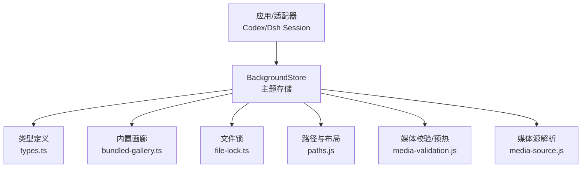
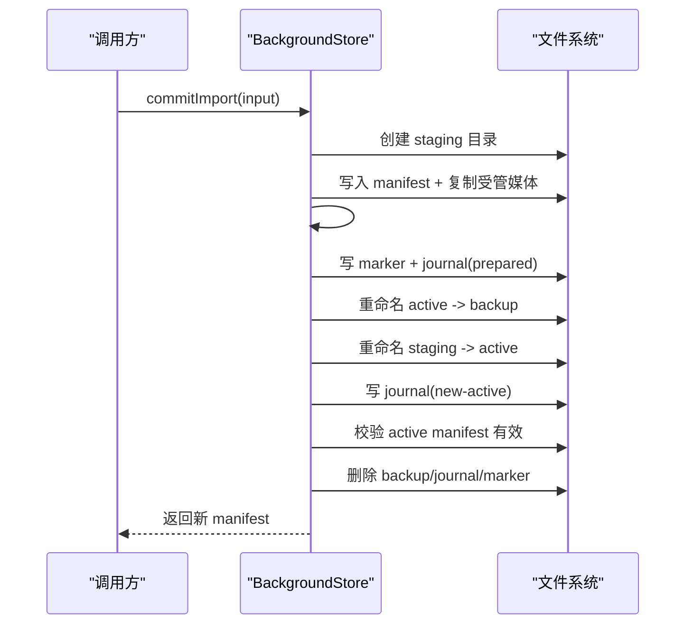
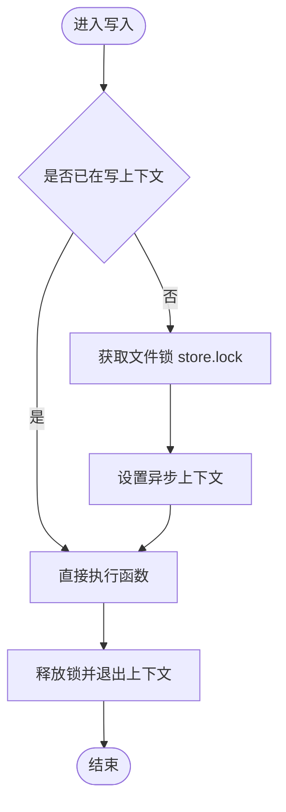
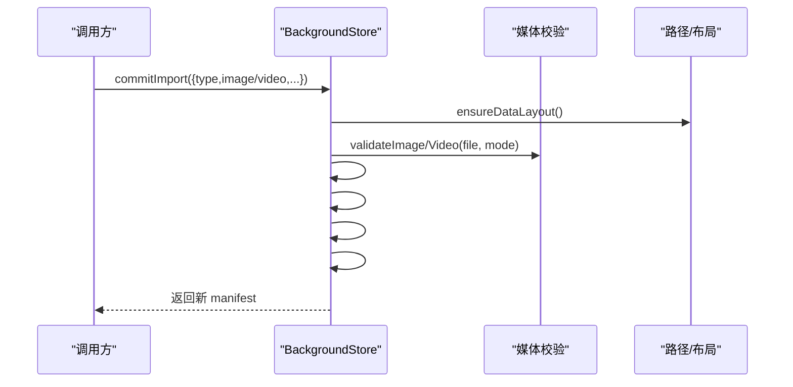
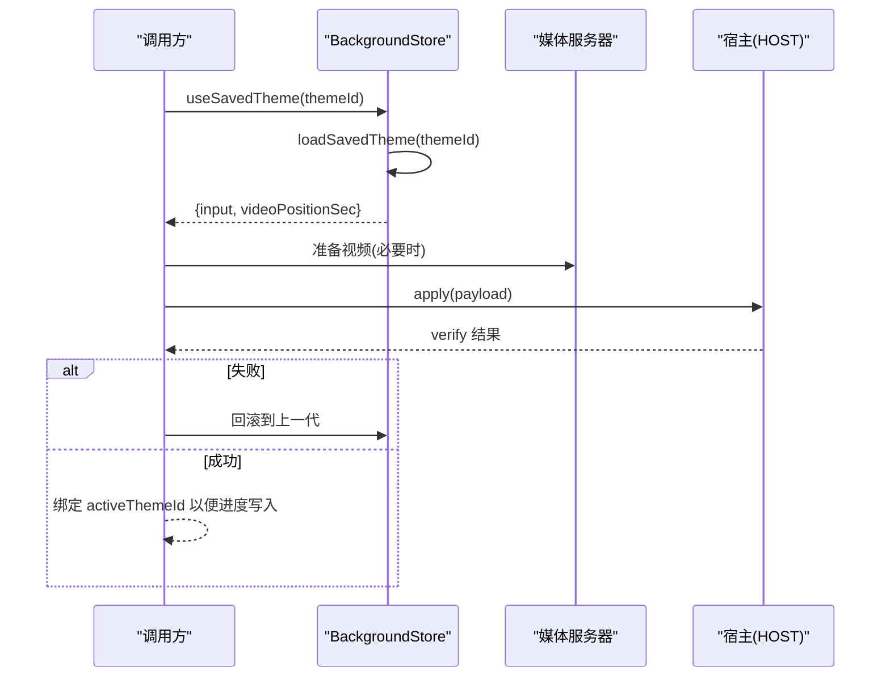
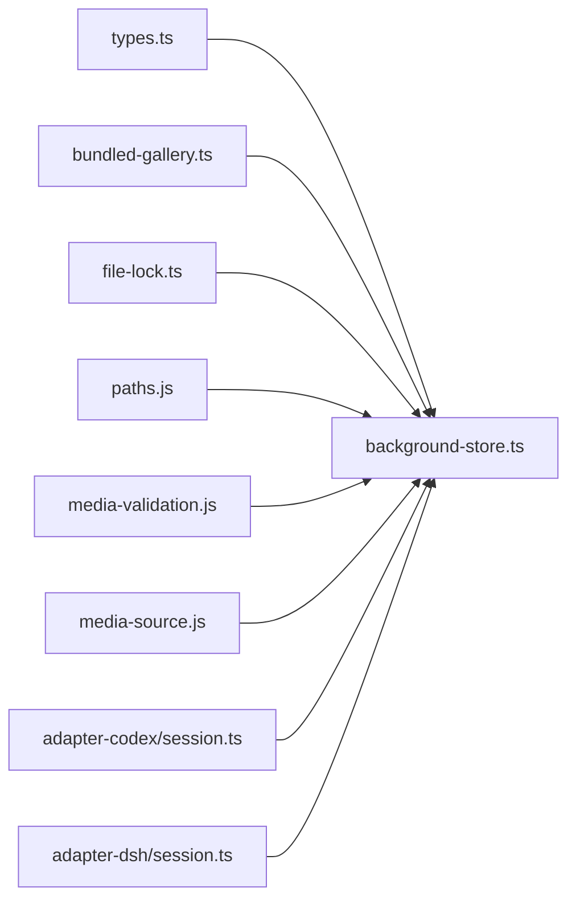

# 主题存储 API

<cite>
**本文引用的文件**
- [background-store.ts](file://packages/core/src/background-store.ts)
- [types.ts](file://packages/core/src/types.ts)
- [bundled-gallery.ts](file://packages/core/src/bundled-gallery.ts)
- [file-lock.ts](file://packages/core/src/file-lock.ts)
- [session.ts（adapter-codex）](file://packages/adapter-codex/src/session.ts)
- [session.ts（adapter-dsh）](file://packages/adapter-dsh/src/session.ts)
- [background-store.test.js](file://packages/core/test/background-store.test.js)
</cite>

## 目录
1. [简介](#简介)
2. [项目结构](#项目结构)
3. [核心组件](#核心组件)
4. [架构总览](#架构总览)
5. [详细组件分析](#详细组件分析)
6. [依赖关系分析](#依赖关系分析)
7. [性能与并发](#性能与并发)
8. [故障排查指南](#故障排查指南)
9. [结论](#结论)
10. [附录：使用场景与最佳实践](#附录使用场景与最佳实践)

## 简介
本 API 文档围绕 BackgroundStore 类，系统化说明主题创建、保存、删除、切换与查询的完整能力；解释主题数据模型（图片背景与视频背景配置格式）；说明内置画廊的管理方式（预置主题访问与自定义主题集成）；提供常见使用场景的代码示例路径（批量操作、版本回滚、导入导出）；并阐述文件系统锁机制与并发访问控制，以及数据备份恢复与迁移策略的最佳实践。

## 项目结构
BackgroundStore 位于 core 包中，负责主题数据的持久化、原子提交、快照与恢复、运行时媒体管理、内置主题合并等。其依赖类型定义、内置画廊解析、文件锁与路径工具等模块，并通过 adapter 层在 Codex/Dsh 会话中暴露给上层调用。

图表来源
- [background-store.ts:123-140](file://packages/core/src/background-store.ts#L123-L140)
- [types.ts:64-81](file://packages/core/src/types.ts#L64-L81)
- [bundled-gallery.ts:1-70](file://packages/core/src/bundled-gallery.ts#L1-L70)
- [file-lock.ts:72-170](file://packages/core/src/file-lock.ts#L72-L170)

章节来源
- [background-store.ts:123-140](file://packages/core/src/background-store.ts#L123-L140)
- [bundled-gallery.ts:1-70](file://packages/core/src/bundled-gallery.ts#L1-L70)
- [file-lock.ts:72-170](file://packages/core/src/file-lock.ts#L72-L170)

## 核心组件
- BackgroundStore：主题存储的核心类，提供初始化、读取活动主题、导入/提交、保存/列出/删除/加载/使用已保存主题、快照/恢复、运行时视频准备与清理等能力。
- 类型系统：定义 BackgroundMedia、BackgroundManifest、ApplyInput、HostApplier 等关键数据结构。
- 内置画廊：提供“画窗”内置主题的发现与规格构造，支持通过环境变量或搜索根定位资源。
- 文件锁：跨进程互斥锁，防止多实例同时写入导致数据损坏。

章节来源
- [background-store.ts:123-140](file://packages/core/src/background-store.ts#L123-L140)
- [types.ts:64-81](file://packages/core/src/types.ts#L64-L81)
- [bundled-gallery.ts:1-70](file://packages/core/src/bundled-gallery.ts#L1-L70)
- [file-lock.ts:72-170](file://packages/core/src/file-lock.ts#L72-L170)

## 架构总览
BackgroundStore 以“staging + journal + marker”的原子提交模型保证一致性：所有变更先在 staging 目录构建，再经 journal 记录阶段，最后通过目录交换将 staging 提升为 active，并在成功后清理 journal/marker。读路径会检测 fresh marker 避免干扰进行中的事务。

图表来源
- [background-store.ts:564-678](file://packages/core/src/background-store.ts#L564-L678)
- [background-store.ts:757-798](file://packages/core/src/background-store.ts#L757-L798)

## 详细组件分析

### BackgroundStore 类方法总览
- 初始化与一致性
  - init(): 确保数据布局，检测/恢复中断提交，确保 active 存在且 manifest 合法。
  - readActiveManifest(): 读取当前活动主题清单，含 schema/generation/background/updateTime。
  - activeImagePath()/activeVideoPath(): 解析当前活动的图片/视频路径。
- 导入与提交
  - commitImport(input): 将输入（图片/视频/清空）验证后写入 staging，校验通过后原子提升为 active。
  - withExclusiveMutation(fn): 在多步 apply/verify/rollback 序列中持有独占锁，嵌套调用可重入。
- 快照与恢复
  - snapshot(): 对当前 active 生成快照（包含 manifest 与受管媒体），用于备份/迁移。
  - restoreSnapshot(snapshot): 从快照恢复为新的 active（generation+1）。
  - clearSnapshot(snapshot): 删除指定快照。
- 已保存主题管理
  - saveCurrentTheme(name, opts): 将当前 active 保存为一个主题（限制数量/大小，支持视频位置）。
  - listSavedThemes(): 列出磁盘主题与内置主题（排序：内置优先，按 savedAt 倒序）。
  - deleteSavedTheme(themeId): 删除用户主题（内置不可删）。
  - getSavedThemeVideoPosition(themeId): 读取视频主题上次播放位置。
  - updateSavedThemeVideoPosition(themeId, positionSec): 持续更新视频主题播放位置（节流/去抖）。
  - loadSavedTheme(themeId): 将已保存主题转换为 ApplyInput（含 effects/startAt）。
  - useSavedTheme(themeId): 将已保存主题提升为 active（video 主题可带 resume 位置）。
- 运行时媒体
  - prepareRuntimeVideo(manifest): 为渲染器准备视频路径（本地直读或复制到 session 目录）。
  - pruneRuntimeMedia(keepPath?): 清理过期/未使用的运行时媒体。

章节来源
- [background-store.ts:142-159](file://packages/core/src/background-store.ts#L142-L159)
- [background-store.ts:277-319](file://packages/core/src/background-store.ts#L277-L319)
- [background-store.ts:564-678](file://packages/core/src/background-store.ts#L564-L678)
- [background-store.ts:504-529](file://packages/core/src/background-store.ts#L504-L529)
- [background-store.ts:680-716](file://packages/core/src/background-store.ts#L680-L716)
- [background-store.ts:805-913](file://packages/core/src/background-store.ts#L805-L913)
- [background-store.ts:915-984](file://packages/core/src/background-store.ts#L915-L984)
- [background-store.ts:990-1059](file://packages/core/src/background-store.ts#L990-L1059)
- [background-store.ts:1066-1148](file://packages/core/src/background-store.ts#L1066-L1148)
- [background-store.ts:1155-1224](file://packages/core/src/background-store.ts#L1155-L1224)
- [background-store.ts:352-449](file://packages/core/src/background-store.ts#L352-L449)

### 主题数据模型
- BackgroundMedia
  - type: "image" | "video"
  - image?: string（受管海报文件名，视频必需）
  - video?: string（受管主视频文件名，受管视频必需）
  - source?: MediaSource（{ kind: "managed" | "local", file/path }）
  - effects?: BackgroundEffects（仅图片主题可用）
- BackgroundManifest
  - schema: 固定标识
  - generation: 单调递增的版本号
  - background: BackgroundMedia | null
  - updatedAt: ISO 时间戳
- ApplyInput
  - type: "image" | "video" | "clear"
  - 图片：imagePath, source("managed"|"local"), effects
  - 视频：videoPath, imagePath(可选), source("managed"|"local"), startAt(可选)
  - 清空：type="clear"

章节来源
- [types.ts:64-81](file://packages/core/src/types.ts#L64-L81)
- [types.ts:107-125](file://packages/core/src/types.ts#L107-L125)

### 内置画廊管理
- 内置主题规格 BundledThemeSpec：id/name/imagePath/effects。
- resolveSessionBundledThemes：根据 enabled、显式 imagePath、searchRoots 自动发现“画窗”主题。
- 列表与使用：listSavedThemes 会将内置主题与磁盘主题合并展示；useSavedTheme/loadSavedTheme 可直接使用内置主题。
- 保护：内置主题不可删除。

章节来源
- [bundled-gallery.ts:1-70](file://packages/core/src/bundled-gallery.ts#L1-L70)
- [background-store.ts:957-966](file://packages/core/src/background-store.ts#L957-L966)
- [background-store.ts:1282-1313](file://packages/core/src/background-store.ts#L1282-L1313)

### 并发与锁机制
- 写入串行化：内部 #withWriteLock 基于 AsyncLocalStorage 与 Promise 链实现同进程串行，跨进程通过 store.lock 文件锁互斥。
- 文件锁 acquireFileLock：使用 O_EXCL 创建锁文件，携带 pid/nonce/startedAt/purpose，死锁/陈旧锁通过隔离重试处理。
- 事务标记：commit 期间写 marker 与 journal，read 路径检测到 fresh marker 则拒绝半写状态。

图表来源
- [background-store.ts:325-344](file://packages/core/src/background-store.ts#L325-L344)
- [file-lock.ts:72-170](file://packages/core/src/file-lock.ts#L72-L170)

章节来源
- [background-store.ts:325-344](file://packages/core/src/background-store.ts#L325-L344)
- [file-lock.ts:72-170](file://packages/core/src/file-lock.ts#L72-L170)

### 典型流程时序图

#### 导入并提交主题

图表来源
- [background-store.ts:564-678](file://packages/core/src/background-store.ts#L564-L678)
- [background-store.ts:757-798](file://packages/core/src/background-store.ts#L757-L798)

#### 切换已保存主题（含视频续播）

图表来源
- [background-store.ts:1066-1148](file://packages/core/src/background-store.ts#L1066-L1148)
- [background-store.ts:1155-1224](file://packages/core/src/background-store.ts#L1155-L1224)
- [session.ts（adapter-codex）:606-634](file://packages/adapter-codex/src/session.ts#L606-L634)

## 依赖关系分析
- BackgroundStore 依赖：
  - types.ts：主题与主机交互的数据契约。
  - bundled-gallery.ts：内置主题发现与规格。
  - file-lock.ts：跨进程互斥。
  - paths.js：数据目录布局与路径安全校验。
  - media-validation.js：图片/视频校验与预热。
  - media-source.js：受管/本地媒体路径解析。
- 适配器层：
  - adapter-codex/session.ts：注入 BackgroundStore，管理会话生命周期与注入器锁。
  - adapter-dsh/session.ts：封装 useSavedTheme 等高层接口。

图表来源
- [background-store.ts:1-45](file://packages/core/src/background-store.ts#L1-L45)
- [session.ts（adapter-codex）:125-135](file://packages/adapter-codex/src/session.ts#L125-L135)
- [session.ts（adapter-dsh）:50-74](file://packages/adapter-dsh/src/session.ts#L50-L74)

章节来源
- [background-store.ts:1-45](file://packages/core/src/background-store.ts#L1-L45)
- [session.ts（adapter-codex）:125-135](file://packages/adapter-codex/src/session.ts#L125-L135)
- [session.ts（adapter-dsh）:50-74](file://packages/adapter-dsh/src/session.ts#L50-L74)

## 性能与并发
- 写入串行化：#withWriteLock 保证同一时刻只有一个写入任务，避免竞态。
- 原子提交：journal + marker + 目录交换，失败可恢复，减少不一致窗口。
- 运行时视频缓存：prepareRuntimeVideo 对受管视频做 session 级拷贝并缓存，避免重复 IO。
- 视频预热：本地视频在渲染器验证截止前预热头部与 moov 段，降低首帧延迟。
- 容量限制：maxSavedThemes 与 maxSavedBytes 限制已保存主题数量与体积，防止无限增长。
- 清理策略：pruneRuntimeMedia 定期清理过期 session 与缓存，保留 keepPath。

章节来源
- [background-store.ts:325-344](file://packages/core/src/background-store.ts#L325-L344)
- [background-store.ts:352-449](file://packages/core/src/background-store.ts#L352-L449)
- [background-store.ts:564-678](file://packages/core/src/background-store.ts#L564-L678)
- [background-store.ts:805-913](file://packages/core/src/background-store.ts#L805-L913)

## 故障排查指南
- 提交中断恢复：若出现 stale marker/journal，init 会自动恢复至上一代或备份，确保 active 始终有效。
- 锁冲突：当另一个进程持有 store.lock 或 injector.lock 时，写入会被拒绝，需等待或终止占用进程。
- 路径越界：所有路径均经过 isPathInsideRoot 校验，防止逃逸到 data root 之外。
- 媒体校验失败：图片/视频校验不通过会阻止提交，检查文件格式、完整性与权限。
- 内置主题不可删：尝试删除内置主题会抛出错误，应改为覆盖或切换其他主题。

章节来源
- [background-store.ts:211-270](file://packages/core/src/background-store.ts#L211-L270)
- [background-store.ts:757-798](file://packages/core/src/background-store.ts#L757-L798)
- [file-lock.ts:133-170](file://packages/core/src/file-lock.ts#L133-L170)
- [background-store.test.js:765-788](file://packages/core/test/background-store.test.js#L765-L788)
- [background-store.test.js:943-976](file://packages/core/test/background-store.test.js#L943-L976)

## 结论
BackgroundStore 提供了健壮的主题存储能力：原子提交、快照恢复、内置主题融合、严格的并发与路径安全控制。配合适配器层，可在不同宿主环境中统一地管理图片/视频背景、保存/切换主题，并支持视频续播与运行时优化。推荐在生产环境结合快照与迁移策略，保障数据安全与可回滚性。

## 附录：使用场景与最佳实践

### 常见使用场景与代码示例路径
- 创建并应用图片背景
  - 参考：[background-store.ts:564-678](file://packages/core/src/background-store.ts#L564-L678)
- 创建并应用视频背景（含海报与受管/本地模式）
  - 参考：[background-store.ts:598-652](file://packages/core/src/background-store.ts#L598-L652)
- 保存当前主题为已保存主题（支持视频续播位置）
  - 参考：[background-store.ts:805-913](file://packages/core/src/background-store.ts#L805-L913)
- 列出所有主题（内置+磁盘）
  - 参考：[background-store.ts:915-966](file://packages/core/src/background-store.ts#L915-L966)
- 删除已保存主题
  - 参考：[background-store.ts:968-984](file://packages/core/src/background-store.ts#L968-L984)
- 切换已保存主题（含视频续播）
  - 参考：[background-store.ts:1155-1224](file://packages/core/src/background-store.ts#L1155-L1224)
- 批量操作（多次提交/切换）
  - 建议：使用 withExclusiveMutation 包裹多步操作，确保一致性
  - 参考：[background-store.ts:500-502](file://packages/core/src/background-store.ts#L500-L502)
- 版本回滚（恢复到上一个/指定世代）
  - 方案：利用 snapshot/restoreSnapshot 或维护多份快照
  - 参考：[background-store.ts:504-529](file://packages/core/src/background-store.ts#L504-L529)
  - 参考：[background-store.ts:680-716](file://packages/core/src/background-store.ts#L680-L716)
- 主题导入导出（迁移）
  - 导出：snapshot 生成独立目录（manifest+受管媒体）
  - 导入：restoreSnapshot 将快照提升为 active
  - 参考：[background-store.ts:504-529](file://packages/core/src/background-store.ts#L504-L529)
  - 参考：[background-store.ts:680-716](file://packages/core/src/background-store.ts#L680-L716)

### 文件系统锁与并发访问控制
- 写入互斥：store.lock 文件锁 + 进程内串行化，避免多实例竞争。
- 注入器锁：acquireInjectorLock 防止多个注入器抢占同一端口/进程。
- 陈旧锁处理：隔离并重试，避免误杀活跃进程。

章节来源
- [background-store.ts:325-344](file://packages/core/src/background-store.ts#L325-L344)
- [file-lock.ts:72-170](file://packages/core/src/file-lock.ts#L72-L170)
- [background-store.test.js:765-788](file://packages/core/test/background-store.test.js#L765-L788)

### 数据备份恢复与迁移策略
- 备份：定期调用 snapshot 生成带 manifest 与受管媒体的快照目录。
- 恢复：restoreSnapshot 将快照恢复为新的 active（generation+1），保持历史可追溯。
- 迁移：在不同机器/目录间复制快照目录并使用 restoreSnapshot 恢复。
- 一致性：提交过程使用 journal/marker，崩溃后可自动恢复至一致状态。

章节来源
- [background-store.ts:504-529](file://packages/core/src/background-store.ts#L504-L529)
- [background-store.ts:680-716](file://packages/core/src/background-store.ts#L680-L716)
- [background-store.ts:211-270](file://packages/core/src/background-store.ts#L211-L270)