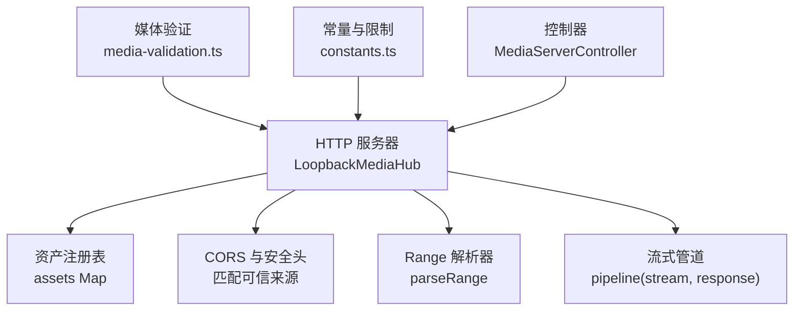
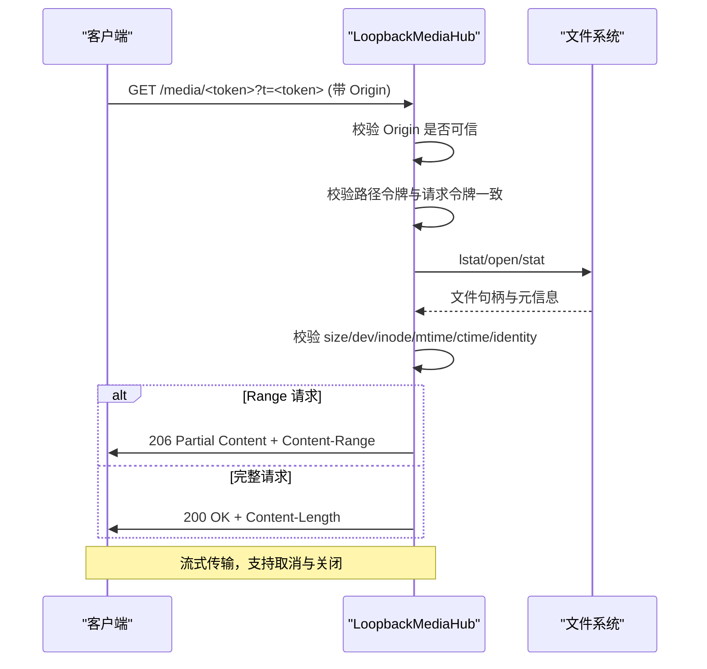
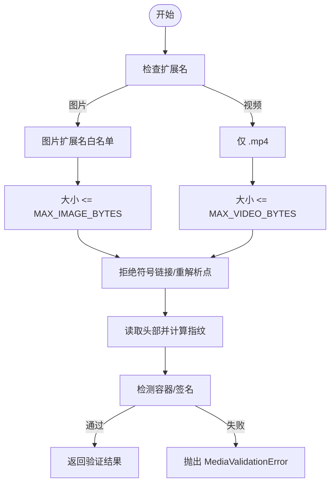
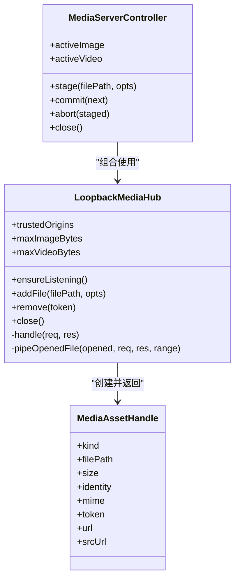
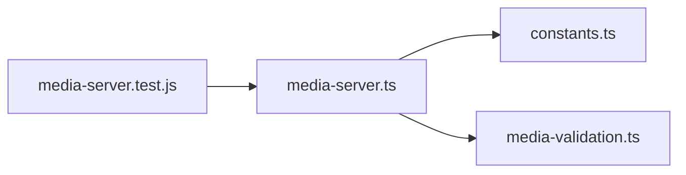

# 媒体服务 API

<cite>
**本文引用的文件**
- [packages/core/src/media-server.ts](file://packages/core/src/media-server.ts)
- [packages/core/src/media-validation.ts](file://packages/core/src/media-validation.ts)
- [packages/core/src/constants.ts](file://packages/core/src/constants.ts)
- [packages/core/test/media-server.test.js](file://packages/core/test/media-server.test.js)
- [docs/security-boundaries.md](file://docs/security-boundaries.md)
- [docs/media-contract.md](file://docs/media-contract.md)
</cite>

## 目录
1. [简介](#简介)
2. [项目结构](#项目结构)
3. [核心组件](#核心组件)
4. [架构总览](#架构总览)
5. [详细组件分析](#详细组件分析)
6. [依赖关系分析](#依赖关系分析)
7. [性能考量](#性能考量)
8. [故障排查指南](#故障排查指南)
9. [结论](#结论)
10. [附录](#附录)

## 简介
本文件为媒体服务的权威技术文档，聚焦于本地回环（loopback）媒体服务器的 HTTP 接口、媒体源抽象、媒体验证机制、RESTful 端点、令牌认证与跨域安全配置，以及性能优化策略。该服务以“每资产随机路径令牌 + 请求头或查询参数令牌”的双重校验为核心，仅绑定 127.0.0.1，确保用户媒体仅在本地进程内安全访问，不暴露任意文件系统。

## 项目结构
媒体服务相关代码集中在 core 包中：
- HTTP 服务器与路由：LoopbackMediaHub、MediaServerController、createMediaServer
- 媒体验证：validateImageFile、validateVideoFile、容器签名检测、大小限制、符号链接/重解析点防护
- 常量与约束：允许的扩展名、最大字节数、默认可信来源、令牌头名称等
- 测试用例：覆盖令牌鉴权、Range 响应、CORS 预检、内容漂移失效、并发中止释放资源等

图表来源
- [packages/core/src/media-server.ts:148-218](file://packages/core/src/media-server.ts#L148-L218)
- [packages/core/src/media-server.ts:406-590](file://packages/core/src/media-server.ts#L406-L590)
- [packages/core/src/media-validation.ts:223-292](file://packages/core/src/media-validation.ts#L223-L292)
- [packages/core/src/constants.ts:24-52](file://packages/core/src/constants.ts#L24-L52)

章节来源
- [packages/core/src/media-server.ts:1-732](file://packages/core/src/media-server.ts#L1-L732)
- [packages/core/src/media-validation.ts:1-358](file://packages/core/src/media-validation.ts#L1-L358)
- [packages/core/src/constants.ts:1-62](file://packages/core/src/constants.ts#L1-L62)

## 核心组件
- LoopbackMediaHub：单端口多资产的本地 HTTP 服务器，负责路由、鉴权、CORS、Range、流式传输与资源清理。
- MediaServerController：管理当前活跃的图片与视频资产，支持 stage/commit/abort/close 生命周期。
- createMediaServer：向后兼容的单资产便捷入口。
- 媒体验证模块：对图片与视频进行格式检查、大小限制、容器签名校验、符号链接/重解析点防护与哈希指纹。

章节来源
- [packages/core/src/media-server.ts:148-732](file://packages/core/src/media-server.ts#L148-L732)
- [packages/core/src/media-validation.ts:223-292](file://packages/core/src/media-validation.ts#L223-L292)

## 架构总览
媒体服务采用“受控的本地 HTTP 服务器 + 严格的内容门控”模式：
- 绑定 127.0.0.1，仅接受来自可信来源的跨域请求（如 app://*）。
- 每个资产生成不可猜测的路径令牌，并强制在请求头或查询参数中携带相同令牌。
- 每次读取前重新 stat 文件，校验设备号、inode、mtime、ctime 与文件大小；必要时全量重算哈希，防止替换攻击。
- 使用 Node stream pipeline 实现零拷贝流式传输，支持 Range 断点续传。
- 通过 AbortController 与连接级超时控制并发与资源释放。

图表来源
- [packages/core/src/media-server.ts:406-590](file://packages/core/src/media-server.ts#L406-L590)
- [packages/core/src/media-server.ts:66-94](file://packages/core/src/media-server.ts#L66-L94)

## 详细组件分析

### HTTP 接口与 RESTful 端点
- 基础 URL：http://127.0.0.1:<port>/media/<token>
- 方法：GET、HEAD、OPTIONS（预检）
- 必需参数：
  - 路径令牌：<token>（16-64 位字母数字）
  - 请求令牌：X-BeautiCode-Media-Token 或查询参数 ?t=<token>
  - 跨域来源：Origin 必须属于可信来源集合或匹配 app://* 前缀
- 可选参数：
  - Range: bytes=start-end 或 bytes=-suffix
- 成功响应：
  - 200 OK：Content-Type 为 image/* 或 video/mp4；Content-Length 等于文件大小；Accept-Ranges: bytes
  - 206 Partial Content：当提供有效 Range；包含 Content-Range
  - 204 No Content：OPTIONS 预检成功
- 错误响应：
  - 403 Forbidden：Origin 不可信或令牌不匹配
  - 404 Not Found：路径不存在、资产已移除、或文件被替换导致身份不一致
  - 416 Range Not Satisfiable：Range 越界或不合法
  - 503 Service Unavailable：服务器关闭中

章节来源
- [packages/core/src/media-server.ts:406-590](file://packages/core/src/media-server.ts#L406-L590)
- [packages/core/test/media-server.test.js:28-137](file://packages/core/test/media-server.test.js#L28-L137)
- [docs/security-boundaries.md:39-44](file://docs/security-boundaries.md#L39-L44)

### 令牌认证与跨域安全
- 令牌来源：
  - 路径令牌：创建资产时由 randomUUID 生成，作为路由的一部分
  - 请求令牌：X-BeautiCode-Media-Token 或 ?t= 查询参数
- 跨域白名单：
  - 默认可信来源包括 app://-, app://, null, app://./, file://
  - 所有 app://* 前缀均视为可信（因仅绑定 127.0.0.1）
- 安全头：
  - Access-Control-Allow-Methods: GET, HEAD, OPTIONS
  - Access-Control-Allow-Headers: Range, X-BeautiCode-Media-Token, Content-Type, Accept
  - Access-Control-Allow-Private-Network: true（Chromium Private Network Access）
  - Vary: Origin
  - Cache-Control: no-store
  - X-Content-Type-Options: nosniff

章节来源
- [packages/core/src/media-server.ts:117-128](file://packages/core/src/media-server.ts#L117-L128)
- [packages/core/src/media-server.ts:413-429](file://packages/core/src/media-server.ts#L413-L429)
- [packages/core/src/constants.ts:24-41](file://packages/core/src/constants.ts#L24-L41)
- [docs/security-boundaries.md:39-44](file://docs/security-boundaries.md#L39-L44)

### 媒体源抽象与统一访问
- 背景媒体清单支持 image 与 video 两种类型，图片始终需要 poster，视频可选 background.mp4
- 媒体源解析将相对路径解析到 active/staging 目录下的实际文件，拒绝绝对路径与非法 basename
- 统一通过 MediaServerController.stage/commit 将本地文件转为可被浏览器 /<video> src 直接使用的 srcUrl

章节来源
- [docs/media-contract.md:1-66](file://docs/media-contract.md#L1-L66)
- [packages/core/src/media-source.ts:1-33](file://packages/core/src/media-source.ts#L1-L33)
- [packages/core/src/media-server.ts:636-732](file://packages/core/src/media-server.ts#L636-L732)

### 媒体验证机制
- 图片验证：
  - 允许扩展名：.jpg/.jpeg/.png/.webp/.avif
  - 大小限制：不超过 MAX_IMAGE_BYTES（约 18 MiB）
  - 内容签名：JPEG/PNG/WEBP/AVIF 魔数检测
  - 路径安全：拒绝符号链接与重解析点，lstat+realpath 校验
- 视频验证：
  - 仅允许 .mp4
  - 大小限制：不超过 MAX_VIDEO_BYTES（约 800 MiB）
  - 容器校验：首块大小为合理范围且类型为 ftyp
  - 路径安全：同上
- 快速模式（fast）：
  - 仅对头部与元数据计算指纹，避免大文件全量哈希
  - 运行时若检测到元数据变化，立即拒绝服务
- 全量模式（full）：
  - 对整文件计算 SHA-256 指纹，确保内容一致性

图表来源
- [packages/core/src/media-validation.ts:223-292](file://packages/core/src/media-validation.ts#L223-L292)
- [packages/core/src/constants.ts:3-13](file://packages/core/src/constants.ts#L3-L13)

章节来源
- [packages/core/src/media-validation.ts:62-123](file://packages/core/src/media-validation.ts#L62-L123)
- [packages/core/src/media-validation.ts:125-190](file://packages/core/src/media-validation.ts#L125-L190)
- [packages/core/src/media-validation.ts:192-292](file://packages/core/src/media-validation.ts#L192-L292)
- [docs/media-contract.md:43-66](file://docs/media-contract.md#L43-L66)

### 流式传输与 Range 请求
- Range 解析：
  - 支持 bytes=start-end 与 bytes=-suffix
  - 非法或越界返回 416 Range Not Satisfiable
- 流式传输：
  - 使用 fs.createReadStream + pipeline 将文件流直接写入响应
  - 自动处理请求中止、响应销毁与服务关闭时的资源释放
- 缓存控制：
  - 禁止缓存：Cache-Control: no-store
  - 暴露必要头：Accept-Ranges, Content-Length, Content-Range, Content-Type

章节来源
- [packages/core/src/media-server.ts:66-94](file://packages/core/src/media-server.ts#L66-L94)
- [packages/core/src/media-server.ts:365-404](file://packages/core/src/media-server.ts#L365-L404)
- [packages/core/src/media-server.ts:524-580](file://packages/core/src/media-server.ts#L524-L580)

### 类与接口关系图

图表来源
- [packages/core/src/media-server.ts:148-335](file://packages/core/src/media-server.ts#L148-L335)
- [packages/core/src/media-server.ts:636-732](file://packages/core/src/media-server.ts#L636-L732)

## 依赖关系分析
- media-server.ts 依赖：
  - constants.ts：媒体扩展名、大小限制、可信来源、令牌头
  - media-validation.ts：图片/视频验证、容器签名检测、路径安全
- 测试覆盖：
  - 令牌鉴权、CORS 预检、Range 响应、内容漂移失效、并发中止释放资源、图片+视频成对提交

图表来源
- [packages/core/src/media-server.ts:1-23](file://packages/core/src/media-server.ts#L1-L23)
- [packages/core/test/media-server.test.js:1-287](file://packages/core/test/media-server.test.js#L1-L287)

章节来源
- [packages/core/src/media-server.ts:1-23](file://packages/core/src/media-server.ts#L1-L23)
- [packages/core/test/media-server.test.js:1-287](file://packages/core/test/media-server.test.js#L1-L287)

## 性能考量
- 流式传输：使用 Node stream pipeline 避免内存峰值，支持 Range 分段下载
- 并发控制：
  - 每 socket 最大请求数：100
  - keepAliveTimeout：5s
  - requestTimeout：30s
  - headersTimeout：10s
- 带宽限制：未实现显式限速，但可通过上游代理或系统网络层限制
- 缓存策略：禁用缓存（no-store），避免陈旧内容
- 预热读取：对大型 MP4 文件预热头部与尾部区域，降低首次播放冷启动延迟
- 资源释放：AbortController 与 closeAllConnections 保证取消与关闭时释放文件句柄与连接

章节来源
- [packages/core/src/media-server.ts:182-218](file://packages/core/src/media-server.ts#L182-L218)
- [packages/core/src/media-server.ts:365-404](file://packages/core/src/media-server.ts#L365-L404)
- [packages/core/src/media-validation.ts:294-328](file://packages/core/src/media-validation.ts#L294-L328)

## 故障排查指南
- 403 未授权：
  - 检查 Origin 是否在可信来源列表或匹配 app://*
  - 确认请求头 X-BeautiCode-Media-Token 或查询参数 ?t= 与路径令牌一致
- 404 未找到：
  - 资产已被移除或服务器关闭
  - 文件被替换导致 identity 不一致（即使同大小）
- 416 范围无效：
  - Range 越界或不合法，检查 start/end 与文件大小
- 流式传输卡住：
  - 检查客户端是否主动中止请求
  - 确认服务端未关闭且连接未被回收
- CORS 预检失败：
  - 确认 OPTIONS 请求包含正确的 Access-Control-Request-Headers
  - 检查 Access-Control-Allow-Private-Network 是否开启

章节来源
- [packages/core/src/media-server.ts:436-486](file://packages/core/src/media-server.ts#L436-L486)
- [packages/core/src/media-server.ts:524-580](file://packages/core/src/media-server.ts#L524-L580)
- [packages/core/test/media-server.test.js:96-117](file://packages/core/test/media-server.test.js#L96-L117)

## 结论
媒体服务通过严格的本地绑定、双重令牌鉴权、内容门控与流式传输，提供了安全、高效、可调试的背景媒体服务能力。其设计兼顾了安全性与性能，适用于 Electron 或 Chromium 宿主环境中的本地主题与背景媒体场景。建议在生产环境中结合上游代理实现带宽限制与监控，并持续关注媒体验证规则与容器兼容性。

## 附录

### 客户端集成示例（基于测试用例）
- 获取资产后，使用 srcUrl 直接赋值给 /<video> 的 src，无需设置自定义头
- 对于非媒体元素或需要自定义头的场景，使用 url 并在请求头中携带 X-BeautiCode-Media-Token
- 支持 Range 请求，可用于进度条与分片加载

章节来源
- [packages/core/test/media-server.test.js:47-95](file://packages/core/test/media-server.test.js#L47-L95)
- [packages/core/test/media-server.test.js:200-266](file://packages/core/test/media-server.test.js#L200-L266)

### 错误处理模式
- 媒体验证失败：抛出 MediaValidationError，调用方应捕获并回滚事务
- 内容漂移：同一 token 的文件内容变化会导致后续请求返回 404
- 资源泄漏：确保在异常路径关闭 FileHandle 与 AbortController

章节来源
- [packages/core/src/media-validation.ts:53-58](file://packages/core/src/media-validation.ts#L53-L58)
- [packages/core/src/media-server.ts:488-589](file://packages/core/src/media-server.ts#L488-L589)
- [packages/core/test/media-server.test.js:139-198](file://packages/core/test/media-server.test.js#L139-L198)