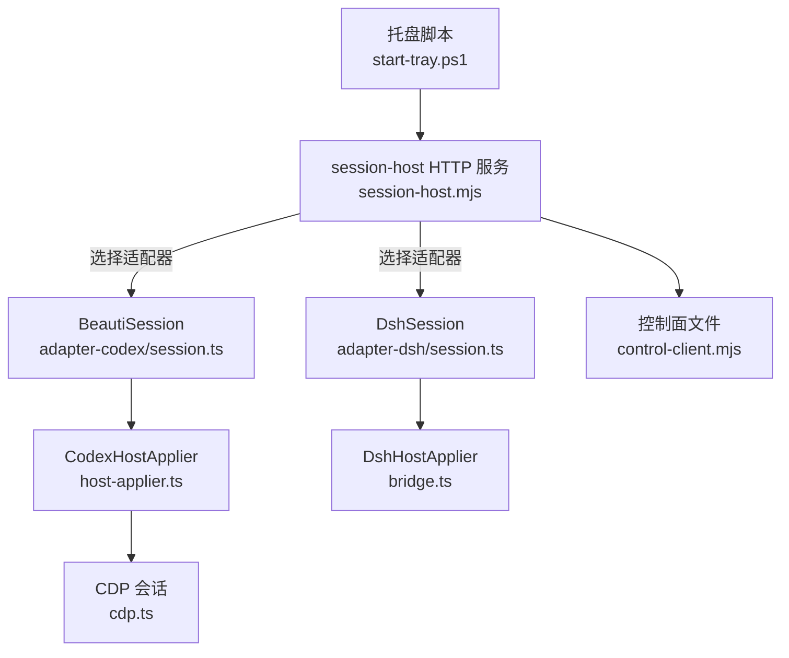
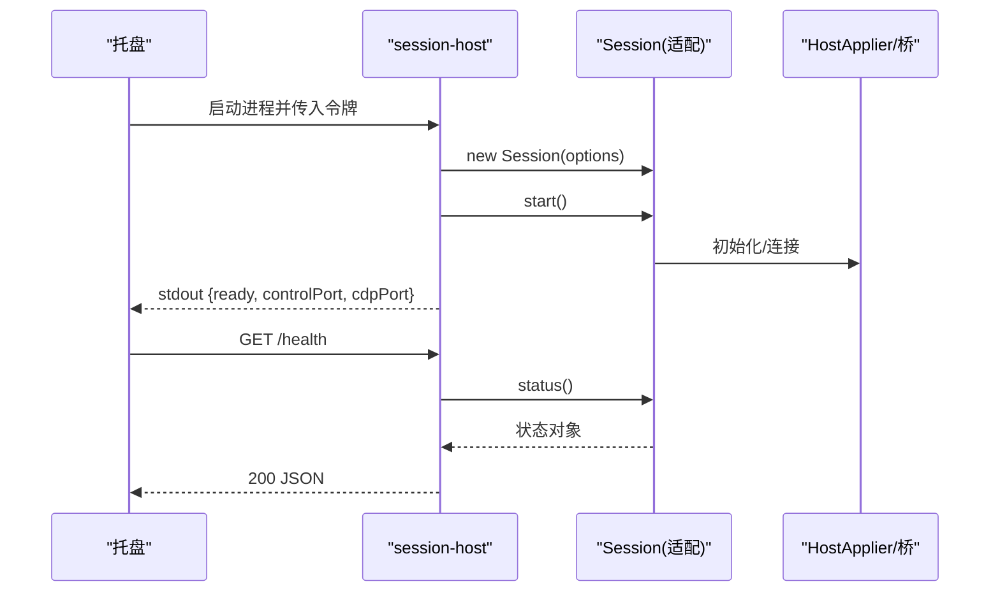
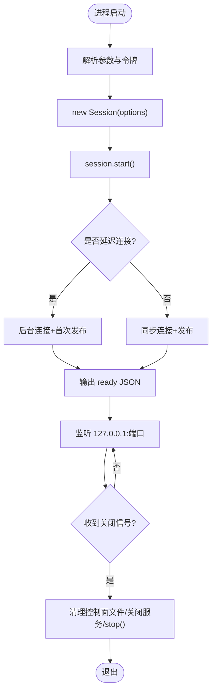
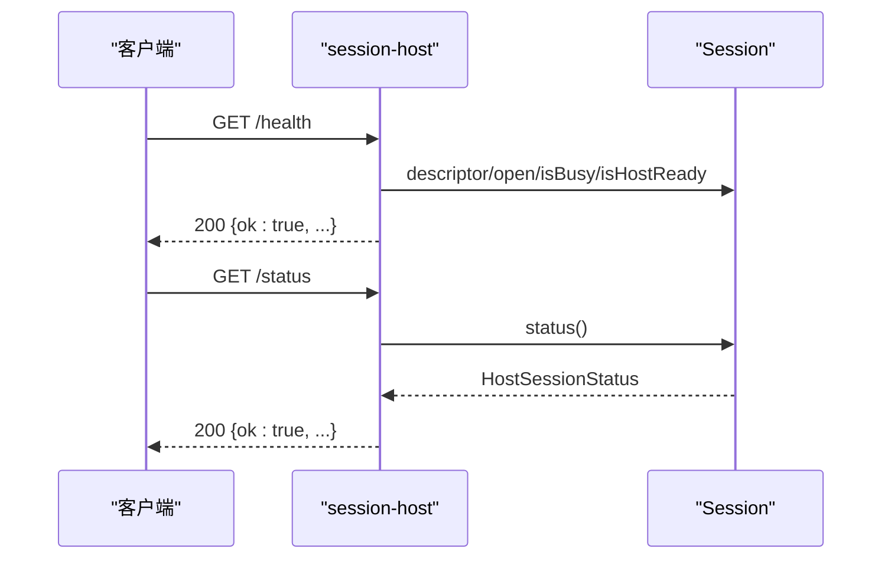
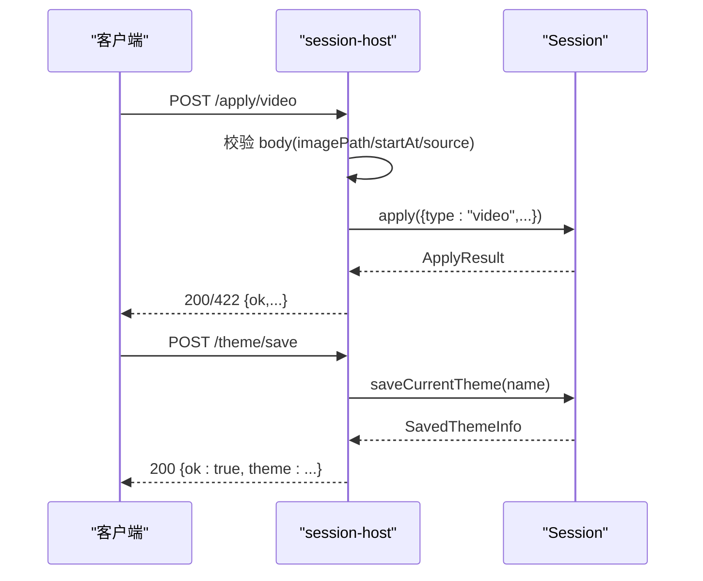
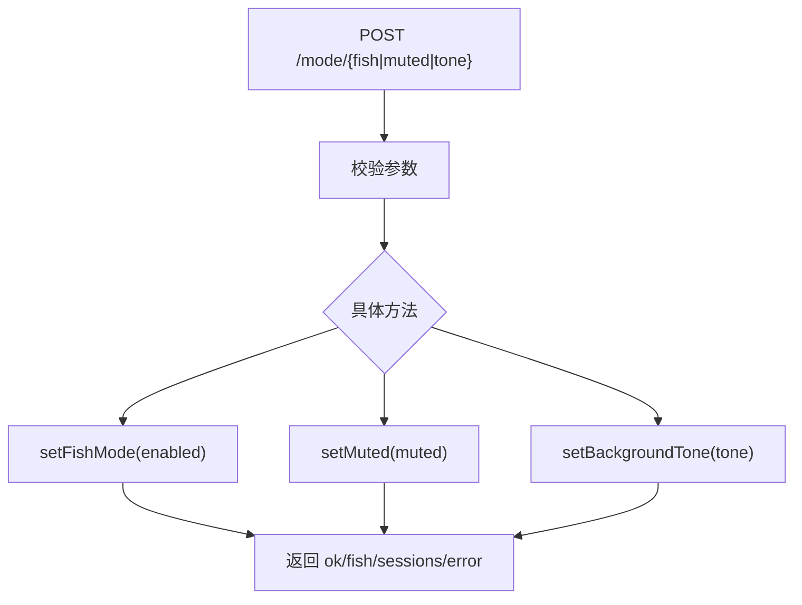
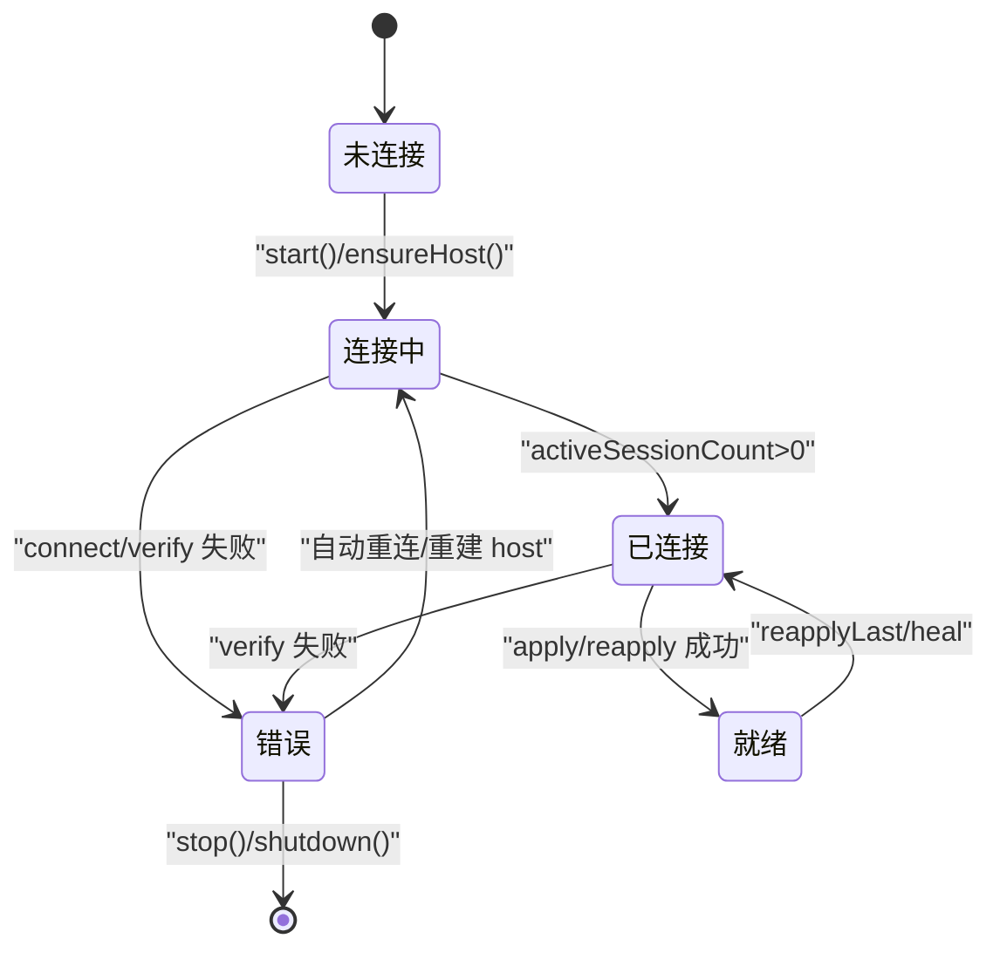
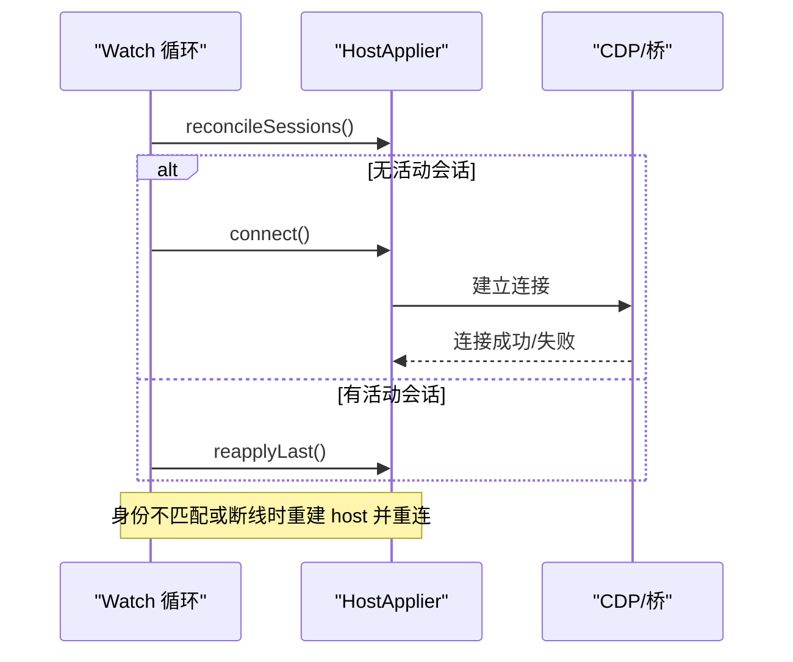
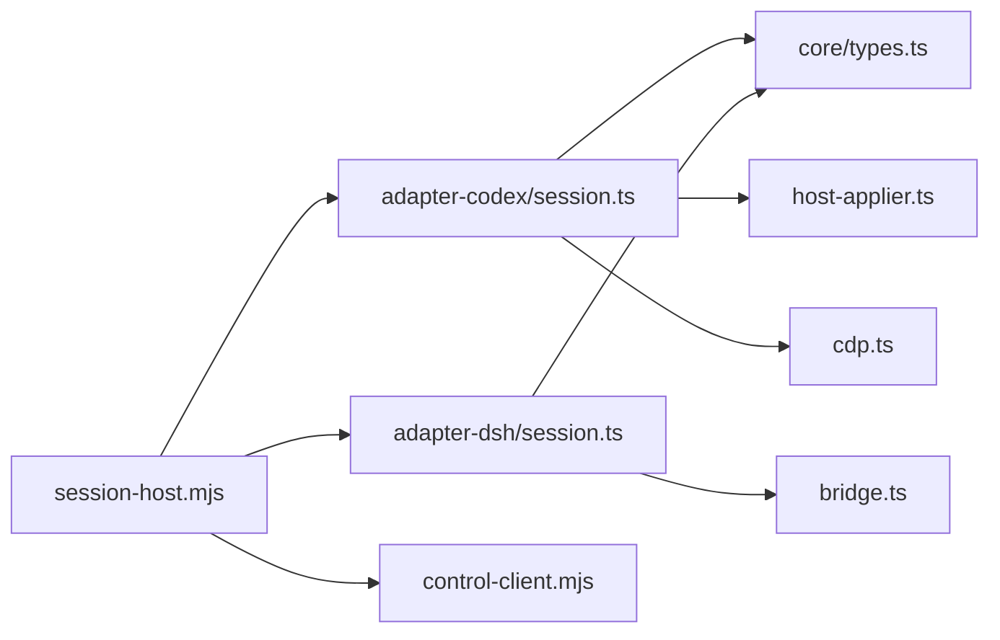

# 宿主会话 API

<cite>
**本文引用的文件**
- [apps/tray/session-host.mjs](file://apps/tray/session-host.mjs)
- [packages/adapter-codex/src/session.ts](file://packages/adapter-codex/src/session.ts)
- [packages/adapter-dsh/src/session.ts](file://packages/adapter-dsh/src/session.ts)
- [packages/core/src/types.ts](file://packages/core/src/types.ts)
- [packages/core/src/error-message.ts](file://packages/core/src/error-message.ts)
- [integrations/deepseek-harness/control-client.mjs](file://integrations/deepseek-harness/control-client.mjs)
- [packages/adapter-codex/src/host-applier.ts](file://packages/adapter-codex/src/host-applier.ts)
- [packages/adapter-codex/src/cdp.ts](file://packages/adapter-codex/src/cdp.ts)
- [packages/adapter-dsh/src/bridge.ts](file://packages/adapter-dsh/src/bridge.ts)
- [apps/tray/start-tray.ps1](file://apps/tray/start-tray.ps1)
</cite>

## 目录
1. [简介](#简介)
2. [项目结构](#项目结构)
3. [核心组件](#核心组件)
4. [架构总览](#架构总览)
5. [详细组件分析](#详细组件分析)
6. [依赖关系分析](#依赖关系分析)
7. [性能考虑](#性能考虑)
8. [故障排除指南](#故障排除指南)
9. [结论](#结论)
10. [附录：API 参考与示例](#附录api-参考与示例)

## 简介
本文件面向“宿主会话管理 API”，围绕 HostSession 接口及其两种实现（Codex 与 DeepSeek Harness）进行系统化说明。内容涵盖：
- 连接建立、状态查询、背景应用与主题生命周期管理
- 每个方法的参数类型、返回值格式与错误情况
- 会话状态机：连接状态、就绪状态、错误状态的转换逻辑
- 进程存活检测与自动重连策略
- 完整调用流程示例（以代码片段路径形式给出）
- 故障排除与性能优化建议

## 项目结构
宿主的控制面由托盘进程启动的 session-host 提供，内部通过适配器封装不同后端（Codex CDP 或 DSH 桥），统一暴露 HostSession 能力。关键文件职责如下：
- apps/tray/session-host.mjs：HTTP 控制面入口，鉴权、路由、转发到 Session 实例
- packages/adapter-codex/src/session.ts：BeautiSession（Codex 路径）
- packages/adapter-dsh/src/session.ts：DshSession（DSH 桥路径）
- packages/core/src/types.ts：HostSession 相关类型定义（ApplyInput、ApplyResult、HostSessionStatus 等）
- integrations/deepseek-harness/control-client.mjs：控制面文件读写与进程健康检查
- packages/adapter-codex/src/host-applier.ts：CDP 目标发现、注入、验证、重连
- packages/adapter-codex/src/cdp.ts：CDP WebSocket 会话封装
- packages/adapter-dsh/src/bridge.ts：DSH 桥接器，HTTP 调用与状态轮询
- apps/tray/start-tray.ps1：托盘侧进程管理与握手

**图表来源**
- [apps/tray/session-host.mjs:290-540](file://apps/tray/session-host.mjs#L290-L540)
- [packages/adapter-codex/src/session.ts:56-153](file://packages/adapter-codex/src/session.ts#L56-L153)
- [packages/adapter-dsh/src/session.ts:50-142](file://packages/adapter-dsh/src/session.ts#L50-L142)
- [packages/adapter-codex/src/host-applier.ts:121-158](file://packages/adapter-codex/src/host-applier.ts#L121-L158)
- [packages/adapter-codex/src/cdp.ts:215-238](file://packages/adapter-codex/src/cdp.ts#L215-L238)
- [packages/adapter-dsh/src/bridge.ts:85-124](file://packages/adapter-dsh/src/bridge.ts#L85-L124)
- [integrations/deepseek-harness/control-client.mjs:243-266](file://integrations/deepseek-harness/control-client.mjs#L243-L266)

**章节来源**
- [apps/tray/session-host.mjs:1-639](file://apps/tray/session-host.mjs#L1-L639)
- [packages/adapter-codex/src/session.ts:1-946](file://packages/adapter-codex/src/session.ts#L1-L946)
- [packages/adapter-dsh/src/session.ts:1-675](file://packages/adapter-dsh/src/session.ts#L1-L675)
- [packages/core/src/types.ts:1-215](file://packages/core/src/types.ts#L1-L215)
- [integrations/deepseek-harness/control-client.mjs:223-351](file://integrations/deepseek-harness/control-client.mjs#L223-L351)

## 核心组件
- HostSession 接口：统一抽象，包含 start、apply、reapply、status、saveCurrentTheme、listSavedThemes、deleteSavedTheme、useSavedTheme、setFishMode、setMuted、setBackgroundTone、stop 等方法；以及 isOpen、isBusy、isHostReady、descriptor、cdpPort 等属性。
- BeautiSession（Codex）：基于 CDP 注入，支持图片/视频背景、主题保存与恢复、摸鱼模式、静音、背景色调等。
- DshSession（DeepSeek Harness）：通过本地桥 HTTP 协议与 DSH 交互，具备相同的能力模型，但媒体传输方式不同。
- session-host HTTP 服务：对外暴露 /health、/status、/apply/*、/theme/*、/mode/*、/discover、/shutdown 等端点，负责鉴权、参数校验、错误翻译与响应。

**章节来源**
- [packages/core/src/types.ts:107-215](file://packages/core/src/types.ts#L107-L215)
- [packages/adapter-codex/src/session.ts:56-153](file://packages/adapter-codex/src/session.ts#L56-L153)
- [packages/adapter-dsh/src/session.ts:50-142](file://packages/adapter-dsh/src/session.ts#L50-L142)
- [apps/tray/session-host.mjs:290-540](file://apps/tray/session-host.mjs#L290-L540)

## 架构总览
- 托盘进程通过 PowerShell 启动 session-host，并等待其输出 ready JSON，获取 controlPort 与 cdpPort。
- session-host 启动 HTTP 服务器，监听 127.0.0.1，所有请求需携带 Bearer Token 鉴权。
- 根据 --host 参数选择适配器（codex 或 dsh），创建对应 Session 实例。
- 对 /apply/*、/theme/*、/mode/* 的请求，解析并校验请求体后调用 Session 方法，返回统一结果对象。
- 后台 watch 循环持续探测/修复宿主连接，必要时触发 reapplyLast 或重新发布当前背景。
- 进程退出时清理控制面文件、关闭服务器与 Session。

**图表来源**
- [apps/tray/start-tray.ps1:800-847](file://apps/tray/start-tray.ps1#L800-L847)
- [apps/tray/session-host.mjs:574-639](file://apps/tray/session-host.mjs#L574-L639)
- [packages/adapter-codex/src/session.ts:167-196](file://packages/adapter-codex/src/session.ts#L167-L196)
- [packages/adapter-dsh/src/session.ts:118-142](file://packages/adapter-dsh/src/session.ts#L118-L142)

## 详细组件分析

### 1) 连接建立与会话生命周期
- 启动流程
  - session-host 读取参数（host、port、dataRoot、parent-pid、verify-ms 等），构造 Session 选项。
  - 创建 BeautiSession 或 DshSession，调用 start() 完成 store 初始化、锁获取、桥/CDP 连接。
  - 托盘侧通过 stdout 的 ready JSON 获知 controlPort 与 cdpPort。
- 停止流程
  - 收到 /shutdown 或信号量时，写入/移除控制面文件，关闭 HTTP 服务，调用 session.stop()，释放资源。

**图表来源**
- [apps/tray/session-host.mjs:148-199](file://apps/tray/session-host.mjs#L148-L199)
- [apps/tray/session-host.mjs:546-572](file://apps/tray/session-host.mjs#L546-L572)
- [packages/adapter-codex/src/session.ts:167-196](file://packages/adapter-codex/src/session.ts#L167-L196)
- [packages/adapter-dsh/src/session.ts:118-142](file://packages/adapter-dsh/src/session.ts#L118-L142)

**章节来源**
- [apps/tray/session-host.mjs:109-199](file://apps/tray/session-host.mjs#L109-L199)
- [apps/tray/session-host.mjs:546-639](file://apps/tray/session-host.mjs#L546-L639)
- [packages/adapter-codex/src/session.ts:167-196](file://packages/adapter-codex/src/session.ts#L167-L196)
- [packages/adapter-dsh/src/session.ts:118-142](file://packages/adapter-dsh/src/session.ts#L118-L142)

### 2) 状态查询与健康检查
- /health：返回 host、port、open、busy、hostReady 等基础信息。
- /status：调用 session.status()，返回更详细的 manifest、sessions、mediaServer、fish/muted/tone/themeId 等。
- 托盘侧通过控制面文件与 /health 判断进程存活与服务可用性。

**图表来源**
- [apps/tray/session-host.mjs:303-321](file://apps/tray/session-host.mjs#L303-L321)
- [packages/adapter-codex/src/session.ts:334-349](file://packages/adapter-codex/src/session.ts#L334-L349)
- [packages/adapter-dsh/src/session.ts:380-394](file://packages/adapter-dsh/src/session.ts#L380-L394)
- [integrations/deepseek-harness/control-client.mjs:243-266](file://integrations/deepseek-harness/control-client.mjs#L243-L266)

**章节来源**
- [apps/tray/session-host.mjs:303-321](file://apps/tray/session-host.mjs#L303-L321)
- [packages/adapter-codex/src/session.ts:334-349](file://packages/adapter-codex/src/session.ts#L334-L349)
- [packages/adapter-dsh/src/session.ts:380-394](file://packages/adapter-dsh/src/session.ts#L380-L394)
- [integrations/deepseek-harness/control-client.mjs:243-266](file://integrations/deepseek-harness/control-client.mjs#L243-L266)

### 3) 背景应用与主题管理
- 背景应用
  - /apply/image：校验 imagePath/source/effects，调用 session.apply({type:"image",...})。
  - /apply/video：校验 videoPath/imagePath/startAt/source，调用 session.apply({type:"video",...})。
  - /apply/clear：调用 session.apply({type:"clear"})。
  - /reapply：调用 session.reapply()，将当前背景重新发布到活跃会话。
- 主题管理
  - /theme/apply：校验 name/input，调用 applyAndSaveTheme(input,name)。
  - /theme/save：调用 saveCurrentTheme(name)，返回已保存主题。
  - /theme/list：调用 listSavedThemes()，返回主题列表。
  - /theme/use：调用 useSavedTheme(id)，恢复指定主题。
  - /theme/delete：调用 deleteSavedTheme(id)，删除主题。

**图表来源**
- [apps/tray/session-host.mjs:363-418](file://apps/tray/session-host.mjs#L363-L418)
- [apps/tray/session-host.mjs:420-492](file://apps/tray/session-host.mjs#L420-L492)
- [packages/adapter-codex/src/session.ts:275-332](file://packages/adapter-codex/src/session.ts#L275-L332)
- [packages/adapter-dsh/src/session.ts:144-264](file://packages/adapter-dsh/src/session.ts#L144-L264)

**章节来源**
- [apps/tray/session-host.mjs:363-492](file://apps/tray/session-host.mjs#L363-L492)
- [packages/adapter-codex/src/session.ts:275-666](file://packages/adapter-codex/src/session.ts#L275-L666)
- [packages/adapter-dsh/src/session.ts:144-443](file://packages/adapter-dsh/src/session.ts#L144-L443)

### 4) 模式设置（摸鱼、静音、背景色调）
- /mode/fish：设置摸鱼模式（仅渲染器属性）。
- /mode/muted：设置视频静音。
- /mode/tone：设置背景色调（dark/light/auto）。

**图表来源**
- [apps/tray/session-host.mjs:493-522](file://apps/tray/session-host.mjs#L493-L522)
- [packages/adapter-codex/src/session.ts:355-493](file://packages/adapter-codex/src/session.ts#L355-L493)
- [packages/adapter-dsh/src/session.ts:445-537](file://packages/adapter-dsh/src/session.ts#L445-L537)

**章节来源**
- [apps/tray/session-host.mjs:493-522](file://apps/tray/session-host.mjs#L493-L522)
- [packages/adapter-codex/src/session.ts:355-493](file://packages/adapter-codex/src/session.ts#L355-L493)
- [packages/adapter-dsh/src/session.ts:445-537](file://packages/adapter-dsh/src/session.ts#L445-L537)

### 5) 会话状态机
- 连接状态
  - 未连接：isOpen=false 或 isHostReady=false。
  - 连接中：start() 已完成 store/lock 初始化，但 host 可能仍在连接（deferHostConnect=true 时）。
  - 已连接：activeSessionCount>0，isHostReady=true。
- 就绪状态
  - 成功应用或重新应用并通过 verify，进入就绪。
  - 若 verify 失败，进入错误态，watch 会尝试修复或重试。
- 错误状态
  - 常见错误：CDP 身份不匹配、无活动会话、超时、媒体解码失败等。
  - 错误处理：记录错误、尝试重建 host、reapplyLast 或 full republish。

**图表来源**
- [packages/adapter-codex/src/session.ts:202-273](file://packages/adapter-codex/src/session.ts#L202-L273)
- [packages/adapter-codex/src/host-applier.ts:121-158](file://packages/adapter-codex/src/host-applier.ts#L121-L158)
- [packages/adapter-codex/src/host-applier.ts:709-782](file://packages/adapter-codex/src/host-applier.ts#L709-L782)
- [packages/adapter-dsh/src/session.ts:594-637](file://packages/adapter-dsh/src/session.ts#L594-L637)

**章节来源**
- [packages/adapter-codex/src/session.ts:202-273](file://packages/adapter-codex/src/session.ts#L202-L273)
- [packages/adapter-codex/src/host-applier.ts:121-158](file://packages/adapter-codex/src/host-applier.ts#L121-L158)
- [packages/adapter-codex/src/host-applier.ts:709-782](file://packages/adapter-codex/src/host-applier.ts#L709-L782)
- [packages/adapter-dsh/src/session.ts:594-637](file://packages/adapter-dsh/src/session.ts#L594-L637)

### 6) 进程存活检测与自动重连
- 进程存活检测
  - 托盘侧通过控制面文件读取 pid/url/token，并调用 /health 检查服务可达性。
  - session-host 在启动时校验父进程存活，并在运行期间周期性检测父进程，异常则安全退出。
- 自动重连
  - Codex：当 CDP 浏览器身份变化或 socket 断开，捕获 CdpIdentityMismatchError，重建 host 并重连。
  - DSH：watch 周期检测 connectedClients 与 media 一致性，必要时触发 reapply。

**图表来源**
- [packages/adapter-codex/src/host-applier.ts:121-158](file://packages/adapter-codex/src/host-applier.ts#L121-L158)
- [packages/adapter-codex/src/host-applier.ts:709-782](file://packages/adapter-codex/src/host-applier.ts#L709-L782)
- [packages/adapter-codex/src/session.ts:238-273](file://packages/adapter-codex/src/session.ts#L238-L273)
- [packages/adapter-dsh/src/session.ts:594-637](file://packages/adapter-dsh/src/session.ts#L594-L637)
- [integrations/deepseek-harness/control-client.mjs:243-266](file://integrations/deepseek-harness/control-client.mjs#L243-L266)

**章节来源**
- [packages/adapter-codex/src/session.ts:238-273](file://packages/adapter-codex/src/session.ts#L238-L273)
- [packages/adapter-codex/src/host-applier.ts:121-158](file://packages/adapter-codex/src/host-applier.ts#L121-L158)
- [packages/adapter-codex/src/host-applier.ts:709-782](file://packages/adapter-codex/src/host-applier.ts#L709-L782)
- [packages/adapter-dsh/src/session.ts:594-637](file://packages/adapter-dsh/src/session.ts#L594-L637)
- [integrations/deepseek-harness/control-client.mjs:243-266](file://integrations/deepseek-harness/control-client.mjs#L243-L266)

## 依赖关系分析
- session-host 依赖适配器模块导出 SessionClass 与 toChineseErrorMessage。
- BeautiSession 依赖 BackgroundStore、MediaServerController、CodexHostApplier、CDP。
- DshSession 依赖 BackgroundStore、MediaServerController、DshHostApplier（桥）、注入锁与令牌。
- 控制面文件读写用于进程间通信与存活检测。

**图表来源**
- [apps/tray/session-host.mjs:148-199](file://apps/tray/session-host.mjs#L148-L199)
- [packages/adapter-codex/src/session.ts:1-26](file://packages/adapter-codex/src/session.ts#L1-L26)
- [packages/adapter-dsh/src/session.ts:1-23](file://packages/adapter-dsh/src/session.ts#L1-L23)
- [integrations/deepseek-harness/control-client.mjs:243-266](file://integrations/deepseek-harness/control-client.mjs#L243-L266)

**章节来源**
- [apps/tray/session-host.mjs:148-199](file://apps/tray/session-host.mjs#L148-L199)
- [packages/adapter-codex/src/session.ts:1-26](file://packages/adapter-codex/src/session.ts#L1-L26)
- [packages/adapter-dsh/src/session.ts:1-23](file://packages/adapter-dsh/src/session.ts#L1-L23)
- [integrations/deepseek-harness/control-client.mjs:243-266](file://integrations/deepseek-harness/control-client.mjs#L243-L266)

## 性能考虑
- 延迟连接：托盘场景默认 deferHostConnect=true，使控制面尽快可用，CDP 连接与首次发布在后台执行。
- 轮询间隔：Codex 默认 pollMs=1000ms，DSH 默认 2000ms；watch 循环避免阻塞用户操作。
- 验证超时：verifyDeadlineMs 控制 live verify 时间上限，避免长时间挂起。
- 资源限制：HTTP 服务设置 requestTimeout、headersTimeout、maxRequestsPerSocket，防止资源泄漏。
- 媒体流控：DSH 路径启用 MediaServerController，支持 Range 请求与流式传输；Codex 路径禁用 HTTP 媒体控制器以避免 CSP 限制。

[本节为通用指导，无需特定文件引用]

## 故障排除指南
- 未授权请求
  - 现象：/health 或 /status 返回 401。
  - 排查：确认 Authorization: Bearer <token> 与 BEAUTICODE_CONTROL_TOKEN 一致且长度足够。
- 服务正在关闭
  - 现象：返回 503。
  - 排查：检查是否收到 /shutdown 或父进程退出导致的安全退出。
- 未找到请求的资源
  - 现象：404。
  - 排查：确认 URL 与方法正确。
- 请求体过大或非 JSON 对象
  - 现象：413/400。
  - 排查：限制请求大小，确保 body 为 JSON 对象。
- 没有活动的 CDP 会话
  - 现象：apply/reapply 失败。
  - 排查：确保 Codex Desktop 已打开并处于可注入页面；检查 autoDiscover 与 port 配置。
- CDP 身份不匹配
  - 现象：CdpIdentityMismatchError。
  - 排查：重启 Codex 会导致浏览器身份变化，系统会自动重建 host 并重连。
- 视频首帧冷启动失败
  - 现象：verify 第一次 fail/inconclusive。
  - 排查：事务层会重试一次；如仍失败，检查 MP4 是否可解码。

**章节来源**
- [apps/tray/session-host.mjs:275-288](file://apps/tray/session-host.mjs#L275-L288)
- [apps/tray/session-host.mjs:298-301](file://apps/tray/session-host.mjs#L298-L301)
- [apps/tray/session-host.mjs:528-538](file://apps/tray/session-host.mjs#L528-L538)
- [packages/adapter-codex/src/session.ts:202-273](file://packages/adapter-codex/src/session.ts#L202-L273)
- [packages/core/src/error-message.ts:53-70](file://packages/core/src/error-message.ts#L53-L70)
- [packages/core/src/error-message.ts:174-210](file://packages/core/src/error-message.ts#L174-L210)

## 结论
宿主会话 API 通过统一的 HostSession 接口屏蔽了不同后端差异，提供了稳定的背景应用与主题管理能力。托盘侧的 session-host 提供安全的本地 HTTP 控制面，结合进程存活检测与自动重连机制，确保在复杂环境下仍能可靠工作。遵循本文的状态机与错误处理策略，可有效提升系统的稳定性与用户体验。

[本节为总结性内容，无需特定文件引用]

## 附录：API 参考与示例

### HostSession 方法概览
- start(): Promise<{ port: number | null }>
  - 作用：初始化存储、获取注入锁、连接宿主。
  - 返回：端口信息（Codex 为 CDP 端口，DSH 为桥端口）。
  - 错误：会话已停止、已启动、桥令牌缺失等。
- apply(input: ApplyInput): Promise<ApplyResult>
  - 作用：应用图片/视频背景或清除。
  - 参数：见 types.ts ApplyInput。
  - 返回：ApplyResult（ok、generation、mode、error、timings 等）。
  - 错误：会话未启动、已有后台操作进行中、验证失败等。
- reapply(): Promise<ApplyResult>
  - 作用：将当前背景重新发布到活跃会话。
  - 返回：ApplyResult。
  - 错误：会话未启动、验证失败等。
- status(): Promise<HostSessionStatus>
  - 作用：查询会话状态与当前背景信息。
  - 返回：HostSessionStatus（host、port、sessions、manifest、mediaServer、fish、muted、tone、themeId）。
- saveCurrentTheme(name: string): Promise<SavedThemeInfo>
  - 作用：保存当前背景为命名主题。
  - 返回：SavedThemeInfo。
- listSavedThemes(): Promise<SavedThemeInfo[]>
  - 作用：列出已保存主题。
- deleteSavedTheme(themeId: string): Promise<boolean>
  - 作用：删除指定主题。
- useSavedTheme(themeId: string): Promise<ApplyResult>
  - 作用：恢复指定主题并应用到活跃会话。
- setFishMode(enabled: boolean): Promise<{ ok, fish, sessions, error? }>
  - 作用：切换摸鱼模式。
- setMuted(muted: boolean): Promise<{ ok, muted, blocked, sessions, error? }>
  - 作用：切换视频静音。
- setBackgroundTone(tone: BackgroundTone): Promise<{ ok, tone, sessions, error? }>
  - 作用：设置背景色调。
- stop(): Promise<void>
  - 作用：停止会话，释放资源。

**章节来源**
- [packages/core/src/types.ts:107-215](file://packages/core/src/types.ts#L107-L215)
- [packages/adapter-codex/src/session.ts:275-666](file://packages/adapter-codex/src/session.ts#L275-L666)
- [packages/adapter-dsh/src/session.ts:144-443](file://packages/adapter-dsh/src/session.ts#L144-L443)

### HTTP 控制面端点
- GET /health：返回基础健康信息。
- GET /status：返回详细状态。
- POST /apply/image：应用图片背景。
- POST /apply/video：应用视频背景。
- POST /apply/clear：清除背景。
- POST /reapply：重新应用当前背景。
- POST /theme/apply：应用并保存主题。
- POST /theme/save：保存当前主题。
- GET /theme/list：列出主题。
- POST /theme/use：使用主题。
- POST /theme/delete：删除主题。
- POST /mode/fish：设置摸鱼模式。
- POST /mode/muted：设置静音。
- POST /mode/tone：设置背景色调。
- POST /discover：发现 CDP 或 DSH 端点。
- POST /shutdown：安全关闭服务。

**章节来源**
- [apps/tray/session-host.mjs:303-527](file://apps/tray/session-host.mjs#L303-L527)

### 示例流程（以代码片段路径表示）
- 初始化会话并启动
  - [packages/adapter-codex/src/session.ts:167-196](file://packages/adapter-codex/src/session.ts#L167-L196)
  - [packages/adapter-dsh/src/session.ts:118-142](file://packages/adapter-dsh/src/session.ts#L118-L142)
- 应用图片背景
  - [apps/tray/session-host.mjs:363-380](file://apps/tray/session-host.mjs#L363-L380)
  - [packages/adapter-codex/src/session.ts:275-332](file://packages/adapter-codex/src/session.ts#L275-L332)
- 应用视频背景并保存主题
  - [apps/tray/session-host.mjs:381-418](file://apps/tray/session-host.mjs#L381-L418)
  - [packages/adapter-dsh/src/session.ts:148-264](file://packages/adapter-dsh/src/session.ts#L148-L264)
- 查询状态与健康检查
  - [apps/tray/session-host.mjs:303-321](file://apps/tray/session-host.mjs#L303-L321)
  - [packages/adapter-codex/src/session.ts:334-349](file://packages/adapter-codex/src/session.ts#L334-L349)
- 重新应用与模式设置
  - [apps/tray/session-host.mjs:415-522](file://apps/tray/session-host.mjs#L415-L522)
  - [packages/adapter-codex/src/session.ts:499-551](file://packages/adapter-codex/src/session.ts#L499-L551)
- 安全关闭与资源释放
  - [apps/tray/session-host.mjs:546-572](file://apps/tray/session-host.mjs#L546-L572)
  - [packages/adapter-codex/src/session.ts:668-705](file://packages/adapter-codex/src/session.ts#L668-L705)