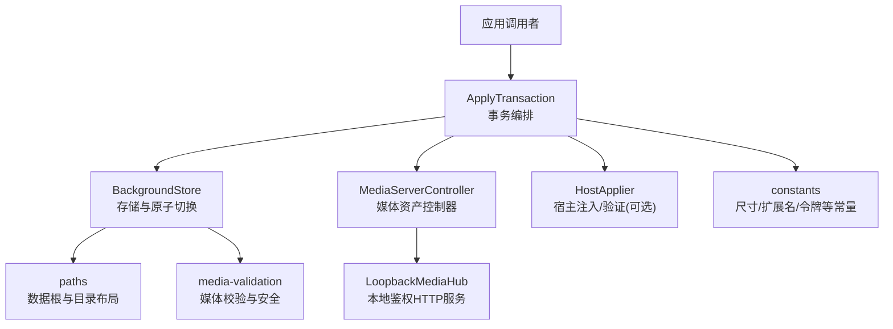
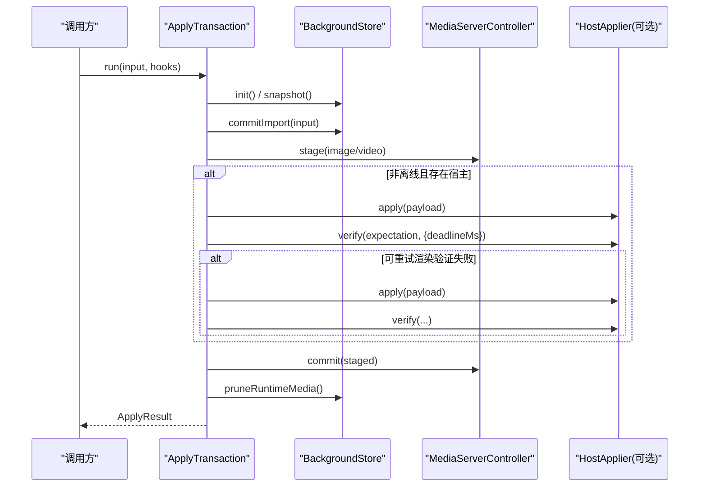
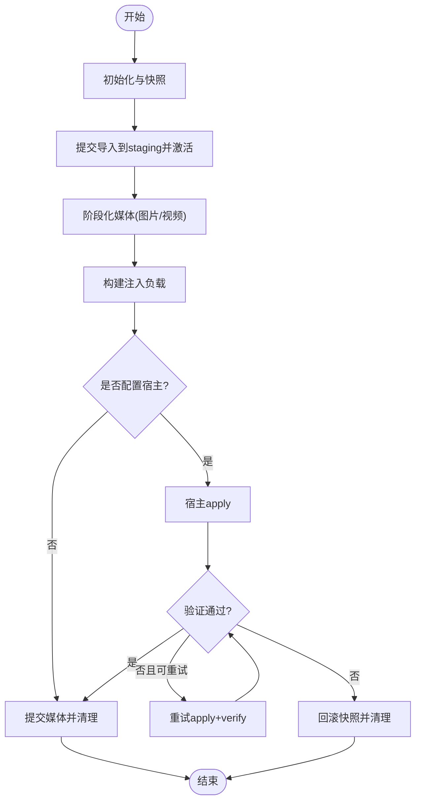
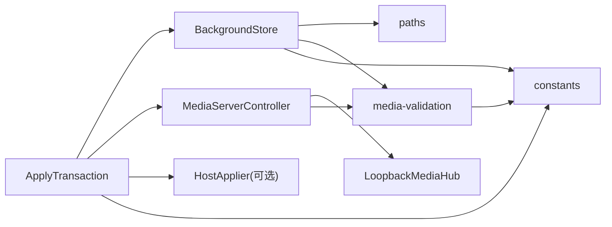

# 核心 API

<cite>
**本文引用的文件**
- [packages/core/src/index.ts](file://packages/core/src/index.ts)
- [packages/core/src/types.ts](file://packages/core/src/types.ts)
- [packages/core/src/constants.ts](file://packages/core/src/constants.ts)
- [packages/core/src/apply-transaction.ts](file://packages/core/src/apply-transaction.ts)
- [packages/core/src/background-store.ts](file://packages/core/src/background-store.ts)
- [packages/core/src/media-validation.ts](file://packages/core/src/media-validation.ts)
- [packages/core/src/media-server.ts](file://packages/core/src/media-server.ts)
- [packages/core/src/paths.ts](file://packages/core/src/paths.ts)
- [packages/core/package.json](file://packages/core/package.json)
- [package.json](file://package.json)
</cite>

## 目录
1. [简介](#简介)
2. [项目结构](#项目结构)
3. [核心组件](#核心组件)
4. [架构总览](#架构总览)
5. [详细组件分析](#详细组件分析)
6. [依赖关系分析](#依赖关系分析)
7. [性能考量](#性能考量)
8. [故障排查指南](#故障排查指南)
9. [结论](#结论)
10. [附录：使用示例与最佳实践](#附录使用示例与最佳实践)

## 简介
本文件面向开发者，系统化梳理 beautiCode 核心包 @beauticode/core 的公共 API、类型系统、常量配置与基础接口。重点说明 BackgroundManifest、ApplyInput、ApplyResult 等核心数据结构的设计意图、字段约束与使用方式；解释超时、文件大小限制、来源模式等关键配置项；并提供类型安全与错误处理的最佳实践，以及版本兼容性与迁移建议。

## 项目结构
核心包以“能力分层 + 职责单一”的方式组织：
- 类型与常量：集中定义跨模块共享的类型与常量
- 事务编排：ApplyTransaction 负责背景应用的端到端流程（快照、提交、媒体阶段化、宿主注入、验证、回滚）
- 存储层：BackgroundStore 管理 active/staging/snapshots/saved/runtime-media 目录与原子切换
- 媒体服务：MediaServerController/LoopbackMediaHub 提供本地鉴权流式服务，支持 Range、CORS、Token
- 校验层：media-validation 对图片/视频进行格式、大小、内容签名校验与安全路径检查
- 路径与数据根：paths 提供默认数据根、目录布局与原子复制/链接工具

图表来源
- [packages/core/src/apply-transaction.ts:103-121](file://packages/core/src/apply-transaction.ts#L103-L121)
- [packages/core/src/background-store.ts:123-140](file://packages/core/src/background-store.ts#L123-L140)
- [packages/core/src/media-server.ts:636-732](file://packages/core/src/media-server.ts#L636-L732)
- [packages/core/src/media-server.ts:148-167](file://packages/core/src/media-server.ts#L148-L167)
- [packages/core/src/media-validation.ts:223-292](file://packages/core/src/media-validation.ts#L223-L292)
- [packages/core/src/paths.ts:18-49](file://packages/core/src/paths.ts#L18-L49)
- [packages/core/src/constants.ts:1-62](file://packages/core/src/constants.ts#L1-L62)

章节来源
- [packages/core/src/index.ts:1-19](file://packages/core/src/index.ts#L1-L19)
- [packages/core/package.json:1-32](file://packages/core/package.json#L1-L32)
- [package.json:1-28](file://package.json#L1-L28)

## 核心组件
- ApplyTransaction：背景应用的原子事务，包含初始化、快照、导入提交、媒体阶段化、构建注入负载、宿主 apply/verify、回滚与最终化。
- BackgroundStore：持久化 active/staging/snapshots/saved/runtime-media 目录，提供快照、恢复、原子切换、运行时视频拷贝与清理。
- MediaServerController/LoopbackMediaHub：本地 127.0.0.1 鉴权 HTTP 服务，支持多资源、Range、CORS、Token、最大字节限制。
- media-validation：图片/视频校验（扩展名、大小、魔数/容器头、哈希身份）、安全路径与基名校验、冷启动预热。
- paths：默认数据根、目录布局、原子复制/链接、路径安全校验。
- constants：全局常量（Schema ID、大小限制、扩展名、令牌头、受信任来源、目录名等）。

章节来源
- [packages/core/src/apply-transaction.ts:103-121](file://packages/core/src/apply-transaction.ts#L103-L121)
- [packages/core/src/background-store.ts:123-140](file://packages/core/src/background-store.ts#L123-L140)
- [packages/core/src/media-server.ts:636-732](file://packages/core/src/media-server.ts#L636-L732)
- [packages/core/src/media-validation.ts:223-292](file://packages/core/src/media-validation.ts#L223-L292)
- [packages/core/src/paths.ts:18-49](file://packages/core/src/paths.ts#L18-L49)
- [packages/core/src/constants.ts:1-62](file://packages/core/src/constants.ts#L1-L62)

## 架构总览
核心 API 围绕“输入 → 事务 → 存储/媒体 → 宿主注入 → 验证 → 结果”的流水线设计。ApplyInput 描述用户意图（图片/视频/清除），ApplyTransaction 将其转化为 BackgroundManifest 并协调各子系统完成变更。HostApplier 为可选适配器，用于将变更应用到具体宿主（如 Codex/DSH）。

图表来源
- [packages/core/src/apply-transaction.ts:127-294](file://packages/core/src/apply-transaction.ts#L127-L294)
- [packages/core/src/background-store.ts:564-678](file://packages/core/src/background-store.ts#L564-L678)
- [packages/core/src/media-server.ts:660-724](file://packages/core/src/media-server.ts#L660-L724)

## 详细组件分析

### 类型系统与核心数据结构
- BackgroundType / BackgroundTone / HostKind / MediaImportMode / AppliedSourceMode：枚举与联合类型，限定背景类型、主题色调、宿主种类、媒体导入模式与已应用来源模式。
- BackgroundEffects / normalizeBackgroundEffects/effectsForPreset：统一背景特效（预设、雨、覆盖层、水）的归一化与生成。
- BackgroundMedia：描述当前背景媒体（image/video/source/effects），source 支持 managed/local 两种来源。
- BackgroundManifest：稳定元数据（schema/generation/background/updatedAt），用于版本化与一致性校验。
- ValidatedImage / ValidatedVideo：校验后的媒体元信息（路径、大小、标识、设备/inode/时间戳等）。
- ApplyInput：三种输入形态（image/video/clear），其中 image/video 支持 source 模式（managed/local），video 支持 startAt 初始定位。
- VerifyExpectation / VerifyResult：宿主侧验证期望与结果（pass/fail/inconclusive）。
- HostApplier：宿主适配接口（apply/verify/可选 setBackgroundTone）。
- HostApplyPayload：注入到宿主的负载（generation/media/imageDataUrl/imageUrl/video/cssText/atmosphere）。
- ApplyResult：成功或失败的结果，包含 generation/mode/sourceMode/timings/rolledBack/error。

章节来源
- [packages/core/src/types.ts:1-215](file://packages/core/src/types.ts#L1-L215)

### 常量配置与取值范围
- 大小限制
  - MAX_IMAGE_BYTES：图片最大字节数（用于 data URL 嵌入与校验上限）
  - MAX_VIDEO_BYTES：视频最大字节数
  - MAX_INLINE_DATA_URL_BYTES：data URL 内联上限（等于图片上限）
  - MAX_VIDEO_POSTER_INLINE_BYTES：视频海报内联上限（避免过大 poster 进入 Runtime.evaluate）
- 扩展名与 MIME
  - IMAGE_EXTENSIONS：允许的图片扩展名
  - VIDEO_EXTENSION / VIDEO_MIME：视频扩展名与 MIME
- 令牌与来源
  - MEDIA_TOKEN_HEADER / MEDIA_TOKEN_HEADER_CANON：媒体鉴权请求头
  - DEFAULT_TRUSTED_ORIGINS / TRUSTED_ORIGIN_PREFIXES：受信任来源（含 app:// 前缀）
- 目录与清单
  - ACTIVE_DIR_NAME / STAGING_DIR_NAME / SNAPSHOTS_DIR_NAME / SAVED_DIR_NAME / RUNTIME_MEDIA_DIR_NAME / MANIFEST_NAME / SAVED_META_NAME / DEFAULT_VIDEO_BASENAME
- 提交标记
  - COMMIT_MARKER_NAME / COMMIT_MARKER_STALE_MS：中断恢复与并发保护

章节来源
- [packages/core/src/constants.ts:1-62](file://packages/core/src/constants.ts#L1-L62)

### 背景应用事务（ApplyTransaction）
- 职责：编排背景应用的完整生命周期，保证原子性、可回滚、可观测（timings）。
- 关键流程
  - 初始化与快照：init()/snapshot()
  - 导入提交：commitImport() 写入 staging 并原子切换到 active
  - 媒体阶段化：stageMedia() 将图片/视频加入本地媒体服务
  - 构建负载：buildHostApplyPayload() 根据 CSP 策略选择 data/blob/server 模式
  - 宿主注入与验证：apply()/verify()，支持一次可重试的渲染验证失败
  - 提交与清理：media.commit()/pruneRuntimeMedia()
  - 回滚：在失败时恢复快照并清理临时资源
- 超时与重试
  - verifyDeadlineMs：渲染验证超时（默认 30s）
  - 可重试条件：特定原因（首帧/Range 探针）导致的失败会触发一次重试

图表来源
- [packages/core/src/apply-transaction.ts:127-294](file://packages/core/src/apply-transaction.ts#L127-L294)
- [packages/core/src/apply-transaction.ts:386-468](file://packages/core/src/apply-transaction.ts#L386-L468)

章节来源
- [packages/core/src/apply-transaction.ts:103-501](file://packages/core/src/apply-transaction.ts#L103-L501)

### 存储层（BackgroundStore）
- 目录布局：active/staging/snapshots/saved/runtime-media，配合 manifest 实现原子切换
- 原子提交：journal + marker 机制，崩溃恢复确保 active 始终有效
- 运行时视频：为托管视频创建独立 session 副本，避免句柄占用导致重命名失败；本地引用直接复用源路径
- 清理策略：按会话与保留路径清理 runtime-media，防止磁盘膨胀
- 快照与恢复：支持保存/恢复任意世代，恢复时提升 generation 避免混淆

章节来源
- [packages/core/src/background-store.ts:123-800](file://packages/core/src/background-store.ts#L123-L800)

### 媒体服务（MediaServerController / LoopbackMediaHub）
- 本地鉴权：基于 token（路径 + 请求头/查询参数）与受信任来源白名单
- 流式传输：支持 Range、CORS、Private Network Access
- 资源管理：单 Hub 多资源，commit 时替换活跃资源并释放旧资源
- 安全校验：访问时再次校验文件指纹/大小/符号链接，fast/full 模式差异

章节来源
- [packages/core/src/media-server.ts:148-591](file://packages/core/src/media-server.ts#L148-L591)
- [packages/core/src/media-server.ts:636-732](file://packages/core/src/media-server.ts#L636-L732)

### 媒体校验（media-validation）
- 图片：扩展名白名单、魔数/容器识别（JPEG/PNG/WEBP/AVIF）、大小限制、哈希身份
- 视频：MP4 容器检测、大小限制、哈希身份
- 安全：拒绝符号链接/重解析点、路径越界、非法基名
- 预热：读取头部与尾部以降低首次播放卡顿风险

章节来源
- [packages/core/src/media-validation.ts:1-358](file://packages/core/src/media-validation.ts#L1-L358)

### 路径与数据根（paths）
- 默认数据根：Windows/macOS/Linux 平台差异化默认路径
- 目录布局：ensureDataLayout 创建必要目录并写入所有权标记
- 工具函数：isPathInsideRoot/rmrf/emptyDir/copyFileAtomic/linkOrCopyFileAtomic

章节来源
- [packages/core/src/paths.ts:1-208](file://packages/core/src/paths.ts#L1-L208)

## 依赖关系分析
- ApplyTransaction 依赖 BackgroundStore、MediaServerController、HostApplier（可选）与 types/constants
- BackgroundStore 依赖 paths、media-validation、file-lock、bundled-gallery
- MediaServerController 依赖 LoopbackMediaHub 与 media-validation
- 所有模块共享 constants 中的尺寸/扩展名/令牌/来源等配置

图表来源
- [packages/core/src/apply-transaction.ts:103-121](file://packages/core/src/apply-transaction.ts#L103-L121)
- [packages/core/src/background-store.ts:123-140](file://packages/core/src/background-store.ts#L123-L140)
- [packages/core/src/media-server.ts:636-732](file://packages/core/src/media-server.ts#L636-L732)
- [packages/core/src/media-server.ts:148-167](file://packages/core/src/media-server.ts#L148-L167)
- [packages/core/src/constants.ts:1-62](file://packages/core/src/constants.ts#L1-L62)

章节来源
- [packages/core/src/index.ts:1-19](file://packages/core/src/index.ts#L1-L19)

## 性能考量
- 大文件内联限制：图片/视频 data URL 内联有严格上限，超大媒体应走 blob/server 模式
- 视频首帧延迟：通过 warmVideoFileReads 预读头部与尾部，降低冷启动卡顿
- 原子切换与快照：减少切换期间的不一致窗口，提高可靠性
- 本地鉴权流式：Range 与流式传输降低内存占用，适合大视频
- 超时控制：verifyDeadlineMs 控制渲染验证时限，避免长时间阻塞

[本节为通用指导，不直接分析具体文件]

## 故障排查指南
- 常见错误类型
  - MediaValidationError：媒体校验失败（扩展名/大小/容器/路径安全）
  - 事务失败：宿主验证未通过、媒体阶段化失败、回滚失败
- 诊断要点
  - 查看 ApplyResult.timings 中各阶段耗时，定位瓶颈
  - 检查 verify 返回的 status/reason，必要时启用重试
  - 确认媒体服务器端口与 Token 是否正确传递
  - 核对数据根权限与目录布局是否被破坏
- 恢复策略
  - 利用 BackgroundStore 的 journal/marker 自动恢复中断提交
  - 使用 restoreSnapshot 恢复到上一个已知良好状态

章节来源
- [packages/core/src/media-validation.ts:53-76](file://packages/core/src/media-validation.ts#L53-L76)
- [packages/core/src/apply-transaction.ts:212-245](file://packages/core/src/apply-transaction.ts#L212-L245)
- [packages/core/src/background-store.ts:211-270](file://packages/core/src/background-store.ts#L211-L270)

## 结论
beautiCode 核心 API 以强类型与事务化为核心，结合严格的媒体校验与本地鉴权媒体服务，提供了稳定可靠的背景应用管线。通过清晰的类型边界、常量配置与错误模型，开发者可以安全地集成到不同宿主环境，并获得良好的可观测性与可恢复性。

[本节为总结，不直接分析具体文件]

## 附录：使用示例与最佳实践

### 如何导入与使用核心 API
- 入口导出：从 @beauticode/core 的 index 导出所有公共类型与工具
- 典型用法
  - 构造 BackgroundStore 与 MediaServerController
  - 使用 ApplyTransaction.run 执行背景应用
  - 可选实现 HostApplier 以对接具体宿主
  - 通过 ApplyResult 判断成功/失败并处理 timings

章节来源
- [packages/core/src/index.ts:1-19](file://packages/core/src/index.ts#L1-L19)

### 类型安全的最佳实践
- 使用 ApplyInput 的联合类型，明确 type 字段，TS 会提示对应必填字段
- 使用 MediaImportMode 控制 managed/local 行为，避免误用
- 使用 BackgroundEffects 的归一化函数，确保 effects 合法
- 通过 HostCapabilities 动态决定可用能力（image/video/clear/tone/fish/muted）

章节来源
- [packages/core/src/types.ts:1-215](file://packages/core/src/types.ts#L1-L215)

### 错误处理模式
- 捕获 MediaValidationError 并记录上下文（路径、大小、扩展名）
- 对 ApplyResult.ok=false 分支，优先检查 rolledBack 与 timings
- 对于渲染验证失败，关注 reason 是否匹配可重试条件

章节来源
- [packages/core/src/media-validation.ts:53-76](file://packages/core/src/media-validation.ts#L53-L76)
- [packages/core/src/apply-transaction.ts:212-245](file://packages/core/src/apply-transaction.ts#L212-L245)

### 版本兼容性与迁移指南
- Node.js 要求：>=22（工作区与核心包均声明）
- 包版本：@beauticode/core 当前 0.1.0，注意向后兼容性
- Schema 标识：SCHEMA_ID 用于 manifest 版本控制，升级时需保持兼容
- 迁移建议
  - 若引入新的 Effects 或 Source 模式，需同时更新校验与 UI 展示
  - 调整 MAX_* 常量时需同步评估宿主 CSP 与注入负载大小
  - 升级 Node 版本后，确认媒体服务与文件系统行为一致

章节来源
- [package.json:23-25](file://package.json#L23-L25)
- [packages/core/package.json:23-29](file://packages/core/package.json#L23-L29)
- [packages/core/src/constants.ts:1-62](file://packages/core/src/constants.ts#L1-L62)