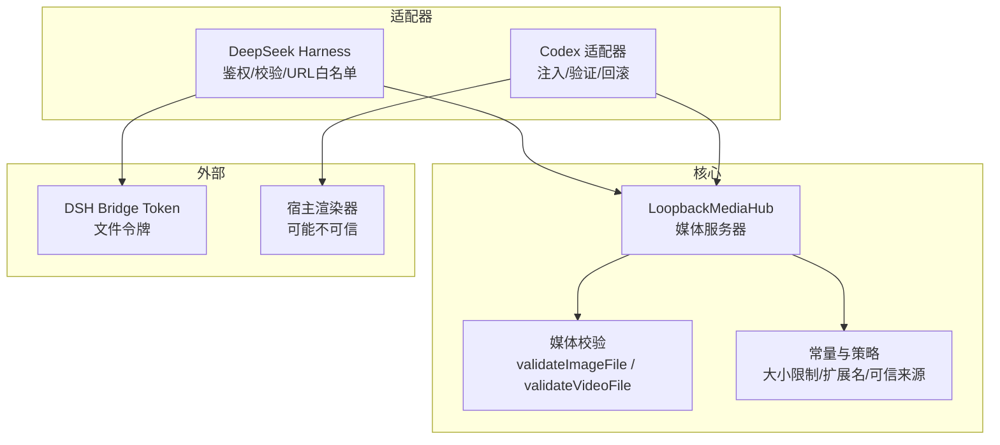
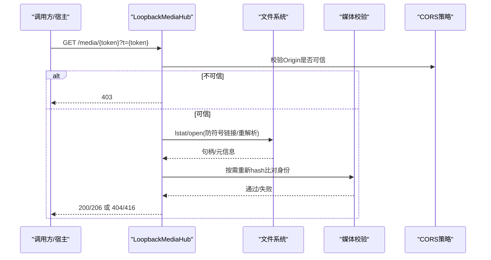
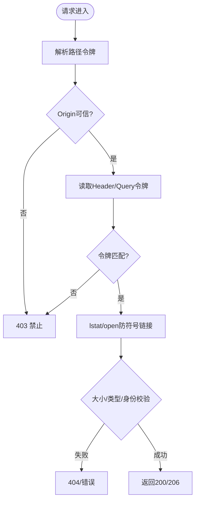
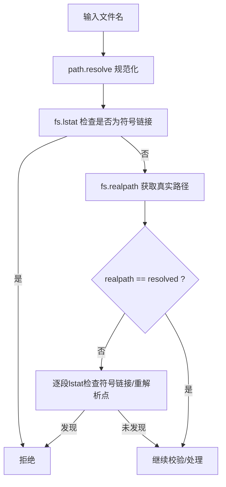
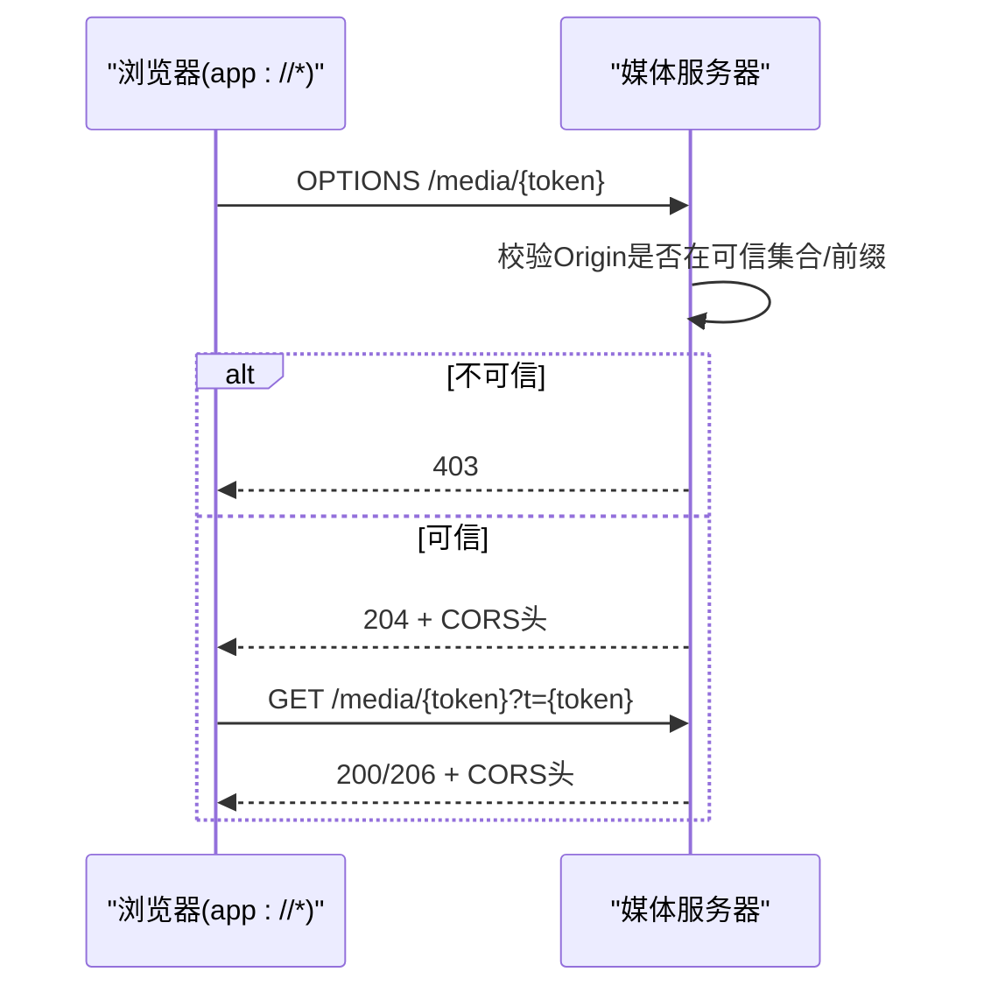
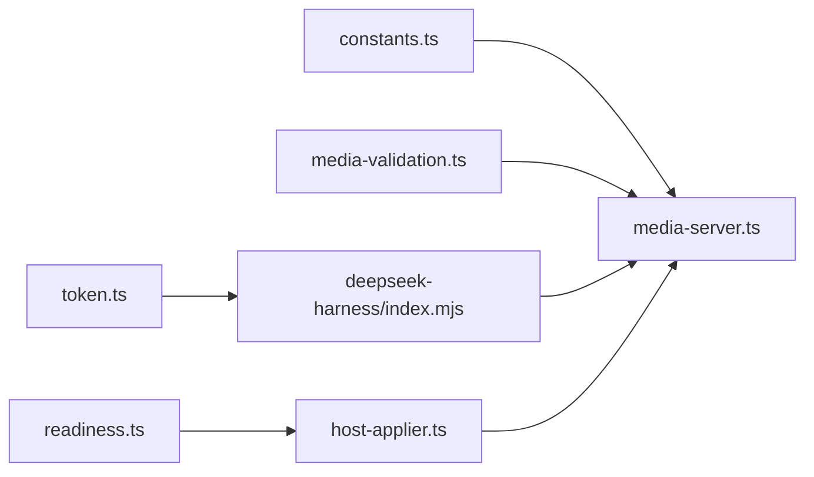

# 安全机制

<cite>
**本文引用的文件**
- [security-boundaries.md](file://docs/security-boundaries.md)
- [media-server.ts](file://packages/core/src/media-server.ts)
- [media-validation.ts](file://packages/core/src/media-validation.ts)
- [constants.ts](file://packages/core/src/constants.ts)
- [token.ts](file://packages/adapter-dsh/src/token.ts)
- [index.mjs](file://integrations/deepseek-harness/index.mjs)
- [background-store.ts](file://packages/core/src/background-store.ts)
- [readiness.ts](file://packages/adapter-codex/src/readiness.ts)
- [host-applier.ts](file://packages/adapter-codex/src/host-applier.ts)
- [gallery-host.mjs](file://integrations/deepseek-harness/gallery-host.mjs)
</cite>

## 目录
1. [简介](#简介)
2. [项目结构](#项目结构)
3. [核心组件](#核心组件)
4. [架构总览](#架构总览)
5. [详细组件分析](#详细组件分析)
6. [依赖关系分析](#依赖关系分析)
7. [性能与安全权衡](#性能与安全权衡)
8. [故障排查指南](#故障排查指南)
9. [结论](#结论)
10. [附录：配置与审计清单](#附录配置与审计清单)

## 简介
本文件面向安全敏感用户，系统化阐述 beautiCode 的安全机制，覆盖令牌认证、路径验证、跨域保护、文件访问控制、输入输出校验、安全边界、威胁模型与风险评估，并提供可操作的安全配置指南、漏洞修复建议与审计检查清单。文档中的实现细节均基于仓库源码与官方安全边界说明。

## 项目结构
beautiCode 将安全能力分布在多个模块中：
- 媒体服务与跨域：本地回环的媒体服务器负责按令牌提供受控的文件访问，并实施严格的 CORS 策略。
- 媒体校验：对图片/视频进行严格格式、大小、容器签名和符号链接/重解析点检查。
- 令牌桥接：进程间通信使用固定长度令牌，配合时序安全比较，避免侧信道泄露。
- 应用注入与验证：通过 CDP 注入背景资源，并在渲染端进行就绪性校验，失败时回滚。
- 安全边界文档：明确信任区、硬规则与非目标，指导开发与集成。

图表来源
- [media-server.ts:148-218](file://packages/core/src/media-server.ts#L148-L218)
- [media-validation.ts:223-292](file://packages/core/src/media-validation.ts#L223-L292)
- [constants.ts:24-52](file://packages/core/src/constants.ts#L24-L52)
- [index.mjs:90-142](file://integrations/deepseek-harness/index.mjs#L90-L142)
- [token.ts:20-46](file://packages/adapter-dsh/src/token.ts#L20-L46)

章节来源
- [security-boundaries.md:1-51](file://docs/security-boundaries.md#L1-L51)
- [media-server.ts:1-732](file://packages/core/src/media-server.ts#L1-L732)
- [media-validation.ts:1-358](file://packages/core/src/media-validation.ts#L1-L358)
- [constants.ts:1-62](file://packages/core/src/constants.ts#L1-L62)
- [token.ts:1-46](file://packages/adapter-dsh/src/token.ts#L1-L46)
- [index.mjs:1-158](file://integrations/deepseek-harness/index.mjs#L1-L158)

## 核心组件
- LoopbackMediaHub：绑定 127.0.0.1 的 HTTP 服务器，为每个已验证的媒体资产生成不可猜测的路径令牌，并通过“路径令牌 + 请求令牌（Header 或查询参数）”双重校验提供服务；支持 Range 分片、CORS 白名单与私有网络访问头。
- 媒体校验器：在导入阶段执行扩展名白名单、大小上限、魔数/容器签名校验、符号链接/重解析点拒绝、以及可选的全量哈希身份标识；运行时再次 stat/hash 校验防止替换。
- DSH Bridge 令牌：以固定长度十六进制令牌存储于数据根目录，读取时正则校验，写入时设置仅所有者权限；鉴权时使用时序安全比较。
- Codex 注入与验证：通过 CDP 注入背景资源，并在渲染端采集就绪快照，结合预期进行判定；失败则触发回滚恢复上一代。
- 安全边界与策略：集中定义信任区、硬规则、头部与令牌约定，约束所有子系统行为。

章节来源
- [media-server.ts:24-33](file://packages/core/src/media-server.ts#L24-L33)
- [media-validation.ts:62-123](file://packages/core/src/media-validation.ts#L62-L123)
- [token.ts:20-46](file://packages/adapter-dsh/src/token.ts#L20-L46)
- [readiness.ts:25-46](file://packages/adapter-codex/src/readiness.ts#L25-L46)
- [security-boundaries.md:29-44](file://docs/security-boundaries.md#L29-L44)

## 架构总览
beautiCode 的安全架构围绕“最小暴露面 + 强校验 + 失败关闭”展开：
- 网络面：媒体服务仅监听 127.0.0.1，禁止 LAN 绑定；CORS 仅允许可信来源（含 app://* 前缀），并显式声明 Private Network Access 头。
- 认证面：媒体访问需要“路径令牌 + 请求令牌”，两者必须匹配；DSH 控制通道使用 Bearer 令牌与时序安全比较。
- 数据面：所有媒体在导入时严格校验，运行时再次校验；路径包含符号链接/重解析点即拒绝；文件名强制基名且拒绝危险字符与保留设备名。
- 控制面：CDP 控制平面请求体长度受限；注入后通过就绪快照验证，失败回滚。

图表来源
- [media-server.ts:406-590](file://packages/core/src/media-server.ts#L406-L590)
- [media-validation.ts:125-190](file://packages/core/src/media-validation.ts#L125-L190)

章节来源
- [media-server.ts:148-218](file://packages/core/src/media-server.ts#L148-L218)
- [media-server.ts:406-590](file://packages/core/src/media-server.ts#L406-L590)
- [constants.ts:24-52](file://packages/core/src/constants.ts#L24-L52)

## 详细组件分析

### 令牌认证系统（媒体与桥接）
- 媒体令牌
  - 生成：为每个已验证的媒体资产生成随机 UUID（去除连字符），作为路由段与请求令牌。
  - 验证：路径令牌用于定位资源；请求令牌可从 Header 或查询参数传入，二者之一匹配即可。
  - 生命周期：仅在活跃资源存在期间有效；提交新资源后可移除旧令牌引用。
- 桥接令牌（DSH）
  - 生成与存储：在数据根目录下创建仅所有者可写的令牌文件，内容需符合固定长度十六进制正则。
  - 鉴权：从 Authorization 头提取 Bearer 令牌，与文件内容做等长与时序安全比较，防止时序攻击。
  - 作用域：仅用于本地进程间控制通道，不对外暴露。

图表来源
- [media-server.ts:406-590](file://packages/core/src/media-server.ts#L406-L590)
- [token.ts:20-46](file://packages/adapter-dsh/src/token.ts#L20-L46)
- [index.mjs:90-106](file://integrations/deepseek-harness/index.mjs#L90-L106)

章节来源
- [media-server.ts:96-98](file://packages/core/src/media-server.ts#L96-L98)
- [media-server.ts:460-479](file://packages/core/src/media-server.ts#L460-L479)
- [token.ts:20-46](file://packages/adapter-dsh/src/token.ts#L20-L46)
- [index.mjs:90-106](file://integrations/deepseek-harness/index.mjs#L90-L106)

### 路径验证与防目录遍历
- 路径规范化与真实路径解析：统一解析为绝对路径，再获取真实路径进行比较，防止别名绕过。
- 符号链接与重解析点拒绝：逐段检查路径是否存在符号链接或重解析点，一旦发现立即拒绝。
- 基名安全：存储到 active/staging 树内的文件名必须为纯基名，拒绝路径分隔符、控制字符、Windows 保留设备名及非法后缀。
- 运行时防护：媒体服务在每次读取前再次 lstat，检测符号链接、文件大小越界与元数据漂移；必要时全量重算哈希比对身份。

图表来源
- [media-validation.ts:62-123](file://packages/core/src/media-validation.ts#L62-L123)
- [media-validation.ts:330-358](file://packages/core/src/media-validation.ts#L330-L358)
- [media-server.ts:488-522](file://packages/core/src/media-server.ts#L488-L522)

章节来源
- [media-validation.ts:62-123](file://packages/core/src/media-validation.ts#L62-L123)
- [media-validation.ts:330-358](file://packages/core/src/media-validation.ts#L330-L358)
- [media-server.ts:488-522](file://packages/core/src/media-server.ts#L488-L522)

### 跨域保护（CORS）与媒体网络安全
- 绑定范围：媒体服务仅监听 127.0.0.1，杜绝局域网暴露。
- 可信来源：默认允许 app://-*、app://、null、file:// 等；同时支持 app://* 前缀匹配。
- 私有网络访问：显式声明 Access-Control-Allow-Private-Network，使 app:// 能访问 127.0.0.1。
- 预检与响应：OPTIONS 预检在 Origin 不可信时直接 403；GET/HEAD 响应携带 Vary: Origin 与必要的暴露头。

图表来源
- [media-server.ts:410-479](file://packages/core/src/media-server.ts#L410-L479)
- [constants.ts:27-41](file://packages/core/src/constants.ts#L27-L41)

章节来源
- [media-server.ts:410-479](file://packages/core/src/media-server.ts#L410-L479)
- [constants.ts:27-41](file://packages/core/src/constants.ts#L27-L41)

### 文件访问控制与资源隔离
- 资源注册：只有经过校验的媒体才会被加入 Hub 的内存映射表，并以随机令牌路由暴露。
- 资源隔离：每个资源独立 token，删除不再使用的资源会释放其路由；活跃资源切换时清理旧引用。
- 运行时一致性：每次读取前再次 stat，检测 inode/mtime/ctime 变化；若开启 fast 模式但元数据变化则拒绝；否则计算当前哈希与身份对比。
- 复制与校验：运行时会话复制视频至 runtime-media 目录，复制后再次校验 identity，不一致则清理并报错。

章节来源
- [media-server.ts:220-301](file://packages/core/src/media-server.ts#L220-L301)
- [media-server.ts:660-724](file://packages/core/src/media-server.ts#L660-L724)
- [background-store.ts:406-435](file://packages/core/src/background-store.ts#L406-L435)

### 输入验证与输出编码
- 输入验证
  - 扩展名白名单：图片仅限 jpg/jpeg/png/webp/avif；视频仅限 mp4。
  - 大小限制：图片最大 18MB，视频最大 800MB，内联 data URL 限制与图片一致。
  - 容器签名：图片通过魔数识别 JPEG/PNG/WebP/AVIF；视频要求 ftyp 容器头。
  - 路径安全：拒绝符号链接/重解析点；文件名强制基名，拒绝危险字符与保留设备名。
- 输出编码
  - Content-Type 由校验结果决定，服务端设置 X-Content-Type-Options: nosniff 防止嗅探。
  - Range 响应严格解析，非法范围返回 416。
  - 控制面请求体长度受限，避免超大 JSON 导致解析风险。

章节来源
- [constants.ts:3-19](file://packages/core/src/constants.ts#L3-L19)
- [constants.ts:43-52](file://packages/core/src/constants.ts#L43-L52)
- [media-validation.ts:192-292](file://packages/core/src/media-validation.ts#L192-L292)
- [media-validation.ts:330-358](file://packages/core/src/media-validation.ts#L330-L358)
- [index.mjs:18-142](file://integrations/deepseek-harness/index.mjs#L18-L142)

### 安全边界、威胁模型与风险评估
- 安全边界
  - 硬规则：不修改宿主安装包；不静默写入密钥/令牌；媒体服务仅回环；路径包含符号链接/重解析点即拒绝；内容门限前置；网络读长度受限；失败关闭；用户媒体不出本机；注入脚本不得捕获宿主事件。
  - 信任区：数据根为受信；导入媒体视为不受信输入；媒体服务为受保护区域；宿主渲染器为不可信对等方；官方宿主安装只读。
- 威胁模型
  - 未授权访问：通过路径令牌+请求令牌+CORS 白名单缓解。
  - 目录遍历/符号链接劫持：通过 realpath 与逐段 lstat 拒绝。
  - 恶意媒体：通过扩展名、大小、魔数/容器签名、运行时身份校验阻断。
  - 跨站/跨域滥用：仅允许可信 Origin，且服务仅绑定回环。
  - 控制面注入：CDP 控制请求体长度限制，注入代码片段使用字面量而非拼接用户输入。
- 风险评估
  - 高风险：任意文件读取、符号链接逃逸、超大请求体、非白名单媒体。已通过多重校验与限制缓解。
  - 中风险：CORS 误配、Origin 伪造。通过严格白名单与前缀匹配降低。
  - 低风险：日志泄露令牌。令牌为单路由能力，且不在日志中完整记录。

章节来源
- [security-boundaries.md:3-28](file://docs/security-boundaries.md#L3-L28)
- [security-boundaries.md:29-44](file://docs/security-boundaries.md#L29-L44)
- [index.mjs:90-142](file://integrations/deepseek-harness/index.mjs#L90-L142)
- [media-server.ts:406-590](file://packages/core/src/media-server.ts#L406-L590)

## 依赖关系分析
- media-server.ts 依赖 constants.ts 提供的常量（大小限制、扩展名、可信来源、令牌头）。
- media-server.ts 依赖 media-validation.ts 完成媒体导入时的格式与完整性校验。
- adapter-dsh/token.ts 提供桥接令牌读写与校验逻辑，供 DSH 集成使用。
- integrations/deepseek-harness/index.mjs 实现控制通道的鉴权、载荷校验与 URL 白名单。
- adapter-codex/readiness.ts 与 host-applier.ts 实现注入后的就绪性评估与重试/回滚。

图表来源
- [constants.ts:24-52](file://packages/core/src/constants.ts#L24-L52)
- [media-server.ts:7-22](file://packages/core/src/media-server.ts#L7-L22)
- [token.ts:1-46](file://packages/adapter-dsh/src/token.ts#L1-L46)
- [index.mjs:1-158](file://integrations/deepseek-harness/index.mjs#L1-L158)
- [readiness.ts:1-46](file://packages/adapter-codex/src/readiness.ts#L1-L46)
- [host-applier.ts:48-867](file://packages/adapter-codex/src/host-applier.ts#L48-L867)

章节来源
- [media-server.ts:7-22](file://packages/core/src/media-server.ts#L7-L22)
- [index.mjs:1-158](file://integrations/deepseek-harness/index.mjs#L1-L158)
- [host-applier.ts:48-867](file://packages/adapter-codex/src/host-applier.ts#L48-L867)

## 性能与安全权衡
- 快速模式 vs 全量哈希：fast 模式仅对元数据与头部计算身份，提升导入速度；full 模式扫描全文件确保强一致性。媒体服务在运行时根据模式决定是否重算哈希。
- Range 流式传输：支持分片下载，减少大文件内存占用；服务端严格控制 Range 合法性，避免资源耗尽。
- 预热读取：对视频首尾关键区域进行预热，降低冷启动延迟，但不影响正确性。
- 连接与超时：设置请求头超时、Keep-Alive 超时、每 Socket 最大请求数，防止慢连接与资源泄漏。

章节来源
- [media-validation.ts:125-190](file://packages/core/src/media-validation.ts#L125-L190)
- [media-server.ts:182-218](file://packages/core/src/media-server.ts#L182-L218)
- [media-validation.ts:294-328](file://packages/core/src/media-validation.ts#L294-L328)

## 故障排查指南
- 403 禁止访问
  - 检查 Origin 是否在可信集合或匹配 app://* 前缀。
  - 确认请求携带了正确的令牌（Header 或查询参数）且与路径令牌一致。
- 404 未找到
  - 确认资源已被 stage/commit 且未被移除；检查路径令牌是否正确。
- 416 范围无效
  - 检查 Range 头格式与数值范围是否符合规范。
- 媒体校验失败
  - 检查扩展名、大小、魔数/容器签名是否符合要求；确认无符号链接/重解析点。
- 注入验证失败
  - 查看就绪快照与预期是否一致；如失败，系统会自动回滚到上一代。

章节来源
- [media-server.ts:410-590](file://packages/core/src/media-server.ts#L410-L590)
- [media-validation.ts:223-292](file://packages/core/src/media-validation.ts#L223-L292)
- [readiness.ts:25-46](file://packages/adapter-codex/src/readiness.ts#L25-L46)

## 结论
beautiCode 通过“最小暴露面 + 强校验 + 失败关闭”的安全设计，构建了可靠的媒体服务与注入流程。令牌认证、路径验证、CORS 白名单、输入输出校验与运行时一致性检查共同构成了纵深防御体系。对于安全敏感场景，建议遵循安全边界文档，严格配置可信来源与大小限制，并定期执行审计检查清单。

## 附录：配置与审计清单

### 安全配置要点
- 媒体服务
  - 仅绑定 127.0.0.1；启用 CORS 白名单与 Private Network Access。
  - 合理设置 maxImageBytes/maxVideoBytes；保持与注入限制一致。
- 令牌管理
  - 使用随机、高熵令牌；避免在日志中记录完整令牌。
  - 桥接令牌文件权限设置为仅所有者可写。
- 输入校验
  - 启用扩展名白名单与大小限制；对视频强制 ftyp 容器校验。
  - 拒绝符号链接/重解析点；文件名强制基名并过滤危险字符。
- 控制面
  - 限制 CDP 控制请求体长度；注入代码使用字面量，不拼接用户输入。

### 漏洞修复建议
- 如发现 Origin 白名单过宽，收紧为精确匹配或必要的前缀。
- 如发现媒体文件可被替换，确保启用 full 模式或在运行时强制重算哈希。
- 如发现 Range 异常导致资源耗尽，加强 Range 解析与上限检查。
- 如发现注入失败未回滚，确保事务层在 verify 失败时执行回滚。

### 审计检查清单
- 网络面
  - 媒体服务是否仅监听 127.0.0.1？
  - CORS 是否仅允许可信 Origin？是否设置 Private Network Access？
- 认证面
  - 媒体访问是否要求路径令牌 + 请求令牌？
  - 桥接令牌是否固定长度、仅所有者可写、使用时序安全比较？
- 数据面
  - 是否拒绝符号链接/重解析点？
  - 是否校验扩展名、大小、魔数/容器签名？
  - 运行时是否再次 stat/hash 校验？
- 控制面
  - CDP 控制请求体是否长度受限？
  - 注入后是否进行就绪性验证？失败是否回滚？

章节来源
- [security-boundaries.md:3-28](file://docs/security-boundaries.md#L3-L28)
- [security-boundaries.md:29-44](file://docs/security-boundaries.md#L29-L44)
- [media-server.ts:182-218](file://packages/core/src/media-server.ts#L182-L218)
- [media-server.ts:410-590](file://packages/core/src/media-server.ts#L410-L590)
- [token.ts:20-46](file://packages/adapter-dsh/src/token.ts#L20-L46)
- [index.mjs:90-142](file://integrations/deepseek-harness/index.mjs#L90-L142)
- [readiness.ts:25-46](file://packages/adapter-codex/src/readiness.ts#L25-L46)