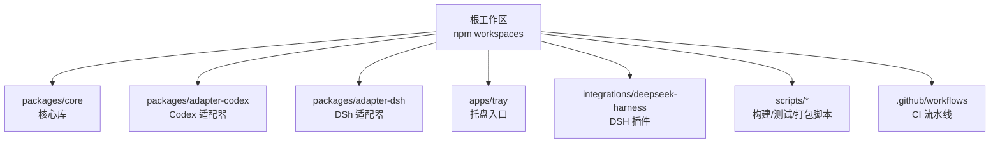
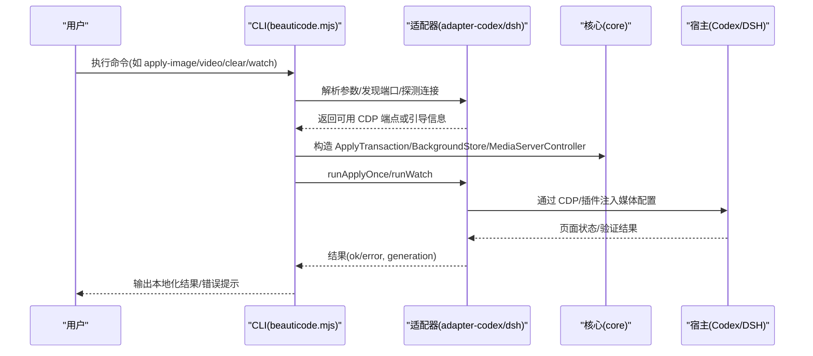
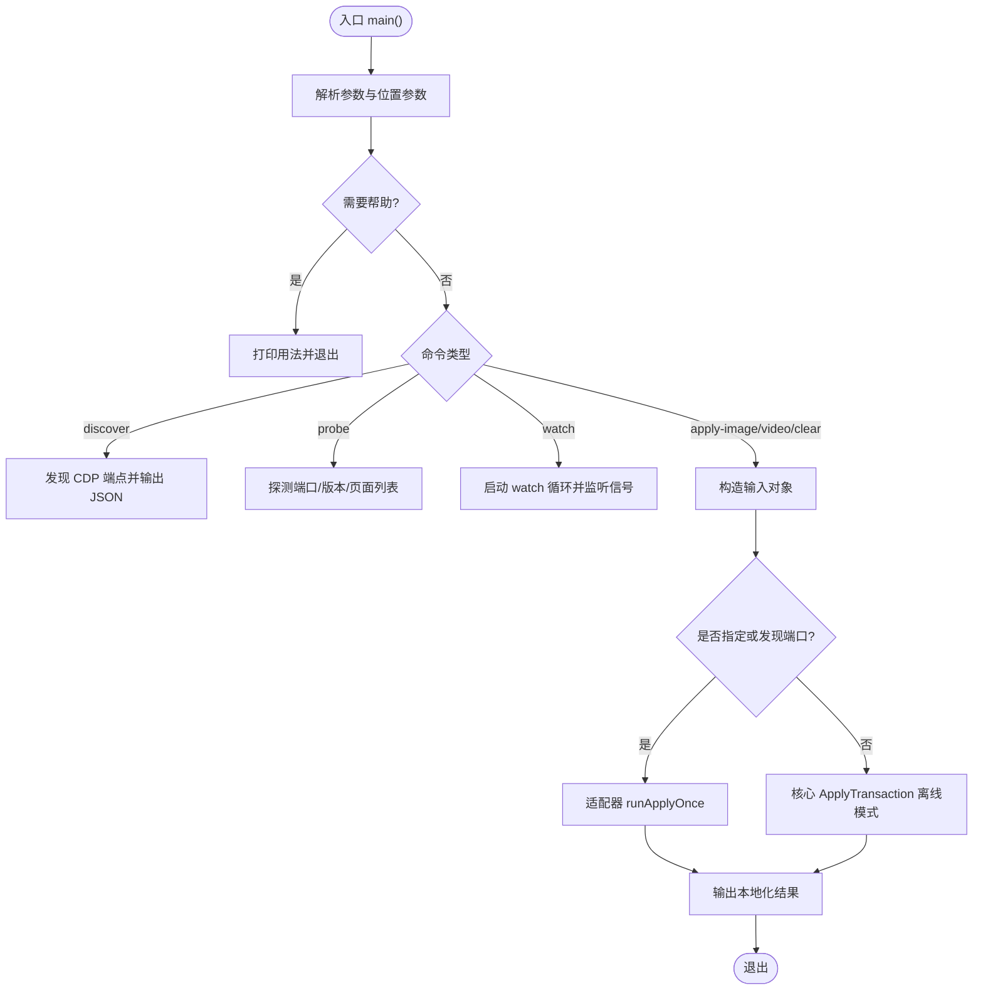
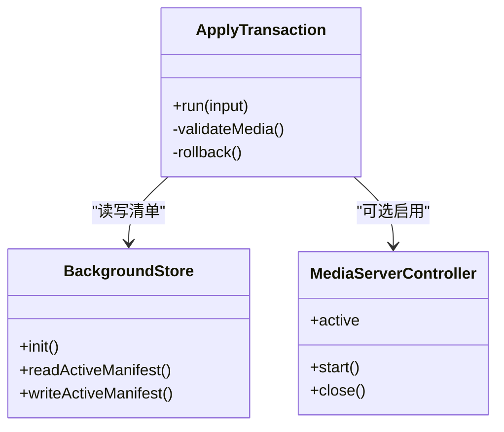
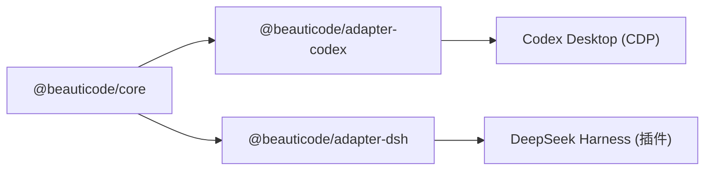
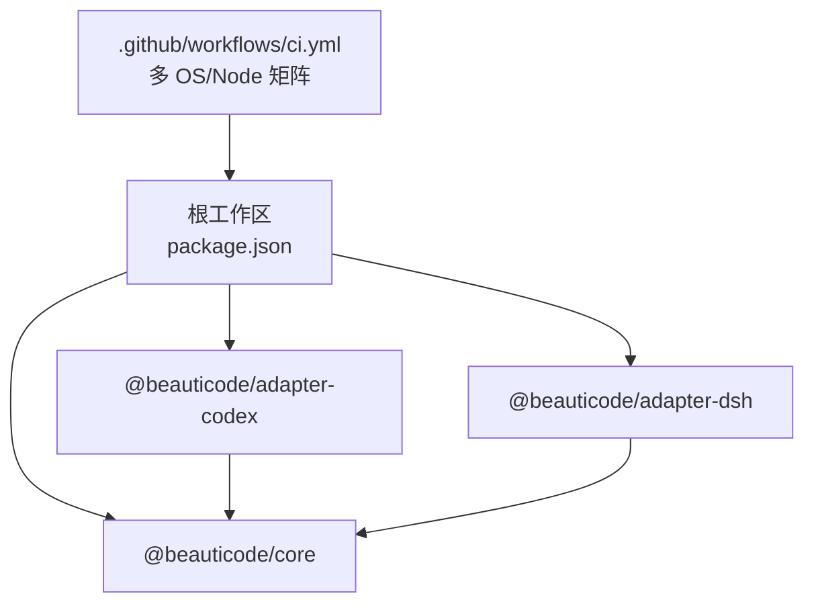

# 开发指南

<cite>
**本文引用的文件**
- [package.json](file://package.json)
- [README.md](file://README.md)
- [.github/workflows/ci.yml](file://.github/workflows/ci.yml)
- [scripts/beauticode.mjs](file://scripts/beauticode.mjs)
- [scripts/test-runner.mjs](file://scripts/test-runner.mjs)
- [apps/tray/README.md](file://apps/tray/README.md)
- [packages/core/package.json](file://packages/core/package.json)
- [packages/core/tsconfig.json](file://packages/core/tsconfig.json)
- [packages/adapter-codex/package.json](file://packages/adapter-codex/package.json)
- [packages/adapter-dsh/package.json](file://packages/adapter-dsh/package.json)
</cite>

## 目录
1. [简介](#简介)
2. [项目结构](#项目结构)
3. [核心组件](#核心组件)
4. [架构总览](#架构总览)
5. [详细组件分析](#详细组件分析)
6. [依赖关系分析](#依赖关系分析)
7. [性能注意事项](#性能注意事项)
8. [故障排查指南](#故障排查指南)
9. [结论](#结论)
10. [附录](#附录)

## 简介
beautiCode 是一个本地背景工具，主要为 DeepSeek Harness 与 Codex Desktop 提供图片与视频背景能力。它通过 CDP（Chrome DevTools Protocol）注入或插件方式将媒体资源作为对话与工作区背景，支持图片、MP4 等格式，并提供托盘、CLI、集成脚本等开发调试与发布能力。

本开发指南面向新贡献者与维护者，涵盖环境搭建、代码结构、模块组织、命名规范、调试方法、测试策略、持续集成、提交与审查流程、常见问题与优化建议，帮助快速上手并高效协作。

## 项目结构
仓库采用 monorepo 结构，根目录通过 npm workspaces 管理多个子包与应用：
- packages/*：核心库与适配器
  - @beauticode/core：背景存储、媒体服务控制、事务化应用逻辑等核心能力
  - @beauticode/adapter-codex：Codex Desktop 的 CDP 注入与生命周期管理
  - @beauticode/adapter-dsh：DeepSeek Harness 的插件适配
- apps/*：桌面端入口
  - apps/tray：Windows 系统托盘入口，基于 PowerShell + Node session host 的轻量控制面
- integrations/*：宿主集成
  - integrations/deepseek-harness：DSH 插件实现与测试
- scripts/*：构建、安装、打包、测试运行器等脚本
- .github/workflows：CI 流水线定义

图表来源
- [package.json:7-10](file://package.json#L7-L10)
- [packages/core/package.json:1-32](file://packages/core/package.json#L1-L32)
- [packages/adapter-codex/package.json:1-33](file://packages/adapter-codex/package.json#L1-L33)
- [packages/adapter-dsh/package.json:1-31](file://packages/adapter-dsh/package.json#L1-L31)
- [apps/tray/README.md:1-85](file://apps/tray/README.md#L1-L85)

章节来源
- [package.json:7-10](file://package.json#L7-L10)
- [README.md:108-137](file://README.md#L108-L137)

## 核心组件
- CLI 入口与命令路由：scripts/beauticode.mjs
  - 负责参数解析、CDP 发现与探测、离线模式的事务化应用、实时注入与验证、错误本地化提示等
- 核心库：@beauticode/core
  - 提供 BackgroundStore、MediaServerController、ApplyTransaction 等核心能力，统一数据根目录与媒体校验
- 适配器：@beauticode/adapter-codex、@beauticode/adapter-dsh
  - 封装不同宿主的 CDP/插件接入细节，暴露 discover/probe/apply/watch 等统一接口
- 托盘：apps/tray
  - Windows 托盘 UI 与控制通道，复用 adapter-codex 的 BeautiSession，仅绑定 loopback 端口，安全隔离

章节来源
- [scripts/beauticode.mjs:1-427](file://scripts/beauticode.mjs#L1-L427)
- [packages/core/package.json:1-32](file://packages/core/package.json#L1-L32)
- [packages/adapter-codex/package.json:1-33](file://packages/adapter-codex/package.json#L1-L33)
- [packages/adapter-dsh/package.json:1-31](file://packages/adapter-dsh/package.json#L1-L31)
- [apps/tray/README.md:1-85](file://apps/tray/README.md#L1-L85)

## 架构总览
beautiCode 的运行时由“CLI/托盘”驱动，调用“适配器”与“核心库”，通过 CDP 或插件协议与宿主（Codex/DSH）交互，完成媒体资源的注入、验证与回滚。

图表来源
- [scripts/beauticode.mjs:173-186](file://scripts/beauticode.mjs#L173-L186)
- [scripts/beauticode.mjs:387-398](file://scripts/beauticode.mjs#L387-L398)
- [packages/adapter-codex/package.json:19-21](file://packages/adapter-codex/package.json#L19-L21)
- [packages/adapter-dsh/package.json:19-21](file://packages/adapter-dsh/package.json#L19-L21)

## 详细组件分析

### CLI 组件（scripts/beauticode.mjs）
- 职责
  - 版本检查（Node.js >= 22）
  - 参数解析与帮助输出
  - CDP 发现、探测、自动选择最佳端口
  - 离线模式：使用核心库进行原子化背景变更与媒体校验
  - 在线模式：通过适配器一次性注入并验证，失败回滚
  - 错误本地化与友好提示（CDP 不可用、重复注入器、身份变化等）
- 关键流程
  - discover：列出健康 CDP 端点及浏览器信息
  - probe：探测端口、获取浏览器版本、列举页面目标
  - watch：持续监听并自动重连，支持信号中断
  - apply-*：根据输入类型（image/video/clear）构造 ApplyTransaction 或直接走适配器注入
- 错误处理
  - friendlyError：对常见网络/CDP/锁冲突错误给出中文提示与操作指引
  - localizeResult：将适配器返回的错误消息翻译为中文

图表来源
- [scripts/beauticode.mjs:14-17](file://scripts/beauticode.mjs#L14-L17)
- [scripts/beauticode.mjs:76-131](file://scripts/beauticode.mjs#L76-L131)
- [scripts/beauticode.mjs:133-171](file://scripts/beauticode.mjs#L133-L171)
- [scripts/beauticode.mjs:173-186](file://scripts/beauticode.mjs#L173-L186)
- [scripts/beauticode.mjs:224-253](file://scripts/beauticode.mjs#L224-L253)
- [scripts/beauticode.mjs:264-298](file://scripts/beauticode.mjs#L264-L298)
- [scripts/beauticode.mjs:300-330](file://scripts/beauticode.mjs#L300-L330)
- [scripts/beauticode.mjs:332-418](file://scripts/beauticode.mjs#L332-L418)

章节来源
- [scripts/beauticode.mjs:1-427](file://scripts/beauticode.mjs#L1-L427)

### 核心库（@beauticode/core）
- 职责
  - BackgroundStore：持久化当前激活的背景清单与主题
  - MediaServerController：本地媒体服务启停与 URL 生成
  - ApplyTransaction：原子化应用流程（写入、校验、回滚）
- 构建与类型
  - TypeScript 严格模式，输出声明与源码映射
  - 测试通过 Node --test 运行，跨平台临时目录处理由测试运行器保障

图表来源
- [packages/core/package.json:1-32](file://packages/core/package.json#L1-L32)
- [packages/core/tsconfig.json:1-22](file://packages/core/tsconfig.json#L1-L22)

章节来源
- [packages/core/package.json:1-32](file://packages/core/package.json#L1-L32)
- [packages/core/tsconfig.json:1-22](file://packages/core/tsconfig.json#L1-L22)

### 适配器（@beauticode/adapter-codex、@beauticode/adapter-dsh）
- 职责
  - 统一对外 API：discoverCdpEndpoints、probeCdp、listPageTargets、runApplyOnce、runWatch、getCodexLaunchGuidance 等
  - 隐藏底层差异：CDP 握手、页面枚举、注入脚本、SSE 确认、媒体传输等
- 依赖
  - 均依赖 @beauticode/core，复用核心能力
  - adapter-codex 额外引入 ws 用于通信

图表来源
- [packages/adapter-codex/package.json:19-21](file://packages/adapter-codex/package.json#L19-L21)
- [packages/adapter-dsh/package.json:19-21](file://packages/adapter-dsh/package.json#L19-L21)

章节来源
- [packages/adapter-codex/package.json:1-33](file://packages/adapter-codex/package.json#L1-L33)
- [packages/adapter-dsh/package.json:1-31](file://packages/adapter-dsh/package.json#L1-L31)

### 托盘（apps/tray）
- 设计要点
  - 无 Electron，使用 PowerShell NotifyIcon + WinForms 面板 + Node session host
  - 控制通道为 loopback localhost HTTP，随机 bearer token，仅进程内传递
  - 复用 adapter-codex 的 BeautiSession，支持单次注入验证与 watch 重连
  - 安全：不绑定外网地址，不暴露调试端口到 0.0.0.0
- 菜单功能
  - 应用/重新应用、更换图片/视频、清除背景、摸鱼模式、声音开关、保存/切换/删除主题、退出

章节来源
- [apps/tray/README.md:1-85](file://apps/tray/README.md#L1-L85)

## 依赖关系分析
- 工作区与脚本
  - 根 package.json 定义 workspaces、统一脚本（build/test/typecheck/smoke/tray/installer/plugin）
  - engines 要求 Node.js >= 22
- 子包依赖
  - core：独立构建与类型检查
  - adapter-codex/dsh：依赖 core，分别扩展宿主能力
- CI 矩阵
  - 在 windows-latest 与 ubuntu-latest 上以 Node 22/24 并行验证
  - 步骤包括：依赖安装、安全审计、类型检查、测试、构建、JS/PowerShell 语法检查

图表来源
- [package.json:7-24](file://package.json#L7-L24)
- [packages/adapter-codex/package.json:19-21](file://packages/adapter-codex/package.json#L19-L21)
- [packages/adapter-dsh/package.json:19-21](file://packages/adapter-dsh/package.json#L19-L21)
- [.github/workflows/ci.yml:11-28](file://.github/workflows/ci.yml#L11-L28)

章节来源
- [package.json:7-24](file://package.json#L7-L24)
- [.github/workflows/ci.yml:1-59](file://.github/workflows/ci.yml#L1-L59)

## 性能注意事项
- 避免重复注入与频繁重建
  - 使用 watch 模式维持长连接，减少重复注入开销
  - 利用 generation 字段判断是否需要更新
- 媒体服务最小化
  - 仅在必要时启用 MediaServerController，并在完成后及时关闭
- 页面枚举与 CDP 调用节流
  - 合理设置轮询间隔与超时，避免阻塞主线程
- 日志与可观测性
  - 通过环境变量 BEAUTICODE_VERBOSE=1 开启 watch 会话计数日志
  - 结合 CI 的 JS/PS 语法检查与类型检查提前发现问题

[本节为通用指导，不直接分析具体文件]

## 故障排查指南
- 无法找到 CDP 连接
  - 现象：错误包含 fetch failed/ECONNREFUSED/aborted/CDP HTTP/Timed out waiting for a CDP/No healthy loopback
  - 处理：运行 discover 或 how-to-cdp，确保宿主已以 loopback 调试模式启动
- 重复注入器占用
  - 现象：Another beautiCode injector is running
  - 处理：停止其他进程，等待锁回收后重试
- CDP 身份变化
  - 现象：identity changed/CdpIdentityMismatch
  - 处理：主机可能重启，重新运行 probe/apply；watch/托盘会自动重连
- 端口与协议限制
  - 使用 --port 指定端口，或使用 --discover 自动选择健康端口
  - 默认要求 app: 协议页面，可通过 --allow-http 允许 http://127.0.0.1 测试页
- 托盘安全与权限
  - 控制通道仅绑定 127.0.0.1，所有写操作需携带 Bearer Token
  - 不暴露调试端口到 0.0.0.0，避免安全风险

章节来源
- [scripts/beauticode.mjs:133-171](file://scripts/beauticode.mjs#L133-L171)
- [scripts/beauticode.mjs:173-186](file://scripts/beauticode.mjs#L173-L186)
- [apps/tray/README.md:75-85](file://apps/tray/README.md#L75-L85)

## 结论
beautiCode 通过清晰的模块化设计与统一的适配器抽象，实现了在不同宿主间一致的媒体背景能力。CLI 与托盘提供了丰富的开发与运维体验，配合严格的类型检查与 CI 流水线，保障了质量与可维护性。遵循本指南可以快速搭建环境、定位问题、编写测试与参与贡献。

[本节为总结，不直接分析具体文件]

## 附录

### 开发环境搭建
- 环境要求
  - Node.js 版本：>= 22（根与子包 engines 约束）
- 安装与初始化
  - 在项目根目录执行依赖安装
  - 如需从源码运行，按 README 说明安装 DSH 插件或手动添加本地插件路径
- 构建与运行
  - 构建全部工作区：npm run build
  - 运行托盘：npm run tray
  - 构建 Windows 安装包：npm run installer:windows

章节来源
- [package.json:11-24](file://package.json#L11-L24)
- [README.md:108-137](file://README.md#L108-L137)

### 代码结构与命名规范
- 目录组织
  - packages/*：库与适配器，每个包独立构建与测试
  - apps/*：应用入口（托盘）
  - integrations/*：宿主集成（DSH 插件）
  - scripts/*：构建、测试、打包、安装脚本
- 命名约定
  - 包名使用 @beauticode/* 前缀
  - 源文件使用小写下划线或驼峰，测试文件以 .test.js/.test.mjs 结尾
  - 脚本与入口文件保持简洁明了（如 beauticode.mjs、session-host.mjs）

章节来源
- [packages/core/package.json:1-32](file://packages/core/package.json#L1-L32)
- [packages/adapter-codex/package.json:1-33](file://packages/adapter-codex/package.json#L1-L33)
- [packages/adapter-dsh/package.json:1-31](file://packages/adapter-dsh/package.json#L1-L31)

### 调试方法与工具链
- 日志与分析
  - 设置 BEAUTICODE_VERBOSE=1 查看 watch 会话计数
  - 使用 CLI 的 discover/probe/status 输出结构化信息辅助定位
- 断点调试
  - 使用 Node.js 调试器对脚本与入口进行断点调试（如 beauticode.mjs、session-host.mjs）
- 性能监控
  - 关注 CDP 调用次数与页面枚举频率，避免高频轮询
  - 合理使用 verifyDeadlineMs 与 pollMs 平衡响应与稳定性

章节来源
- [scripts/beauticode.mjs:319-327](file://scripts/beauticode.mjs#L319-L327)
- [scripts/beauticode.mjs:387-398](file://scripts/beauticode.mjs#L387-L398)

### 测试框架与用例编写指南
- 测试运行器
  - 使用 Node --test 并通过 scripts/test-runner.mjs 在 Windows 下设置长路径临时目录，避免路径不一致导致的 flaky 测试
- 单元测试
  - 各包 test 目录下编写单元与集成测试，覆盖核心逻辑与边界条件
- 端到端测试
  - integrations/deepseek-harness/test 中包含插件级测试，模拟真实宿主行为
- 运行测试
  - 根目录：npm test
  - 单包：进入包目录执行 npm test

章节来源
- [scripts/test-runner.mjs:1-27](file://scripts/test-runner.mjs#L1-L27)
- [packages/core/package.json:18-22](file://packages/core/package.json#L18-L22)
- [packages/adapter-codex/package.json:14-18](file://packages/adapter-codex/package.json#L14-L18)
- [packages/adapter-dsh/package.json:14-18](file://packages/adapter-dsh/package.json#L14-L18)

### 持续集成与自动化构建
- CI 流程
  - 多操作系统与 Node 版本矩阵
  - 步骤：安装依赖、安全审计、类型检查、测试、构建、JS/PowerShell 语法检查
- 本地等效流程
  - npm ci -> npm audit -> npm run typecheck -> npm test -> npm run build
  - 可选：运行 smoke:live 进行冒烟测试

章节来源
- [.github/workflows/ci.yml:11-59](file://.github/workflows/ci.yml#L11-L59)
- [package.json:11-21](file://package.json#L11-L21)

### 代码贡献指南、提交规范与审查流程
- 分支与提交
  - 建议按功能或修复创建分支，提交信息清晰描述变更目的与影响范围
  - 提交前确保通过类型检查与测试
- 审查流程
  - 提交 PR 后触发 CI，确保多平台与多 Node 版本通过
  - 审查重点：API 一致性、错误处理、安全性（CDP/HTTP 绑定）、日志与可观测性
- 发布与打包
  - 使用根脚本进行构建与打包（如 installer:windows、plugin:pack/publish）

[本节为通用实践，不直接分析具体文件]

### 常见问题与优化建议
- 常见问题
  - CDP 不可用：运行 discover/how-to-cdp，确认宿主以 loopback 调试模式启动
  - 重复注入：停止其他进程，等待锁回收
  - 身份变化：重新 probe/apply，watch/托盘会自动重连
- 优化建议
  - 降低 CDP 调用频率，合并批量操作
  - 合理设置超时与重试策略，提升鲁棒性
  - 使用 watch 模式维持连接，减少冷启动开销

章节来源
- [scripts/beauticode.mjs:133-171](file://scripts/beauticode.mjs#L133-L171)
- [scripts/beauticode.mjs:300-330](file://scripts/beauticode.mjs#L300-L330)