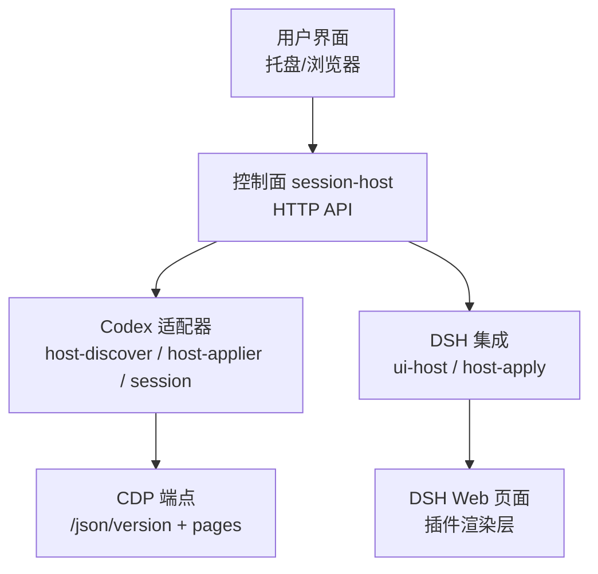
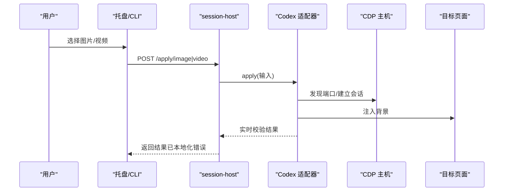
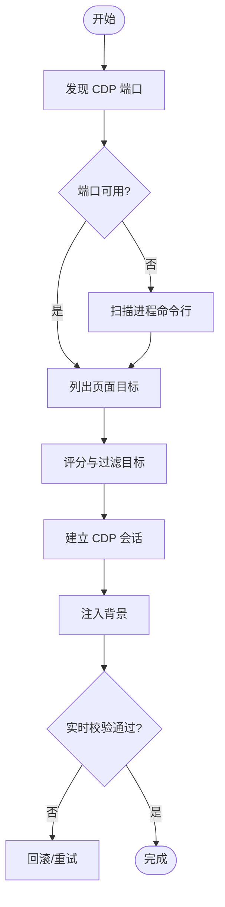
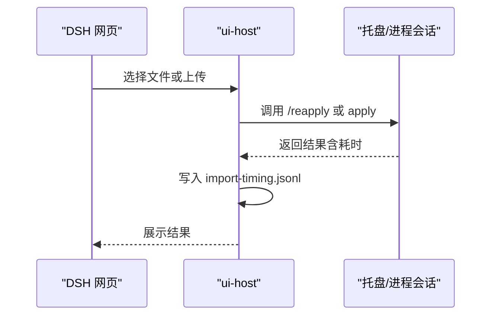
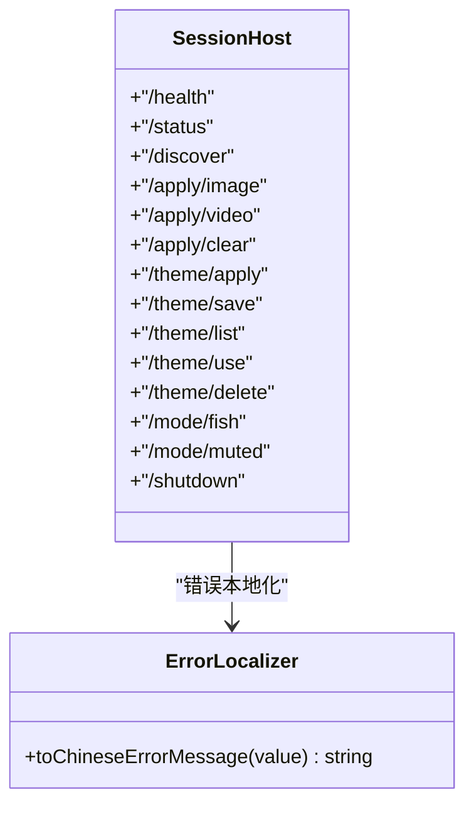
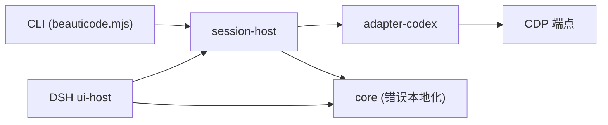
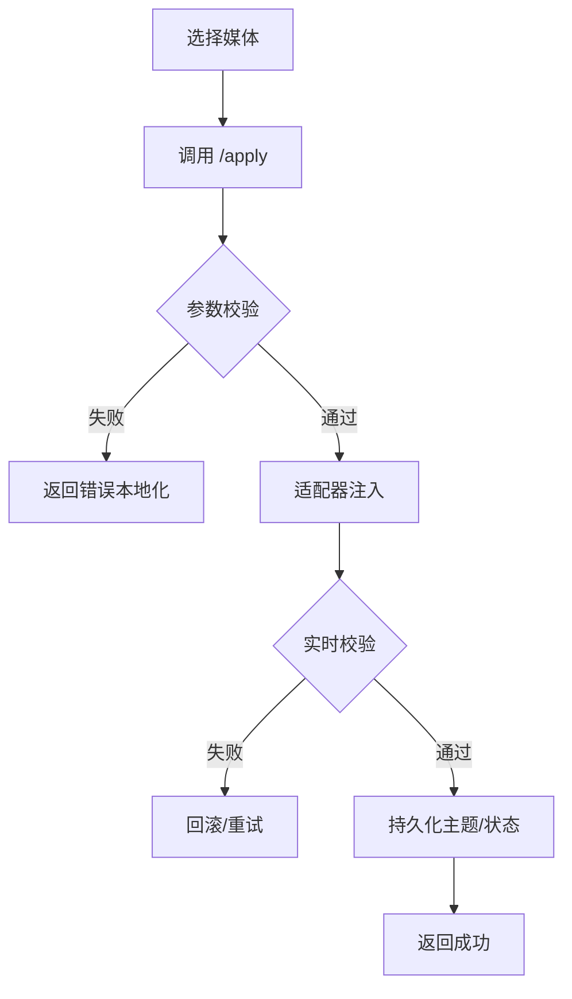

# 故障排除

<cite>
**本文引用的文件**
- [README.md](file://README.md)
- [package.json](file://package.json)
- [scripts/beauticode.mjs](file://scripts/beauticode.mjs)
- [apps/tray/session-host.mjs](file://apps/tray/session-host.mjs)
- [apps/tray/start-tray.ps1](file://apps/tray/start-tray.ps1)
- [packages/core/src/error-message.ts](file://packages/core/src/error-message.ts)
- [packages/adapter-codex/src/host-discover.ts](file://packages/adapter-codex/src/host-discover.ts)
- [packages/adapter-codex/src/host-applier.ts](file://packages/adapter-codex/src/host-applier.ts)
- [packages/adapter-codex/src/session.ts](file://packages/adapter-codex/src/session.ts)
- [integrations/deepseek-harness/ui-host.mjs](file://integrations/deepseek-harness/ui-host.mjs)
- [integrations/deepseek-harness/host-apply.mjs](file://integrations/deepseek-harness/host-apply.mjs)
- [scripts/live-smoke.mjs](file://scripts/live-smoke.mjs)
- [docs/codex-cdp-setup.md](file://docs/codex-cdp-setup.md)
</cite>

## 目录
1. [简介](#简介)
2. [项目结构](#项目结构)
3. [核心组件](#核心组件)
4. [架构总览](#架构总览)
5. [详细组件分析](#详细组件分析)
6. [依赖关系分析](#依赖关系分析)
7. [性能注意事项](#性能注意事项)
8. [故障排查指南](#故障排查指南)
9. [结论](#结论)
10. [附录](#附录)

## 简介
本故障排除文档面向 beautiCode 用户与开发者，覆盖安装失败、连接问题（CDP 连接、插件加载）、背景不显示、性能问题（内存/CPU/网络延迟）等典型场景。文档提供日志分析方法、调试技巧、宿主应用特定问题（DeepSeek Harness、Codex Desktop）的排查步骤，以及错误代码对照表、异常堆栈定位方法、社区支持资源与自助诊断工具的使用说明。

## 项目结构
beautiCode 采用多包工作区组织：
- apps/tray：托盘进程与控制面服务（session-host），负责本地 HTTP API 与 CDP/Dsh 会话管理
- packages/core：核心能力（错误消息本地化、主题/媒体存储等）
- packages/adapter-codex：Codex Desktop 适配器（CDP 发现、注入、校验）
- integrations/deepseek-harness：DeepSeek Harness 插件与 UI 桥接
- scripts：CLI、自动化脚本（live smoke、打包、安装器等）
- docs：使用与配置文档（含 CDP 设置与故障排查）

图表来源
- [apps/tray/session-host.mjs:1-25](file://apps/tray/session-host.mjs#L1-L25)
- [packages/adapter-codex/src/host-discover.ts:238-341](file://packages/adapter-codex/src/host-discover.ts#L238-L341)
- [integrations/deepseek-harness/ui-host.mjs:302-390](file://integrations/deepseek-harness/ui-host.mjs#L302-L390)

章节来源
- [README.md:19-126](file://README.md#L19-L126)
- [package.json:1-27](file://package.json#L1-L27)

## 核心组件
- 控制面服务（session-host）：暴露健康检查、状态查询、主题/模式切换、背景应用等接口；统一将错误信息本地化为中文；通过环境变量令牌鉴权。
- Codex 适配器：自动发现本机回环 CDP 端口，建立会话并注入背景，执行实时校验与回滚；对目标页面进行评分与过滤，避免注入到覆盖层。
- DSH 集成：在 DSH 侧提供导入、选择器、主题保存、重放等功能；记录导入耗时日志；与托盘或进程内会话协作完成背景应用。
- CLI 与脚本：提供 discover/probe/apply/watch/smoke 等命令；live smoke 用于端到端稳定性与安全校验。

章节来源
- [apps/tray/session-host.mjs:109-198](file://apps/tray/session-host.mjs#L109-L198)
- [packages/adapter-codex/src/host-discover.ts:238-341](file://packages/adapter-codex/src/host-discover.ts#L238-L341)
- [packages/adapter-codex/src/host-applier.ts:200-286](file://packages/adapter-codex/src/host-applier.ts#L200-L286)
- [integrations/deepseek-harness/ui-host.mjs:302-390](file://integrations/deepseek-harness/ui-host.mjs#L302-L390)
- [scripts/live-smoke.mjs:132-171](file://scripts/live-smoke.mjs#L132-L171)

## 架构总览
beautiCode 的工作流分为“发现—连接—注入—校验—持久化”五个阶段。托盘或 CLI 发起请求，session-host 协调适配器与宿主（Codex/DSH），最终在目标页面中注入背景并通过快照验证。

图表来源
- [apps/tray/session-host.mjs:363-408](file://apps/tray/session-host.mjs#L363-L408)
- [packages/adapter-codex/src/host-applier.ts:243-286](file://packages/adapter-codex/src/host-applier.ts#L243-L286)
- [packages/adapter-codex/src/host-discover.ts:238-341](file://packages/adapter-codex/src/host-discover.ts#L238-L341)

## 详细组件分析

### Codex 适配器：CDP 发现与会话管理
- 自动发现本机回环 CDP 端口，优先探测常用端口（如 9335），必要时扫描进程命令行获取调试端口。
- 对页面目标进行评分与过滤，避免注入到头像浮层、标题栏等覆盖窗口。
- 会话建立后，按队列串行执行注入，防止 watch 轮询打断 blob 附加。

图表来源
- [packages/adapter-codex/src/host-discover.ts:238-341](file://packages/adapter-codex/src/host-discover.ts#L238-L341)
- [packages/adapter-codex/src/host-applier.ts:200-286](file://packages/adapter-codex/src/host-applier.ts#L200-L286)

章节来源
- [packages/adapter-codex/src/host-discover.ts:99-158](file://packages/adapter-codex/src/host-discover.ts#L99-L158)
- [packages/adapter-codex/src/host-applier.ts:121-158](file://packages/adapter-codex/src/host-applier.ts#L121-L158)
- [packages/adapter-codex/src/session.ts:205-240](file://packages/adapter-codex/src/session.ts#L205-L240)

### DeepSeek Harness 集成：UI 与后台协作
- 提供文件选择器（Windows 原生）、受控上传、主题保存与重放。
- 写入导入耗时日志，便于分析慢路径。
- 与托盘或进程内会话协作，确保背景恢复与一致性。

图表来源
- [integrations/deepseek-harness/ui-host.mjs:302-390](file://integrations/deepseek-harness/ui-host.mjs#L302-L390)
- [integrations/deepseek-harness/ui-host.mjs:450-529](file://integrations/deepseek-harness/ui-host.mjs#L450-L529)
- [integrations/deepseek-harness/host-apply.mjs:50-87](file://integrations/deepseek-harness/host-apply.mjs#L50-L87)

章节来源
- [integrations/deepseek-harness/ui-host.mjs:1-69](file://integrations/deepseek-harness/ui-host.mjs#L1-L69)
- [integrations/deepseek-harness/host-apply.mjs:41-87](file://integrations/deepseek-harness/host-apply.mjs#L41-L87)

### 控制面服务（session-host）：API 与错误本地化
- 仅监听本机回环地址，要求 Bearer Token 鉴权。
- 暴露 /health、/status、/discover、/apply/*、/theme/*、/mode/* 等接口。
- 所有错误经 toChineseErrorMessage 转换为中文提示，便于用户理解。

图表来源
- [apps/tray/session-host.mjs:1-25](file://apps/tray/session-host.mjs#L1-L25)
- [apps/tray/session-host.mjs:260-273](file://apps/tray/session-host.mjs#L260-L273)
- [packages/core/src/error-message.ts:1-211](file://packages/core/src/error-message.ts#L1-L211)

章节来源
- [apps/tray/session-host.mjs:119-198](file://apps/tray/session-host.mjs#L119-L198)
- [apps/tray/session-host.mjs:290-339](file://apps/tray/session-host.mjs#L290-L339)
- [packages/core/src/error-message.ts:11-185](file://packages/core/src/error-message.ts#L11-L185)

## 依赖关系分析
- 控制面依赖适配器与核心模块，适配器依赖 CDP 协议与系统进程信息（Windows）。
- DSH 集成依赖托盘或进程会话，同时维护本地日志与主题存储。
- CLI 与 live smoke 脚本复用适配器能力进行端到端测试。

图表来源
- [scripts/beauticode.mjs:50-90](file://scripts/beauticode.mjs#L50-L90)
- [apps/tray/session-host.mjs:148-198](file://apps/tray/session-host.mjs#L148-L198)
- [packages/adapter-codex/src/host-discover.ts:238-341](file://packages/adapter-codex/src/host-discover.ts#L238-L341)

章节来源
- [scripts/beauticode.mjs:127-215](file://scripts/beauticode.mjs#L127-L215)
- [apps/tray/session-host.mjs:148-198](file://apps/tray/session-host.mjs#L148-L198)

## 性能注意事项
- 注入队列化：避免 watch 轮询打断注入与 blob 附加，减少重复操作。
- 目标评分与过滤：跳过覆盖层页面，降低无效注入带来的 CPU/内存开销。
- 超时与重试：CDP 命令与页面等待设置合理超时，避免长时间阻塞。
- 导入耗时日志：DSH 侧记录导入与应用的耗时，便于定位瓶颈。
- 安全限制：响应大小、媒体文件大小限制，防止内存暴涨。

章节来源
- [packages/adapter-codex/src/host-applier.ts:243-286](file://packages/adapter-codex/src/host-applier.ts#L243-L286)
- [packages/adapter-codex/src/host-discover.ts:238-341](file://packages/adapter-codex/src/host-discover.ts#L238-L341)
- [integrations/deepseek-harness/ui-host.mjs:32-44](file://integrations/deepseek-harness/ui-host.mjs#L32-L44)
- [integrations/deepseek-harness/ui-host.mjs:260-274](file://integrations/deepseek-harness/ui-host.mjs#L260-L274)

## 故障排查指南

### 安装失败
- Node.js 版本过低：控制台会提示需要 Node.js 22+。请升级至满足要求的版本。
- Windows 安装包 SmartScreen 提示：当前安装包未商业签名，属正常现象。
- 插件写入失败：若自动写入失败，手动添加插件路径（参考 README 中的 dsh plugin add 命令）。

章节来源
- [apps/tray/session-host.mjs:40-43](file://apps/tray/session-host.mjs#L40-L43)
- [README.md:69-103](file://README.md#L69-L103)

### 连接问题（CDP 连接）
- 未发现健康的本机 CDP 端点：请先打开 Codex Desktop，再尝试应用或重新应用。
- 连接被拒绝/超时：确认端口正确，或使用 discover 自动选择最佳端口。
- 身份变化：主机重启后 CDP 身份变化，需重新连接；watch/托盘会自动重连。
- 非本机回环地址：CDP 只允许本机回环，禁止远程地址。

章节来源
- [packages/adapter-codex/src/session.ts:205-240](file://packages/adapter-codex/src/session.ts#L205-L240)
- [packages/core/src/error-message.ts:46-85](file://packages/core/src/error-message.ts#L46-L85)
- [docs/codex-cdp-setup.md:55-99](file://docs/codex-cdp-setup.md#L55-L99)

### 插件加载失败（DSH）
- 桥接不可用：确保已通过 beautiCode 补丁启动 dsh web，并在浏览器中打开 DSH Web 页面。
- 令牌文件无效：删除令牌文件后重启 beautiCode。
- 页面未确认背景：检查 DSH 页面是否成功渲染背景，必要时清除并重试。

章节来源
- [packages/core/src/error-message.ts:18-44](file://packages/core/src/error-message.ts#L18-L44)
- [integrations/deepseek-harness/host-apply.mjs:50-87](file://integrations/deepseek-harness/host-apply.mjs#L50-L87)

### 背景不显示
- 无活动会话：未发现活动的 CDP 会话或没有可注入的页面目标。
- 注入被拒绝：实时校验未通过（例如页面溢出、生成版本不匹配），需清理并重试。
- 视频解码失败：MP4 容器无效或解码失败，更换为有效 MP4。
- 海报图片缺失或解码失败：确保海报图片存在且格式受支持。

章节来源
- [packages/core/src/error-message.ts:55-115](file://packages/core/src/error-message.ts#L55-L115)
- [packages/adapter-codex/src/host-applier.ts:121-158](file://packages/adapter-codex/src/host-applier.ts#L121-L158)

### 性能问题识别与优化
- 内存使用：限制请求体大小与媒体文件大小，避免大文件导致内存飙升。
- CPU 占用：避免向覆盖层页面注入；使用目标评分机制减少无效操作。
- 网络延迟：CDP 命令与页面等待设置超时；使用 discover 快速选择最佳端口。
- 导入耗时：查看 DSH 侧 import-timing.jsonl 日志，分析慢路径。

章节来源
- [integrations/deepseek-harness/ui-host.mjs:260-274](file://integrations/deepseek-harness/ui-host.mjs#L260-L274)
- [integrations/deepseek-harness/ui-host.mjs:32-44](file://integrations/deepseek-harness/ui-host.mjs#L32-L44)
- [packages/adapter-codex/src/host-discover.ts:238-341](file://packages/adapter-codex/src/host-discover.ts#L238-L341)

### 日志分析与调试技巧
- 控制台输出：session-host 与 CLI 会将错误本地化后输出到控制台，便于快速定位。
- 导入耗时日志：位于 dataRoot/logs/import-timing.jsonl，记录每次导入的耗时与结果。
- 健康检查：通过 /health 与 /status 接口检查服务状态与会话情况。
- 端到端测试：使用 live smoke 脚本进行稳定性与安全校验，包含探针、锁、注入、校验、清理等步骤。

章节来源
- [apps/tray/session-host.mjs:303-321](file://apps/tray/session-host.mjs#L303-L321)
- [integrations/deepseek-harness/ui-host.mjs:32-44](file://integrations/deepseek-harness/ui-host.mjs#L32-L44)
- [scripts/live-smoke.mjs:180-236](file://scripts/live-smoke.mjs#L180-L236)

### 不同宿主应用的特定问题
- Codex Desktop：
  - 未发现 CDP 端口：打开主窗口，确认启用远程调试端口；使用 discover 或 probe 验证。
  - 注入到覆盖层：适配器会过滤 avatar-overlay/titlebar 等页面，避免不稳定注入。
- DeepSeek Harness：
  - 桥接不可用：确保已加载 beautiCode 插件并打开 DSH Web 页面。
  - 重放失败：托盘或进程会话可能未就绪，检查 /health 与 /status。

章节来源
- [packages/adapter-codex/src/host-applier.ts:200-235](file://packages/adapter-codex/src/host-applier.ts#L200-L235)
- [integrations/deepseek-harness/host-apply.mjs:50-87](file://integrations/deepseek-harness/host-apply.mjs#L50-L87)
- [docs/codex-cdp-setup.md:55-99](file://docs/codex-cdp-setup.md#L55-L99)

### 错误代码对照表（节选）
- CDP 相关：
  - “未发现可用的 CDP 连接”：CDP is missing or unreachable
  - “等待 CDP 页面超时”：Timed out waiting for a CDP page target
  - “CDP WebSocket 连接失败”：CDP WebSocket open failed
  - “CDP 套接字已关闭”：CDP socket closed
- 会话与注入：
  - “尚未连接到 Codex 主机”：Host is not connected
  - “另一个 beautiCode 注入器正在运行”：Another beautiCode injector is running
  - “未能向任何会话注入背景”：Failed to inject background into any session
- 媒体与主题：
  - “不支持的媒体扩展名”：Unsupported media extension
  - “已达到保存主题数量上限”：Saved theme limit reached
  - “媒体文件过大，无法嵌入数据地址”：Media file too large to embed as data URL

章节来源
- [packages/core/src/error-message.ts:46-185](file://packages/core/src/error-message.ts#L46-L185)

### 异常堆栈分析
- 关注错误消息中的关键词（如 CDP、Session、Renderer、Media），结合错误本地化规则定位根因。
- 对于“身份变化”类错误，通常意味着主机重启或浏览器身份变更，需重新连接。
- 对于“实时校验未通过”，检查页面溢出、生成版本不匹配、指针事件设置等问题。

章节来源
- [packages/core/src/error-message.ts:92-115](file://packages/core/src/error-message.ts#L92-L115)
- [scripts/beauticode.mjs:133-166](file://scripts/beauticode.mjs#L133-L166)

### 社区支持资源
- 项目 README 提供了使用方式、安装说明与致谢信息。
- 文档目录包含 CDP 设置与故障排查指南。
- 如遇问题，可参考 live smoke 脚本的输出与日志进行分析。

章节来源
- [README.md:199-217](file://README.md#L199-L217)
- [docs/codex-cdp-setup.md:90-99](file://docs/codex-cdp-setup.md#L90-L99)

## 结论
beautiCode 通过控制面服务、适配器与宿主集成的分层架构，实现了稳定的背景注入与校验。故障排查应围绕 CDP 连接、插件加载、背景渲染与性能瓶颈展开，利用日志与端到端脚本快速定位问题。遵循错误本地化规则与最佳实践，可有效提升用户体验与开发效率。

## 附录

### 自助诊断工具与脚本
- CLI 命令：
  - discover：自动发现健康 CDP 端口
  - probe：探测指定端口
  - apply-image/apply-video/clear：应用或清除背景
  - status：查看状态
  - how-to-cdp：获取 Codex 启动指导
- Live Smoke：
  - 端到端稳定性与安全校验，包含探针、锁、注入、校验、清理等步骤
  - 输出 JSON 结果，便于自动化分析

章节来源
- [scripts/beauticode.mjs:50-90](file://scripts/beauticode.mjs#L50-L90)
- [scripts/live-smoke.mjs:132-171](file://scripts/live-smoke.mjs#L132-L171)
- [scripts/live-smoke.mjs:357-388](file://scripts/live-smoke.mjs#L357-L388)

### 常见操作流程图（背景应用）

图表来源
- [apps/tray/session-host.mjs:363-408](file://apps/tray/session-host.mjs#L363-L408)
- [packages/adapter-codex/src/host-applier.ts:243-286](file://packages/adapter-codex/src/host-applier.ts#L243-L286)