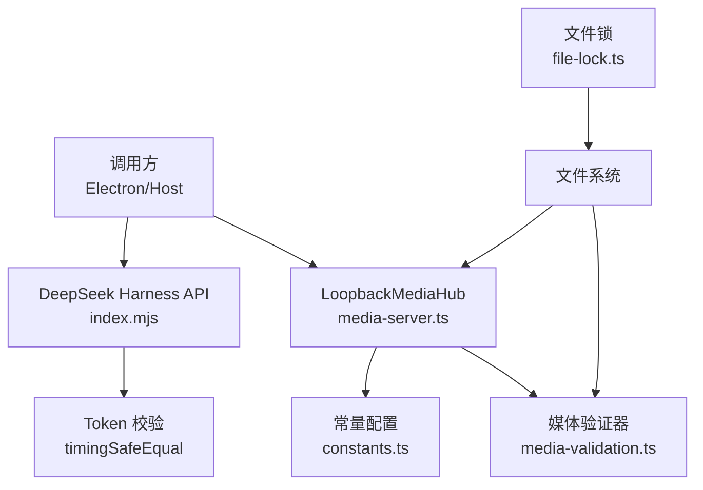
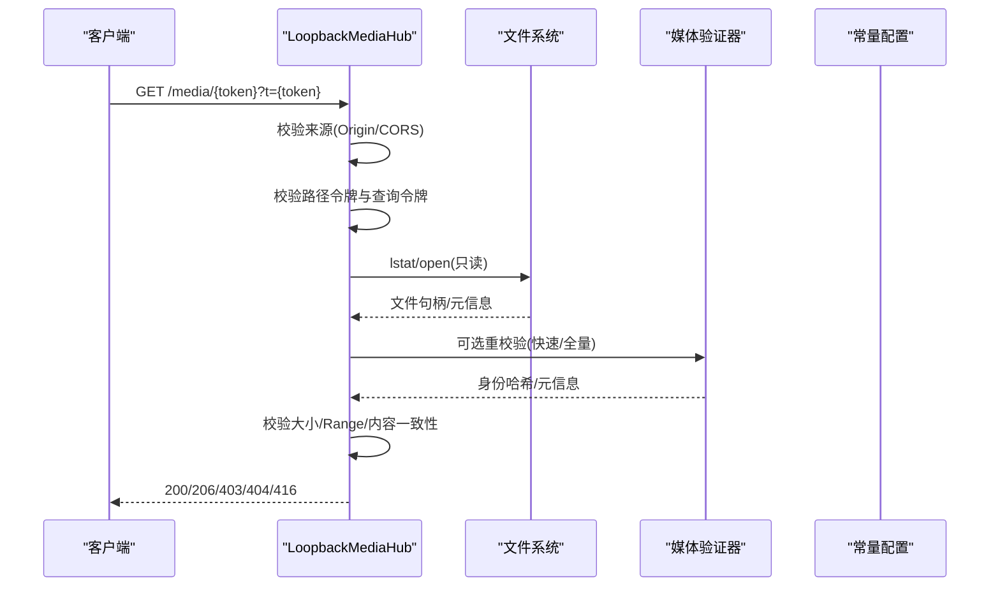
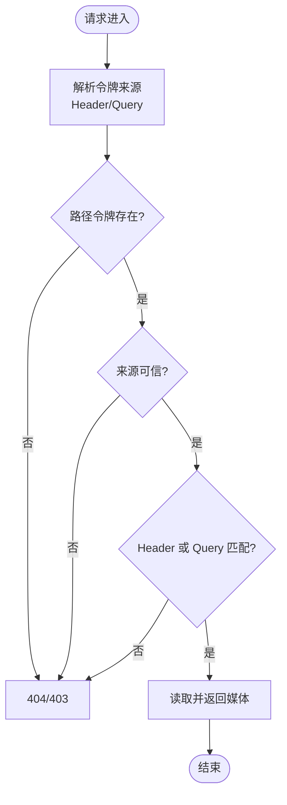
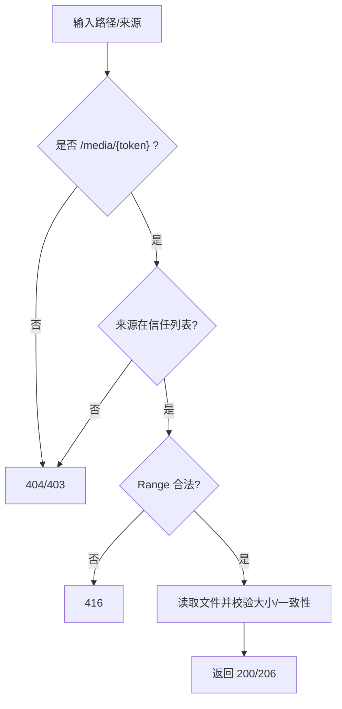
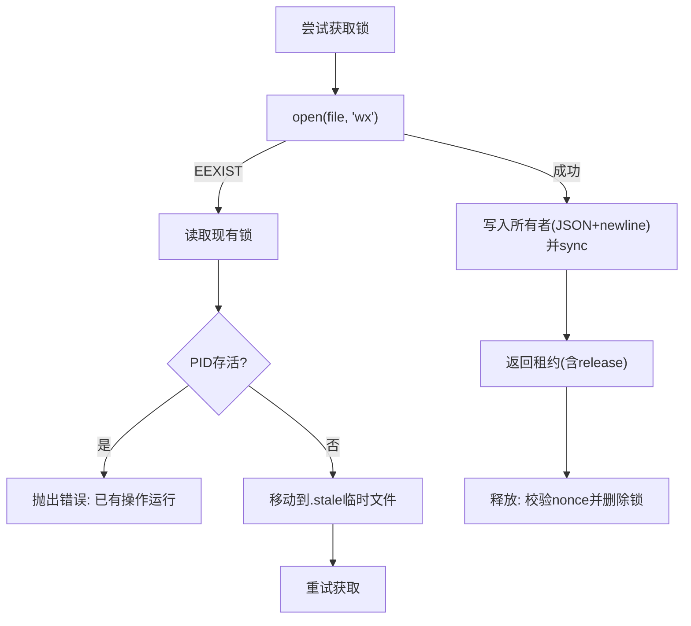
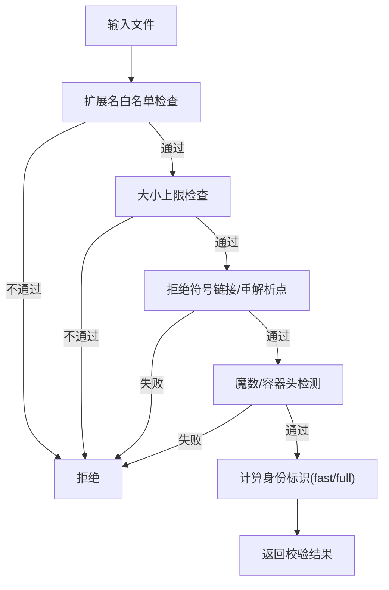
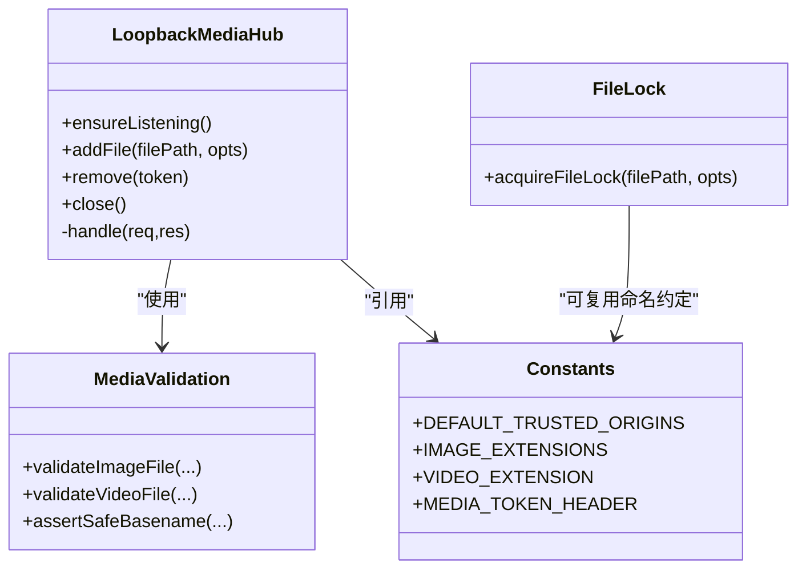

# 安全机制设计

<cite>
**本文引用的文件**
- [packages/core/src/media-server.ts](file://packages/core/src/media-server.ts)
- [packages/core/src/file-lock.ts](file://packages/core/src/file-lock.ts)
- [packages/core/src/media-validation.ts](file://packages/core/src/media-validation.ts)
- [packages/core/src/constants.ts](file://packages/core/src/constants.ts)
- [integrations/deepseek-harness/index.mjs](file://integrations/deepseek-harness/index.mjs)
- [docs/security-boundaries.md](file://docs/security-boundaries.md)
- [packages/core/test/media-validation.test.js](file://packages/core/test/media-validation.test.js)
- [packages/adapter-codex/test/adapter.test.js](file://packages/adapter-codex/test/adapter.test.js)
</cite>

## 目录
1. [简介](#简介)
2. [项目结构](#项目结构)
3. [核心组件](#核心组件)
4. [架构总览](#架构总览)
5. [详细组件分析](#详细组件分析)
6. [依赖关系分析](#依赖关系分析)
7. [性能与安全权衡](#性能与安全权衡)
8. [故障排查指南](#故障排查指南)
9. [结论](#结论)
10. [附录：最佳实践与威胁模型](#附录最佳实践与威胁模型)

## 简介
本文件系统性梳理 beautiCode 的安全机制，覆盖令牌认证、路径与范围限制、跨域保护（CORS）、并发文件锁、媒体白名单与类型校验等关键能力。文档以代码级实现为依据，给出流程图与时序图，帮助读者理解“如何防御”以及“为何这样设计”。

## 项目结构
本项目将安全能力集中在 core 包与 deepseek-harness 集成层：
- 本地回环媒体服务：仅绑定 127.0.0.1，通过不可猜测的路径令牌与来源白名单双重校验提供受控访问。
- 媒体验证器：对图片/视频进行扩展名白名单、大小上限、魔数/容器头检测、符号链接拒绝、内容一致性校验。
- 文件锁：基于 O_EXCL 的跨进程独占锁，带 nonce 防重入与过期清理，保障并发写入一致性与互斥。
- 集成层鉴权：Bridge API 使用 Bearer Token + timing-safe 比较，配合同源检查与载荷白名单。

图表来源
- [packages/core/src/media-server.ts:148-218](file://packages/core/src/media-server.ts#L148-L218)
- [packages/core/src/media-validation.ts:92-123](file://packages/core/src/media-validation.ts#L92-L123)
- [packages/core/src/constants.ts:24-52](file://packages/core/src/constants.ts#L24-L52)
- [integrations/deepseek-harness/index.mjs:90-106](file://integrations/deepseek-harness/index.mjs#L90-L106)
- [packages/core/src/file-lock.ts:65-170](file://packages/core/src/file-lock.ts#L65-L170)

章节来源
- [docs/security-boundaries.md:1-28](file://docs/security-boundaries.md#L1-L28)
- [packages/core/src/constants.ts:1-62](file://packages/core/src/constants.ts#L1-L62)

## 核心组件
- LoopbackMediaHub：本地回环媒体服务器，单端口多资源路由，严格限定方法、来源与令牌，支持 Range 分块传输与关闭期资源回收。
- MediaValidation：统一入口校验图片/视频，包含扩展名白名单、大小限制、魔数/容器头检测、符号链接拒绝、内容指纹与变更检测。
- FileLock：跨进程文件锁，O_EXCL 创建、nonce 防重放、死锁恢复与隔离。
- DeepSeek Harness 鉴权：Bearer Token 校验、同源检查、载荷白名单与长度限制。

章节来源
- [packages/core/src/media-server.ts:24-64](file://packages/core/src/media-server.ts#L24-L64)
- [packages/core/src/media-validation.ts:53-61](file://packages/core/src/media-validation.ts#L53-L61)
- [packages/core/src/file-lock.ts:5-20](file://packages/core/src/file-lock.ts#L5-L20)
- [integrations/deepseek-harness/index.mjs:15-19](file://integrations/deepseek-harness/index.mjs#L15-L19)

## 架构总览
下图展示从请求到响应的主要安全边界与数据流：

图表来源
- [packages/core/src/media-server.ts:406-590](file://packages/core/src/media-server.ts#L406-L590)
- [packages/core/src/media-validation.ts:125-190](file://packages/core/src/media-validation.ts#L125-L190)
- [packages/core/src/constants.ts:24-52](file://packages/core/src/constants.ts#L24-L52)

## 详细组件分析

### 令牌认证系统（媒体与 Bridge API）
- 媒体令牌
  - 生成：使用随机 UUID（去连字符），作为不可猜测的单路由能力令牌。
  - 传递：HTTP 头或查询参数 t=；两者任一匹配即可放行。
  - 验证：服务端维护 token→资产映射，命中后读取文件并再次校验元信息与内容一致性。
- Bridge API 令牌
  - 存储于 data root 下的 token 文件，采用固定格式正则校验。
  - 校验：解析 Authorization: Bearer <token>，使用 timingSafeEqual 避免时序攻击。
  - 同源：部分接口要求 same-origin，防止跨站滥用。

图表来源
- [packages/core/src/media-server.ts:431-479](file://packages/core/src/media-server.ts#L431-L479)
- [integrations/deepseek-harness/index.mjs:90-106](file://integrations/deepseek-harness/index.mjs#L90-L106)
- [packages/core/src/constants.ts:24-26](file://packages/core/src/constants.ts#L24-L26)

章节来源
- [packages/core/src/media-server.ts:96-98](file://packages/core/src/media-server.ts#L96-L98)
- [integrations/deepseek-harness/index.mjs:90-126](file://integrations/deepseek-harness/index.mjs#L90-L126)
- [docs/security-boundaries.md:39-44](file://docs/security-boundaries.md#L39-L44)

### 路径验证与范围限制（防目录遍历与越界访问）
- 路径白名单：仅允许 /media/{token} 且 token 为固定长度字母数字，杜绝任意路径访问。
- 来源限制：仅允许受信任来源（app://*、file:// 等），未授权来源一律 403。
- 路径包含性检查：所有内部路径必须位于 data root 内，拒绝符号链接与重解析点。
- 范围限制：Range 请求经严格解析，非法范围返回 416；同时限制最大字节数，防止超大文件滥用。

图表来源
- [packages/core/src/media-server.ts:431-479](file://packages/core/src/media-server.ts#L431-L479)
- [packages/core/src/media-server.ts:66-94](file://packages/core/src/media-server.ts#L66-L94)
- [packages/core/src/media-validation.ts:92-123](file://packages/core/src/media-validation.ts#L92-L123)
- [packages/core/test/media-validation.test.js:149-158](file://packages/core/test/media-validation.test.js#L149-L158)

章节来源
- [packages/core/src/media-server.ts:406-590](file://packages/core/src/media-server.ts#L406-L590)
- [packages/core/src/media-validation.ts:92-123](file://packages/core/src/media-validation.ts#L92-L123)
- [packages/core/test/media-validation.test.js:149-158](file://packages/core/test/media-validation.test.js#L149-L158)

### 跨域保护与 CORS 策略
- 绑定地址：仅监听 127.0.0.1，不暴露局域网。
- 来源白名单：默认信任 app://*、file:// 等，动态设置 Access-Control-Allow-Origin。
- 私有网络访问：显式允许 Private Network，适配 app:// → 127.0.0.1 场景。
- 预检处理：OPTIONS 请求在未授权来源时直接 403，避免泄露能力。

章节来源
- [packages/core/src/media-server.ts:177-218](file://packages/core/src/media-server.ts#L177-L218)
- [packages/core/src/media-server.ts:413-445](file://packages/core/src/media-server.ts#L413-L445)
- [packages/core/src/constants.ts:27-41](file://packages/core/src/constants.ts#L27-L41)

### 文件锁机制（并发一致性）
- 获取方式：使用 O_EXCL（wx）创建锁文件，确保原子性。
- 所有者记录：写入 pid、nonce、startedAt，释放时校验 nonce 防止误删他人锁。
- 死锁恢复：若检测到旧锁且进程已死或不可读，则隔离至 .stale-* 再重试。
- 迁移兼容：兼容无 nonce 的旧锁格式，仍可通过 PID 存活判断阻止抢占。

图表来源
- [packages/core/src/file-lock.ts:65-170](file://packages/core/src/file-lock.ts#L65-L170)

章节来源
- [packages/core/src/file-lock.ts:22-63](file://packages/core/src/file-lock.ts#L22-L63)
- [packages/core/src/file-lock.ts:72-170](file://packages/core/src/file-lock.ts#L72-L170)

### 媒体文件白名单与类型检查
- 扩展名白名单：图片仅限 jpg/jpeg/png/webp/avif；视频仅限 mp4。
- 大小上限：图片与视频分别有最大字节限制，防止内存/磁盘耗尽。
- 魔数/容器头：检测 JPEG/PNG/WebP/AVIF 魔数；MP4 需具备 ftyp box。
- 符号链接拒绝：路径中任何段不得为符号链接或重解析点。
- 内容一致性：fast/full 两种模式，fast 基于元数据+头部哈希；full 扫描全文；运行时再次 re-stat 与哈希比对，发现篡改即拒绝。

图表来源
- [packages/core/src/media-validation.ts:192-292](file://packages/core/src/media-validation.ts#L192-L292)
- [packages/core/src/media-validation.ts:125-190](file://packages/core/src/media-validation.ts#L125-L190)
- [packages/core/test/media-validation.test.js:133-148](file://packages/core/test/media-validation.test.js#L133-L148)

章节来源
- [packages/core/src/media-validation.ts:92-123](file://packages/core/src/media-validation.ts#L92-L123)
- [packages/core/src/media-validation.ts:192-292](file://packages/core/src/media-validation.ts#L192-L292)
- [packages/core/test/media-validation.test.js:149-158](file://packages/core/test/media-validation.test.js#L149-L158)

### 类与模块关系（代码级）

图表来源
- [packages/core/src/media-server.ts:148-335](file://packages/core/src/media-server.ts#L148-L335)
- [packages/core/src/media-validation.ts:223-292](file://packages/core/src/media-validation.ts#L223-L292)
- [packages/core/src/file-lock.ts:72-170](file://packages/core/src/file-lock.ts#L72-L170)
- [packages/core/src/constants.ts:24-52](file://packages/core/src/constants.ts#L24-L52)

## 依赖关系分析
- media-server.ts 依赖 constants.ts 中的白名单与头名，依赖 media-validation.ts 做内容准入。
- file-lock.ts 独立于业务逻辑，被需要互斥写入的场景使用。
- deepseek-harness/index.mjs 提供 Bridge API，依赖本地 token 文件与同源校验，并对载荷进行严格白名单校验。
- 测试用例验证了路径穿越拒绝、魔数校验、CDP 探测仅允许回环等安全约束。

章节来源
- [packages/core/src/media-server.ts:1-23](file://packages/core/src/media-server.ts#L1-L23)
- [integrations/deepseek-harness/index.mjs:204-500](file://integrations/deepseek-harness/index.mjs#L204-L500)
- [packages/adapter-codex/test/adapter.test.js:250-317](file://packages/adapter-codex/test/adapter.test.js#L250-L317)

## 性能与安全权衡
- fast vs full 校验：fast 模式仅对头部与元数据哈希，适合本地引用导入，避免对大文件的完整扫描；full 模式用于更高安全需求场景。
- Range 分块传输：减少带宽与内存占用，提升大视频播放体验。
- 超时与连接限制：server.requestTimeout、headersTimeout、maxRequestsPerSocket 控制资源占用。
- 关闭期资源回收：AbortController 与 socket 管理确保退出时不悬挂。

章节来源
- [packages/core/src/media-server.ts:177-218](file://packages/core/src/media-server.ts#L177-L218)
- [packages/core/src/media-server.ts:365-404](file://packages/core/src/media-server.ts#L365-L404)
- [packages/core/src/media-validation.ts:125-190](file://packages/core/src/media-validation.ts#L125-L190)

## 故障排查指南
- 403 未授权：检查 Origin 是否在信任列表，或请求是否携带正确的媒体令牌（Header 或 ?t=）。
- 404 不存在：确认 token 是否存在于当前 hub 的资产表，或路径是否被正确构造。
- 416 范围无效：检查 Range 头是否符合 bytes=... 语法，且 start/end 在有效区间。
- 媒体校验失败：确认扩展名在白名单、文件大小未超限、魔数/容器头正确、非符号链接。
- 锁冲突：若提示“另一操作正在运行”，等待或清理 stale 锁文件；确保旧进程已退出。

章节来源
- [packages/core/src/media-server.ts:431-590](file://packages/core/src/media-server.ts#L431-L590)
- [packages/core/src/media-validation.ts:92-123](file://packages/core/src/media-validation.ts#L92-L123)
- [packages/core/src/file-lock.ts:131-170](file://packages/core/src/file-lock.ts#L131-L170)

## 结论
beautiCode 的安全机制围绕“最小暴露面、强校验、可审计”的原则构建：媒体服务仅绑定回环、路径与来源双重白名单、令牌不可猜测；媒体内容在导入与回放阶段均进行严格校验；并发写入通过跨进程文件锁保证一致性；Bridge API 使用 Bearer Token 与同源限制。整体设计兼顾安全性与性能，适用于桌面端背景媒体管理与渲染注入场景。

## 附录：最佳实践与威胁模型

### 安全威胁分析与防护
- 目录遍历/越权访问
  - 风险：恶意路径绕过导致读取任意文件。
  - 防护：仅允许 /media/{token}；来源白名单；路径必须在 data root 内；拒绝符号链接与重解析点。
- 令牌泄露/重放
  - 风险：令牌被截获后重复利用。
  - 防护：令牌为一次性路由能力；结合来源校验；Bridge API 使用 timingSafeEqual 比较。
- 超大文件/DoS
  - 风险：大文件或恶意 Range 导致资源耗尽。
  - 防护：大小上限、Range 合法性校验、请求超时与每 Socket 请求数限制。
- 媒体伪造/注入
  - 风险：伪装成图片/视频的恶意文件。
  - 防护：魔数/容器头检测、扩展名白名单、内容一致性校验（fast/full）。
- 跨站滥用
  - 风险：外部页面通过浏览器加载敏感媒体。
  - 防护：CORS 白名单、Private Network 显式允许、OPTIONS 预检拦截。

章节来源
- [docs/security-boundaries.md:1-28](file://docs/security-boundaries.md#L1-L28)
- [packages/core/src/media-server.ts:413-479](file://packages/core/src/media-server.ts#L413-L479)
- [packages/core/src/media-validation.ts:192-292](file://packages/core/src/media-validation.ts#L192-L292)

### 安全最佳实践
- 始终绑定 127.0.0.1，禁止 LAN 暴露。
- 对所有用户输入进行白名单校验（扩展名、大小、魔数）。
- 使用不可猜测的令牌与 timing-safe 比较。
- 在关键路径上实施来源校验与预检拦截。
- 对大文件采用 Range 传输与超时控制。
- 使用文件锁确保互斥写入，避免竞态条件。
- 定期清理 stale 锁与过期资产，保持资源可控。

章节来源
- [packages/core/src/constants.ts:24-52](file://packages/core/src/constants.ts#L24-L52)
- [integrations/deepseek-harness/index.mjs:90-126](file://integrations/deepseek-harness/index.mjs#L90-L126)
- [packages/core/src/file-lock.ts:65-170](file://packages/core/src/file-lock.ts#L65-L170)