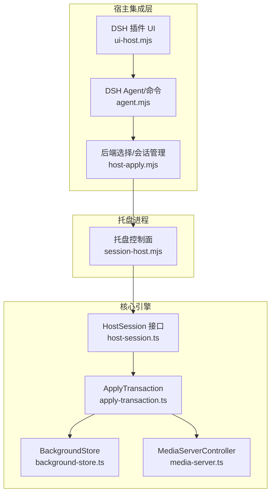
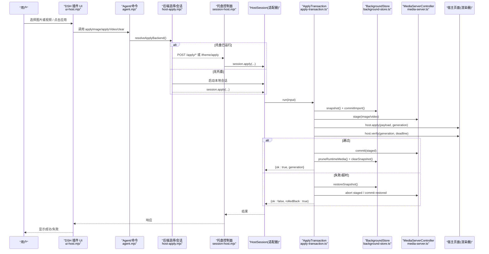
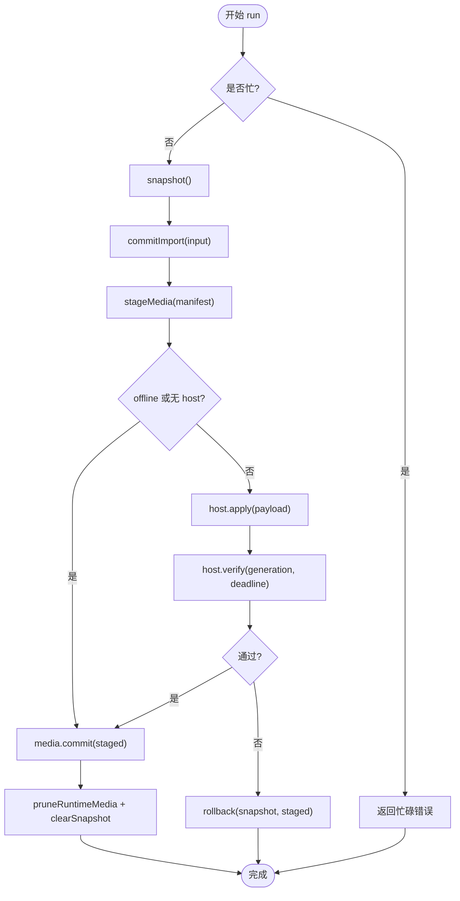
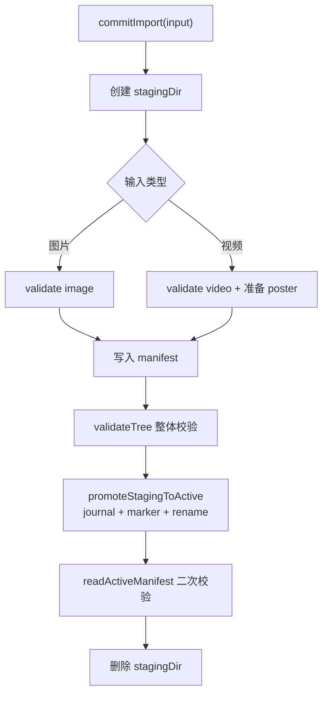
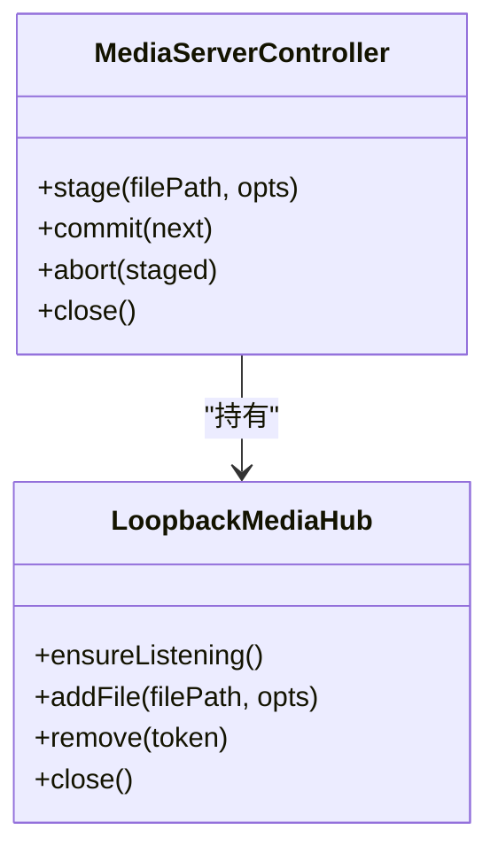
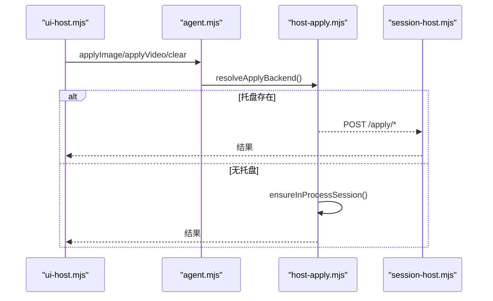
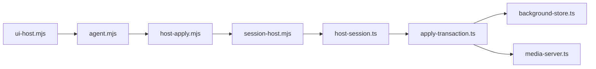

# 数据流设计

<cite>
**本文引用的文件**
- [README.md](file://README.md)
- [apply-transaction.md](file://docs/apply-transaction.md)
- [media-contract.md](file://docs/media-contract.md)
- [package.json](file://package.json)
- [ui-host.mjs](file://integrations/deepseek-harness/ui-host.mjs)
- [host-apply.mjs](file://integrations/deepseek-harness/host-apply.mjs)
- [agent.mjs](file://integrations/deepseek-harness/agent.mjs)
- [session-host.mjs](file://apps/tray/session-host.mjs)
- [apply-transaction.ts](file://packages/core/src/apply-transaction.ts)
- [background-store.ts](file://packages/core/src/background-store.ts)
- [media-server.ts](file://packages/core/src/media-server.ts)
- [host-session.ts](file://packages/core/src/host-session.ts)
</cite>

## 目录
1. [简介](#简介)
2. [项目结构](#项目结构)
3. [核心组件](#核心组件)
4. [架构总览](#架构总览)
5. [详细组件分析](#详细组件分析)
6. [依赖关系分析](#依赖关系分析)
7. [性能与缓存](#性能与缓存)
8. [故障排查](#故障排查)
9. [结论](#结论)
10. [附录：关键数据契约与状态机](#附录：关键数据契约与状态机)

## 简介
本文件面向 beautiCode 的数据流设计，聚焦“用户操作到背景渲染”的完整链路：从用户在宿主应用（DeepSeek Harness 或 Codex Desktop）中选择媒体文件，到本地后台完成事务提交、媒体服务发布、注入宿主页面并验证可见性，最终稳定生效。文档同时解释 ApplyTransaction 的事务流程（快照、预写、原子提交、发布、宿主注入、实时校验、回滚）、跨组件状态同步机制、事件驱动传播模式、以及缓存策略与性能优化措施。文末提供数据流图与时序图，帮助理解复杂交互。

## 项目结构
beautiCode 采用多包工作区组织：
- packages/core：核心事务、存储、媒体服务、类型与常量等。
- integrations/deepseek-harness：DSH 插件侧 UI 入口、命令/工具注册、会话桥接。
- apps/tray：托盘进程，暴露本地控制面，封装 HostSession 调用。
- scripts、installer、assets：构建、安装与内置资源。

图表来源
- [ui-host.mjs:302-798](file://integrations/deepseek-harness/ui-host.mjs#L302-L798)
- [agent.mjs:176-514](file://integrations/deepseek-harness/agent.mjs#L176-L514)
- [host-apply.mjs:32-165](file://integrations/deepseek-harness/host-apply.mjs#L32-L165)
- [session-host.mjs:290-540](file://apps/tray/session-host.mjs#L290-L540)
- [apply-transaction.ts:103-384](file://packages/core/src/apply-transaction.ts#L103-L384)
- [background-store.ts:123-800](file://packages/core/src/background-store.ts#L123-L800)
- [media-server.ts:636-732](file://packages/core/src/media-server.ts#L636-L732)
- [host-session.ts:27-47](file://packages/core/src/host-session.ts#L27-L47)

章节来源
- [README.md:19-166](file://README.md#L19-L166)
- [package.json:1-28](file://package.json#L1-L28)

## 核心组件
- 应用事务 ApplyTransaction：编排快照、磁盘预写、原子提交、媒体发布、宿主注入、实时校验与回滚；保证“磁盘写入成功不等于用户可见成功”。
- 背景存储 BackgroundStore：负责 active/staging/snapshots/runtime-media 目录布局、原子切换、中断恢复、运行时视频拷贝与清理。
- 媒体服务 MediaServerController/LoopbackMediaHub：本地环回地址的多资产 HTTP 服务，支持 Range、鉴权、CORS、安全限制。
- 宿主会话 HostSession：托盘与适配器统一抽象，屏蔽 DSH/Codex 差异。
- DSH 插件侧：UI 路由、原生文件选择器、受管上传、主题保存、命令/工具注册、会话生命周期管理。
- 托盘进程 session-host：长期运行的本地控制面，转发 apply/reapply/theme/mode 等操作到具体适配器。

章节来源
- [apply-transaction.ts:94-152](file://packages/core/src/apply-transaction.ts#L94-L152)
- [background-store.ts:123-159](file://packages/core/src/background-store.ts#L123-L159)
- [media-server.ts:24-64](file://packages/core/src/media-server.ts#L24-L64)
- [host-session.ts:23-47](file://packages/core/src/host-session.ts#L23-L47)
- [ui-host.mjs:302-798](file://integrations/deepseek-harness/ui-host.mjs#L302-L798)
- [session-host.mjs:290-540](file://apps/tray/session-host.mjs#L290-L540)

## 架构总览
下图展示一次“图片/视频背景应用”的端到端时序：从 UI 触发到宿主页面可见渲染，再到事务最终化或回滚。

图表来源
- [ui-host.mjs:450-668](file://integrations/deepseek-harness/ui-host.mjs#L450-L668)
- [agent.mjs:190-327](file://integrations/deepseek-harness/agent.mjs#L190-L327)
- [host-apply.mjs:73-165](file://integrations/deepseek-harness/host-apply.mjs#L73-L165)
- [session-host.mjs:363-418](file://apps/tray/session-host.mjs#L363-L418)
- [apply-transaction.ts:127-294](file://packages/core/src/apply-transaction.ts#L127-L294)
- [background-store.ts:564-716](file://packages/core/src/background-store.ts#L564-L716)
- [media-server.ts:660-732](file://packages/core/src/media-server.ts#L660-L732)

## 详细组件分析

### 应用事务 ApplyTransaction
- 职责：在 withExclusiveMutation 保护下，按顺序执行 initialize → snapshot → commitImport → stageMedia → buildPayload → host.apply → verify → media.commit → finalize/cleanup；失败时 rollback 并尽量恢复宿主可见状态。
- 并发控制：内部 busy 标志 + store 写锁，避免嵌套/重复 apply。
- 重试策略：对可重试的首帧/Range 探针失败，进行一次 host.apply 重试后再 verify。
- 数据载荷：为宿主注入 CSS、imageDataUrl/imageUrl、video 配置（mode/localPath/url/token/startAt），并携带 generation 用于去抖与过期处理。
- 回滚路径：abort staged → restoreSnapshot → 重新 stage/apply 旧版本 → commit 旧媒体 → 清理 runtime 与快照。

图表来源
- [apply-transaction.ts:127-294](file://packages/core/src/apply-transaction.ts#L127-L294)

章节来源
- [apply-transaction.ts:94-152](file://packages/core/src/apply-transaction.ts#L94-L152)
- [apply-transaction.ts:154-294](file://packages/core/src/apply-transaction.ts#L154-L294)
- [apply-transaction.ts:349-384](file://packages/core/src/apply-transaction.ts#L349-L384)

### 背景存储 BackgroundStore
- 目录模型：active、staging、snapshots、runtime-media；通过 journal + marker 实现原子切换与中断恢复。
- 导入与提交：commitImport 将用户媒体放入 staging，校验通过后原子 rename 替换 active；读取时拒绝进行中的标记。
- 运行时视频：managed 视频会复制到 session 子目录，避免 Chromium 打开 active 目录导致下次 swap EPERM；local 视频直接复用源路径并预热首段。
- 清理：pruneRuntimeMedia 保留 keepPath，删除其他 session 与缓存项。

图表来源
- [background-store.ts:564-678](file://packages/core/src/background-store.ts#L564-L678)
- [background-store.ts:757-798](file://packages/core/src/background-store.ts#L757-L798)

章节来源
- [background-store.ts:123-159](file://packages/core/src/background-store.ts#L123-L159)
- [background-store.ts:277-305](file://packages/core/src/background-store.ts#L277-L305)
- [background-store.ts:352-437](file://packages/core/src/background-store.ts#L352-L437)
- [background-store.ts:444-494](file://packages/core/src/background-store.ts#L444-L494)
- [background-store.ts:504-529](file://packages/core/src/background-store.ts#L504-L529)
- [background-store.ts:680-716](file://packages/core/src/background-store.ts#L680-L716)

### 媒体服务 MediaServerController/LoopbackMediaHub
- 单端口多资产：每个媒体生成不可猜测 token，URL 形式 http://127.0.0.1:<port>/media/<token>?t=<token>。
- 安全：Origin 白名单、Header/Query Token 双重校验、Range 支持、大小限制、符号链接拒绝、内容指纹校验。
- 控制器：维护当前 image/video 句柄，commit 时替换并释放不再使用的 token；abort 丢弃未提交的句柄。

图表来源
- [media-server.ts:148-335](file://packages/core/src/media-server.ts#L148-L335)
- [media-server.ts:636-732](file://packages/core/src/media-server.ts#L636-L732)

章节来源
- [media-server.ts:24-64](file://packages/core/src/media-server.ts#L24-L64)
- [media-server.ts:406-590](file://packages/core/src/media-server.ts#L406-L590)
- [media-server.ts:660-732](file://packages/core/src/media-server.ts#L660-L732)

### 宿主集成与托盘
- DSH 插件 UI：提供状态查询、文件选择、受管上传、主题保存、模式切换等路由；选择后进入 actions.applyImage/applyVideo 或 importSelected。
- Agent/命令：将用户意图转换为 apply 输入，自动选择托盘或内嵌会话后端。
- 托盘 session-host：监听 127.0.0.1，认证后转发 apply/reapply/theme/mode 等请求到具体适配器（DSH/Codex）。

图表来源
- [ui-host.mjs:450-668](file://integrations/deepseek-harness/ui-host.mjs#L450-L668)
- [agent.mjs:190-327](file://integrations/deepseek-harness/agent.mjs#L190-L327)
- [host-apply.mjs:73-165](file://integrations/deepseek-harness/host-apply.mjs#L73-L165)
- [session-host.mjs:363-418](file://apps/tray/session-host.mjs#L363-L418)

章节来源
- [ui-host.mjs:302-798](file://integrations/deepseek-harness/ui-host.mjs#L302-L798)
- [agent.mjs:176-514](file://integrations/deepseek-harness/agent.mjs#L176-L514)
- [host-apply.mjs:32-165](file://integrations/deepseek-harness/host-apply.mjs#L32-L165)
- [session-host.mjs:290-540](file://apps/tray/session-host.mjs#L290-L540)

## 依赖关系分析
- 上层 UI/Agent 依赖 host-apply 决定走托盘还是内嵌会话。
- 托盘通过 HostSession 抽象调用 core 的 ApplyTransaction。
- ApplyTransaction 依赖 BackgroundStore 与 MediaServerController，并通过 HostApplier 与宿主页面交互。
- 媒体服务独立于业务逻辑，仅暴露稳定的 URL/Token 访问方式。

图表来源
- [ui-host.mjs:302-798](file://integrations/deepseek-harness/ui-host.mjs#L302-L798)
- [agent.mjs:176-514](file://integrations/deepseek-harness/agent.mjs#L176-L514)
- [host-apply.mjs:32-165](file://integrations/deepseek-harness/host-apply.mjs#L32-L165)
- [session-host.mjs:290-540](file://apps/tray/session-host.mjs#L290-L540)
- [apply-transaction.ts:103-384](file://packages/core/src/apply-transaction.ts#L103-L384)
- [background-store.ts:123-800](file://packages/core/src/background-store.ts#L123-L800)
- [media-server.ts:636-732](file://packages/core/src/media-server.ts#L636-L732)

章节来源
- [host-session.ts:23-47](file://packages/core/src/host-session.ts#L23-L47)

## 性能与缓存
- 原子切换与只读可见性：通过 staging + journal + marker 确保读者永远看到一致集合，避免混合 image/video/json 导致的闪烁或错乱。
- 运行时视频拷贝：避免 Chromium 打开 active 目录导致后续 swap 失败；本地视频预热首段减少首帧延迟。
- 媒体服务复用：相同文件 identity 复用同一 token，减少重复注册与内存占用。
- 小体积内联：小于阈值的小视频使用 data URL 绕过 CSP 限制，降低首次加载开销。
- 批量清理：pruneRuntimeMedia 定期清理非活跃 session 与缓存，控制磁盘增长。
- 超时与重试：verify 阶段带 deadline，对可重试的首帧/Range 探针失败做有限重试，避免误判。

章节来源
- [background-store.ts:352-437](file://packages/core/src/background-store.ts#L352-L437)
- [background-store.ts:444-494](file://packages/core/src/background-store.ts#L444-L494)
- [apply-transaction.ts:47-54](file://packages/core/src/apply-transaction.ts#L47-L54)
- [apply-transaction.ts:212-227](file://packages/core/src/apply-transaction.ts#L212-L227)
- [media-server.ts:271-280](file://packages/core/src/media-server.ts#L271-L280)
- [apply-transaction.ts:457-459](file://packages/core/src/apply-transaction.ts#L457-L459)

## 故障排查
- 事务失败且已回滚：检查 verify 阶段 reason 与阶段耗时，定位卡在 host.apply/verify 还是磁盘/媒体阶段。
- 宿主不可见：确认 generation 匹配、CSS 注入成功、video 未因 CSP 被拦截；必要时启用 data URL 模式。
- 视频无法播放：检查容器/编解码兼容性、Range 支持、文件大小与媒体服务可达性；查看日志中 videoFailed 信号。
- 托盘冲突：若检测到托盘已启动，优先走托盘通道；否则尝试内嵌会话；注意 TRAY_CLAIMED 提示。
- 权限与路径：确保 media 路径未被替换为符号链接，runtime-media 目录真实存在且不被外部篡改。

章节来源
- [apply-transaction.ts:212-244](file://packages/core/src/apply-transaction.ts#L212-L244)
- [apply-transaction.ts:266-294](file://packages/core/src/apply-transaction.ts#L266-L294)
- [media-server.ts:488-522](file://packages/core/src/media-server.ts#L488-L522)
- [host-apply.mjs:86-117](file://integrations/deepseek-harness/host-apply.mjs#L86-L117)

## 结论
beautiCode 以 ApplyTransaction 为核心，将“磁盘持久化”和“宿主可见性”解耦，通过快照、原子提交、媒体服务发布与宿主实时校验，确保背景变更的强一致性与可回滚性。配合 BackgroundStore 的严格目录约束与中断恢复、MediaServerController 的安全环回服务、以及 DSH 插件/托盘的灵活接入，实现了从用户操作到宿主渲染的可靠数据流。

## 附录：关键数据契约与状态机
- 媒体契约：schema、generation、background.type/image/video/source、updatedAt；图片/视频扩展名、大小、魔数、容器等校验规则。
- 事务状态机：idle → snapshot → stage → commit-disk → publish-media → apply-host → live-verify → finalize/rollback。
- 传输模式：blob（首选，Windows 通过 CDP 文件输入）与 server（loopback URL 回退）。

章节来源
- [media-contract.md:1-99](file://docs/media-contract.md#L1-L99)
- [apply-transaction.md:7-19](file://docs/apply-transaction.md#L7-L19)
- [apply-transaction.md:43-61](file://docs/apply-transaction.md#L43-L61)
- [apply-transaction.md:62-89](file://docs/apply-transaction.md#L62-L89)
- [apply-transaction.md:99-117](file://docs/apply-transaction.md#L99-L117)