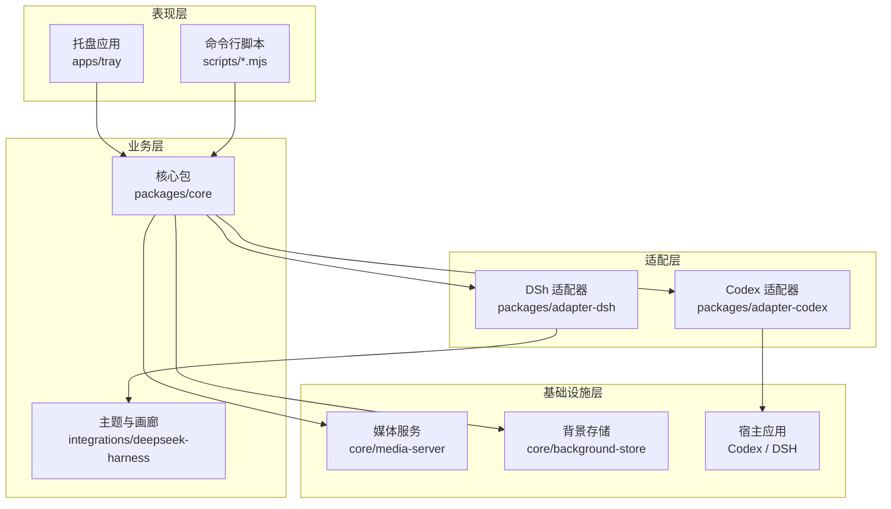
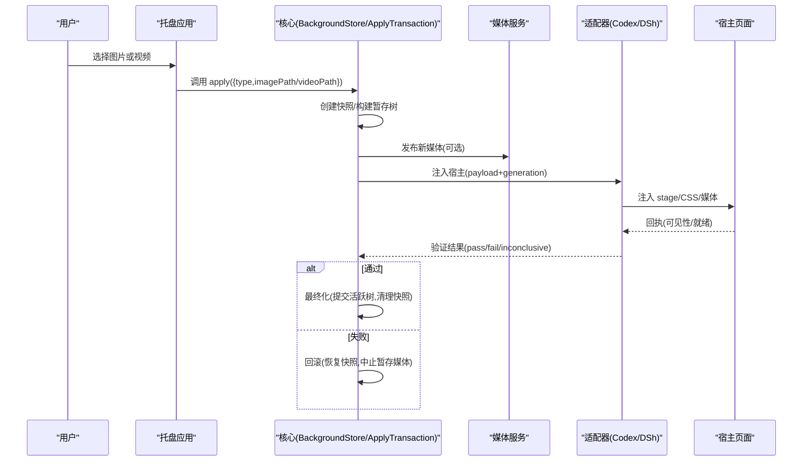
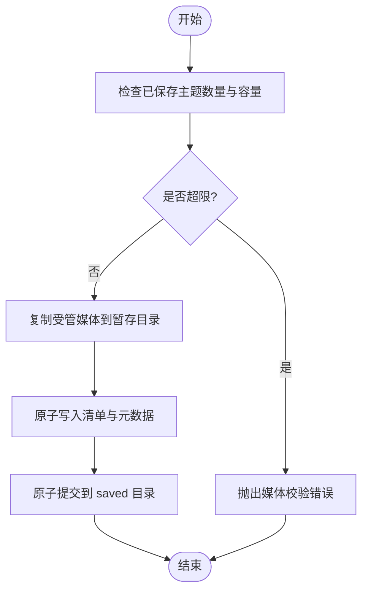
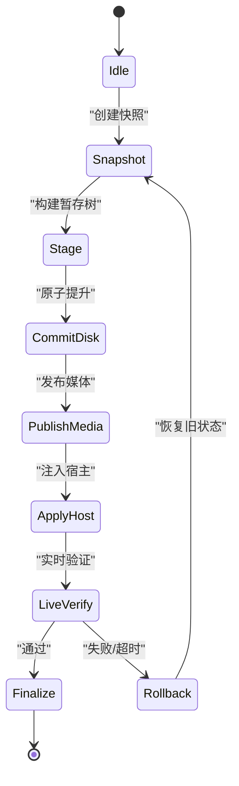
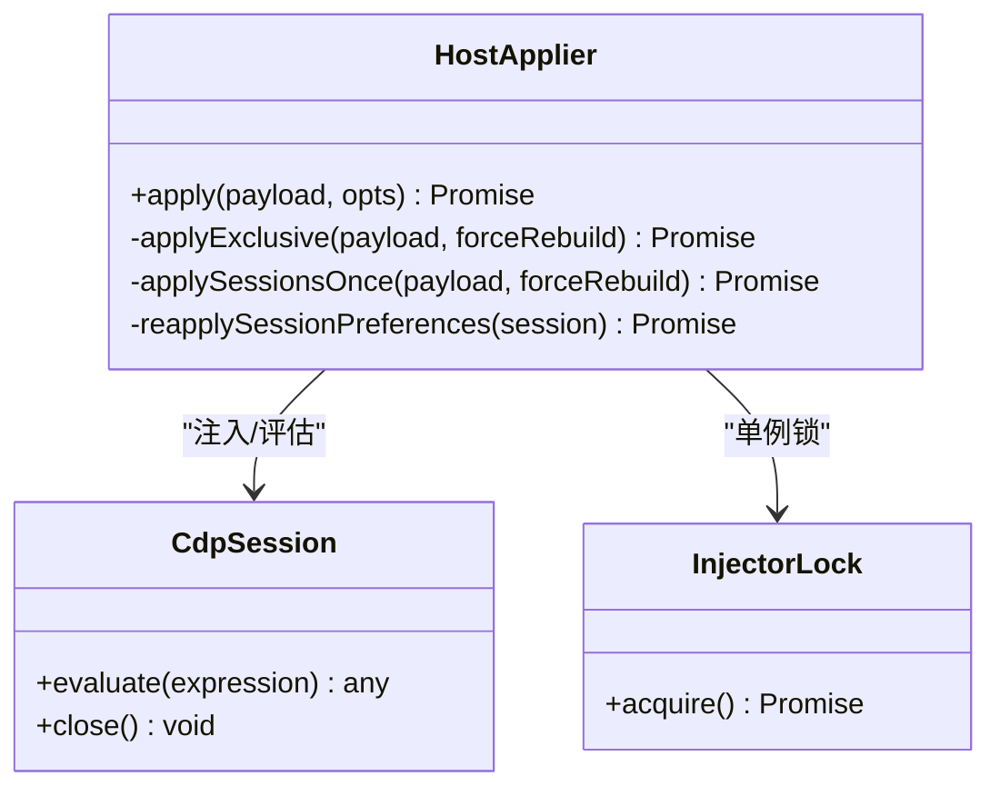
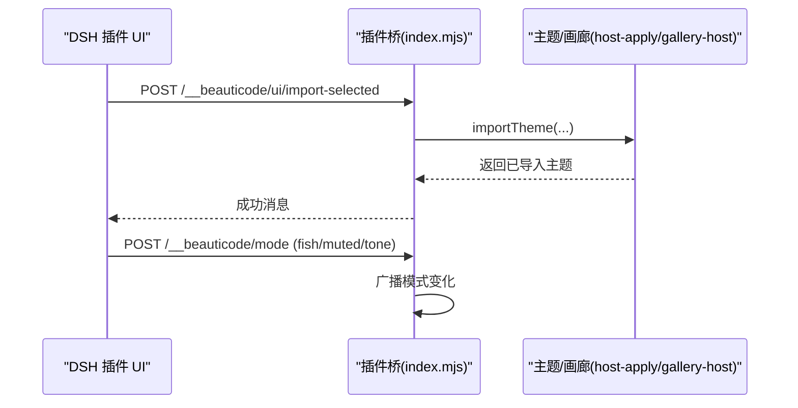
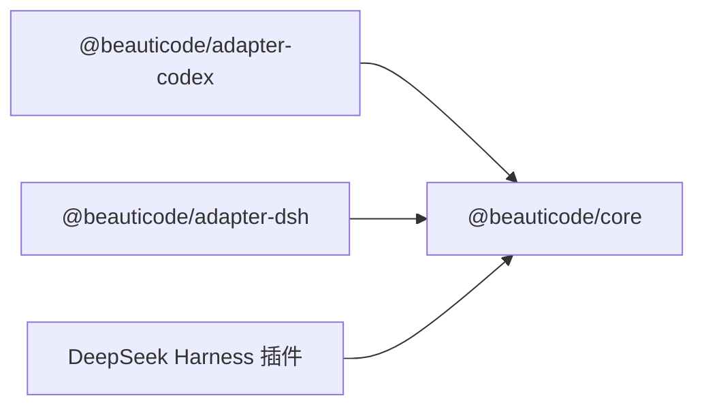

# 整体架构概览

<cite>
**本文引用的文件**
- [README.md](file://README.md)
- [package.json](file://package.json)
- [apps/tray/README.md](file://apps/tray/README.md)
- [packages/core/src/index.ts](file://packages/core/src/index.ts)
- [packages/core/src/background-store.ts](file://packages/core/src/background-store.ts)
- [packages/core/src/apply-transaction.ts](file://packages/core/src/apply-transaction.ts)
- [packages/core/src/media-server.ts](file://packages/core/src/media-server.ts)
- [packages/core/src/media-source.ts](file://packages/core/src/media-source.ts)
- [packages/core/src/media-validation.ts](file://packages/core/src/media-validation.ts)
- [packages/core/src/file-lock.ts](file://packages/core/src/file-lock.ts)
- [packages/core/src/host-session.ts](file://packages/core/src/host-session.ts)
- [packages/core/src/types.ts](file://packages/core/src/types.ts)
- [packages/adapter-codex/src/index.ts](file://packages/adapter-codex/src/index.ts)
- [packages/adapter-codex/src/session.ts](file://packages/adapter-codex/src/session.ts)
- [packages/adapter-codex/src/host-applier.ts](file://packages/adapter-codex/src/host-applier.ts)
- [packages/adapter-codex/src/injector-lock.ts](file://packages/adapter-codex/src/injector-lock.ts)
- [packages/adapter-codex/src/cdp.ts](file://packages/adapter-codex/src/cdp.ts)
- [packages/adapter-codex/src/discovery.ts](file://packages/adapter-codex/src/discovery.ts)
- [packages/adapter-dsh/package.json](file://packages/adapter-dsh/package.json)
- [integrations/deepseek-harness/index.mjs](file://integrations/deepseek-harness/index.mjs)
- [integrations/deepseek-harness/gallery-host.mjs](file://integrations/deepseek-harness/gallery-host.mjs)
- [docs/host-adapter.md](file://docs/host-adapter.md)
- [docs/apply-transaction.md](file://docs/apply-transaction.md)
- [docs/upstream-reference.md](file://docs/upstream-reference.md)
</cite>

## 目录
1. [简介](#简介)
2. [项目结构](#项目结构)
3. [核心组件](#核心组件)
4. [架构总览](#架构总览)
5. [详细组件分析](#详细组件分析)
6. [依赖关系分析](#依赖关系分析)
7. [性能与可靠性](#性能与可靠性)
8. [故障排查指南](#故障排查指南)
9. [结论](#结论)
10. [附录：扩展与插件机制](#附录：扩展与插件机制)

## 简介
beautiCode 是一个本地背景工具，主要为 DeepSeek Harness 和 Codex Desktop 提供图片与视频背景能力。它通过“宿主应用适配器”将媒体注入到宿主页面中，并通过“事务化应用流程”确保磁盘写入与宿主渲染一致性。系统采用模块化分层设计：表现层（托盘应用、CLI）、业务层（背景管理、主题系统）、适配层（Codex/DSh 适配器）和基础设施层（媒体服务、存储管理）。

## 项目结构
仓库采用 monorepo 组织：
- apps/tray：Windows 系统托盘入口，使用 PowerShell NotifyIcon + Node session host，通过环回 HTTP 控制通道与核心交互。
- packages/core：核心业务与基础设施，包含背景存储、事务化应用、媒体服务、媒体源与校验、文件锁、进程存活检测等。
- packages/adapter-codex：针对 Codex Desktop 的 CDP 注入适配器，负责会话发现、注入、验证与偏好重放。
- packages/adapter-dsh：面向 DeepSeek Harness 的适配器封装，复用 core 能力并通过 DSH 插件桥通信。
- integrations/deepseek-harness：DSH 插件实现，提供 UI、主题、画廊、SSE 事件广播与 apply/mode/status 等路由。
- docs：契约与流程文档，包括宿主适配器约定、事务化应用流程、上游问题约束等。

图表来源
- [package.json:7-10](file://package.json#L7-L10)
- [apps/tray/README.md:5-18](file://apps/tray/README.md#L5-L18)
- [packages/core/src/index.ts:1-19](file://packages/core/src/index.ts#L1-L19)
- [packages/adapter-codex/src/index.ts:1-79](file://packages/adapter-codex/src/index.ts#L1-L79)
- [integrations/deepseek-harness/index.mjs:204-645](file://integrations/deepseek-harness/index.mjs#L204-L645)

章节来源
- [README.md:19-35](file://README.md#L19-L35)
- [package.json:1-28](file://package.json#L1-L28)
- [apps/tray/README.md:5-18](file://apps/tray/README.md#L5-L18)

## 核心组件
- 背景存储 BackgroundStore：负责主题保存、导入、原子提交、容量限制、路径安全校验、快照恢复等。
- 事务化应用 ApplyTransaction：定义从快照→暂存→提交→发布媒体→注入宿主→实时验证→最终化或回滚的完整流程。
- 媒体服务 MediaServer：为视频等媒体提供本地环回 URL 分发，支持阶段化提交与中止。
- 媒体源与校验：统一解析本地/受管媒体路径，执行类型与大小校验，保障输入安全。
- 适配器：
  - Codex 适配器：基于 CDP 发现目标、注入 DOM stage、验证可见性与就绪状态、重放偏好（摸鱼/静音/色调）。
  - DSh 适配器：通过 DSH 插件桥（HTTP/SSE）与应用背景与模式同步。
- 托盘应用：提供菜单、全局热键、视频进度持久化、声音开关、主题管理等用户界面。

章节来源
- [packages/core/src/background-store.ts:1-892](file://packages/core/src/background-store.ts#L1-L892)
- [docs/apply-transaction.md:1-117](file://docs/apply-transaction.md#L1-L117)
- [packages/core/src/media-server.ts](file://packages/core/src/media-server.ts)
- [packages/core/src/media-source.ts](file://packages/core/src/media-source.ts)
- [packages/core/src/media-validation.ts](file://packages/core/src/media-validation.ts)
- [packages/adapter-codex/src/session.ts:98-127](file://packages/adapter-codex/src/session.ts#L98-L127)
- [packages/adapter-codex/src/host-applier.ts:233-360](file://packages/adapter-codex/src/host-applier.ts#L233-L360)
- [integrations/deepseek-harness/index.mjs:204-645](file://integrations/deepseek-harness/index.mjs#L204-L645)
- [apps/tray/README.md:19-55](file://apps/tray/README.md#L19-L55)

## 架构总览
beautiCode 的分层职责清晰：
- 表现层：托盘与 CLI 暴露操作入口，不直接处理媒体与注入逻辑。
- 业务层：核心包维护背景状态、主题、事务化应用、媒体服务；DSH 插件提供主题画廊与 UI。
- 适配层：按宿主差异实现注入与验证，屏蔽底层细节。
- 基础设施层：文件系统、媒体分发、CSP/CDP 安全边界、进程存活检测。

图表来源
- [docs/apply-transaction.md:7-19](file://docs/apply-transaction.md#L7-L19)
- [packages/core/src/background-store.ts:821-892](file://packages/core/src/background-store.ts#L821-L892)
- [packages/adapter-codex/src/host-applier.ts:243-360](file://packages/adapter-codex/src/host-applier.ts#L243-L360)
- [integrations/deepseek-harness/index.mjs:470-532](file://integrations/deepseek-harness/index.mjs#L470-L532)

## 详细组件分析

### 背景存储与主题系统
- 主题保存：在保存前进行数量与容量限制检查，拷贝受管媒体并原子写入清单与元数据，支持视频位置持久化。
- 导入与恢复：导入受管主题时先复制到暂存目录，再原子替换，避免混合状态。
- 并发保护：通过文件锁与独占变更保证多实例安全。

图表来源
- [packages/core/src/background-store.ts:821-892](file://packages/core/src/background-store.ts#L821-L892)

章节来源
- [packages/core/src/background-store.ts:1-892](file://packages/core/src/background-store.ts#L1-L892)

### 事务化应用流程
- 状态机：idle → snapshot → stage → commit-disk → publish-media → apply-host → live-verify → finalize/rollback。
- 并发控制：互斥执行，嵌套尝试快速失败。
- 验证策略：对可见目标进行 deadline 限定的重试，区分硬失败与不确定信号。

图表来源
- [docs/apply-transaction.md:7-19](file://docs/apply-transaction.md#L7-L19)
- [docs/apply-transaction.md:99-117](file://docs/apply-transaction.md#L99-L117)

章节来源
- [docs/apply-transaction.md:1-117](file://docs/apply-transaction.md#L1-L117)

### Codex 适配器（CDP 注入）
- 会话发现与连接：仅连接环回地址，限制 JSON 响应大小，身份校验后建立会话。
- 注入与偏好重放：同一 generation 健康阶段跳过重建，否则注入 CSS/媒体并重新应用摸鱼/静音/色调。
- 注入锁：防止多个注入器争用同一会话。

图表来源
- [packages/adapter-codex/src/host-applier.ts:233-360](file://packages/adapter-codex/src/host-applier.ts#L233-L360)
- [packages/adapter-codex/src/injector-lock.ts](file://packages/adapter-codex/src/injector-lock.ts)
- [packages/adapter-codex/src/cdp.ts](file://packages/adapter-codex/src/cdp.ts)

章节来源
- [packages/adapter-codex/src/index.ts:1-79](file://packages/adapter-codex/src/index.ts#L1-L79)
- [packages/adapter-codex/src/host-applier.ts:233-360](file://packages/adapter-codex/src/host-applier.ts#L233-L360)
- [docs/host-adapter.md:1-78](file://docs/host-adapter.md#L1-L78)

### DSh 插件桥（UI、主题、画廊）
- 路由注册：提供版本、资源、UI 操作、主题使用/删除、画廊配置/目录/安装等接口。
- 安全校验：Bearer Token 鉴权、同源校验、载荷白名单、请求体大小限制。
- 事件广播：SSE 推送当前背景与模式变化，客户端回执用于状态聚合。

图表来源
- [integrations/deepseek-harness/index.mjs:204-645](file://integrations/deepseek-harness/index.mjs#L204-L645)
- [integrations/deepseek-harness/gallery-host.mjs:310-342](file://integrations/deepseek-harness/gallery-host.mjs#L310-L342)

章节来源
- [integrations/deepseek-harness/index.mjs:204-645](file://integrations/deepseek-harness/index.mjs#L204-L645)
- [integrations/deepseek-harness/gallery-host.mjs:310-342](file://integrations/deepseek-harness/gallery-host.mjs#L310-L342)

### 托盘应用与控制平面
- 无 Electron 二次壳：使用 PowerShell NotifyIcon + WinForms 控制面板 + Node session host。
- 控制通道：环回 localhost HTTP，随机 Bearer Token，仅本地访问。
- 功能：应用/更换背景、清除、摸鱼模式、视频声音开关、主题保存/切换/删除、退出。

章节来源
- [apps/tray/README.md:5-18](file://apps/tray/README.md#L5-L18)
- [apps/tray/README.md:19-55](file://apps/tray/README.md#L19-L55)
- [apps/tray/README.md:75-85](file://apps/tray/README.md#L75-L85)

## 依赖关系分析
- 包依赖：@beauticode/adapter-codex 与 @beauticode/adapter-dsh 均依赖 @beauticode/core。
- 运行时依赖：CDP（Codex）、HTTP/SSE（DSH 插件桥）、文件系统（存储与媒体）。
- 安全边界：仅环回通信、Token 鉴权、JSON 大小限制、路径安全校验。

图表来源
- [packages/adapter-codex/package.json:19-21](file://packages/adapter-codex/package.json#L19-L21)
- [packages/adapter-dsh/package.json:19-21](file://packages/adapter-dsh/package.json#L19-L21)

章节来源
- [packages/adapter-codex/package.json:1-32](file://packages/adapter-codex/package.json#L1-L32)
- [packages/adapter-dsh/package.json:1-30](file://packages/adapter-dsh/package.json#L1-L30)

## 性能与可靠性
- 事务化应用：避免部分写入导致的混合状态，失败自动回滚。
- 注入优化：同 generation 健康阶段跳过重建，减少闪烁与开销。
- 验证限时：deadline 限定重试，避免长时间挂起。
- 并发控制：互斥应用、注入锁、文件锁，防止竞态。
- 安全限制：JSON 大小上限、环回绑定、路径白名单。

章节来源
- [docs/apply-transaction.md:62-103](file://docs/apply-transaction.md#L62-L103)
- [packages/adapter-codex/src/host-applier.ts:315-338](file://packages/adapter-codex/src/host-applier.ts#L315-L338)
- [docs/host-adapter.md:68-78](file://docs/host-adapter.md#L68-L78)
- [docs/upstream-reference.md:20-44](file://docs/upstream-reference.md#L20-L44)

## 故障排查指南
- 无法注入：检查 CDP 端口与目标身份，确认仅环回连接且目标页正确。
- 注入后未显示：查看 verify 回执与可见性信号，必要时强制重建。
- 视频卡顿或闪烁：确认同 generation 短路逻辑生效，避免重复 attach blob。
- 主题保存失败：检查已保存主题数量与容量限制，释放空间后再试。
- 托盘控制无效：确认 Token 有效、路由可达、同源校验通过。

章节来源
- [docs/host-adapter.md:68-95](file://docs/host-adapter.md#L68-L95)
- [integrations/deepseek-harness/index.mjs:90-142](file://integrations/deepseek-harness/index.mjs#L90-L142)
- [packages/core/src/background-store.ts:821-892](file://packages/core/src/background-store.ts#L821-L892)

## 结论
beautiCode 通过清晰的层次划分与严格的契约设计，实现了跨宿主的背景管理能力。核心以事务化应用保障一致性，适配器屏蔽宿主差异，插件桥提供丰富的主题与 UI 体验。系统在安全性、并发与可恢复性方面做了充分考量，便于后续扩展更多宿主与主题生态。

## 附录：扩展与插件机制
- 适配器模式：通过统一的 HostVerifier/HostApplier 接口对接不同宿主（Codex、DSh），新增宿主只需实现适配层。
- 事务模式：ApplyTransaction 将复杂的多步骤操作封装为可回滚的事务，提升鲁棒性。
- 单例模式：InjectorLock 与 BackgroundStore 的独占变更保证全局唯一注入与一致状态。
- 插件机制：DSH 插件通过 webServer.tapIndex 注入脚本，并提供 REST/SSE 接口与主题画廊，易于扩展新的主题与工具。

章节来源
- [docs/host-adapter.md:80-95](file://docs/host-adapter.md#L80-L95)
- [docs/apply-transaction.md:1-19](file://docs/apply-transaction.md#L1-L19)
- [packages/adapter-codex/src/injector-lock.ts](file://packages/adapter-codex/src/injector-lock.ts)
- [integrations/deepseek-harness/index.mjs:230-241](file://integrations/deepseek-harness/index.mjs#L230-L241)