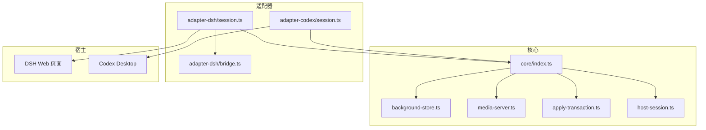
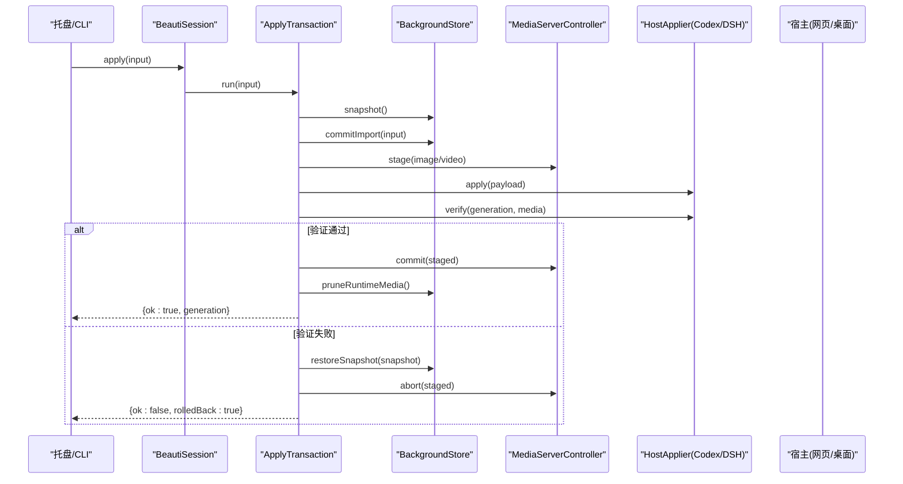
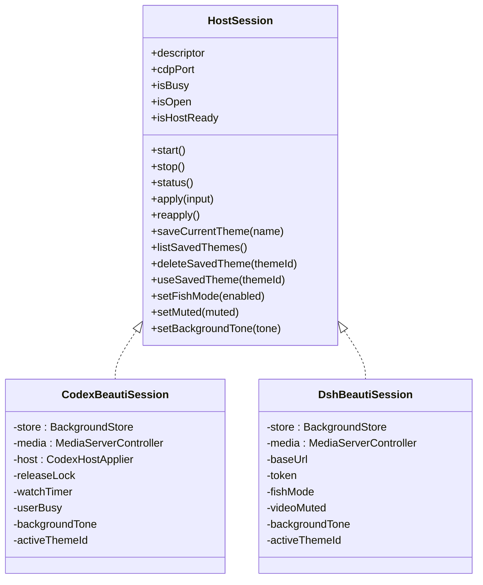
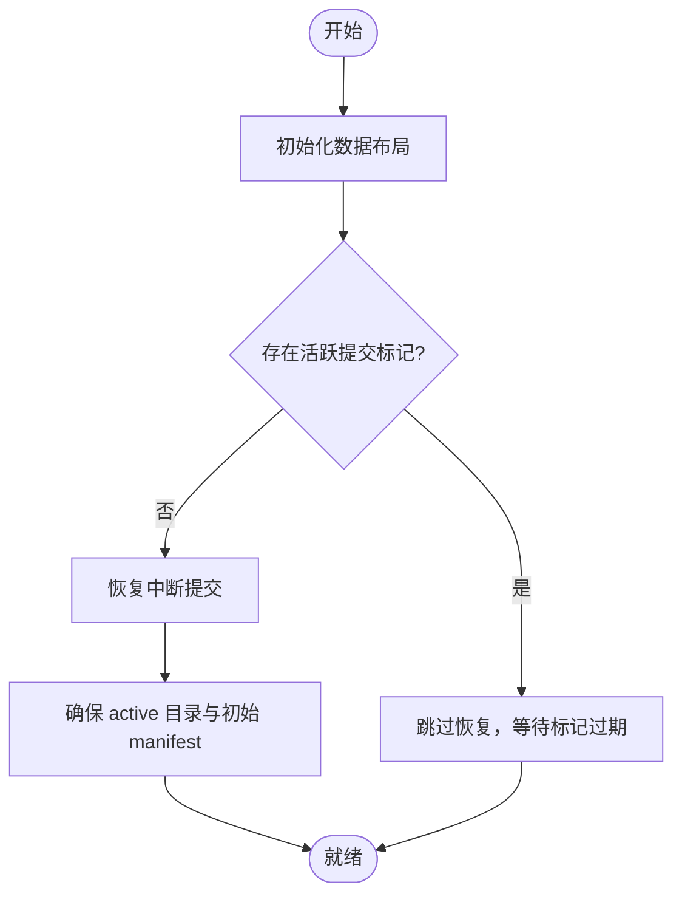
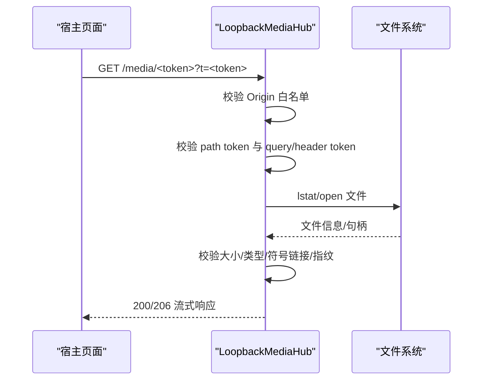
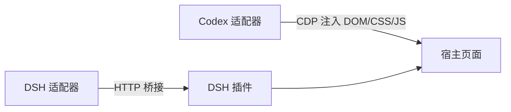
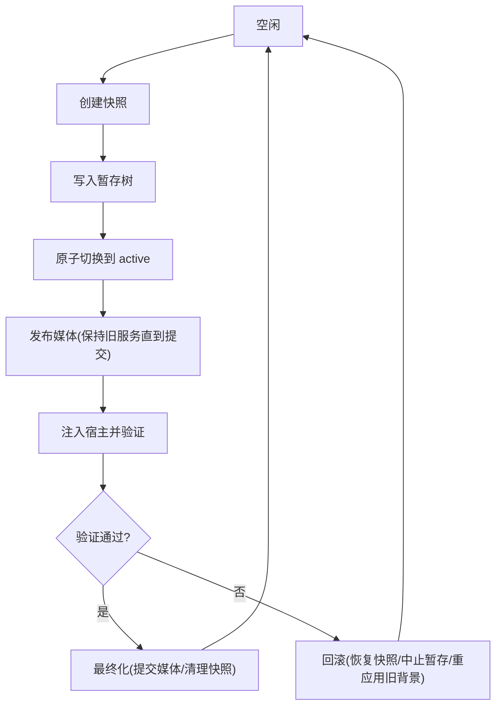
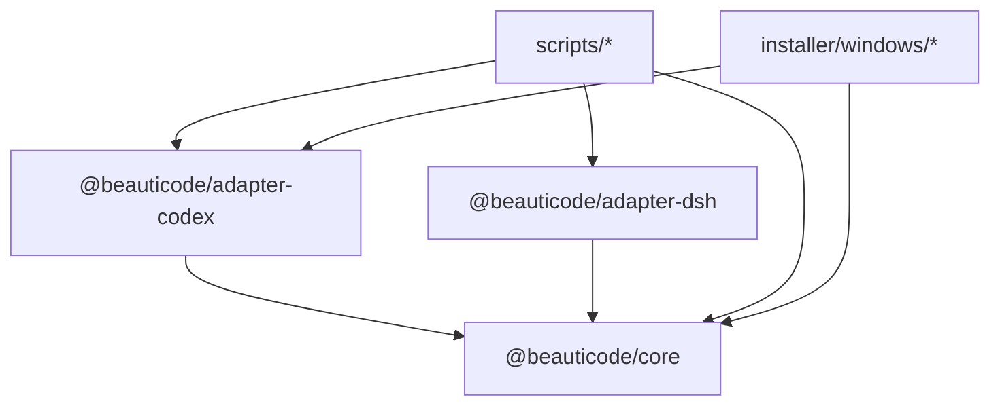

# 架构设计

<cite>
**本文引用的文件**
- [README.md](file://README.md)
- [package.json](file://package.json)
- [THIRD_PARTY_NOTICES.md](file://THIRD_PARTY_NOTICES.md)
- [docs/apply-transaction.md](file://docs/apply-transaction.md)
- [docs/host-adapter.md](file://docs/host-adapter.md)
- [docs/media-contract.md](file://docs/media-contract.md)
- [docs/security-boundaries.md](file://docs/security-boundaries.md)
- [packages/core/src/index.ts](file://packages/core/src/index.ts)
- [packages/core/src/host-session.ts](file://packages/core/src/host-session.ts)
- [packages/core/src/background-store.ts](file://packages/core/src/background-store.ts)
- [packages/core/src/media-server.ts](file://packages/core/src/media-server.ts)
- [packages/core/src/apply-transaction.ts](file://packages/core/src/apply-transaction.ts)
- [packages/core/src/error-message.ts](file://packages/core/src/error-message.ts)
- [packages/adapter-codex/src/session.ts](file://packages/adapter-codex/src/session.ts)
- [packages/adapter-codex/src/injector.ts](file://packages/adapter-codex/src/injector.ts)
- [packages/adapter-dsh/src/session.ts](file://packages/adapter-dsh/src/session.ts)
- [packages/adapter-dsh/src/bridge.ts](file://packages/adapter-dsh/src/bridge.ts)
- [packages/adapter-dsh/src/host-descriptor.ts](file://packages/adapter-dsh/src/host-descriptor.ts)
- [integrations/deepseek-harness/README.zh-CN.md](file://integrations/deepseek-harness/README.zh-CN.md)
- [scripts/start-beauticode.ps1](file://scripts/start-beauticode.ps1)
</cite>

## 目录
1. [简介](#简介)
2. [项目结构](#项目结构)
3. [核心组件](#核心组件)
4. [架构总览](#架构总览)
5. [详细组件分析](#详细组件分析)
6. [依赖关系分析](#依赖关系分析)
7. [性能考量](#性能考量)
8. [故障排查指南](#故障排查指南)
9. [结论](#结论)
10. [附录](#附录)

## 简介
beautiCode 是一个本地背景工具，主要为 DeepSeek Harness（DSH）和 Codex Desktop 提供图片与视频背景能力。它不修改宿主二进制、不注入全局样式，而是通过“宿主机适配层 + 事务化媒体提交 + 回环媒体服务”的架构，确保在浏览器/桌面应用内安全、可回滚地应用背景。系统支持：
- 模块化分层架构：core 包提供通用能力，adapter-codex 与 adapter-dsh 分别实现不同宿主接入。
- 适配器模式：统一 HostSession 接口屏蔽 DSH 与 Codex 的差异。
- 事务模式：ApplyTransaction 将“快照 → 暂存 → 提交 → 发布媒体 → 注入宿主 → 验证 → 最终化/回滚”作为原子流程。
- 安全边界：令牌认证、路径校验、跨域保护、仅回环绑定等。

本架构设计文档面向开发者，帮助理解 BeautiSession 协调器、HostSession 抽象、BackgroundStore 主题管理、MediaServer 媒体服务以及宿主机适配层的设计原理与数据流。

## 项目结构
仓库采用 monorepo 组织：
- packages/core：核心能力（背景存储、媒体服务器、事务编排、类型与常量）。
- packages/adapter-codex：Codex Desktop 适配器（CDP 注入、渲染器注入、会话管理）。
- packages/adapter-dsh：DeepSeek Harness 适配器（HTTP 桥接、插件集成）。
- integrations/deepseek-harness：DSH 插件资源与说明。
- apps/tray：托盘入口（Windows）。
- scripts：构建、安装、启动脚本。

图表来源
- [packages/core/src/index.ts:1-19](file://packages/core/src/index.ts#L1-L19)
- [packages/core/src/background-store.ts:123-140](file://packages/core/src/background-store.ts#L123-L140)
- [packages/core/src/media-server.ts:148-167](file://packages/core/src/media-server.ts#L148-L167)
- [packages/core/src/apply-transaction.ts:103-121](file://packages/core/src/apply-transaction.ts#L103-L121)
- [packages/core/src/host-session.ts:27-47](file://packages/core/src/host-session.ts#L27-L47)
- [packages/adapter-codex/src/session.ts:56-70](file://packages/adapter-codex/src/session.ts#L56-L70)
- [packages/adapter-dsh/src/session.ts:81-104](file://packages/adapter-dsh/src/session.ts#L81-L104)
- [packages/adapter-dsh/src/bridge.ts:85-124](file://packages/adapter-dsh/src/bridge.ts#L85-L124)

章节来源
- [package.json:7-21](file://package.json#L7-L21)
- [README.md:19-35](file://README.md#L19-L35)

## 核心组件
- HostSession 抽象：定义统一的会话控制面（start/stop/status/apply/reapply/save/list/delete/use theme/fish/muted/tone），使托盘或上层调用方无需关心具体宿主差异。
- BackgroundStore：负责数据根布局、快照、暂存树、原子提交、运行时媒体隔离、主题保存与清理。
- MediaServerController / LoopbackMediaHub：提供带令牌认证的本地媒体服务，支持 Range/206、CORS 白名单、每请求身份校验。
- ApplyTransaction：编排完整背景应用事务，保证“磁盘成功 ≠ 用户可见成功”，失败时回滚到快照并恢复旧背景。
- 适配器（Codex/DSH）：封装各自宿主通信方式（CDP 注入 vs HTTP 桥接），对外暴露同一 HostSession 接口。

章节来源
- [packages/core/src/host-session.ts:27-47](file://packages/core/src/host-session.ts#L27-L47)
- [packages/core/src/background-store.ts:123-140](file://packages/core/src/background-store.ts#L123-L140)
- [packages/core/src/media-server.ts:636-732](file://packages/core/src/media-server.ts#L636-L732)
- [packages/core/src/apply-transaction.ts:103-121](file://packages/core/src/apply-transaction.ts#L103-L121)

## 架构总览
整体采用“协调器 + 适配器 + 核心服务”的分层架构：
- 协调器：BeautiSession（各适配器实现）持有 BackgroundStore、MediaServerController、HostApplier，负责生命周期、状态、用户操作编排。
- 核心服务：BackgroundStore（持久化）、MediaServerController（媒体分发）、ApplyTransaction（事务编排）。
- 适配器：Codex 通过 CDP 注入 DOM/CSS/JS；DSH 通过 HTTP 桥接向插件发送 apply/verify。

图表来源
- [packages/core/src/apply-transaction.ts:127-152](file://packages/core/src/apply-transaction.ts#L127-L152)
- [packages/core/src/apply-transaction.ts:154-294](file://packages/core/src/apply-transaction.ts#L154-L294)
- [packages/core/src/background-store.ts:504-523](file://packages/core/src/background-store.ts#L504-L523)
- [packages/core/src/media-server.ts:660-713](file://packages/core/src/media-server.ts#L660-L713)
- [packages/adapter-codex/src/session.ts:56-70](file://packages/adapter-codex/src/session.ts#L56-L70)
- [packages/adapter-dsh/src/bridge.ts:115-124](file://packages/adapter-dsh/src/bridge.ts#L115-L124)

## 详细组件分析

### BeautiSession 协调器（Codex 与 DSH）
- Codex BeautiSession：维护 injector lock、media server（默认禁用，因 CSP 限制）、host applier（CDP 注入），支持 deferHostConnect、自动发现端口、鱼模式、静音、主题进度写入等。
- DSH BeautiSession：启用媒体服务器（受信任来源为 DSH 页面 origin），通过 bridge 与 DSH 插件通信，支持 saved themes、fish/muted/tone。

图表来源
- [packages/core/src/host-session.ts:27-47](file://packages/core/src/host-session.ts#L27-L47)
- [packages/adapter-codex/src/session.ts:56-127](file://packages/adapter-codex/src/session.ts#L56-L127)
- [packages/adapter-dsh/src/session.ts:81-110](file://packages/adapter-dsh/src/session.ts#L81-L110)

章节来源
- [packages/adapter-codex/src/session.ts:27-47](file://packages/adapter-codex/src/session.ts#L27-L47)
- [packages/adapter-dsh/src/session.ts:81-110](file://packages/adapter-dsh/src/session.ts#L81-L110)

### BackgroundStore 主题管理系统
- 数据根与布局：active/staging/snapshots/runtime-media 等目录，使用 .beauticode-root.json 所有权标记防止误用非空目录。
- 原子提交：commit marker + journal 记录阶段，rename 原子切换 active 目录，避免读者看到混合状态。
- 快照与恢复：snapshot 复制 manifest 与受管媒体，restore 提升 generation 并重建 active。
- 运行时视频隔离：为 Chromium 打开 active 目录句柄的场景，准备 detached runtime copy，避免 EPERM。
- 主题保存与清理：限制数量与字节上限，按 session 清理 runtime-media。

图表来源
- [packages/core/src/background-store.ts:142-159](file://packages/core/src/background-store.ts#L142-L159)
- [packages/core/src/background-store.ts:211-270](file://packages/core/src/background-store.ts#L211-L270)
- [packages/core/src/background-store.ts:757-798](file://packages/core/src/background-store.ts#L757-L798)

章节来源
- [packages/core/src/background-store.ts:123-140](file://packages/core/src/background-store.ts#L123-L140)
- [packages/core/src/background-store.ts:504-523](file://packages/core/src/background-store.ts#L504-L523)
- [packages/core/src/background-store.ts:564-678](file://packages/core/src/background-store.ts#L564-L678)

### MediaServer 媒体服务
- LoopbackMediaHub：单端口多资产路由 /media/<token>，要求 path token 与 header/query token 匹配，严格 Origin 白名单，支持 Range/206。
- MediaServerController：管理 image/video 成对资源，stage/commit/abort/close，保证旧资源在过渡期存活，新资源成功后替换。
- 安全：每请求 lstat/stat 校验大小/类型/符号链接，必要时重算哈希比对 identity，拒绝篡改。

图表来源
- [packages/core/src/media-server.ts:148-167](file://packages/core/src/media-server.ts#L148-L167)
- [packages/core/src/media-server.ts:406-590](file://packages/core/src/media-server.ts#L406-L590)
- [packages/core/src/media-server.ts:636-732](file://packages/core/src/media-server.ts#L636-L732)

章节来源
- [packages/core/src/media-server.ts:220-301](file://packages/core/src/media-server.ts#L220-L301)
- [packages/core/src/media-server.ts:660-713](file://packages/core/src/media-server.ts#L660-L713)

### 宿主机适配层（Codex 与 DSH）
- Codex 适配器：通过 CDP 连接本机调试端口，注入 #beauticode-bg-stage 节点与 CSS/JS，设置 data-bc-* 属性，支持鱼模式、静音、主题进度。
- DSH 适配器：通过 HTTP 桥接到 DSH 插件，要求 loopback URL（imageUrl/video.srcUrl），支持 saved themes、fish/muted/tone。
- 能力声明：HostDescriptor 描述 image/clear/reapply/savedThemes/video/fish/muted/tone 等能力。

图表来源
- [docs/host-adapter.md:18-79](file://docs/host-adapter.md#L18-L79)
- [packages/adapter-dsh/src/bridge.ts:115-124](file://packages/adapter-dsh/src/bridge.ts#L115-L124)
- [packages/adapter-dsh/src/host-descriptor.ts:3-16](file://packages/adapter-dsh/src/host-descriptor.ts#L3-L16)

章节来源
- [docs/host-adapter.md:1-154](file://docs/host-adapter.md#L1-L154)
- [integrations/deepseek-harness/README.zh-CN.md:1-30](file://integrations/deepseek-harness/README.zh-CN.md#L1-L30)

### 事务模式（ApplyTransaction）
- 目标：磁盘写成功不等于用户可见成功，必须经宿主窗口确认。
- 状态机：idle → snapshot → stage → commit-disk → publish-media → apply-host → live-verify → finalize/rollback。
- 重试策略：针对首帧/Range 探针导致的临时失败，允许一次重试。
- 回滚：恢复快照、中止暂存媒体、重新应用旧背景。

图表来源
- [docs/apply-transaction.md:7-48](file://docs/apply-transaction.md#L7-L48)
- [packages/core/src/apply-transaction.ts:154-294](file://packages/core/src/apply-transaction.ts#L154-L294)

章节来源
- [docs/apply-transaction.md:1-48](file://docs/apply-transaction.md#L1-L48)
- [packages/core/src/apply-transaction.ts:127-152](file://packages/core/src/apply-transaction.ts#L127-L152)

## 依赖关系分析
- core 包被两个适配器复用，形成稳定的公共契约（HostSession、BackgroundStore、MediaServerController、ApplyTransaction）。
- Codex 适配器依赖 CDP 注入与 payload 生成；DSH 适配器依赖 HTTP 桥接与可信来源配置。
- 脚本与安装程序打包 core/dist 与适配器 dist，并将 DSH 插件资源纳入安装包。

图表来源
- [package.json:7-21](file://package.json#L7-L21)
- [scripts/build-windows-installer.ps1:243-275](file://scripts/build-windows-installer.ps1#L243-L275)

章节来源
- [package.json:7-21](file://package.json#L7-L21)
- [scripts/build-windows-installer.ps1:243-275](file://scripts/build-windows-installer.ps1#L243-L275)

## 性能考量
- 媒体流式传输：LoopbackMediaHub 使用管道流式输出，支持 Range/206，减少大文件内存占用。
- 视频预热：prepareRuntimeVideo 对本地视频进行头部与 moov 尾部预热，降低首次播放延迟。
- 原子提交与最小化锁：BackgroundStore 使用文件锁与链式写入，避免并发竞争；commit 使用 rename 原子切换。
- 运行时视频隔离：避免 active 目录句柄导致 EPERM，提高切换稳定性。
- 事务阶段计时：ApplyTransaction 统计各阶段耗时，便于定位瓶颈。

[本节为通用指导，不直接分析具体文件]

## 故障排查指南
- 常见错误映射：error-message.ts 将底层错误翻译为用户友好中文提示（如未连接 DSH、无健康 CDP、超时、连接重置等）。
- 事务失败：ApplyTransaction 返回 rolledBack=true，检查日志中的阶段摘要，定位 verify 失败原因。
- 媒体访问失败：检查 LoopbackMediaHub 的 Origin 白名单、token 匹配、文件大小/类型校验、符号链接防护。
- 宿主不可达：Codex 需确保 CDP 端口可达且目标页签身份正确；DSH 需确保插件已加载且页面已连接。

章节来源
- [packages/core/src/error-message.ts:28-54](file://packages/core/src/error-message.ts#L28-L54)
- [packages/core/src/apply-transaction.ts:212-245](file://packages/core/src/apply-transaction.ts#L212-L245)
- [packages/core/src/media-server.ts:406-590](file://packages/core/src/media-server.ts#L406-L590)

## 结论
beautiCode 通过清晰的模块化分层、适配器模式与事务模式，实现了在多宿主环境下的安全、稳定、可回滚的背景应用机制。核心在于：
- 以 HostSession 统一控制面，屏蔽宿主差异。
- 以 BackgroundStore 保障数据一致性与可恢复性。
- 以 MediaServerController 提供安全的本地媒体分发。
- 以 ApplyTransaction 确保“用户可见成功”的强一致性。
- 以严格的安全边界（令牌、路径、跨域、仅回环）保护系统与用户数据。

该设计为后续扩展更多宿主（终端、其他桌面应用）提供了稳固基础。

## 附录
- 媒体契约：manifest schema、图片/视频校验规则、播放语义、传输模式（blob/server）。
- 安全边界：禁止修改官方宿主、仅回环网络、路径包含性、内容门控、失败关闭、用户媒体本地化、背景-only DOM 注入。
- 宿主选择器：scripts/start-beauticode.ps1 提供 prompt/codex/dsh 三种启动路径。

章节来源
- [docs/media-contract.md:1-99](file://docs/media-contract.md#L1-L99)
- [docs/security-boundaries.md:1-27](file://docs/security-boundaries.md#L1-L27)
- [scripts/start-beauticode.ps1:1-36](file://scripts/start-beauticode.ps1#L1-L36)