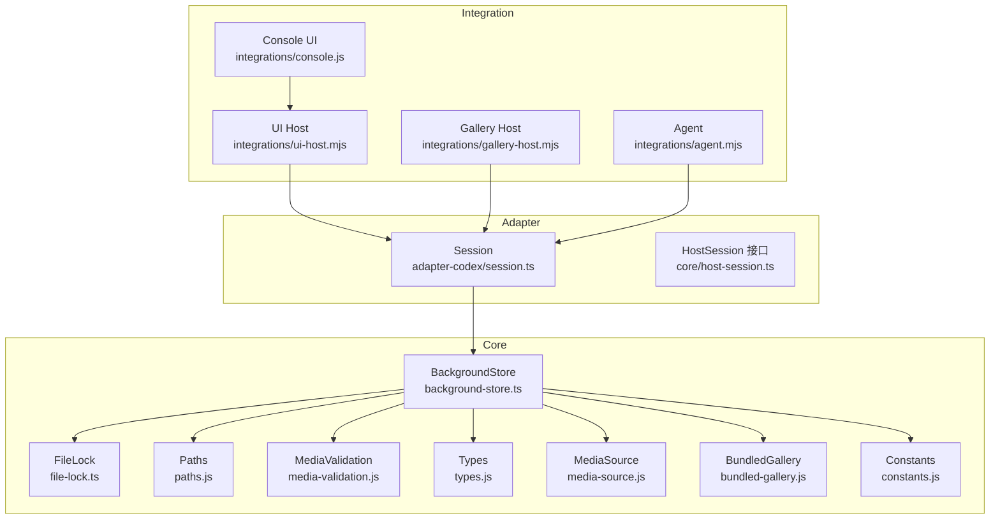
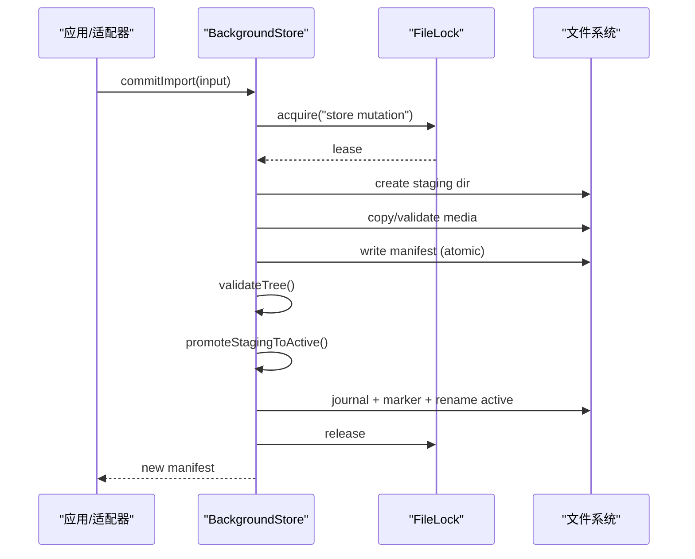
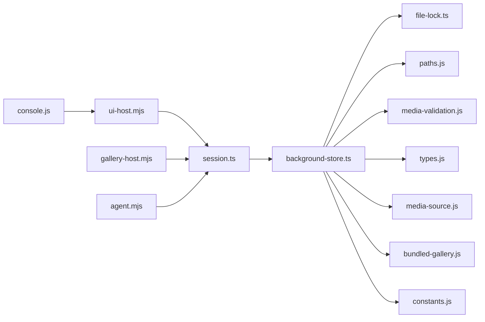

# 主题存储系统

<cite>
**本文引用的文件**
- [background-store.ts](file://packages/core/src/background-store.ts)
- [file-lock.ts](file://packages/core/src/file-lock.ts)
- [paths.js](file://packages/core/src/paths.js)
- [media-validation.js](file://packages/core/src/media-validation.js)
- [types.js](file://packages/core/src/types.js)
- [media-source.js](file://packages/core/src/media-source.js)
- [bundled-gallery.js](file://packages/core/src/bundled-gallery.js)
- [constants.js](file://packages/core/src/constants.js)
- [session.ts](file://packages/adapter-codex/src/session.ts)
- [host-session.ts](file://packages/core/src/host-session.ts)
- [ui-host.mjs](file://integrations/deepseek-harness/ui-host.mjs)
- [gallery-host.mjs](file://integrations/deepseek-harness/gallery-host.mjs)
- [agent.mjs](file://integrations/deepseek-harness/agent.mjs)
- [console.js](file://integrations/deepseek-harness/console.js)
- [pack-dsh-plugin.mjs](file://scripts/pack-dsh-plugin.mjs)
</cite>

## 目录
1. [简介](#简介)
2. [项目结构](#项目结构)
3. [核心组件](#核心组件)
4. [架构总览](#架构总览)
5. [详细组件分析](#详细组件分析)
6. [依赖关系分析](#依赖关系分析)
7. [性能考量](#性能考量)
8. [故障排查指南](#故障排查指南)
9. [结论](#结论)
10. [附录：文件格式与扩展指南](#附录文件格式与扩展指南)

## 简介
本文件系统化说明 beautiCode 主题存储系统的实现，重点围绕 BackgroundStore 类的设计与实现，涵盖主题数据的持久化、版本管理、并发访问控制；解析 SavedThemeInfo 数据模型；描述主题文件的目录结构与命名规范、路径管理与跨平台兼容；解释文件锁定机制如何防止并发写入冲突；详述主题的创建、保存、删除、导入导出等核心操作；并提供备份恢复、数据迁移策略以及主题文件格式规范与扩展建议。

## 项目结构
主题存储的核心位于 packages/core 的 background-store.ts，配合 paths.js、file-lock.ts、media-validation.js、types.js、media-source.js、bundled-gallery.js、constants.js 等模块完成数据布局、并发锁、媒体校验、类型定义、资源来源解析与内置主题支持。上层通过 adapter-codex 的 session.ts 暴露 HostSession 接口，集成到托盘、控制台与插件生态中。



图表来源
- [background-store.ts:1-45](file://packages/core/src/background-store.ts#L1-L45)
- [file-lock.ts:72-170](file://packages/core/src/file-lock.ts#L72-L170)
- [paths.js:21-28](file://packages/core/src/paths.js#L21-L28)
- [media-validation.js:13-19](file://packages/core/src/media-validation.js#L13-L19)
- [types.js:29-34](file://packages/core/src/types.js#L29-L34)
- [media-source.js:35-40](file://packages/core/src/media-source.js#L35-L40)
- [bundled-gallery.js:41-44](file://packages/core/src/bundled-gallery.js#L41-L44)
- [constants.js:6-12](file://packages/core/src/constants.js#L6-L12)
- [session.ts:125-135](file://packages/adapter-codex/src/session.ts#L125-L135)
- [host-session.ts:27-47](file://packages/core/src/host-session.ts#L27-L47)

章节来源
- [background-store.ts:1-140](file://packages/core/src/background-store.ts#L1-L140)
- [session.ts:125-135](file://packages/adapter-codex/src/session.ts#L125-L135)
- [host-session.ts:27-47](file://packages/core/src/host-session.ts#L27-L47)

## 核心组件
- BackgroundStore：主题存储的核心类，负责数据布局初始化、活动主题清单读写、提交事务（原子切换）、快照与恢复、已保存主题列表/删除/使用、视频位置持久化、运行时媒体清理等。
- FileLock：跨进程文件锁，基于 O_EXCL 打开与 nonce 防抢占，提供 acquire/release 能力，用于 store 写锁与注入器锁。
- Paths：数据根目录布局解析，提供 activeDir、stagingDir、savedDir、runtimeMediaDir、snapshotsDir 等路径常量与安全检查。
- MediaValidation：图片/视频文件校验、安全基名检查、预热读取等。
- Types：ApplyInput、BackgroundManifest、BackgroundMedia 等类型定义及效果规范化。
- MediaSource：解析背景图片/视频路径，判断本地引用或托管复制模式。
- BundledGallery：内置主题规格与可见性。
- Constants：清单文件名、schema id、默认视频文件名等常量。

章节来源
- [background-store.ts:123-140](file://packages/core/src/background-store.ts#L123-L140)
- [file-lock.ts:72-170](file://packages/core/src/file-lock.ts#L72-L170)
- [paths.js:21-28](file://packages/core/src/paths.js#L21-L28)
- [media-validation.js:13-19](file://packages/core/src/media-validation.js#L13-L19)
- [types.js:29-34](file://packages/core/src/types.js#L29-L34)
- [media-source.js:35-40](file://packages/core/src/media-source.js#L35-L40)
- [bundled-gallery.js:41-44](file://packages/core/src/bundled-gallery.js#L41-L44)
- [constants.js:6-12](file://packages/core/src/constants.js#L6-L12)

## 架构总览
BackgroundStore 以“暂存-验证-原子切换”的事务模型保证活动主题的一致性；通过文件锁串行化所有写操作，避免多进程/多线程竞争；通过清单 generation 字段实现版本递增与回滚保护；通过 journal+marker 机制在崩溃后恢复未完成的事务；通过 savedDir 下的独立主题目录实现可恢复的主题集合；通过 runtimeMediaDir 隔离渲染期视频副本，避免句柄占用导致无法替换。



图表来源
- [background-store.ts:564-678](file://packages/core/src/background-store.ts#L564-L678)
- [background-store.ts:757-798](file://packages/core/src/background-store.ts#L757-L798)
- [file-lock.ts:72-170](file://packages/core/src/file-lock.ts#L72-L170)

## 详细组件分析

### BackgroundStore 设计要点
- 数据布局与初始化：确保 data root 存在，处理提交标记与中断恢复，初始化 active 清单为空。
- 并发控制：内部 #withWriteLock 串行化写操作，结合 file-lock 跨进程互斥；同上下文重入安全。
- 版本管理：manifest.generation 单调递增，promote 时生成新代次，失败回滚至旧代次或备份。
- 事务与恢复：journal 记录阶段（prepared/old-moved/new-active），marker 标识活跃事务；启动时检测并恢复。
- 媒体校验：图片/视频严格校验，本地与托管模式分别处理；运行时视频拷贝到 session 目录并缓存。
- 已保存主题：独立目录保存清单与元数据，支持配额限制（数量与字节数）、删除、列表、使用、视频位置更新。
- 快照与恢复：snapshot 复制当前活动清单与托管媒体；restore 将快照提升为活动。

章节来源
- [background-store.ts:142-159](file://packages/core/src/background-store.ts#L142-L159)
- [background-store.ts:325-344](file://packages/core/src/background-store.ts#L325-L344)
- [background-store.ts:211-270](file://packages/core/src/background-store.ts#L211-L270)
- [background-store.ts:757-798](file://packages/core/src/background-store.ts#L757-L798)
- [background-store.ts:352-437](file://packages/core/src/background-store.ts#L352-L437)
- [background-store.ts:805-913](file://packages/core/src/background-store.ts#L805-L913)
- [background-store.ts:915-984](file://packages/core/src/background-store.ts#L915-L984)
- [background-store.ts:1066-1148](file://packages/core/src/background-store.ts#L1066-L1148)
- [background-store.ts:1155-1224](file://packages/core/src/background-store.ts#L1155-L1224)
- [background-store.ts:504-524](file://packages/core/src/background-store.ts#L504-L524)
- [background-store.ts:680-716](file://packages/core/src/background-store.ts#L680-L716)

#### 类图（代码级）
```mermaid
classDiagram
class BackgroundStore {
+paths
+commitMarkerStaleMs
+maxSavedThemes
+maxSavedBytes
+bundledThemes
+init() Promise~void~
+readActiveManifest() Promise~BackgroundManifest~
+commitImport(input) Promise~BackgroundManifest~
+saveCurrentTheme(name, opts) Promise~SavedThemeInfo~
+listSavedThemes() Promise~SavedThemeInfo[]~
+deleteSavedTheme(themeId) Promise~boolean~
+useSavedTheme(themeId) Promise~{manifest, videoPositionSec}~
+loadSavedTheme(themeId) Promise~{input, videoPositionSec, themeId}~
+getSavedThemeVideoPosition(id) Promise~number|null~
+updateSavedThemeVideoPosition(id, pos) Promise~{ok, positionSec, error?}~
+snapshot() Promise~BackgroundSnapshot~
+restoreSnapshot(snapshot) Promise~BackgroundManifest~
+pruneRuntimeMedia(keepPath?) Promise~void~
+prepareRuntimeVideo(manifest) Promise~string|null~
+withExclusiveMutation(fn) Promise~T~
}
```

图表来源
- [background-store.ts:123-140](file://packages/core/src/background-store.ts#L123-L140)
- [background-store.ts:277-319](file://packages/core/src/background-store.ts#L277-L319)
- [background-store.ts:564-678](file://packages/core/src/background-store.ts#L564-L678)
- [background-store.ts:805-913](file://packages/core/src/background-store.ts#L805-L913)
- [background-store.ts:915-984](file://packages/core/src/background-store.ts#L915-L984)
- [background-store.ts:1066-1148](file://packages/core/src/background-store.ts#L1066-L1148)
- [background-store.ts:1155-1224](file://packages/core/src/background-store.ts#L1155-L1224)
- [background-store.ts:504-524](file://packages/core/src/background-store.ts#L504-L524)
- [background-store.ts:680-716](file://packages/core/src/background-store.ts#L680-L716)
- [background-store.ts:444-494](file://packages/core/src/background-store.ts#L444-L494)
- [background-store.ts:352-437](file://packages/core/src/background-store.ts#L352-L437)
- [background-store.ts:500-502](file://packages/core/src/background-store.ts#L500-L502)

### 数据模型：SavedThemeInfo 与 SavedThemeMeta
- SavedThemeInfo：对外暴露的已保存主题信息，包含 id、name、type、path、savedAt、sourceMode（local/managed）、videoPositionSec（视频主题）、bundled（内置不可删）。
- SavedThemeMeta：磁盘持久化的元数据，包含 id、name、type、savedAt、videoPositionSec、videoPositionUpdatedAt。

章节来源
- [background-store.ts:1350-1373](file://packages/core/src/background-store.ts#L1350-L1373)

### 目录结构与命名规范
- 数据根目录由 paths.js 解析，包含 activeDir（活动主题）、stagingDir（暂存事务）、savedDir（已保存主题）、runtimeMediaDir（运行时媒体）、snapshotsDir（快照）。
- 活动主题清单文件名为 MANIFEST_NAME（background.json），保存在 activeDir。
- 已保存主题目录名采用 slugThemeId 生成的稳定 ASCII 名称，避免非 ASCII 与 Windows 保留名；每个目录包含清单与元数据文件（SAVED_META_NAME）。
- 运行时媒体按 session 目录隔离，命名遵循 session-[A-Za-z0-9._-]+。
- 路径安全：所有路径均进行 isPathInsideRoot 检查，禁止越界；对符号链接进行拒绝；真实路径 realpath 校验。

章节来源
- [background-store.ts:198-209](file://packages/core/src/background-store.ts#L198-L209)
- [background-store.ts:272-275](file://packages/core/src/background-store.ts#L272-L275)
- [background-store.ts:852-856](file://packages/core/src/background-store.ts#L852-L856)
- [background-store.ts:1385-1394](file://packages/core/src/background-store.ts#L1385-L1394)
- [background-store.ts:1418-1426](file://packages/core/src/background-store.ts#L1418-L1426)
- [background-store.ts:466-473](file://packages/core/src/background-store.ts#L466-L473)
- [background-store.ts:1265-1280](file://packages/core/src/background-store.ts#L1265-L1280)

### 并发访问控制与文件锁定
- 写锁：#withWriteLock 串行化写操作，并在外部使用 file-lock 获取跨进程锁，防止多个 BackgroundStore 实例同时写入。
- 注入器锁：adapter-codex 使用 acquireInjectorLock 防止重复注入；测试覆盖死锁与抢占场景。
- 提交标记与日志：marker 文件表示正在进行提交；journal 记录阶段；崩溃后恢复流程确保一致性。

章节来源
- [background-store.ts:325-344](file://packages/core/src/background-store.ts#L325-L344)
- [file-lock.ts:72-170](file://packages/core/src/file-lock.ts#L72-L170)
- [background-store.ts:169-188](file://packages/core/src/background-store.ts#L169-L188)
- [background-store.ts:211-270](file://packages/core/src/background-store.ts#L211-L270)
- [session.ts:167-174](file://packages/adapter-codex/src/session.ts#L167-L174)
- [adapter.test.js:554-572](file://packages/adapter-codex/test/adapter.test.js#L554-L572)

### 主题创建、保存、删除、导入导出
- 创建/导入：commitImport 接受 ApplyInput（image/video/clear），校验媒体，复制到暂存目录，写入清单，验证树，原子切换到 active。
- 保存当前主题：saveCurrentTheme 将当前活动主题保存到 savedDir，生成唯一 id，写入清单与元数据，支持视频位置保存；受配额限制。
- 删除主题：deleteSavedTheme 校验 id，拒绝内置主题，删除目录。
- 使用主题：useSavedTheme 将已保存主题提升为活动，返回新清单与视频起始位置；支持内置主题直接应用。
- 加载主题：loadSavedTheme 解析已保存主题为 ApplyInput，供上层 ApplyTransaction 使用。
- 导出：通过 snapshot 复制当前活动清单与托管媒体到 snapshotsDir；restoreSnapshot 可将快照恢复为活动。

章节来源
- [background-store.ts:564-678](file://packages/core/src/background-store.ts#L564-L678)
- [background-store.ts:805-913](file://packages/core/src/background-store.ts#L805-L913)
- [background-store.ts:968-984](file://packages/core/src/background-store.ts#L968-L984)
- [background-store.ts:1155-1224](file://packages/core/src/background-store.ts#L1155-L1224)
- [background-store.ts:1066-1148](file://packages/core/src/background-store.ts#L1066-L1148)
- [background-store.ts:504-524](file://packages/core/src/background-store.ts#L504-L524)
- [background-store.ts:680-716](file://packages/core/src/background-store.ts#L680-L716)

### 主题备份恢复与数据迁移
- 备份：snapshot 生成带清单与托管媒体的快照目录；clearSnapshot 清理。
- 恢复：restoreSnapshot 校验快照清单，提升到活动，增加 generation。
- 迁移：已保存主题目录名优先匹配文件夹名，其次扫描 meta.id 兼容旧版；slugThemeId 生成稳定 ASCII 目录名，避免非 ASCII 问题。

章节来源
- [background-store.ts:504-524](file://packages/core/src/background-store.ts#L504-L524)
- [background-store.ts:680-716](file://packages/core/src/background-store.ts#L680-L716)
- [background-store.ts:1229-1263](file://packages/core/src/background-store.ts#L1229-L1263)
- [background-store.ts:1385-1394](file://packages/core/src/background-store.ts#L1385-L1394)

### 视频播放位置持久化
- 保存时捕获当前位置（可选），写入 SAVED_META_NAME.videoPositionSec。
- 运行中周期性更新（adapter-codex session 节流），仅写入绑定主题元数据，避免频繁 IO。
- 读取时归一化位置值，非法值视为 null（从 0 开始）。

章节来源
- [background-store.ts:876-888](file://packages/core/src/background-store.ts#L876-L888)
- [background-store.ts:990-1004](file://packages/core/src/background-store.ts#L990-L1004)
- [background-store.ts:1011-1059](file://packages/core/src/background-store.ts#L1011-L1059)
- [background-store.ts:1375-1383](file://packages/core/src/background-store.ts#L1375-L1383)
- [session.ts:558-584](file://packages/adapter-codex/src/session.ts#L558-L584)
- [session.ts:798-816](file://packages/adapter-codex/src/session.ts#L798-L816)

### 路径管理与跨平台兼容性
- 路径安全：isPathInsideRoot 与 realpath 双重校验，防止目录穿越与符号链接攻击。
- Windows 兼容：拒绝保留设备名（con/prn/aux/nul/com/lpt），slugThemeId 生成 ASCII 目录名。
- 运行时媒体：按 session 隔离，避免 Chromium 句柄占用导致替换失败；清理策略忽略被占用的文件。

章节来源
- [background-store.ts:1265-1280](file://packages/core/src/background-store.ts#L1265-L1280)
- [background-store.ts:1418-1426](file://packages/core/src/background-store.ts#L1418-L1426)
- [background-store.ts:466-487](file://packages/core/src/background-store.ts#L466-L487)

### 错误处理与健壮性
- 媒体校验失败：抛出 MediaValidationError，统一错误消息映射。
- 清单无效：拒绝加载/恢复，提示清单格式错误。
- 路径越界：抛出越界错误，阻止恶意路径。
- 提交中断：journal+marker 恢复，确保不会留下半写状态。

章节来源
- [error-message.ts:132-148](file://packages/core/src/error-message.ts#L132-L148)
- [background-store.ts:211-270](file://packages/core/src/background-store.ts#L211-L270)
- [background-store.ts:277-305](file://packages/core/src/background-store.ts#L277-L305)
- [background-store.ts:718-735](file://packages/core/src/background-store.ts#L718-L735)

## 依赖关系分析
- BackgroundStore 依赖 paths.js 提供数据布局；依赖 file-lock.ts 实现跨进程锁；依赖 media-validation.js 进行媒体校验；依赖 types.js 定义输入输出类型；依赖 media-source.js 解析媒体路径；依赖 bundled-gallery.js 提供内置主题；依赖 constants.js 提供常量。
- 上层 adapter-codex/session.ts 组合 BackgroundStore 并通过 HostSession 接口暴露给托盘与控制台。
- 集成层 ui-host.mjs、gallery-host.mjs、agent.mjs、console.js 通过 HTTP/CLI 调用会话 API，触发导入与应用流程。



图表来源
- [ui-host.mjs:492-524](file://integrations/deepseek-harness/ui-host.mjs#L492-L524)
- [gallery-host.mjs:310-342](file://integrations/deepseek-harness/gallery-host.mjs#L310-L342)
- [agent.mjs:1-45](file://integrations/deepseek-harness/agent.mjs#L1-L45)
- [console.js:505-541](file://integrations/deepseek-harness/console.js#L505-L541)
- [session.ts:125-135](file://packages/adapter-codex/src/session.ts#L125-L135)
- [background-store.ts:1-45](file://packages/core/src/background-store.ts#L1-L45)

章节来源
- [ui-host.mjs:492-524](file://integrations/deepseek-harness/ui-host.mjs#L492-L524)
- [gallery-host.mjs:310-342](file://integrations/deepseek-harness/gallery-host.mjs#L310-L342)
- [agent.mjs:1-45](file://integrations/deepseek-harness/agent.mjs#L1-L45)
- [console.js:505-541](file://integrations/deepseek-harness/console.js#L505-L541)
- [session.ts:125-135](file://packages/adapter-codex/src/session.ts#L125-L135)
- [background-store.ts:1-45](file://packages/core/src/background-store.ts#L1-L45)

## 性能考量
- 原子写入：JSON 清单通过临时文件+rename 实现原子写入，避免部分写入导致的损坏。
- 视频预热：本地视频在首次读取前预热头部与 moov 段，减少渲染验证延迟。
- 运行时缓存：同一 generation 的视频副本缓存于内存，避免重复拷贝。
- 节流写入：视频位置更新节流约 2 秒一次，降低磁盘抖动。
- 配额限制：已保存主题数量与字节数上限，防止无限增长。

章节来源
- [background-store.ts:190-196](file://packages/core/src/background-store.ts#L190-L196)
- [background-store.ts:366-372](file://packages/core/src/background-store.ts#L366-L372)
- [background-store.ts:375-383](file://packages/core/src/background-store.ts#L375-L383)
- [session.ts:802-816](file://packages/adapter-codex/src/session.ts#L802-L816)
- [background-store.ts:822-850](file://packages/core/src/background-store.ts#L822-L850)

## 故障排查指南
- 未找到已保存主题：检查 savedDir 是否存在对应目录与清单；确认 id 安全校验通过。
- 清单无效：检查 manifest JSON 结构与 schema/generation/updatedAt 字段；确认媒体文件存在且可读取。
- 视频位置无效：检查元数据中的 videoPositionSec 是否为合法数字；归一化函数会拒绝异常值。
- 路径越界：检查是否尝试访问 savedDir 之外的路径；确认 realpath 校验通过。
- 提交中断：检查 .beauticode-commit.json 与 marker 文件；等待恢复流程完成或手动清理。
- 并发冲突：确认 store.lock 未被其他进程持有；检查 file-lock 日志与 pid 存活情况。

章节来源
- [error-message.ts:132-148](file://packages/core/src/error-message.ts#L132-L148)
- [background-store.ts:211-270](file://packages/core/src/background-store.ts#L211-L270)
- [background-store.ts:277-305](file://packages/core/src/background-store.ts#L277-L305)
- [background-store.ts:1375-1383](file://packages/core/src/background-store.ts#L1375-L1383)
- [background-store.ts:1265-1280](file://packages/core/src/background-store.ts#L1265-L1280)
- [file-lock.ts:72-170](file://packages/core/src/file-lock.ts#L72-L170)

## 结论
BackgroundStore 通过严谨的数据布局、原子事务、版本管理与并发锁机制，提供了高可靠的主题存储能力。SavedThemeInfo 与 SavedThemeMeta 清晰分离了对外信息与持久化细节，支持视频位置持久化与回放恢复。目录结构与命名规范兼顾跨平台兼容与安全。上层通过 adapter-codex 与集成层无缝对接，形成完整的主题生命周期管理。

## 附录：文件格式与扩展指南
- 清单文件（background.json）：包含 schema、generation、background、updatedAt；background 可为 image/video/clear，支持 effects 与 source 字段（local/managed）。
- 元数据文件（theme.json）：包含 id、name、type、savedAt、videoPositionSec、videoPositionUpdatedAt；用于已保存主题。
- 扩展点：
  - 新增 effects 字段需通过 normalizeBackgroundEffects 校验。
  - 新增 source.kind 需在 media-source.js 中解析与校验。
  - 新增媒体类型需在 media-validation.js 中支持校验与预热。
  - 新增目录结构需在 paths.js 中定义并纳入安全检查。
  - 新增内置主题需在 bundled-gallery.js 中注册。

章节来源
- [background-store.ts:80-121](file://packages/core/src/background-store.ts#L80-L121)
- [background-store.ts:1350-1373](file://packages/core/src/background-store.ts#L1350-L1373)
- [types.js:29-34](file://packages/core/src/types.js#L29-L34)
- [media-source.js:35-40](file://packages/core/src/media-source.js#L35-L40)
- [media-validation.js:13-19](file://packages/core/src/media-validation.js#L13-L19)
- [bundled-gallery.js:41-44](file://packages/core/src/bundled-gallery.js#L41-L44)