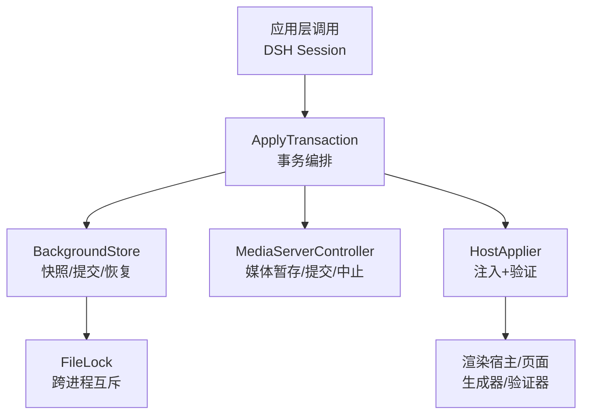
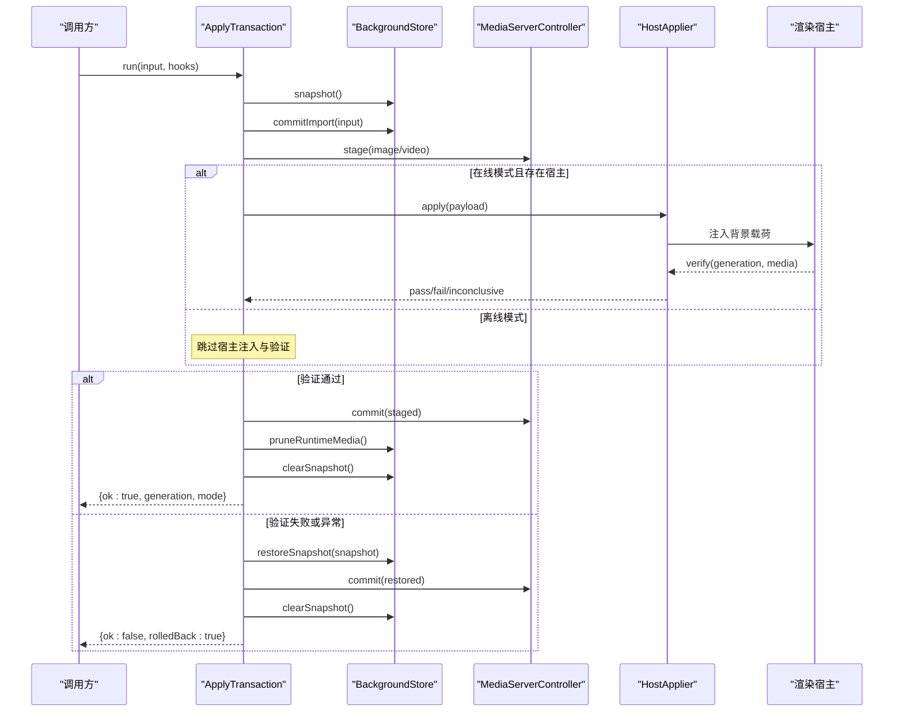
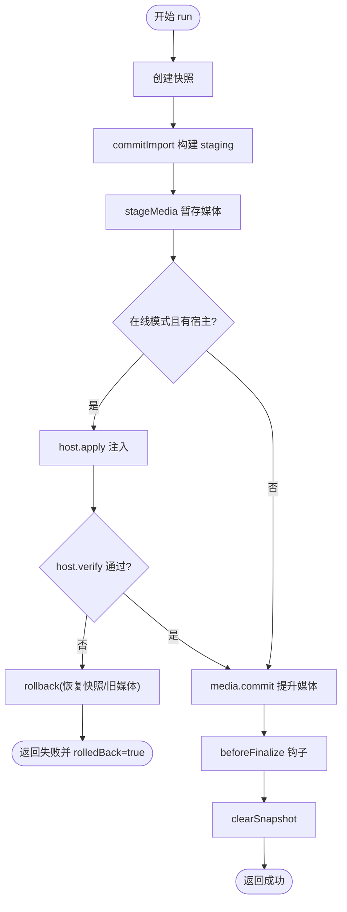
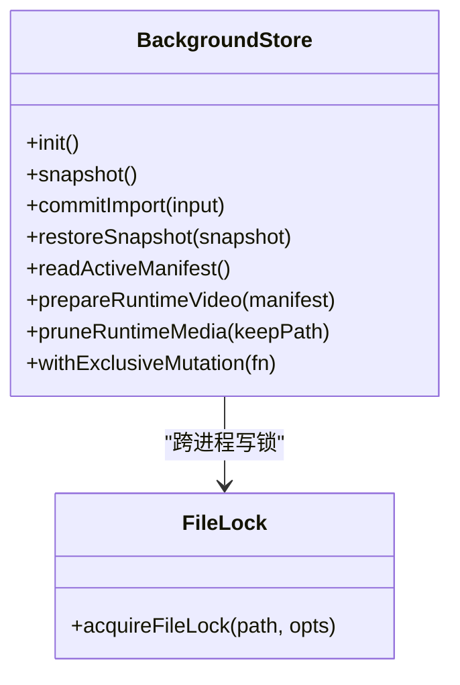
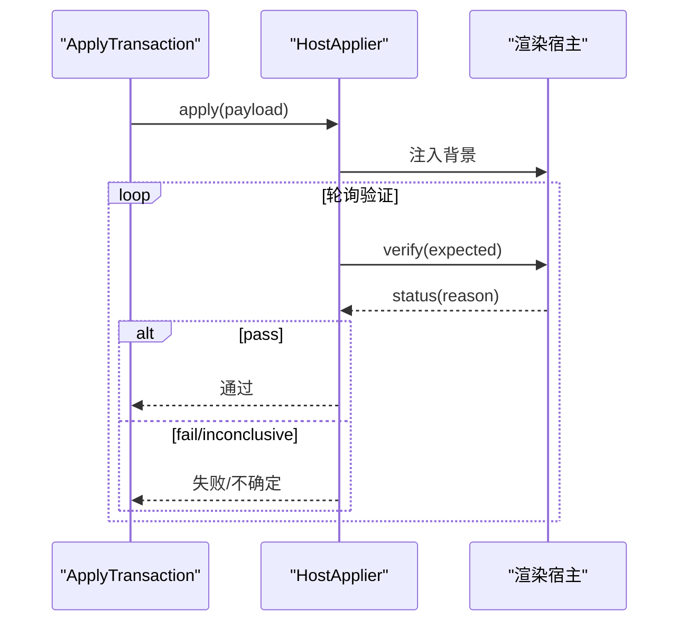
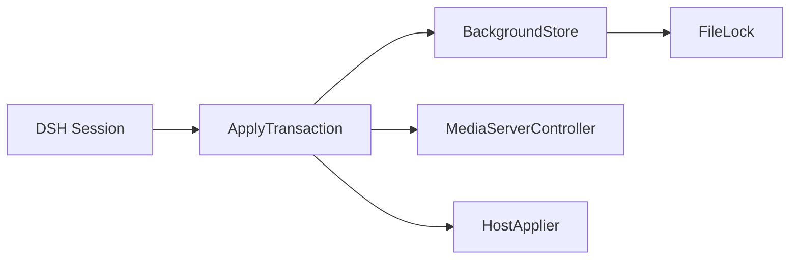

# 事务处理系统

<cite>
**本文引用的文件**
- [apply-transaction.ts](file://packages/core/src/apply-transaction.ts)
- [background-store.ts](file://packages/core/src/background-store.ts)
- [file-lock.ts](file://packages/core/src/file-lock.ts)
- [host-applier.ts](file://packages/adapter-codex/src/host-applier.ts)
- [session.ts](file://packages/adapter-dsh/src/session.ts)
- [apply-transaction.md](file://docs/apply-transaction.md)
- [background-store.test.js](file://packages/core/test/background-store.test.js)
- [live-smoke.mjs](file://scripts/live-smoke.mjs)
</cite>

## 目录
1. [简介](#简介)
2. [项目结构](#项目结构)
3. [核心组件](#核心组件)
4. [架构总览](#架构总览)
5. [详细组件分析](#详细组件分析)
6. [依赖关系分析](#依赖关系分析)
7. [性能考量](#性能考量)
8. [故障排查指南](#故障排查指南)
9. [结论](#结论)
10. [附录](#附录)

## 简介
本文件系统聚焦于 beautiCode 的后台背景应用事务处理机制，围绕 ApplyTransaction 的原子性保证、生命周期管理（准备/执行/提交）、错误恢复与回滚策略、ApplyInput/ApplyResult 数据契约、并发锁机制、日志审计以及性能优化与最佳实践进行系统化说明。目标是确保“磁盘写入成功不等于用户可见成功”，只有在宿主窗口确认或离线测试模式下才视为最终成功，从而保障背景应用的完整性与一致性。

## 项目结构
- 事务编排：packages/core/src/apply-transaction.ts
- 持久化与快照：packages/core/src/background-store.ts
- 进程级文件锁：packages/core/src/file-lock.ts
- 宿主注入与验证：packages/adapter-codex/src/host-applier.ts
- 会话入口与事务调用：packages/adapter-dsh/src/session.ts
- 事务设计文档：docs/apply-transaction.md
- 行为验证与回归用例：packages/core/test/background-store.test.js
- 运行时审计与冒烟脚本：scripts/live-smoke.mjs

**图示来源**
- [apply-transaction.ts:103-152](file://packages/core/src/apply-transaction.ts#L103-L152)
- [background-store.ts:123-159](file://packages/core/src/background-store.ts#L123-L159)
- [file-lock.ts:65-170](file://packages/core/src/file-lock.ts#L65-L170)
- [host-applier.ts:243-286](file://packages/adapter-codex/src/host-applier.ts#L243-L286)

**章节来源**
- [apply-transaction.md:1-117](file://docs/apply-transaction.md#L1-L117)
- [apply-transaction.ts:103-152](file://packages/core/src/apply-transaction.ts#L103-L152)
- [background-store.ts:123-159](file://packages/core/src/background-store.ts#L123-L159)
- [file-lock.ts:65-170](file://packages/core/src/file-lock.ts#L65-L170)
- [host-applier.ts:243-286](file://packages/adapter-codex/src/host-applier.ts#L243-L286)

## 核心组件
- ApplyTransaction：事务编排器，负责快照、导入、媒体暂存、宿主注入与验证、提交或回滚，并输出 ApplyResult。
- BackgroundStore：数据根管理，提供快照、原子提交、恢复、运行时视频拷贝与清理、写锁保护。
- MediaServerController：媒体资源暂存与发布，支持图片/视频的本地 URL 或 blob 引用。
- HostApplier：向宿主注入背景载荷并轮询验证，具备重试与自愈能力。
- FileLock：基于 O_EXCL 的跨进程文件锁，防止多实例冲突。

**章节来源**
- [apply-transaction.ts:103-152](file://packages/core/src/apply-transaction.ts#L103-L152)
- [background-store.ts:123-159](file://packages/core/src/background-store.ts#L123-L159)
- [file-lock.ts:65-170](file://packages/core/src/file-lock.ts#L65-L170)
- [host-applier.ts:243-286](file://packages/adapter-codex/src/host-applier.ts#L243-L286)

## 架构总览
事务以“快照 → 阶段写入 → 原子切换 → 媒体暂存 → 宿主注入 → 在线验证 → 提交/回滚”为主线，确保任何中间失败都能回到一致状态。

**图示来源**
- [apply-transaction.ts:127-294](file://packages/core/src/apply-transaction.ts#L127-L294)
- [background-store.ts:504-716](file://packages/core/src/background-store.ts#L504-L716)
- [host-applier.ts:243-286](file://packages/adapter-codex/src/host-applier.ts#L243-L286)

## 详细组件分析

### ApplyTransaction：原子性与生命周期
- 原子性保证
  - 使用 BackgroundStore.withExclusiveMutation 串行化写操作，避免并发交错。
  - 通过 store.snapshot 保存当前 active 状态，失败时通过 restoreSnapshot 恢复。
  - 提交采用“标记 + 日志 + 目录交换”的三段式原子切换，读端遇到活跃标记会拒绝加载，直到过期。
- 生命周期
  - 准备阶段：初始化、创建快照、commitImport 构建 staging 树并校验。
  - 执行阶段：stageMedia 暂存媒体；buildPayload 构造载荷；host.apply 注入；host.verify 在线验证（含冷启动可重试）。
  - 提交阶段：media.commit 提升媒体句柄；pruneRuntimeMedia 清理临时；beforeFinalize 钩子；clearSnapshot 清理快照。
- 错误恢复
  - 任何阶段抛错进入 catch：优先尝试 rollback（恢复快照、重新 stage 旧媒体、re-apply 旧载荷），再清理临时资源。
  - beforeFinalize 失败触发 onRollback 清理。
- 并发控制
  - 内存忙标志 #busy 防止嵌套调用；store 层通过文件锁进一步跨进程互斥。

**图示来源**
- [apply-transaction.ts:127-294](file://packages/core/src/apply-transaction.ts#L127-L294)
- [background-store.ts:504-716](file://packages/core/src/background-store.ts#L504-L716)

**章节来源**
- [apply-transaction.ts:127-294](file://packages/core/src/apply-transaction.ts#L127-L294)
- [background-store.ts:504-716](file://packages/core/src/background-store.ts#L504-L716)
- [apply-transaction.md:7-19](file://docs/apply-transaction.md#L7-L19)

### BackgroundStore：快照、原子提交与恢复
- 快照
  - 复制 active manifest 与受管背景文件到 snapshotsDir，路径严格限制在 data root 内。
- 原子提交
  - 写入 commit marker 与 journal，记录 nextDir 与 backupDir。
  - 将 active 重命名为 backup，再将 staging 重命名为 active，最后校验新 active manifest 有效后清理 journal/marker/backup。
  - 读端在 fresh marker 期间拒绝加载，避免读到半写状态。
- 恢复
  - 启动时检测 fresh marker，若存在则根据 journal 与有效性判断恢复 active。
- 运行时视频隔离
  - 为视频准备 detached runtime copy，避免 Chromium 打开 active 目录导致后续 swap 失败。
- 写锁
  - withExclusiveMutation 通过 acquireFileLock 实现跨进程互斥，AsyncLocalStorage 标记重入上下文。

**图示来源**
- [background-store.ts:123-159](file://packages/core/src/background-store.ts#L123-L159)
- [background-store.ts:504-716](file://packages/core/src/background-store.ts#L504-L716)
- [file-lock.ts:65-170](file://packages/core/src/file-lock.ts#L65-L170)

**章节来源**
- [background-store.ts:123-159](file://packages/core/src/background-store.ts#L123-L159)
- [background-store.ts:504-716](file://packages/core/src/background-store.ts#L504-L716)
- [background-store.ts:757-798](file://packages/core/src/background-store.ts#L757-L798)
- [file-lock.ts:65-170](file://packages/core/src/file-lock.ts#L65-L170)

### HostApplier：注入与验证循环
- 注入队列：apply 排队执行，避免 watch tick 打断注入与 blob 附加。
- 验证循环：按 deadline 轮询 verify，收集 pass/fail/inconclusive 样本，优先硬失败，否则超时返回 inconclusive。
- 自愈：reapplyLast 在目标丢失时仅重注入必要内容，不重复全量重建。

**图示来源**
- [host-applier.ts:243-286](file://packages/adapter-codex/src/host-applier.ts#L243-L286)
- [host-applier.ts:743-782](file://packages/adapter-codex/src/host-applier.ts#L743-L782)

**章节来源**
- [host-applier.ts:243-286](file://packages/adapter-codex/src/host-applier.ts#L243-L286)
- [host-applier.ts:743-782](file://packages/adapter-codex/src/host-applier.ts#L743-L782)

### 会话入口：ApplyTransaction 的调用点
- DSH Session 在 applyAndSaveTheme 中创建 ApplyTransaction，传入 store/media/host 与 verifyDeadlineMs，并在 beforeFinalize 中持久化视频起始位置等元信息。
- 通过 tx.run 统一封装事务，捕获错误并返回 ApplyResult。

**章节来源**
- [session.ts:148-219](file://packages/adapter-dsh/src/session.ts#L148-L219)

### 数据契约：ApplyInput 与 ApplyResult
- ApplyInput
  - 支持 image/video/clear 三种类型；image/video 支持 source 模式（local/managed）；video 支持 startAt。
- ApplyResult
  - ok:true 包含 generation、mode、sourceMode、timings；
  - ok:false 包含 error、rolledBack、sourceMode、timings。
- 这些契约贯穿事务全流程，用于上层决策与审计。

**章节来源**
- [apply-transaction.md:105-117](file://docs/apply-transaction.md#L105-L117)
- [apply-transaction.ts:127-173](file://packages/core/src/apply-transaction.ts#L127-L173)

### 并发与锁机制
- 进程内：ApplyTransaction.#busy 防止嵌套；BackgroundStore.#writeChain 串行化异步写。
- 进程间：file-lock 使用 O_EXCL 创建锁文件，nonce 防误释放，stale 迁移与抢占保护，避免双写/双注入。
- 注入器锁：acquireInjectorLock 防止多个注入器争用同一端口/目标。

**章节来源**
- [file-lock.ts:65-170](file://packages/core/src/file-lock.ts#L65-L170)
- [background-store.ts:321-344](file://packages/core/src/background-store.ts#L321-L344)
- [apply-transaction.ts:123-152](file://packages/core/src/apply-transaction.ts#L123-L152)

### 事务日志与审计
- 阶段计时：ApplyTransaction 对 initialize/snapshot/commitImport/stageMedia/buildPayload/hostApply/rendererVerify/mediaCommit/pruneRuntimeMedia/saveTheme/clearSnapshot 等阶段计时，便于定位瓶颈。
- 导入时序日志：integrations 层将 import-timing.jsonl 追加到 data/logs，辅助诊断。
- 运行时审计：live-smoke 检查页面指针事件、溢出、generation 一致性、stage/image 存在性等。

**章节来源**
- [apply-transaction.ts:158-173](file://packages/core/src/apply-transaction.ts#L158-L173)
- [ui-host.mjs:32-44](file://integrations/deepseek-harness/ui-host.mjs#L32-L44)
- [live-smoke.mjs:266-289](file://scripts/live-smoke.mjs#L266-L289)

## 依赖关系分析
- ApplyTransaction 依赖 BackgroundStore（快照/提交/恢复）、MediaServerController（媒体暂存/提交）、HostApplier（注入/验证）。
- BackgroundStore 依赖 file-lock 进行跨进程互斥，依赖 paths/constants/media-validation 等基础设施。
- DSH Session 作为入口，组合上述组件完成一次完整事务。

**图示来源**
- [session.ts:148-219](file://packages/adapter-dsh/src/session.ts#L148-L219)
- [apply-transaction.ts:103-152](file://packages/core/src/apply-transaction.ts#L103-L152)
- [background-store.ts:123-159](file://packages/core/src/background-store.ts#L123-L159)
- [file-lock.ts:65-170](file://packages/core/src/file-lock.ts#L65-L170)

**章节来源**
- [session.ts:148-219](file://packages/adapter-dsh/src/session.ts#L148-L219)
- [apply-transaction.ts:103-152](file://packages/core/src/apply-transaction.ts#L103-L152)
- [background-store.ts:123-159](file://packages/core/src/background-store.ts#L123-L159)
- [file-lock.ts:65-170](file://packages/core/src/file-lock.ts#L65-L170)

## 性能考量
- 冷启动视频预热：本地视频在首次访问前预热首帧与 moov 尾部，降低首次渲染延迟。
- 小视频内联：小于阈值的小视频直接以 data URL 嵌入，减少网络往返。
- 媒体暂存复用：MediaServerController 缓存已暂存的媒体句柄，避免重复 stage。
- 验证重试：针对首帧/Range 探针导致的冷启动失败，自动重试一次 host.apply + verify。
- 原子切换最小化影响：目录交换与 marker 机制缩短不可见窗口，读端快速失败避免脏读。

[本节为通用指导，无需具体文件引用]

## 故障排查指南
- 常见错误与定位
  - 验证未通过：查看 rendererVerify 阶段的 reason，区分硬失败与 inconclusive；关注 generation 是否匹配。
  - 视频解码失败：检查 videoFailed 信号与媒体源合法性；必要时切换到 managed 模式或更换视频文件。
  - 注入器冲突：检查 injector.lock 是否存在且 pid 存活；等待或释放锁后再试。
  - 提交进行中：读取 active 目录时若发现 commit marker 新鲜，需等待或重启以避免读到半写状态。
- 回滚与恢复
  - 事务失败时 rolledBack=true，active 应恢复到上一代；可通过 readActiveManifest 核对。
  - 若恢复失败，检查 journal 与 snapshot 目录完整性，必要时手动清理 stale marker/journal。
- 审计与取证
  - 查看 import-timing.jsonl 中的各阶段耗时，定位慢点。
  - 运行 live-smoke 审计页面状态，确认 pointer-events、overflow、generation 一致性。

**章节来源**
- [background-store.test.js:240-327](file://packages/core/test/background-store.test.js#L240-L327)
- [background-store.test.js:329-437](file://packages/core/test/background-store.test.js#L329-L437)
- [live-smoke.mjs:266-289](file://scripts/live-smoke.mjs#L266-L289)

## 结论
beautiCode 的事务处理系统通过“快照 + 原子提交 + 在线验证 + 回滚”的组合，确保背景应用在复杂环境下的强一致性与可恢复性。结合进程内外双重锁、媒体隔离与阶段计时，既保证了正确性，也兼顾了性能与可观测性。建议在生产环境中开启在线验证与审计日志，并根据业务场景调整 verifyDeadlineMs 与媒体大小阈值，以获得更稳健的体验。

## 附录
- API 参考
  - ApplyInput：{ type: "image"|"video"|"clear", ... }
  - ApplyResult：{ ok, generation, mode, sourceMode, timings, error, rolledBack }
- 关键常量
  - COMMIT_MARKER_STALE_MS：提交标记过期时间
  - MAX_INLINE_DATA_URL_BYTES / MAX_VIDEO_POSTER_INLINE_BYTES：内联大小阈值
- 最佳实践
  - 始终设置合理的 verifyDeadlineMs，避免长时间挂起。
  - 对大视频优先使用 managed 模式，减少 active 目录占用与句柄竞争。
  - 在 beforeFinalize 中做轻量持久化，失败时通过 onRollback 清理。
  - 监控 import-timing.jsonl 与 live-smoke 审计结果，持续优化。

[本节为补充说明，无需具体文件引用]