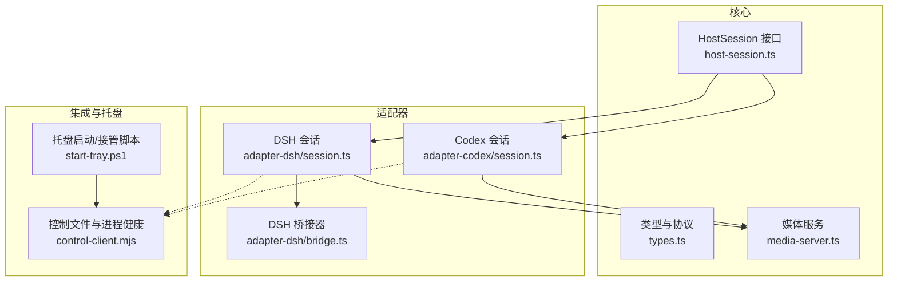
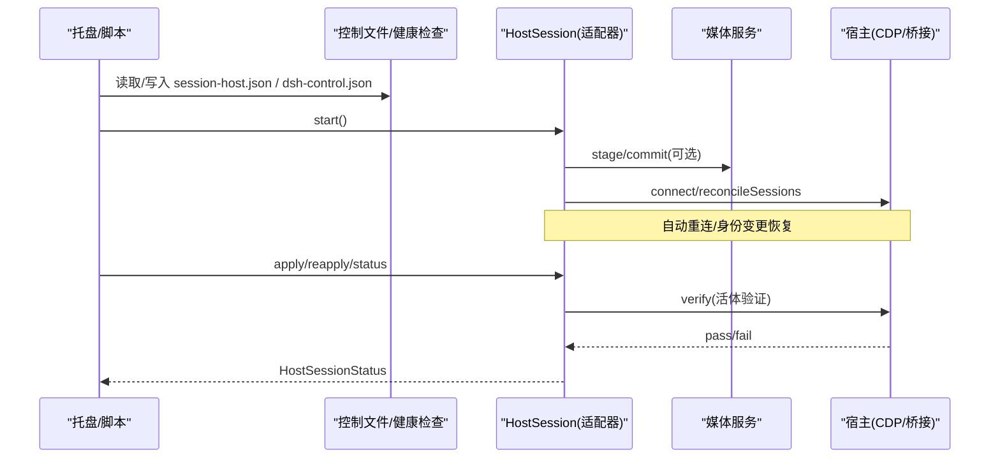
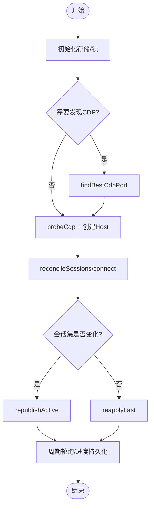
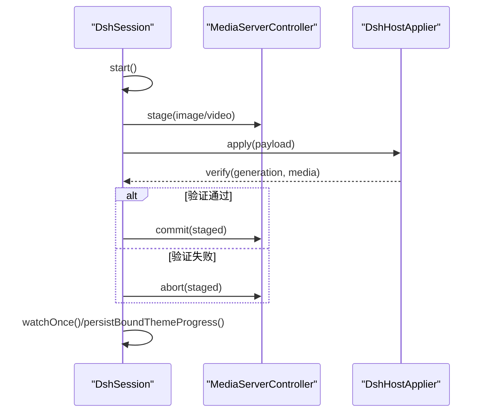
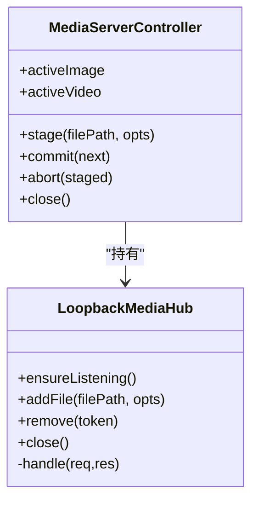
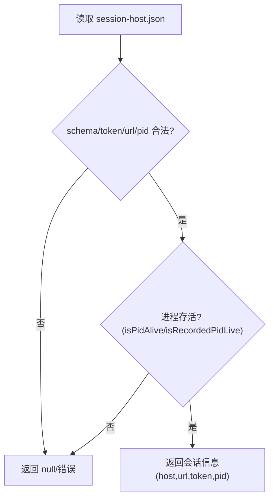
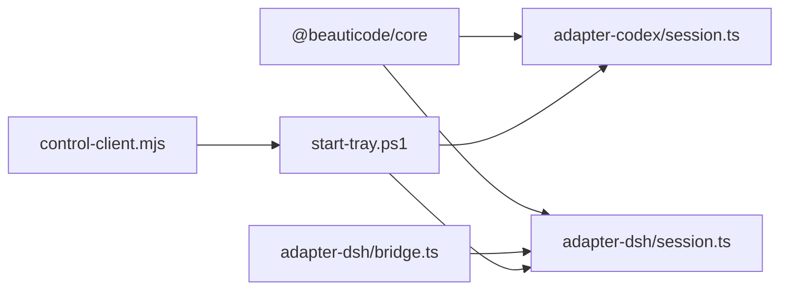

# 会话管理系统

<cite>
**本文引用的文件**
- [packages/core/src/host-session.ts](file://packages/core/src/host-session.ts)
- [packages/core/src/types.ts](file://packages/core/src/types.ts)
- [packages/core/src/media-server.ts](file://packages/core/src/media-server.ts)
- [packages/adapter-codex/src/session.ts](file://packages/adapter-codex/src/session.ts)
- [packages/adapter-dsh/src/session.ts](file://packages/adapter-dsh/src/session.ts)
- [packages/adapter-dsh/src/bridge.ts](file://packages/adapter-dsh/src/bridge.ts)
- [integrations/deepseek-harness/control-client.mjs](file://integrations/deepseek-harness/control-client.mjs)
- [apps/tray/start-tray.ps1](file://apps/tray/start-tray.ps1)
</cite>

## 目录
1. [简介](#简介)
2. [项目结构](#项目结构)
3. [核心组件](#核心组件)
4. [架构总览](#架构总览)
5. [详细组件分析](#详细组件分析)
6. [依赖关系分析](#依赖关系分析)
7. [性能考量](#性能考量)
8. [故障排除指南](#故障排除指南)
9. [结论](#结论)
10. [附录](#附录)

## 简介
本文件系统性地解析 beautiCode 的“会话管理”能力，围绕 HostSession 统一抽象，说明如何通过单一接口控制不同宿主应用（Codex Desktop、DeepSeek Harness）。文档覆盖会话生命周期（启动、停止、状态监控、自动重连）、HostSessionStatus 状态模型（主机描述符、端口信息、会话计数、媒体服务器状态等）、进程存活检测与异常恢复策略，并给出最佳实践与故障排除建议。

## 项目结构
- 核心协议与类型定义位于 core 包，提供 HostSession 接口、HostSessionStatus、ApplyInput/Result、背景清单、媒体服务与校验等基础能力。
- 适配器实现：
  - Codex 适配器：通过 CDP 连接本地浏览器，使用 data/blob URL 注入背景。
  - DSH 适配器：通过 HTTP 桥接与 DeepSeek Harness 通信，使用 loopback 媒体服务。
- 托盘与集成脚本负责进程发现、接管、控制文件读写与健壮性检查。

图表来源
- [packages/core/src/host-session.ts:10-47](file://packages/core/src/host-session.ts#L10-L47)
- [packages/core/src/types.ts:1-215](file://packages/core/src/types.ts#L1-L215)
- [packages/core/src/media-server.ts:145-732](file://packages/core/src/media-server.ts#L145-L732)
- [packages/adapter-codex/src/session.ts:56-196](file://packages/adapter-codex/src/session.ts#L56-L196)
- [packages/adapter-dsh/src/session.ts:50-142](file://packages/adapter-dsh/src/session.ts#L50-L142)
- [packages/adapter-dsh/src/bridge.ts:85-124](file://packages/adapter-dsh/src/bridge.ts#L85-L124)
- [integrations/deepseek-harness/control-client.mjs:219-401](file://integrations/deepseek-harness/control-client.mjs#L219-L401)
- [apps/tray/start-tray.ps1:658-847](file://apps/tray/start-tray.ps1#L658-L847)

章节来源
- [packages/core/src/host-session.ts:10-47](file://packages/core/src/host-session.ts#L10-L47)
- [packages/core/src/types.ts:1-215](file://packages/core/src/types.ts#L1-L215)
- [packages/core/src/media-server.ts:145-732](file://packages/core/src/media-server.ts#L145-L732)
- [packages/adapter-codex/src/session.ts:56-196](file://packages/adapter-codex/src/session.ts#L56-L196)
- [packages/adapter-dsh/src/session.ts:50-142](file://packages/adapter-dsh/src/session.ts#L50-L142)
- [packages/adapter-dsh/src/bridge.ts:85-124](file://packages/adapter-dsh/src/bridge.ts#L85-L124)
- [integrations/deepseek-harness/control-client.mjs:219-401](file://integrations/deepseek-harness/control-client.mjs#L219-L401)
- [apps/tray/start-tray.ps1:658-847](file://apps/tray/start-tray.ps1#L658-L847)

## 核心组件
- HostSession 统一接口：定义 start/stop/status/apply/reapply/saveCurrentTheme/listSavedThemes/deleteSavedTheme/useSavedTheme/setFishMode/setMuted/setBackgroundTone 等能力，屏蔽底层差异。
- HostSessionStatus：对外暴露 host 描述、端口、sessions、manifest、mediaServer、fish/muted/tone/themeId 等关键属性。
- MediaServerController/LoopbackMediaHub：提供受信任源访问的本地媒体服务，支持图片/视频资产注册、Range 请求、安全校验与资源回收。
- 适配器会话：BeautiSession（Codex）与 DshSession（DSH）分别实现 HostSession，封装各自宿主连接、轮询、重连与状态同步逻辑。

章节来源
- [packages/core/src/host-session.ts:10-47](file://packages/core/src/host-session.ts#L10-L47)
- [packages/core/src/types.ts:107-215](file://packages/core/src/types.ts#L107-L215)
- [packages/core/src/media-server.ts:145-732](file://packages/core/src/media-server.ts#L145-L732)
- [packages/adapter-codex/src/session.ts:56-196](file://packages/adapter-codex/src/session.ts#L56-L196)
- [packages/adapter-dsh/src/session.ts:50-142](file://packages/adapter-dsh/src/session.ts#L50-L142)

## 架构总览
下图展示从托盘到适配器的调用链路与数据流：托盘通过控制文件与健康检查发现或启动会话；会话内部维护媒体服务与宿主连接；应用层通过 HostSession 统一 API 完成背景应用与状态查询。

图表来源
- [integrations/deepseek-harness/control-client.mjs:219-401](file://integrations/deepseek-harness/control-client.mjs#L219-L401)
- [packages/adapter-codex/src/session.ts:202-273](file://packages/adapter-codex/src/session.ts#L202-L273)
- [packages/adapter-dsh/src/session.ts:118-142](file://packages/adapter-dsh/src/session.ts#L118-L142)
- [packages/core/src/media-server.ts:145-732](file://packages/core/src/media-server.ts#L145-L732)

## 详细组件分析

### HostSession 统一抽象与状态模型
- 统一接口：所有宿主适配器均实现 HostSession，使上层（托盘、控制台）无需关心底层是 CDP 还是 HTTP 桥接。
- 状态模型 HostSessionStatus：
  - host：HostDescriptor（kind/displayName/capabilities），用于 UI 显示与能力探测。
  - port：当前会话绑定的端口（Codex 为 CDP 端口，DSH 为桥接端口）。
  - sessions：活跃会话数（activeSessionCount/connectedClients）。
  - manifest：当前背景清单（generation/background/type/source/effects）。
  - mediaServer：当前媒体服务的可访问 URL（图片/视频任一）。
  - fish/muted/tone/themeId：摸鱼模式、静音、色调、当前绑定主题 ID。

章节来源
- [packages/core/src/host-session.ts:10-47](file://packages/core/src/host-session.ts#L10-L47)
- [packages/core/src/types.ts:18-34](file://packages/core/src/types.ts#L18-L34)
- [packages/core/src/types.ts:76-81](file://packages/core/src/types.ts#L76-L81)
- [packages/adapter-codex/src/session.ts:334-349](file://packages/adapter-codex/src/session.ts#L334-L349)
- [packages/adapter-dsh/src/session.ts:380-394](file://packages/adapter-dsh/src/session.ts#L380-L394)

### Codex Desktop 适配器（BeautiSession）
- 启动流程：初始化存储、获取注入锁、按需发现 CDP 端口、建立宿主连接、后台发布当前背景、启动轮询。
- 自动重连：当检测到 CDP 身份变化（重启导致目标替换）时，关闭旧连接并重建，清理已发布键，重新发布。
- 状态监控：周期性 reconcileSessions，若会话数为 0 则 reconnect；稳定后仅 reapplyLast 修复不健康运行时。
- 媒体策略：默认禁用媒体服务（CSP 限制），优先使用 data/blob URL 注入。
- 用户操作保护：userBusy/watchBusy 分离，避免后台轮询阻塞用户操作。

图表来源
- [packages/adapter-codex/src/session.ts:167-196](file://packages/adapter-codex/src/session.ts#L167-L196)
- [packages/adapter-codex/src/session.ts:202-273](file://packages/adapter-codex/src/session.ts#L202-L273)
- [packages/adapter-codex/src/session.ts:717-787](file://packages/adapter-codex/src/session.ts#L717-L787)

章节来源
- [packages/adapter-codex/src/session.ts:167-196](file://packages/adapter-codex/src/session.ts#L167-L196)
- [packages/adapter-codex/src/session.ts:202-273](file://packages/adapter-codex/src/session.ts#L202-L273)
- [packages/adapter-codex/src/session.ts:717-787](file://packages/adapter-codex/src/session.ts#L717-L787)

### DeepSeek Harness 适配器（DshSession）
- 启动流程：初始化存储、获取注入锁、生成桥接令牌、构造 DshHostApplier、启动轮询与托盘移交监听。
- 媒体策略：启用媒体服务，基于可信来源（来自 baseUrl）提供 loopback 地址供页面加载。
- 重应用与恢复：reapply 时先 stage 图片/视频，构建 HostApplyPayload，verify 通过后 commit；失败则 abort staged 资源。
- 托盘移交：若托盘请求接管，释放当前会话，让托盘接管控制权。

图表来源
- [packages/adapter-dsh/src/session.ts:118-142](file://packages/adapter-dsh/src/session.ts#L118-L142)
- [packages/adapter-dsh/src/session.ts:270-378](file://packages/adapter-dsh/src/session.ts#L270-L378)
- [packages/core/src/media-server.ts:636-732](file://packages/core/src/media-server.ts#L636-L732)
- [packages/adapter-dsh/src/bridge.ts:85-124](file://packages/adapter-dsh/src/bridge.ts#L85-L124)

章节来源
- [packages/adapter-dsh/src/session.ts:118-142](file://packages/adapter-dsh/src/session.ts#L118-L142)
- [packages/adapter-dsh/src/session.ts:270-378](file://packages/adapter-dsh/src/session.ts#L270-L378)
- [packages/core/src/media-server.ts:636-732](file://packages/core/src/media-server.ts#L636-L732)
- [packages/adapter-dsh/src/bridge.ts:85-124](file://packages/adapter-dsh/src/bridge.ts#L85-L124)

### 媒体服务（LoopbackMediaHub/MediaServerController）
- 安全与访问控制：仅允许受信任来源（origin 匹配或 app://* 前缀），路径 token 与 header/query token 双重校验。
- 资源管理：按文件指纹去重，记录设备号/inode/时间戳，支持 Range 请求与流式传输，关闭时主动销毁连接与句柄。
- 控制器：支持 image/video 成对提交，自动回收不再使用的 token，提供 abort/close 能力。

图表来源
- [packages/core/src/media-server.ts:145-732](file://packages/core/src/media-server.ts#L145-L732)

章节来源
- [packages/core/src/media-server.ts:145-732](file://packages/core/src/media-server.ts#L145-L732)

### 进程存活检测与控制文件
- 控制文件：session-host.json/dsh-control.json 以原子方式写入，包含 host、pid、url、token、startedAt 等字段，并进行严格校验（loopback URL、最小 token 长度、pid 合法性）。
- 存活检测：结合 isPidAlive 与核心包的 isRecordedPidLive，确保进程仍在运行且记录有效。
- 托盘接管：托盘脚本会尝试接管已有会话，或在无主情况下启动新会话，同时处理遗留进程清理。

图表来源
- [integrations/deepseek-harness/control-client.mjs:219-401](file://integrations/deepseek-harness/control-client.mjs#L219-L401)
- [integrations/deepseek-harness/control-client.mjs:83-132](file://integrations/deepseek-harness/control-client.mjs#L83-L132)
- [apps/tray/start-tray.ps1:658-847](file://apps/tray/start-tray.ps1#L658-L847)

章节来源
- [integrations/deepseek-harness/control-client.mjs:219-401](file://integrations/deepseek-harness/control-client.mjs#L219-L401)
- [integrations/deepseek-harness/control-client.mjs:83-132](file://integrations/deepseek-harness/control-client.mjs#L83-L132)
- [apps/tray/start-tray.ps1:658-847](file://apps/tray/start-tray.ps1#L658-L847)

## 依赖关系分析
- 适配器依赖 core 的类型、媒体服务、事务与存储能力。
- DSH 适配器额外依赖 bridge 进行 HTTP 桥接通信。
- 托盘与集成脚本通过 control-client 读写控制文件，协调进程生命周期与会话归属。

图表来源
- [packages/core/src/index.ts:1-19](file://packages/core/src/index.ts#L1-L19)
- [packages/adapter-codex/src/session.ts:1-26](file://packages/adapter-codex/src/session.ts#L1-L26)
- [packages/adapter-dsh/src/session.ts:1-24](file://packages/adapter-dsh/src/session.ts#L1-L24)
- [packages/adapter-dsh/src/bridge.ts:85-124](file://packages/adapter-dsh/src/bridge.ts#L85-L124)
- [integrations/deepseek-harness/control-client.mjs:219-401](file://integrations/deepseek-harness/control-client.mjs#L219-L401)
- [apps/tray/start-tray.ps1:658-847](file://apps/tray/start-tray.ps1#L658-L847)

章节来源
- [packages/core/src/index.ts:1-19](file://packages/core/src/index.ts#L1-L19)
- [packages/adapter-codex/src/session.ts:1-26](file://packages/adapter-codex/src/session.ts#L1-L26)
- [packages/adapter-dsh/src/session.ts:1-24](file://packages/adapter-dsh/src/session.ts#L1-L24)
- [packages/adapter-dsh/src/bridge.ts:85-124](file://packages/adapter-dsh/src/bridge.ts#L85-L124)
- [integrations/deepseek-harness/control-client.mjs:219-401](file://integrations/deepseek-harness/control-client.mjs#L219-L401)
- [apps/tray/start-tray.ps1:658-847](file://apps/tray/start-tray.ps1#L658-L847)

## 性能考量
- 轮询间隔与节流：Codex 默认 pollMs=1s，DSH 默认 2s；内部将宿主轮询频率进一步降低（如 DSH 适配器将宿主 poll 设为 pollMs/4 并限制在 50-250ms），减少频繁请求开销。
- 媒体服务：大文件采用流式传输与 Range 请求，避免全量加载；重复文件指纹去重，减少内存占用。
- 用户操作隔离：userBusy 与 watchBusy 分离，防止后台任务阻塞用户操作；进度写入节流（约 2s 一次）降低磁盘压力。
- 超时与兜底：verify 设置 deadline；媒体服务 closeAllConnections 与超时定时器保证退出不会卡住。

[本节为通用性能讨论，不直接分析具体文件]

## 故障排除指南
- 无法发现 Codex CDP：
  - 确认已打开 Codex Desktop；检查 autoDiscover 与 findBestCdpPort 是否返回有效端口。
  - 参考：[packages/adapter-codex/src/session.ts:202-227](file://packages/adapter-codex/src/session.ts#L202-L227)
- CDP 身份变化导致注入失败：
  - 捕获 CdpIdentityMismatchError，关闭旧 host 并重建，清理 lastPublishSessionKey 后重新发布。
  - 参考：[packages/adapter-codex/src/session.ts:248-264](file://packages/adapter-codex/src/session.ts#L248-L264)、[packages/adapter-codex/src/session.ts:772-783](file://packages/adapter-codex/src/session.ts#L772-L783)
- DSH 桥接不可用：
  - 检查 dsh-control.json 是否存在且 token/url/pid 合法；确认进程存活；必要时由托盘接管或重启。
  - 参考：[integrations/deepseek-harness/control-client.mjs:296-340](file://integrations/deepseek-harness/control-client.mjs#L296-L340)、[integrations/deepseek-harness/control-client.mjs:357-401](file://integrations/deepseek-harness/control-client.mjs#L357-L401)
- 媒体服务 403/404：
  - 确认 origin 在 trustedOrigins 中；请求携带正确的 path token 与 header/query token；文件未被替换或越界。
  - 参考：[packages/core/src/media-server.ts:406-590](file://packages/core/src/media-server.ts#L406-L590)
- 托盘接管冲突：
  - 托盘会尝试接管已有会话；若发现残留进程，会清理并重新启动；注意观察日志中的“beautiCode 托盘正在接管”。
  - 参考：[apps/tray/start-tray.ps1:658-847](file://apps/tray/start-tray.ps1#L658-L847)

章节来源
- [packages/adapter-codex/src/session.ts:202-227](file://packages/adapter-codex/src/session.ts#L202-L227)
- [packages/adapter-codex/src/session.ts:248-264](file://packages/adapter-codex/src/session.ts#L248-L264)
- [packages/adapter-codex/src/session.ts:772-783](file://packages/adapter-codex/src/session.ts#L772-L783)
- [integrations/deepseek-harness/control-client.mjs:296-340](file://integrations/deepseek-harness/control-client.mjs#L296-L340)
- [integrations/deepseek-harness/control-client.mjs:357-401](file://integrations/deepseek-harness/control-client.mjs#L357-L401)
- [packages/core/src/media-server.ts:406-590](file://packages/core/src/media-server.ts#L406-L590)
- [apps/tray/start-tray.ps1:658-847](file://apps/tray/start-tray.ps1#L658-L847)

## 结论
通过 HostSession 统一抽象，beautiCode 实现了跨宿主的会话管理能力：一致的启动/停止/状态/应用/重应用/主题管理接口，配合媒体服务与进程健康检查，保障在不同宿主环境下的稳定性与可恢复性。Codex 适配器侧重 CDP 直连与 data/blob 注入，DSH 适配器侧重 HTTP 桥接与 loopback 媒体服务。托盘与集成脚本通过控制文件与存活检测，实现进程级协调与接管。遵循本文的最佳实践与故障排除建议，可有效提升系统可靠性与用户体验。

[本节为总结性内容，不直接分析具体文件]

## 附录
- 最佳实践
  - 始终通过 HostSession 接口操作，避免直接调用宿主特定 API。
  - 合理设置 verifyDeadlineMs 与 pollMs，平衡响应速度与负载。
  - 使用 saveCurrentTheme/useSavedTheme 管理主题，并在视频主题下利用进度持久化。
  - 在托盘环境中启用 deferHostConnect，快速返回控制平面就绪。
  - 关注 onStatus/onError 回调，及时记录诊断信息。
- 常用命令与路径
  - 控制文件：session-host.json、dsh-control.json、tray-claim.json（位于 dataRoot）。
  - 媒体服务：loopback 地址由 MediaServerController 提供，URL 含 token。
  - 托盘脚本：Windows PowerShell 脚本负责进程管理与接管。

[本节为补充信息，不直接分析具体文件]