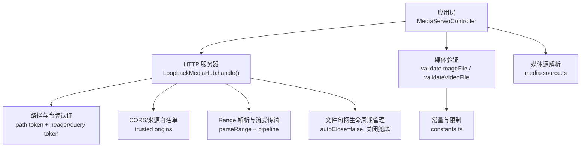
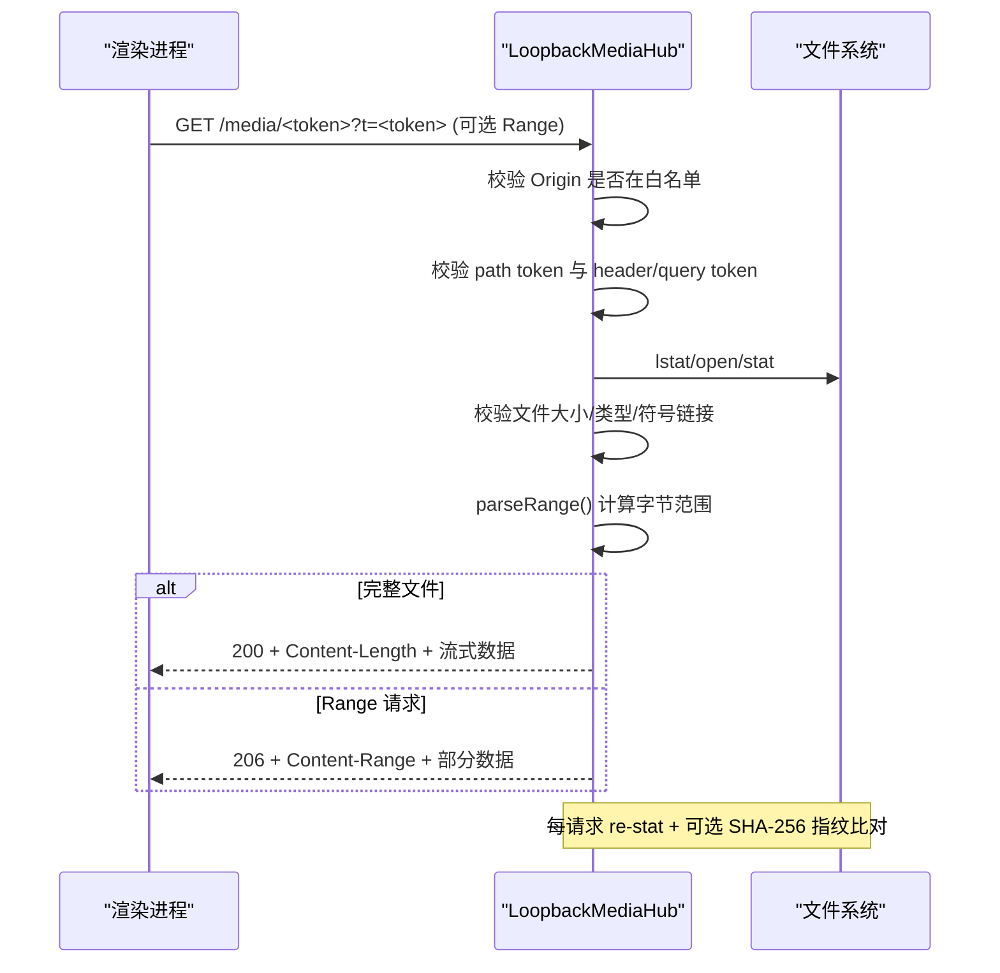
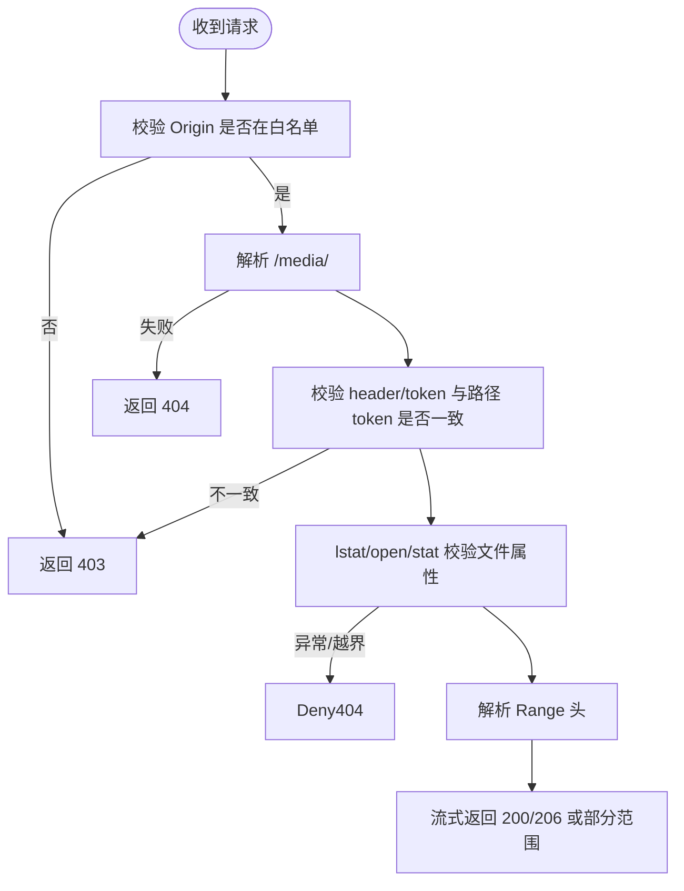
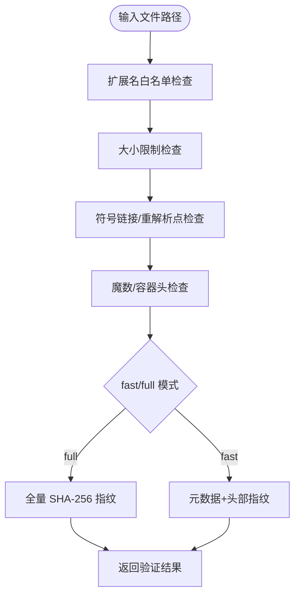
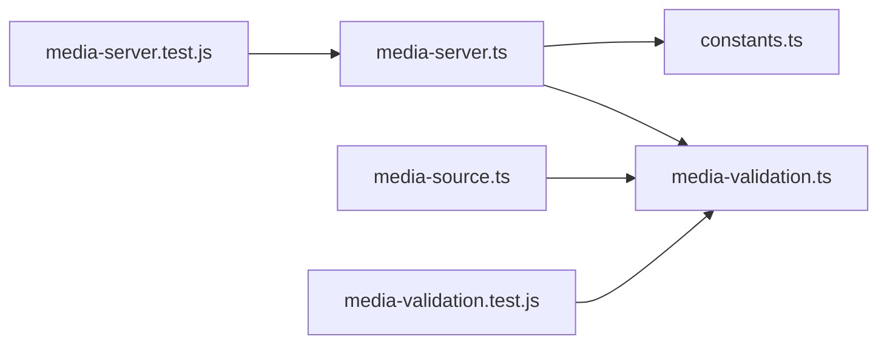

# 媒体服务引擎

<cite>
**本文引用的文件**
- [packages/core/src/media-server.ts](file://packages/core/src/media-server.ts)
- [packages/core/src/media-validation.ts](file://packages/core/src/media-validation.ts)
- [packages/core/src/constants.ts](file://packages/core/src/constants.ts)
- [packages/core/src/media-source.ts](file://packages/core/src/media-source.ts)
- [packages/core/test/media-server.test.js](file://packages/core/test/media-server.test.js)
- [packages/core/test/media-validation.test.js](file://packages/core/test/media-validation.test.js)
- [docs/security-boundaries.md](file://docs/security-boundaries.md)
- [docs/media-contract.md](file://docs/media-contract.md)
- [integrations/deepseek-harness/index.mjs](file://integrations/deepseek-harness/index.mjs)
</cite>

## 目录
1. [简介](#简介)
2. [项目结构](#项目结构)
3. [核心组件](#核心组件)
4. [架构总览](#架构总览)
5. [详细组件分析](#详细组件分析)
6. [依赖关系分析](#依赖关系分析)
7. [性能与缓存策略](#性能与缓存策略)
8. [故障诊断与监控指标](#故障诊断与监控指标)
9. [安全边界与防护措施](#安全边界与防护措施)
10. [媒体格式支持与兼容性矩阵](#媒体格式支持与兼容性矩阵)
11. [结论](#结论)

## 简介
本技术文档面向 beautiCode 媒体服务引擎，聚焦本地回环（loopback）安全媒体访问控制、Range 请求与大文件流式传输/断点续传、媒体文件验证流程、媒体源抽象、缓存与性能优化、安全边界防护以及监控与故障诊断。该引擎以 Node.js HTTP 服务器为核心，提供多资产路由、令牌认证、来源白名单校验、内容指纹重放保护等能力，确保仅受信任的渲染进程可安全访问当前暂存/活跃的媒体资源。

## 项目结构
媒体服务相关代码集中在 core 包中，围绕以下模块组织：
- 媒体服务器与路由：LoopbackMediaHub、MediaServerController、createMediaServer
- 媒体验证：validateImageFile、validateVideoFile、warmVideoFileReads、assertSafeBasename
- 常量与限制：大小上限、扩展名、MIME、可信来源前缀、Token 头名
- 媒体源解析：resolveMediaSource、resolveBackgroundImagePath/VideoPath
- 测试与契约：媒体契约与安全边界文档

图表来源
- [packages/core/src/media-server.ts:148-591](file://packages/core/src/media-server.ts#L148-L591)
- [packages/core/src/media-validation.ts:223-292](file://packages/core/src/media-validation.ts#L223-L292)
- [packages/core/src/constants.ts:24-52](file://packages/core/src/constants.ts#L24-L52)
- [packages/core/src/media-source.ts:6-31](file://packages/core/src/media-source.ts#L6-L31)

章节来源
- [packages/core/src/media-server.ts:148-591](file://packages/core/src/media-server.ts#L148-L591)
- [packages/core/src/media-validation.ts:223-292](file://packages/core/src/media-validation.ts#L223-L292)
- [packages/core/src/constants.ts:24-52](file://packages/core/src/constants.ts#L24-L52)
- [packages/core/src/media-source.ts:6-31](file://packages/core/src/media-source.ts#L6-L31)

## 核心组件
- LoopbackMediaHub：单端口多路由的本地媒体 Hub，负责监听、路由匹配、认证、CORS、Range 响应与流式传输。
- MediaServerController：对外的控制器，支持“暂存-提交”工作流，维护当前活跃的图片/视频资产并自动回收旧资源。
- createMediaServer：兼容的单资产便捷 API。
- 媒体验证器：对图片/视频进行扩展名、大小、魔数/容器头、符号链接/重解析点检查，并提供快速模式指纹。
- 媒体源解析：将 manifest/source 解析为实际文件路径，并对文件名做安全基名校验。

章节来源
- [packages/core/src/media-server.ts:148-732](file://packages/core/src/media-server.ts#L148-L732)
- [packages/core/src/media-validation.ts:62-123](file://packages/core/src/media-validation.ts#L62-L123)
- [packages/core/src/media-source.ts:6-31](file://packages/core/src/media-source.ts#L6-L31)

## 架构总览
媒体服务采用“受控本地 HTTP 服务 + 严格认证 + 流式读取”的架构。渲染进程通过带令牌的 URL 或自定义头部访问媒体；服务端在每次请求时重新 stat 并校验文件指纹，防止替换攻击。所有网络绑定仅在 127.0.0.1，配合来源白名单与 CORS 头，最小化暴露面。

图表来源
- [packages/core/src/media-server.ts:406-591](file://packages/core/src/media-server.ts#L406-L591)
- [packages/core/src/media-server.ts:66-94](file://packages/core/src/media-server.ts#L66-L94)

## 详细组件分析

### 安全媒体访问控制（令牌认证、路径验证、白名单）
- 路径令牌：路由形如 /media/<token>，token 由随机 UUID 生成且无连字符，长度 16-64 位字母数字。
- 双因子认证：必须同时满足“路径中的 token 与请求携带的 token 一致”，token 可通过：
  - 自定义头部 X-BeautiCode-Media-Token
  - 查询参数 ?t=（用于 /<video> 无法设置请求头的场景）
- 来源白名单：基于 Origin 判断是否允许跨域访问，默认包含 app://*、null、file:// 等，仅对可信来源返回 Access-Control-Allow-Origin。
- 路径合法性：仅匹配固定正则路由，拒绝任意路径遍历；请求方法仅限 GET/HEAD/OPTIONS。
- 每次请求重统计：lstat/open/stat 后校验是否为普通文件、大小未变、非符号链接；必要时进行内容哈希比对，防止运行时替换。

图表来源
- [packages/core/src/media-server.ts:406-591](file://packages/core/src/media-server.ts#L406-L591)
- [packages/core/src/constants.ts:24-41](file://packages/core/src/constants.ts#L24-L41)

章节来源
- [packages/core/src/media-server.ts:406-591](file://packages/core/src/media-server.ts#L406-L591)
- [packages/core/src/constants.ts:24-41](file://packages/core/src/constants.ts#L24-L41)
- [docs/security-boundaries.md:29-44](file://docs/security-boundaries.md#L29-L44)

### Range 请求处理与断点续传
- Range 解析：支持 bytes=start-end 与 bytes=suffix 两种形式，非法或越界返回 416。
- 流式传输：使用管道将文件流直接写入响应，避免整文件加载内存；支持 HEAD 仅返回头。
- 断点续传：客户端可重复发起不同 Range 请求，服务端按范围返回 206 并附带 Content-Range。
- 取消与超时：请求中止或响应销毁时及时中断传输，释放文件句柄。

```mermaid
flowchart TD
RStart(["接收 Range 头"]) --> Parsed{"解析成功?"}
Parsed --> |否| Return416["返回 416 Unacceptable Range"]
Parsed --> |是| Compute["计算 start/end"]
Compute --> Head{"HEAD 请求?"}
Head --> |是| SendHeaders["返回 206 + 头信息"]
Head --> |否| Stream["流式发送指定字节范围"]
Stream --> Done(["完成/清理"])
```

图表来源
- [packages/core/src/media-server.ts:66-94](file://packages/core/src/media-server.ts#L66-L94)
- [packages/core/src/media-server.ts:524-580](file://packages/core/src/media-server.ts#L524-L580)

章节来源
- [packages/core/src/media-server.ts:66-94](file://packages/core/src/media-server.ts#L66-L94)
- [packages/core/src/media-server.ts:524-580](file://packages/core/src/media-server.ts#L524-L580)

### 媒体文件验证流程（格式检查、大小限制、安全扫描）
- 图片验证：
  - 扩展名白名单：jpg/jpeg/png/webp/avif
  - 大小限制：不超过 MAX_IMAGE_BYTES（约 18 MiB）
  - 魔数检测：JPEG/PNG/WEBP/AVIF 容器签名
  - 符号链接/重解析点拒绝
- 视频验证：
  - 仅 .mp4
  - 大小限制：不超过 MAX_VIDEO_BYTES（约 800 MiB）
  - 容器头校验：首 box 尺寸合理且类型为 ftyp
  - 符号链接/重解析点拒绝
- 快速模式：仅对元数据与文件头计算指纹，避免对大文件全量哈希；运行时若元数据变化则拒绝。
- 预热读取：对 MP4 头部与尾部进行预热，降低冷启动时的首次读取延迟。

图表来源
- [packages/core/src/media-validation.ts:223-292](file://packages/core/src/media-validation.ts#L223-L292)
- [packages/core/src/media-validation.ts:125-190](file://packages/core/src/media-validation.ts#L125-L190)
- [packages/core/src/media-validation.ts:294-328](file://packages/core/src/media-validation.ts#L294-L328)

章节来源
- [packages/core/src/media-validation.ts:223-292](file://packages/core/src/media-validation.ts#L223-L292)
- [packages/core/src/media-validation.ts:125-190](file://packages/core/src/media-validation.ts#L125-L190)
- [packages/core/src/media-validation.ts:294-328](file://packages/core/src/media-validation.ts#L294-L328)
- [docs/media-contract.md:43-66](file://docs/media-contract.md#L43-L66)

### 媒体源抽象设计（本地文件、网络资源等）
- 统一接口：MediaSource 支持 local 与 managed 等来源；解析函数将 source 转换为绝对路径。
- 背景图/视频解析：根据 manifest 的 type/source/image/video 字段解析出实际文件路径。
- 安全基名：对所有存储于 active/staging 树中的文件名执行 basename 校验，禁止路径穿越与非法字符。

章节来源
- [packages/core/src/media-source.ts:6-31](file://packages/core/src/media-source.ts#L6-L31)
- [packages/core/src/media-validation.ts:330-358](file://packages/core/src/media-validation.ts#L330-L358)

### 控制器与工作流（暂存-提交-回收）
- stage(filePath, opts)：对文件执行验证并注册到 Hub，返回含 token/url/srcUrl 的句柄。
- commit(next)：原子切换当前活跃图片/视频，并回收不再使用的旧资源。
- abort(staged)：丢弃暂存但未提交的资源。
- close()：关闭 Hub 并释放连接与句柄。

章节来源
- [packages/core/src/media-server.ts:636-732](file://packages/core/src/media-server.ts#L636-L732)

## 依赖关系分析
- media-server.ts 依赖 constants.ts（大小限制、扩展名、MIME、Token 头、可信来源）、media-validation.ts（验证逻辑）。
- media-source.ts 依赖 media-validation.ts（basename 安全校验）。
- 测试覆盖认证、Range、来源校验、身份漂移等关键路径。

图表来源
- [packages/core/src/media-server.ts:1-22](file://packages/core/src/media-server.ts#L1-L22)
- [packages/core/src/media-source.ts:1-3](file://packages/core/src/media-source.ts#L1-L3)
- [packages/core/test/media-server.test.js:1-37](file://packages/core/test/media-server.test.js#L1-L37)
- [packages/core/test/media-validation.test.js:144-177](file://packages/core/test/media-validation.test.js#L144-L177)

章节来源
- [packages/core/src/media-server.ts:1-22](file://packages/core/src/media-server.ts#L1-L22)
- [packages/core/src/media-source.ts:1-3](file://packages/core/src/media-source.ts#L1-L3)
- [packages/core/test/media-server.test.js:1-37](file://packages/core/test/media-server.test.js#L1-L37)
- [packages/core/test/media-validation.test.js:144-177](file://packages/core/test/media-validation.test.js#L144-L177)

## 性能与缓存策略
- 流式传输：使用 pipeline 将文件流直接写入响应，避免内存占用；支持 Range 分块传输。
- 文件句柄复用与生命周期：创建 ReadStream 时 autoClose=false，由 Hub 统一管理打开/关闭，确保异常与取消时正确释放。
- 预读预热：对 MP4 头部与尾部进行预热，减少冷启动时首次读取阻塞。
- 缓存策略：响应头 Cache-Control=no-store，避免代理/浏览器缓存敏感媒体；Accept-Ranges 启用以便客户端断点续传。
- 连接与超时：设置 headersTimeout、keepAliveTimeout、maxRequestsPerSocket，限制并发与空闲连接。

章节来源
- [packages/core/src/media-server.ts:177-218](file://packages/core/src/media-server.ts#L177-L218)
- [packages/core/src/media-server.ts:365-404](file://packages/core/src/media-server.ts#L365-L404)
- [packages/core/src/media-server.ts:524-580](file://packages/core/src/media-server.ts#L524-L580)
- [packages/core/src/media-validation.ts:294-328](file://packages/core/src/media-validation.ts#L294-L328)

## 故障诊断与监控指标
- 常见错误码：
  - 403：来源不在白名单或令牌不匹配
  - 404：路由不存在或资源已移除
  - 416：Range 不可满足
  - 503：Hub 已关闭
- 诊断要点：
  - 检查 Origin 与白名单配置
  - 确认请求是否携带正确的 X-BeautiCode-Media-Token 或 ?t=
  - 观察 Range 头是否符合规范
  - 关注文件变更导致的身份漂移（re-stat + 指纹比对失败）
- 集成侧验证：
  - deepseek-harness 中对 loopback 媒体 URL 的合法性校验（协议、主机、存在 t 参数）
  - 测试用例覆盖跨域与 Range 行为

章节来源
- [packages/core/src/media-server.ts:406-591](file://packages/core/src/media-server.ts#L406-L591)
- [integrations/deepseek-harness/index.mjs:90-123](file://integrations/deepseek-harness/index.mjs#L90-L123)
- [packages/core/test/media-server.test.js:28-37](file://packages/core/test/media-server.test.js#L28-L37)

## 安全边界与防护措施
- 绑定地址：仅 127.0.0.1，禁止局域网暴露。
- 路径隔离：仅服务明确注册的 /media/<token> 路由，拒绝任意路径访问。
- 令牌机制：每个资产拥有唯一不可猜测的 token，需与 header 或 query 参数一致。
- 来源白名单：仅对可信 Origin 返回 CORS 允许头，否则 403。
- 内容完整性：每次请求 re-stat 并校验大小/类型/符号链接；必要时进行内容哈希比对，防止运行时替换。
- 文件名安全：basename 校验阻止路径穿越、非法字符与保留设备名。
- 最小权限：仅服务于当前暂存/活跃的媒体，不暴露其他文件系统内容。

章节来源
- [docs/security-boundaries.md:1-51](file://docs/security-boundaries.md#L1-L51)
- [packages/core/src/media-validation.ts:62-123](file://packages/core/src/media-validation.ts#L62-L123)
- [packages/core/src/media-validation.ts:330-358](file://packages/core/src/media-validation.ts#L330-L358)

## 媒体格式支持与兼容性矩阵
- 图片：
  - 扩展名：.jpg/.jpeg/.png/.webp/.avif
  - 大小上限：约 18 MiB
  - 魔数检测：JPEG/PNG/WEBP/AVIF
- 视频：
  - 扩展名：.mp4
  - 大小上限：约 800 MiB
  - 容器头：首 box 尺寸合理且类型为 ftyp
- 播放语义：
  - 图片作为 poster，视频隐藏直至首帧解码完成
  - 失败回滚至上一代主题
- 传输模式：
  - blob（首选，Windows 下通过 CDP file input）
  - server（回退到 loopback URL）

章节来源
- [docs/media-contract.md:43-99](file://docs/media-contract.md#L43-L99)
- [packages/core/src/constants.ts:43-52](file://packages/core/src/constants.ts#L43-L52)
- [packages/core/src/media-validation.ts:223-292](file://packages/core/src/media-validation.ts#L223-L292)

## 结论
beautiCode 媒体服务引擎通过严格的令牌认证、来源白名单、路径约束与内容完整性校验，构建了安全的本地媒体访问通道；借助 Range 与流式传输实现高效的大文件分发与断点续传；结合预热与连接限流提升性能；并通过清晰的控制器工作流简化媒体切换与资源回收。整体设计遵循最小暴露面与失败关闭原则，适合在桌面应用中安全地承载背景媒体。