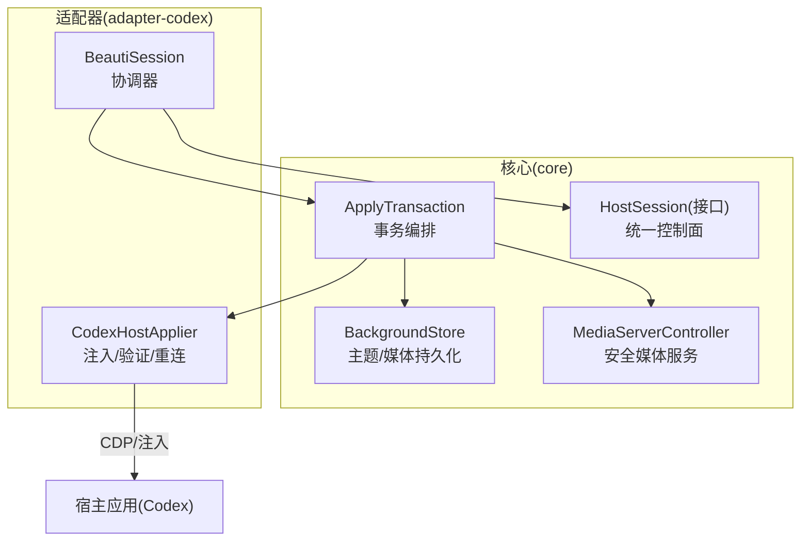
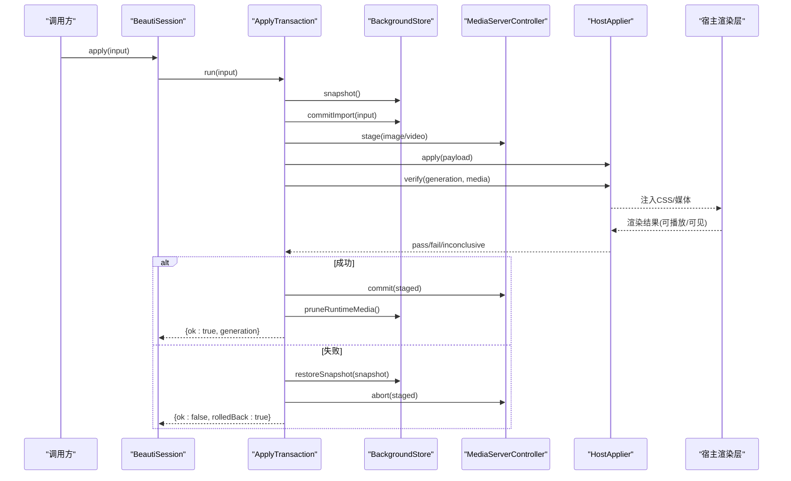
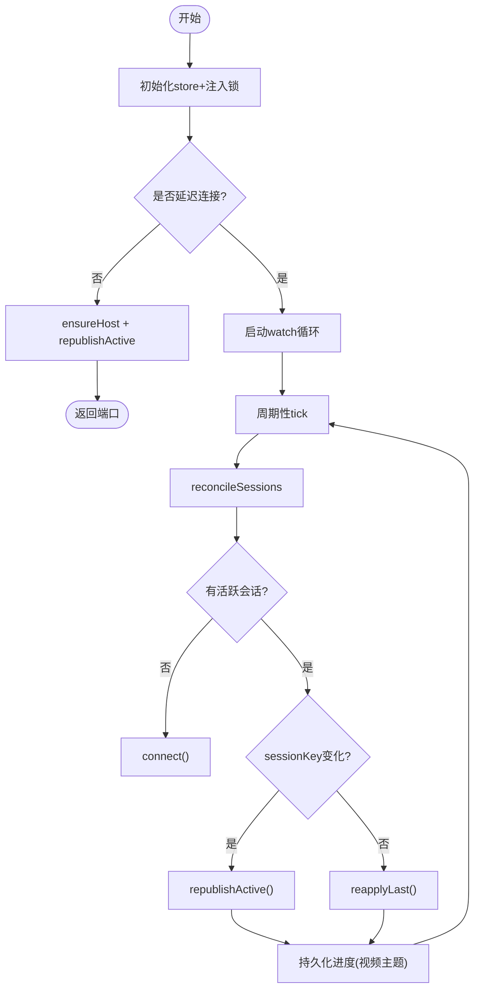
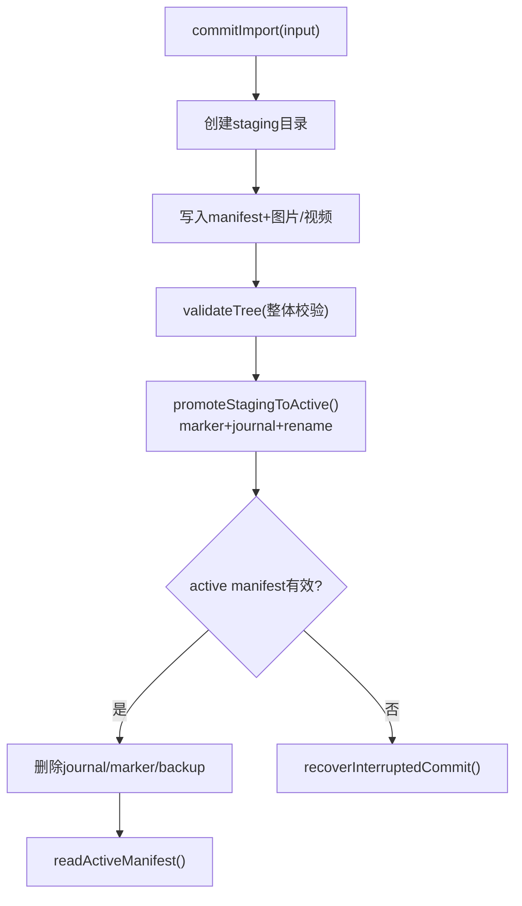
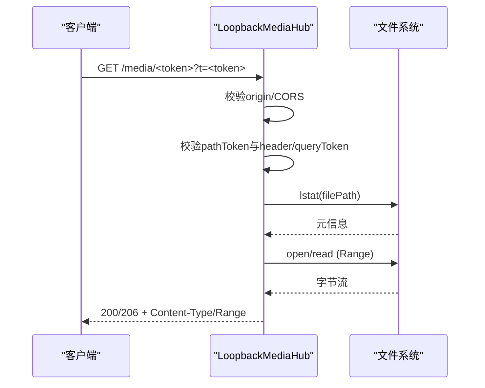
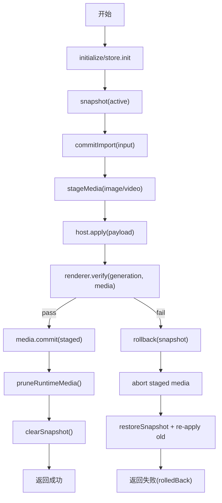
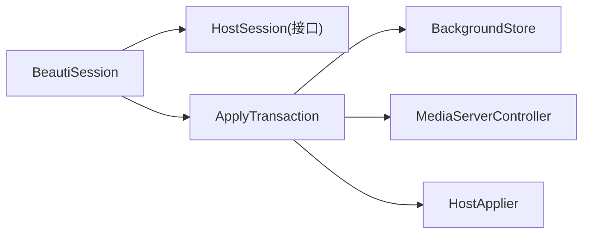

# 核心组件设计

<cite>
**本文引用的文件**
- [packages/core/src/background-store.ts](file://packages/core/src/background-store.ts)
- [packages/core/src/media-server.ts](file://packages/core/src/media-server.ts)
- [packages/core/src/apply-transaction.ts](file://packages/core/src/apply-transaction.ts)
- [packages/core/src/host-session.ts](file://packages/core/src/host-session.ts)
- [packages/adapter-codex/src/session.ts](file://packages/adapter-codex/src/session.ts)
- [packages/adapter-codex/src/host-applier.ts](file://packages/adapter-codex/src/host-applier.ts)
- [docs/apply-transaction.md](file://docs/apply-transaction.md)
</cite>

## 目录
1. [简介](#简介)
2. [项目结构](#项目结构)
3. [核心组件](#核心组件)
4. [架构总览](#架构总览)
5. [详细组件分析](#详细组件分析)
6. [依赖关系分析](#依赖关系分析)
7. [性能考量](#性能考量)
8. [故障排查指南](#故障排查指南)
9. [结论](#结论)

## 简介
本设计文档聚焦 beautiCode 的核心组件与协作机制，重点说明：
- BeautiSession 协调器如何管理会话生命周期、状态同步与宿主连接。
- HostSession 抽象接口如何统一不同宿主应用的交互面。
- BackgroundStore 主题管理系统的数据持久化、版本控制与回滚机制。
- MediaServer 的安全媒体访问控制（令牌认证、路径校验、Range 请求）。
- ApplyTransaction 的原子性保证与错误恢复流程。
- 组件间调用关系与数据流向图，帮助读者理解整体工作流。

## 项目结构
beautiCode 将“核心能力”与“宿主适配”解耦：
- core 包提供通用能力：BackgroundStore（主题与媒体存储）、MediaServer（安全媒体服务）、ApplyTransaction（事务编排）、HostSession（统一接口）。
- adapter-codex 包实现具体宿主（Codex）的注入、CDP 通信、渲染层验证等。
- docs 提供事务设计与约束说明。



图表来源
- [packages/core/src/background-store.ts:123-151](file://packages/core/src/background-store.ts#L123-L151)
- [packages/core/src/media-server.ts:148-167](file://packages/core/src/media-server.ts#L148-L167)
- [packages/core/src/apply-transaction.ts:103-121](file://packages/core/src/apply-transaction.ts#L103-L121)
- [packages/core/src/host-session.ts:27-47](file://packages/core/src/host-session.ts#L27-L47)
- [packages/adapter-codex/src/session.ts:56-136](file://packages/adapter-codex/src/session.ts#L56-L136)
- [packages/adapter-codex/src/host-applier.ts:743-782](file://packages/adapter-codex/src/host-applier.ts#L743-L782)

章节来源
- [packages/core/src/background-store.ts:123-151](file://packages/core/src/background-store.ts#L123-L151)
- [packages/core/src/media-server.ts:148-167](file://packages/core/src/media-server.ts#L148-L167)
- [packages/core/src/apply-transaction.ts:103-121](file://packages/core/src/apply-transaction.ts#L103-L121)
- [packages/core/src/host-session.ts:27-47](file://packages/core/src/host-session.ts#L27-L47)
- [packages/adapter-codex/src/session.ts:56-136](file://packages/adapter-codex/src/session.ts#L56-L136)
- [packages/adapter-codex/src/host-applier.ts:743-782](file://packages/adapter-codex/src/host-applier.ts#L743-L782)

## 核心组件
- BeautiSession：长生命周期协调器，负责启动/停止、CDP 发现与连接、主题应用、状态同步、watch 循环与自愈。
- BackgroundStore：主题与媒体数据的持久化、版本化、原子提交、快照与回滚、运行时视频隔离与清理。
- MediaServerController：本地回环媒体服务器，提供带令牌的受控访问、范围请求、CORS、身份漂移检测。
- ApplyTransaction：编排“快照→磁盘提交→媒体预取→宿主注入→渲染验证→最终化/回滚”的原子事务。
- HostSession：统一控制面接口，屏蔽不同宿主差异，供托盘/上层调度。

章节来源
- [packages/adapter-codex/src/session.ts:56-136](file://packages/adapter-codex/src/session.ts#L56-L136)
- [packages/core/src/background-store.ts:123-151](file://packages/core/src/background-store.ts#L123-L151)
- [packages/core/src/media-server.ts:148-167](file://packages/core/src/media-server.ts#L148-L167)
- [packages/core/src/apply-transaction.ts:103-121](file://packages/core/src/apply-transaction.ts#L103-L121)
- [packages/core/src/host-session.ts:27-47](file://packages/core/src/host-session.ts#L27-L47)

## 架构总览
BeautiSession 作为协调器，串联 BackgroundStore、MediaServerController、HostApplier（通过 HostSession 抽象），完成一次背景变更从用户输入到宿主渲染可见的全链路。



图表来源
- [packages/adapter-codex/src/session.ts:275-332](file://packages/adapter-codex/src/session.ts#L275-L332)
- [packages/core/src/apply-transaction.ts:127-294](file://packages/core/src/apply-transaction.ts#L127-L294)
- [packages/core/src/background-store.ts:564-678](file://packages/core/src/background-store.ts#L564-L678)
- [packages/core/src/media-server.ts:660-731](file://packages/core/src/media-server.ts#L660-L731)
- [packages/adapter-codex/src/host-applier.ts:743-782](file://packages/adapter-codex/src/host-applier.ts#L743-L782)

## 详细组件分析

### BeautiSession 协调器
职责
- 会话生命周期：start/stop、守护 watch 循环、后台启动与连接。
- 宿主连接：自动发现 CDP、连接/重连、会话 reconcile、身份变化处理。
- 主题应用：封装 ApplyTransaction，维护 fish/muted/tone 等进程级偏好，并在成功后重放至宿主。
- 状态同步：reapply 时仅重新发布当前 active 背景并验证；watch 周期内对缺失/不健康 runtime 进行自愈。

关键流程
- start：初始化 store、获取注入锁、可选延迟连接宿主、启动 watch。
- ensureHost：串行化连接链，处理 CDP 重启导致的身份变化，重建 host。
- apply/reapply：构造 ApplyTransaction 执行，成功后记录 lastPublishSessionKey/detachedVideoKey，重设 activeThemeId，必要时设置 fish/muted/tone。
- watchTick：周期性 reconcile/connect，按 sessionKey 决定是否全量 republishActive 或仅 reapplyLast 修复。



图表来源
- [packages/adapter-codex/src/session.ts:167-196](file://packages/adapter-codex/src/session.ts#L167-L196)
- [packages/adapter-codex/src/session.ts:202-273](file://packages/adapter-codex/src/session.ts#L202-L273)
- [packages/adapter-codex/src/session.ts:717-787](file://packages/adapter-codex/src/session.ts#L717-L787)

章节来源
- [packages/adapter-codex/src/session.ts:56-136](file://packages/adapter-codex/src/session.ts#L56-L136)
- [packages/adapter-codex/src/session.ts:167-196](file://packages/adapter-codex/src/session.ts#L167-L196)
- [packages/adapter-codex/src/session.ts:202-273](file://packages/adapter-codex/src/session.ts#L202-L273)
- [packages/adapter-codex/src/session.ts:275-332](file://packages/adapter-codex/src/session.ts#L275-L332)
- [packages/adapter-codex/src/session.ts:717-787](file://packages/adapter-codex/src/session.ts#L717-L787)

### HostSession 抽象接口
设计目标
- 为托盘/上层提供最小且稳定的控制面：应用背景、保存/加载主题、查询状态、设置 fish/muted/tone。
- 屏蔽不同宿主（如 Codex、DSH）的差异，使协调器无需关心具体注入细节。

契约要点
- 描述符 descriptor、端口 cdpPort、就绪 isHostReady、忙 isBusy。
- 生命周期 start/stop、状态 status。
- 主题操作 apply/reapply/saveCurrentTheme/listSavedThemes/deleteSavedTheme/useSavedTheme。
- 行为开关 setFishMode/setMuted/setBackgroundTone。

```mermaid
classDiagram
class HostSession {
+descriptor
+cdpPort
+isBusy
+isOpen
+isHostReady
+start() Promise~{port}~
+stop() Promise~void~
+status() Promise~HostSessionStatus~
+apply(input) Promise~ApplyResult~
+reapply() Promise~ApplyResult~
+saveCurrentTheme(name) Promise~SavedThemeInfo~
+listSavedThemes() Promise~SavedThemeInfo[]~
+deleteSavedTheme(themeId) Promise~boolean~
+useSavedTheme(themeId) Promise~ApplyResult~
+setFishMode(enabled) Promise~{ok : boolean}~
+setMuted(muted) Promise~{ok : boolean}~
+setBackgroundTone(tone) Promise~{ok : boolean}~
}
```

图表来源
- [packages/core/src/host-session.ts:27-47](file://packages/core/src/host-session.ts#L27-L47)

章节来源
- [packages/core/src/host-session.ts:27-47](file://packages/core/src/host-session.ts#L27-L47)

### BackgroundStore 主题管理系统
功能要点
- 数据布局：active/snapshots/staging/runtime-media 等目录，manifest JSON 描述当前背景。
- 版本控制：generation 递增，commitImport 在 staging 构建完整树后原子 promote 到 active。
- 原子提交：使用 commit marker + journal 记录阶段，异常中断后可恢复；读取端遇到新鲜 marker 拒绝加载。
- 快照与回滚：snapshot 捕获 manifest 与受管媒体；restoreSnapshot 生成新 generation 并 validate 后 promote。
- 运行时视频隔离：prepareRuntimeVideo 为视频创建 session 独立副本，避免 active 目录被占用导致 EPERM。
- 资源清理：pruneRuntimeMedia 定期清理过期 session 与缓存。



图表来源
- [packages/core/src/background-store.ts:564-678](file://packages/core/src/background-store.ts#L564-L678)
- [packages/core/src/background-store.ts:757-798](file://packages/core/src/background-store.ts#L757-L798)
- [packages/core/src/background-store.ts:211-270](file://packages/core/src/background-store.ts#L211-L270)

章节来源
- [packages/core/src/background-store.ts:123-151](file://packages/core/src/background-store.ts#L123-L151)
- [packages/core/src/background-store.ts:211-270](file://packages/core/src/background-store.ts#L211-L270)
- [packages/core/src/background-store.ts:564-678](file://packages/core/src/background-store.ts#L564-L678)
- [packages/core/src/background-store.ts:757-798](file://packages/core/src/background-store.ts#L757-L798)

### MediaServer 安全媒体访问控制
安全策略
- 绑定 127.0.0.1，仅接受 GET/HEAD/OPTIONS。
- 双令牌认证：路径 token（/media/<token>）必须匹配请求头或 ?t= 查询参数。
- CORS 白名单：支持 app://* 前缀与精确 origin。
- 路径与内容校验：lstat 防符号链接；stat 校验 size/dev/inode/mtime/ctime；fast/full 模式哈希校验。
- Range 请求：解析 bytes= 范围，非法或不满足返回 416；支持 HEAD 探测。
- 传输安全：管道流式传输，AbortController 管理取消，关闭时销毁 socket 与连接。



图表来源
- [packages/core/src/media-server.ts:406-590](file://packages/core/src/media-server.ts#L406-L590)
- [packages/core/src/media-server.ts:66-94](file://packages/core/src/media-server.ts#L66-L94)

章节来源
- [packages/core/src/media-server.ts:148-167](file://packages/core/src/media-server.ts#L148-L167)
- [packages/core/src/media-server.ts:406-590](file://packages/core/src/media-server.ts#L406-L590)

### ApplyTransaction 原子性与错误恢复
事务步骤
- initialize → snapshot → commitImport → stageMedia → buildPayload → host.apply → renderer.verify。
- 若 verify 失败：rollback（恢复快照、中止 staged media、重新应用旧媒体），并返回 rolledBack=true。
- 若 verify 成功：media.commit → pruneRuntimeMedia → clearSnapshot → finalize。
- 冷启动重试：针对首帧/Range 探针失败的 video 场景，允许一次重试 apply+verify。



图表来源
- [packages/core/src/apply-transaction.ts:127-294](file://packages/core/src/apply-transaction.ts#L127-L294)
- [docs/apply-transaction.md:7-19](file://docs/apply-transaction.md#L7-L19)

章节来源
- [packages/core/src/apply-transaction.ts:127-294](file://packages/core/src/apply-transaction.ts#L127-L294)
- [docs/apply-transaction.md:7-19](file://docs/apply-transaction.md#L7-L19)

## 依赖关系分析
- BeautiSession 依赖 BackgroundStore（主题/媒体持久化）、MediaServerController（安全媒体）、HostApplier（宿主注入/验证）。
- ApplyTransaction 组合 BackgroundStore 与 MediaServerController，并通过 HostApplier 与宿主交互。
- HostSession 作为接口，由 BeautiSession 实现，向上屏蔽宿主差异。



图表来源
- [packages/adapter-codex/src/session.ts:56-136](file://packages/adapter-codex/src/session.ts#L56-L136)
- [packages/core/src/apply-transaction.ts:103-121](file://packages/core/src/apply-transaction.ts#L103-L121)
- [packages/core/src/host-session.ts:27-47](file://packages/core/src/host-session.ts#L27-L47)

章节来源
- [packages/adapter-codex/src/session.ts:56-136](file://packages/adapter-codex/src/session.ts#L56-L136)
- [packages/core/src/apply-transaction.ts:103-121](file://packages/core/src/apply-transaction.ts#L103-L121)
- [packages/core/src/host-session.ts:27-47](file://packages/core/src/host-session.ts#L27-L47)

## 性能考量
- 视频冷启动预热：prepareRuntimeVideo 对本地视频进行 warmVideoFileReads，减少首帧 Range 探针等待。
- 批量写锁：BackgroundStore 使用 writeChain + AsyncLocalStorage 序列化写入，避免并发交错。
- 媒体复用：MediaServerController 对相同资产复用 handle，减少重复 stage。
- 范围请求：MediaServer 支持 Range，降低大文件传输成本。
- Watch 自愈：BeautiSession 的 watchTick 仅在 sessionKey 变化时全量 republish，否则仅修复缺失 runtime，减少不必要注入。

[本节为通用指导，不直接分析具体文件]

## 故障排查指南
常见问题与定位
- 宿主未就绪：检查 ensureHost 是否找到 CDP 端口，日志中是否有“Discovering loopback Codex CDP…”提示。
- 渲染验证失败：查看 verify 返回的 reason，区分 hard fail 与 inconclusive；video 首帧失败可能触发一次重试。
- 媒体不可访问：确认 MediaServer 是否绑定 127.0.0.1，请求是否携带正确 token（header 或 ?t=）。
- 回滚发生：关注 ApplyTransaction 返回 rolledBack=true，检查 snapshot 恢复与旧媒体 re-apply 是否成功。
- 进程退出卡住：MediaServer close 会主动销毁 socket 并超时兜底，确保无悬挂连接。

章节来源
- [packages/adapter-codex/src/session.ts:202-273](file://packages/adapter-codex/src/session.ts#L202-L273)
- [packages/core/src/apply-transaction.ts:212-245](file://packages/core/src/apply-transaction.ts#L212-L245)
- [packages/core/src/media-server.ts:406-590](file://packages/core/src/media-server.ts#L406-L590)
- [docs/apply-transaction.md:62-88](file://docs/apply-transaction.md#L62-L88)

## 结论
beautiCode 通过清晰的职责划分与强一致的事务模型，实现了跨宿主的背景主题管理：
- BeautiSession 提供稳定、可观测的协调面，屏蔽底层复杂性。
- BackgroundStore 以版本化与原子提交保障数据一致性，并提供快照与回滚。
- MediaServer 以严格的安全策略保护媒体访问，支持高效 Range 传输。
- ApplyTransaction 将“磁盘成功≠用户可见成功”的原则贯穿始终，确保用户体验可靠。
- HostSession 抽象使多宿主接入成为可能，便于扩展与维护。

[本节为总结，不直接分析具体文件]