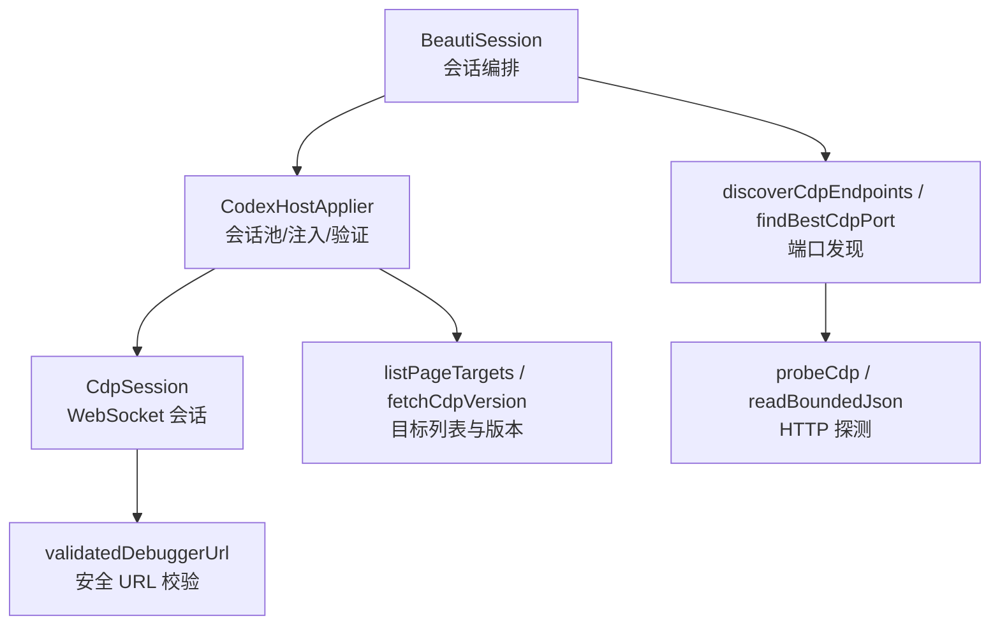
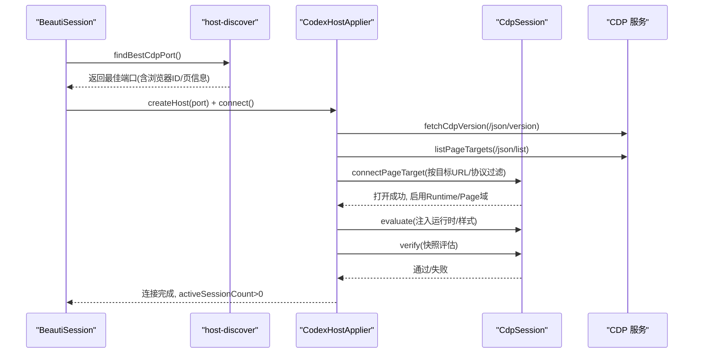
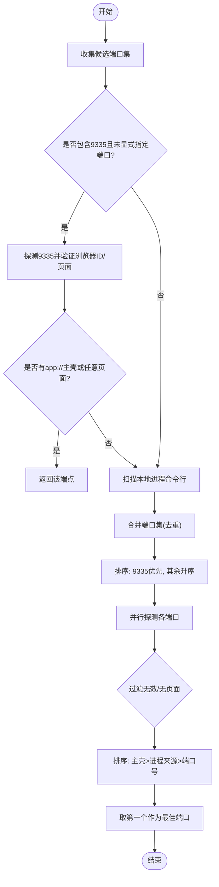
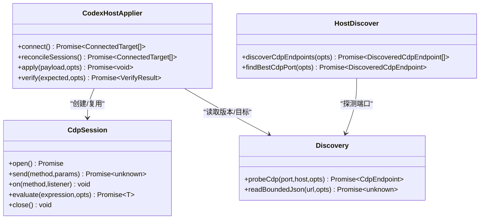
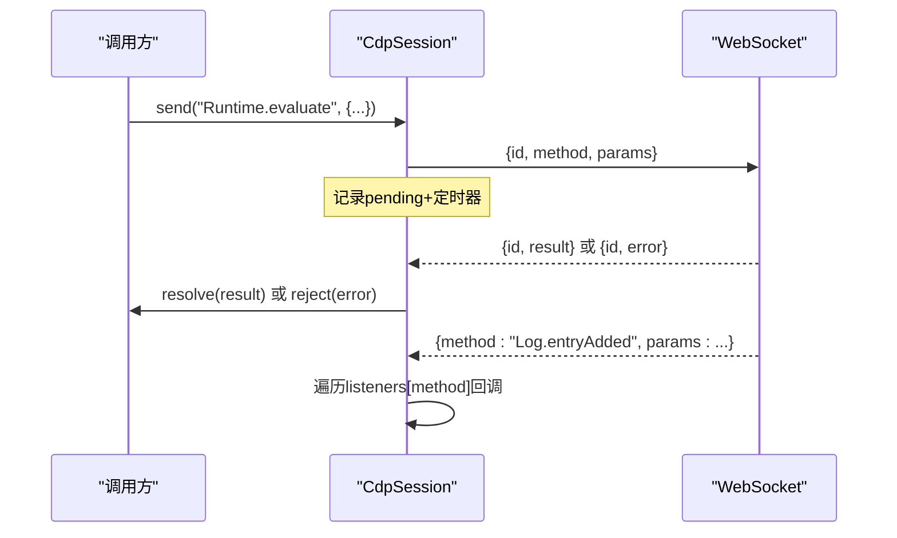
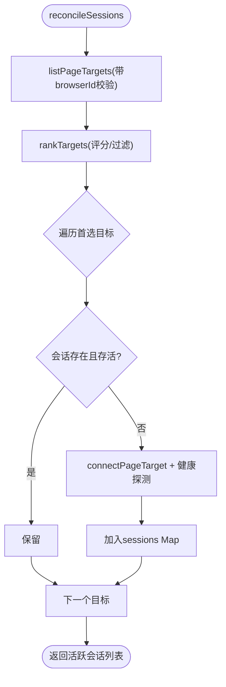
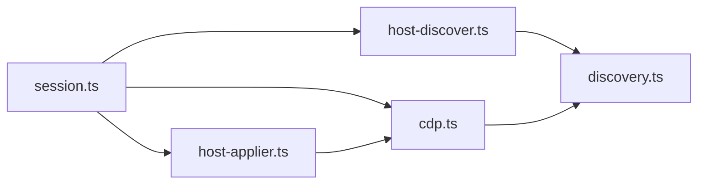

# CDP 通信机制

<cite>
**本文引用的文件**
- [cdp.ts](file://packages/adapter-codex/src/cdp.ts)
- [discovery.ts](file://packages/adapter-codex/src/discovery.ts)
- [host-discover.ts](file://packages/adapter-codex/src/host-discover.ts)
- [session.ts](file://packages/adapter-codex/src/session.ts)
- [host-applier.ts](file://packages/adapter-codex/src/host-applier.ts)
- [codex-cdp-setup.md](file://docs/codex-cdp-setup.md)
</cite>

## 目录
1. [简介](#简介)
2. [项目结构](#项目结构)
3. [核心组件](#核心组件)
4. [架构总览](#架构总览)
5. [详细组件分析](#详细组件分析)
6. [依赖关系分析](#依赖关系分析)
7. [性能与超时](#性能与超时)
8. [故障排查](#故障排查)
9. [结论](#结论)
10. [附录：使用示例路径](#附录使用示例路径)

## 简介
本文件系统性说明本项目中基于 Chrome DevTools Protocol（CDP）的通信机制，覆盖连接建立、端口发现、目标探测、会话管理、消息协议（请求-响应与事件）、错误处理、连接复用与重连策略、调试端点发现与最佳端口选择算法，以及超时与故障恢复。文档同时给出在仓库中的具体代码位置，便于对照实现细节。

## 项目结构
围绕 CDP 的关键代码集中在 packages/adapter-codex 下，分为四层：
- 发现层：负责本地回环地址上的 CDP 端口探测、进程命令行解析、候选端口排序与“最佳端口”选择。
- 协议层：封装 CDP HTTP 元数据读取、WebSocket 会话、请求-响应与事件分发、URL 校验与安全约束。
- 适配层：维护多页面会话池、目标优先级排序、注入与验证、偏好设置（静音、主题色、摸鱼模式）。
- 会话编排层：对外暴露统一接口，协调发现、连接、应用、重连、轮询与健康检查。

图表来源
- [session.ts:167-273](file://packages/adapter-codex/src/session.ts#L167-L273)
- [host-applier.ts:115-198](file://packages/adapter-codex/src/host-applier.ts#L115-L198)
- [cdp.ts:215-408](file://packages/adapter-codex/src/cdp.ts#L215-L408)
- [host-discover.ts:242-341](file://packages/adapter-codex/src/host-discover.ts#L242-L341)
- [discovery.ts:11-103](file://packages/adapter-codex/src/discovery.ts#L11-L103)

章节来源
- [session.ts:167-273](file://packages/adapter-codex/src/session.ts#L167-L273)
- [host-applier.ts:115-198](file://packages/adapter-codex/src/host-applier.ts#L115-L198)
- [cdp.ts:215-408](file://packages/adapter-codex/src/cdp.ts#L215-L408)
- [host-discover.ts:242-341](file://packages/adapter-codex/src/host-discover.ts#L242-L341)
- [discovery.ts:11-103](file://packages/adapter-codex/src/discovery.ts#L11-L103)

## 核心组件
- CdpError / CdpIdentityMismatchError：统一的 CDP 错误类型，区分普通错误与浏览器身份变更导致的重连场景。
- CdpSession：最小化 CDP WebSocket 会话，支持 open/send/on/close、命令超时、消息大小限制、事件监听。
- CodexHostApplier：维护多个 CDP 页面会话，负责目标筛选、注入、验证、偏好同步与重放。
- BeautiSession：对外会话入口，负责自动发现、连接编排、重试、轮询与状态发布。
- discovery/host-discover：端口发现、进程扫描、候选端口排序、最佳端口选择。

章节来源
- [cdp.ts:9-23](file://packages/adapter-codex/src/cdp.ts#L9-L23)
- [cdp.ts:215-408](file://packages/adapter-codex/src/cdp.ts#L215-L408)
- [host-applier.ts:50-198](file://packages/adapter-codex/src/host-applier.ts#L50-L198)
- [session.ts:167-273](file://packages/adapter-codex/src/session.ts#L167-L273)
- [host-discover.ts:12-54](file://packages/adapter-codex/src/host-discover.ts#L12-L54)

## 架构总览
整体流程从“发现可用 CDP 端口”开始，到“建立 WebSocket 会话”，再到“选择并连接页面目标”，最后“注入与验证”。

图表来源
- [session.ts:202-273](file://packages/adapter-codex/src/session.ts#L202-L273)
- [host-applier.ts:115-198](file://packages/adapter-codex/src/host-applier.ts#L115-L198)
- [cdp.ts:215-284](file://packages/adapter-codex/src/cdp.ts#L215-L284)
- [host-discover.ts:242-341](file://packages/adapter-codex/src/host-discover.ts#L242-L341)

## 详细组件分析

### 端口发现与最佳端口选择
- 候选端口集合：默认包含常见端口（如 9335、9222 等），仅对回环地址探测。
- Windows 进程扫描：通过 PowerShell 获取进程命令行，解析 --remote-debugging-port 与 --remote-debugging-address，仅接受显式回环地址。
- 快速路径：优先尝试 9335；若存在 app:// 主壳页面则直接返回。
- 排序规则：优先有主壳页面的端点，其次来自进程证据的端点，再按端口号升序。
- 安全约束：禁止非回环主机；JSON 响应体大小上限保护；目标数量上限保护。

图表来源
- [host-discover.ts:12-54](file://packages/adapter-codex/src/host-discover.ts#L12-L54)
- [host-discover.ts:165-236](file://packages/adapter-codex/src/host-discover.ts#L165-L236)
- [host-discover.ts:242-341](file://packages/adapter-codex/src/host-discover.ts#L242-L341)

章节来源
- [host-discover.ts:12-54](file://packages/adapter-codex/src/host-discover.ts#L12-L54)
- [host-discover.ts:165-236](file://packages/adapter-codex/src/host-discover.ts#L165-L236)
- [host-discover.ts:242-341](file://packages/adapter-codex/src/host-discover.ts#L242-L341)
- [discovery.ts:11-103](file://packages/adapter-codex/src/discovery.ts#L11-L103)

### 连接建立与目标探测
- 安全校验：所有 CDP WebSocket URL 必须为 ws:// 且主机为回环、端口一致、路径形如 /devtools/page/{id} 或 /devtools/browser/{id}。
- 目标过滤：仅允许 app:// 渲染器或测试用的回环 http；排除 overlay 类页面。
- 浏览器身份：从 /json/version 提取 browserId，并在后续目标列表中校验一致性，防止连接到重启后的新实例。
- 连接步骤：fetchCdpVersion -> listPageTargets -> 过滤与排序 -> connectPageTarget -> 启用 Runtime/Page 域 -> 可选健康探测（document.body）。

图表来源
- [cdp.ts:215-408](file://packages/adapter-codex/src/cdp.ts#L215-L408)
- [host-applier.ts:115-198](file://packages/adapter-codex/src/host-applier.ts#L115-L198)
- [discovery.ts:11-103](file://packages/adapter-codex/src/discovery.ts#L11-L103)
- [host-discover.ts:242-341](file://packages/adapter-codex/src/host-discover.ts#L242-L341)

章节来源
- [cdp.ts:49-130](file://packages/adapter-codex/src/cdp.ts#L49-L130)
- [cdp.ts:158-197](file://packages/adapter-codex/src/cdp.ts#L158-L197)
- [cdp.ts:215-284](file://packages/adapter-codex/src/cdp.ts#L215-L284)
- [host-applier.ts:115-198](file://packages/adapter-codex/src/host-applier.ts#L115-L198)

### 消息传递协议：请求-响应与事件
- 请求-响应：每个 send 生成唯一 id，等待对应响应或错误；支持命令超时；关闭时清理待处理队列。
- 事件：无 id 的消息视为事件，按 method 分发给已注册监听器。
- 安全：限制单条消息最大字节数，超限即关闭连接；解析失败也关闭连接。
- 典型用法：开启 Runtime/Page 域、执行脚本 evaluate、触发 Page.bringToFront。

图表来源
- [cdp.ts:286-354](file://packages/adapter-codex/src/cdp.ts#L286-L354)

章节来源
- [cdp.ts:286-354](file://packages/adapter-codex/src/cdp.ts#L286-L354)

### 连接池管理与连接复用
- 会话池：CodexHostApplier 内部以 Map<target.id, CdpSession> 维护活跃会话。
- 生命周期：reconcileSessions 定期刷新目标列表，关闭失效会话，按需新建会话；连接成功后进行轻量健康探测。
- 注入与验证：同一代 payload 的健康阶段会跳过重复注入，仅重新应用偏好（静音、主题色、摸鱼模式）。
- 重连策略：遇到 CdpIdentityMismatchError 或会话关闭错误，清空旧会话并重建；connect() 带超时与轮询。

图表来源
- [host-applier.ts:140-198](file://packages/adapter-codex/src/host-applier.ts#L140-L198)

章节来源
- [host-applier.ts:140-198](file://packages/adapter-codex/src/host-applier.ts#L140-L198)
- [host-applier.ts:243-350](file://packages/adapter-codex/src/host-applier.ts#L243-L350)

### 调试端点发现与最佳端口选择算法
- 快速命中：默认优先探测 9335，若满足“有主壳页面”条件立即返回。
- 进程证据：Windows 上扫描进程命令行，解析出带回环地址的调试端口，作为高可信证据。
- 排序策略：主壳页面数量降序 > 进程来源优先 > 端口号升序。
- 安全边界：仅回环地址；JSON 响应体大小限制；目标数量上限。

章节来源
- [host-discover.ts:12-54](file://packages/adapter-codex/src/host-discover.ts#L12-L54)
- [host-discover.ts:165-236](file://packages/adapter-codex/src/host-discover.ts#L165-L236)
- [host-discover.ts:242-341](file://packages/adapter-codex/src/host-discover.ts#L242-L341)

### 超时、重连与故障恢复
- 连接超时：CdpSession.open 有 openTimeoutMs；send 有 commandTimeoutMs；readBoundedJson 有 timeoutMs。
- 目标等待：CodexHostApplier.connect 在 connectDeadlineMs 内轮询直到至少一个页面会话就绪。
- 身份变更：当浏览器身份变化（例如宿主重启），抛出 CdpIdentityMismatchError，上层捕获后关闭旧会话并重建。
- 会话损坏：注入过程中若检测到会话关闭错误，清空并重建会话后重试（最多两次）。
- 健康验证：verify 在 deadline 内多次采样，区分结构性失败与暂时性不可判定，避免误判。

章节来源
- [cdp.ts:240-284](file://packages/adapter-codex/src/cdp.ts#L240-L284)
- [cdp.ts:337-354](file://packages/adapter-codex/src/cdp.ts#L337-L354)
- [discovery.ts:11-68](file://packages/adapter-codex/src/discovery.ts#L11-L68)
- [host-applier.ts:115-138](file://packages/adapter-codex/src/host-applier.ts#L115-L138)
- [host-applier.ts:258-286](file://packages/adapter-codex/src/host-applier.ts#L258-L286)
- [host-applier.ts:648-768](file://packages/adapter-codex/src/host-applier.ts#L648-L768)
- [session.ts:248-264](file://packages/adapter-codex/src/session.ts#L248-L264)

## 依赖关系分析
- session.ts 依赖 host-discover 做端口发现，依赖 host-applier 做会话管理，依赖 cdp.ts 的错误类型。
- host-applier.ts 依赖 cdp.ts 的 CdpSession、目标列表与版本读取，依赖 readiness 做注入后验证。
- discovery.ts 提供安全的 JSON 读取与端口探测能力，被 host-discover 和 cdp.ts 共用。
- 安全约束贯穿全链路：仅回环地址、严格 URL 形状、大小限制、目标数量上限。

图表来源
- [session.ts:167-273](file://packages/adapter-codex/src/session.ts#L167-L273)
- [host-applier.ts:115-198](file://packages/adapter-codex/src/host-applier.ts#L115-L198)
- [host-discover.ts:242-341](file://packages/adapter-codex/src/host-discover.ts#L242-L341)
- [discovery.ts:11-103](file://packages/adapter-codex/src/discovery.ts#L11-L103)

章节来源
- [session.ts:167-273](file://packages/adapter-codex/src/session.ts#L167-L273)
- [host-applier.ts:115-198](file://packages/adapter-codex/src/host-applier.ts#L115-L198)
- [host-discover.ts:242-341](file://packages/adapter-codex/src/host-discover.ts#L242-L341)
- [discovery.ts:11-103](file://packages/adapter-codex/src/discovery.ts#L11-L103)

## 性能与超时
- 并发探测：discoverCdpEndpoints 对候选端口并行探测，缩短冷启动时间。
- 快速路径：优先 9335，减少不必要的扫描。
- 资源保护：JSON 响应体大小上限、目标数量上限、消息大小上限，避免恶意或异常数据导致内存压力。
- 超时配置：
  - readBoundedJson：默认 3s
  - probeCdp：可配置超时
  - CdpSession.open：默认 5s
  - CdpSession.send：默认 10s
  - CodexHostApplier.connect：默认 15s
  - verify：外部传入 deadline，内部轮询 pollMs

章节来源
- [discovery.ts:11-68](file://packages/adapter-codex/src/discovery.ts#L11-L68)
- [cdp.ts:240-284](file://packages/adapter-codex/src/cdp.ts#L240-L284)
- [cdp.ts:337-354](file://packages/adapter-codex/src/cdp.ts#L337-L354)
- [host-applier.ts:115-138](file://packages/adapter-codex/src/host-applier.ts#L115-L138)
- [host-applier.ts:648-768](file://packages/adapter-codex/src/host-applier.ts#L648-L768)

## 故障排查
- 无法发现 CDP 端口：确认宿主已启用 --remote-debugging-address=127.0.0.1；使用 discover/probe 命令验证；参考文档说明。
- 身份不匹配：宿主重启导致 browserId 变化，系统会自动关闭旧会话并重连；若持续失败，检查端口是否仍由同一宿主占用。
- 注入失败：检查目标是否为 app:// 主壳页面；确认 document.body 存在；查看 verify 失败原因（结构性失败需修复注入逻辑）。
- 超时：根据日志定位是哪个阶段超时（HTTP 探测、WebSocket 打开、命令发送、验证），调整相应超时参数或网络环境。
- 安全告警：若出现“拒绝非回环 URL”“响应体过大”“目标过多”等错误，说明触发了安全保护，应修正输入或宿主配置。

章节来源
- [codex-cdp-setup.md:1-53](file://docs/codex-cdp-setup.md#L1-L53)
- [session.ts:248-264](file://packages/adapter-codex/src/session.ts#L248-L264)
- [host-applier.ts:258-286](file://packages/adapter-codex/src/host-applier.ts#L258-L286)
- [host-applier.ts:648-768](file://packages/adapter-codex/src/host-applier.ts#L648-L768)

## 结论
本实现以“安全优先、健壮可靠”为原则，构建了完整的 CDP 通信机制：从端口发现、目标探测到会话管理、消息协议与错误恢复，均具备明确的安全边界与容错策略。通过连接池与复用、超时与重连、身份校验与回环约束，确保在宿主动态变化的环境下仍能稳定工作。

## 附录：使用示例路径
以下为仓库中可用于参考的具体代码片段路径（不包含代码内容）：
- 建立 CDP 连接与自动发现端口
  - [session.ts:167-273](file://packages/adapter-codex/src/session.ts#L167-L273)
  - [host-discover.ts:242-341](file://packages/adapter-codex/src/host-discover.ts#L242-L341)
- 发送命令与接收事件
  - [cdp.ts:286-354](file://packages/adapter-codex/src/cdp.ts#L286-L354)
- 连接复用与会话管理
  - [host-applier.ts:140-198](file://packages/adapter-codex/src/host-applier.ts#L140-L198)
  - [host-applier.ts:243-350](file://packages/adapter-codex/src/host-applier.ts#L243-L350)
- 超时与重连
  - [cdp.ts:240-284](file://packages/adapter-codex/src/cdp.ts#L240-L284)
  - [host-applier.ts:115-138](file://packages/adapter-codex/src/host-applier.ts#L115-L138)
  - [session.ts:248-264](file://packages/adapter-codex/src/session.ts#L248-L264)
- 调试端点发现与最佳端口选择
  - [host-discover.ts:12-54](file://packages/adapter-codex/src/host-discover.ts#L12-L54)
  - [host-discover.ts:165-236](file://packages/adapter-codex/src/host-discover.ts#L165-L236)
  - [host-discover.ts:242-341](file://packages/adapter-codex/src/host-discover.ts#L242-L341)
- 安全与错误处理
  - [cdp.ts:49-130](file://packages/adapter-codex/src/cdp.ts#L49-L130)
  - [discovery.ts:11-68](file://packages/adapter-codex/src/discovery.ts#L11-L68)
- 用户指南与快速路径
  - [codex-cdp-setup.md:1-53](file://docs/codex-cdp-setup.md#L1-L53)