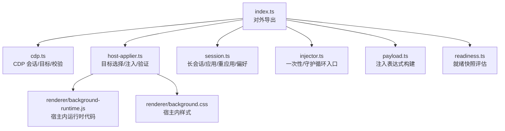
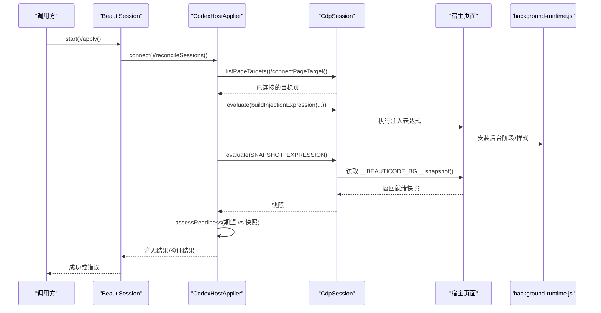
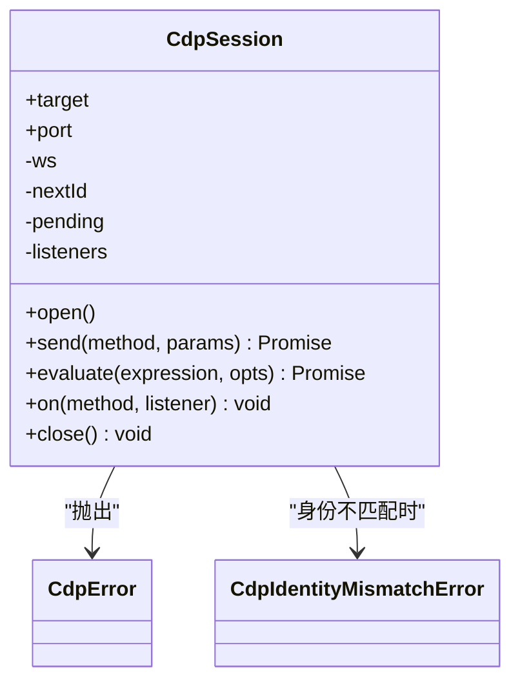
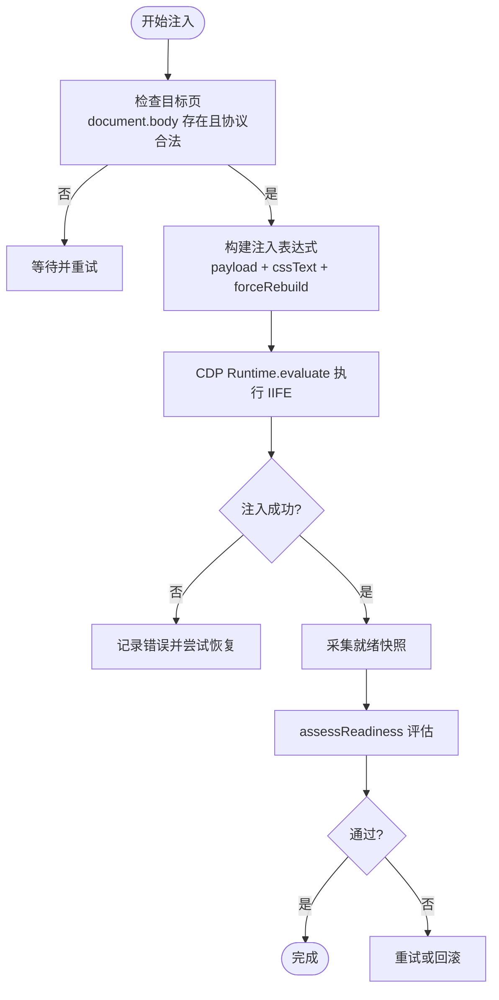
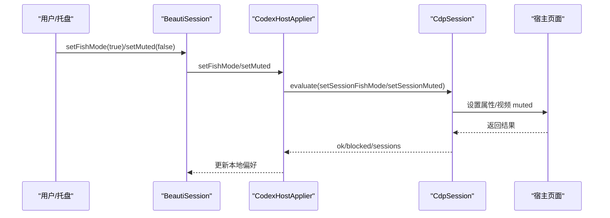
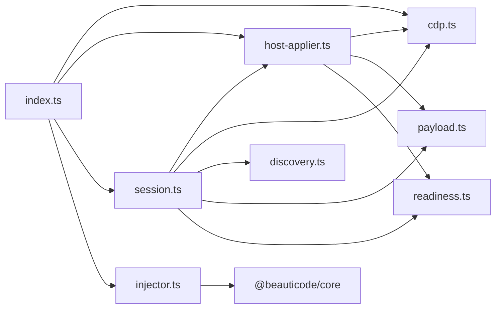

# Codex Desktop 适配器

<cite>
**本文引用的文件**
- [packages/adapter-codex/src/index.ts](file://packages/adapter-codex/src/index.ts)
- [packages/adapter-codex/src/cdp.ts](file://packages/adapter-codex/src/cdp.ts)
- [packages/adapter-codex/src/discovery.ts](file://packages/adapter-codex/src/discovery.ts)
- [packages/adapter-codex/src/host-applier.ts](file://packages/adapter-codex/src/host-applier.ts)
- [packages/adapter-codex/src/session.ts](file://packages/adapter-codex/src/session.ts)
- [packages/adapter-codex/src/injector.ts](file://packages/adapter-codex/src/injector.ts)
- [packages/adapter-codex/src/payload.ts](file://packages/adapter-codex/src/payload.ts)
- [packages/adapter-codex/src/readiness.ts](file://packages/adapter-codex/src/readiness.ts)
- [packages/adapter-codex/src/renderer/background-runtime.js](file://packages/adapter-codex/src/renderer/background-runtime.js)
- [packages/adapter-codex/src/renderer/background.css](file://packages/adapter-codex/src/renderer/background.css)
- [docs/codex-cdp-setup.md](file://docs/codex-cdp-setup.md)
- [docs/host-adapter.md](file://docs/host-adapter.md)
</cite>

## 目录
1. [简介](#简介)
2. [项目结构](#项目结构)
3. [核心组件](#核心组件)
4. [架构总览](#架构总览)
5. [详细组件分析](#详细组件分析)
6. [依赖关系分析](#依赖关系分析)
7. [性能考虑](#性能考虑)
8. [故障排查指南](#故障排查指南)
9. [结论](#结论)
10. [附录](#附录)

## 简介
本文件为 Codex Desktop 适配器的技术文档，聚焦基于 Chrome DevTools Protocol（CDP）的通信机制、代码注入与沙箱隔离、背景运行时行为（媒体播放控制、全屏模式、状态同步），以及与 Codex Desktop 的深度集成方案（进程间通信与资源共享）。同时提供调试方法与性能优化建议，帮助开发者稳定、安全地实现“后台舞台”式背景增强。

## 项目结构
适配器位于 packages/adapter-codex，采用分层组织：
- CDP 层：连接、目标发现、会话管理、消息收发与事件监听
- Host Applier 层：目标页面选择、注入编排、验证与健康检查
- Session 层：长生命周期会话、应用/重应用、主题持久化、摸鱼/静音/色调等过程级偏好
- Payload/Readiness 层：注入表达式构建、渲染器就绪快照评估
- Renderer 资源：background-runtime.js 与 background.css 作为注入到宿主页面的脚本与样式
- 文档：CDP 安全规则与宿主契约

图表来源
- [packages/adapter-codex/src/index.ts:1-79](file://packages/adapter-codex/src/index.ts#L1-L79)
- [packages/adapter-codex/src/cdp.ts:1-408](file://packages/adapter-codex/src/cdp.ts#L1-L408)
- [packages/adapter-codex/src/host-applier.ts:1-800](file://packages/adapter-codex/src/host-applier.ts#L1-L800)
- [packages/adapter-codex/src/session.ts:1-800](file://packages/adapter-codex/src/session.ts#L1-L800)
- [packages/adapter-codex/src/injector.ts:1-125](file://packages/adapter-codex/src/injector.ts#L1-L125)
- [packages/adapter-codex/src/payload.ts:1-52](file://packages/adapter-codex/src/payload.ts#L1-L52)
- [packages/adapter-codex/src/readiness.ts:1-182](file://packages/adapter-codex/src/readiness.ts#L1-L182)

章节来源
- [packages/adapter-codex/src/index.ts:1-79](file://packages/adapter-codex/src/index.ts#L1-L79)
- [docs/codex-cdp-setup.md:1-106](file://docs/codex-cdp-setup.md#L1-L106)
- [docs/host-adapter.md:1-154](file://docs/host-adapter.md#L1-L154)

## 核心组件
- CdpSession：封装 WebSocket 连接、命令超时、事件分发、evaluate 执行；严格校验 loopback 地址与路径，拒绝非预期跳转
- CodexHostApplier：负责目标页筛选、建立会话、注入背景运行时、视频 blob 注入、偏好设置（摸鱼/静音/色调）、验证与自愈
- BeautiSession：长生命周期控制器，维护注入锁、媒体服务、存储、轮询与重连、主题进度持久化
- Injector：一次性 apply 与 watch 守护循环入口
- Payload/Readiness：构建注入表达式，采集并评估宿主页面就绪快照

章节来源
- [packages/adapter-codex/src/cdp.ts:1-408](file://packages/adapter-codex/src/cdp.ts#L1-L408)
- [packages/adapter-codex/src/host-applier.ts:1-800](file://packages/adapter-codex/src/host-applier.ts#L1-L800)
- [packages/adapter-codex/src/session.ts:1-800](file://packages/adapter-codex/src/session.ts#L1-L800)
- [packages/adapter-codex/src/injector.ts:1-125](file://packages/adapter-codex/src/injector.ts#L1-L125)
- [packages/adapter-codex/src/payload.ts:1-52](file://packages/adapter-codex/src/payload.ts#L1-L52)
- [packages/adapter-codex/src/readiness.ts:1-182](file://packages/adapter-codex/src/readiness.ts#L1-L182)

## 架构总览
适配器通过 CDP 仅连接本地回环地址，选择合法的 app:// 目标页，将背景运行时与样式注入到宿主页面中，形成独立的“后台舞台”。注入后通过快照评估确认媒体加载与布局健康，支持视频 blob 注入、静音/摸鱼/色调切换、以及保存主题的进度持久化。

图表来源
- [packages/adapter-codex/src/session.ts:167-196](file://packages/adapter-codex/src/session.ts#L167-L196)
- [packages/adapter-codex/src/host-applier.ts:115-138](file://packages/adapter-codex/src/host-applier.ts#L115-L138)
- [packages/adapter-codex/src/cdp.ts:215-399](file://packages/adapter-codex/src/cdp.ts#L215-L399)
- [packages/adapter-codex/src/payload.ts:28-51](file://packages/adapter-codex/src/payload.ts#L28-L51)
- [packages/adapter-codex/src/readiness.ts:25-149](file://packages/adapter-codex/src/readiness.ts#L25-L149)

## 详细组件分析

### CDP 通信机制（连接、消息、事件）
- 连接建立：从 /json/version 获取浏览器信息，校验 webSocketDebuggerUrl 仅允许 loopback 且路径符合 /devtools/page/{id}，标准化主机名为 127.0.0.1
- 会话管理：CdpSession 维护 nextId、pending 队列、超时、关闭清理；支持 Runtime.enable/Page.enable
- 消息传递：send(method, params) 发送命令，onMessage 解析响应或事件；evaluate(expression) 在宿主执行 JS 并返回值
- 事件监听：on(method, listener) 订阅 CDP 事件（如 Page、Runtime 事件）
- 安全边界：禁止跨域跳转、限制 JSON 大小、拒绝非 loopback、身份变更检测

图表来源
- [packages/adapter-codex/src/cdp.ts:9-23](file://packages/adapter-codex/src/cdp.ts#L9-L23)
- [packages/adapter-codex/src/cdp.ts:215-399](file://packages/adapter-codex/src/cdp.ts#L215-L399)

章节来源
- [packages/adapter-codex/src/cdp.ts:1-408](file://packages/adapter-codex/src/cdp.ts#L1-L408)
- [packages/adapter-codex/src/discovery.ts:1-104](file://packages/adapter-codex/src/discovery.ts#L1-L104)
- [docs/codex-cdp-setup.md:1-106](file://docs/codex-cdp-setup.md#L1-L106)

### 代码注入技术与沙箱隔离
- 注入时机：在目标页存在 document.body 且协议为 app:（或测试模式允许 loopback http）时进行；首次注入后若同 generation 且健康则跳过重复注入
- 执行环境：通过 CDP Runtime.evaluate 在宿主页面上下文执行 IIFE，参数包含 CSS、图片数据、视频配置、generation、imageUrl、forceRebuild
- 沙箱隔离：注入内容仅操作 #beauticode-bg-stage 及其后代，使用 pointer-events: none 避免捕获指针；不修改宿主 composer/sidebar 等关键 UI
- 资源注入：视频走 blob 注入路径，避免 CSP 阻止；图片可 base64 或 URL；CSS 由 background.css 提供
- 验证闭环：注入后通过 SNAPSHOT_EXPRESSION 采集快照，assessReadiness 判定是否 pass/fail/inconclusive

图表来源
- [packages/adapter-codex/src/host-applier.ts:140-198](file://packages/adapter-codex/src/host-applier.ts#L140-L198)
- [packages/adapter-codex/src/payload.ts:28-51](file://packages/adapter-codex/src/payload.ts#L28-L51)
- [packages/adapter-codex/src/readiness.ts:25-149](file://packages/adapter-codex/src/readiness.ts#L25-L149)

章节来源
- [packages/adapter-codex/src/host-applier.ts:243-350](file://packages/adapter-codex/src/host-applier.ts#L243-L350)
- [packages/adapter-codex/src/payload.ts:1-52](file://packages/adapter-codex/src/payload.ts#L1-L52)
- [packages/adapter-codex/src/readiness.ts:1-182](file://packages/adapter-codex/src/readiness.ts#L1-L182)
- [docs/host-adapter.md:18-67](file://docs/host-adapter.md#L18-L67)

### 背景运行时工作原理（媒体控制、全屏模式、状态同步）
- 媒体播放控制：支持 image/video；视频默认静音，可通过 setMuted 切换；blob 注入绕过 CSP；支持 seekTo 与 getPlaybackPosition
- 全屏模式（摸鱼）：通过 html[data-bc-fish] 切换，隐藏内容 chrome，保持 media 原生亮度；进入需有活跃背景；退出路径包括菜单/快捷键/清除背景/退出托盘
- 状态同步：每轮 watch tick 会 reapplyLast 修复缺失运行时；当 session 集合变化时重新发布当前媒体；保存主题时持续写入 videoPositionSec
- DOM/CSS 契约：仅允许对 #beauticode-bg-stage 定位/可见性/遮罩；必要时使 main-surface/aside 透明以透出背景；禁止重写宿主关键样式

图表来源
- [packages/adapter-codex/src/session.ts:355-457](file://packages/adapter-codex/src/session.ts#L355-L457)
- [packages/adapter-codex/src/host-applier.ts:362-579](file://packages/adapter-codex/src/host-applier.ts#L362-L579)
- [docs/host-adapter.md:97-145](file://docs/host-adapter.md#L97-L145)

章节来源
- [packages/adapter-codex/src/session.ts:167-800](file://packages/adapter-codex/src/session.ts#L167-L800)
- [packages/adapter-codex/src/host-applier.ts:352-646](file://packages/adapter-codex/src/host-applier.ts#L352-L646)
- [docs/host-adapter.md:18-145](file://docs/host-adapter.md#L18-L145)

### 与 Codex Desktop 的深度集成（进程间通信与资源共享）
- 进程间通信：通过 CDP WebSocket 与宿主 Chromium 实例通信；仅允许 127.0.0.1；/json/list 与 /json/version 响应体大小受限
- 资源共享：视频使用 blob 注入，避免网络请求；图片可使用 data URL；CSS 与运行时脚本由适配器打包并注入
- 目标选择：优先 app://-/ 主壳，过滤 avatar-overlay/titlebar/utility-overlay 等覆盖层；标题含 codex/chatgpt/openai 加分
- 身份与重启：浏览器身份变更时自动重建会话；watch 循环在 session 集合变化时重新发布媒体

章节来源
- [packages/adapter-codex/src/cdp.ts:49-156](file://packages/adapter-codex/src/cdp.ts#L49-L156)
- [packages/adapter-codex/src/host-applier.ts:200-241](file://packages/adapter-codex/src/host-applier.ts#L200-L241)
- [packages/adapter-codex/src/session.ts:202-273](file://packages/adapter-codex/src/session.ts#L202-L273)
- [docs/codex-cdp-setup.md:1-106](file://docs/codex-cdp-setup.md#L1-L106)

## 依赖关系分析
- index.ts 统一导出模块，便于上层集成
- session.ts 依赖 host-applier、cdp、discovery、payload、readiness、core
- host-applier.ts 依赖 cdp、payload、readiness
- cdp.ts 依赖 discovery（JSON 大小限制）
- injector.ts 依赖 core、host-applier、discovery、payload、session

图表来源
- [packages/adapter-codex/src/index.ts:1-79](file://packages/adapter-codex/src/index.ts#L1-L79)
- [packages/adapter-codex/src/session.ts:1-800](file://packages/adapter-codex/src/session.ts#L1-L800)
- [packages/adapter-codex/src/host-applier.ts:1-800](file://packages/adapter-codex/src/host-applier.ts#L1-L800)
- [packages/adapter-codex/src/cdp.ts:1-408](file://packages/adapter-codex/src/cdp.ts#L1-L408)
- [packages/adapter-codex/src/injector.ts:1-125](file://packages/adapter-codex/src/injector.ts#L1-L125)

章节来源
- [packages/adapter-codex/src/index.ts:1-79](file://packages/adapter-codex/src/index.ts#L1-L79)
- [packages/adapter-codex/src/session.ts:1-800](file://packages/adapter-codex/src/session.ts#L1-L800)
- [packages/adapter-codex/src/host-applier.ts:1-800](file://packages/adapter-codex/src/host-applier.ts#L1-L800)
- [packages/adapter-codex/src/cdp.ts:1-408](file://packages/adapter-codex/src/cdp.ts#L1-L408)
- [packages/adapter-codex/src/injector.ts:1-125](file://packages/adapter-codex/src/injector.ts#L1-L125)

## 性能考虑
- 注入节流：同一 generation 的健康 stage 跳过重复注入与 blob 附加，避免闪烁与解码开销
- 验证窗口：最近注入后的 8 秒内避免全量 reapply，仅修复完全缺失的运行时
- 轮询间隔：watch 循环使用 pollMs 控制频率，避免频繁 CDP 调用
- 资源限制：/json/list 与 /json/version 响应体大小上限，防止内存压力
- 事件处理：CdpSession 对 pending 命令设置超时，避免阻塞
- 视频策略：默认静音以减少自动播放策略影响；blob 注入减少网络往返

[本节为通用指导，无需具体文件引用]

## 故障排查指南
- discover 计数为 0：确认 Codex 已启动且存在主窗口；检查进程命令行是否包含 --remote-debugging-port
- probe 连接被拒：端口不正确；使用 discover 或任务管理器查看实际端口
- Another injector is running：存在多个托盘/CLI；退出其他实例或删除过期 injector.lock
- identity changed：宿主重启导致浏览器身份变化；适配器会自动重建会话
- verify fail + rollback：注入被拒绝/溢出/生成号不一致；检查 status 并先 clear 再重试
- Windows UV_HANDLE_CLOSING：旧版 CLI 在 WS 关闭时硬退出；升级至新版 CLI

章节来源
- [docs/codex-cdp-setup.md:90-100](file://docs/codex-cdp-setup.md#L90-L100)
- [packages/adapter-codex/src/cdp.ts:158-197](file://packages/adapter-codex/src/cdp.ts#L158-L197)
- [packages/adapter-codex/src/session.ts:202-273](file://packages/adapter-codex/src/session.ts#L202-L273)

## 结论
Codex Desktop 适配器通过严格的 CDP 安全约束与健壮的目标选择策略，实现了安全的背景注入与媒体控制。结合注入节流、验证窗口与轮询自愈，保证了在宿主重启、页面切换等场景下的稳定性。配合摸鱼模式、静音与色调切换，提供了灵活的用户体验。建议在生产环境中始终启用 loopback 限制与响应体大小限制，并遵循宿主契约以避免破坏宿主 UI。

[本节为总结，无需具体文件引用]

## 附录
- 快速上手：使用 npm run bc discover/probe/apply-image/tray 流程进行发现与应用
- 安全规则：仅连接 127.0.0.1；拒绝 LAN 绑定；失败即停
- 宿主契约：DOM/CSS 约定与禁止项；fish 模式与静音策略；保存主题的视频进度

章节来源
- [docs/codex-cdp-setup.md:16-88](file://docs/codex-cdp-setup.md#L16-L88)
- [docs/host-adapter.md:18-145](file://docs/host-adapter.md#L18-L145)