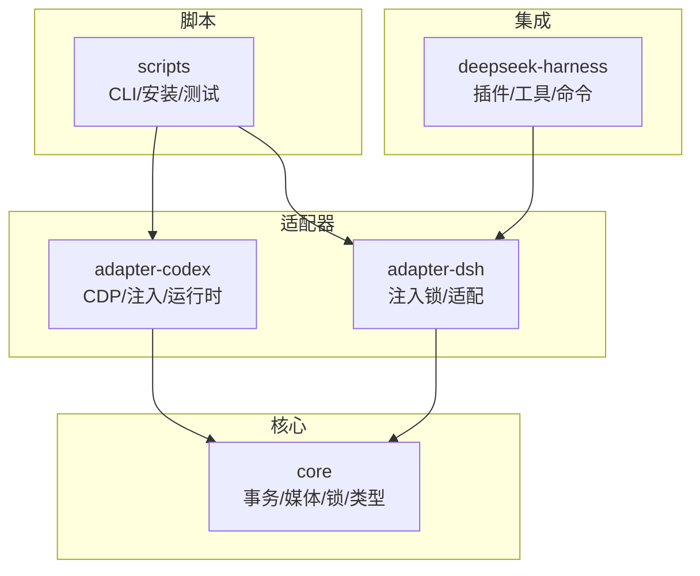
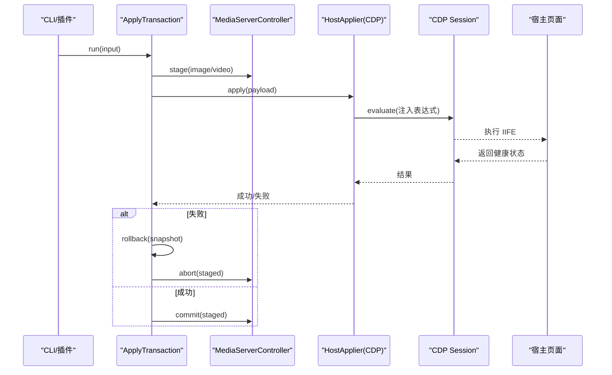
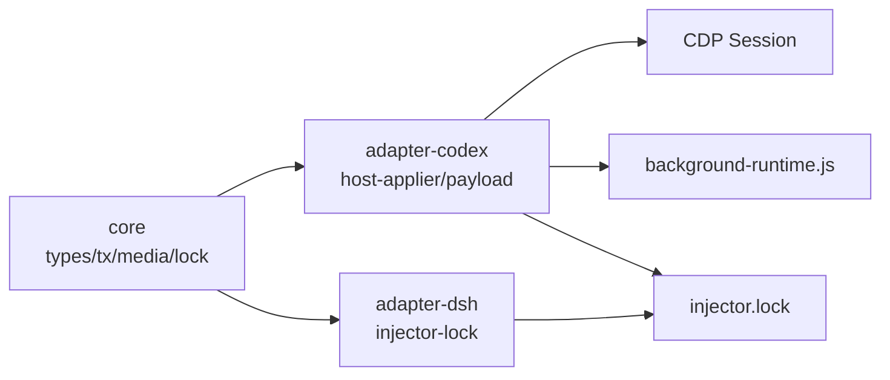
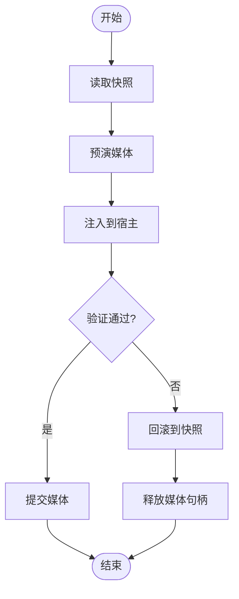
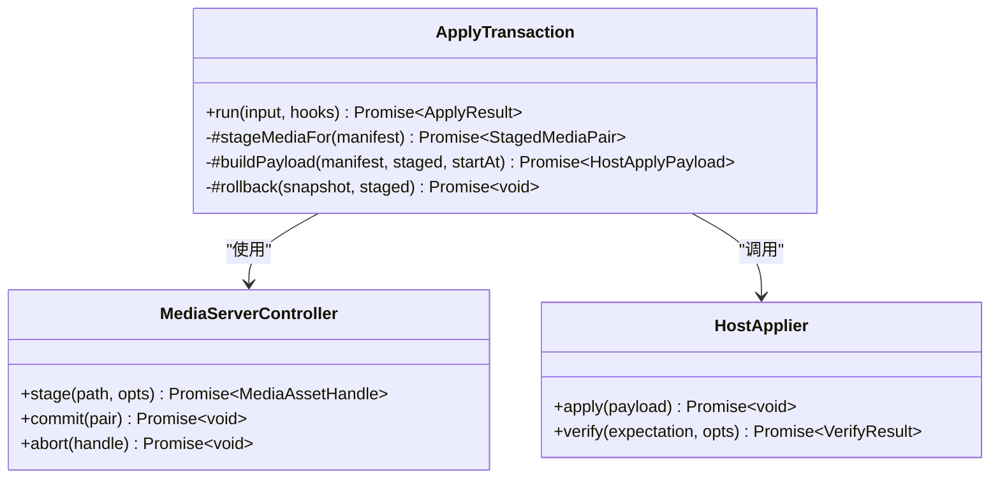

# 代码注入技术

<cite>
**本文引用的文件**
- [apply-transaction.ts](file://packages/core/src/apply-transaction.ts)
- [payload.ts](file://packages/adapter-codex/src/payload.ts)
- [injector-lock.ts](file://packages/adapter-codex/src/injector-lock.ts)
- [injector-lock.ts](file://packages/adapter-dsh/src/injector-lock.ts)
- [file-lock.ts](file://packages/core/src/file-lock.ts)
- [host-applier.ts](file://packages/adapter-codex/src/host-applier.ts)
- [background-runtime.js](file://packages/adapter-codex/src/renderer/background-runtime.js)
- [types.ts](file://packages/core/src/types.ts)
- [cdp.ts](file://packages/adapter-codex/src/cdp.ts)
- [error-message.ts](file://packages/core/src/error-message.ts)
- [beauticode.mjs](file://scripts/beauticode.mjs)
- [agent.mjs](file://integrations/deepseek-harness/agent.mjs)
- [session.ts](file://packages/adapter-codex/src/session.ts)
</cite>

## 目录
1. [简介](#简介)
2. [项目结构](#项目结构)
3. [核心组件](#核心组件)
4. [架构总览](#架构总览)
5. [详细组件分析](#详细组件分析)
6. [依赖关系分析](#依赖关系分析)
7. [性能考虑](#性能考虑)
8. [故障排查指南](#故障排查指南)
9. [结论](#结论)
10. [附录](#附录)

## 简介
本文件聚焦于本项目中的“代码注入”机制：在宿主页面（Codex Desktop、DeepSeek Harness）中安全地注入背景运行时，完成图片/视频背景的渲染与切换。文档围绕以下关键点展开：
- 注入时机选择与执行环境控制（CDP 会话、CSP 限制、同源策略）
- 注入载荷构建（数据 URL、Blob、本地路径剥离、IIFE 参数化）
- 注入锁机制（跨进程互斥、防重复注入、资源竞争保护）
- 失败处理与回滚（事务化应用、验证失败回滚、媒体句柄释放）
- 性能优化（延迟加载、条件注入、同代跳过、重试策略）
- 安全与可观测性（错误信息本地化、阶段耗时统计、日志定位）

## 项目结构
仓库采用多包工作区组织：
- core：提供通用能力（事务化应用、媒体服务、文件锁、类型定义等）
- adapter-codex：面向 Codex Desktop 的适配器（CDP 连接、注入表达式构建、运行时 IIFE）
- adapter-dsh：面向 DeepSeek Harness 的适配器（共享注入锁、轻量注入流程）
- integrations/deepseek-harness：DSH 插件侧集成（工具/命令注册、会话管理）
- scripts：CLI、安装脚本、冒烟测试等

**图示来源**
- [types.ts:1-215](file://packages/core/src/types.ts#L1-L215)
- [apply-transaction.ts:1-501](file://packages/core/src/apply-transaction.ts#L1-L501)
- [payload.ts:1-51](file://packages/adapter-codex/src/payload.ts#L1-L51)
- [injector-lock.ts:1-49](file://packages/adapter-codex/src/injector-lock.ts#L1-L49)
- [injector-lock.ts:1-29](file://packages/adapter-dsh/src/injector-lock.ts#L1-L29)

**章节来源**
- [types.ts:1-215](file://packages/core/src/types.ts#L1-L215)
- [apply-transaction.ts:1-501](file://packages/core/src/apply-transaction.ts#L1-L501)

## 核心组件
- ApplyTransaction：事务化的背景应用编排器，负责快照、媒体预演、主机注入、验证、提交或回滚。
- HostApplier（Codex）：通过 CDP 发现目标页、建立会话、构造并执行注入表达式、附加 Blob 视频、重放偏好设置。
- 注入表达式构建：将 CSS、图片 data URL、视频配置、代数、是否强制重建等参数 JSON 编码后注入 IIFE。
- 注入锁：基于 O_EXCL 的文件锁 + nonce，防止多进程/多实例同时注入同一主机。
- 运行时 IIFE：在宿主页面内创建舞台层、管理图片/视频生命周期、跨代平滑过渡、避免闪烁。
- 错误与诊断：阶段耗时统计、中文错误提示、超时与不可用状态处理。

**章节来源**
- [apply-transaction.ts:103-384](file://packages/core/src/apply-transaction.ts#L103-L384)
- [host-applier.ts:243-350](file://packages/adapter-codex/src/host-applier.ts#L243-L350)
- [payload.ts:23-51](file://packages/adapter-codex/src/payload.ts#L23-L51)
- [file-lock.ts:65-170](file://packages/core/src/file-lock.ts#L65-L170)
- [background-runtime.js:1-27](file://packages/adapter-codex/src/renderer/background-runtime.js#L1-L27)
- [error-message.ts:53-70](file://packages/core/src/error-message.ts#L53-L70)

## 架构总览
下图展示了从 CLI/插件到宿主页面的完整注入链路，包括事务化应用、CDP 注入、媒体服务与回滚路径。

**图示来源**
- [apply-transaction.ts:127-294](file://packages/core/src/apply-transaction.ts#L127-L294)
- [host-applier.ts:243-350](file://packages/adapter-codex/src/host-applier.ts#L243-L350)
- [cdp.ts:215-238](file://packages/adapter-codex/src/cdp.ts#L215-L238)

## 详细组件分析

### 注入时机与执行环境控制
- 注入时机
  - 在 ApplyTransaction 中，先完成媒体 staging，再调用 HostApplier.apply，随后进行 verify。若 verify 失败则触发回滚。
  - Codex 适配器对 watch 场景做了幂等优化：同代且健康时跳过重新注入，仅重应用偏好（静音、色调、摸鱼模式）。
- 执行环境控制
  - Codex Desktop CSP 限制 img-src/media-src/connect-src，因此优先使用 data: 或 blob: 传递媒体；loopback HTTP 仅在非 Codex 或允许的场景使用。
  - 注入表达式通过 IIFE 隔离执行，避免污染全局作用域；通过 generation 守卫确保跨代切换不闪烁。
  - CDP 会话需校验 loopback 地址与浏览器身份，异常时抛出明确错误并引导修复。

**章节来源**
- [apply-transaction.ts:193-246](file://packages/core/src/apply-transaction.ts#L193-L246)
- [host-applier.ts:288-350](file://packages/adapter-codex/src/host-applier.ts#L288-L350)
- [payload.ts:23-51](file://packages/adapter-codex/src/payload.ts#L23-L51)
- [cdp.ts:215-238](file://packages/adapter-codex/src/cdp.ts#L215-L238)

### 注入载荷构建过程
- 载荷字段
  - generation：用于版本/代数比对，避免重复注入。
  - media：image/video/clear。
  - imageDataUrl：图片 base64，受大小限制，过大时回退为服务端 URL。
  - imageUrl：可选 loopback URL，供非 Codex 宿主使用。
  - video：支持 data/server/blob 三种模式；localPath 仅用于 host 端 attach，不会进入页面。
  - cssText：注入的基础样式，保证舞台层可见性与交互穿透。
- 构建方式
  - 通过 buildInjectionExpression 将 payload 与 CSS、IIFE 组合成可执行的表达式字符串，所有值 JSON 编码，防止 XSS。
  - 对于视频，小文件直接内联 data URL，大文件走 blob 或 server 模式。

**章节来源**
- [types.ts:155-196](file://packages/core/src/types.ts#L155-L196)
- [payload.ts:23-51](file://packages/adapter-codex/src/payload.ts#L23-L51)
- [apply-transaction.ts:386-468](file://packages/core/src/apply-transaction.ts#L386-L468)

### 沙箱隔离与执行上下文
- IIFE 隔离：注入的运行时以 IIFE 形式执行，内部维护舞台节点、事件监听与状态机。
- 跨代平滑过渡：保留上一代可播放视频直到新一代就绪，避免闪烁；旧监听器在交接后解绑。
- CSP 兼容：严格遵循 app:// 的 img-src/media-src/connect-src 限制，仅使用 data:/blob:。

**章节来源**
- [background-runtime.js:1-27](file://packages/adapter-codex/src/renderer/background-runtime.js#L1-L27)

### 注入锁机制（防重复注入与资源竞争）
- 文件锁实现
  - 使用 O_EXCL 创建 injector.lock，写入包含 pid、nonce、startedAt 的 owner 信息。
  - 释放时校验 nonce 一致才删除文件，防止误删他人锁。
  - 对死锁/陈旧锁进行隔离迁移，避免竞态窗口。
- 跨适配器共享
  - Codex 与 DSH 适配器均写入同一 injector.lock，防止多进程争抢同一主机。
- 错误提示
  - 当检测到已有注入器运行时，CLI 会给出友好中文提示，指导停止冲突进程。

**章节来源**
- [file-lock.ts:65-170](file://packages/core/src/file-lock.ts#L65-L170)
- [injector-lock.ts:1-49](file://packages/adapter-codex/src/injector-lock.ts#L1-L49)
- [injector-lock.ts:1-29](file://packages/adapter-dsh/src/injector-lock.ts#L1-L29)
- [beauticode.mjs:133-166](file://scripts/beauticode.mjs#L133-L166)

### 注入失败处理与回滚机制
- 事务化流程
  - 开始：快照当前状态；提交导入；预演媒体；注入并验证。
  - 验证失败：立即回滚到快照，恢复媒体句柄，清理临时资源。
  - 异常捕获：统一包装错误信息，附带阶段耗时，便于定位瓶颈。
- 重试策略
  - 针对首帧/Range 探针导致的冷启动卡顿，自动重试一次 apply+verify。
  - CDP 会话断开时尝试重建会话并重试，直至达到最大次数。
- 回滚细节
  - 恢复快照后，重新 staging 并再次注入，确保宿主状态一致。
  - 媒体句柄在失败或回滚时及时 abort，避免资源泄漏。

**章节来源**
- [apply-transaction.ts:154-294](file://packages/core/src/apply-transaction.ts#L154-L294)
- [host-applier.ts:258-350](file://packages/adapter-codex/src/host-applier.ts#L258-L350)

### 性能优化技巧
- 延迟加载
  - 视频 poster 仅在必要时内联，超过阈值时使用外部 URL。
  - 小视频直接内联 data URL，减少网络往返。
- 条件注入
  - 同代且健康时跳过注入，仅重应用偏好设置，避免闪烁与重复开销。
  - 根据 CSP 与宿主能力选择最佳媒体传输模式（data/blob/server）。
- 幂等与缓存
  - 注入表达式带 generation，运行时可识别相同代数并短路。
  - 媒体服务器 token 与 srcUrl 复用，避免重复上传。

**章节来源**
- [apply-transaction.ts:212-227](file://packages/core/src/apply-transaction.ts#L212-L227)
- [host-applier.ts:314-338](file://packages/adapter-codex/src/host-applier.ts#L314-L338)
- [payload.ts:23-51](file://packages/adapter-codex/src/payload.ts#L23-L51)

### 安全与可观测性
- 安全
  - 所有注入参数 JSON 编码，防止注入攻击。
  - localPath 仅存在于 host 端，绝不进入页面上下文。
  - CDP 地址校验 loopback，拒绝非法远程调试端口。
- 可观测性
  - 阶段耗时统计（initialize/snapshot/commitImport/stageMedia/hostApply/rendererVerify/rollback 等）。
  - 错误信息本地化为中文，便于用户理解与排障。
  - 插件侧可记录 sourceMode、timings，辅助问题定位。

**章节来源**
- [payload.ts:23-51](file://packages/adapter-codex/src/payload.ts#L23-L51)
- [error-message.ts:53-70](file://packages/core/src/error-message.ts#L53-L70)
- [apply-transaction.ts:158-173](file://packages/core/src/apply-transaction.ts#L158-L173)
- [agent.mjs:64-88](file://integrations/deepseek-harness/agent.mjs#L64-L88)

## 依赖关系分析
- 模块耦合
  - ApplyTransaction 依赖 BackgroundStore、MediaServerController、HostApplier，形成清晰的事务边界。
  - adapter-codex 依赖 core 的类型与能力，并通过 CDP 与宿主页面交互。
  - adapter-dsh 复用 core 的文件锁，与 codex 共享 injector.lock，避免冲突。
- 外部依赖
  - Node.js WebSocket 用于 CDP 通信。
  - 文件系统用于媒体 staging、快照与锁文件。
- 循环依赖
  - 各模块职责清晰，未见循环引用；通过接口（HostApplier）解耦具体实现。

**图示来源**
- [types.ts:1-215](file://packages/core/src/types.ts#L1-L215)
- [apply-transaction.ts:103-384](file://packages/core/src/apply-transaction.ts#L103-L384)
- [host-applier.ts:243-350](file://packages/adapter-codex/src/host-applier.ts#L243-L350)
- [injector-lock.ts:1-49](file://packages/adapter-codex/src/injector-lock.ts#L1-L49)
- [injector-lock.ts:1-29](file://packages/adapter-dsh/src/injector-lock.ts#L1-L29)

**章节来源**
- [types.ts:1-215](file://packages/core/src/types.ts#L1-L215)
- [apply-transaction.ts:103-384](file://packages/core/src/apply-transaction.ts#L103-L384)
- [host-applier.ts:243-350](file://packages/adapter-codex/src/host-applier.ts#L243-L350)

## 性能考虑
- 冷启动优化：对首帧/Range 探针失败的渲染验证进行一次性重试，提升首次加载成功率。
- 注入节流：watch 模式下同代健康跳过注入，减少不必要的 DOM 操作与网络请求。
- 媒体传输选择：根据文件大小与 CSP 限制动态选择 data/blob/server，平衡带宽与延迟。
- 资源回收：失败或回滚时及时 abort 媒体句柄，避免内存与句柄泄漏。
- 阶段计时：通过 phases 统计各阶段耗时，帮助定位瓶颈（如 rendererVerify、rollback）。

[本节为通用性能建议，无需特定文件来源]

## 故障排查指南
- 常见错误与定位
  - “另一个注入器正在运行”：检查是否存在残留进程或陈旧锁，等待锁过期或手动清理。
  - “没有活动 CDP 会话”：确认目标应用已启用远程调试，端口可达且为 loopback。
  - “CDP 响应超限/格式异常”：检查浏览器版本与 CDP 协议兼容性。
  - “Live verify did not pass”：查看 timings.phases 中 rendererVerify 耗时，结合宿主控制台定位渲染问题。
- 处理步骤
  - 使用 CLI 的 discover/how-to-cdp 获取诊断信息。
  - 检查 injector.lock 内容与进程存活状态。
  - 观察 ApplyTransaction 的阶段耗时，判断是否为媒体解码或注入阶段瓶颈。
  - 在插件侧记录 sourceMode 与 timings，辅助复现与回归。

**章节来源**
- [beauticode.mjs:133-166](file://scripts/beauticode.mjs#L133-L166)
- [error-message.ts:53-70](file://packages/core/src/error-message.ts#L53-L70)
- [apply-transaction.ts:228-244](file://packages/core/src/apply-transaction.ts#L228-L244)
- [agent.mjs:64-88](file://integrations/deepseek-harness/agent.mjs#L64-L88)

## 结论
本项目通过事务化应用、严格的 CSP 兼容、安全的注入载荷构建、跨进程注入锁以及完善的回滚与诊断机制，实现了稳定、安全、高性能的代码注入。关键设计点包括：
- 以 ApplyTransaction 为核心，确保原子性与一致性
- 以 CDP 为桥梁，精确控制注入时机与环境
- 以文件锁与 nonce 防止资源竞争与重复注入
- 以阶段计时与中文错误提升可观测性与用户体验
- 以延迟加载与条件注入优化性能与稳定性

[本节为总结性内容，无需特定文件来源]

## 附录
- 关键流程图：注入与回滚决策

**图示来源**
- [apply-transaction.ts:154-294](file://packages/core/src/apply-transaction.ts#L154-L294)

- 类关系图：核心对象交互

**图示来源**
- [apply-transaction.ts:103-384](file://packages/core/src/apply-transaction.ts#L103-L384)
- [types.ts:140-196](file://packages/core/src/types.ts#L140-L196)