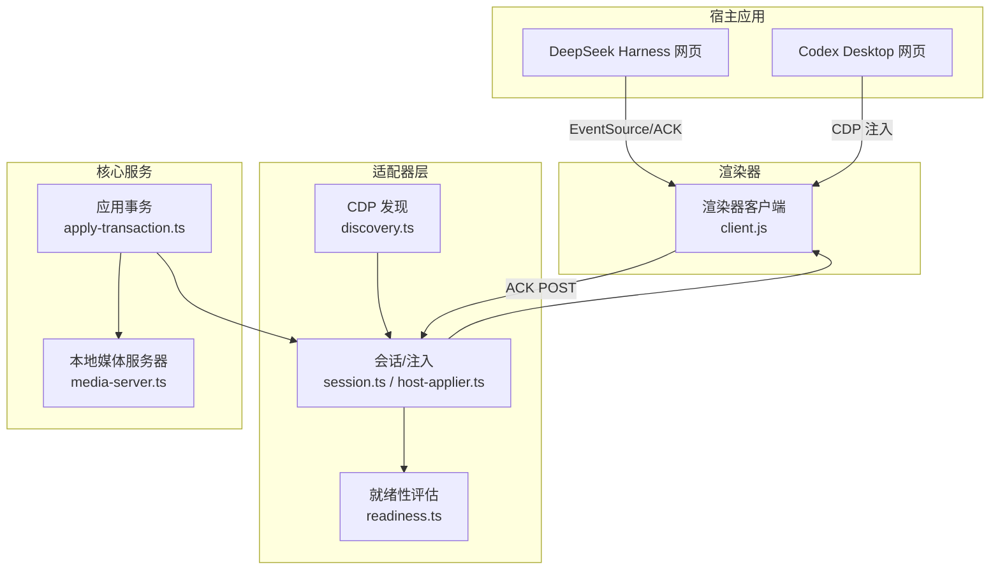
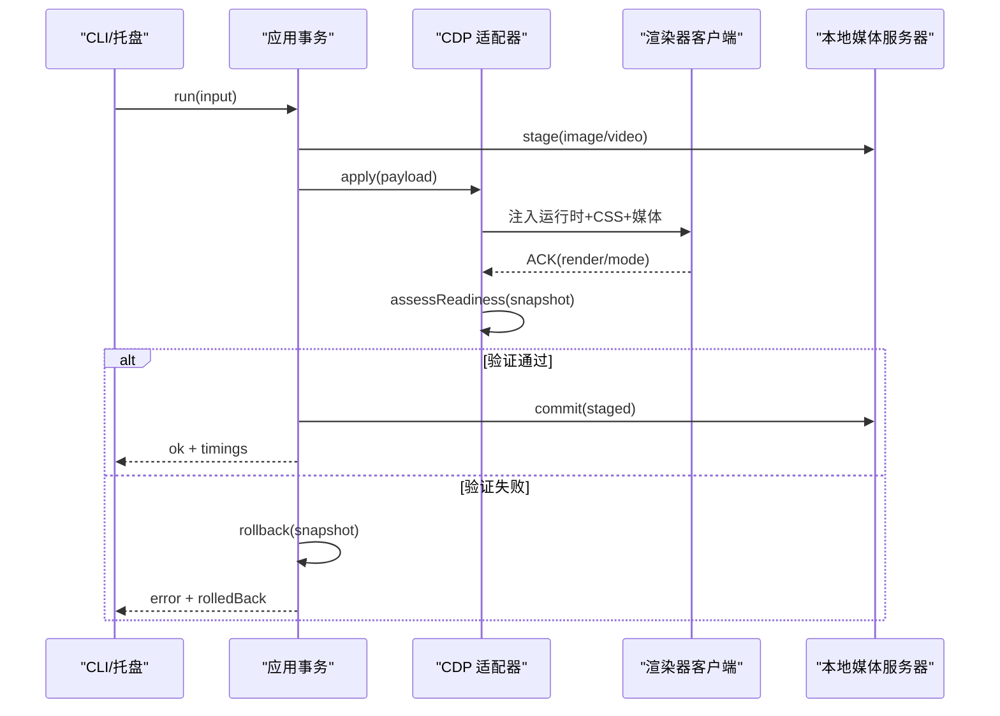
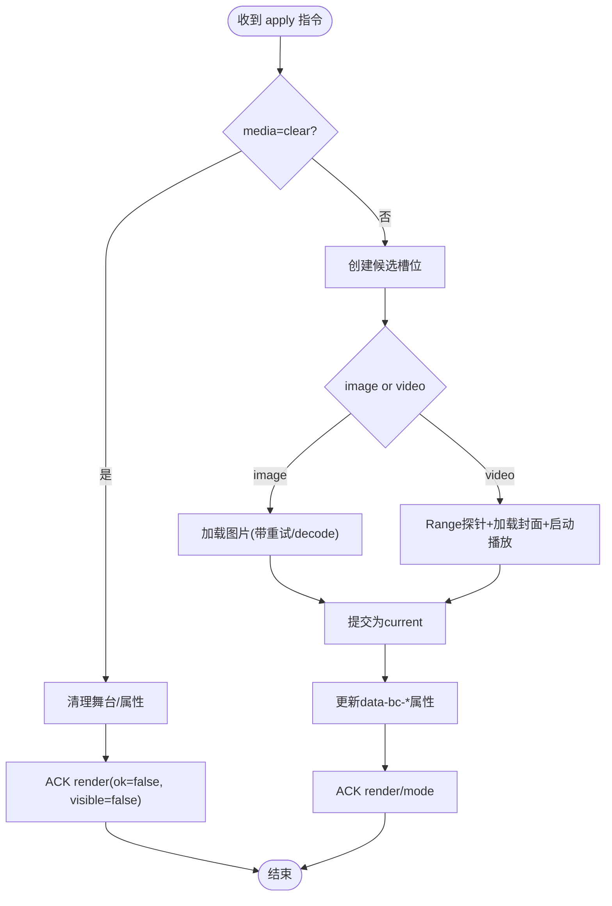
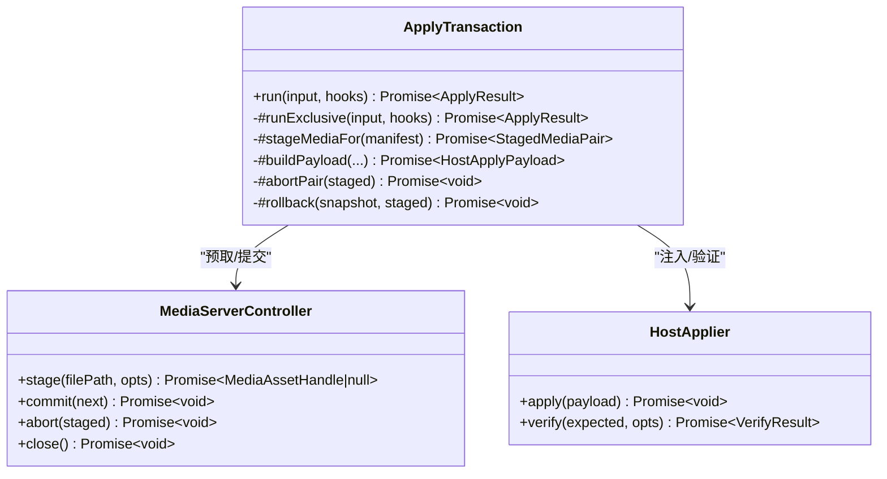
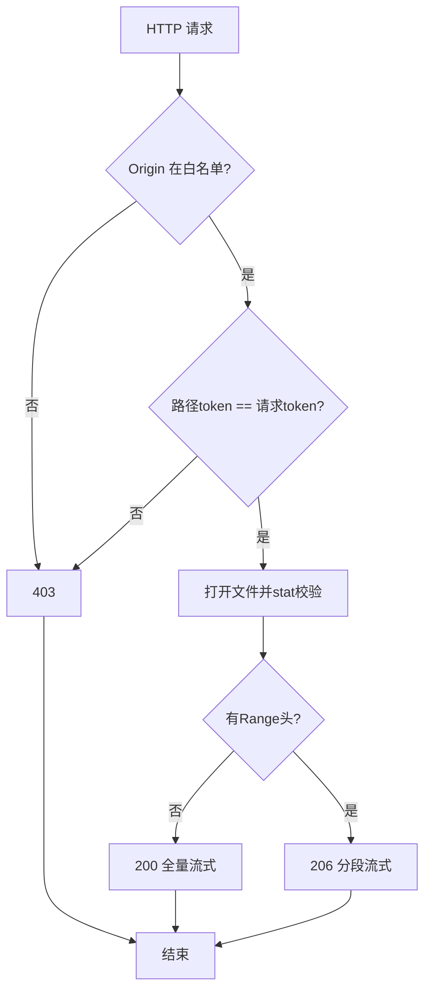
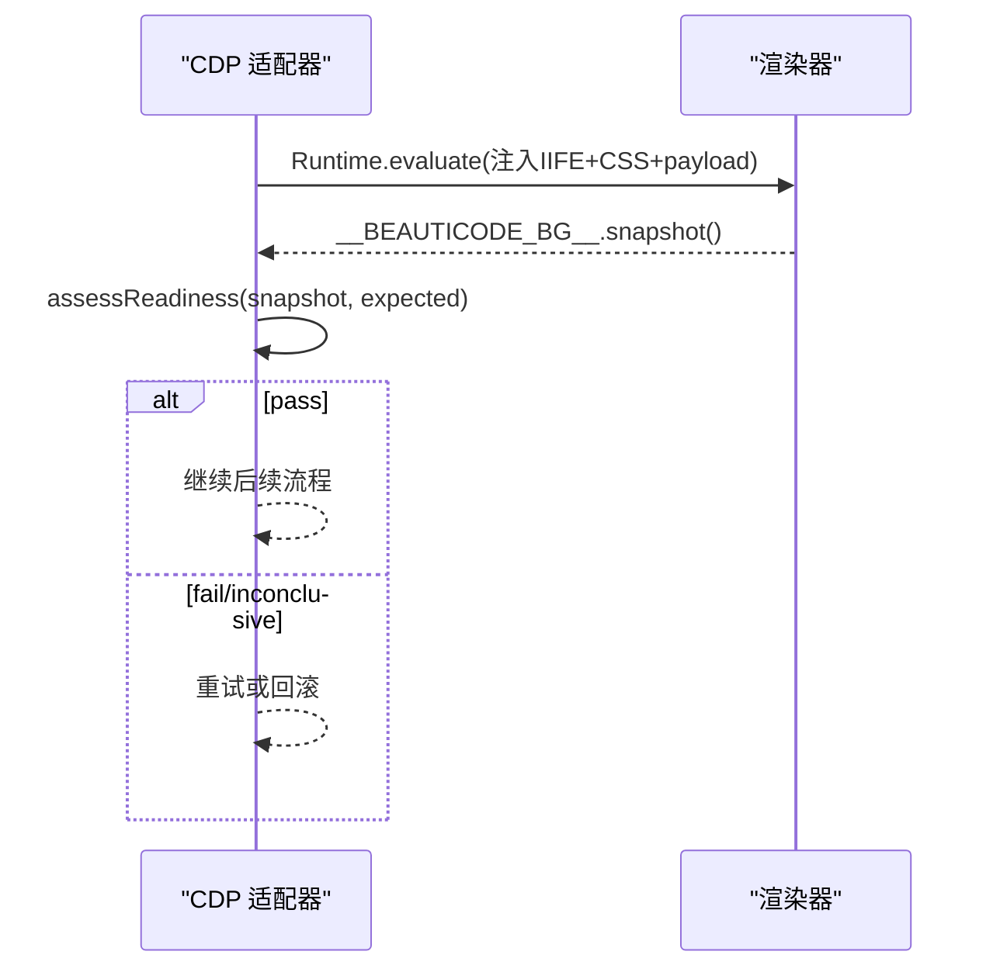
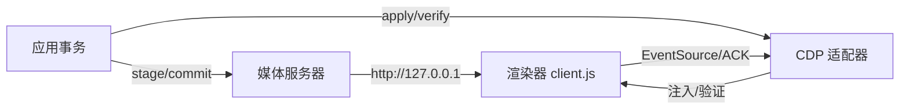

# 渲染器集成

<cite>
**本文引用的文件**
- [README.md](file://README.md)
- [package.json](file://package.json)
- [client.js](file://integrations/deepseek-harness/client.js)
- [apply-transaction.ts](file://packages/core/src/apply-transaction.ts)
- [media-server.ts](file://packages/core/src/media-server.ts)
- [readiness.ts](file://packages/adapter-codex/src/readiness.ts)
- [host-applier.ts](file://packages/adapter-codex/src/host-applier.ts)
- [session.ts (Codex)](file://packages/adapter-codex/src/session.ts)
- [discovery.ts](file://packages/adapter-codex/src/discovery.ts)
- [error-message.ts](file://packages/core/src/error-message.ts)
- [security-boundaries.md](file://docs/security-boundaries.md)
- [host-adapter.md](file://docs/host-adapter.md)
- [upstream-reference.md](file://docs/upstream-reference.md)
- [beauticode.mjs](file://scripts/beauticode.mjs)
- [start-beauticode-engine.ps1](file://scripts/start-beauticode-engine.ps1)
</cite>

## 目录
1. [简介](#简介)
2. [项目结构](#项目结构)
3. [核心组件](#核心组件)
4. [架构总览](#架构总览)
5. [详细组件分析](#详细组件分析)
6. [依赖关系分析](#依赖关系分析)
7. [性能与资源管理](#性能与资源管理)
8. [故障排查指南](#故障排查指南)
9. [结论](#结论)
10. [附录：使用示例与最佳实践](#附录使用示例与最佳实践)

## 简介
本文件面向“渲染器集成”的完整实现，聚焦背景运行时的架构设计、媒体播放控制、全屏（摸鱼）模式切换、状态同步机制、就绪性检查流程、渲染器与主进程通信协议、资源管理与垃圾回收策略、跨域安全与 CSP 配置，以及如何在渲染器中集成背景功能的事件监听与状态更新。

该项目为 DeepSeek Harness 和 Codex Desktop 提供本地图片/视频背景能力，通过 CDP 注入渲染器脚本，在宿主页面背后绘制一个不可交互的背景层，并通过事件流与确认机制保证事务一致性与可回滚。

**章节来源**
- [README.md:19-35](file://README.md#L19-L35)
- [README.md:108-137](file://README.md#L108-L137)

## 项目结构
仓库采用多包工作区组织：
- integrations/deepseek-harness：DSH 插件侧的渲染器客户端与桥接逻辑
- packages/core：通用核心能力（媒体服务器、应用事务、类型与常量等）
- packages/adapter-codex：CDP 适配层（发现、会话、注入、就绪性评估）
- apps/tray：托盘应用（可选）
- scripts：CLI、启动与打包脚本

**图表来源**
- [discovery.ts:1-35](file://packages/adapter-codex/src/discovery.ts#L1-L35)
- [session.ts:173-196](file://packages/adapter-codex/src/session.ts#L173-L196)
- [host-applier.ts:48-81](file://packages/adapter-codex/src/host-applier.ts#L48-L81)
- [readiness.ts:25-149](file://packages/adapter-codex/src/readiness.ts#L25-L149)
- [apply-transaction.ts:127-246](file://packages/core/src/apply-transaction.ts#L127-L246)
- [media-server.ts:148-167](file://packages/core/src/media-server.ts#L148-L167)
- [client.js:1556-1567](file://integrations/deepseek-harness/client.js#L1556-L1567)

**章节来源**
- [package.json:7-21](file://package.json#L7-L21)
- [host-adapter.md:1-37](file://docs/host-adapter.md#L1-L37)

## 核心组件
- 渲染器客户端（client.js）：负责在宿主页面内创建背景舞台、加载图片/视频、处理播放与稳定态、主题与全屏模式同步、向服务端上报渲染结果与模式状态。
- 应用事务（apply-transaction.ts）：编排快照、磁盘提交、媒体预取、主机注入、验证、提交或回滚，保障一致性。
- 本地媒体服务器（media-server.ts）：仅绑定 127.0.0.1，基于随机 token 的路由鉴权，支持 Range 请求与 CORS 白名单。
- CDP 适配器（session.ts / host-applier.ts / discovery.ts）：发现调试端口、建立会话、注入渲染器代码、执行就绪性检查。
- 就绪性评估（readiness.ts）：统一判定渲染器是否达到预期状态（图片解码完成、视频首帧呈现、无水平溢出、pointer-events 正确等）。

**章节来源**
- [client.js:1-110](file://integrations/deepseek-harness/client.js#L1-L110)
- [apply-transaction.ts:94-121](file://packages/core/src/apply-transaction.ts#L94-L121)
- [media-server.ts:24-33](file://packages/core/src/media-server.ts#L24-L33)
- [host-applier.ts:48-81](file://packages/adapter-codex/src/host-applier.ts#L48-L81)
- [readiness.ts:21-49](file://packages/adapter-codex/src/readiness.ts#L21-L49)

## 架构总览
整体流程分为“准备—注入—渲染—验证—提交/回滚”五阶段：
1. 准备：读取当前清单，校验并复制媒体到受控目录，生成媒体句柄（含 URL/token）。
2. 注入：通过 CDP 将渲染器运行时与 CSS 注入目标页面，附带媒体数据或 URL。
3. 渲染：渲染器构建舞台，加载图片/视频，预热媒体管线，设置属性标记状态。
4. 验证：从渲染器采集快照，按期望进行一致性判断；必要时重试。
5. 提交/回滚：验证通过后提交媒体句柄并清理临时资源；失败则回滚到快照。

**图表来源**
- [apply-transaction.ts:127-246](file://packages/core/src/apply-transaction.ts#L127-L246)
- [media-server.ts:220-301](file://packages/core/src/media-server.ts#L220-L301)
- [readiness.ts:25-149](file://packages/adapter-codex/src/readiness.ts#L25-L149)
- [client.js:1293-1431](file://integrations/deepseek-harness/client.js#L1293-L1431)

**章节来源**
- [apply-transaction.ts:154-294](file://packages/core/src/apply-transaction.ts#L154-L294)
- [host-adapter.md:39-78](file://docs/host-adapter.md#L39-L78)

## 详细组件分析

### 渲染器客户端（背景运行时）
- 舞台与样式：在 body 前插入固定定位的舞台节点，设置 pointer-events:none，避免拦截用户交互；根据主题与工作状态调整遮罩透明度。
- 媒体加载：图片支持多次尝试与 decode() 二次就绪信号；视频先以封面图承诺可见性，再异步等待首帧呈现。
- 播放控制：优先静音播放，若被自动播放策略阻止则保持静音继续；记录 blocked 状态以便上层提示。
- 状态同步：通过 EventSource 接收 apply/mode 指令，通过 POST /__beauticode/ack 上报 render/mode 结果；维护 generation 防重放。
- 全屏（摸鱼）模式：切换 data-bc-fish 属性隐藏宿主内容，不破坏 DOM 结构；与主题色联动。

**图表来源**
- [client.js:1293-1431](file://integrations/deepseek-harness/client.js#L1293-L1431)
- [client.js:1521-1554](file://integrations/deepseek-harness/client.js#L1521-L1554)
- [client.js:1556-1567](file://integrations/deepseek-harness/client.js#L1556-L1567)

**章节来源**
- [client.js:48-109](file://integrations/deepseek-harness/client.js#L48-L109)
- [client.js:309-344](file://integrations/deepseek-harness/client.js#L309-L344)
- [client.js:482-569](file://integrations/deepseek-harness/client.js#L482-L569)
- [client.js:583-627](file://integrations/deepseek-harness/client.js#L583-L627)
- [client.js:685-732](file://integrations/deepseek-harness/client.js#L685-L732)
- [client.js:994-1011](file://integrations/deepseek-harness/client.js#L994-L1011)
- [client.js:1433-1473](file://integrations/deepseek-harness/client.js#L1433-L1473)

### 应用事务（Host Apply 编排）
- 串行化：防止并发 apply 导致状态竞争。
- 阶段计时：记录各阶段耗时，便于诊断。
- 媒体预取：根据清单选择 image/video，必要时为视频准备运行时副本以避免 Windows 目录锁定问题。
- 注入与验证：调用 HostApplier.apply/verify；对视频冷启动的首帧/Range 探针失败场景支持一次重试。
- 提交与清理：验证通过后提交媒体句柄，清理运行时视频与快照。

**图表来源**
- [apply-transaction.ts:127-246](file://packages/core/src/apply-transaction.ts#L127-L246)
- [apply-transaction.ts:296-341](file://packages/core/src/apply-transaction.ts#L296-L341)
- [apply-transaction.ts:386-468](file://packages/core/src/apply-transaction.ts#L386-L468)
- [media-server.ts:636-731](file://packages/core/src/media-server.ts#L636-L731)

**章节来源**
- [apply-transaction.ts:94-121](file://packages/core/src/apply-transaction.ts#L94-L121)
- [apply-transaction.ts:154-294](file://packages/core/src/apply-transaction.ts#L154-L294)

### 本地媒体服务器（安全与跨域）
- 绑定与范围：仅监听 127.0.0.1，拒绝非环回地址。
- 鉴权：路径 token + 请求头或查询参数 token 双重匹配；Origin 白名单控制 CORS。
- 传输：支持 Range 请求，流式管道传输，关闭时主动销毁连接。
- 安全：每次请求重新 stat 文件，检测符号链接、大小变化与哈希漂移。

**图表来源**
- [media-server.ts:148-167](file://packages/core/src/media-server.ts#L148-L167)
- [media-server.ts:406-590](file://packages/core/src/media-server.ts#L406-L590)

**章节来源**
- [media-server.ts:220-301](file://packages/core/src/media-server.ts#L220-L301)
- [security-boundaries.md:1-27](file://docs/security-boundaries.md#L1-L27)

### CDP 适配器与就绪性检查
- 发现：限制 JSON 响应长度，仅允许环回地址，识别浏览器身份。
- 注入：将渲染器 IIFE 与 CSS 注入目标页面，附带媒体数据或 URL。
- 就绪性：采集 snapshot，按 expected.generation 与 media 类型判定 pass/fail/inconclusive；考虑文档隐藏与可见性。

**图表来源**
- [discovery.ts:1-35](file://packages/adapter-codex/src/discovery.ts#L1-L35)
- [readiness.ts:25-149](file://packages/adapter-codex/src/readiness.ts#L25-L149)
- [readiness.ts:151-182](file://packages/adapter-codex/src/readiness.ts#L151-L182)

**章节来源**
- [session.ts:173-196](file://packages/adapter-codex/src/session.ts#L173-L196)
- [host-applier.ts:48-81](file://packages/adapter-codex/src/host-applier.ts#L48-L81)

### 媒体播放控制与全屏模式
- 播放控制：
  - 首次加载先展示封面图，确保快速可见；随后后台等待首帧呈现并升级。
  - 冷启动下 muted play() 可能长时间 pending，属于正常预热；仅在明确拒绝时失败。
  - 记录 autoplay 策略导致的 blocked 状态，用于 UI 提示。
- 全屏（摸鱼）模式：
  - 切换 data-bc-fish 隐藏宿主 chrome，不重建媒体；需要已有背景才允许开启。
  - 与主题色联动，自动跟随系统/宿主主题。

**章节来源**
- [client.js:994-1011](file://integrations/deepseek-harness/client.js#L994-L1011)
- [client.js:1433-1473](file://integrations/deepseek-harness/client.js#L1433-L1473)
- [session.ts:351-392](file://packages/adapter-codex/src/session.ts#L351-L392)
- [host-adapter.md:39-78](file://docs/host-adapter.md#L39-L78)

### 状态同步机制
- 事件通道：渲染器通过 EventSource 订阅 /__beauticode/events，接收 apply/mode 指令。
- 确认通道：渲染器通过 POST /__beauticode/ack 上报 render/mode 结果，包含 generation、media、ok、visible、videoReady、playback 等字段。
- 主题同步：监听宿主主题变更，同步 data-bc-resolved-tone，影响遮罩与对比度。

**章节来源**
- [client.js:289-344](file://integrations/deepseek-harness/client.js#L289-L344)
- [client.js:1556-1567](file://integrations/deepseek-harness/client.js#L1556-L1567)
- [client.js:162-210](file://integrations/deepseek-harness/client.js#L162-L210)

### 资源管理与垃圾回收
- 图片释放：移除 src、解绑事件、必要时移除节点，避免内存泄漏。
- 视频释放：暂停、撤销 ObjectURL、清空 src/srcObject、load 重置。
- 槽位生命周期：候选槽位与当前槽位分离，旧槽位在过渡后销毁。
- 媒体服务器：关闭时销毁所有 socket 与传输控制器，确保进程退出不再挂起。

**章节来源**
- [client.js:364-374](file://integrations/deepseek-harness/client.js#L364-L374)
- [client.js:1046-1077](file://integrations/deepseek-harness/client.js#L1046-L1077)
- [media-server.ts:308-363](file://packages/core/src/media-server.ts#L308-L363)

### 跨域安全与 CSP 配置
- 媒体服务器：仅 127.0.0.1，CORS 白名单 Origin，需同时满足路径 token 与请求 token。
- 注入媒体：Codex Desktop CSP 限制 connect/img/media-src 至 http://127.0.0.1，因此注入时使用 data:/blob: 直传；非 Codex 宿主可使用 loopback URL。
- 安全边界：禁止任意文件系统暴露、限制 JSON 响应大小、失败关闭策略。

**章节来源**
- [media-server.ts:406-479](file://packages/core/src/media-server.ts#L406-L479)
- [apply-transaction.ts:94-102](file://packages/core/src/apply-transaction.ts#L94-L102)
- [security-boundaries.md:1-27](file://docs/security-boundaries.md#L1-L27)

## 依赖关系分析
- 渲染器客户端依赖宿主 DOM 结构与主题属性，通过 EventSource/ACK 与后端通信。
- 应用事务依赖媒体服务器与 CDP 适配器，协调注入与验证。
- CDP 适配器依赖发现模块与就绪性评估，确保注入目标正确且渲染器就绪。
- 媒体服务器独立于宿主，仅通过 token 与 Origin 暴露资源。

**图表来源**
- [client.js:1556-1567](file://integrations/deepseek-harness/client.js#L1556-L1567)
- [apply-transaction.ts:127-246](file://packages/core/src/apply-transaction.ts#L127-L246)
- [media-server.ts:148-167](file://packages/core/src/media-server.ts#L148-L167)

**章节来源**
- [upstream-reference.md:20-44](file://docs/upstream-reference.md#L20-L44)

## 性能与资源管理
- 媒体预热：初始化时播放极小黑帧以预热解码/GPU/Audio 管线，降低首帧延迟。
- 图片加载：并行尝试与 decode() 兜底，超时窗口内重试，避免冷缓存阻塞。
- 视频首帧：分两阶段——第一阶段承诺可见（封面），第二阶段后台等待首帧呈现，避免冷机超时。
- 节流与序列化：适配器对 apply/attach 串行化，避免频繁 tick 干扰冷启动。
- 资源回收：及时释放图片/视频对象与媒体服务器句柄，避免内存增长。

**章节来源**
- [client.js:111-160](file://integrations/deepseek-harness/client.js#L111-L160)
- [client.js:482-569](file://integrations/deepseek-harness/client.js#L482-L569)
- [client.js:1433-1473](file://integrations/deepseek-harness/client.js#L1433-L1473)
- [host-applier.ts:63-75](file://packages/adapter-codex/src/host-applier.ts#L63-L75)

## 故障排查指南
- 常见错误与中文提示：
  - CDP 连接/列表/命令超时、套接字关闭、身份变化等均有本地化提示。
  - 渲染器执行失败会返回可读错误信息。
- 诊断要点：
  - 检查 CDP 端口是否为环回地址，JSON 响应是否超限。
  - 检查媒体服务器 Origin 白名单与 token 是否匹配。
  - 查看渲染器 ACK 中的 videoReady/playback 字段定位首帧问题。
- 工具与脚本：
  - CLI 提供 discover/how-to-cdp 帮助定位 CDP。
  - PowerShell 脚本提供快速探测 CDP 端口与连通性。

**章节来源**
- [error-message.ts:70-85](file://packages/core/src/error-message.ts#L70-L85)
- [beauticode.mjs:127-173](file://scripts/beauticode.mjs#L127-L173)
- [start-beauticode-engine.ps1:78-116](file://scripts/start-beauticode-engine.ps1#L78-L116)

## 结论
本项目通过“应用事务 + CDP 注入 + 本地媒体服务器 + 就绪性评估”的组合，实现了稳定可靠的背景渲染器集成。渲染器侧具备完善的媒体预热、播放控制、状态同步与资源回收机制；适配器侧保证注入安全与一致性；媒体服务器提供高性能、安全的本地资源访问。整体设计遵循最小侵入、失败关闭与安全边界的工程原则。

[本节为总结性内容，无需引用具体文件]

## 附录：使用示例与最佳实践

### 在渲染器中集成背景功能的步骤
- 监听事件：
  - 通过 EventSource 订阅 /__beauticode/events，处理 type=apply 与 type=mode 消息。
  - 在 apply 回调中调用 applyBackground，传入 payload 与 AbortSignal。
- 状态更新：
  - 在 mode 回调中更新 desiredModes（fish/muted/tone），并同步到 DOM 属性。
  - 定期通过 ACK 上报 render/mode 结果，包含 generation、media、ok、visible、videoReady、playback。
- 全屏模式：
  - 切换 data-bc-fish 进入/退出全屏；确保已有背景后再启用。
- 主题同步：
  - 监听宿主主题变化，同步 data-bc-resolved-tone，影响遮罩与对比度。

**章节来源**
- [client.js:1521-1554](file://integrations/deepseek-harness/client.js#L1521-L1554)
- [client.js:1556-1567](file://integrations/deepseek-harness/client.js#L1556-L1567)
- [client.js:162-210](file://integrations/deepseek-harness/client.js#L162-L210)

### 事件与数据格式参考
- 事件通道：
  - 订阅端点：/__beauticode/events?clientId=...
  - 消息体：{ type: "apply"|"mode", ... }
- 确认通道：
  - 上报端点：POST /__beauticode/ack
  - 载荷：{ clientId, kind: "render"|"mode", generation, media, ok, visible, error, videoReady?, playback? }

**章节来源**
- [client.js:289-344](file://integrations/deepseek-harness/client.js#L289-L344)
- [client.js:1556-1567](file://integrations/deepseek-harness/client.js#L1556-L1567)

### 最佳实践
- 始终使用 generation 防重放，忽略过期异步回调。
- 视频冷启动优先承诺封面，后台等待首帧，避免超时误判。
- 媒体服务器仅绑定环回地址，严格校验 Origin 与 token。
- 注入媒体优先 data:/blob: 以兼容严格 CSP；非 Codex 宿主可使用 loopback URL。
- 失败关闭：缺失 CDP、验证失败、媒体漂移均视为失败并回滚。

**章节来源**
- [apply-transaction.ts:94-102](file://packages/core/src/apply-transaction.ts#L94-L102)
- [security-boundaries.md:1-27](file://docs/security-boundaries.md#L1-L27)
- [upstream-reference.md:20-44](file://docs/upstream-reference.md#L20-L44)