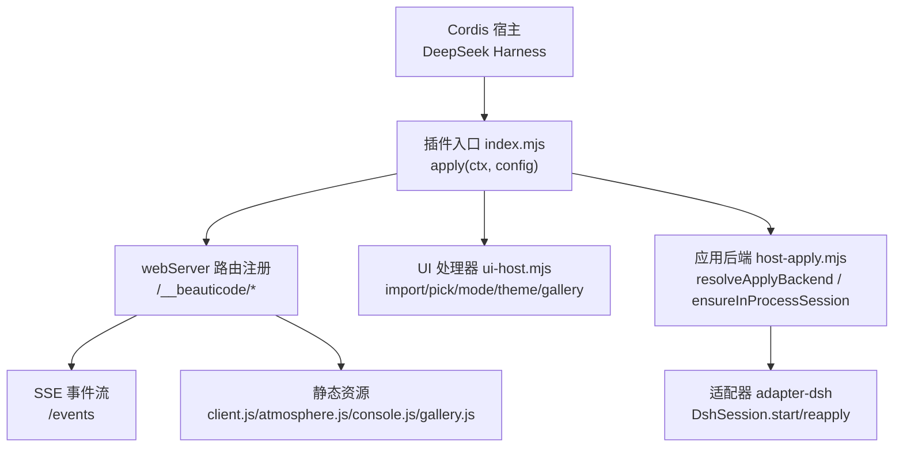
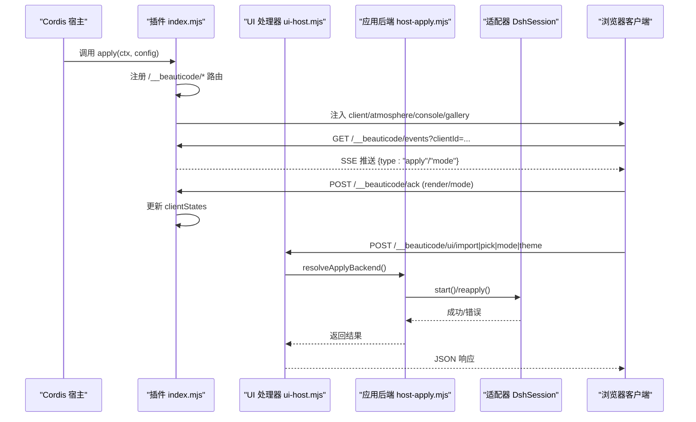
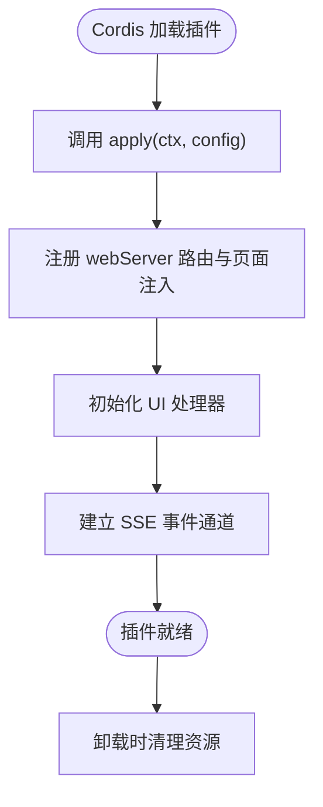
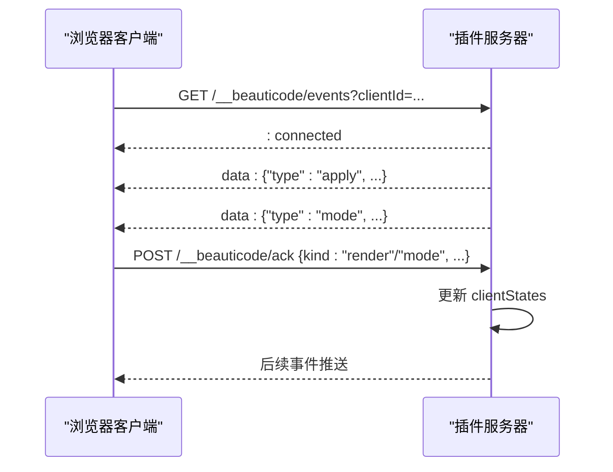
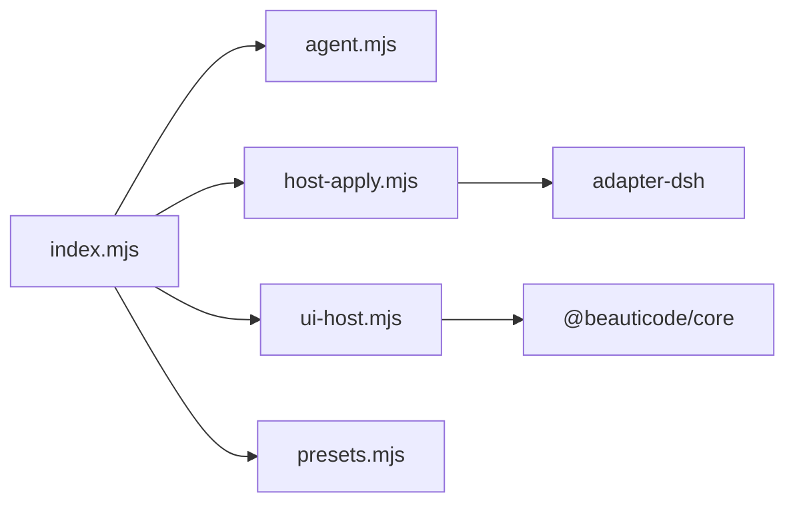

# Cordis 插件架构

<cite>
**本文引用的文件**
- [index.mjs](file://integrations/deepseek-harness/index.mjs)
- [package.json](file://integrations/deepseek-harness/package.json)
- [cordis.patch.yml](file://integrations/deepseek-harness/cordis.patch.yml)
- [host-apply.mjs](file://integrations/deepseek-harness/host-apply.mjs)
- [ui-host.mjs](file://integrations/deepseek-harness/ui-host.mjs)
- [install-dsh-plugin.ps1](file://scripts/install-dsh-plugin.ps1)
- [pack-dsh-plugin.mjs](file://scripts/pack-dsh-plugin.mjs)
- [build-windows-installer.ps1](file://scripts/build-windows-installer.ps1)
- [README.md](file://README.md)
- [index.ts](file://packages/core/src/index.ts)
</cite>

## 目录
1. [简介](#简介)
2. [项目结构](#项目结构)
3. [核心组件](#核心组件)
4. [架构总览](#架构总览)
5. [详细组件分析](#详细组件分析)
6. [依赖关系分析](#依赖关系分析)
7. [性能与可靠性](#性能与可靠性)
8. [故障排查指南](#故障排查指南)
9. [结论](#结论)
10. [附录：配置、环境变量与调试](#附录：配置环境变量与调试)

## 简介
本文件面向开发者，系统化阐述 beautiCode 在 DeepSeek Harness（DSH）中的 Cordis 插件架构。重点覆盖：
- 插件注册机制与生命周期管理
- 事件系统与 SSE 广播
- 初始化流程、依赖注入与模块导出
- 配置选项、环境变量与调试方法
- 开发最佳实践与常见问题解决方案

该插件通过 DSH 的 Cordis 扩展点注入 webServer，暴露一组内部 API，并通过服务端事件向浏览器端推送背景与应用状态变更。

## 项目结构
- 插件入口位于 integrations/deepseek-harness/index.mjs，声明 name、inject、bridgeProtocol 等元数据，并实现 apply(ctx, config) 作为 Cordis 插件生命周期入口。
- 插件通过 cordis.patch.yml 声明自身为 webServer 注入型插件，供 DSH 加载。
- host-apply.mjs 负责解析插件基础 URL、动态加载适配器、选择本地或托盘后端执行应用操作。
- ui-host.mjs 提供 UI 侧 HTTP 接口（导入、选择、主题、画廊等），封装媒体处理、原生文件选择器、SSE 恢复逻辑。
- scripts 下脚本用于安装、打包与构建验证，确保插件可被 DSH 正确发现与加载。
- packages/core 提供共享能力（路径、媒体校验、事务、会话等），由宿主/适配器复用。

图表来源
- [index.mjs:204-644](file://integrations/deepseek-harness/index.mjs#L204-L644)
- [host-apply.mjs:16-165](file://integrations/deepseek-harness/host-apply.mjs#L16-L165)
- [ui-host.mjs:302-798](file://integrations/deepseek-harness/ui-host.mjs#L302-L798)

章节来源
- [index.mjs:1-645](file://integrations/deepseek-harness/index.mjs#L1-L645)
- [package.json:1-60](file://integrations/deepseek-harness/package.json#L1-L60)
- [cordis.patch.yml:1-5](file://integrations/deepseek-harness/cordis.patch.yml#L1-L5)

## 核心组件
- 插件入口 index.mjs
  - 导出 name、inject、bridgeProtocol，供 Cordis 识别与匹配。
  - apply(ctx, config) 中注册 webServer 路由、注入页面脚本、建立 SSE 事件通道、维护客户端状态与模式。
  - 内置鉴权（Bearer Token）、同源校验、载荷校验与安全限制。
- UI 处理器 ui-host.mjs
  - 提供 importFile、pickMedia、importSelected、clear、mode、useTheme、deleteTheme、gallery* 等接口。
  - 封装 Windows 原生文件选择器、超时控制、选择令牌与 TTL 清理。
  - 调度“恢复”流程以在启动后自动重放上次背景。
- 应用后端 host-apply.mjs
  - resolvePluginBaseUrl 根据 ctx.webServer.port/host 推导基础地址。
  - loadAdapter 按优先级尝试内嵌、npm、源码路径加载适配器。
  - ensureInProcessSession 创建并缓存 DshSession；stopInProcessSession 统一关闭。
  - resolveApplyBackend 智能选择托盘或进程内会话执行 reapply。

章节来源
- [index.mjs:204-644](file://integrations/deepseek-harness/index.mjs#L204-L644)
- [ui-host.mjs:302-798](file://integrations/deepseek-harness/ui-host.mjs#L302-L798)
- [host-apply.mjs:16-165](file://integrations/deepseek-harness/host-apply.mjs#L16-L165)

## 架构总览
插件通过 Cordis 的 webServer 注入点挂载路由，对外暴露受控 API，并在浏览器中注入 client/atmosphere/console/gallery 脚本。SSE 事件流将当前背景、模式与播放状态推送到所有已连接客户端；客户端通过 ack 上报渲染结果，形成闭环。

图表来源
- [index.mjs:204-644](file://integrations/deepseek-harness/index.mjs#L204-L644)
- [ui-host.mjs:302-798](file://integrations/deepseek-harness/ui-host.mjs#L302-L798)
- [host-apply.mjs:73-165](file://integrations/deepseek-harness/host-apply.mjs#L73-L165)

## 详细组件分析

### 插件注册与生命周期
- 注册方式
  - package.json 指定 main 为 index.mjs，exports 暴露入口。
  - cordis.patch.yml 声明 insert 条目，id/name/inject 字段使 DSH 将其作为 webServer 插件加载。
- 生命周期
  - Cordis 调用 apply(ctx, config)，插件在此阶段完成：
    - 读取桥接身份与 token 文件位置
    - 注册 webServer 路由与页面注入
    - 初始化 UI 处理器与代理表面
    - 建立事件广播与客户端状态表
  - 返回清理函数，注销路由、销毁 SSE 响应、释放 UI 资源。

图表来源
- [index.mjs:204-644](file://integrations/deepseek-harness/index.mjs#L204-L644)
- [cordis.patch.yml:1-5](file://integrations/deepseek-harness/cordis.patch.yml#L1-L5)
- [package.json:1-60](file://integrations/deepseek-harness/package.json#L1-L60)

章节来源
- [index.mjs:204-644](file://integrations/deepseek-harness/index.mjs#L204-L644)
- [cordis.patch.yml:1-5](file://integrations/deepseek-harness/cordis.patch.yml#L1-L5)
- [package.json:1-60](file://integrations/deepseek-harness/package.json#L1-L60)

### 事件系统设计与实现
- 事件通道
  - /__beauticode/events 使用 text/event-stream，支持多客户端连接。
  - 每个 clientId 对应一个响应对象与渲染/模式状态。
- 事件类型
  - apply：当背景变更时广播，包含 generation/media/url/startAt/atmosphere。
  - mode：当显示模式变更时广播，包含 fish/muted/tone。
- 回执机制
  - /__beauticode/ack 接收客户端 render/mode 回执，更新 clientStates。
  - publicStatus 聚合各客户端状态，计算 ready/blocked/videoReady 等指标。

图表来源
- [index.mjs:434-467](file://integrations/deepseek-harness/index.mjs#L434-L467)
- [index.mjs:548-632](file://integrations/deepseek-harness/index.mjs#L548-L632)
- [index.mjs:148-202](file://integrations/deepseek-harness/index.mjs#L148-L202)

章节来源
- [index.mjs:434-467](file://integrations/deepseek-harness/index.mjs#L434-L467)
- [index.mjs:548-632](file://integrations/deepseek-harness/index.mjs#L548-L632)
- [index.mjs:148-202](file://integrations/deepseek-harness/index.mjs#L148-L202)

### 初始化流程、依赖注入与模块导出
- 依赖注入
  - ctx 提供 webServer.tapIndex/register 能力，用于注入页面脚本与注册路由。
  - ctx.effect 用于注册副作用与清理逻辑。
- 模块导出
  - index.mjs 导出 name、inject、bridgeProtocol，供 Cordis 识别。
  - host-apply.mjs 导出 resolvePluginBaseUrl、loadAdapter、ensureInProcessSession、resolveApplyBackend、stopInProcessSession。
  - ui-host.mjs 导出 createBeauticodeUi，封装 UI 路由处理器。
- 初始化步骤
  - 读取 bridge-manifest.json 获取协议与版本。
  - 确定 token 文件路径（默认基于 BEAUTICODE_DATA_ROOT 或 LOCALAPPDATA）。
  - 注册路由与页面注入，初始化 UI 处理器与代理表面。
  - 建立事件广播与客户端状态表。

章节来源
- [index.mjs:20-43](file://integrations/deepseek-harness/index.mjs#L20-L43)
- [index.mjs:204-224](file://integrations/deepseek-harness/index.mjs#L204-L224)
- [host-apply.mjs:16-48](file://integrations/deepseek-harness/host-apply.mjs#L16-L48)
- [ui-host.mjs:302-335](file://integrations/deepseek-harness/ui-host.mjs#L302-L335)

### 插件配置选项与环境变量
- 环境变量
  - BEAUTICODE_DATA_ROOT：设置数据根目录，影响 token 文件与临时文件位置。
  - LOCALAPPDATA：Windows 下回退到 %LOCALAPPDATA%\beautiCode。
- 插件配置（apply 的 config）
  - tokenFile：自定义 token 文件路径。
  - pickMedia：注入自定义文件选择器。
  - allowManagedUpload：是否允许托管上传（非 Windows 默认允许）。
  - now：时间源注入，便于测试。
  - selectionTtlMs：选择令牌有效期。
- 运行时行为
  - resolvePluginBaseUrl 优先使用 ctx.webServer.port，否则回退到 http://127.0.0.1:3080。
  - 托盘优先策略：若检测到托盘健康或占用，则走托盘后端；否则进程内会话。

章节来源
- [index.mjs:36-43](file://integrations/deepseek-harness/index.mjs#L36-L43)
- [index.mjs:204-224](file://integrations/deepseek-harness/index.mjs#L204-L224)
- [host-apply.mjs:16-26](file://integrations/deepseek-harness/host-apply.mjs#L16-L26)
- [host-apply.mjs:137-165](file://integrations/deepseek-harness/host-apply.mjs#L137-L165)
- [ui-host.mjs:302-335](file://integrations/deepseek-harness/ui-host.mjs#L302-L335)

### 安全与校验
- 鉴权
  - /__beauticode/apply、/mode、/status 要求 Bearer Token，使用 timingSafeEqual 比较。
- 同源校验
  - isSameOrigin 检查 origin/sec-fetch-site，限制敏感接口仅同源访问。
- 载荷校验
  - validApplyPayload 严格校验 generation/media/url/startAt/atmosphere。
  - validTone 限制 tone 取值。
  - 文件大小限制：图片最大约 18MB，视频最大约 800MB。
- 安全 URL
  - validLoopbackMediaUrl 仅允许 localhost/127.0.0.1/[::1] 且带 t 参数。

章节来源
- [index.mjs:90-146](file://integrations/deepseek-harness/index.mjs#L90-L146)
- [index.mjs:470-532](file://integrations/deepseek-harness/index.mjs#L470-L532)
- [ui-host.mjs:450-529](file://integrations/deepseek-harness/ui-host.mjs#L450-L529)

### 安装、打包与构建验证
- 安装
  - install-dsh-plugin.ps1 将插件链接到 DSH profile，写入 cordis.patch.yml。
- 打包
  - pack-dsh-plugin.mjs 复制插件文件、主题资源，构建 @beauticode/core。
- 构建验证
  - build-windows-installer.ps1 探测 Node 版本、导入适配器与插件入口，确保可加载。

章节来源
- [install-dsh-plugin.ps1:1-41](file://scripts/install-dsh-plugin.ps1#L1-L41)
- [pack-dsh-plugin.mjs:1-53](file://scripts/pack-dsh-plugin.mjs#L1-L53)
- [build-windows-installer.ps1:302-359](file://scripts/build-windows-installer.ps1#L302-L359)

## 依赖关系分析
- 插件入口依赖
  - agent.mjs：注册代理表面。
  - host-apply.mjs：解析基础 URL、加载适配器、选择后端。
  - ui-host.mjs：UI 路由处理器。
  - presets.mjs：预设资源路径。
- 外部依赖
  - DSH Cordis：webServer 注入点。
  - adapter-dsh：DshSession 抽象，封装与 DSH 的交互。
  - Node.js 标准库：fs/crypto/os/path/url/stream。
- 包导出
  - package.json 暴露 main 与 exports，确保 Cordis 能正确加载。
  - core 包导出常量、类型、会话、媒体校验、路径、事务等能力。

图表来源
- [index.mjs:1-10](file://integrations/deepseek-harness/index.mjs#L1-L10)
- [host-apply.mjs:32-48](file://integrations/deepseek-harness/host-apply.mjs#L32-L48)
- [index.ts:1-19](file://packages/core/src/index.ts#L1-L19)

章节来源
- [index.mjs:1-10](file://integrations/deepseek-harness/index.mjs#L1-L10)
- [host-apply.mjs:32-48](file://integrations/deepseek-harness/host-apply.mjs#L32-L48)
- [index.ts:1-19](file://packages/core/src/index.ts#L1-L19)

## 性能与可靠性
- 事件广播
  - 使用 SSE 流式推送，避免轮询开销；客户端断开时及时清理。
- 回执聚合
  - publicStatus 统计 ready/failed/videoReady/blocked 等指标，辅助前端展示与诊断。
- 超时与限流
  - 文件选择器超时、请求体大小限制、媒体大小限制，防止资源耗尽。
- 会话管理
  - ensureInProcessSession 缓存会话，避免重复启动；stopInProcessSession 统一关闭。
- 恢复机制
  - scheduleRestore 在连接建立后异步触发 reapply，保证状态一致。

章节来源
- [index.mjs:148-202](file://integrations/deepseek-harness/index.mjs#L148-L202)
- [ui-host.mjs:370-411](file://integrations/deepseek-harness/ui-host.mjs#L370-L411)
- [host-apply.mjs:73-117](file://integrations/deepseek-harness/host-apply.mjs#L73-L117)

## 故障排查指南
- 插件未加载
  - 检查 cordis.patch.yml 是否正确插入 id/name/inject。
  - 确认 package.json 的 main/exports 指向 index.mjs。
- 无法应用背景
  - 检查 /__beauticode/version 是否可达。
  - 查看 /__beauticode/status 返回的 error 与 modes。
  - 确认 Bearer Token 存在且有效。
- 托盘冲突
  - 若出现 TRAY_CLAIMED，等待托盘就绪或停止托盘进程。
- 文件选择失败
  - Windows 环境需 PowerShell 与 WinForms；非 Windows 默认启用托管上传。
  - 关注 NATIVE_PICKER_UNAVAILABLE/NATIVE_PICKER_REQUIRED 错误码。
- 导入过大
  - 超过限制会返回 413；调整策略或使用本地导入。

章节来源
- [index.mjs:244-467](file://integrations/deepseek-harness/index.mjs#L244-L467)
- [ui-host.mjs:450-529](file://integrations/deepseek-harness/ui-host.mjs#L450-L529)
- [host-apply.mjs:73-117](file://integrations/deepseek-harness/host-apply.mjs#L73-L117)

## 结论
该 Cordis 插件通过 webServer 注入点实现了完整的背景管理与事件驱动架构。其设计强调安全性（鉴权、同源、载荷校验）、可靠性（回执聚合、会话管理、恢复机制）与可扩展性（适配器加载、UI 处理器解耦）。配合安装与打包脚本，可在 DSH 环境中稳定运行并提供丰富的用户交互能力。

## 附录：配置、环境变量与调试
- 配置项
  - tokenFile：自定义 token 文件路径。
  - pickMedia：注入自定义文件选择器。
  - allowManagedUpload：是否允许托管上传。
  - now：时间源注入。
  - selectionTtlMs：选择令牌有效期。
- 环境变量
  - BEAUTICODE_DATA_ROOT：数据根目录。
  - LOCALAPPDATA：Windows 下回退目录。
- 调试方法
  - 访问 /__beauticode/version 检查插件可用性。
  - 订阅 /__beauticode/events 观察事件流。
  - 调用 /__beauticode/status 获取当前状态与模式。
  - 查看 logs/import-timing.jsonl 了解导入耗时与错误。
  - 使用 build-windows-installer.ps1 进行导入探针验证。

章节来源
- [index.mjs:20-43](file://integrations/deepseek-harness/index.mjs#L20-L43)
- [index.mjs:244-467](file://integrations/deepseek-harness/index.mjs#L244-L467)
- [ui-host.mjs:302-335](file://integrations/deepseek-harness/ui-host.mjs#L302-L335)
- [build-windows-installer.ps1:302-359](file://scripts/build-windows-installer.ps1#L302-L359)
- [README.md:1-223](file://README.md#L1-L223)