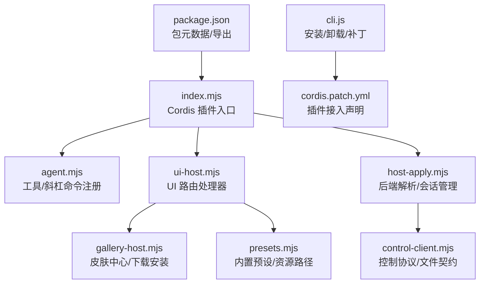
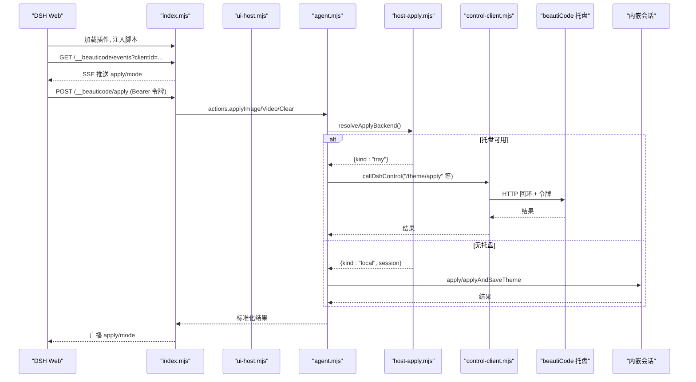
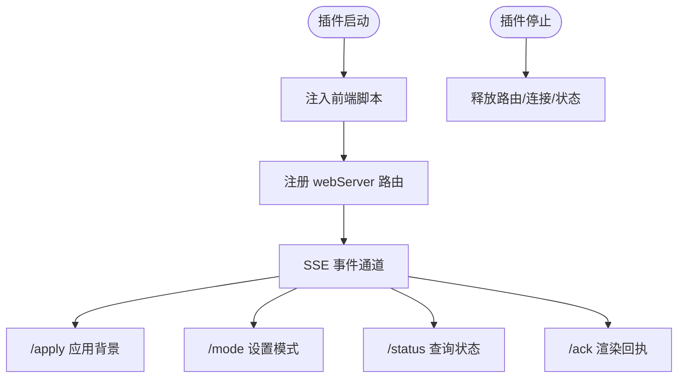
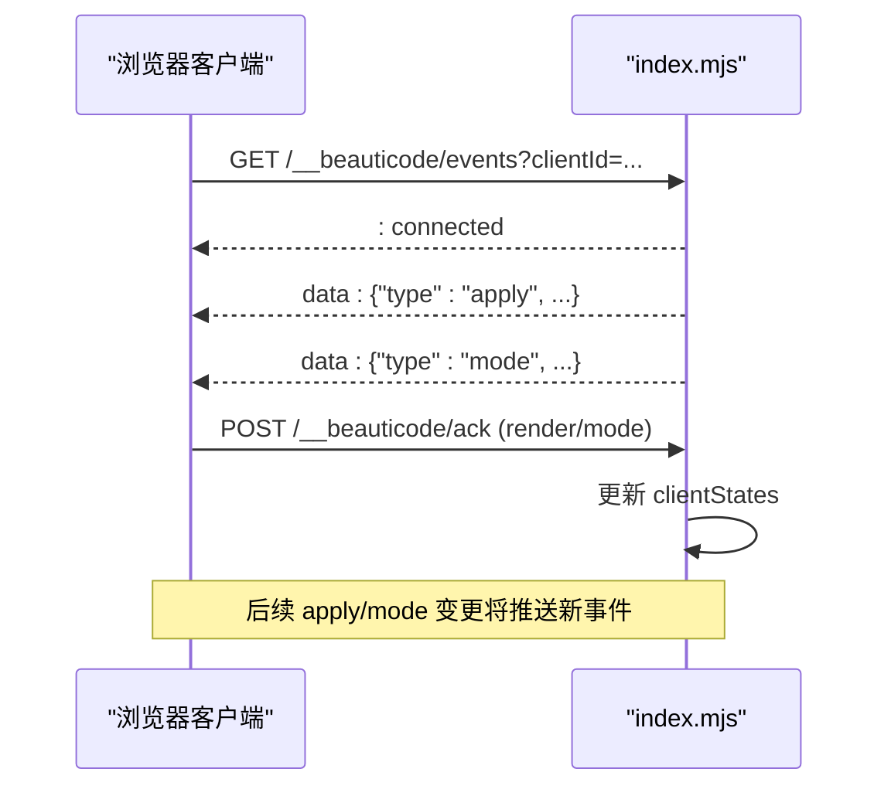
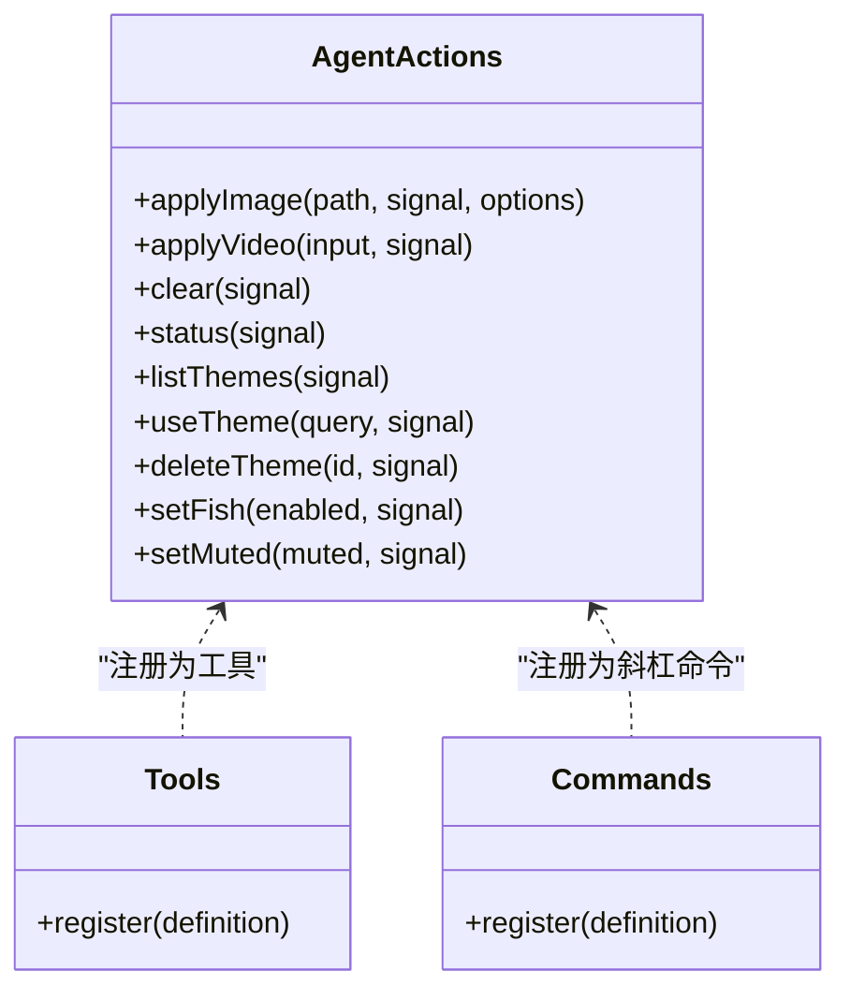
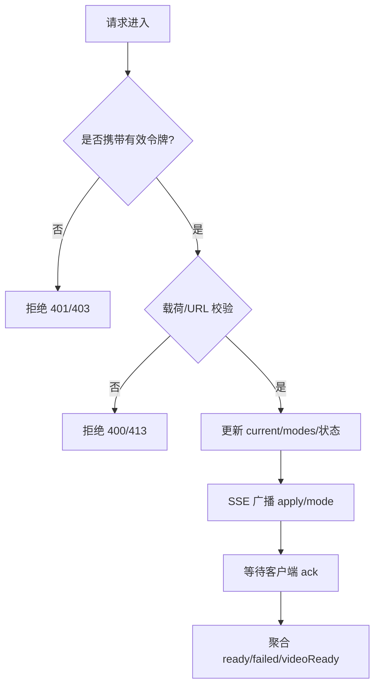
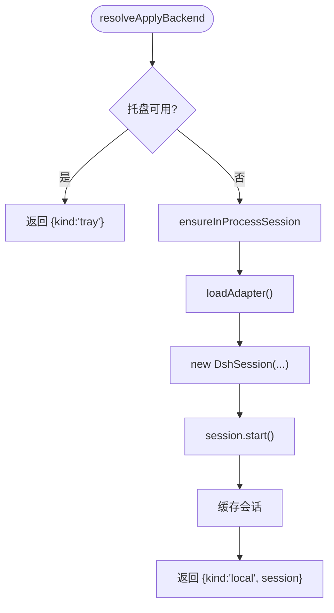
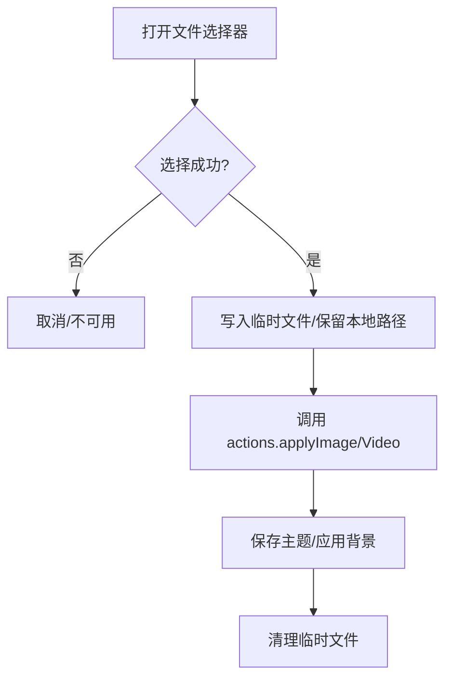
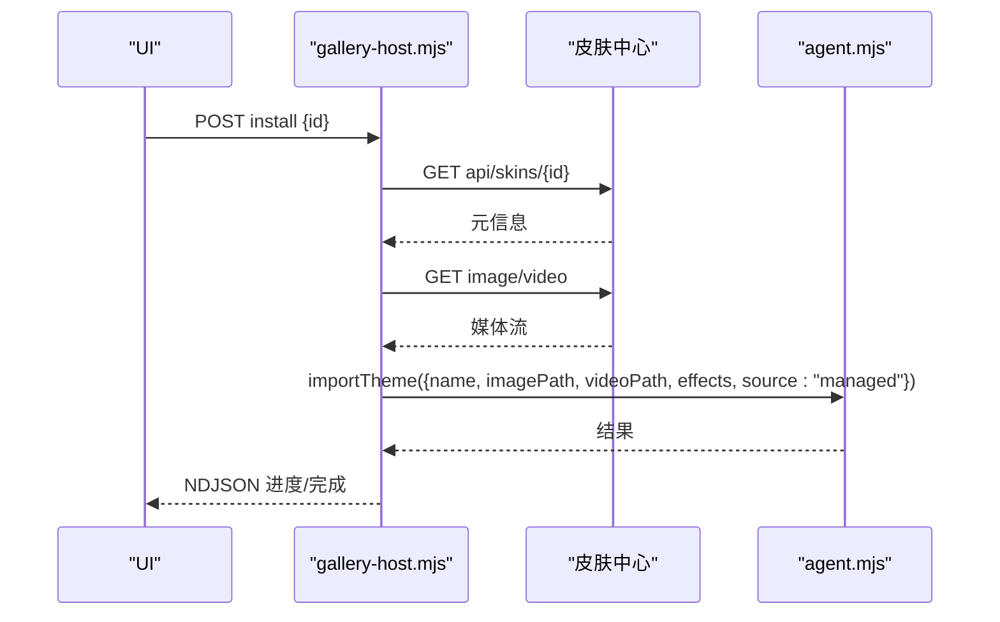
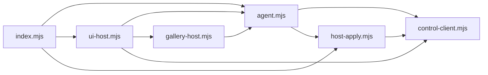

# DeepSeek Harness 适配器

<cite>
**本文引用的文件**
- [index.mjs](file://integrations/deepseek-harness/index.mjs)
- [agent.mjs](file://integrations/deepseek-harness/agent.mjs)
- [ui-host.mjs](file://integrations/deepseek-harness/ui-host.mjs)
- [host-apply.mjs](file://integrations/deepseek-harness/host-apply.mjs)
- [control-client.mjs](file://integrations/deepseek-harness/control-client.mjs)
- [gallery-host.mjs](file://integrations/deepseek-harness/gallery-host.mjs)
- [presets.mjs](file://integrations/deepseek-harness/presets.mjs)
- [cli.js](file://integrations/deepseek-harness/cli.js)
- [package.json](file://integrations/deepseek-harness/package.json)
- [cordis.patch.yml](file://integrations/deepseek-harness/cordis.patch.yml)
- [README.zh-CN.md](file://integrations/deepseek-harness/README.zh-CN.md)
</cite>

## 目录
1. [简介](#简介)
2. [项目结构](#项目结构)
3. [核心组件](#核心组件)
4. [架构总览](#架构总览)
5. [详细组件分析](#详细组件分析)
6. [依赖关系分析](#依赖关系分析)
7. [性能与可靠性](#性能与可靠性)
8. [故障排查指南](#故障排查指南)
9. [结论](#结论)
10. [附录：插件开发与发布流程](#附录：插件开发与发布流程)

## 简介
DeepSeek Harness 适配器（beautiCode DSH 桥接插件）是一个 Cordis 插件，向 DeepSeek Harness Web 注入浏览器端脚本，提供图片/视频背景、主题管理、摸鱼模式、声音控制、皮肤中心安装等能力。它通过本地回环 HTTP 接口与 DSH Web 通信，支持托盘进程或内嵌会话两种后端执行路径，并暴露 CLI 工具用于一键安装/卸载插件、写入补丁和链接依赖。

该插件遵循安全边界：DSH Web 必须绑定本机回环地址；控制端点需要随机令牌；媒体 URL 仅允许带令牌的本地回环地址；浏览器回执只接受同源请求。

**章节来源**
- [README.zh-CN.md:1-49](file://integrations/deepseek-harness/README.zh-CN.md#L1-L49)

## 项目结构
- 插件入口与路由注册：index.mjs
- 代理层与命令/工具注册：agent.mjs
- UI 服务端处理（导入、选择器、主题、画廊）：ui-host.mjs
- 后端解析与生命周期（托盘/内嵌会话切换）：host-apply.mjs
- 控制协议与文件契约（dsh-control/session-host/tray-claim）：control-client.mjs
- 皮肤中心与下载安装：gallery-host.mjs
- 内置预设与资源路径：presets.mjs
- CLI 安装/卸载与补丁写入：cli.js
- 包元数据与导出配置：package.json
- Cordis 插件接入补丁：cordis.patch.yml

**图表来源**
- [index.mjs:1-645](file://integrations/deepseek-harness/index.mjs#L1-L645)
- [agent.mjs:1-781](file://integrations/deepseek-harness/agent.mjs#L1-L781)
- [ui-host.mjs:1-798](file://integrations/deepseek-harness/ui-host.mjs#L1-L798)
- [host-apply.mjs:1-165](file://integrations/deepseek-harness/host-apply.mjs#L1-L165)
- [control-client.mjs:1-517](file://integrations/deepseek-harness/control-client.mjs#L1-L517)
- [gallery-host.mjs:1-352](file://integrations/deepseek-harness/gallery-host.mjs#L1-L352)
- [presets.mjs:1-74](file://integrations/deepseek-harness/presets.mjs#L1-L74)
- [cli.js:1-455](file://integrations/deepseek-harness/cli.js#L1-L455)
- [package.json:1-60](file://integrations/deepseek-harness/package.json#L1-L60)
- [cordis.patch.yml:1-5](file://integrations/deepseek-harness/cordis.patch.yml#L1-L5)

**章节来源**
- [package.json:1-60](file://integrations/deepseek-harness/package.json#L1-L60)
- [cordis.patch.yml:1-5](file://integrations/deepseek-harness/cordis.patch.yml#L1-L5)

## 核心组件
- 插件入口 index.mjs：注册 webServer 钩子，注入前端脚本，提供事件流、状态查询、应用背景、模式设置、回执接收等 API。
- agent.mjs：封装对托盘或内嵌会话的调用，注册 beauticode_* 工具与 /bg* 斜杠命令，统一错误与结果格式。
- ui-host.mjs：实现浏览器侧 UI 的后端处理，包括文件选择器（Windows 原生）、受管上传、主题保存/删除、预设应用、画廊安装。
- host-apply.mjs：决定使用托盘还是内嵌会话，维护会话生命周期，解析插件基础 URL。
- control-client.mjs：定义 dsh-control/session-host/tray-claim 文件契约，校验回环 URL、令牌长度，提供 callDshControl 等网络调用。
- gallery-host.mjs：皮肤中心配置、目录拉取、媒体下载与安装，进度上报与超时保护。
- presets.mjs：内置预设映射、资源路径查找、效果归一化。
- cli.js：一键安装/卸载，写入 cordis.patch.yml，创建符号链接，迁移旧目录，确保引擎存在。

**章节来源**
- [index.mjs:1-645](file://integrations/deepseek-harness/index.mjs#L1-L645)
- [agent.mjs:1-781](file://integrations/deepseek-harness/agent.mjs#L1-L781)
- [ui-host.mjs:1-798](file://integrations/deepseek-harness/ui-host.mjs#L1-L798)
- [host-apply.mjs:1-165](file://integrations/deepseek-harness/host-apply.mjs#L1-L165)
- [control-client.mjs:1-517](file://integrations/deepseek-harness/control-client.mjs#L1-L517)
- [gallery-host.mjs:1-352](file://integrations/deepseek-harness/gallery-host.mjs#L1-L352)
- [presets.mjs:1-74](file://integrations/deepseek-harness/presets.mjs#L1-L74)
- [cli.js:1-455](file://integrations/deepseek-harness/cli.js#L1-L455)

## 架构总览
插件以 Cordis 插件形式注入到 DSH Web 进程中，通过 webServer 钩子挂载路由，向页面注入 client/atmosphere/console/gallery 脚本，建立 SSE 事件通道，实现前后端实时同步。后端根据是否存在运行中的托盘进程，自动选择托盘控制或内嵌会话执行路径。所有跨进程通信均基于本地回环 HTTP + 令牌鉴权。

**图表来源**
- [index.mjs:230-645](file://integrations/deepseek-harness/index.mjs#L230-L645)
- [agent.mjs:176-514](file://integrations/deepseek-harness/agent.mjs#L176-L514)
- [host-apply.mjs:137-165](file://integrations/deepseek-harness/host-apply.mjs#L137-L165)
- [control-client.mjs:463-517](file://integrations/deepseek-harness/control-client.mjs#L463-L517)

## 详细组件分析

### 插件注册与生命周期（Cordis 集成）
- 插件名与注入目标：name="beauticode-bridge"，inject=["webServer"]，bridgeProtocol=4。
- 资源注入：在 HTML </body> 前插入 atmosphere.js、client.js、console.js、gallery.js 脚本。
- 路由注册：版本探测、静态资源、UI 操作、SSE 事件、apply/mode/status/ack 等。
- 清理：effect 返回的 dispose 函数会释放路由、销毁 SSE 连接、清理客户端状态。

**图表来源**
- [index.mjs:204-645](file://integrations/deepseek-harness/index.mjs#L204-L645)

**章节来源**
- [index.mjs:1-645](file://integrations/deepseek-harness/index.mjs#L1-L645)

### 事件系统与状态同步
- SSE 事件：/__beauticode/events 建立连接后，推送初始 apply 与 mode，并在变更时广播。
- 回执机制：/__beauticode/ack 接收客户端 render/mode 回执，聚合 ready/failed/videoReady/playback 等信息。
- 状态计算：publicStatus 汇总当前背景、模式、播放状态、各客户端就绪情况。

**图表来源**
- [index.mjs:432-632](file://integrations/deepseek-harness/index.mjs#L432-L632)

**章节来源**
- [index.mjs:148-202](file://integrations/deepseek-harness/index.mjs#L148-L202)
- [index.mjs:432-632](file://integrations/deepseek-harness/index.mjs#L432-L632)

### Web 端集成方案（侧边栏、命令工具、斜杠命令）
- 侧边栏 UI：通过注入的 console/gallery/client 脚本驱动，调用 /__beauticode/ui/* 系列接口完成导入、选择、主题管理等。
- 工具：注册 beauticode_apply_video、beauticode_apply_image、beauticode_theme_list/use/delete、beauticode_clear/status/set_fish/set_muted。
- 斜杠命令：/bg、/bg-theme、/bg-clear，直接调用 agent 层动作。

**图表来源**
- [agent.mjs:546-751](file://integrations/deepseek-harness/agent.mjs#L546-L751)

**章节来源**
- [agent.mjs:546-751](file://integrations/deepseek-harness/agent.mjs#L546-L751)

### 桥接层工作原理（前后端通信、数据同步、状态管理）
- 鉴权：/apply、/mode、/status 使用 Bearer 令牌校验；/events 与 /ack 限制同源。
- 媒体 URL 校验：仅允许 http 且主机为 127.0.0.1/localhost/[::1]，且查询参数包含令牌。
- 数据持久化：tokenFile 默认位于 BEAUTICODE_DATA_ROOT 或系统用户目录；主题与媒体由托盘/会话管理。
- 状态管理：内存中维护 current、modes、clients、clientStates；SSE 推送变更；ack 收敛客户端反馈。

**图表来源**
- [index.mjs:90-146](file://integrations/deepseek-harness/index.mjs#L90-L146)
- [index.mjs:470-632](file://integrations/deepseek-harness/index.mjs#L470-L632)

**章节来源**
- [index.mjs:90-146](file://integrations/deepseek-harness/index.mjs#L90-L146)
- [index.mjs:470-632](file://integrations/deepseek-harness/index.mjs#L470-L632)

### 后端执行路径（托盘 vs 内嵌会话）
- 优先检测托盘：若存在健康检查可达或 tray-claim 文件，则走托盘控制。
- 否则尝试内嵌会话：加载 adapter-dsh，创建 DshSession，start/stop 管理生命周期。
- 会话缓存：按 dataRoot 键缓存会话，避免重复启动。

**图表来源**
- [host-apply.mjs:73-165](file://integrations/deepseek-harness/host-apply.mjs#L73-L165)

**章节来源**
- [host-apply.mjs:1-165](file://integrations/deepseek-harness/host-apply.mjs#L1-L165)

### UI 处理与文件选择器（Windows 原生）
- Windows 原生选择器：通过 PowerShell + WinForms 弹出对话框，限制超时与父进程退出终止。
- 受管上传：非 Windows 环境允许上传托管副本；Windows 强制本地引用，禁止静默复制。
- 导入流程：选择 -> 临时存储 -> 应用 -> 清理临时文件；记录导入耗时日志。

**图表来源**
- [ui-host.mjs:115-258](file://integrations/deepseek-harness/ui-host.mjs#L115-L258)
- [ui-host.mjs:450-668](file://integrations/deepseek-harness/ui-host.mjs#L450-L668)

**章节来源**
- [ui-host.mjs:115-258](file://integrations/deepseek-harness/ui-host.mjs#L115-L258)
- [ui-host.mjs:450-668](file://integrations/deepseek-harness/ui-host.mjs#L450-L668)

### 皮肤中心与画廊
- 配置：BEAUTICODE_SKIN_CENTER 或 skin-center.json；URL 白名单校验（HTTPS/HTTP 回环）。
- 目录：GET api/catalog，分页 nextCursor。
- 安装：POST 触发下载 image/video，NDJSON 上报进度，最终调用 importTheme 原子保存与应用。

**图表来源**
- [gallery-host.mjs:239-347](file://integrations/deepseek-harness/gallery-host.mjs#L239-L347)
- [agent.mjs:366-400](file://integrations/deepseek-harness/agent.mjs#L366-L400)

**章节来源**
- [gallery-host.mjs:1-352](file://integrations/deepseek-harness/gallery-host.mjs#L1-L352)
- [agent.mjs:366-400](file://integrations/deepseek-harness/agent.mjs#L366-L400)

## 依赖关系分析
- 插件入口依赖 agent、host-apply、ui-host、presets。
- agent 依赖 control-client、host-apply、presets。
- ui-host 依赖 agent、control-client、gallery-host、host-apply。
- host-apply 依赖 control-client、presets。
- gallery-host 独立，依赖 agent.importTheme。
- cli 独立，负责文件系统与补丁写入。

**图表来源**
- [index.mjs:1-645](file://integrations/deepseek-harness/index.mjs#L1-L645)
- [agent.mjs:1-781](file://integrations/deepseek-harness/agent.mjs#L1-L781)
- [ui-host.mjs:1-798](file://integrations/deepseek-harness/ui-host.mjs#L1-L798)
- [host-apply.mjs:1-165](file://integrations/deepseek-harness/host-apply.mjs#L1-L165)
- [control-client.mjs:1-517](file://integrations/deepseek-harness/control-client.mjs#L1-L517)
- [gallery-host.mjs:1-352](file://integrations/deepseek-harness/gallery-host.mjs#L1-L352)

**章节来源**
- [index.mjs:1-645](file://integrations/deepseek-harness/index.mjs#L1-L645)
- [agent.mjs:1-781](file://integrations/deepseek-harness/agent.mjs#L1-L781)
- [ui-host.mjs:1-798](file://integrations/deepseek-harness/ui-host.mjs#L1-L798)
- [host-apply.mjs:1-165](file://integrations/deepseek-harness/host-apply.mjs#L1-L165)
- [control-client.mjs:1-517](file://integrations/deepseek-harness/control-client.mjs#L1-L517)
- [gallery-host.mjs:1-352](file://integrations/deepseek-harness/gallery-host.mjs#L1-L352)

## 性能与可靠性
- 传输限制：请求体最大 64KB；图片最大 18MB；视频最大 800MB；下载限速与进度节流。
- 超时保护：文件选择器默认 5 分钟；导入重放最长 60 秒；画廊安装最长 30 分钟；控制调用默认 180 秒。
- 健壮性：托盘启动中延迟重试；会话缓存避免重复启动；临时文件清理；异常路径记录导入耗时。
- 安全：同源校验、令牌校验、回环 URL 白名单、最小权限读取。

[本节为通用指导，不直接分析具体文件]

## 故障排查指南
- 未授权：检查 Authorization 头与 token 文件内容是否匹配。
- 载荷无效：确认 media/imageUrl/videoUrl/startAt/atmosphere 字段符合约束。
- 托盘缺失：确认 BEAUTICODE_DATA_ROOT 下 dsh-control.json 存在且 PID 存活。
- 托盘启动中：等待 tray-claim 释放或健康检查可达后再试。
- 文件选择器不可用：Windows 需 PowerShell/WinForms；非 Windows 可启用受管上传。
- 皮肤中心不可达：检查 BEAUTICODE_SKIN_CENTER 或 skin-center.json 配置与网络连通。

**章节来源**
- [index.mjs:90-146](file://integrations/deepseek-harness/index.mjs#L90-L146)
- [control-client.mjs:463-517](file://integrations/deepseek-harness/control-client.mjs#L463-L517)
- [ui-host.mjs:450-668](file://integrations/deepseek-harness/ui-host.mjs#L450-L668)
- [gallery-host.mjs:239-347](file://integrations/deepseek-harness/gallery-host.mjs#L239-L347)

## 结论
DeepSeek Harness 适配器通过 Cordis 插件机制无缝嵌入 DSH Web，提供安全的本地回环通信、灵活的后端执行路径与丰富的 UI 能力。其设计强调安全边界、健壮性与可观测性，适合在生产环境中稳定运行。CLI 简化了安装与卸载流程，便于快速集成与维护。

[本节为总结，不直接分析具体文件]

## 附录：插件开发与发布流程
- 开发要点
  - 保持 index.mjs 的 inject 与路由兼容；新增 API 需进行同源与载荷校验。
  - 工具与命令注册应容错，单个失败不影响其他注册。
  - 媒体路径与 URL 严格校验，避免任意文件访问。
  - 托盘/内嵌会话切换逻辑需考虑健康检查与超时。
- 安装与集成
  - 使用 CLI 一键安装：npx beauticode-dsh；或手动添加 cordis.patch.yml 并链接依赖。
  - 确保 DSH 与 beautiCode 共享 BEAUTICODE_DATA_ROOT。
  - 运行 npx @deepseek-ai/dsh web 加载插件。
- 发布流程
  - 更新 package.json 版本号与关键字；确保 exports/main/bin 正确。
  - 打包产物包含 vendor/adapter-dsh 引擎与必要资源。
  - 通过 npm 发布或使用 GitHub Actions 工作流自动化发布。

**章节来源**
- [cli.js:362-402](file://integrations/deepseek-harness/cli.js#L362-L402)
- [package.json:1-60](file://integrations/deepseek-harness/package.json#L1-L60)
- [README.zh-CN.md:11-46](file://integrations/deepseek-harness/README.zh-CN.md#L11-L46)