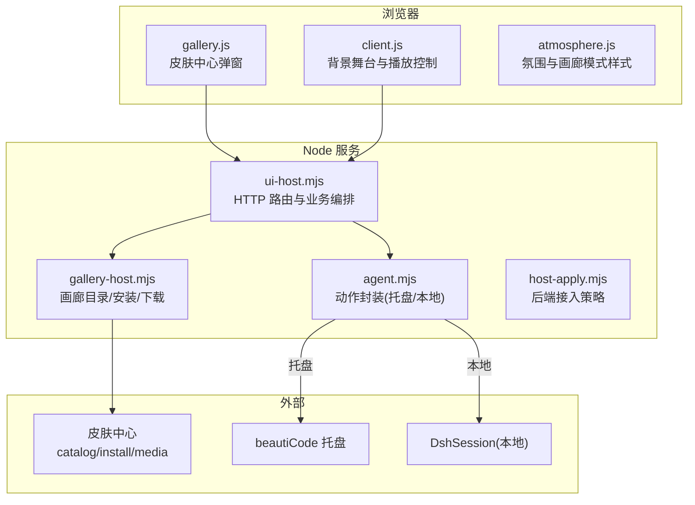
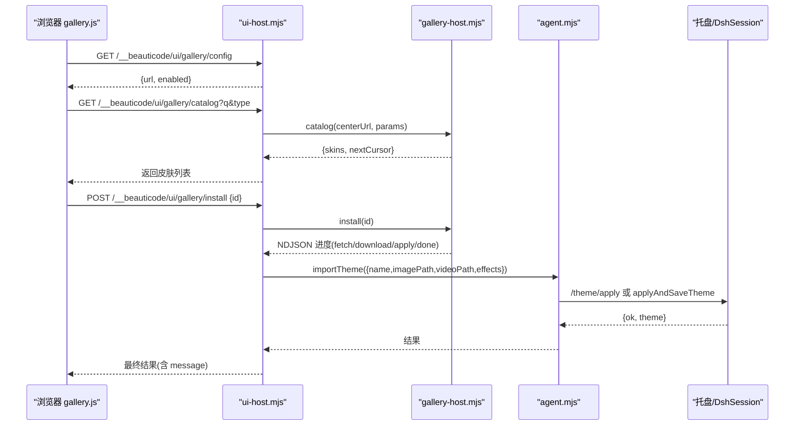
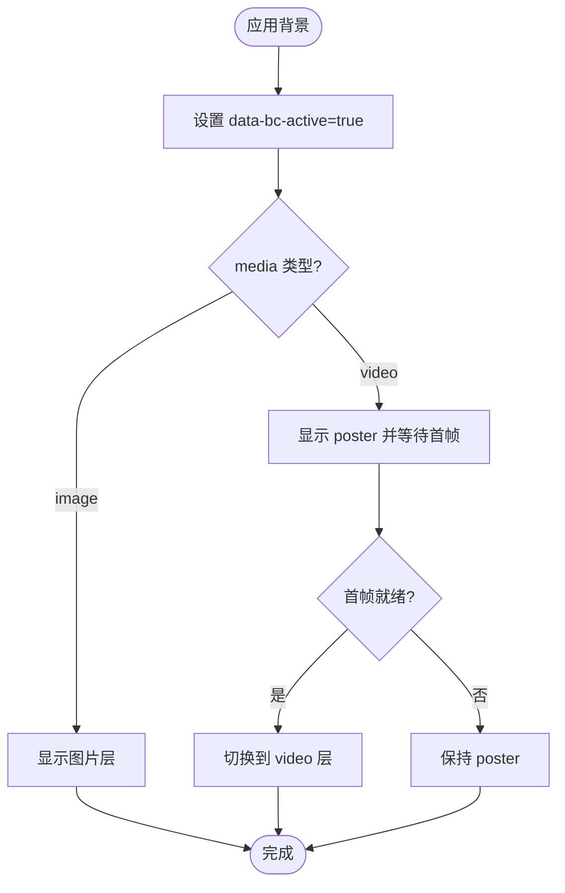
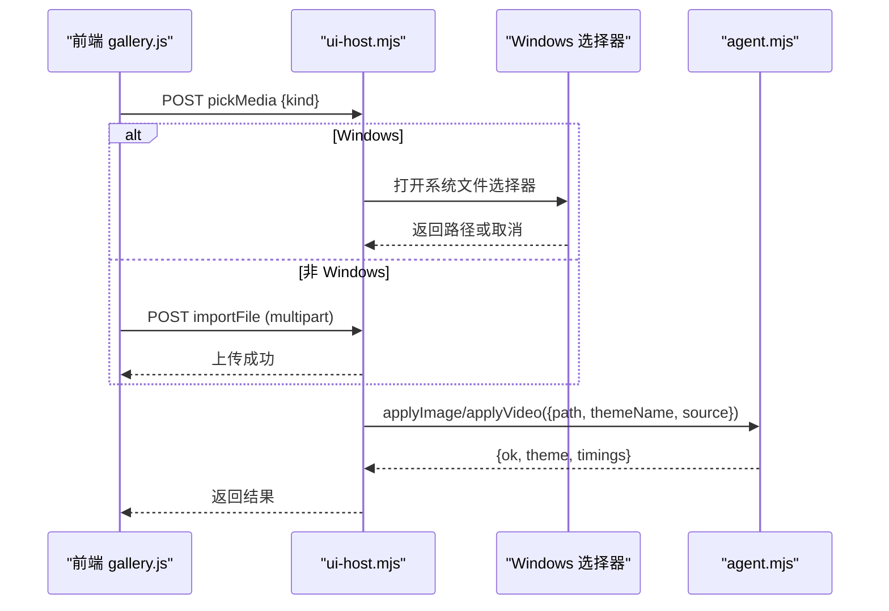
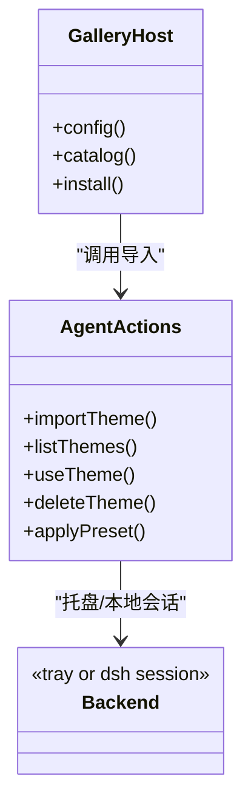
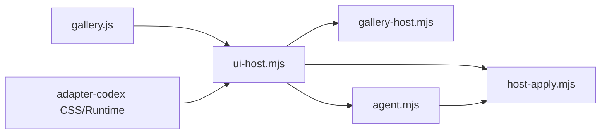

# Web 端集成

<cite>
**本文引用的文件**
- [gallery-host.mjs](file://integrations/deepseek-harness/gallery-host.mjs)
- [ui-host.mjs](file://integrations/deepseek-harness/ui-host.mjs)
- [gallery.js](file://integrations/deepseek-harness/gallery.js)
- [skin-center.json](file://integrations/deepseek-harness/skin-center.json)
- [agent.mjs](file://integrations/deepseek-harness/agent.mjs)
- [host-apply.mjs](file://integrations/deepseek-harness/host-apply.mjs)
- [host-adapter.md](file://docs/host-adapter.md)
- [background.css](file://packages/adapter-codex/src/renderer/background.css)
- [background-runtime.js](file://packages/adapter-codex/src/renderer/background-runtime.js)
- [client.js](file://integrations/deepseek-harness/client.js)
- [atmosphere.js](file://integrations/deepseek-harness/atmosphere.js)
</cite>

## 目录
1. [简介](#简介)
2. [项目结构](#项目结构)
3. [核心组件](#核心组件)
4. [架构总览](#架构总览)
5. [详细组件分析](#详细组件分析)
6. [依赖关系分析](#依赖关系分析)
7. [性能考量](#性能考量)
8. [故障排查指南](#故障排查指南)
9. [结论](#结论)
10. [附录：前端自定义与样式覆盖指南](#附录：前端自定义与样式覆盖指南)

## 简介
本文件面向需要在 Web 端集成 beautiCode 背景能力的开发者，系统性说明侧边栏组件的实现原理（UI 渲染、用户交互、状态同步）、画廊宿主的工作方式（媒体展示、预览、选择逻辑），以及皮肤中心的数据结构与主题切换机制。文档同时提供前端组件的自定义方法与样式覆盖建议，帮助你在不侵入宿主应用的前提下完成集成与定制。

## 项目结构
Web 端集成的关键模块分布在 deepseek-harness 与 adapter-codex 中：
- UI 层：gallery.js 提供“皮肤中心”弹窗面板；client.js 负责注入背景舞台与运行时；atmosphere.js 提供氛围效果与画廊模式样式。
- 后端服务：ui-host.mjs 暴露 HTTP API（状态、导入、选择、主题管理、画廊接口）；gallery-host.mjs 实现画廊宿主的目录拉取、安装流与下载限速；agent.mjs 封装对托盘或本地会话的调用；host-apply.mjs 负责后端接入策略与生命周期。
- 宿主适配：adapter-codex 通过 CSS 与运行时属性控制侧边栏、主内容区的透明与遮罩，确保背景可见且不影响交互。

图表来源
- [gallery.js:1-201](file://integrations/deepseek-harness/gallery.js#L1-L201)
- [ui-host.mjs:302-798](file://integrations/deepseek-harness/ui-host.mjs#L302-L798)
- [gallery-host.mjs:163-349](file://integrations/deepseek-harness/gallery-host.mjs#L163-L349)
- [agent.mjs:176-514](file://integrations/deepseek-harness/agent.mjs#L176-L514)
- [host-apply.mjs:137-165](file://integrations/deepseek-harness/host-apply.mjs#L137-L165)

章节来源
- [gallery.js:1-201](file://integrations/deepseek-harness/gallery.js#L1-L201)
- [ui-host.mjs:302-798](file://integrations/deepseek-harness/ui-host.mjs#L302-L798)
- [gallery-host.mjs:163-349](file://integrations/deepseek-harness/gallery-host.mjs#L163-L349)
- [agent.mjs:176-514](file://integrations/deepseek-harness/agent.mjs#L176-L514)
- [host-apply.mjs:137-165](file://integrations/deepseek-harness/host-apply.mjs#L137-L165)

## 核心组件
- 侧边栏与背景舞台：通过宿主适配层的 CSS 将左侧边栏与主内容区设置为半透明，使固定定位的背景舞台可见且不干扰交互。
- 皮肤中心弹窗：gallery.js 提供搜索、类型筛选、卡片网格、安装进度与消息提示，并通过 NDJSON 流式读取安装进度。
- 画廊宿主：gallery-host.mjs 提供配置、目录、安装三个接口，负责安全校验、远程下载、大小限制、NDJSON 进度上报与原子化主题应用。
- 动作封装：agent.mjs 统一图片/视频/主题/静音/摸鱼等动作，自动选择托盘或本地会话执行。
- 后端接入策略：host-apply.mjs 检测托盘是否存活，优先走托盘，否则启动本地会话并缓存。

章节来源
- [background.css:160-200](file://packages/adapter-codex/src/renderer/background.css#L160-L200)
- [gallery.js:1-201](file://integrations/deepseek-harness/gallery.js#L1-L201)
- [gallery-host.mjs:163-349](file://integrations/deepseek-harness/gallery-host.mjs#L163-L349)
- [agent.mjs:176-514](file://integrations/deepseek-harness/agent.mjs#L176-L514)
- [host-apply.mjs:137-165](file://integrations/deepseek-harness/host-apply.mjs#L137-L165)

## 架构总览
Web 端集成由“浏览器脚本 + Node 服务 + 宿主适配”三层组成：
- 浏览器脚本在页面注入背景舞台与氛围样式，监听数据属性变化以切换显示与交互。
- Node 服务暴露 REST 接口，处理文件选择、上传、主题列表、画廊目录与安装流程。
- 宿主适配层通过 CSS 与 DOM 属性协调背景与宿主 UI 的层级与透明度，保证可访问性与一致性。

图表来源
- [gallery.js:109-191](file://integrations/deepseek-harness/gallery.js#L109-L191)
- [ui-host.mjs:761-771](file://integrations/deepseek-harness/ui-host.mjs#L761-L771)
- [gallery-host.mjs:185-349](file://integrations/deepseek-harness/gallery-host.mjs#L185-L349)
- [agent.mjs:366-400](file://integrations/deepseek-harness/agent.mjs#L366-L400)

## 详细组件分析

### 侧边栏组件：UI 渲染、用户交互与状态同步
- UI 渲染
  - 通过宿主适配层 CSS 将左侧边栏与主内容区设为半透明渐变，确保背景可见且文字可读。
  - 使用 data-bc-* 属性驱动显示逻辑：data-bc-active 表示已应用背景，data-bc-media 区分 image/video/clear，data-bc-video-ready 控制视频就绪态。
- 用户交互
  - 背景舞台设置 pointer-events: none，避免拦截宿主点击事件。
  - 摸鱼模式通过 data-bc-fish 隐藏宿主界面，仅保留背景。
- 状态同步
  - client.js 根据后端下发的 payload 更新 data-bc-* 属性，触发 CSS 切换。
  - 运行时维护 generation 与 media 句柄，确保异步回调不会应用到过期帧。

图表来源
- [background-runtime.js:771-796](file://packages/adapter-codex/src/renderer/background-runtime.js#L771-L796)
- [client.js:1140-1176](file://integrations/deepseek-harness/client.js#L1140-L1176)
- [background.css:160-200](file://packages/adapter-codex/src/renderer/background.css#L160-L200)

章节来源
- [background.css:160-200](file://packages/adapter-codex/src/renderer/background.css#L160-L200)
- [background-runtime.js:771-796](file://packages/adapter-codex/src/renderer/background-runtime.js#L771-L796)
- [client.js:1140-1176](file://integrations/deepseek-harness/client.js#L1140-L1176)

### 画廊宿主：媒体展示、预览与选择逻辑
- 媒体展示与预览
  - 目录接口返回 skins 列表，前端按 id 安全校验后渲染卡片缩略图与名称。
  - 安装过程通过 NDJSON 流式上报 fetch/download/apply/done 阶段与进度百分比。
- 选择逻辑
  - Windows 原生文件选择器：构建 PowerShell 脚本弹出系统对话框，支持图片与 MP4，超时与进程守护。
  - 受管上传：在非 Windows 平台允许直接上传到服务端，经大小限制与临时文件处理后调用动作层应用。
- 安全与健壮性
  - 皮肤 ID 白名单校验、URL origin 校验、文件大小上限、客户端断开时取消下载。

图表来源
- [ui-host.mjs:531-668](file://integrations/deepseek-harness/ui-host.mjs#L531-L668)
- [ui-host.mjs:450-529](file://integrations/deepseek-harness/ui-host.mjs#L450-L529)
- [agent.mjs:190-328](file://integrations/deepseek-harness/agent.mjs#L190-L328)

章节来源
- [ui-host.mjs:531-668](file://integrations/deepseek-harness/ui-host.mjs#L531-L668)
- [ui-host.mjs:450-529](file://integrations/deepseek-harness/ui-host.mjs#L450-L529)
- [agent.mjs:190-328](file://integrations/deepseek-harness/agent.mjs#L190-L328)

### 皮肤中心：数据结构与主题切换机制
- 数据结构
  - skin-center.json 定义皮肤中心 URL。
  - 目录接口返回 skins 数组，每个元素包含 id、name、type 等字段；前端需校验 id 格式。
- 主题切换机制
  - 安装流程：获取元信息 -> 下载图片/视频 -> 调用 importTheme 原子保存与应用 -> 通知计数与统计。
  - 主题列表与使用：通过 agent.mjs 的 listThemes/useTheme/deleteTheme 与托盘或本地会话交互。
  - 内置预设：applyPreset 快速应用内置氛围主题并设置色调。

图表来源
- [gallery-host.mjs:163-349](file://integrations/deepseek-harness/gallery-host.mjs#L163-L349)
- [agent.mjs:366-464](file://integrations/deepseek-harness/agent.mjs#L366-L464)
- [skin-center.json:1-4](file://integrations/deepseek-harness/skin-center.json#L1-L4)

章节来源
- [gallery-host.mjs:163-349](file://integrations/deepseek-harness/gallery-host.mjs#L163-L349)
- [agent.mjs:366-464](file://integrations/deepseek-harness/agent.mjs#L366-L464)
- [skin-center.json:1-4](file://integrations/deepseek-harness/skin-center.json#L1-L4)

### 前端组件：自定义方法与样式覆盖指南
- 自定义方法
  - 暴露全局对象 window.BeauticodeGallery，提供 open/close 控制弹窗。
  - 可通过 dispatchEvent("beauticode-gallery-installed") 监听安装完成事件。
- 样式覆盖
  - 弹窗容器 #beauticode-gallery 与内部 .bcg-panel/.bcg-grid/.bcg-card 等类名便于覆盖。
  - 主题明暗通过 body[data-ds-dark-theme] 切换，可在不同主题下调整颜色与边框。
  - 画廊模式下 atmosphere.js 会注入额外样式以增强背景可见性与透明度。
- 注意事项
  - 避免修改宿主 composer、工具栏等高优先级区域。
  - 遵循宿主适配契约：只操作 #beauticode-bg-stage 及其后代，保持 pointer-events: none。

章节来源
- [gallery.js:6-41](file://integrations/deepseek-harness/gallery.js#L6-L41)
- [gallery.js:159-199](file://integrations/deepseek-harness/gallery.js#L159-L199)
- [atmosphere.js:75-98](file://integrations/deepseek-harness/atmosphere.js#L75-L98)
- [host-adapter.md:18-67](file://docs/host-adapter.md#L18-L67)

## 依赖关系分析
- ui-host.mjs 依赖 gallery-host.mjs 提供画廊能力，依赖 agent.mjs 封装动作，依赖 host-apply.mjs 决定后端接入策略。
- agent.mjs 依赖 control-client.mjs 与 host-apply.mjs 进行托盘/本地会话通信。
- 前端 gallery.js 依赖 ui-host.mjs 暴露的 /__beauticode/ui/gallery/* 接口。
- 宿主适配层 background.css 与 background-runtime.js 通过 data-bc-* 属性与宿主 UI 协同。

图表来源
- [ui-host.mjs:302-798](file://integrations/deepseek-harness/ui-host.mjs#L302-L798)
- [agent.mjs:176-514](file://integrations/deepseek-harness/agent.mjs#L176-L514)
- [host-apply.mjs:137-165](file://integrations/deepseek-harness/host-apply.mjs#L137-L165)

章节来源
- [ui-host.mjs:302-798](file://integrations/deepseek-harness/ui-host.mjs#L302-L798)
- [agent.mjs:176-514](file://integrations/deepseek-harness/agent.mjs#L176-L514)
- [host-apply.mjs:137-165](file://integrations/deepseek-harness/host-apply.mjs#L137-L165)

## 性能考量
- 下载节流：gallery-host.mjs 在下载过程中每 250ms 或 1MiB 上报一次进度，避免频繁 DOM 写入。
- 大小限制：图片与视频分别有最大字节限制，防止内存与磁盘压力。
- 超时控制：安装与请求均设置超时信号，避免长时间阻塞。
- 资源复用：本地会话与会话缓存减少重复启动开销。
- 首帧优化：client.js 预热媒体栈，确保首次播放更快。

[本节为通用指导，无需特定文件引用]

## 故障排查指南
- 无法连接皮肤中心
  - 检查 BEAUTICODE_SKIN_CENTER 或 skin-center.json 配置是否正确。
  - 确认网络可达与协议为 http/https，且非危险端口。
- 文件选择器不可用
  - Windows 环境需要 PowerShell 与 System.Windows.Forms；若缺失则回退到受管上传或提示错误。
- 安装失败或进度中断
  - 查看 NDJSON 流中的 phase 与 error 字段；检查客户端是否提前断开导致 abort。
- 背景未生效或闪烁
  - 检查 data-bc-active/data-bc-media/data-bc-video-ready 属性是否正确设置；确认宿主适配 CSS 未被覆盖。
- 声音被阻止
  - 浏览器策略可能阻止自动播放；通过 setMuted 控制默认静音，并在用户交互后尝试开启。

章节来源
- [gallery-host.mjs:239-349](file://integrations/deepseek-harness/gallery-host.mjs#L239-L349)
- [ui-host.mjs:531-591](file://integrations/deepseek-harness/ui-host.mjs#L531-L591)
- [agent.mjs:487-514](file://integrations/deepseek-harness/agent.mjs#L487-L514)
- [background-runtime.js:771-796](file://packages/adapter-codex/src/renderer/background-runtime.js#L771-L796)

## 结论
本集成方案通过前后端协作与宿主适配，实现了安全的皮肤中心浏览与安装、稳定的媒体展示与预览、灵活的侧边栏与主内容区透明化，以及一致的状态同步机制。借助 NDJSON 进度、大小限制与超时控制，系统在复杂网络环境下仍具备良好鲁棒性。开发者可按需覆盖样式与扩展行为，在不破坏宿主体验的前提下完成深度定制。

[本节为总结性内容，无需特定文件引用]

## 附录：前端自定义与样式覆盖指南
- 弹窗容器与布局
  - #beauticode-gallery 作为全屏遮罩，.bcg-panel 为面板主体，.bcg-grid 为卡片网格。
  - 可通过 CSS 调整 grid-template-columns、gap、border-radius 等以匹配你的设计语言。
- 主题明暗适配
  - 使用 body[data-ds-dark-theme] 选择器在不同主题下覆盖颜色与边框。
  - 画廊模式下的透明度与混合模式由 atmosphere.js 注入，必要时可覆盖相关变量。
- 交互扩展
  - 监听 beauticode-gallery-installed 事件以在安装完成后执行后续逻辑。
  - 通过 window.BeauticodeGallery.open/close 控制弹窗显隐。
- 安全与兼容性
  - 不要重写宿主的高优先级样式（如 composer、工具栏）。
  - 保持背景舞台 pointer-events: none，避免拦截宿主交互。

章节来源
- [gallery.js:6-41](file://integrations/deepseek-harness/gallery.js#L6-L41)
- [gallery.js:159-199](file://integrations/deepseek-harness/gallery.js#L159-L199)
- [atmosphere.js:75-98](file://integrations/deepseek-harness/atmosphere.js#L75-L98)
- [host-adapter.md:18-67](file://docs/host-adapter.md#L18-L67)