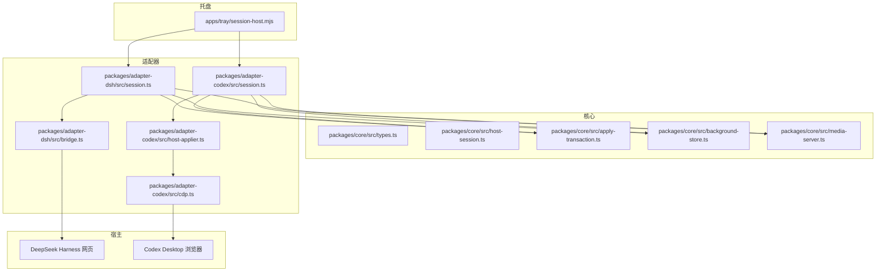
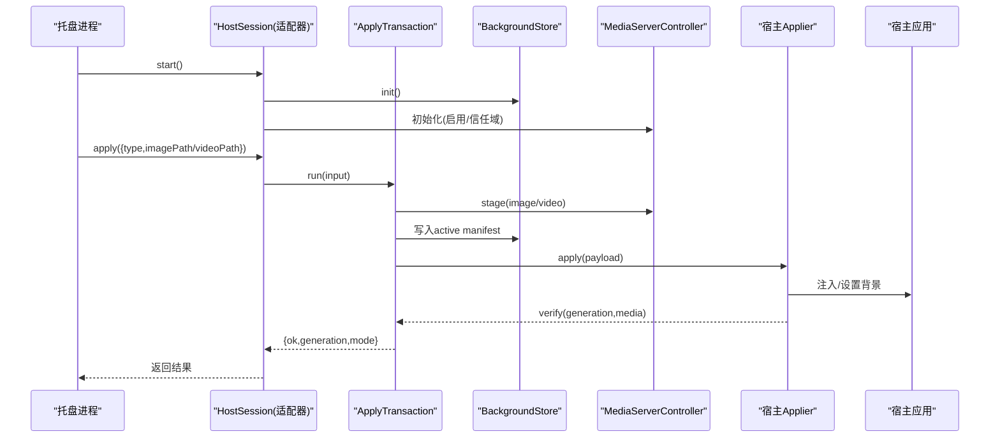
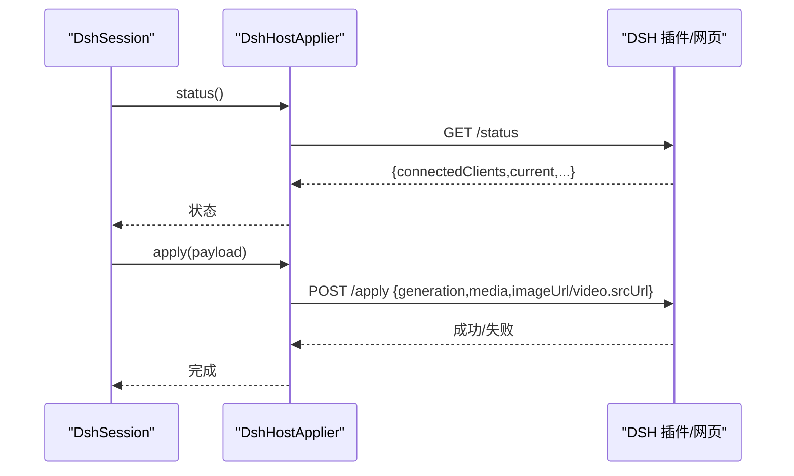
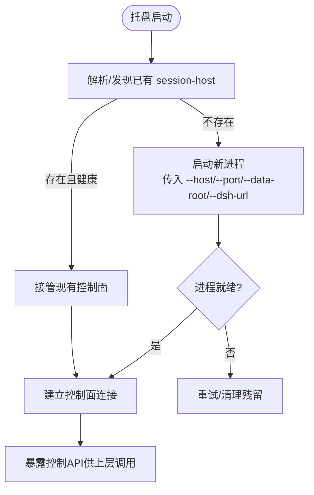
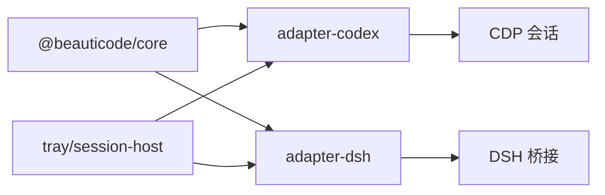

# 适配器开发指南

<cite>
**本文引用的文件**
- [packages/core/src/host-session.ts](file://packages/core/src/host-session.ts)
- [packages/core/src/apply-transaction.ts](file://packages/core/src/apply-transaction.ts)
- [packages/core/src/background-store.ts](file://packages/core/src/background-store.ts)
- [packages/core/src/media-server.ts](file://packages/core/src/media-server.ts)
- [packages/core/src/types.ts](file://packages/core/src/types.ts)
- [packages/adapter-codex/src/session.ts](file://packages/adapter-codex/src/session.ts)
- [packages/adapter-codex/src/host-applier.ts](file://packages/adapter-codex/src/host-applier.ts)
- [packages/adapter-codex/src/cdp.ts](file://packages/adapter-codex/src/cdp.ts)
- [packages/adapter-dsh/src/session.ts](file://packages/adapter-dsh/src/session.ts)
- [packages/adapter-dsh/src/bridge.ts](file://packages/adapter-dsh/src/bridge.ts)
- [packages/adapter-dsh/src/host-descriptor.ts](file://packages/adapter-dsh/src/host-descriptor.ts)
- [apps/tray/session-host.mjs](file://apps/tray/session-host.mjs)
- [scripts/start-beauticode-engine.ps1](file://scripts/start-beauticode-engine.ps1)
- [integrations/deepseek-harness/control-client.mjs](file://integrations/deepseek-harness/control-client.mjs)
- [docs/host-adapter.md](file://docs/host-adapter.md)
- [README.md](file://README.md)
- [packages/adapter-codex/test/adapter.test.js](file://packages/adapter-codex/test/adapter.test.js)
- [packages/adapter-dsh/test/session-host.test.js](file://packages/adapter-dsh/test/session-host.test.js)
</cite>

## 目录
1. [简介](#简介)
2. [项目结构](#项目结构)
3. [核心组件](#核心组件)
4. [架构总览](#架构总览)
5. [详细组件分析](#详细组件分析)
6. [依赖关系分析](#依赖关系分析)
7. [性能与稳定性](#性能与稳定性)
8. [测试策略与用例编写](#测试策略与用例编写)
9. [调试与常见问题排查](#调试与常见问题排查)
10. [发布与维护最佳实践](#发布与维护最佳实践)
11. [完整示例与参考实现](#完整示例与参考实现)
12. [结论](#结论)

## 简介
本指南面向希望为 beautiCode 新增宿主应用适配的开发者。文档从环境搭建、项目结构与依赖配置入手，系统讲解 HostSession 接口实现规范（必需方法、可选能力、错误处理），并给出测试策略（单元、集成、端到端）、调试技巧、常见问题定位方法，以及适配器发布与维护的最佳实践。文中所有技术细节均基于仓库现有实现，确保可落地、可验证。

## 项目结构
beautiCode 采用多包 monorepo 组织：
- packages/core：通用能力（事务化应用、背景存储、媒体服务、类型定义等）
- packages/adapter-codex：Codex Desktop 适配器（CDP 注入、页面发现、渲染器注入）
- packages/adapter-dsh：DeepSeek Harness 适配器（HTTP 桥接、令牌鉴权、主题保存）
- apps/tray：托盘进程，负责会话主机生命周期、控制面 API、与宿主通信
- integrations/deepseek-harness：DSH 插件与控制客户端
- scripts：Windows 脚本（CDP 探测、安装、打包等）
- docs：适配器契约与使用说明



图表来源
- [apps/tray/session-host.mjs:149-197](file://apps/tray/session-host.mjs#L149-L197)
- [packages/core/src/types.ts](file://packages/core/src/types.ts)
- [packages/core/src/host-session.ts](file://packages/core/src/host-session.ts)
- [packages/core/src/apply-transaction.ts](file://packages/core/src/apply-transaction.ts)
- [packages/core/src/background-store.ts](file://packages/core/src/background-store.ts)
- [packages/core/src/media-server.ts](file://packages/core/src/media-server.ts)
- [packages/adapter-codex/src/session.ts:1-800](file://packages/adapter-codex/src/session.ts#L1-L800)
- [packages/adapter-codex/src/host-applier.ts:233-286](file://packages/adapter-codex/src/host-applier.ts#L233-L286)
- [packages/adapter-codex/src/cdp.ts:199-238](file://packages/adapter-codex/src/cdp.ts#L199-L238)
- [packages/adapter-dsh/src/session.ts:1-675](file://packages/adapter-dsh/src/session.ts#L1-L675)
- [packages/adapter-dsh/src/bridge.ts:85-124](file://packages/adapter-dsh/src/bridge.ts#L85-L124)

章节来源
- [README.md:19-166](file://README.md#L19-L166)
- [apps/tray/session-host.mjs:149-197](file://apps/tray/session-host.mjs#L149-L197)

## 核心组件
- HostSession 接口：统一会话抽象，包含 start/stop、apply/reapply/save/use/list/delete theme、status、setFishMode/setMuted/setBackgroundTone 等能力。
- ApplyTransaction：将“选择媒体→生成载荷→写入存储→调用宿主→校验”封装为原子事务，支持回滚与超时。
- BackgroundStore：管理 active 主题、已保存主题、视频进度等持久化数据。
- MediaServerController：本地媒体服务器，提供图片/视频的 staging、commit、abort 与 URL 暴露。
- 适配器 Session：实现 HostSession，协调 Store/Media/Applier，维护 watch 循环、状态与错误上报。
- 宿主 Applier：具体宿主接入层（CDP 注入或 HTTP 桥接）。

章节来源
- [packages/core/src/host-session.ts](file://packages/core/src/host-session.ts)
- [packages/core/src/apply-transaction.ts](file://packages/core/src/apply-transaction.ts)
- [packages/core/src/background-store.ts](file://packages/core/src/background-store.ts)
- [packages/core/src/media-server.ts](file://packages/core/src/media-server.ts)
- [packages/core/src/types.ts](file://packages/core/src/types.ts)

## 架构总览
适配器通过统一的 HostSession 暴露能力，内部由 ApplyTransaction 驱动一次完整的背景应用流程；Codex 路径通过 CDP 注入渲染器，DSH 路径通过 HTTP 桥接与 DSH 插件通信。托盘进程负责启动/接管 session-host，并提供控制面 API。



图表来源
- [packages/core/src/apply-transaction.ts](file://packages/core/src/apply-transaction.ts)
- [packages/core/src/background-store.ts](file://packages/core/src/background-store.ts)
- [packages/core/src/media-server.ts](file://packages/core/src/media-server.ts)
- [packages/adapter-codex/src/session.ts:275-332](file://packages/adapter-codex/src/session.ts#L275-L332)
- [packages/adapter-dsh/src/session.ts:164-264](file://packages/adapter-dsh/src/session.ts#L164-L264)
- [packages/adapter-codex/src/host-applier.ts:243-286](file://packages/adapter-codex/src/host-applier.ts#L243-L286)
- [packages/adapter-dsh/src/bridge.ts:115-124](file://packages/adapter-dsh/src/bridge.ts#L115-L124)

## 详细组件分析

### Codex 适配器（CDP 注入）
- 会话类 BeautiSession：实现 HostSession，负责 CDP 端口发现、连接、注入锁、watch 循环、fish/mode/tone 管理、主题保存与恢复。
- 宿主应用层 CodexHostApplier：通过 CDP 发现目标页、注入渲染器、队列化 apply、重连与身份变更处理。
- CDP 会话：最小化 WebSocket 会话，带超时与命令队列。

```mermaid
classDiagram
class BeautiSession {
+start() Promise~{port}~
+apply(input) Promise~ApplyResult~
+reapply() Promise~ApplyResult~
+saveCurrentTheme(name) Promise~SavedThemeInfo~
+useSavedTheme(themeId) Promise~ApplyResult~
+listSavedThemes() Promise~SavedThemeInfo[]~
+deleteSavedTheme(id) Promise~boolean~
+setFishMode(enabled) Promise~{ok,fish,sessions,error?}~
+setMuted(muted) Promise~{ok,muted,blocked,sessions,error?}~
+setBackgroundTone(tone) Promise~{ok,tone,sessions,error?}~
+status() Promise~HostSessionStatus~
+stop() Promise~void~
}
class CodexHostApplier {
+connect() Promise~ConnectedTarget[]~
+apply(payload) Promise~void~
+verify(expected,opts) Promise~VerifyResult~
+setFishMode(enabled) Promise~{ok,fish}~
+setMuted(muted) Promise~{ok,muted}~
+setBackgroundTone(tone) Promise~{ok,tone}~
+getPlaybackPosition() Promise~{ok,hasVideo,currentTime}~
+close() void
}
class CdpSession {
+send(command) Promise~unknown~
+on(event,handler) void
+close() void
}
BeautiSession --> CodexHostApplier : "使用"
CodexHostApplier --> CdpSession : "通过WebSocket"
```

图表来源
- [packages/adapter-codex/src/session.ts:1-800](file://packages/adapter-codex/src/session.ts#L1-L800)
- [packages/adapter-codex/src/host-applier.ts:233-286](file://packages/adapter-codex/src/host-applier.ts#L233-L286)
- [packages/adapter-codex/src/cdp.ts:199-238](file://packages/adapter-codex/src/cdp.ts#L199-L238)

章节来源
- [packages/adapter-codex/src/session.ts:1-800](file://packages/adapter-codex/src/session.ts#L1-L800)
- [packages/adapter-codex/src/host-applier.ts:233-286](file://packages/adapter-codex/src/host-applier.ts#L233-L286)
- [packages/adapter-codex/src/cdp.ts:199-238](file://packages/adapter-codex/src/cdp.ts#L199-L238)

### DeepSeek Harness 适配器（HTTP 桥接）
- 会话类 DshSession：实现 HostSession，通过 DshHostApplier 与 DSH 插件通信，管理本地媒体服务器、主题保存与恢复、watch 与托盘移交。
- 桥接层：校验请求体、发送 generation/media 信息、查询状态、设置 fish/mute/tone。



图表来源
- [packages/adapter-dsh/src/session.ts:118-142](file://packages/adapter-dsh/src/session.ts#L118-L142)
- [packages/adapter-dsh/src/bridge.ts:85-124](file://packages/adapter-dsh/src/bridge.ts#L85-L124)

章节来源
- [packages/adapter-dsh/src/session.ts:1-675](file://packages/adapter-dsh/src/session.ts#L1-L675)
- [packages/adapter-dsh/src/bridge.ts:85-124](file://packages/adapter-dsh/src/bridge.ts#L85-L124)
- [packages/adapter-dsh/src/host-descriptor.ts:1-16](file://packages/adapter-dsh/src/host-descriptor.ts#L1-L16)

### 托盘与宿主进程协作
托盘负责启动/接管 session-host，传递 host 类型、端口、dataRoot、dsh-url 等参数，并通过控制面 API 下发操作。



图表来源
- [apps/tray/session-host.mjs:149-197](file://apps/tray/session-host.mjs#L149-L197)
- [scripts/start-beauticode-engine.ps1:78-116](file://scripts/start-beauticode-engine.ps1#L78-L116)
- [integrations/deepseek-harness/control-client.mjs:223-267](file://integrations/deepseek-harness/control-client.mjs#L223-L267)

章节来源
- [apps/tray/session-host.mjs:149-197](file://apps/tray/session-host.mjs#L149-L197)
- [scripts/start-beauticode-engine.ps1:78-116](file://scripts/start-beauticode-engine.ps1#L78-L116)
- [integrations/deepseek-harness/control-client.mjs:223-267](file://integrations/deepseek-harness/control-client.mjs#L223-L267)

## 依赖关系分析
- 适配器对 core 的强依赖：HostSession 类型、ApplyTransaction、BackgroundStore、MediaServerController。
- Codex 适配器额外依赖 CDP 会话与页面发现逻辑。
- DSH 适配器依赖 HTTP 桥接与令牌机制。
- 托盘依赖 Windows 脚本进行 CDP 探测与进程管理。



图表来源
- [packages/core/src/types.ts](file://packages/core/src/types.ts)
- [packages/adapter-codex/src/session.ts:1-800](file://packages/adapter-codex/src/session.ts#L1-L800)
- [packages/adapter-dsh/src/session.ts:1-675](file://packages/adapter-dsh/src/session.ts#L1-L675)
- [apps/tray/session-host.mjs:149-197](file://apps/tray/session-host.mjs#L149-L197)

章节来源
- [packages/core/src/types.ts](file://packages/core/src/types.ts)
- [packages/adapter-codex/src/session.ts:1-800](file://packages/adapter-codex/src/session.ts#L1-L800)
- [packages/adapter-dsh/src/session.ts:1-675](file://packages/adapter-dsh/src/session.ts#L1-L675)
- [apps/tray/session-host.mjs:149-197](file://apps/tray/session-host.mjs#L149-L197)

## 性能与稳定性
- 应用队列化：Codex 适配器对 apply 进行串行化，避免注入与 blob 附加被 watch 打断。
- Watch 节流：按 pollMs 周期执行 reconcile/reapply，避免频繁重建导致闪烁。
- 身份变更重连：当 CDP 浏览器身份变化时自动重建宿主会话并重发媒体。
- 媒体 staging/commit：DSH 路径先 staging，验证通过后 commit，失败则 abort，降低资源占用。
- 安全限制：CDP 仅连接 127.0.0.1，限制响应体大小，拒绝非环回跳转。

章节来源
- [packages/adapter-codex/src/host-applier.ts:243-286](file://packages/adapter-codex/src/host-applier.ts#L243-L286)
- [packages/adapter-codex/src/session.ts:717-787](file://packages/adapter-codex/src/session.ts#L717-L787)
- [packages/adapter-dsh/src/session.ts:270-378](file://packages/adapter-dsh/src/session.ts#L270-L378)
- [docs/host-adapter.md:68-78](file://docs/host-adapter.md#L68-L78)

## 测试策略与用例编写
- 单元测试：覆盖注入表达式构建、就绪性评估、JSON 响应体大小限制、CdpError 抛出等。
- 集成测试：启动 mock CDP 或真实 DSH 插件，验证 apply/reapply/status/fish/mute/tone 全流程。
- 端到端测试：通过托盘启动 session-host，模拟用户操作，验证 UI 与后台行为一致性。

建议用例清单
- 应用图片/视频并验证 generation 与 media 类型
- 重新应用时不重建媒体，仅重发 URL
- 清除背景后退出摸鱼模式
- 视频静音切换与自动播放阻止提示
- 保存/恢复主题并续播视频进度
- CDP 身份变更后自动重连并恢复背景
- 控制面 token 校验与非法 URL 拒绝

章节来源
- [packages/adapter-codex/test/adapter.test.js:1-200](file://packages/adapter-codex/test/adapter.test.js#L1-L200)
- [packages/adapter-dsh/test/session-host.test.js:1-44](file://packages/adapter-dsh/test/session-host.test.js#L1-L44)

## 调试与常见问题排查
- 无法连接 CDP：检查端口是否开放、是否只监听 127.0.0.1、是否存在多个浏览器实例抢占。
- 注入失败：确认目标页为 app://-/ 且标题匹配，避免注入到无关页面。
- 背景不生效：查看 verify 结果（pass/fail/inconclusive），关注 generation 与 media 是否一致。
- 视频无声：默认静音，若浏览器阻止自动播放会报告 blocked。
- 主题恢复异常：检查 saved/<id>/theme.json 中 videoPositionSec 是否有效，越界则重置为 0。
- 托盘无法接管：检查 control token 长度与 URL 是否为环回地址。

章节来源
- [docs/host-adapter.md:68-95](file://docs/host-adapter.md#L68-L95)
- [packages/adapter-codex/src/session.ts:202-273](file://packages/adapter-codex/src/session.ts#L202-L273)
- [packages/adapter-dsh/src/bridge.ts:101-124](file://packages/adapter-dsh/src/bridge.ts#L101-L124)
- [integrations/deepseek-harness/control-client.mjs:223-267](file://integrations/deepseek-harness/control-client.mjs#L223-L267)

## 发布与维护最佳实践
- 明确宿主能力声明：在 host descriptor 中列出 image/clear/reapply/savedThemes/video/fish/muted/tone 等能力。
- 保持向后兼容：新增字段需默认值，旧版本仍可运行。
- 严格输入校验：URL、token、端口范围、媒体格式等。
- 日志与错误上报：onError/onStatus 输出可读中文错误，便于定位。
- 安全优先：仅环回通信、限制响应体大小、身份校验、单注入器所有权。
- 版本化与回滚：ApplyTransaction 支持回滚，失败时恢复上一状态。
- 文档同步：更新适配器契约与 README，说明新增能力与限制。

章节来源
- [packages/adapter-dsh/src/host-descriptor.ts:1-16](file://packages/adapter-dsh/src/host-descriptor.ts#L1-L16)
- [docs/host-adapter.md:4-17](file://docs/host-adapter.md#L4-L17)
- [packages/core/src/apply-transaction.ts](file://packages/core/src/apply-transaction.ts)

## 完整示例与参考实现
以下示例以“为新宿主添加适配器”为主线，展示从环境搭建到发布的完整流程。

- 环境搭建
  - Node.js 22+，pnpm/npm 安装依赖
  - 安装 DSH 插件或准备 Codex Desktop 并开启远程调试端口
  - 使用脚本快速安装插件或手动注册本地插件目录

- 项目结构与依赖配置
  - 新建 packages/adapter-xxx，导出实现 HostSession 的会话类
  - 依赖 @beauticode/core 提供的 ApplyTransaction、BackgroundStore、MediaServerController
  - 在适配器内实现宿主特定的 Applier（CDP 或 HTTP 桥接）

- 实现 HostSession 接口
  - 必需方法：start/stop、apply/reapply、saveCurrentTheme/useSavedTheme/list/delete、status
  - 可选能力：setFishMode/setMuted/setBackgroundTone（根据宿主能力声明）
  - 错误处理：统一返回 ok/error 结构，必要时 rolledBack 标记

- 测试策略
  - 单元测试：验证注入表达式、就绪性、边界条件
  - 集成测试：mock 宿主或真实插件，验证 apply/reapply/status
  - 端到端：通过托盘启动 session-host，模拟用户操作

- 调试技巧
  - 打印 onStatus/onError 消息
  - 检查 CDP 端口连通性与 JSON 响应体大小
  - 观察 verify 结果与 generation 变化

- 发布与维护
  - 更新 host descriptor 能力
  - 完善 README 与契约文档
  - 增加 CI 与回归测试

章节来源
- [README.md:108-166](file://README.md#L108-L166)
- [packages/core/src/host-session.ts](file://packages/core/src/host-session.ts)
- [packages/adapter-codex/src/session.ts:1-800](file://packages/adapter-codex/src/session.ts#L1-L800)
- [packages/adapter-dsh/src/session.ts:1-675](file://packages/adapter-dsh/src/session.ts#L1-L675)
- [docs/host-adapter.md:80-95](file://docs/host-adapter.md#L80-L95)

## 结论
通过统一的 HostSession 抽象与 ApplyTransaction 事务化流程，beautiCode 为不同宿主提供了稳定、可验证的适配方式。Codex 与 DSH 两种路径分别展示了 CDP 注入与 HTTP 桥接的实现范式。遵循本文档的规范与最佳实践，可以快速、安全地为新宿主创建适配器，并确保在生产环境中具备高可用性与易维护性。