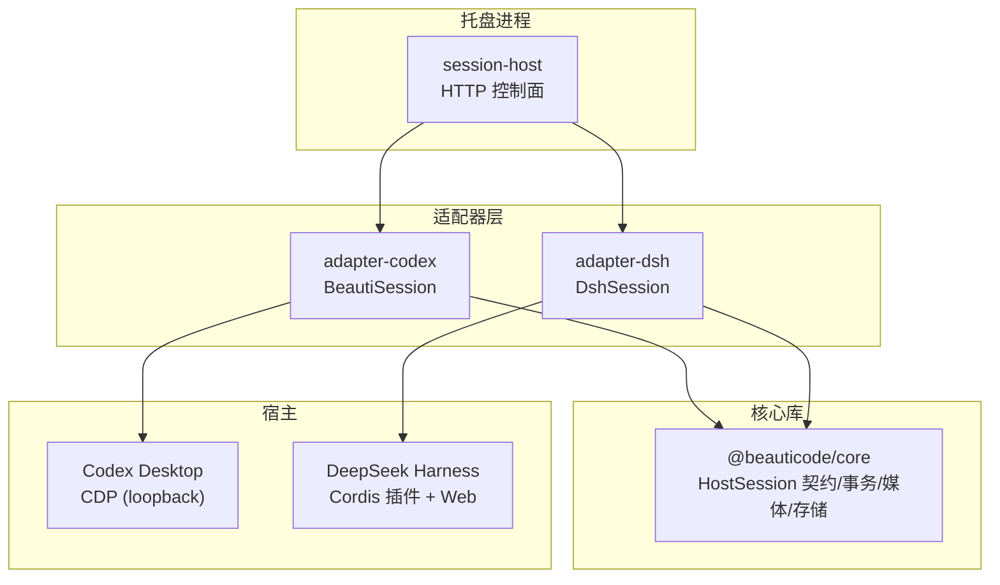
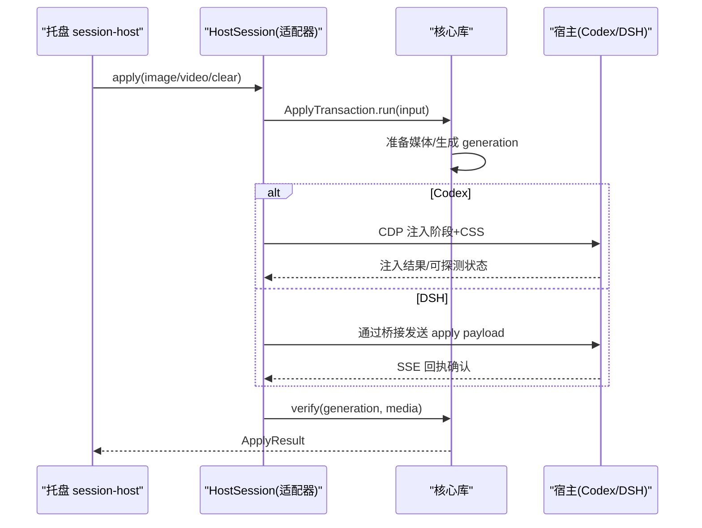
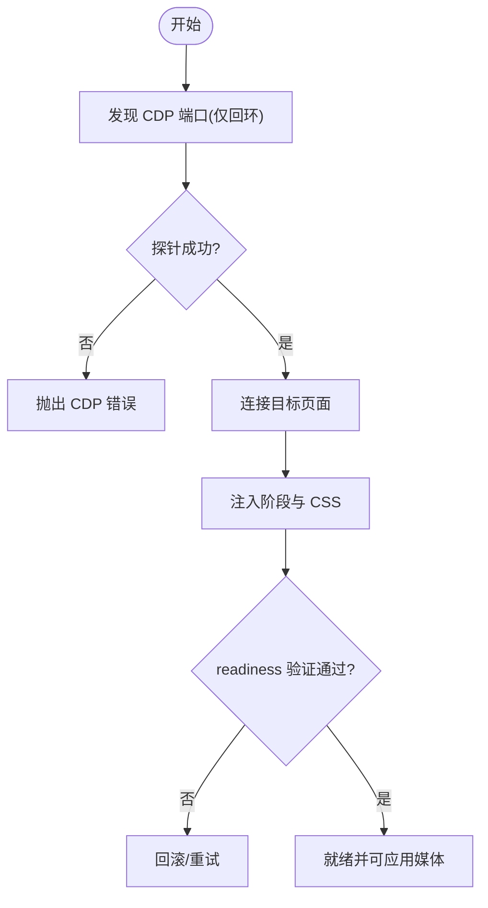
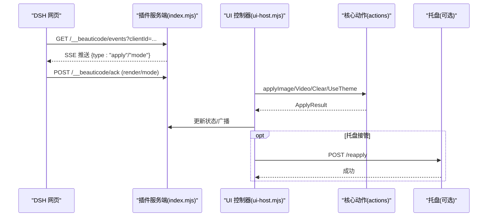
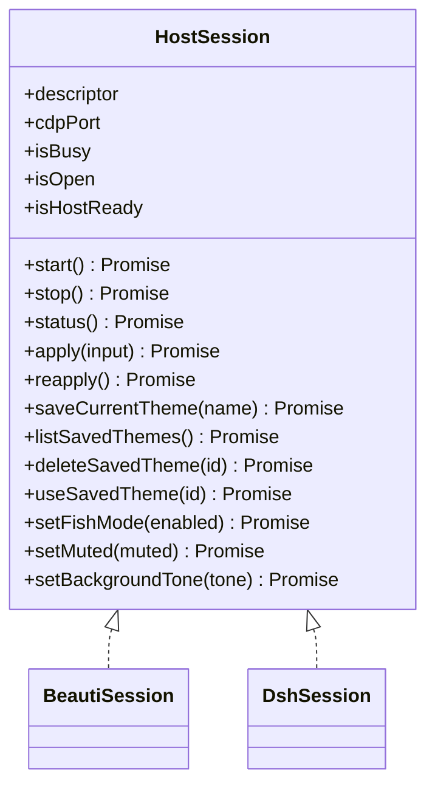
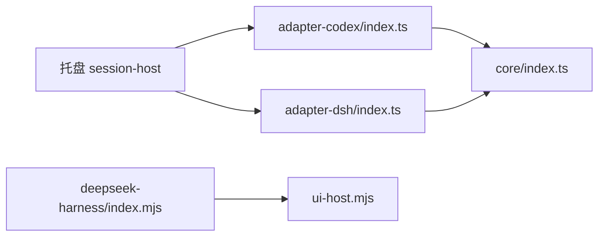

# 适配器模式实现

<cite>
**本文引用的文件**
- [README.md](file://README.md)
- [host-adapter.md](file://docs/host-adapter.md)
- [codex-cdp-setup.md](file://docs/codex-cdp-setup.md)
- [session-host.mjs](file://apps/tray/session-host.mjs)
- [core/index.ts](file://packages/core/src/index.ts)
- [core/host-session.ts](file://packages/core/src/host-session.ts)
- [adapter-codex/index.ts](file://packages/adapter-codex/src/index.ts)
- [adapter-codex/session.ts](file://packages/adapter-codex/src/session.ts)
- [adapter-dsh/index.ts](file://packages/adapter-dsh/src/index.ts)
- [adapter-dsh/session.ts](file://packages/adapter-dsh/src/session.ts)
- [deepseek-harness/index.mjs](file://integrations/deepseek-harness/index.mjs)
- [deepseek-harness/ui-host.mjs](file://integrations/deepseek-harness/ui-host.mjs)
</cite>

## 目录
1. [简介](#简介)
2. [项目结构](#项目结构)
3. [核心组件](#核心组件)
4. [架构总览](#架构总览)
5. [详细组件分析](#详细组件分析)
6. [依赖关系分析](#依赖关系分析)
7. [性能考虑](#性能考虑)
8. [故障排查指南](#故障排查指南)
9. [结论](#结论)
10. [附录](#附录)

## 简介
本文件系统性阐述 beautiCode 的“适配器模式”设计：通过统一的 HostSession 接口，屏蔽不同宿主（Codex Desktop、DeepSeek Harness）的差异，使托盘进程与上层控制面无需关心底层通信细节。文档重点包括：
- 适配器契约与 DOM/CSS 约定
- Codex Desktop 适配器的 CDP 发现、连接、注入与验证机制
- DeepSeek Harness 适配器的 Cordis 插件桥接、SSE 事件与 Web 端集成
- 新宿主适配开发指南（接口规范、测试方法、兼容性策略）
- 最佳实践与常见问题解决方案

## 项目结构
beautiCode 采用多包分层组织：
- packages/core：通用能力（背景存储、媒体服务、事务化应用、路径与错误等）
- packages/adapter-codex：Codex Desktop 适配器（CDP 发现/连接/注入/校验）
- packages/adapter-dsh：DeepSeek Harness 适配器（Cordis 插件桥接、SSE 广播、Web UI）
- integrations/deepseek-harness：DSH 侧插件服务端（路由、认证、SSE、UI 交互）
- apps/tray：托盘进程（本地控制平面，统一暴露 /apply、/mode、/theme 等 API）

图表来源
- [session-host.mjs:109-198](file://apps/tray/session-host.mjs#L109-L198)
- [core/host-session.ts:23-47](file://packages/core/src/host-session.ts#L23-L47)
- [adapter-codex/session.ts:56-136](file://packages/adapter-codex/src/session.ts#L56-L136)
- [adapter-dsh/session.ts:50-104](file://packages/adapter-dsh/src/session.ts#L50-L104)

章节来源
- [README.md:19-35](file://README.md#L19-L35)
- [session-host.mjs:109-198](file://apps/tray/session-host.mjs#L109-L198)

## 核心组件
- HostSession 接口：托盘仅依赖的最小控制面，包含 start/stop/status/apply/reapply/主题管理/模式设置等。
- BeautiSession（Codex）：基于 CDP 的会话管理，负责端口发现、连接、注入、校验、视频进度持久化、摸鱼/静音/色调切换。
- DshSession（DSH）：基于 Cordis 插件桥接，使用本地媒体服务与 SSE 广播，支持重放、主题进度保存、托盘接管。
- 托盘 session-host：提供稳定的本地 HTTP 控制面，统一对外暴露 /apply/*、/mode/*、/theme/*、/discover 等接口。

章节来源
- [core/host-session.ts:23-47](file://packages/core/src/host-session.ts#L23-L47)
- [adapter-codex/session.ts:56-136](file://packages/adapter-codex/src/session.ts#L56-L136)
- [adapter-dsh/session.ts:50-104](file://packages/adapter-dsh/src/session.ts#L50-L104)
- [session-host.mjs:290-540](file://apps/tray/session-host.mjs#L290-L540)

## 架构总览
适配器模式在 beautiCode 中的体现：
- 托盘进程不感知具体宿主差异，只调用 HostSession 的统一接口。
- 各适配器内部封装各自通信协议（CDP vs Cordis/SSE），并向上暴露一致的能力。
- 核心库提供跨宿主的通用能力（背景存储、媒体服务、事务化应用、路径与错误）。

图表来源
- [adapter-codex/session.ts:275-332](file://packages/adapter-codex/src/session.ts#L275-L332)
- [adapter-dsh/session.ts:164-264](file://packages/adapter-dsh/src/session.ts#L164-L264)
- [session-host.mjs:363-418](file://apps/tray/session-host.mjs#L363-L418)

## 详细组件分析

### 适配器契约与 DOM/CSS 约定
- 注入阶段拥有媒体层，适配器可在 data-bc-active 时让已知主/侧面板透明，但不得重写 composer、工具栏或任意 token/class 表面。
- 禁止指针捕获；stage 与媒体使用 pointer-events: none。
- 禁止二进制补丁；优先使用 loopback CDP 对已暴露调试的宿主进行注入。
- 每个注入会话携带 generation，过期的异步回调需忽略。
- 若宿主移除了 --remote-debugging-port，应明确报错而非无限重试。

章节来源
- [docs/host-adapter.md:3-16](file://docs/host-adapter.md#L3-L16)
- [docs/host-adapter.md:18-67](file://docs/host-adapter.md#L18-L67)
- [docs/host-adapter.md:68-78](file://docs/host-adapter.md#L68-L78)

### Codex Desktop 适配器：CDP 通信与注入
- 端口发现：自动扫描本机 loopback 候选端口，筛选出带 app:// 主页的目标。
- 安全连接：仅连接 127.0.0.1，限制 JSON 响应体大小，拒绝非回环重定向，校验浏览器身份。
- 注入流程：加载渲染器源（CSS/脚本），构造注入表达式，执行注入并通过 readiness 快照验证。
- 生命周期：单例注入锁，避免重复注入；支持 deferHostConnect 以快速启动托盘。
- 运行时特性：支持摸鱼模式、视频静音、背景色调切换；视频主题进度持久化与恢复。

图表来源
- [adapter-codex/session.ts:202-273](file://packages/adapter-codex/src/session.ts#L202-L273)
- [adapter-codex/session.ts:275-332](file://packages/adapter-codex/src/session.ts#L275-L332)
- [docs/codex-cdp-setup.md:7-15](file://docs/codex-cdp-setup.md#L7-L15)

章节来源
- [adapter-codex/session.ts:27-136](file://packages/adapter-codex/src/session.ts#L27-L136)
- [adapter-codex/session.ts:202-273](file://packages/adapter-codex/src/session.ts#L202-L273)
- [adapter-codex/session.ts:275-332](file://packages/adapter-codex/src/session.ts#L275-L332)
- [docs/codex-cdp-setup.md:16-88](file://docs/codex-cdp-setup.md#L16-L88)

### DeepSeek Harness 适配器：Cordis 插件与 Web 集成
- 插件入口：注册 webServer 钩子，注入客户端脚本与资源，提供 /__beauticode/* 路由。
- 认证与安全：Bearer Token 校验，同源校验，请求体大小限制，严格载荷校验。
- 事件通道：SSE 推送当前背景与模式变更；客户端上报 render/mode 回执，服务端聚合状态。
- 媒体与主题：支持图片/视频导入、主题保存/使用/删除、内置主题预设、画廊扩展。
- 托盘协作：当托盘存在时，插件可回退到托盘控制面进行 reapply，避免重复注入。

图表来源
- [deepseek-harness/index.mjs:204-645](file://integrations/deepseek-harness/index.mjs#L204-L645)
- [deepseek-harness/ui-host.mjs:302-798](file://integrations/deepseek-harness/ui-host.mjs#L302-L798)

章节来源
- [deepseek-harness/index.mjs:204-645](file://integrations/deepseek-harness/index.mjs#L204-L645)
- [deepseek-harness/ui-host.mjs:302-798](file://integrations/deepseek-harness/ui-host.mjs#L302-L798)

### 托盘控制面与统一入口
- 动态选择适配器：根据 --host 参数加载 adapter-codex 或 adapter-dsh 的 Session 类。
- 统一 API：/health、/status、/apply/image、/apply/video、/apply/clear、/reapply、/theme/*、/mode/*、/discover、/shutdown。
- 安全：所有请求需 Bearer Token；错误消息中文化；超时与限流保护。
- 优雅关闭：释放锁、停止监听、清理临时文件、通知宿主退出摸鱼等。

图表来源
- [core/host-session.ts:23-47](file://packages/core/src/host-session.ts#L23-L47)
- [adapter-codex/session.ts:56-136](file://packages/adapter-codex/src/session.ts#L56-L136)
- [adapter-dsh/session.ts:50-104](file://packages/adapter-dsh/src/session.ts#L50-L104)

章节来源
- [session-host.mjs:109-198](file://apps/tray/session-host.mjs#L109-L198)
- [session-host.mjs:290-540](file://apps/tray/session-host.mjs#L290-L540)
- [session-host.mjs:546-639](file://apps/tray/session-host.mjs#L546-L639)

## 依赖关系分析
- 托盘进程依赖适配器导出类型与函数（如 discoverCdpEndpoints、getCodexLaunchGuidance、toChineseErrorMessage）。
- 适配器依赖 core 提供的 BackgroundStore、MediaServerController、ApplyTransaction 等。
- DSH 插件依赖 ui-host 与 agent 能力，提供 Web 端交互与斜杠命令。

图表来源
- [session-host.mjs:109-198](file://apps/tray/session-host.mjs#L109-L198)
- [adapter-codex/index.ts:1-79](file://packages/adapter-codex/src/index.ts#L1-L79)
- [adapter-dsh/index.ts:1-16](file://packages/adapter-dsh/src/index.ts#L1-L16)
- [core/index.ts:1-19](file://packages/core/src/index.ts#L1-L19)
- [deepseek-harness/index.mjs:1-14](file://integrations/deepseek-harness/index.mjs#L1-L14)

章节来源
- [adapter-codex/index.ts:1-79](file://packages/adapter-codex/src/index.ts#L1-L79)
- [adapter-dsh/index.ts:1-16](file://packages/adapter-dsh/src/index.ts#L1-L16)
- [core/index.ts:1-19](file://packages/core/src/index.ts#L1-L19)

## 性能考虑
- Codex 适配器：
  - 使用轮询 watch 与去重 key 避免频繁全量重放，仅在会话变化时重新发布。
  - 注入前校验 CDP 健康，失败快速返回，避免长时间阻塞。
  - 视频进度写入节流（约 2s），跳过小于 0.5s 的变化，减少磁盘 IO。
- DSH 适配器：
  - 媒体 staging/commit 分离，失败时 abort 释放句柄。
  - 回放时优先从活跃播放位置恢复，减少用户等待。
  - 托盘接管时主动让出控制权，避免重复注入。

[本节为通用指导，不直接分析具体文件]

## 故障排查指南
- Codex CDP 不可用：
  - 检查是否启用 --remote-debugging-address=127.0.0.1 与端口；使用 discover/probe 诊断。
  - 若宿主重启导致 identity 变化，适配器会重建 host 并重连。
- 注入失败/验证失败：
  - 检查 generation/media 是否匹配；必要时先应用图片再视频，降低首帧抖动。
  - 查看 status 与回执错误信息，定位渲染失败原因。
- DSH 插件无法连接：
  - 确认插件已安装且 /__beauticode/version 可达；检查同源与 Bearer Token。
  - 若托盘存在，优先走托盘 /reapply 路径。
- 托盘控制面异常：
  - 检查 BEAUTICODE_CONTROL_TOKEN 长度与一致性；确认端口未被占用。
  - 关注 shutdown 流程是否正确释放锁与关闭连接。

章节来源
- [docs/codex-cdp-setup.md:55-88](file://docs/codex-cdp-setup.md#L55-L88)
- [docs/codex-cdp-setup.md:90-100](file://docs/codex-cdp-setup.md#L90-L100)
- [deepseek-harness/index.mjs:90-142](file://integrations/deepseek-harness/index.mjs#L90-L142)
- [session-host.mjs:119-146](file://apps/tray/session-host.mjs#L119-L146)

## 结论
beautiCode 通过 HostSession 抽象将不同宿主的复杂通信细节封装在适配器内，托盘与上层逻辑只需关注统一 API。Codex 适配器利用 CDP 完成安全注入与校验，DSH 适配器借助 Cordis 插件与 SSE 实现稳定可靠的 Web 端集成。该设计具备良好的可扩展性，便于新增宿主适配，同时通过严格的契约与安全检查保障稳定性与安全性。

## 附录

### 新宿主适配开发指南
- 实现 HostSession 接口：
  - 必须实现 descriptor、cdpPort、isBusy、isOpen、isHostReady、start/stop/status/apply/reapply 以及主题与模式相关方法。
  - 遵循适配器契约：注入阶段拥有媒体层，禁止劫持指针与重写关键 UI 表面。
- 通信与注入：
  - 若宿主支持 CDP，遵循 loopback 安全规则与身份校验；否则通过宿主自有桥接（如 DSH 的 Cordis）建立可靠通道。
  - 实现 verify 能力，确保注入后能检测渲染状态。
- 测试方法：
  - 单元测试：覆盖 apply/reapply/主题/模式切换的关键路径。
  - 集成测试：模拟宿主生命周期（启动/重启/关闭），验证重连与恢复。
  - 安全测试：伪造请求、超大请求体、非回环地址、无效 token 等边界用例。
- 兼容性策略：
  - 向后兼容：保留旧字段与行为，逐步弃用旧接口。
  - 向前兼容：generation 与 media 字段用于版本协商；未知字段忽略。
  - 降级策略：当 CDP 不可用时，给出清晰错误提示，不无限重试。

章节来源
- [core/host-session.ts:23-47](file://packages/core/src/host-session.ts#L23-L47)
- [docs/host-adapter.md:3-16](file://docs/host-adapter.md#L3-L16)
- [docs/host-adapter.md:80-95](file://docs/host-adapter.md#L80-L95)

### 适配器间差异处理与兼容性策略
- Codex 与 DSH 的差异：
  - Codex：基于 CDP 注入，媒体由渲染器持有；需要 readiness 验证。
  - DSH：基于插件桥接与 SSE，媒体可由本地媒体服务托管；回执驱动状态同步。
- 兼容性要点：
  - 统一 generation/media 语义；verify 失败即回滚。
  - 摸鱼/静音/色调等模式在不同宿主中以最小侵入方式实现。
  - 托盘控制面屏蔽差异，对外保持一致 API。

章节来源
- [adapter-codex/session.ts:275-332](file://packages/adapter-codex/src/session.ts#L275-L332)
- [adapter-dsh/session.ts:164-264](file://packages/adapter-dsh/src/session.ts#L164-L264)
- [session-host.mjs:363-522](file://apps/tray/session-host.mjs#L363-L522)

### 最佳实践
- 安全优先：仅回环连接、限制响应体大小、校验身份与同源。
- 健壮性：失败快速返回、重试有界、幂等操作、优雅关闭。
- 可观测性：记录关键状态与错误，便于定位问题。
- 用户体验：默认静音、支持快速重放、减少闪烁与卡顿。

[本节为通用指导，不直接分析具体文件]