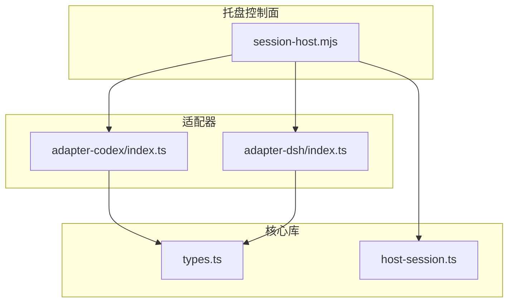
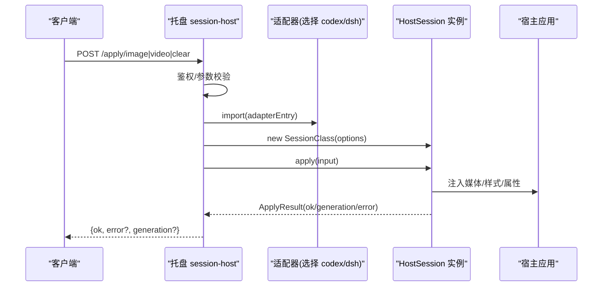
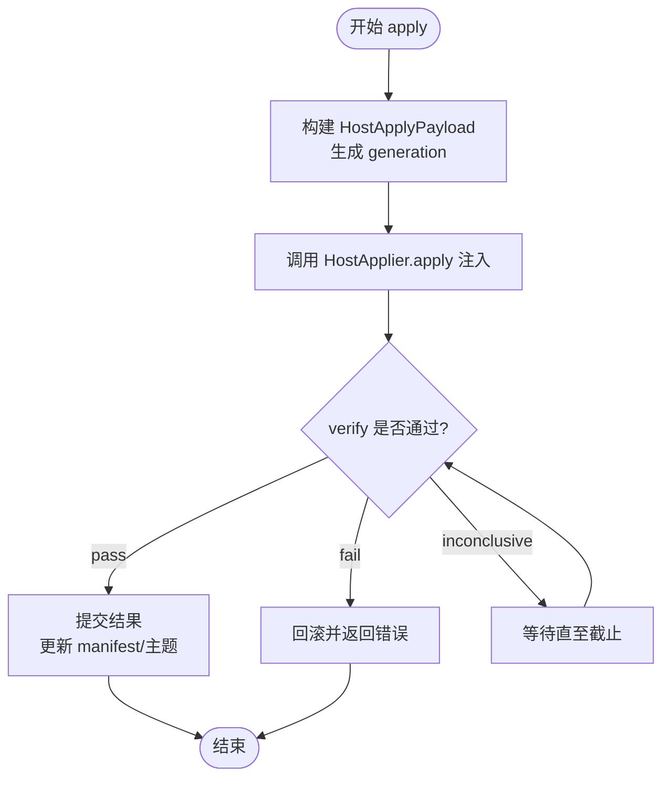
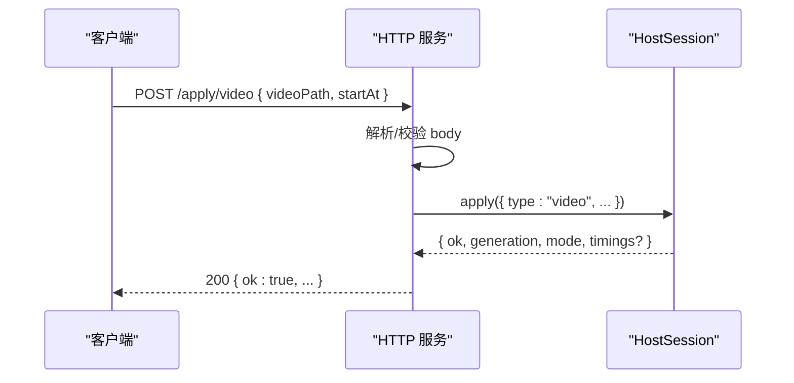
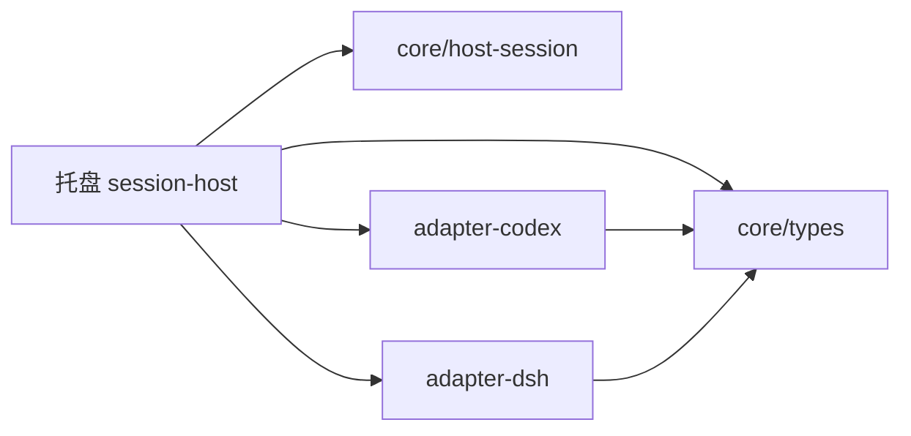

# 适配器设计原理

<cite>
**本文引用的文件**
- [packages/core/src/host-session.ts](file://packages/core/src/host-session.ts)
- [packages/core/src/types.ts](file://packages/core/src/types.ts)
- [apps/tray/session-host.mjs](file://apps/tray/session-host.mjs)
- [packages/adapter-codex/src/index.ts](file://packages/adapter-codex/src/index.ts)
- [packages/adapter-dsh/src/index.ts](file://packages/adapter-dsh/src/index.ts)
- [docs/host-adapter.md](file://docs/host-adapter.md)
</cite>

## 目录
1. [引言](#引言)
2. [项目结构](#项目结构)
3. [核心组件](#核心组件)
4. [架构总览](#架构总览)
5. [详细组件分析](#详细组件分析)
6. [依赖关系分析](#依赖关系分析)
7. [性能考量](#性能考量)
8. [故障排查指南](#故障排查指南)
9. [结论](#结论)
10. [附录](#附录)

## 引言
本文件系统性阐述 beautiCode 的适配器设计原理，聚焦如何通过统一的 HostSession 接口抽象不同宿主应用（Codex Desktop、DeepSeek Harness）的差异，实现“一套托盘控制面 + 多宿主适配”的可扩展架构。文档从设计理念、接口契约、状态与生命周期、错误处理、兼容性保证、通信协议与数据格式，到最佳实践与扩展指导，层层展开，帮助读者在不深入源码的情况下理解整体方案，并在需要时快速定位关键实现位置。

## 项目结构
beautiCode 采用“核心库 + 适配器 + 托盘控制面”的分层组织：
- packages/core：定义统一类型、事务化应用流程、媒体源校验、背景存储等公共能力。
- packages/adapter-codex / adapter-dsh：分别实现 Codex 与 DeepSeek Harness 的宿主适配逻辑（注入、CDP/桥接、验证、主题等）。
- apps/tray：本地 HTTP 控制面，负责鉴权、路由、参数校验、调用具体会话实例并返回统一 JSON 响应。

图表来源
- [apps/tray/session-host.mjs:109-198](file://apps/tray/session-host.mjs#L109-L198)
- [packages/core/src/host-session.ts:23-47](file://packages/core/src/host-session.ts#L23-L47)
- [packages/core/src/types.ts:140-215](file://packages/core/src/types.ts#L140-L215)
- [packages/adapter-codex/src/index.ts:71-76](file://packages/adapter-codex/src/index.ts#L71-L76)
- [packages/adapter-dsh/src/index.ts:1-15](file://packages/adapter-dsh/src/index.ts#L1-L15)

章节来源
- [apps/tray/session-host.mjs:109-198](file://apps/tray/session-host.mjs#L109-L198)
- [packages/core/src/host-session.ts:23-47](file://packages/core/src/host-session.ts#L23-L47)
- [packages/core/src/types.ts:140-215](file://packages/core/src/types.ts#L140-L215)
- [packages/adapter-codex/src/index.ts:71-76](file://packages/adapter-codex/src/index.ts#L71-L76)
- [packages/adapter-dsh/src/index.ts:1-15](file://packages/adapter-dsh/src/index.ts#L1-L15)

## 核心组件
- HostSession 统一接口：托盘仅依赖该小表面进行会话管理、应用背景、主题与模式控制。
- HostApplier 与 HostApplyPayload：适配器内部用于将统一输入转换为各宿主的注入负载。
- ApplyInput / ApplyResult：跨适配器的输入输出契约，支持图片、视频、清除以及事务化结果。
- HostDescriptor / HostCapabilities：描述宿主种类、显示名与能力集，供 UI/控制面做功能开关。
- VerifyExpectation / VerifyResult：适配器侧对注入结果的断言与超时回滚策略。

章节来源
- [packages/core/src/host-session.ts:23-47](file://packages/core/src/host-session.ts#L23-L47)
- [packages/core/src/types.ts:140-215](file://packages/core/src/types.ts#L140-L215)

## 架构总览
托盘进程通过本地 HTTP 暴露受控 API，按请求动态加载对应适配器并创建会话实例。托盘负责鉴权、参数校验、错误转中文、统一响应封装；适配器负责连接宿主（CDP 或桥）、注入资源、验证生效、管理主题与模式。

图表来源
- [apps/tray/session-host.mjs:148-198](file://apps/tray/session-host.mjs#L148-L198)
- [apps/tray/session-host.mjs:363-418](file://apps/tray/session-host.mjs#L363-L418)
- [packages/core/src/types.ts:107-125](file://packages/core/src/types.ts#L107-L125)
- [packages/core/src/types.ts:198-215](file://packages/core/src/types.ts#L198-L215)

## 详细组件分析

### HostSession 接口设计与职责划分
- 生命周期方法
  - start/stop：启动/停止会话，可能包含 CDP 连接、监听端口、资源清理。
  - status：返回当前宿主描述、端口、会话数、已应用清单、媒体服务器地址、模式与主题信息。
- 应用与重放
  - apply/reapply：应用新背景或重新发布当前背景到活跃会话。
- 主题管理
  - saveCurrentTheme/listSavedThemes/useSavedTheme/deleteSavedTheme：持久化与切换主题。
- 模式控制
  - setFishMode/setMuted/setBackgroundTone：摸鱼模式、静音、明暗基调。
- 只读属性
  - descriptor/cdpPort/isBusy/isOpen/isHostReady：对外暴露会话元信息与就绪态。

设计原则
- 最小控制面：托盘仅依赖此接口，屏蔽宿主差异。
- 幂等与可观测：status 提供稳定元数据，便于 UI 展示与监控。
- 可扩展：新增宿主只需实现该接口。

章节来源
- [packages/core/src/host-session.ts:23-47](file://packages/core/src/host-session.ts#L23-L47)

### 适配器实现策略（Codex 与 DSH）
- 适配器入口导出
  - adapter-codex：导出 BeautiSession、CDP 工具、注入器、发现器等。
  - adapter-dsh：导出 DshSession、桥接能力、令牌管理等。
- 托盘动态选择
  - 根据 --host 参数决定加载哪个适配器与 Session 类，并设置 baseUrl/honorTrayHandoff 等选项。
- 能力声明
  - HostDescriptor 中的 capabilities 由适配器提供，托盘据此决定是否暴露某些功能。

章节来源
- [packages/adapter-codex/src/index.ts:71-76](file://packages/adapter-codex/src/index.ts#L71-L76)
- [packages/adapter-dsh/src/index.ts:1-15](file://packages/adapter-dsh/src/index.ts#L1-L15)
- [apps/tray/session-host.mjs:109-166](file://apps/tray/session-host.mjs#L109-L166)

### 注入契约与 DOM/CSS/CDP 安全约束（Codex）
- DOM 契约：注入节点、html 属性约定（如 data-bc-active/media/video-ready/generation/working/fish），确保宿主渲染层可识别且不被破坏。
- CSS 契约：允许的定位/层级/可见性规则与受限的透明度调整，禁止重写宿主 composer/utility-bar 等敏感样式。
- CDP 安全：仅连 127.0.0.1、限制响应体大小、拒绝跳转、身份校验、目标页面白名单、单注入器所有权。
- 生成号保护：每次注入携带 generation，异步回调忽略过期值，避免竞态。

章节来源
- [docs/host-adapter.md:1-17](file://docs/host-adapter.md#L1-L17)
- [docs/host-adapter.md:18-78](file://docs/host-adapter.md#L18-L78)

### 事务化应用与验证（Verify）
- 输入/输出
  - ApplyInput：支持 image/video/clear，含 source/effects/startAt 等字段。
  - ApplyResult：包含 ok、generation、mode、sourceMode、timings、error、rolledBack。
- 验证机制
  - HostApplier.verify 接收期望（generation、media），在截止时间内返回 pass/fail/inconclusive。
  - 事务失败会回滚，inconclusive 在截止期后视为失败。
- 时序要点
  - 托盘调用 session.apply → 适配器执行注入 → 验证生效 → 返回结果。

图表来源
- [packages/core/src/types.ts:107-125](file://packages/core/src/types.ts#L107-L125)
- [packages/core/src/types.ts:140-153](file://packages/core/src/types.ts#L140-L153)
- [packages/core/src/types.ts:198-215](file://packages/core/src/types.ts#L198-L215)

章节来源
- [packages/core/src/types.ts:107-125](file://packages/core/src/types.ts#L107-L125)
- [packages/core/src/types.ts:140-153](file://packages/core/src/types.ts#L140-L153)
- [packages/core/src/types.ts:198-215](file://packages/core/src/types.ts#L198-L215)

### 托盘控制面协议与数据交换
- 鉴权：所有请求需 Authorization: Bearer <token>，使用常量时间比较防时序攻击。
- 路由示例
  - GET /health：返回 host/port/open/busy/hostReady。
  - GET /status：返回会话状态。
  - POST /apply/image|video|clear：应用背景。
  - POST /reapply：重新发布当前背景。
  - POST /theme/*：保存/列出/使用/删除主题。
  - POST /mode/*：摸鱼、静音、基调。
  - POST /discover：发现宿主端点。
  - POST /shutdown：优雅关闭。
- 错误处理：统一包装为 { ok, error }，错误消息经 toChineseErrorMessage 转换。
- 安全：仅绑定 127.0.0.1，限制请求体大小与超时。

图表来源
- [apps/tray/session-host.mjs:201-273](file://apps/tray/session-host.mjs#L201-L273)
- [apps/tray/session-host.mjs:381-408](file://apps/tray/session-host.mjs#L381-L408)
- [apps/tray/session-host.mjs:529-538](file://apps/tray/session-host.mjs#L529-L538)

章节来源
- [apps/tray/session-host.mjs:201-273](file://apps/tray/session-host.mjs#L201-L273)
- [apps/tray/session-host.mjs:381-408](file://apps/tray/session-host.mjs#L381-L408)
- [apps/tray/session-host.mjs:529-538](file://apps/tray/session-host.mjs#L529-L538)

### 状态管理与生命周期控制
- 启动阶段
  - 解析参数（hostKind、port、dataRoot、verify-ms 等），动态导入适配器，构造 SessionClass。
  - 配置 deferHostConnect/autoDiscover/baseUrl 等以适配不同宿主。
- 运行阶段
  - 监听本地端口，处理鉴权与路由，转发至 session 方法。
  - 维护 shuttingDown 标志，防止并发写入。
- 关闭阶段
  - 移除控制文件、关闭 HTTP、调用 session.stop、退出进程。

章节来源
- [apps/tray/session-host.mjs:109-198](file://apps/tray/session-host.mjs#L109-L198)
- [apps/tray/session-host.mjs:546-572](file://apps/tray/session-host.mjs#L546-L572)

### 错误处理机制与兼容性保证
- 统一错误包装：toChineseErrorMessage 将底层错误转为可读中文，便于 UI 展示。
- 参数校验：对必填字段、枚举值、数值范围严格校验，返回 400/422 等明确状态码。
- 兼容策略
  - HostCapabilities 由适配器声明，托盘据此隐藏不支持的功能。
  - 通过 verify 与 generation 保护异步回调与竞态。
  - CDP 安全约束确保在不同上游版本下的稳定性。

章节来源
- [apps/tray/session-host.mjs:55-65](file://apps/tray/session-host.mjs#L55-L65)
- [apps/tray/session-host.mjs:275-288](file://apps/tray/session-host.mjs#L275-L288)
- [docs/host-adapter.md:68-78](file://docs/host-adapter.md#L68-L78)

### 适配器间通信协议与数据交换格式
- 托盘到适配器：通过 Node.js 模块动态 import，调用其导出的 Session 类与方法。
- 适配器到宿主
  - Codex：基于 CDP 注入 DOM/CSS/属性，遵循 docs/host-adapter.md 的契约。
  - DSH：通过桥接/插件通道传递指令与媒体引用。
- 数据格式
  - ApplyInput/ApplyResult/HostApplyPayload 作为跨层契约，确保一致性与可测试性。

章节来源
- [packages/core/src/types.ts:107-196](file://packages/core/src/types.ts#L107-L196)
- [docs/host-adapter.md:18-78](file://docs/host-adapter.md#L18-L78)

### 最佳实践与扩展指导
- 新增宿主适配器
  - 实现 HostSession 接口，提供 descriptor/status/apply/reapply/主题与模式控制。
  - 在托盘通过 --host 参数注册新的适配器入口与 Session 类。
  - 在 HostDescriptor.capabilities 中声明能力，避免暴露不支持的功能。
- 注入与验证
  - 始终携带 generation，verify 必须覆盖关键渲染路径（DOM/属性/媒体）。
  - 遵守 DOM/CSS 契约，不触碰宿主敏感区域。
- 错误与日志
  - 使用 toChineseErrorMessage 统一错误呈现。
  - 对网络/CDP/文件系统操作增加超时与重试边界。
- 安全
  - 仅绑定 127.0.0.1，限制请求体大小，校验 token。
  - 对 CDP 目标进行身份校验与白名单过滤。

章节来源
- [packages/core/src/host-session.ts:23-47](file://packages/core/src/host-session.ts#L23-L47)
- [packages/core/src/types.ts:18-34](file://packages/core/src/types.ts#L18-L34)
- [docs/host-adapter.md:1-17](file://docs/host-adapter.md#L1-L17)
- [apps/tray/session-host.mjs:275-288](file://apps/tray/session-host.mjs#L275-L288)

## 依赖关系分析
- 托盘依赖 core 的类型与工具函数，并通过动态 import 加载具体适配器。
- 适配器依赖 core 的类型与通用能力（如错误转换、媒体校验、事务化应用）。
- 适配器之间无直接耦合，通过托盘路由解耦。

图表来源
- [apps/tray/session-host.mjs:148-198](file://apps/tray/session-host.mjs#L148-L198)
- [packages/core/src/types.ts:140-215](file://packages/core/src/types.ts#L140-L215)
- [packages/core/src/host-session.ts:23-47](file://packages/core/src/host-session.ts#L23-L47)

章节来源
- [apps/tray/session-host.mjs:148-198](file://apps/tray/session-host.mjs#L148-L198)
- [packages/core/src/types.ts:140-215](file://packages/core/src/types.ts#L140-L215)
- [packages/core/src/host-session.ts:23-47](file://packages/core/src/host-session.ts#L23-L47)

## 性能考量
- 延迟连接：托盘可 deferHostConnect，先返回可用状态，后台完成 CDP 连接与首次发布。
- 节流与去抖：主题进度保存与写盘应节流，避免频繁 I/O。
- 资源限制：限制请求体大小、设置合理的超时与 keepAlive，防止资源耗尽。
- 注入优化：优先使用 data URL/blob 方式减少跨域与 CSP 问题，降低额外请求。

[本节为通用指导，不直接分析具体文件]

## 故障排查指南
- 无法连接宿主
  - 检查 CDP 端口与目标页面是否符合白名单，确认单注入器所有权。
  - 查看 /health 与 /status 返回，确认 isHostReady 与 sessions 数量。
- 注入无效
  - 核对 DOM 属性与 CSS 契约是否被正确设置，检查 generation 是否递增。
  - 使用 verify 结果定位 fail/inconclusive 原因。
- 权限与认证
  - 确认 Authorization 头与 token 长度与一致性，避免时序比较失败。
- 关闭异常
  - 检查 shuttingDown 标志与控制文件清理，确保进程退出前释放资源。

章节来源
- [docs/host-adapter.md:68-78](file://docs/host-adapter.md#L68-L78)
- [apps/tray/session-host.mjs:303-321](file://apps/tray/session-host.mjs#L303-L321)
- [apps/tray/session-host.mjs:546-572](file://apps/tray/session-host.mjs#L546-L572)

## 结论
beautiCode 通过 HostSession 统一接口与严格的注入契约，将托盘控制面与多宿主差异解耦。适配器以最小成本接入新宿主，同时借助事务化应用与 verify 机制保障可靠性。托盘提供安全的本地控制面，统一鉴权、校验与错误呈现。该设计既保证了现有宿主的高质量体验，也为未来扩展提供了清晰路径。

[本节为总结性内容，不直接分析具体文件]

## 附录
- 术语
  - 宿主：指承载网页的应用（如 Codex Desktop、DeepSeek Harness）。
  - 适配器：针对特定宿主实现的注入与集成逻辑。
  - 托盘：本地 HTTP 控制面进程，提供用户交互与命令下发。
- 参考
  - 注入契约与安全约束详见 docs/host-adapter.md。
  - 统一类型与事务化应用见 packages/core/src/types.ts。
  - 托盘控制面实现见 apps/tray/session-host.mjs。

[本节为补充说明，不直接分析具体文件]