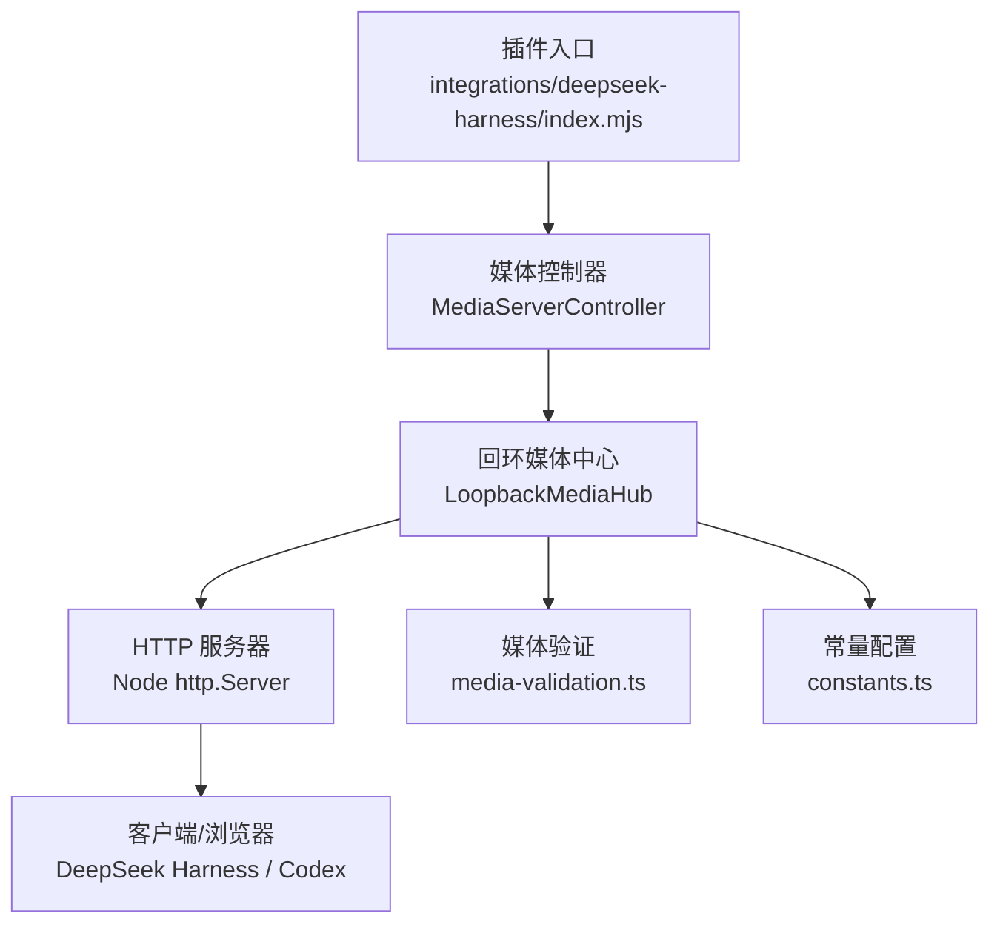
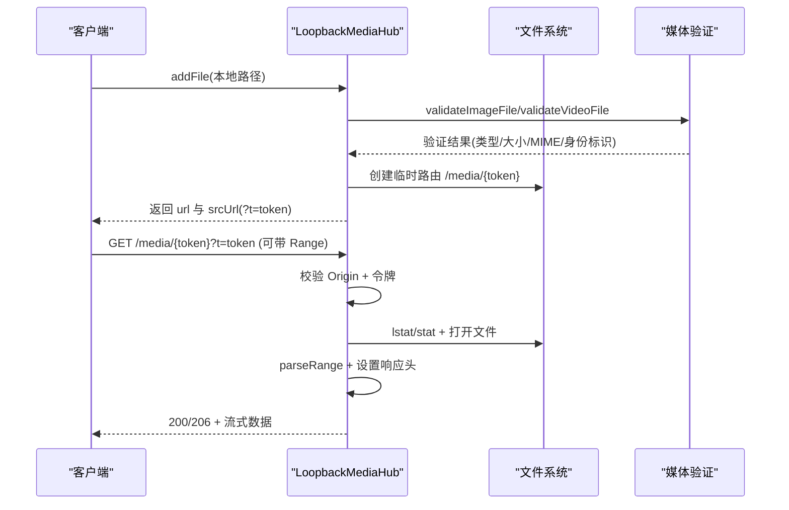
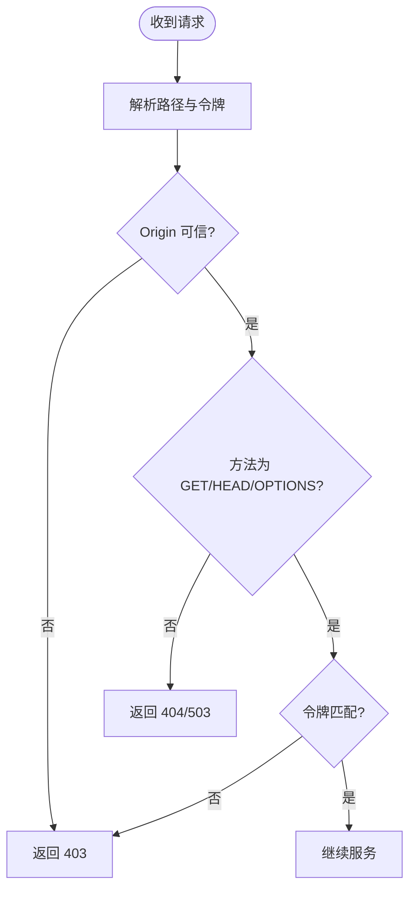
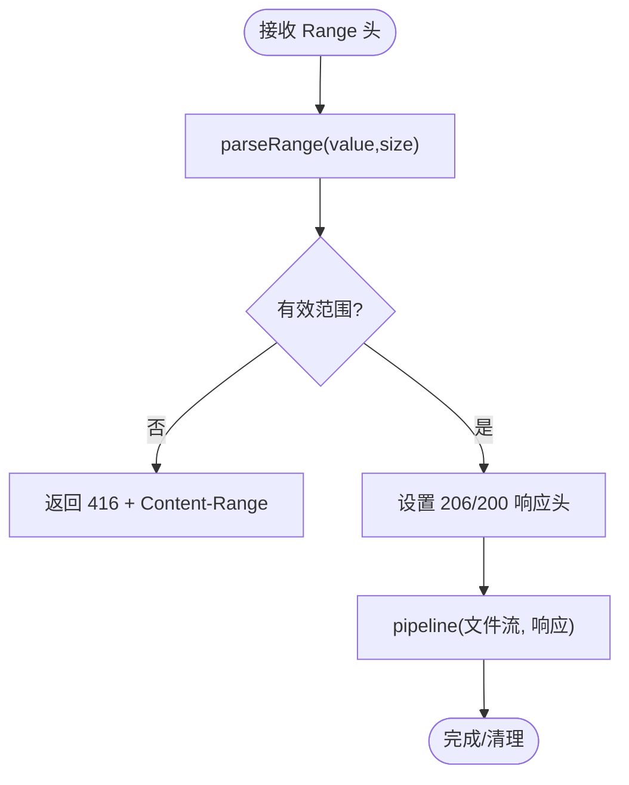
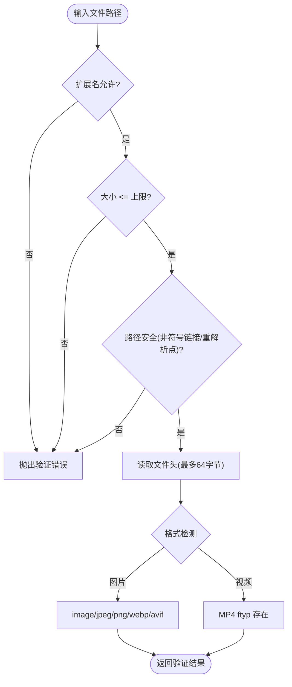
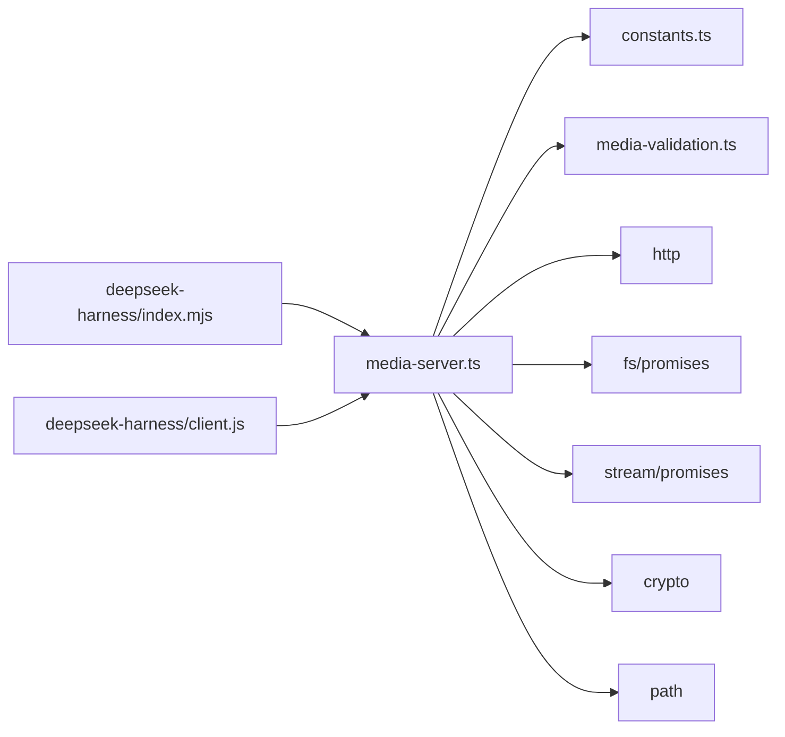
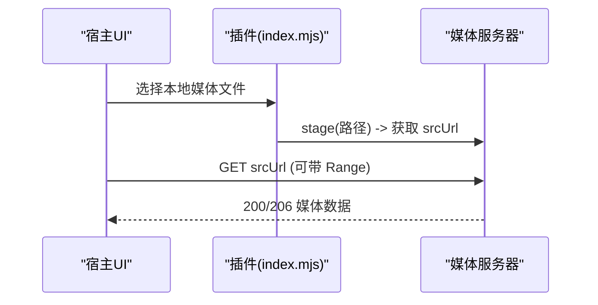

# 媒体服务器

<cite>
**本文引用的文件**
- [packages/core/src/media-server.ts](file://packages/core/src/media-server.ts)
- [packages/core/src/media-validation.ts](file://packages/core/src/media-validation.ts)
- [packages/core/src/constants.ts](file://packages/core/src/constants.ts)
- [docs/security-boundaries.md](file://docs/security-boundaries.md)
- [integrations/deepseek-harness/index.mjs](file://integrations/deepseek-harness/index.mjs)
- [integrations/deepseek-harness/client.js](file://integrations/deepseek-harness/client.js)
- [packages/core/test/media-server.test.js](file://packages/core/test/media-server.test.js)
- [packages/core/test/media-validation.test.js](file://packages/core/test/media-validation.test.js)
</cite>

## 目录
1. [简介](#简介)
2. [项目结构](#项目结构)
3. [核心组件](#核心组件)
4. [架构总览](#架构总览)
5. [详细组件分析](#详细组件分析)
6. [依赖关系分析](#依赖关系分析)
7. [性能考虑](#性能考虑)
8. [故障排查指南](#故障排查指南)
9. [结论](#结论)
10. [附录：RESTful API 与客户端集成](#附录restful-api-与客户端集成)

## 简介
本仓库实现了一个本地回环（仅绑定 127.0.0.1）的媒体服务器，用于安全地提供图片与视频背景。其核心目标包括：
- 严格的访问控制：路径令牌 + 请求头或查询参数令牌双重校验；可信来源白名单；跨域最小暴露。
- 大文件流式传输：完整支持 HTTP Range 请求，按需分块读取与响应。
- 媒体文件验证：图片格式签名检查、视频容器校验、文件大小限制、符号链接/重解析点拒绝。
- 安全的源解析：仅服务已验证并登记到内存映射的资产，避免任意文件系统暴露。
- 跨域保护与安全边界：限定 Origin、启用 Private Network Access、严格 CORS 头。
- 性能优化：连接与请求限流、流式管道、资源释放、冷启动预热等。

该媒体服务器面向宿主应用（如 DeepSeek Harness、Codex Desktop），通过插件侧发起“应用”流程，将本地媒体文件转换为受保护的本地 URL，供宿主渲染器加载。

**章节来源**
- [packages/core/src/media-server.ts:24-33](file://packages/core/src/media-server.ts#L24-L33)
- [docs/security-boundaries.md:1-27](file://docs/security-boundaries.md#L1-L27)

## 项目结构
- packages/core/src
  - media-server.ts：HTTP 服务器、路由、认证、Range 处理、流式传输、CORS、生命周期管理。
  - media-validation.ts：媒体文件验证（图片魔数、MP4 容器、大小限制、路径安全）。
  - constants.ts：常量（扩展名、大小上限、默认可信来源、Token 头名等）。
- integrations/deepseek-harness
  - index.mjs：插件入口，包含鉴权、同源判断、合法回环媒体 URL 校验等。
  - client.js：客户端侧对 Range 探测、超时与错误诊断的实现。
- docs/security-boundaries.md：安全边界策略文档。
- packages/core/test：单元测试覆盖媒体服务器与验证逻辑。

**图表来源**
- [packages/core/src/media-server.ts:148-218](file://packages/core/src/media-server.ts#L148-L218)
- [packages/core/src/media-validation.ts:223-292](file://packages/core/src/media-validation.ts#L223-L292)
- [packages/core/src/constants.ts:24-52](file://packages/core/src/constants.ts#L24-L52)
- [integrations/deepseek-harness/index.mjs:90-123](file://integrations/deepseek-harness/index.mjs#L90-L123)

**章节来源**
- [packages/core/src/media-server.ts:148-218](file://packages/core/src/media-server.ts#L148-L218)
- [packages/core/src/media-validation.ts:223-292](file://packages/core/src/media-validation.ts#L223-L292)
- [packages/core/src/constants.ts:24-52](file://packages/core/src/constants.ts#L24-L52)
- [integrations/deepseek-harness/index.mjs:90-123](file://integrations/deepseek-harness/index.mjs#L90-L123)

## 核心组件
- LoopbackMediaHub：单端口多资产的本地媒体中心，负责监听、路由、认证、Range 处理、流式传输、CORS、资源清理。
- MediaServerController：高层控制器，封装 stage/commit/abort/close，管理当前活跃的图片与视频资产。
- 媒体验证模块：validateImageFile、validateVideoFile、isMp4Container、isAvifContainer、warmVideoFileReads 等。
- 常量配置：媒体 Token 头名、默认可信来源、最大字节限制、支持的扩展名等。

**章节来源**
- [packages/core/src/media-server.ts:148-732](file://packages/core/src/media-server.ts#L148-L732)
- [packages/core/src/media-validation.ts:1-358](file://packages/core/src/media-validation.ts#L1-L358)
- [packages/core/src/constants.ts:1-62](file://packages/core/src/constants.ts#L1-L62)

## 架构总览
媒体服务器采用“验证即注册、注册即路由”的模式：
- 调用方先通过 MediaServerController.stage 提交本地文件路径，内部调用 validateImageFile/validateVideoFile 进行严格校验。
- 校验通过后，LoopbackMediaHub 为该文件生成不可猜测的路径令牌 token，并建立 /media/{token} 路由。
- 客户端使用 srcUrl（含 ?t= 查询令牌）或带 X-BeautiCode-Media-Token 头的 URL 访问。
- 服务端在每次请求时再次校验 Origin、令牌、文件状态（stat/inode/mtime/size）、必要时计算内容哈希，确保文件未被替换。
- 支持 Range 请求，按字节范围流式传输，减少内存占用并提升大文件播放体验。

**图表来源**
- [packages/core/src/media-server.ts:220-301](file://packages/core/src/media-server.ts#L220-L301)
- [packages/core/src/media-server.ts:406-590](file://packages/core/src/media-server.ts#L406-L590)
- [packages/core/src/media-validation.ts:223-292](file://packages/core/src/media-validation.ts#L223-L292)

## 详细组件分析

### 安全访问控制机制
- 路径令牌：每个资产分配一个不可猜测的 token（UUID 去横线），形成唯一路由 /media/{token}。
- 双因子令牌校验：请求必须携带匹配的 X-BeautiCode-Media-Token 请求头或 ?t= 查询参数之一。
- 来源白名单：仅允许可信 Origin（如 app://-, app://, null, file:// 及 app://* 前缀），否则返回 403。
- 预检请求：OPTIONS 预检仅在可信来源下返回 204，否则 403。
- 安全边界：仅绑定 127.0.0.1，禁止局域网暴露；无任意文件系统暴露；失败关闭策略。

**图表来源**
- [packages/core/src/media-server.ts:406-479](file://packages/core/src/media-server.ts#L406-L479)
- [docs/security-boundaries.md:9-12](file://docs/security-boundaries.md#L9-L12)
- [packages/core/src/constants.ts:24-41](file://packages/core/src/constants.ts#L24-L41)

**章节来源**
- [packages/core/src/media-server.ts:406-479](file://packages/core/src/media-server.ts#L406-L479)
- [docs/security-boundaries.md:9-12](file://docs/security-boundaries.md#L9-L12)
- [packages/core/src/constants.ts:24-41](file://packages/core/src/constants.ts#L24-L41)

### HTTP Range 请求与大文件流式传输
- Range 解析：支持 bytes=start-end 与 bytes=-suffix 两种形式，非法或不满足范围返回 416。
- 流式传输：使用 Node stream pipeline 将文件句柄直接写入响应，避免全量加载到内存。
- 头部设置：正确设置 Accept-Ranges、Content-Length、Content-Range、Cache-Control=no-store、X-Content-Type-Options=nosniff。
- 取消与异常：客户端断开或响应销毁时自动中止传输，释放文件句柄。

**图表来源**
- [packages/core/src/media-server.ts:66-94](file://packages/core/src/media-server.ts#L66-L94)
- [packages/core/src/media-server.ts:524-580](file://packages/core/src/media-server.ts#L524-L580)
- [packages/core/src/media-server.ts:365-404](file://packages/core/src/media-server.ts#L365-L404)

**章节来源**
- [packages/core/src/media-server.ts:66-94](file://packages/core/src/media-server.ts#L66-L94)
- [packages/core/src/media-server.ts:524-580](file://packages/core/src/media-server.ts#L524-L580)
- [packages/core/src/media-server.ts:365-404](file://packages/core/src/media-server.ts#L365-L404)

### 媒体文件验证流程
- 图片验证：
  - 扩展名限制：仅允许 .jpg/.jpeg/.png/.webp/.avif。
  - 大小限制：不超过 MAX_IMAGE_BYTES。
  - 魔数检测：基于头部字节识别 JPEG/PNG/WEBP/AVIF，防止伪装。
  - 路径安全：拒绝符号链接与重解析点，确保常规文件。
- 视频验证：
  - 扩展名限制：仅允许 .mp4。
  - 大小限制：不超过 MAX_VIDEO_BYTES。
  - 容器校验：检查 MP4 ftyp box，确保真实 MP4 容器。
  - 路径安全：同上。
- 快速模式：fast 模式下仅对文件头与元数据进行指纹计算，避免对超大文件全量哈希；后续请求若检测到元数据变化则拒绝。

**图表来源**
- [packages/core/src/media-validation.ts:223-292](file://packages/core/src/media-validation.ts#L223-L292)
- [packages/core/src/media-validation.ts:125-190](file://packages/core/src/media-validation.ts#L125-L190)
- [packages/core/src/media-validation.ts:78-90](file://packages/core/src/media-validation.ts#L78-L90)

**章节来源**
- [packages/core/src/media-validation.ts:223-292](file://packages/core/src/media-validation.ts#L223-L292)
- [packages/core/src/media-validation.ts:125-190](file://packages/core/src/media-validation.ts#L125-L190)
- [packages/core/src/media-validation.ts:78-90](file://packages/core/src/media-validation.ts#L78-L90)

### 媒体源解析机制
- 本地文件：通过 MediaServerController.stage 提交本地路径，内部执行验证后注册到 Hub，生成 /media/{token} 路由。
- 托管文件：当前实现聚焦于本地文件的安全分发；未提供远程托管文件的直接拉取与缓存。如需托管文件，应在上游完成下载与验证后再交由媒体服务器分发。
- 资产复用：相同文件（路径、大小、identity、类型）会复用已有路由，避免重复注册。

**章节来源**
- [packages/core/src/media-server.ts:220-301](file://packages/core/src/media-server.ts#L220-L301)
- [packages/core/src/media-server.ts:271-280](file://packages/core/src/media-server.ts#L271-L280)

### 跨域保护与安全边界设计
- 绑定地址：仅 127.0.0.1，不暴露到局域网。
- Origin 白名单：默认信任 app://-, app://, null, app://./, file://，以及 app://* 前缀。
- Private Network Access：允许 Chromium Private Network Access（app:// → 127.0.0.1）。
- 最小化暴露：仅暴露 /media/{token} 路由，其他路径一律 404/503。
- 失败关闭：任何异常或漂移均拒绝服务，保障安全。

**章节来源**
- [packages/core/src/media-server.ts:177-218](file://packages/core/src/media-server.ts#L177-L218)
- [packages/core/src/media-server.ts:410-445](file://packages/core/src/media-server.ts#L410-L445)
- [docs/security-boundaries.md:9-12](file://docs/security-boundaries.md#L9-L12)
- [packages/core/src/constants.ts:27-41](file://packages/core/src/constants.ts#L27-L41)

## 依赖关系分析
- media-server.ts 依赖：
  - constants.ts：媒体 Token 头名、默认可信来源、扩展名、大小上限。
  - media-validation.ts：图片/视频验证、容器检测、路径安全、预热读取。
  - Node http/fs/stream/crypto/path：HTTP 服务器、文件操作、流式传输、哈希、路径处理。
- 插件侧依赖：
  - index.mjs：鉴权、同源判断、合法回环媒体 URL 校验。
  - client.js：Range 探针、超时与错误诊断。

**图表来源**
- [packages/core/src/media-server.ts:1-22](file://packages/core/src/media-server.ts#L1-L22)
- [packages/core/src/constants.ts:24-52](file://packages/core/src/constants.ts#L24-L52)
- [packages/core/src/media-validation.ts:1-10](file://packages/core/src/media-validation.ts#L1-L10)
- [integrations/deepseek-harness/index.mjs:90-123](file://integrations/deepseek-harness/index.mjs#L90-L123)
- [integrations/deepseek-harness/client.js:607-649](file://integrations/deepseek-harness/client.js#L607-L649)

**章节来源**
- [packages/core/src/media-server.ts:1-22](file://packages/core/src/media-server.ts#L1-L22)
- [packages/core/src/constants.ts:24-52](file://packages/core/src/constants.ts#L24-L52)
- [packages/core/src/media-validation.ts:1-10](file://packages/core/src/media-validation.ts#L1-L10)
- [integrations/deepseek-harness/index.mjs:90-123](file://integrations/deepseek-harness/index.mjs#L90-L123)
- [integrations/deepseek-harness/client.js:607-649](file://integrations/deepseek-harness/client.js#L607-L649)

## 性能考虑
- 流式传输：使用 pipeline 将文件流直接写入响应，避免内存峰值。
- 连接与请求限制：maxRequestsPerSocket、keepAliveTimeout、headersTimeout、requestTimeout 控制并发与资源占用。
- 资源释放：传输完成后关闭文件句柄，关闭服务器时主动销毁 socket 并等待转移完成。
- 冷启动预热：warmVideoFileReads 预先读取 MP4 头部与尾部，降低首次播放卡顿。
- 资产复用：相同文件复用路由，减少重复注册与 I/O。
- 缓存策略：统一设置 Cache-Control=no-store，避免敏感媒体被缓存。

[本节为通用性能指导，不直接分析具体代码行]

## 故障排查指南
- 常见错误与原因：
  - 403：来源不在白名单或令牌不匹配。
  - 404：路径不存在或服务器已关闭。
  - 416：Range 请求无效或不满足范围。
  - 验证失败：扩展名不允许、大小超限、魔数不匹配、非 MP4 容器、符号链接/重解析点。
- 调试建议：
  - 检查 Origin 是否在默认白名单或自定义 trustedOrigins。
  - 确认请求是否携带正确的 X-BeautiCode-Media-Token 或 ?t= 参数。
  - 查看 Range 头是否符合 bytes=start-end 或 bytes=-suffix。
  - 使用测试用例中的示例构造最小可用媒体文件，逐步定位问题。
- 日志与诊断：
  - 客户端侧记录 Range 探针事件与超时信息，辅助定位网络与 CORS 问题。
  - 服务端在异常时返回标准状态码与必要响应头，便于上层捕获。

**章节来源**
- [packages/core/test/media-server.test.js:28-37](file://packages/core/test/media-server.test.js#L28-L37)
- [packages/core/test/media-validation.test.js:106-148](file://packages/core/test/media-validation.test.js#L106-L148)
- [integrations/deepseek-harness/client.js:607-649](file://integrations/deepseek-harness/client.js#L607-L649)

## 结论
该媒体服务器以“强验证 + 强隔离 + 流式传输”为核心，提供了安全、高效、可控的本地媒体分发能力。通过路径令牌、来源白名单、Range 支持与严格的文件验证，既满足了大文件播放的性能需求，又确保了本地环境下的安全边界。结合插件侧的鉴权与客户端的诊断，形成了完整的端到端解决方案。

[本节为总结性内容，不直接分析具体代码行]

## 附录：RESTful API 与客户端集成

### 端点定义
- 基础路径：/media/{token}
- 方法：GET、HEAD、OPTIONS（预检）
- 认证：
  - 请求头：X-BeautiCode-Media-Token（值等于路径中的 token）
  - 或查询参数：?t={token}
- 来源限制：Origin 必须在可信白名单内（默认 app://-, app://, null, app://./, file://，以及 app://* 前缀）
- 响应头：
  - Accept-Ranges: bytes
  - Content-Type: 根据媒体类型设置（image/* 或 video/mp4）
  - Cache-Control: no-store
  - X-Content-Type-Options: nosniff
  - Access-Control-Allow-Methods: GET, HEAD, OPTIONS
  - Access-Control-Allow-Headers: Range, X-BeautiCode-Media-Token, Content-Type, Accept
  - Access-Control-Allow-Private-Network: true
  - Access-Control-Expose-Headers: Accept-Ranges, Content-Length, Content-Range, Content-Type
  - Vary: Origin

### 请求与响应
- 普通请求：
  - 成功：200 + 完整文件体
  - 失败：403（来源或令牌错误）、404（路径不存在）、503（服务器关闭）
- Range 请求：
  - 成功：206 + Content-Range + 部分文件体
  - 失败：416（范围无效或不满足）
- 预检：
  - 成功：204（仅可信来源）
  - 失败：403（来源不可信）

### 错误码说明
- 200：正常返回完整文件
- 204：预检成功
- 206：Range 请求成功
- 403：来源不可信或令牌不匹配
- 404：路径不存在或服务器关闭
- 416：Range 请求无效或不满足范围

### 客户端集成示例
- 使用 srcUrl（含 ?t= 令牌）作为 /<video> 的 src，无需额外请求头。
- 使用 fetch 时，可携带 X-BeautiCode-Media-Token 请求头或使用 ?t= 查询参数。
- 插件侧会校验 URL 是否为合法的回环地址并包含 ?t= 参数，防止误用。

**图表来源**
- [packages/core/src/media-server.ts:317-334](file://packages/core/src/media-server.ts#L317-L334)
- [integrations/deepseek-harness/index.mjs:114-123](file://integrations/deepseek-harness/index.mjs#L114-L123)

**章节来源**
- [packages/core/src/media-server.ts:406-590](file://packages/core/src/media-server.ts#L406-L590)
- [packages/core/src/constants.ts:24-52](file://packages/core/src/constants.ts#L24-L52)
- [integrations/deepseek-harness/index.mjs:114-123](file://integrations/deepseek-harness/index.mjs#L114-L123)