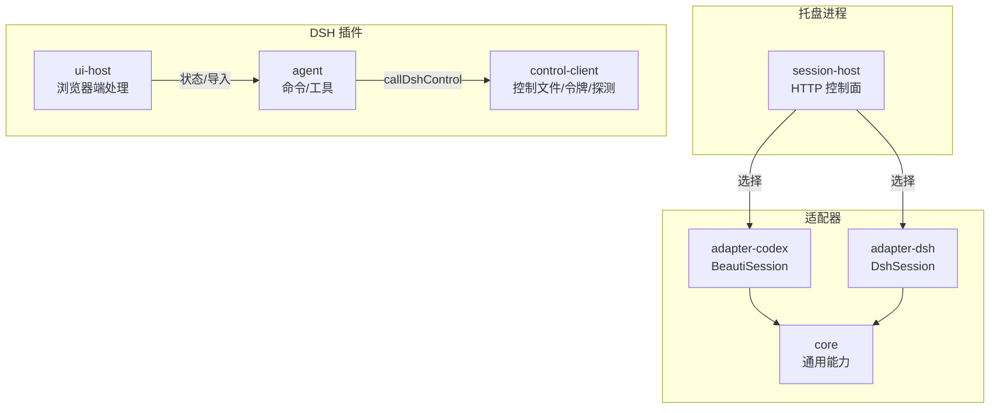
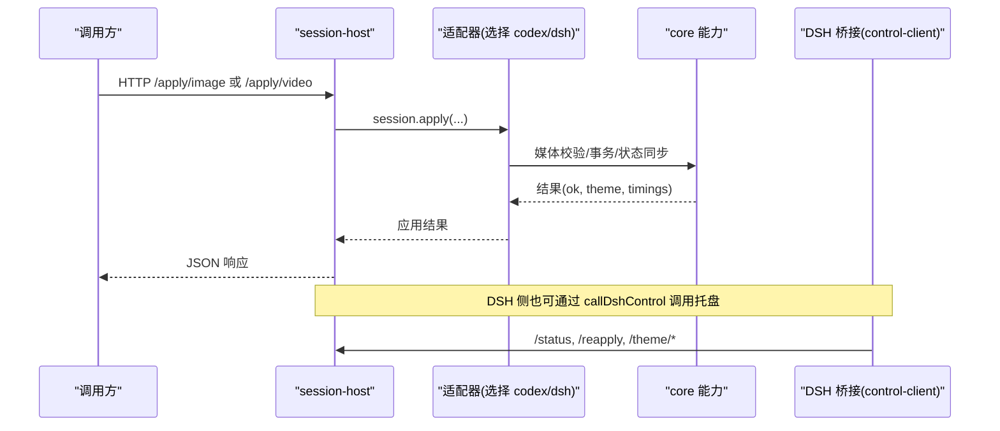
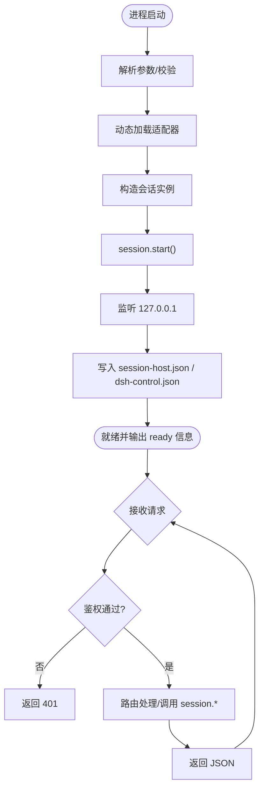
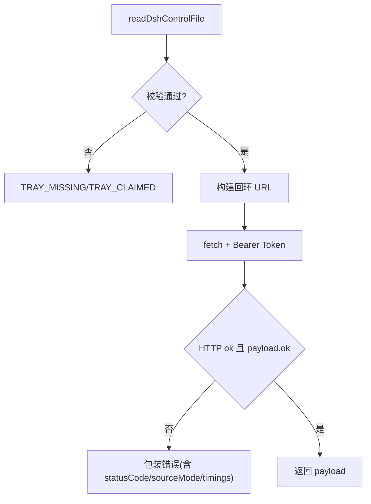
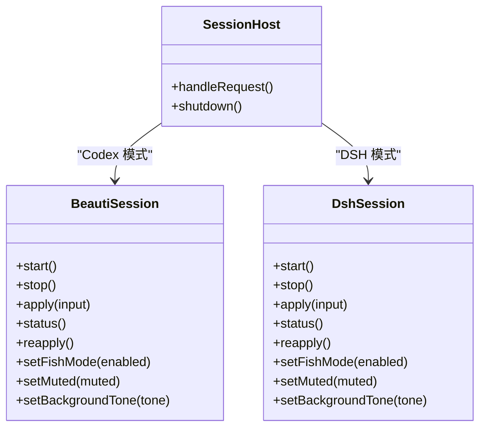
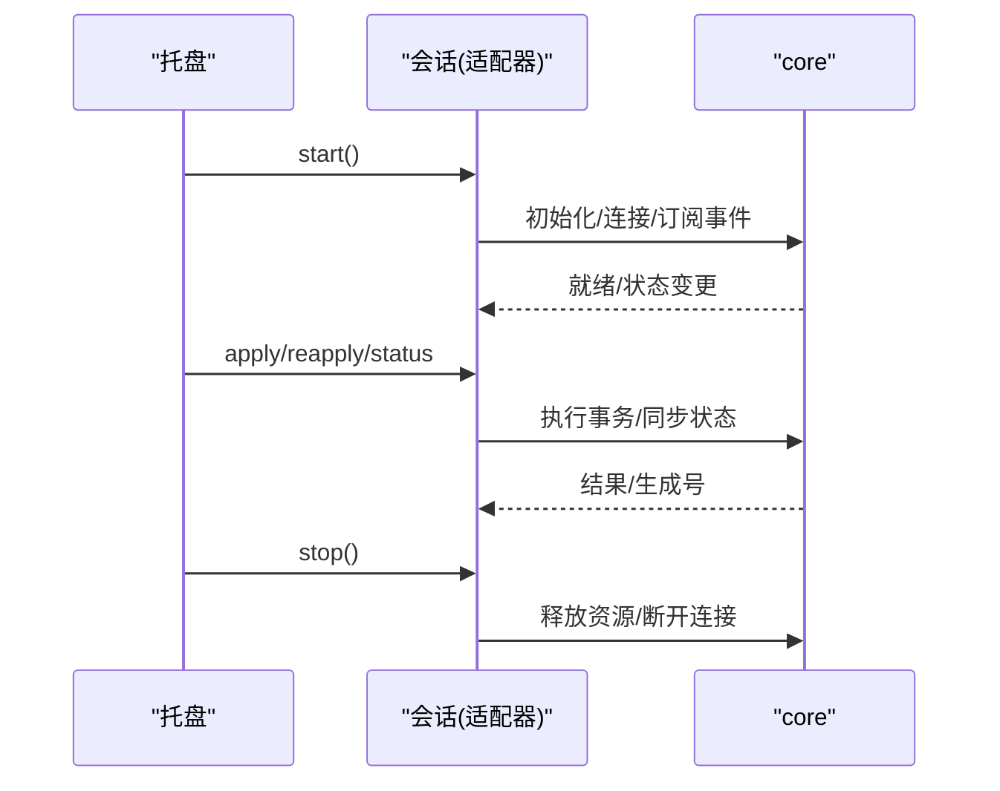
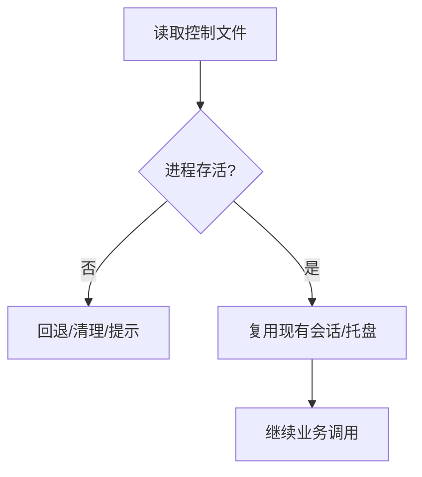
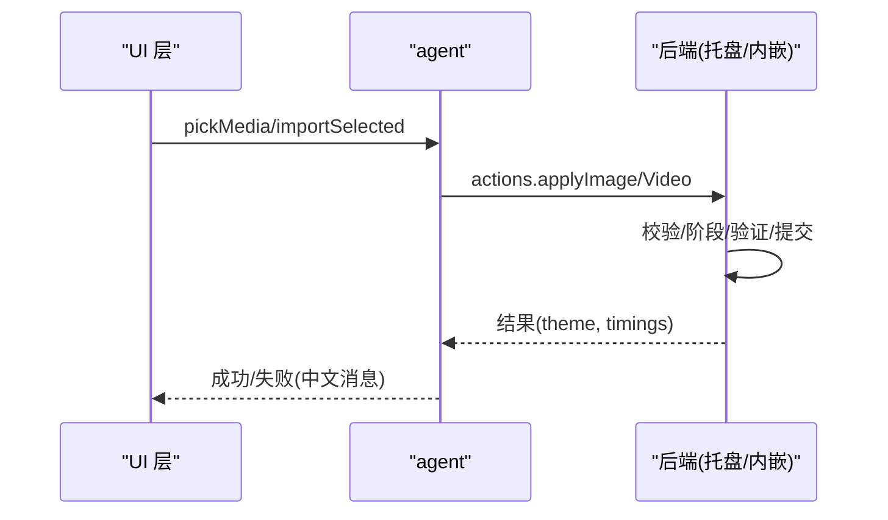
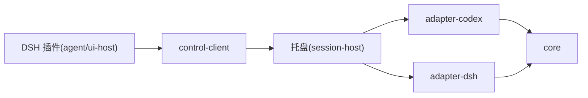

# 宿主会话管理

<cite>
**本文引用的文件**
- [apps/tray/session-host.mjs](file://apps/tray/session-host.mjs)
- [integrations/deepseek-harness/host-apply.mjs](file://integrations/deepseek-harness/host-apply.mjs)
- [integrations/deepseek-harness/control-client.mjs](file://integrations/deepseek-harness/control-client.mjs)
- [integrations/deepseek-harness/agent.mjs](file://integrations/deepseek-harness/agent.mjs)
- [integrations/deepseek-harness/ui-host.mjs](file://integrations/deepseek-harness/ui-host.mjs)
- [packages/adapter-codex/src/index.ts](file://packages/adapter-codex/src/index.ts)
- [packages/adapter-dsh/src/index.ts](file://packages/adapter-dsh/src/index.ts)
- [packages/core/src/index.ts](file://packages/core/src/index.ts)
</cite>

## 目录
1. [简介](#简介)
2. [项目结构](#项目结构)
3. [核心组件](#核心组件)
4. [架构总览](#架构总览)
5. [详细组件分析](#详细组件分析)
6. [依赖关系分析](#依赖关系分析)
7. [性能考虑](#性能考虑)
8. [故障排查指南](#故障排查指南)
9. [结论](#结论)
10. [附录：接口规范与适配器开发指南](#附录接口规范与适配器开发指南)

## 简介
本文件面向“统一宿主应用接口”的抽象设计与实现，说明如何通过 HostSession 适配 Codex Desktop 与 DeepSeek Harness（DSH）等不同宿主，提供一致的会话生命周期管理、状态同步、进程存活检测、错误恢复与优雅关闭能力。同时覆盖摸鱼模式（全屏背景展示）、快捷键控制、主题管理与导入流程，并给出完整的接口规范与适配器开发最佳实践。

## 项目结构
- 托盘侧长驻进程 session-host：暴露本地回环 HTTP 控制面，负责认证、路由、调用具体宿主适配器，完成图片/视频应用、主题管理、摸鱼模式、静音/色调切换等。
- DSH 桥接层：通过 control-client 读写共享控制文件，发现并调用托盘或内嵌会话；agent 将斜杠命令与工具注册到 DSH 工作流；ui-host 提供浏览器端 UI 处理逻辑。
- 适配器包：adapter-codex 与 adapter-dsh 分别封装不同宿主的连接、注入与状态同步细节；core 提供通用类型、媒体校验、事务、进程存活检测等基础能力。

**图表来源**
- [apps/tray/session-host.mjs:109-198](file://apps/tray/session-host.mjs#L109-L198)
- [integrations/deepseek-harness/host-apply.mjs:32-117](file://integrations/deepseek-harness/host-apply.mjs#L32-L117)
- [integrations/deepseek-harness/control-client.mjs:219-517](file://integrations/deepseek-harness/control-client.mjs#L219-L517)
- [packages/adapter-codex/src/index.ts:71-78](file://packages/adapter-codex/src/index.ts#L71-L78)
- [packages/adapter-dsh/src/index.ts:1-15](file://packages/adapter-dsh/src/index.ts#L1-L15)

**章节来源**
- [apps/tray/session-host.mjs:1-198](file://apps/tray/session-host.mjs#L1-L198)
- [integrations/deepseek-harness/host-apply.mjs:1-165](file://integrations/deepseek-harness/host-apply.mjs#L1-L165)
- [integrations/deepseek-harness/control-client.mjs:1-517](file://integrations/deepseek-harness/control-client.mjs#L1-L517)
- [packages/adapter-codex/src/index.ts:1-79](file://packages/adapter-codex/src/index.ts#L1-L79)
- [packages/adapter-dsh/src/index.ts:1-16](file://packages/adapter-dsh/src/index.ts#L1-L16)
- [packages/core/src/index.ts:1-19](file://packages/core/src/index.ts#L1-L19)

## 核心组件
- 托盘控制面 session-host：解析参数、动态加载适配器、启动会话、监听本地端口、鉴权路由、转发请求至会话对象，并在退出时清理控制文件与连接。
- DSH 桥接 control-client：原子化写入/读取控制文件，校验令牌与回环地址，封装 callDshControl 调用托盘或 DSH Web 控制端点。
- 适配器抽象：
  - adapter-codex：暴露 BeautiSession，用于通过 CDP 连接桌面浏览器并注入脚本。
  - adapter-dsh：暴露 DshSession，用于通过 DSH 桥接协议与页面通信。
- 会话生命周期：start → 建立连接 → 状态轮询/事件同步 → apply/reapply/status → stop。
- 进程存活检测：基于 PID 与可选 core 模块记录时间戳进行存活判定，避免僵尸进程误判。
- 错误恢复：统一中文错误信息转换、超时/取消信号、重试与降级策略（托盘优先，否则内嵌会话）。

**章节来源**
- [apps/tray/session-host.mjs:109-198](file://apps/tray/session-host.mjs#L109-L198)
- [integrations/deepseek-harness/control-client.mjs:83-132](file://integrations/deepseek-harness/control-client.mjs#L83-L132)
- [packages/adapter-codex/src/index.ts:71-78](file://packages/adapter-codex/src/index.ts#L71-L78)
- [packages/adapter-dsh/src/index.ts:1-15](file://packages/adapter-dsh/src/index.ts#L1-L15)
- [packages/core/src/index.ts:1-19](file://packages/core/src/index.ts#L1-L19)

## 架构总览
下图展示了从托盘控制面到具体宿主适配器的调用路径，以及 DSH 侧通过 control-client 对托盘或内嵌会话的调度。

**图表来源**
- [apps/tray/session-host.mjs:363-418](file://apps/tray/session-host.mjs#L363-L418)
- [integrations/deepseek-harness/control-client.mjs:463-517](file://integrations/deepseek-harness/control-client.mjs#L463-L517)
- [packages/core/src/index.ts:1-19](file://packages/core/src/index.ts#L1-L19)

## 详细组件分析

### 托盘控制面 session-host
- 职责
  - 解析运行参数（host、port、dataRoot、parent-pid、verify-ms 等），动态加载对应适配器。
  - 启动会话（支持 deferHostConnect 延迟连接以快速显示托盘）。
  - 监听 127.0.0.1 端口，提供健康检查、状态查询、主题管理、模式控制、重新应用等接口。
  - 鉴权：Bearer Token 校验，拒绝非授权访问。
  - 优雅关闭：移除控制文件、停止会话、关闭服务器、退出进程。
- 关键流程
  - 启动：创建会话实例 → start() → 监听端口 → 写入 session-host.json 与 dsh-control.json（DSH 模式）。
  - 请求处理：统一 readBody → 路由分发 → 调用 session.* → 返回 JSON。
  - 父进程守护：若传入 parent-pid，定时检测是否存活，异常则关闭。
- 错误处理
  - 统一 toChineseErrorMessage 转换错误消息。
  - 大请求体限制、非法参数、未找到资源等明确状态码。

**图表来源**
- [apps/tray/session-host.mjs:109-198](file://apps/tray/session-host.mjs#L109-L198)
- [apps/tray/session-host.mjs:290-540](file://apps/tray/session-host.mjs#L290-L540)
- [apps/tray/session-host.mjs:546-639](file://apps/tray/session-host.mjs#L546-L639)

**章节来源**
- [apps/tray/session-host.mjs:1-639](file://apps/tray/session-host.mjs#L1-L639)

### DSH 桥接 control-client
- 职责
  - 定义控制文件 schema 与路径常量。
  - 原子化写入/读取控制文件，校验 URL、令牌长度、PID 合法性。
  - 进程存活检测：优先使用 core 模块 isRecordedPidLive，否则回退到 kill(pid, 0)。
  - 封装 callDshControl：读取控制文件、拼接 URL、附加 Bearer Token、超时与取消信号合并、错误包装。
- 安全边界
  - 仅允许回环 HTTP 地址。
  - 严格校验 token 长度与格式。
  - 禁止路径越界与重复前缀。

**图表来源**
- [integrations/deepseek-harness/control-client.mjs:219-517](file://integrations/deepseek-harness/control-client.mjs#L219-L517)

**章节来源**
- [integrations/deepseek-harness/control-client.mjs:1-517](file://integrations/deepseek-harness/control-client.mjs#L1-L517)

### 适配器与宿主抽象
- adapter-codex
  - 导出 BeautiSession 及 CDP 相关能力，用于连接桌面浏览器并通过 CDP 注入脚本与应用背景。
- adapter-dsh
  - 导出 DshSession 及 DSH 桥接能力，用于与 DSH Web 页面通信。
- 统一入口
  - 托盘根据 host 参数选择适配器类（BeautiSession 或 DshSession），对外暴露一致的方法集（apply、status、reapply、setFishMode、setMuted、setBackgroundTone 等）。

**图表来源**
- [packages/adapter-codex/src/index.ts:71-78](file://packages/adapter-codex/src/index.ts#L71-L78)
- [packages/adapter-dsh/src/index.ts:1-15](file://packages/adapter-dsh/src/index.ts#L1-L15)
- [apps/tray/session-host.mjs:109-198](file://apps/tray/session-host.mjs#L109-L198)

**章节来源**
- [packages/adapter-codex/src/index.ts:1-79](file://packages/adapter-codex/src/index.ts#L1-L79)
- [packages/adapter-dsh/src/index.ts:1-16](file://packages/adapter-dsh/src/index.ts#L1-L16)
- [apps/tray/session-host.mjs:109-198](file://apps/tray/session-host.mjs#L109-L198)

### 会话生命周期与状态同步
- 初始化
  - 托盘启动时构造会话并调用 start()，可选择 deferHostConnect 延迟连接以提升托盘响应速度。
  - DSH 侧可通过 ensureInProcessSession 在缺少托盘时拉起内嵌会话。
- 连接建立
  - Codex：通过 CDP 发现与连接目标页，注入脚本并建立事件通道。
  - DSH：通过 control-client 与 DSH Web 控制端点通信，维护会话状态。
- 状态同步
  - status 接口返回 background、sessions、fish、muted、tone、sourceMode、themeId 等。
  - reapply 用于在宿主重启后重放最近一次背景应用事务。
- 优雅关闭
  - 移除控制文件、停止会话、关闭服务器、退出进程；父进程退出时自动触发关闭。

**图表来源**
- [apps/tray/session-host.mjs:151-198](file://apps/tray/session-host.mjs#L151-L198)
- [integrations/deepseek-harness/host-apply.mjs:73-117](file://integrations/deepseek-harness/host-apply.mjs#L73-L117)
- [packages/core/src/index.ts:1-19](file://packages/core/src/index.ts#L1-L19)

**章节来源**
- [apps/tray/session-host.mjs:151-198](file://apps/tray/session-host.mjs#L151-L198)
- [integrations/deepseek-harness/host-apply.mjs:73-117](file://integrations/deepseek-harness/host-apply.mjs#L73-L117)

### 进程存活检测与自动恢复
- 机制
  - 读取控制文件中的 pid 与 startedAt/mtimeMs，结合 core 模块 isRecordedPidLive 判断进程是否仍活跃。
  - 若无 core 能力，回退到 kill(pid, 0) 的轻量探测。
- 自动恢复
  - 当检测到托盘已存在或已声明占用时，优先走托盘；否则尝试拉起内嵌会话。
  - 托盘侧在父进程退出时主动关闭自身，避免僵尸服务。

**图表来源**
- [integrations/deepseek-harness/control-client.mjs:83-132](file://integrations/deepseek-harness/control-client.mjs#L83-L132)
- [integrations/deepseek-harness/host-apply.mjs:50-117](file://integrations/deepseek-harness/host-apply.mjs#L50-L117)

**章节来源**
- [integrations/deepseek-harness/control-client.mjs:83-132](file://integrations/deepseek-harness/control-client.mjs#L83-L132)
- [integrations/deepseek-harness/host-apply.mjs:50-117](file://integrations/deepseek-harness/host-apply.mjs#L50-L117)

### 状态同步协议
- 数据一致性
  - 通过 status 获取当前背景、会话数、摸鱼、静音、色调、主题 ID、来源模式等。
  - 通过 reapply 在宿主重启后重放最近一次应用事务，确保状态一致。
- 错误传播
  - 所有错误经 toChineseErrorMessage 转换为中文消息，便于用户理解。
  - 错误对象携带 statusCode、sourceMode、timings 等上下文，便于定位问题。

**章节来源**
- [integrations/deepseek-harness/agent.mjs:144-174](file://integrations/deepseek-harness/agent.mjs#L144-L174)
- [apps/tray/session-host.mjs:314-321](file://apps/tray/session-host.mjs#L314-L321)
- [integrations/deepseek-harness/control-client.mjs:463-517](file://integrations/deepseek-harness/control-client.mjs#L463-L517)

### 摸鱼模式实现原理
- 功能
  - 通过 /mode/fish 开关摸鱼模式，隐藏宿主界面，仅保留全屏背景。
  - 需要已有背景才能进入摸鱼模式（无背景时拒绝）。
- 快捷键控制
  - 由宿主侧 UI 或快捷键绑定触发 /mode/fish；托盘侧仅做属性设置。
- 实现要点
  - 托盘调用 session.setFishMode(enabled)，适配器在宿主中执行相应 UI 切换。
  - 状态通过 status 反馈 fish 字段。

**章节来源**
- [apps/tray/session-host.mjs:493-501](file://apps/tray/session-host.mjs#L493-L501)
- [integrations/deepseek-harness/agent.mjs:466-484](file://integrations/deepseek-harness/agent.mjs#L466-L484)

### 主题与导入流程
- 主题管理
  - 列表、使用、删除、保存当前主题、应用内置预设。
  - 支持 image/video 两种类型，可附带 effects（如氛围预设）。
- 导入方式
  - 托管上传（managed）：浏览器端上传到临时目录，再调用 apply。
  - 本地选择（local）：Windows 原生文件选择器，直接应用本地文件。
- 事务性
  - 导入与应用为原子事务，包含校验、阶段提交、验证与提交，失败回滚。

**图表来源**
- [integrations/deepseek-harness/ui-host.mjs:450-668](file://integrations/deepseek-harness/ui-host.mjs#L450-L668)
- [integrations/deepseek-harness/agent.mjs:190-328](file://integrations/deepseek-harness/agent.mjs#L190-L328)

**章节来源**
- [integrations/deepseek-harness/ui-host.mjs:450-668](file://integrations/deepseek-harness/ui-host.mjs#L450-L668)
- [integrations/deepseek-harness/agent.mjs:190-328](file://integrations/deepseek-harness/agent.mjs#L190-L328)

## 依赖关系分析
- 托盘依赖适配器与 core：根据 host 动态加载适配器，调用其会话方法；错误信息通过 core 统一转换。
- DSH 插件依赖 control-client：通过控制文件发现托盘或内嵌会话，统一调用。
- 适配器依赖 core：媒体校验、事务、进程存活检测、路径与锁等通用能力。

**图表来源**
- [apps/tray/session-host.mjs:109-198](file://apps/tray/session-host.mjs#L109-L198)
- [integrations/deepseek-harness/agent.mjs:1-10](file://integrations/deepseek-harness/agent.mjs#L1-L10)
- [integrations/deepseek-harness/control-client.mjs:463-517](file://integrations/deepseek-harness/control-client.mjs#L463-L517)
- [packages/core/src/index.ts:1-19](file://packages/core/src/index.ts#L1-L19)

**章节来源**
- [apps/tray/session-host.mjs:109-198](file://apps/tray/session-host.mjs#L109-L198)
- [integrations/deepseek-harness/agent.mjs:1-10](file://integrations/deepseek-harness/agent.mjs#L1-L10)
- [integrations/deepseek-harness/control-client.mjs:463-517](file://integrations/deepseek-harness/control-client.mjs#L463-L517)
- [packages/core/src/index.ts:1-19](file://packages/core/src/index.ts#L1-L19)

## 性能考虑
- 延迟连接：托盘启动时 deferHostConnect，先显示托盘，后台再连接宿主与首次发布背景，提升用户体验。
- 超时与取消：所有网络调用合并用户信号与超时信号，避免长时间阻塞。
- 资源限制：请求体大小限制、媒体文件大小限制、临时文件清理，防止内存与磁盘压力。
- 并发控制：文件选择器互斥、待处理选择项数量上限与过期清理，避免资源泄露。

[本节为通用指导，不直接分析具体文件]

## 故障排查指南
- 常见错误
  - TRAY_MISSING：未找到正在运行的托盘，需先启动 beautiCode。
  - TRAY_CLAIMED：托盘正在启动，稍后再试。
  - ENGINE_MISSING：未能加载本机导入引擎，需执行 npx beauticode-dsh 或从完整安装目录加载桥接。
  - 文件过大/类型不支持：检查文件大小与扩展名。
  - 无法连接托盘：检查回环地址、令牌、防火墙与进程存活。
- 诊断步骤
  - 查看 /health 与 /status 确认托盘就绪与状态。
  - 检查控制文件是否存在且有效（schema、token、pid、url）。
  - 使用 callDshControl 的超时与取消信号，观察错误详情（statusCode、sourceMode、timings）。
  - 在 DSH 侧查看 import-timing.jsonl 日志，定位导入耗时与失败原因。

**章节来源**
- [integrations/deepseek-harness/control-client.mjs:12-14](file://integrations/deepseek-harness/control-client.mjs#L12-L14)
- [integrations/deepseek-harness/host-apply.mjs:13-14](file://integrations/deepseek-harness/host-apply.mjs#L13-L14)
- [integrations/deepseek-harness/ui-host.mjs:32-44](file://integrations/deepseek-harness/ui-host.mjs#L32-L44)
- [apps/tray/session-host.mjs:290-540](file://apps/tray/session-host.mjs#L290-L540)

## 结论
通过统一的 HostSession 抽象，beautiCode 实现了跨宿主（Codex Desktop 与 DeepSeek Harness）的一致会话管理、状态同步与错误恢复能力。托盘控制面提供安全的本地 HTTP 接口，DSH 桥接层通过控制文件与令牌机制实现进程间协作。适配器封装了底层差异，上层业务无需关心具体宿主实现。该设计具备良好的可扩展性与可维护性，适合持续演进与多宿主适配。

[本节为总结，不直接分析具体文件]

## 附录：接口规范与适配器开发指南

### 托盘控制面接口规范
- 健康与状态
  - GET /health：返回 host、cdpPort、open、busy、hostReady。
  - GET /status：返回会话状态（background、sessions、fish、muted、tone、sourceMode、themeId 等）。
- 背景应用
  - POST /apply/image：{ imagePath, source?, effects? }
  - POST /apply/video：{ videoPath, imagePath?, source?, startAt? }
  - POST /apply/clear：{}
  - POST /reapply：{}（重放最近一次应用事务）
- 主题管理
  - POST /theme/apply：{ name, input }（input.type=image|video）
  - POST /theme/save：{ name }（保存当前主题）
  - GET /theme/list：列出已保存主题
  - POST /theme/use：{ id }
  - POST /theme/delete：{ id }
- 模式控制
  - POST /mode/fish：{ enabled }
  - POST /mode/muted：{ muted }
  - POST /mode/tone：{ tone }（dark/light/auto）
- 其他
  - POST /discover：发现可用端点（Codex 或 DSH）
  - POST /shutdown：优雅关闭

注意：所有请求需携带 Authorization: Bearer <token>，token 来自 BEAUTICODE_CONTROL_TOKEN。

**章节来源**
- [apps/tray/session-host.mjs:9-24](file://apps/tray/session-host.mjs#L9-L24)
- [apps/tray/session-host.mjs:279-540](file://apps/tray/session-host.mjs#L279-L540)

### DSH 侧接口与工具
- 工具注册
  - beauticode_apply_image/beauticode_apply_video/beauticode_clear/beauticode_status/beauticode_set_fish/beauticode_set_muted 等。
- 斜杠命令
  - /bg、/bg-theme、/bg-clear。
- 浏览器端 UI
  - status/importFile/pickMedia/importSelected/clear/mode/useTheme/deleteTheme/galleryConfig/catalog/install/applyPreset 等。

**章节来源**
- [integrations/deepseek-harness/agent.mjs:551-685](file://integrations/deepseek-harness/agent.mjs#L551-L685)
- [integrations/deepseek-harness/ui-host.mjs:413-796](file://integrations/deepseek-harness/ui-host.mjs#L413-L796)

### 状态枚举与数据结构
- 背景类型：image | video | clear
- 来源模式：local | managed | clear
- 色调：dark | light | auto
- 摸鱼：boolean
- 静音：boolean
- 主题：{ id, name, type, bundled?, sourceMode?, savedAt?, videoPositionSec? }

**章节来源**
- [integrations/deepseek-harness/agent.mjs:144-174](file://integrations/deepseek-harness/agent.mjs#L144-L174)
- [apps/tray/session-host.mjs:244-258](file://apps/tray/session-host.mjs#L244-L258)

### 适配器开发指南与最佳实践
- 统一接口
  - 实现 start/stop/apply/status/reapply/setFishMode/setMuted/setBackgroundTone 等方法。
  - 错误信息通过 toChineseErrorMessage 转换为中文。
- 连接与注入
  - Codex：通过 CDP 发现与连接目标页，注入脚本与应用背景。
  - DSH：通过 control-client 与 DSH Web 控制端点通信。
- 事务与一致性
  - 应用背景应遵循“校验→阶段→验证→提交”的事务模型，失败回滚。
  - 使用 reapply 在宿主重启后恢复状态。
- 安全与健壮性
  - 仅允许回环地址与合法令牌。
  - 超时与取消信号合并，避免阻塞。
  - 父进程守护与优雅关闭，清理控制文件与连接。
- 测试建议
  - 模拟 CDP 或 DSH 端点，验证 apply/reapply/status 流程。
  - 覆盖错误场景：无效路径、超大文件、令牌缺失、进程死亡等。

**章节来源**
- [packages/adapter-codex/src/index.ts:71-78](file://packages/adapter-codex/src/index.ts#L71-L78)
- [packages/adapter-dsh/src/index.ts:1-15](file://packages/adapter-dsh/src/index.ts#L1-L15)
- [integrations/deepseek-harness/host-apply.mjs:73-117](file://integrations/deepseek-harness/host-apply.mjs#L73-L117)
- [integrations/deepseek-harness/control-client.mjs:463-517](file://integrations/deepseek-harness/control-client.mjs#L463-L517)