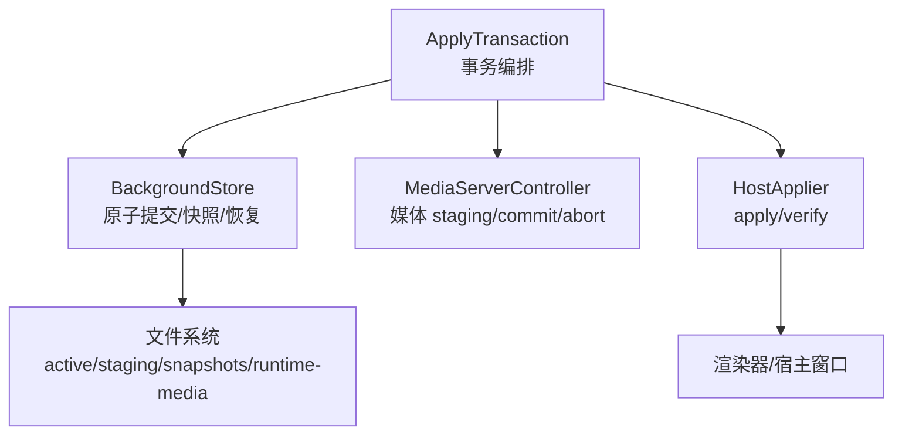
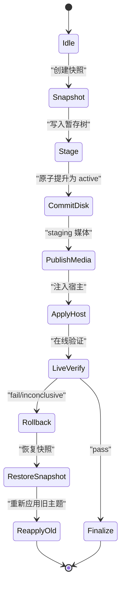
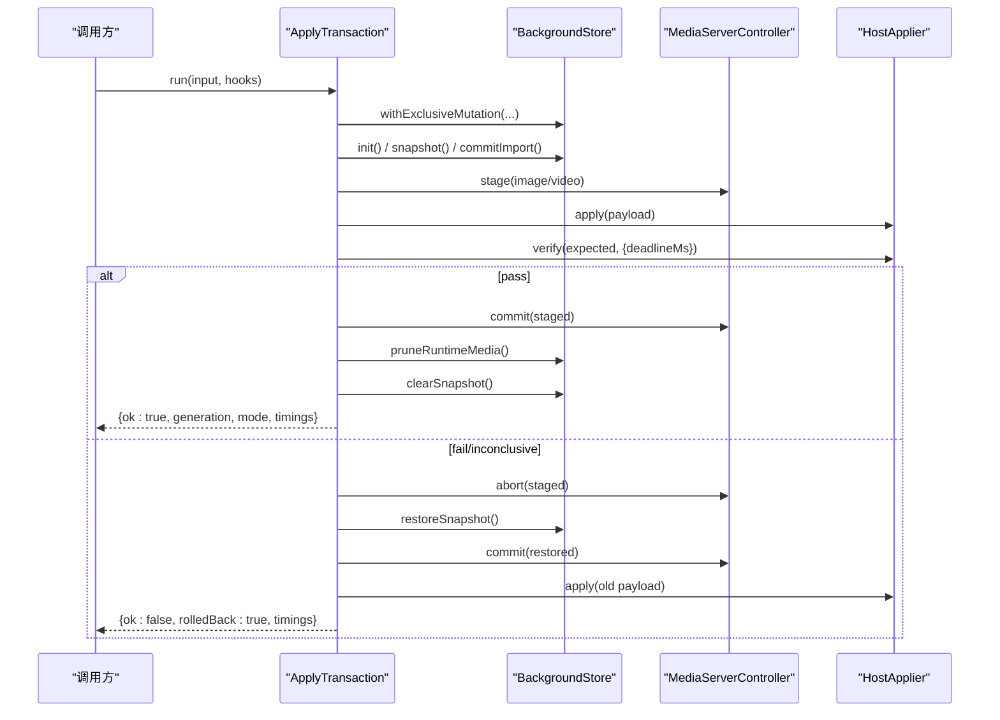
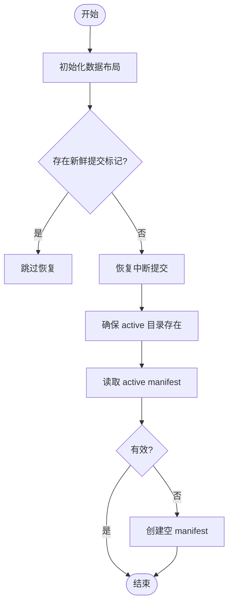
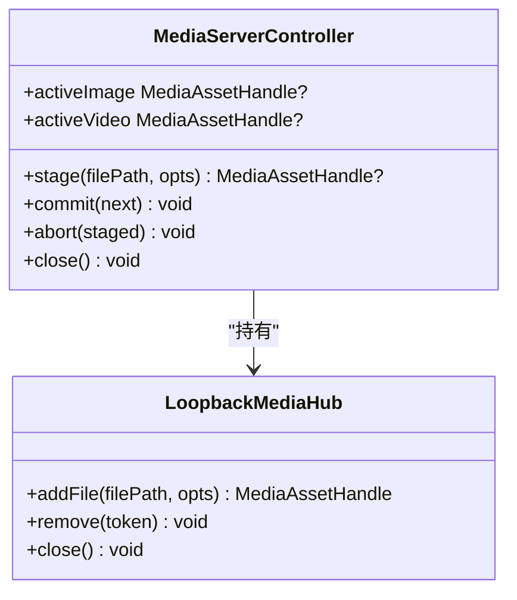
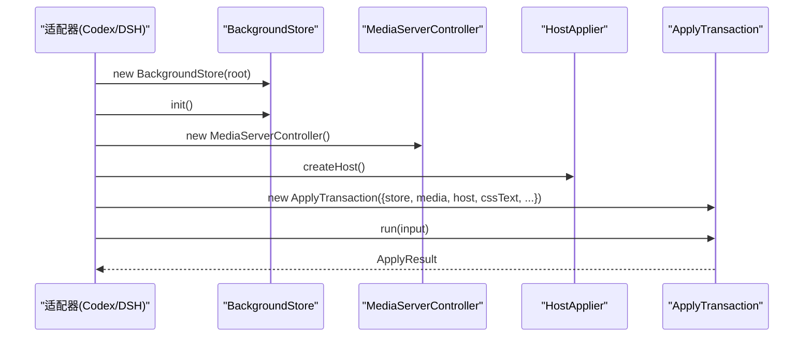
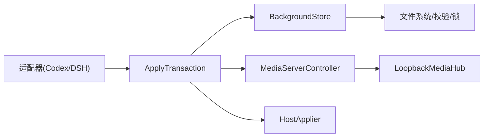

# 应用事务系统

<cite>
**本文引用的文件**
- [apply-transaction.ts](file://packages/core/src/apply-transaction.ts)
- [background-store.ts](file://packages/core/src/background-store.ts)
- [media-server.ts](file://packages/core/src/media-server.ts)
- [types.ts](file://packages/core/src/types.ts)
- [injector.ts](file://packages/adapter-codex/src/injector.ts)
- [session.ts (Codex)](file://packages/adapter-codex/src/session.ts)
- [session.ts (DSH)](file://packages/adapter-dsh/src/session.ts)
- [host-applier.ts](file://packages/adapter-codex/src/host-applier.ts)
- [memory-host.ts](file://packages/adapter-codex/src/memory-host.ts)
- [apply-transaction.md](file://docs/apply-transaction.md)
</cite>

## 目录
1. [简介](#简介)
2. [项目结构](#项目结构)
3. [核心组件](#核心组件)
4. [架构总览](#架构总览)
5. [详细组件分析](#详细组件分析)
6. [依赖关系分析](#依赖关系分析)
7. [性能考虑与优化建议](#性能考虑与优化建议)
8. [故障排除指南](#故障排除指南)
9. [结论](#结论)
10. [附录：API 使用示例](#附录api-使用示例)

## 简介
本文件系统围绕 ApplyTransaction 实现“背景应用”的原子性事务保证，确保在后台写入、媒体服务切换与渲染层注入过程中，任何失败都能回滚到一致状态。其核心目标是：**磁盘写入成功不等于用户可见的成功**。只有在宿主（渲染器）确认新背景已正确显示后，才认为事务最终成功；否则将回滚到快照并恢复上一代主题。

事务阶段划分清晰：准备阶段（创建快照、构建提交）、执行阶段（提交到磁盘、发布媒体、注入宿主）、验证阶段（在线校验或离线直通），以及提交/回滚阶段的职责分离。通过锁机制、原子目录交换、日志与恢复、媒体句柄生命周期管理，系统在高并发和异常场景下仍保持数据一致性与用户体验稳定。

## 项目结构
- 核心事务编排位于 packages/core/src/apply-transaction.ts
- 持久化与原子提交逻辑位于 packages/core/src/background-store.ts
- 媒体资源管理与发布位于 packages/core/src/media-server.ts
- 类型定义位于 packages/core/src/types.ts
- 适配器层集成（Codex/DSH）位于 packages/adapter-codex 与 packages/adapter-dsh
- 设计文档与状态机说明位于 docs/apply-transaction.md

图表来源
- [apply-transaction.ts:103-154](file://packages/core/src/apply-transaction.ts#L103-L154)
- [background-store.ts:123-159](file://packages/core/src/background-store.ts#L123-L159)
- [media-server.ts:636-731](file://packages/core/src/media-server.ts#L636-L731)

章节来源
- [apply-transaction.md:7-19](file://docs/apply-transaction.md#L7-L19)
- [apply-transaction.ts:103-154](file://packages/core/src/apply-transaction.ts#L103-L154)
- [background-store.ts:123-159](file://packages/core/src/background-store.ts#L123-L159)

## 核心组件
- ApplyTransaction：事务编排器，负责从快照到提交、媒体发布、宿主注入、验证与回滚的全流程控制，并提供耗时统计与钩子扩展点。
- BackgroundStore：提供数据根布局初始化、原子提交（带标记与日志）、快照/恢复、运行时视频拷贝与清理、写入锁等能力。
- MediaServerController：管理图片/视频资源的 staging、commit、abort 与关闭，支持多资产对（image+video）的生命周期。
- HostApplier：抽象宿主注入接口，包含 apply 与 verify，由 Codex/DSH 等适配器实现。
- 类型系统：统一描述输入输出、媒体源、验证结果、宿主能力等。

章节来源
- [apply-transaction.ts:103-154](file://packages/core/src/apply-transaction.ts#L103-L154)
- [background-store.ts:123-159](file://packages/core/src/background-store.ts#L123-L159)
- [media-server.ts:636-731](file://packages/core/src/media-server.ts#L636-L731)
- [types.ts:107-215](file://packages/core/src/types.ts#L107-L215)

## 架构总览
事务状态机遵循“准备→执行→验证→提交/回滚”的严格顺序，确保任何中间失败都可回滚。

图表来源
- [apply-transaction.md:7-19](file://docs/apply-transaction.md#L7-L19)
- [apply-transaction.ts:178-265](file://packages/core/src/apply-transaction.ts#L178-L265)
- [background-store.ts:504-529](file://packages/core/src/background-store.ts#L504-L529)
- [background-store.ts:680-716](file://packages/core/src/background-store.ts#L680-L716)

章节来源
- [apply-transaction.md:7-19](file://docs/apply-transaction.md#L7-L19)
- [apply-transaction.ts:178-265](file://packages/core/src/apply-transaction.ts#L178-L265)

## 详细组件分析

### ApplyTransaction：事务编排与错误恢复
- 原子性保证：通过 BackgroundStore.withExclusiveMutation 串行化写操作，避免并发交错；内部 busy 标志防止嵌套调用。
- 阶段职责：
  - 准备阶段：store.init()、snapshot()、commitImport(input) 构建新的 manifest 并原子提升为 active。
  - 执行阶段：stageMedia() 将图片/视频资源加入媒体服务；buildPayload() 构造注入载荷；host.apply() 注入宿主。
  - 验证阶段：host.verify() 在可见目标上校验，支持重试与可恢复失败（如首帧/Range探针）。
  - 提交阶段：media.commit() 提升新媒体句柄；pruneRuntimeMedia() 清理临时视频；beforeFinalize 钩子保存主题；clearSnapshot() 清理快照。
  - 回滚阶段：abort staged media、restoreSnapshot()、re-apply 旧主题、清理临时资源。
- 监控与日志：每个阶段用 measure(name, work) 记录耗时，返回 timings.totalMs 与 phases 明细。
- 错误恢复：捕获异常时优先尝试 rollback；若 finalize 已开始，触发 onRollback 钩子进行补偿清理。

图表来源
- [apply-transaction.ts:127-154](file://packages/core/src/apply-transaction.ts#L127-L154)
- [apply-transaction.ts:178-265](file://packages/core/src/apply-transaction.ts#L178-L265)
- [apply-transaction.ts:349-383](file://packages/core/src/apply-transaction.ts#L349-L383)

章节来源
- [apply-transaction.ts:103-154](file://packages/core/src/apply-transaction.ts#L103-L154)
- [apply-transaction.ts:178-265](file://packages/core/src/apply-transaction.ts#L178-L265)
- [apply-transaction.ts:349-383](file://packages/core/src/apply-transaction.ts#L349-L383)

### BackgroundStore：原子提交、快照与恢复
- 原子提交：使用 COMMIT_MARKER 与 COMMIT_JOURNAL 记录提交阶段，配合 activeDir 与 stagingDir 的原子 rename，避免读者看到混合状态。
- 快照与恢复：snapshot() 复制当前 manifest 与受管文件到 snapshotsDir；restoreSnapshot() 重建 staging 并提升为 active，同时递增 generation。
- 写入锁：withExclusiveMutation() 基于文件锁与 AsyncLocalStorage 实现跨进程/异步上下文互斥，防止并发 stage/commit 交错。
- 运行时视频：prepareRuntimeVideo() 为托管视频生成 detached runtime copy，避免 Chromium 打开 active 目录导致 EPERM；pruneRuntimeMedia() 清理过期 session。
- 恢复中断提交：init() 检测 fresh marker，若有则跳过；否则 recoverInterruptedCommit() 清理 journal/marker 并恢复可用 active。

图表来源
- [background-store.ts:142-159](file://packages/core/src/background-store.ts#L142-L159)
- [background-store.ts:211-270](file://packages/core/src/background-store.ts#L211-L270)
- [background-store.ts:757-798](file://packages/core/src/background-store.ts#L757-L798)

章节来源
- [background-store.ts:123-159](file://packages/core/src/background-store.ts#L123-L159)
- [background-store.ts:504-529](file://packages/core/src/background-store.ts#L504-L529)
- [background-store.ts:680-716](file://packages/core/src/background-store.ts#L680-L716)
- [background-store.ts:757-798](file://packages/core/src/background-store.ts#L757-L798)

### MediaServerController：媒体 staging/commit/abort
- staging：将本地文件添加到 LoopbackMediaHub，返回 MediaAssetHandle（含 token/url/srcUrl）。
- commit：原子替换 image/video 句柄，移除不再需要的旧句柄，保持活跃引用。
- abort：释放非活跃 staging 句柄，避免资源泄漏。
- close：关闭 hub，清空句柄。

图表来源
- [media-server.ts:636-731](file://packages/core/src/media-server.ts#L636-L731)

章节来源
- [media-server.ts:636-731](file://packages/core/src/media-server.ts#L636-L731)

### 宿主集成：Codex 与 DSH
- Codex 适配器：
  - injector.runApplyOnce：创建 store、media、host，构造 ApplyTransaction 并执行。
  - session.applyInternal：确保 host 连接，加载 renderer CSS，构造 tx 并运行。
  - host-applier.verify：轮询收集验证样本，处理 inconclusive/fail/pass 策略，支持重放与愈合。
- DSH 适配器：
  - session.applyAndSaveTheme：封装 tx.run，并在 beforeFinalize 中保存主题进度。
  - includeImageDataUrl=false：使用认证环回 URL，不嵌入 data URL。

图表来源
- [injector.ts:51-77](file://packages/adapter-codex/src/injector.ts#L51-L77)
- [session.ts (Codex):279-312](file://packages/adapter-codex/src/session.ts#L279-L312)
- [session.ts (DSH):187-219](file://packages/adapter-dsh/src/session.ts#L187-L219)

章节来源
- [injector.ts:51-77](file://packages/adapter-codex/src/injector.ts#L51-L77)
- [session.ts (Codex):279-312](file://packages/adapter-codex/src/session.ts#L279-L312)
- [session.ts (DSH):187-219](file://packages/adapter-dsh/src/session.ts#L187-L219)
- [host-applier.ts:743-782](file://packages/adapter-codex/src/host-applier.ts#L743-L782)

## 依赖关系分析
- ApplyTransaction 依赖 BackgroundStore、MediaServerController、HostApplier。
- BackgroundStore 依赖文件系统工具、媒体校验、路径解析、文件锁。
- MediaServerController 依赖 LoopbackMediaHub。
- 适配器层依赖 Core 组件，并通过 HostApplier 与渲染器交互。

图表来源
- [apply-transaction.ts:103-154](file://packages/core/src/apply-transaction.ts#L103-L154)
- [background-store.ts:123-159](file://packages/core/src/background-store.ts#L123-L159)
- [media-server.ts:636-731](file://packages/core/src/media-server.ts#L636-L731)

章节来源
- [apply-transaction.ts:103-154](file://packages/core/src/apply-transaction.ts#L103-L154)
- [background-store.ts:123-159](file://packages/core/src/background-store.ts#L123-L159)
- [media-server.ts:636-731](file://packages/core/src/media-server.ts#L636-L731)

## 性能考虑与优化建议
- 原子目录交换与标记：避免读者看到混合状态，减少脏读风险；COMMIT_MARKER_STALE_MS 允许容错恢复。
- 媒体 staging：仅当需要时才 staging 资源；视频使用 detached runtime copy 避免 active 目录被占用导致的 EPERM。
- 验证超时与重试：verifyDeadlineMs 限制在线验证时间，支持可恢复失败的重试（如首帧/Range探针）。
- 写入链与锁：withExclusiveMutation 串行化写操作，避免并发冲突；AsyncLocalStorage 支持同上下文重入。
- 数据 URL 大小限制：MAX_INLINE_DATA_URL_BYTES 防止过大媒体嵌入导致内存压力。
- 运行时媒体清理：pruneRuntimeMedia 定期清理过期 session，避免磁盘膨胀。
- 建议：
  - 合理设置 verifyDeadlineMs，平衡首次渲染等待与用户体验。
  - 对大视频优先使用 blob/server 模式而非 data URL。
  - 监控 timings.phases 定位瓶颈阶段（commitImport、stageMedia、rendererVerify 等）。

[本节为通用指导，无需特定文件来源]

## 故障排除指南
- 常见失败场景：
  - 宿主验证失败：检查 verify 返回 status/reason，关注 generation mismatch、videoFailed、注入离线、水平溢出等硬失败。
  - 不可判定信号：窗口绑定间隙、短暂隐藏目标、单次 Runtime.evaluate 抖动，应在 deadline 内重试。
  - 媒体 staging 失败：检查文件有效性、路径安全、CSP 限制（data URL 大小）。
- 回滚行为：
  - 若 snapshot 存在且失败，将恢复快照并重新应用旧主题；媒体句柄会 abort 非活跃资源。
  - finalize 开始后失败，触发 onRollback 进行补偿清理。
- 调试工具：
  - 使用 MemoryHostApplier 模拟宿主，记录 payloads 与验证结果。
  - 查看 timings.totalMs 与 phases 明细，定位慢阶段。
  - 检查数据根 logs 目录（如适用）中的导入时序日志。

章节来源
- [memory-host.ts:17-51](file://packages/adapter-codex/src/memory-host.ts#L17-L51)
- [apply-transaction.ts:212-245](file://packages/core/src/apply-transaction.ts#L212-L245)
- [apply-transaction.ts:266-293](file://packages/core/src/apply-transaction.ts#L266-L293)
- [apply-transaction.md:62-97](file://docs/apply-transaction.md#L62-L97)

## 结论
ApplyTransaction 通过严格的阶段划分、原子提交、媒体句柄生命周期管理与宿主验证闭环，实现了背景应用的强一致性与高可用性。结合 BackgroundStore 的快照/恢复、MediaServerController 的资源管理以及适配器的灵活集成，系统在异常与并发场景下仍能保障数据一致与用户体验。通过监控与日志，可快速定位问题并进行优化。

[本节为总结，无需特定文件来源]

## 附录：API 使用示例
- 成功场景（离线模式）：
  - 创建 BackgroundStore 与 MediaServerController。
  - 构造 ApplyTransaction({ store, media, offline: true })。
  - 调用 run({ type: "image", imagePath, source: "local" }) 或 video。
  - 检查结果 ok=true，mode=image/video/clear，timings 包含各阶段耗时。
- 异常处理（在线模式）：
  - 构造 HostApplier（如 CodexHostApplier）。
  - 调用 run({ type: "image", imagePath })。
  - 若 verify 失败或超时，结果 ok=false，rolledBack=true，错误信息包含阶段摘要。
- 钩子扩展：
  - beforeFinalize：在媒体提升后、快照清理前保存主题进度。
  - onRollback：补偿清理 beforeFinalize 创建的临时状态。

章节来源
- [types.ts:107-215](file://packages/core/src/types.ts#L107-L215)
- [apply-transaction.ts:127-154](file://packages/core/src/apply-transaction.ts#L127-L154)
- [apply-transaction.ts:178-265](file://packages/core/src/apply-transaction.ts#L178-L265)
- [background-store.test.js:329-353](file://packages/core/test/background-store.test.js#L329-L353)