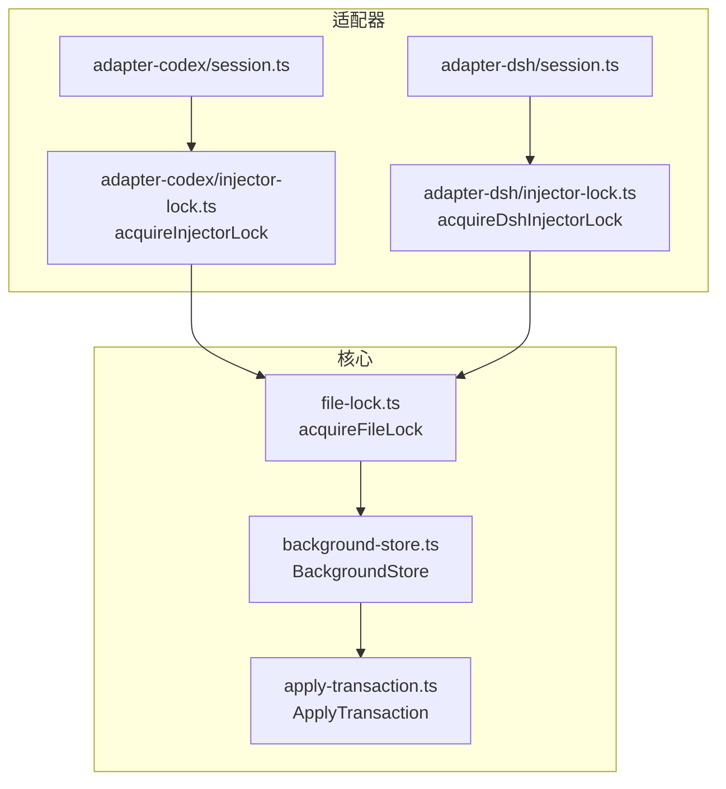
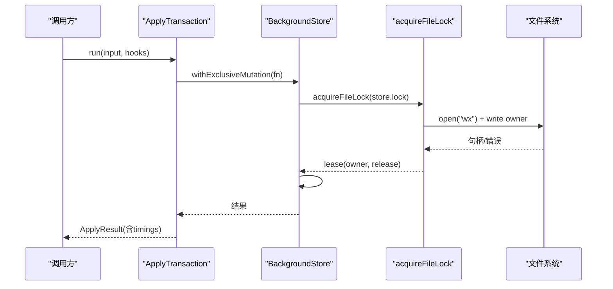
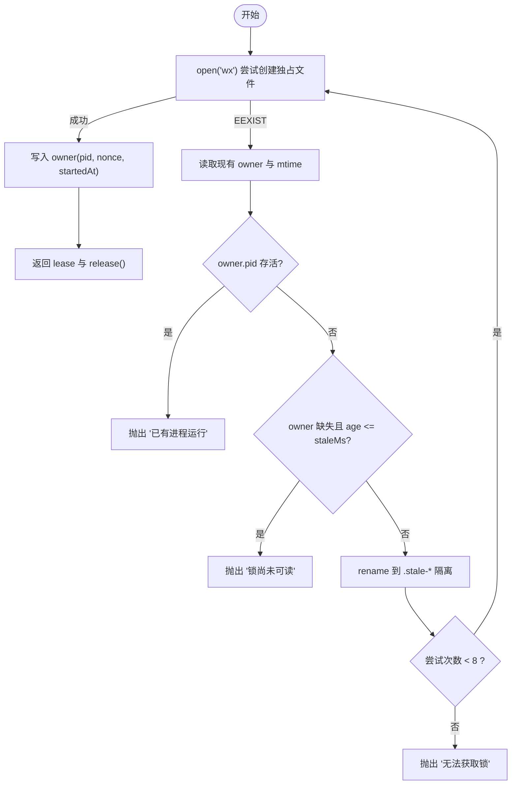
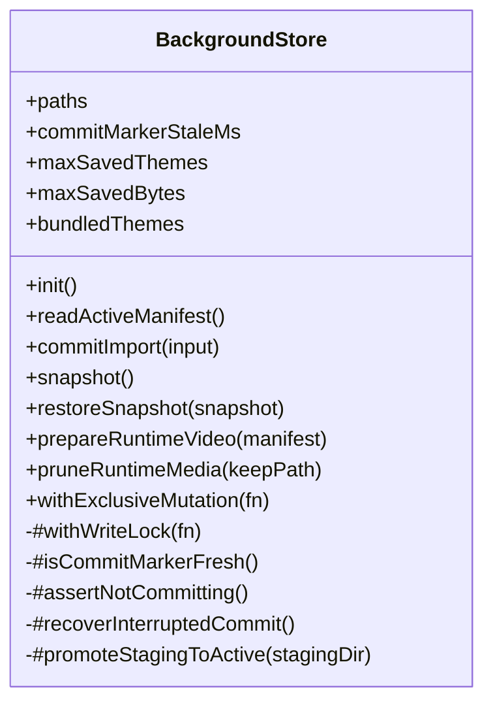
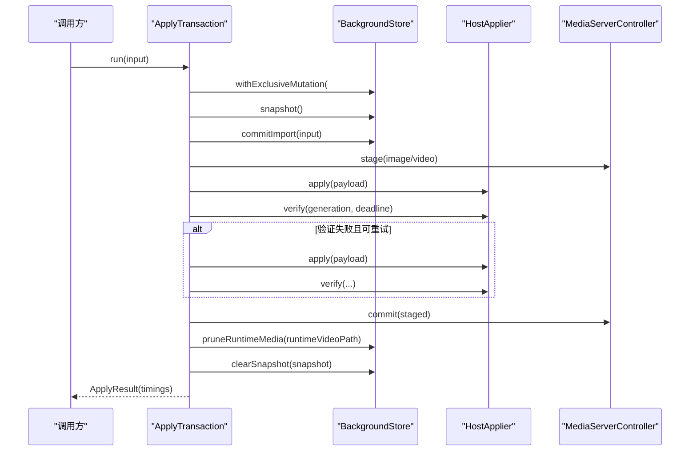
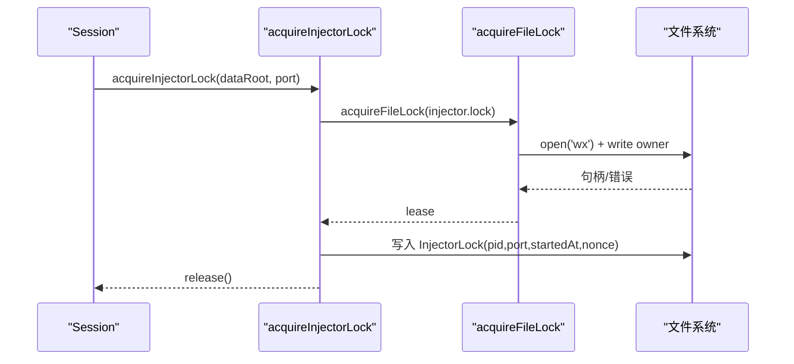
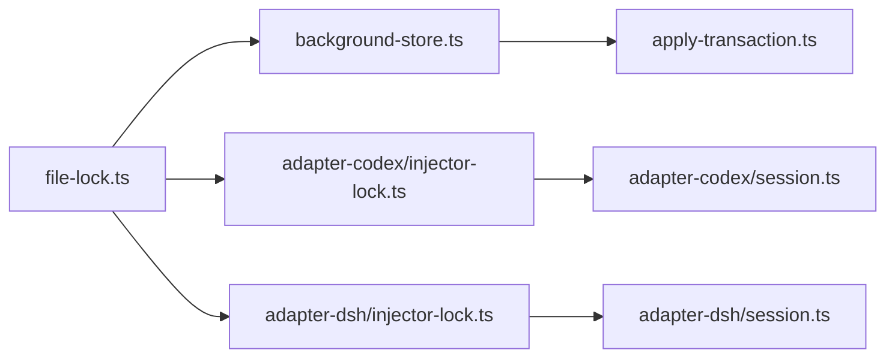

# 文件锁机制

<cite>
**本文引用的文件**
- [file-lock.ts](file://packages/core/src/file-lock.ts)
- [background-store.ts](file://packages/core/src/background-store.ts)
- [apply-transaction.ts](file://packages/core/src/apply-transaction.ts)
- [injector-lock.ts（adapter-codex）](file://packages/adapter-codex/src/injector-lock.ts)
- [injector-lock.ts（adapter-dsh）](file://packages/adapter-dsh/src/injector-lock.ts)
- [session.ts（adapter-codex）](file://packages/adapter-codex/src/session.ts)
- [session.ts（adapter-dsh）](file://packages/adapter-dsh/src/session.ts)
- [apply-transaction.md](file://docs/apply-transaction.md)
</cite>

## 目录
1. [简介](#简介)
2. [项目结构](#项目结构)
3. [核心组件](#核心组件)
4. [架构总览](#架构总览)
5. [详细组件分析](#详细组件分析)
6. [依赖关系分析](#依赖关系分析)
7. [性能考量](#性能考量)
8. [故障诊断与调试](#故障诊断与调试)
9. [结论](#结论)
10. [附录：最佳实践与常见陷阱](#附录最佳实践与常见陷阱)

## 简介
本文件详细说明跨进程文件锁的实现原理，重点覆盖 Windows 平台上的独占文件访问机制。文档解释锁的获取与释放流程、超时与重试策略、死锁预防、作用域与粒度设计，以及与 BackgroundStore 的集成方式，确保主题存储操作的串行化执行。同时说明异步上下文感知机制，支持重入锁和嵌套调用；提供性能分析与监控指标建议、调试方法与故障诊断工具；并描述与其他并发控制机制的配合使用。

## 项目结构
本项目在 packages/core 中实现了通用的跨进程文件锁能力，并在多个适配器（adapter-codex、adapter-dsh）以及 BackgroundStore 中使用该能力进行资源保护与序列化。

图表来源
- [file-lock.ts:72-170](file://packages/core/src/file-lock.ts#L72-L170)
- [background-store.ts:321-344](file://packages/core/src/background-store.ts#L321-L344)
- [apply-transaction.ts:127-152](file://packages/core/src/apply-transaction.ts#L127-L152)
- [injector-lock.ts（adapter-codex）:18-48](file://packages/adapter-codex/src/injector-lock.ts#L18-L48)
- [injector-lock.ts（adapter-dsh）:6-28](file://packages/adapter-dsh/src/injector-lock.ts#L6-L28)

章节来源
- [file-lock.ts:1-171](file://packages/core/src/file-lock.ts#L1-L171)
- [background-store.ts:123-344](file://packages/core/src/background-store.ts#L123-L344)
- [apply-transaction.ts:103-152](file://packages/core/src/apply-transaction.ts#L103-L152)
- [injector-lock.ts（adapter-codex）:1-48](file://packages/adapter-codex/src/injector-lock.ts#L1-L48)
- [injector-lock.ts（adapter-dsh）:1-28](file://packages/adapter-dsh/src/injector-lock.ts#L1-L28)

## 核心组件
- 跨进程文件锁 acquireFileLock：基于 Node.js fs.open 的 wx 模式（等价于 O_EXCL），实现跨进程独占锁；通过写入 owner 信息（pid、nonce、startedAt）与 stale 检测，避免僵尸锁与抢占窗口。
- BackgroundStore 写锁 #withWriteLock：以 store.lock 为锁文件，结合 AsyncLocalStorage 实现同异步上下文内的可重入；通过 Promise 链串行化所有写操作，防止并发 stage/commit 交错。
- ApplyTransaction：应用事务编排，内部通过 store.withExclusiveMutation 保证磁盘变更串行化，并提供快照、回滚、媒体阶段化与验证。
- 注入器锁 injector lock：在 adapter-codex 与 adapter-dsh 中分别封装 acquireInjectorLock/acquireDshInjectorLock，共享 injector.lock 文件，防止多宿主竞争。

章节来源
- [file-lock.ts:72-170](file://packages/core/src/file-lock.ts#L72-L170)
- [background-store.ts:321-344](file://packages/core/src/background-store.ts#L321-L344)
- [apply-transaction.ts:127-152](file://packages/core/src/apply-transaction.ts#L127-L152)
- [injector-lock.ts（adapter-codex）:18-48](file://packages/adapter-codex/src/injector-lock.ts#L18-L48)
- [injector-lock.ts（adapter-dsh）:6-28](file://packages/adapter-dsh/src/injector-lock.ts#L6-L28)

## 架构总览
下图展示从上层应用到文件锁的调用链与数据流，包括锁获取、写操作串行化、提交与恢复流程。

图表来源
- [apply-transaction.ts:127-152](file://packages/core/src/apply-transaction.ts#L127-L152)
- [background-store.ts:321-344](file://packages/core/src/background-store.ts#L321-L344)
- [file-lock.ts:72-122](file://packages/core/src/file-lock.ts#L72-L122)

## 详细组件分析

### 跨进程文件锁 acquireFileLock
- 获取流程
  - 解析路径并确保目录存在。
  - 使用 fs.open(filePath, "wx", 0o600) 尝试创建独占文件句柄。
  - 写入 owner 信息（pid、nonce、startedAt、可选 purpose）。
  - 返回 lease，包含 release() 方法。
- 释放流程
  - release() 先读取当前文件内容，校验 nonce 是否仍属于当前持有者，再关闭句柄并删除文件。
  - 若已被接管或已释放，则安全忽略。
- 失败处理与重试
  - 若 EEXIST，进入“竞态处理”分支：读取现有 owner 与 mtime。
  - 若 owner.pid 存活，直接报错提示已有进程运行。
  - 若 owner 缺失且文件较新（<=staleMs），认为可能正在初始化，抛出“尚未可读”的错误。
  - 否则将原文件 rename 到 .stale-* 隔离名，再次尝试获取。
  - 最多尝试 8 次，最终失败则抛错。
- 超时与死锁预防
  - 无显式等待超时；通过 staleMs 与 pid 存活检测快速判定僵尸锁。
  - 隔离 stale 文件避免“读后写”窗口导致的抢占冲突。
  - nonce 确保同一 pid 无法释放他人持有的锁。

图表来源
- [file-lock.ts:72-170](file://packages/core/src/file-lock.ts#L72-L170)

章节来源
- [file-lock.ts:1-171](file://packages/core/src/file-lock.ts#L1-L171)

### BackgroundStore 写锁与串行化
- 写锁 #withWriteLock
  - 使用 AsyncLocalStorage<boolean> 标记当前是否在写上下文中，实现同异步上下文内的可重入：若已在写上下文，直接执行回调而不重复加锁。
  - 若不在写上下文，则 acquireFileLock(store.lock) 获取跨进程锁，随后在 #writeContext.run(true, fn) 中执行回调，最后释放锁。
  - 通过 #writeChain 将多次调用排队成 Promise 链，确保同一进程内写操作串行化。
- 与事务协作
  - commitImport、snapshot、restoreSnapshot、prepareRuntimeVideo、pruneRuntimeMedia 等写操作均通过 #withWriteLock 包裹。
  - 提交过程使用 journal + marker + 原子目录交换，失败时自动恢复中断的事务。
- 作用域与粒度
  - 锁粒度为整个 store 根目录下的 store.lock，适用于主题存储的全局互斥。
  - 细粒度保护通过 stagingDir、activeDir、runtime-media 目录划分与原子替换实现。

图表来源
- [background-store.ts:123-344](file://packages/core/src/background-store.ts#L123-L344)
- [background-store.ts:564-798](file://packages/core/src/background-store.ts#L564-L798)

章节来源
- [background-store.ts:123-344](file://packages/core/src/background-store.ts#L123-L344)
- [background-store.ts:564-798](file://packages/core/src/background-store.ts#L564-L798)

### ApplyTransaction 与 BackgroundStore 集成
- 串行化入口
  - ApplyTransaction.run 内部通过 store.withExclusiveMutation 包裹 #runExclusive，确保磁盘变更与媒体阶段化串行执行。
  - 同一进程内 busy 标志快速拒绝并发 apply 请求。
- 事务阶段
  - snapshot → commitImport → stageMedia → host.apply → renderer.verify → media.commit → pruneRuntimeMedia → clearSnapshot。
  - 任一阶段失败触发 rollback，恢复至快照状态并清理临时资源。
- 验证与重试
  - 对视频首帧/Range 探针等可重试渲染验证失败进行一次性重试，提升冷启动成功率。
- 指标采集
  - 每个阶段用 performance.now() 测量耗时，汇总到 timings.phases，便于性能分析与瓶颈定位。

图表来源
- [apply-transaction.ts:127-294](file://packages/core/src/apply-transaction.ts#L127-L294)
- [background-store.ts:504-524](file://packages/core/src/background-store.ts#L504-L524)
- [background-store.ts:564-678](file://packages/core/src/background-store.ts#L564-L678)

章节来源
- [apply-transaction.ts:103-294](file://packages/core/src/apply-transaction.ts#L103-L294)
- [background-store.ts:504-678](file://packages/core/src/background-store.ts#L504-L678)

### 注入器锁（跨进程独占）
- adapter-codex 的 acquireInjectorLock
  - 基于 acquireFileLock(injector.lock) 获取独占锁，写入 InjectorLock（pid、port、startedAt、nonce）。
  - 失败时包装为 CdpError，便于上层统一处理。
- adapter-dsh 的 acquireDshInjectorLock
  - 同样基于 acquireFileLock(injector.lock)，但写入不同结构的 lock 信息，用于 DSH 场景。
- 会话生命周期
  - session.start 中获取注入器锁，确保单实例注入；后续后台任务连接主机并发布活跃主题。

图表来源
- [injector-lock.ts（adapter-codex）:18-48](file://packages/adapter-codex/src/injector-lock.ts#L18-L48)
- [injector-lock.ts（adapter-dsh）:6-28](file://packages/adapter-dsh/src/injector-lock.ts#L6-L28)
- [file-lock.ts:72-122](file://packages/core/src/file-lock.ts#L72-L122)

章节来源
- [injector-lock.ts（adapter-codex）:1-48](file://packages/adapter-codex/src/injector-lock.ts#L1-L48)
- [injector-lock.ts（adapter-dsh）:1-28](file://packages/adapter-dsh/src/injector-lock.ts#L1-L28)
- [session.ts（adapter-codex）:167-196](file://packages/adapter-codex/src/session.ts#L167-L196)

## 依赖关系分析
- 耦合与内聚
  - file-lock.ts 作为底层能力，被 BackgroundStore 与两个 adapter 的注入器锁模块复用，内聚度高。
  - BackgroundStore 通过 #withWriteLock 将跨进程锁与进程内串行化结合，形成强内聚的写路径。
  - ApplyTransaction 依赖 BackgroundStore 提供的串行化接口，保持高层事务逻辑清晰。
- 外部依赖
  - Node.js fs/promises、crypto、async_hooks.AsyncLocalStorage。
  - 各适配器依赖 core 提供的 acquireFileLock。
- 循环依赖
  - 未发现循环导入；模块边界清晰。

图表来源
- [file-lock.ts:72-170](file://packages/core/src/file-lock.ts#L72-L170)
- [background-store.ts:321-344](file://packages/core/src/background-store.ts#L321-L344)
- [apply-transaction.ts:127-152](file://packages/core/src/apply-transaction.ts#L127-L152)
- [injector-lock.ts（adapter-codex）:18-48](file://packages/adapter-codex/src/injector-lock.ts#L18-L48)
- [injector-lock.ts（adapter-dsh）:6-28](file://packages/adapter-dsh/src/injector-lock.ts#L6-L28)

章节来源
- [file-lock.ts:1-171](file://packages/core/src/file-lock.ts#L1-L171)
- [background-store.ts:123-344](file://packages/core/src/background-store.ts#L123-L344)
- [apply-transaction.ts:103-152](file://packages/core/src/apply-transaction.ts#L103-L152)

## 性能考量
- 锁获取成本
  - 首次 open('wx') 为系统调用，通常很快；失败时的 read/stat/rename 会带来额外开销。
  - stale 检测与隔离避免了长时间阻塞，适合高并发短事务场景。
- 写串行化
  - #writeChain 将多次写操作排队，减少磁盘竞争与锁抖动。
  - 大文件复制（如视频）应尽量避免在锁内执行长耗时 I/O；当前实现已将运行时视频拷贝限制在必要范围。
- 验证与重试
  - 渲染验证失败的一次性重试可降低冷启动失败率，避免频繁回滚带来的性能损耗。
- 监控指标建议
  - 记录每次锁获取耗时、持有时长、失败原因（EEXIST、stale、pid alive）。
  - 统计各事务阶段耗时（initialize、snapshot、commitImport、stageMedia、hostApply、rendererVerify、mediaCommit、pruneRuntimeMedia）。
  - 跟踪 store.lock 与 injector.lock 的占用比例与争用热点。

[本节为通用指导，不直接分析具体文件]

## 故障诊断与调试
- 常见问题
  - “另一个进程正在运行”：表示锁文件中 owner.pid 存活，检查对应进程是否卡死或异常退出未释放。
  - “锁尚未可读”：文件刚创建，等待短暂时间后重试。
  - “无法获取锁”：连续 8 次尝试失败，检查是否有残留 .stale-* 文件或权限问题。
- 诊断步骤
  - 查看 dataRoot 下的 store.lock 与 injector.lock 内容，确认 owner 信息与时间戳。
  - 检查是否存在 .stale-* 文件，必要时手动清理。
  - 观察日志中的 phases 与 timings，定位慢阶段。
- 工具与方法
  - 使用 process.kill(pid, 0) 判断进程存活（由 isPidAlive 实现）。
  - 在测试中可通过断言捕获错误信息，模拟并发与失败场景。
  - 结合文件系统事件与日志，追踪锁获取与释放时序。

章节来源
- [file-lock.ts:22-63](file://packages/core/src/file-lock.ts#L22-L63)
- [file-lock.ts:131-170](file://packages/core/src/file-lock.ts#L131-L170)
- [apply-transaction.ts:158-244](file://packages/core/src/apply-transaction.ts#L158-L244)

## 结论
本方案通过跨进程独占文件锁与进程内串行化相结合，实现了可靠的主题存储操作串行化执行。其特点包括：
- 基于 wx 模式的跨进程独占锁，配合 owner 信息与 stale 检测，避免僵尸锁与抢占窗口。
- BackgroundStore 的写锁支持同异步上下文内的可重入，简化嵌套调用。
- 事务化提交与恢复机制保障一致性，失败时可回滚。
- 注入器锁在多适配器间共享，防止多宿主竞争。
- 提供完善的指标采集与故障诊断手段，便于性能优化与问题定位。

[本节为总结，不直接分析具体文件]

## 附录：最佳实践与常见陷阱
- 最佳实践
  - 始终通过 store.withExclusiveMutation 或 ApplyTransaction.run 进行写操作，避免绕过锁。
  - 将长耗时 I/O（如大文件复制）尽量移出临界区，或在锁内最小化工作。
  - 合理设置 staleMs，平衡快速失败与容忍初始化竞态。
  - 在适配器层使用注入器锁，确保单实例注入。
- 常见陷阱
  - 在同一进程中重复获取锁但未利用可重入特性，导致不必要的等待。
  - 忽略 stale 文件清理，导致锁长期不可用。
  - 在锁内执行网络或渲染验证等不确定耗时操作，影响吞吐。
  - 未正确处理 release 失败或接管情况，导致资源泄漏。

[本节为通用指导，不直接分析具体文件]