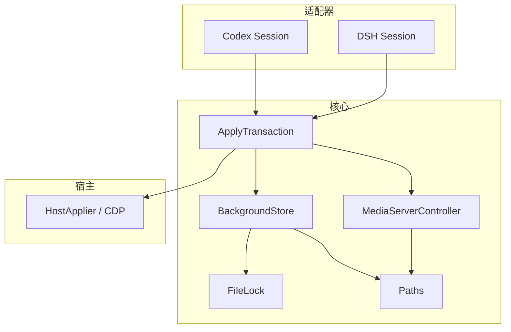
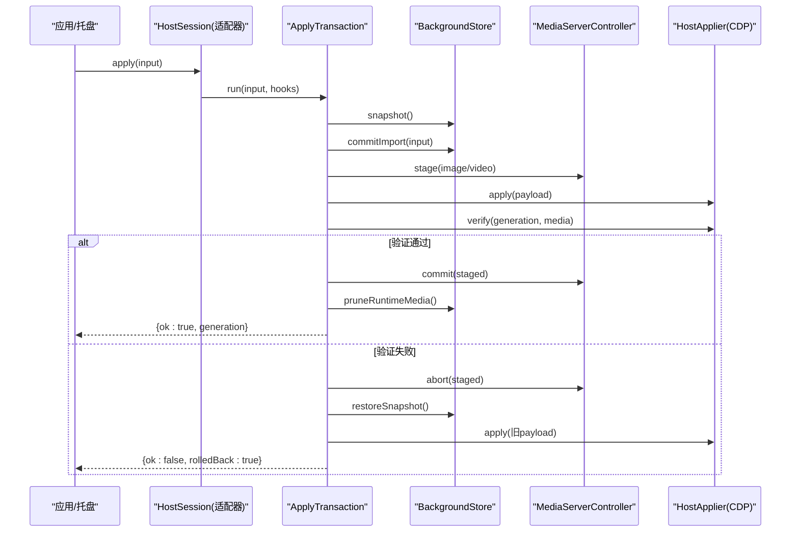
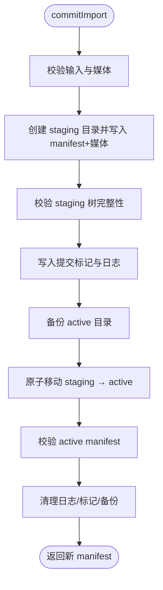
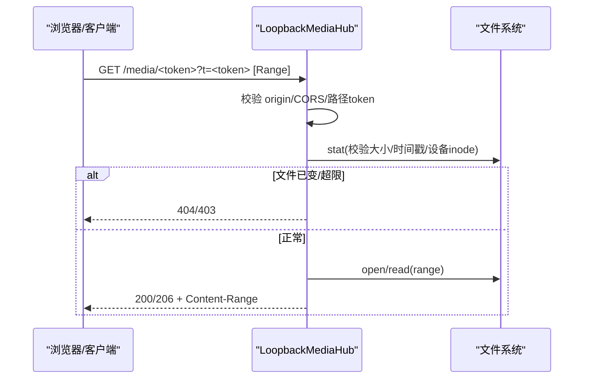
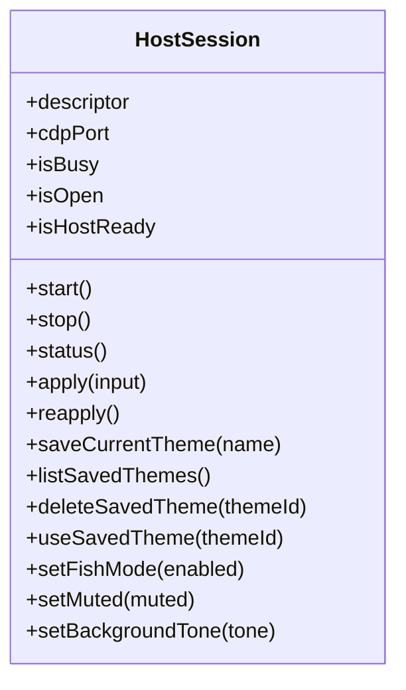
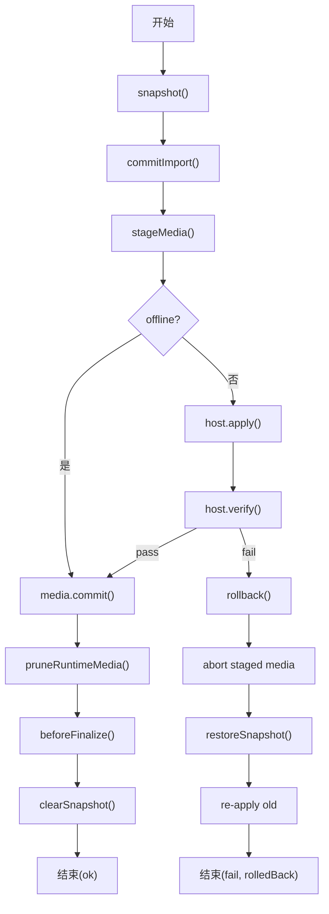
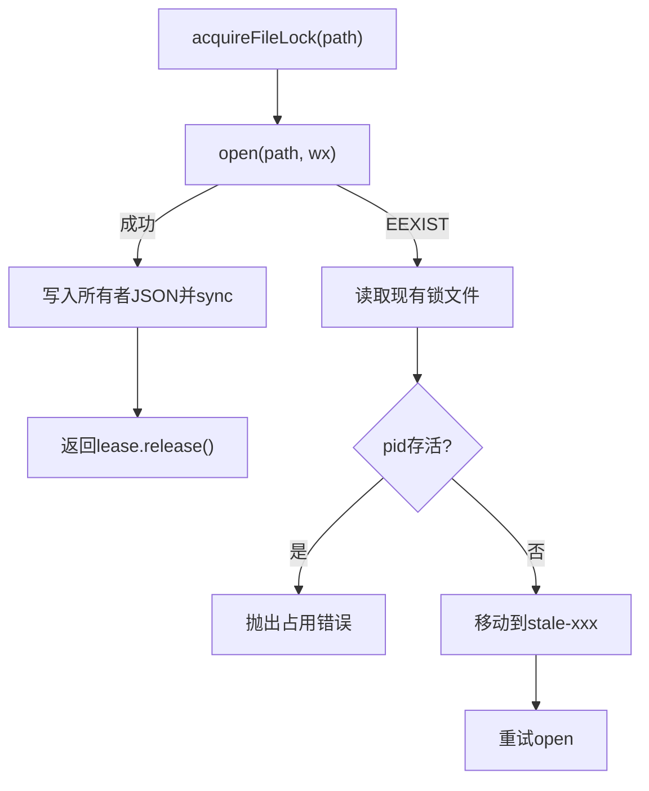
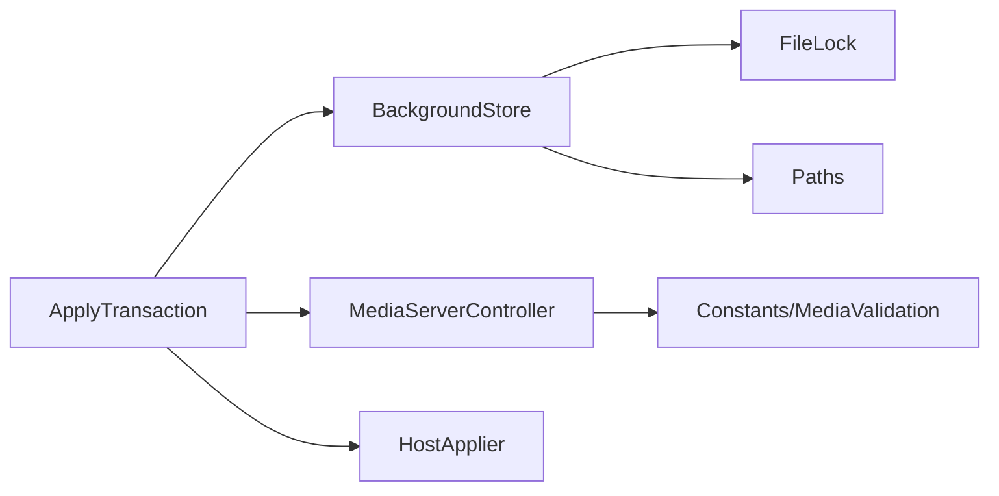

# 核心模块

<cite>
**本文引用的文件**
- [background-store.ts](file://packages/core/src/background-store.ts)
- [apply-transaction.ts](file://packages/core/src/apply-transaction.ts)
- [media-server.ts](file://packages/core/src/media-server.ts)
- [file-lock.ts](file://packages/core/src/file-lock.ts)
- [paths.ts](file://packages/core/src/paths.ts)
- [host-session.ts](file://packages/core/src/host-session.ts)
- [session.ts (adapter-codex)](file://packages/adapter-codex/src/session.ts)
- [session.ts (adapter-dsh)](file://packages/adapter-dsh/src/session.ts)
- [apply-transaction.md](file://docs/apply-transaction.md)
</cite>

## 目录
1. [简介](#简介)
2. [项目结构](#项目结构)
3. [核心组件](#核心组件)
4. [架构总览](#架构总览)
5. [详细组件分析](#详细组件分析)
6. [依赖关系分析](#依赖关系分析)
7. [性能考虑](#性能考虑)
8. [故障排查指南](#故障排查指南)
9. [结论](#结论)
10. [附录](#附录)

## 简介
本文件面向 beautiCode 的核心模块，围绕以下主题展开：
- BackgroundStore 主题存储系统：主题文件格式、版本管理（generation）、持久化与恢复机制。
- MediaServer 媒体服务器：安全访问控制、Range 请求处理、令牌认证。
- HostSession 宿主会话管理：生命周期控制与状态同步。
- ApplyTransaction 应用事务：原子性保证与错误恢复策略。
- 文件锁机制：跨进程并发控制与资源管理。
并给出各模块的公共接口、配置选项、使用示例、性能优化建议与常见问题解决方案。

## 项目结构
beautiCode 的核心能力集中在 packages/core，适配层在 packages/adapter-*，文档与脚本位于 docs 与 scripts。核心模块职责划分清晰：
- background-store.ts：主题与媒体元数据、快照、保存主题、原子提交与恢复。
- apply-transaction.ts：编排“快照→磁盘提交→媒体暂存→主机注入→验证→最终化/回滚”的事务流程。
- media-server.ts：本地环回媒体服务，提供带令牌的受控访问与 Range 支持。
- file-lock.ts：基于 O_EXCL 的文件级锁，用于跨进程互斥。
- paths.ts：数据目录布局与原子写入工具。
- host-session.ts：宿主会话的统一控制面契约。
- adapter 层 session.ts：将上述核心能力组合为可被托盘/集成器调用的会话对象。

图表来源
- [background-store.ts:123-140](file://packages/core/src/background-store.ts#L123-L140)
- [apply-transaction.ts:103-121](file://packages/core/src/apply-transaction.ts#L103-L121)
- [media-server.ts:148-167](file://packages/core/src/media-server.ts#L148-L167)
- [file-lock.ts:72-122](file://packages/core/src/file-lock.ts#L72-L122)
- [paths.ts:178-194](file://packages/core/src/paths.ts#L178-L194)

章节来源
- [background-store.ts:1-140](file://packages/core/src/background-store.ts#L1-L140)
- [apply-transaction.ts:1-121](file://packages/core/src/apply-transaction.ts#L1-L121)
- [media-server.ts:1-167](file://packages/core/src/media-server.ts#L1-L167)
- [file-lock.ts:1-122](file://packages/core/src/file-lock.ts#L1-L122)
- [paths.ts:178-194](file://packages/core/src/paths.ts#L178-L194)

## 核心组件
- BackgroundStore：负责主题与媒体的持久化、版本化（generation）、快照、保存主题、原子提交与中断恢复；通过文件锁与写链串行化写操作。
- ApplyTransaction：以“快照→提交→发布→注入→验证→最终化/回滚”的原子事务保障用户可见一致性，支持离线模式与重试。
- MediaServerController：本地环回 HTTP 服务器，对媒体资产进行令牌鉴权、CORS 与 Range 支持，提供多资产路由。
- FileLock：跨进程文件锁，使用 O_EXCL 创建与 nonce 校验，防止重复持有与误释放。
- HostSession：统一控制面契约，封装启动/停止/应用/保存主题/状态查询等能力，由适配器实现具体宿主通信。

章节来源
- [background-store.ts:123-140](file://packages/core/src/background-store.ts#L123-L140)
- [apply-transaction.ts:103-121](file://packages/core/src/apply-transaction.ts#L103-L121)
- [media-server.ts:148-167](file://packages/core/src/media-server.ts#L148-L167)
- [file-lock.ts:72-122](file://packages/core/src/file-lock.ts#L72-L122)
- [host-session.ts:27-47](file://packages/core/src/host-session.ts#L27-L47)

## 架构总览
整体调用时序如下：上层会话（Codex/DSH）发起背景变更，ApplyTransaction 协调 BackgroundStore 与 MediaServerController，并通过 HostApplier 注入到宿主渲染环境，最后通过 verify 确认结果，失败则回滚。

图表来源
- [apply-transaction.ts:127-294](file://packages/core/src/apply-transaction.ts#L127-L294)
- [background-store.ts:564-798](file://packages/core/src/background-store.ts#L564-L798)
- [media-server.ts:422-590](file://packages/core/src/media-server.ts#L422-L590)
- [host-session.ts:27-47](file://packages/core/src/host-session.ts#L27-L47)

## 详细组件分析

### BackgroundStore 主题存储系统
- 主题文件格式
  - manifest.json：包含 schema、generation、background（image/video/source/effects）、updatedAt。
  - saved/<id>/theme.json：保存的主题副本，含相同结构的 manifest。
  - saved/<id>/.saved-meta.json：保存主题的元信息，包括 id、name、type、savedAt、videoPositionSec（视频主题）。
- 版本管理
  - generation 单调递增，每次 commitImport/useSavedTheme 都会 +1，确保渲染端按代次丢弃旧事件。
- 持久化与原子性
  - 写入采用临时文件+rename 的原子方式；提交阶段使用“标记文件 + 日志 + 目录交换”三步法，失败时自动恢复。
  - 读路径在加载前后检查“提交中”标记，避免读到半写树。
- 并发控制
  - 写操作通过 #withWriteLock 串行化，并使用 acquireFileLock 跨进程互斥 store.lock。
- 运行时视频隔离
  - 视频主题会准备“运行时副本”，避免 Chromium 打开 active 目录导致下一次原子替换失败。
- 保存主题与配额
  - saveCurrentTheme/list/delete/use 提供完整的主题生命周期；支持数量与容量配额限制。

图表来源
- [background-store.ts:564-798](file://packages/core/src/background-store.ts#L564-L798)
- [background-store.ts:800-1224](file://packages/core/src/background-store.ts#L800-L1224)
- [background-store.ts:1350-1427](file://packages/core/src/background-store.ts#L1350-L1427)

章节来源
- [background-store.ts:123-140](file://packages/core/src/background-store.ts#L123-L140)
- [background-store.ts:277-305](file://packages/core/src/background-store.ts#L277-L305)
- [background-store.ts:564-798](file://packages/core/src/background-store.ts#L564-L798)
- [background-store.ts:800-1224](file://packages/core/src/background-store.ts#L800-L1224)
- [background-store.ts:1350-1427](file://packages/core/src/background-store.ts#L1350-L1427)

### MediaServer 媒体服务器
- 安全访问控制
  - 仅绑定 127.0.0.1；每个资产分配不可猜测的 token；请求需携带 path token 与 header/query 中的匹配 token。
  - CORS 白名单 origins；OPTIONS 预检支持 Private Network。
- Range 请求
  - 解析 bytes= 范围，支持单段 Range；非法范围返回 416；流式传输并设置 Accept-Ranges。
- 内容稳定性
  - 读取前校验文件大小、设备/inode/mtime/ctime；内容变化或越界拒绝服务，防止恶意替换。
- 多资产路由
  - 单一端口下 /media/<token> 路由多个资产；支持关闭诊断 Hub。

图表来源
- [media-server.ts:66-94](file://packages/core/src/media-server.ts#L66-L94)
- [media-server.ts:422-590](file://packages/core/src/media-server.ts#L422-L590)

章节来源
- [media-server.ts:148-167](file://packages/core/src/media-server.ts#L148-L167)
- [media-server.ts:422-590](file://packages/core/src/media-server.ts#L422-L590)

### HostSession 宿主会话管理
- 生命周期
  - start/stop/status：管理宿主连接、端口、CDP 会话数。
  - apply/reapply/saveCurrentTheme/listSavedThemes/deleteSavedTheme/useSavedTheme：统一对外暴露主题与媒体管理能力。
  - setFishMode/setMuted/setBackgroundTone：宿主偏好设置。
- 状态同步
  - 适配器侧维护 activeThemeId、fishMode、muted、backgroundTone 等状态，并在 watch 循环中 reconcile 与 republish。
  - Codex/DSH 适配器分别实现与宿主通信的细节，但都遵循 host-session.ts 的契约。

图表来源
- [host-session.ts:27-47](file://packages/core/src/host-session.ts#L27-L47)
- [session.ts (adapter-codex):113-127](file://packages/adapter-codex/src/session.ts#L113-L127)
- [session.ts (adapter-dsh):81-104](file://packages/adapter-dsh/src/session.ts#L81-L104)

章节来源
- [host-session.ts:10-47](file://packages/core/src/host-session.ts#L10-L47)
- [session.ts (adapter-codex):311-349](file://packages/adapter-codex/src/session.ts#L311-L349)
- [session.ts (adapter-dsh):348-389](file://packages/adapter-dsh/src/session.ts#L348-L389)

### ApplyTransaction 应用事务
- 原子性保证
  - 先快照当前 active，再提交新主题到磁盘，然后发布媒体、注入宿主、验证；任一失败即回滚到快照。
- 错误恢复策略
  - 验证失败触发 rollback：恢复快照、中止暂存媒体、重新发布旧媒体、重放旧 payload。
  - 针对视频冷启动的首帧超时，支持一次重试。
- 离线模式
  - offline=true 跳过 host apply/verify，仅做磁盘与媒体暂存，便于单元测试。
- 钩子扩展
  - beforeFinalize/onRollback 允许在最终化前后执行额外逻辑（如保存主题），失败仍可回滚。

图表来源
- [apply-transaction.ts:127-294](file://packages/core/src/apply-transaction.ts#L127-L294)
- [apply-transaction.md:1-117](file://docs/apply-transaction.md#L1-L117)

章节来源
- [apply-transaction.ts:127-294](file://packages/core/src/apply-transaction.ts#L127-L294)
- [apply-transaction.md:1-117](file://docs/apply-transaction.md#L1-L117)

### 文件锁机制
- 设计要点
  - 使用 O_EXCL（wx）创建锁文件，写入包含 pid、nonce、startedAt 的 JSON 所有者信息。
  - 释放时校验 nonce 一致才删除，避免误删他人锁。
  - 死锁/陈旧锁检测：若存在活进程则拒绝；否则尝试 quarantined 迁移后重试。
- 用途
  - BackgroundStore 写路径通过 acquireFileLock 保护 store.lock，防止多实例并发写入。

图表来源
- [file-lock.ts:72-170](file://packages/core/src/file-lock.ts#L72-L170)
- [background-store.ts:321-344](file://packages/core/src/background-store.ts#L321-L344)

章节来源
- [file-lock.ts:72-170](file://packages/core/src/file-lock.ts#L72-L170)
- [background-store.ts:321-344](file://packages/core/src/background-store.ts#L321-L344)

## 依赖关系分析
- ApplyTransaction 依赖 BackgroundStore、MediaServerController、HostApplier。
- BackgroundStore 依赖 file-lock、paths、media-validation、types。
- MediaServerController 依赖 constants、media-validation、node:http/fs/stream/crypto。
- 适配器层（Codex/DSH）组合上述核心能力，暴露统一的 HostSession 接口。

图表来源
- [apply-transaction.ts:1-42](file://packages/core/src/apply-transaction.ts#L1-L42)
- [background-store.ts:1-46](file://packages/core/src/background-store.ts#L1-L46)
- [media-server.ts:1-23](file://packages/core/src/media-server.ts#L1-L23)

章节来源
- [apply-transaction.ts:1-42](file://packages/core/src/apply-transaction.ts#L1-L42)
- [background-store.ts:1-46](file://packages/core/src/background-store.ts#L1-L46)
- [media-server.ts:1-23](file://packages/core/src/media-server.ts#L1-L23)

## 性能考虑
- BackgroundStore
  - 写串行化：#writeChain 与文件锁避免并发竞争。
  - 运行时视频缓存：按 generation 缓存副本，减少重复拷贝。
  - 视频预热：本地视频在首次 Range 前预热头部与 moov 尾，降低首帧延迟。
  - 保存主题配额：数量与容量上限，避免无限增长。
- MediaServer
  - Range 流式传输，避免全量加载大文件。
  - 严格校验文件指纹与大小，失败快速返回，减少无效 IO。
- ApplyTransaction
  - 视频冷启动重试一次，提升成功率。
  - 仅在必要时内联 data URL，避免过大负载。
- 通用建议
  - 合理设置 verifyDeadlineMs，兼顾首帧解码时间与用户体验。
  - 使用 linkOrCopyFileAtomic 利用硬链接减少大文件复制开销。
  - 定期 pruneRuntimeMedia 清理无用运行时副本。

[本节为通用指导，不直接分析具体文件]

## 故障排查指南
- 主题保存失败
  - 名称非法或长度超限：检查 name 长度与字符集。
  - 无活动背景：确保当前有 image/video 背景。
  - 配额达到：删除旧主题或提高配额。
- 应用事务失败
  - 验证失败：查看 verify 返回 reason，关注首帧/Range 探针相关错误；必要时启用重试。
  - 回滚成功但界面未恢复：检查是否成功 re-apply 旧 payload。
- 媒体服务异常
  - 404/403：检查 token 是否匹配、origin 是否在白名单。
  - 416：Range 范围非法或超出文件大小。
  - 内容被替换：服务端检测到 inode/mtime/size 变化，拒绝服务。
- 文件锁冲突
  - “Another operation is running”：等待已有进程完成或清理陈旧锁。
  - 锁文件无法释放：检查 nonce 是否一致，必要时手动清理 stale 文件。

章节来源
- [background-store.ts:800-1224](file://packages/core/src/background-store.ts#L800-L1224)
- [apply-transaction.ts:212-245](file://packages/core/src/apply-transaction.ts#L212-L245)
- [media-server.ts:422-590](file://packages/core/src/media-server.ts#L422-L590)
- [file-lock.ts:123-170](file://packages/core/src/file-lock.ts#L123-L170)

## 结论
beautiCode 的核心模块通过清晰的职责划分与严格的原子性、安全性设计，实现了可靠的背景主题管理与安全的媒体分发：
- BackgroundStore 以 generation 与原子提交保证主题一致性，并提供完善的保存/恢复与配额控制。
- MediaServer 通过令牌鉴权与 Range 支持，提供高性能且安全的本地媒体服务。
- ApplyTransaction 将磁盘、媒体、宿主注入串联为可回滚的事务，确保用户可见状态一致。
- FileLock 提供跨进程互斥，避免并发写入导致的损坏。
- HostSession 抽象出统一控制面，使不同宿主适配器复用同一套核心能力。

[本节为总结，不直接分析具体文件]

## 附录

### 公共接口与配置选项

- BackgroundStore
  - 构造选项：root、commitMarkerStaleMs、maxSavedThemes、maxSavedBytes、bundledThemes。
  - 关键方法：init、readActiveManifest、commitImport、snapshot、restoreSnapshot、saveCurrentTheme、listSavedThemes、deleteSavedTheme、useSavedTheme、prepareRuntimeVideo、pruneRuntimeMedia、withExclusiveMutation。
  - 参考路径
    - [background-store.ts:53-60](file://packages/core/src/background-store.ts#L53-L60)
    - [background-store.ts:142-159](file://packages/core/src/background-store.ts#L142-L159)
    - [background-store.ts:564-798](file://packages/core/src/background-store.ts#L564-L798)
    - [background-store.ts:800-1224](file://packages/core/src/background-store.ts#L800-L1224)

- ApplyTransaction
  - 构造选项：store、media、host、includeImageDataUrl、cssText、verifyDeadlineMs、offline。
  - 关键方法：run(input, hooks)。
  - 参考路径
    - [apply-transaction.ts:31-42](file://packages/core/src/apply-transaction.ts#L31-L42)
    - [apply-transaction.ts:127-152](file://packages/core/src/apply-transaction.ts#L127-L152)

- MediaServerController
  - 构造选项：trustedOrigins、maxImageBytes、maxVideoBytes、enabled。
  - 关键方法：addFile、ensureListening、close、handleRequest（内部）。
  - 参考路径
    - [media-server.ts:58-64](file://packages/core/src/media-server.ts#L58-L64)
    - [media-server.ts:148-167](file://packages/core/src/media-server.ts#L148-L167)
    - [media-server.ts:422-590](file://packages/core/src/media-server.ts#L422-L590)

- FileLock
  - 获取锁：acquireFileLock(filePath, { purpose?, staleMs? })。
  - 释放：lease.release()。
  - 参考路径
    - [file-lock.ts:17-20](file://packages/core/src/file-lock.ts#L17-L20)
    - [file-lock.ts:72-122](file://packages/core/src/file-lock.ts#L72-L122)

- HostSession
  - 关键方法：start、stop、status、apply、reapply、saveCurrentTheme、listSavedThemes、deleteSavedTheme、useSavedTheme、setFishMode、setMuted、setBackgroundTone。
  - 参考路径
    - [host-session.ts:27-47](file://packages/core/src/host-session.ts#L27-L47)

### 使用示例（路径引用）
- 保存当前主题并列出/删除/使用
  - [background-store.ts:800-913](file://packages/core/src/background-store.ts#L800-L913)
  - [background-store.ts:915-983](file://packages/core/src/background-store.ts#L915-L983)
  - [background-store.ts:1155-1224](file://packages/core/src/background-store.ts#L1155-L1224)
- 应用事务（含钩子）
  - [apply-transaction.ts:127-294](file://packages/core/src/apply-transaction.ts#L127-L294)
  - [apply-transaction.md:105-117](file://docs/apply-transaction.md#L105-L117)
- 媒体服务 Range 与令牌
  - [media-server.ts:66-94](file://packages/core/src/media-server.ts#L66-L94)
  - [media-server.ts:422-590](file://packages/core/src/media-server.ts#L422-L590)
- 文件锁获取与释放
  - [file-lock.ts:72-122](file://packages/core/src/file-lock.ts#L72-L122)
  - [background-store.ts:321-344](file://packages/core/src/background-store.ts#L321-L344)

[本节为索引与参考，不直接分析具体文件]