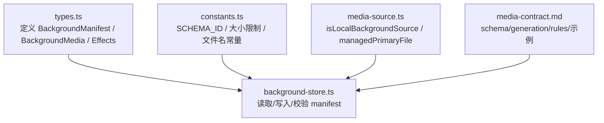
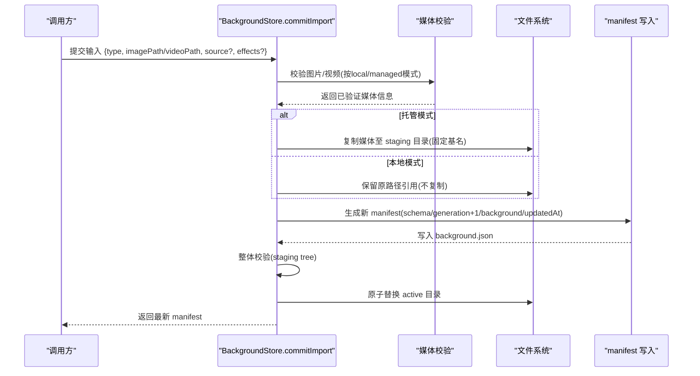
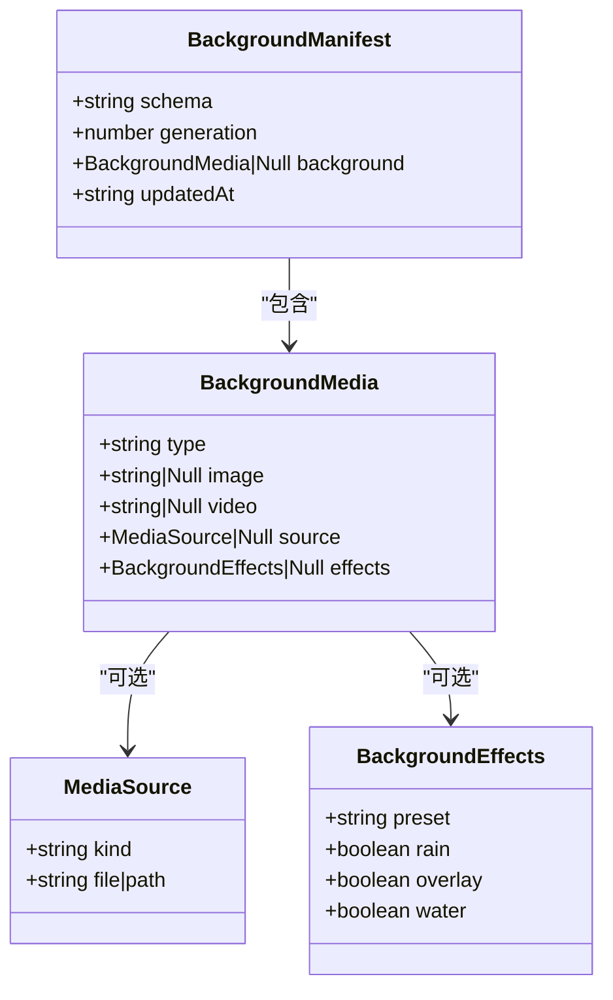

# 主题文件格式设计

<cite>
**本文引用的文件**
- [types.ts](file://packages/core/src/types.ts)
- [background-store.ts](file://packages/core/src/background-store.ts)
- [constants.ts](file://packages/core/src/constants.ts)
- [media-source.ts](file://packages/core/src/media-source.ts)
- [media-contract.md](file://docs/media-contract.md)
</cite>

## 目录
1. [简介](#简介)
2. [项目结构](#项目结构)
3. [核心组件](#核心组件)
4. [架构总览](#架构总览)
5. [详细组件分析](#详细组件分析)
6. [依赖关系分析](#依赖关系分析)
7. [性能考量](#性能考量)
8. [故障排查指南](#故障排查指南)
9. [结论](#结论)
10. [附录：完整 JSON 示例与兼容性策略](#附录完整-json-示例与兼容性策略)

## 简介
本文件面向 BackgroundManifest 主题文件格式，系统性说明 schema、generation、background、effects、updatedAt 等字段的含义、约束与验证规则；解释图片背景与视频背景的表示差异；详解 source 字段的 local 与 managed 两种模式；给出完整的 JSON 示例；并说明向后兼容性与废弃字段处理策略。

## 项目结构
BackgroundManifest 的定义与校验集中在 core 包中，配合媒体契约文档与常量定义，形成“类型 + 校验 + 存储 + 契约”的闭环：
- 类型与效果：types.ts
- 存储与事务化写入：background-store.ts
- 常量与限制：constants.ts
- 源解析与本地/托管判断：media-source.ts
- 契约与示例：docs/media-contract.md



图表来源
- [types.ts:64-81](file://packages/core/src/types.ts#L64-L81)
- [background-store.ts:89-121](file://packages/core/src/background-store.ts#L89-L121)
- [constants.ts:1-62](file://packages/core/src/constants.ts#L1-L62)
- [media-source.ts:31-44](file://packages/core/src/media-source.ts#L31-L44)
- [media-contract.md:1-41](file://docs/media-contract.md#L1-L41)

章节来源
- [types.ts:64-81](file://packages/core/src/types.ts#L64-L81)
- [background-store.ts:89-121](file://packages/core/src/background-store.ts#L89-L121)
- [constants.ts:1-62](file://packages/core/src/constants.ts#L1-L62)
- [media-source.ts:31-44](file://packages/core/src/media-source.ts#L31-L44)
- [media-contract.md:1-41](file://docs/media-contract.md#L1-L41)

## 核心组件
- BackgroundManifest：主题清单，包含 schema、generation、background、updatedAt。
- BackgroundMedia：描述当前背景是图片还是视频，以及对应的资源引用与可选 effects。
- MediaSource：source 字段统一表达“托管文件”或“本地路径”。
- BackgroundEffects：仅对图片背景生效的动态壁纸（rain/overlay/water）及预设。
- BackgroundStore：负责 manifest 的原子写入、校验、恢复与版本递增。

章节来源
- [types.ts:64-81](file://packages/core/src/types.ts#L64-L81)
- [background-store.ts:89-121](file://packages/core/src/background-store.ts#L89-L121)

## 架构总览
下图展示从导入到落盘再到激活的端到端流程，体现 generation 递增、updatedAt 更新、effects 归一化、source 模式选择与文件复制/校验。



图表来源
- [background-store.ts:564-678](file://packages/core/src/background-store.ts#L564-L678)
- [background-store.ts:757-798](file://packages/core/src/background-store.ts#L757-L798)
- [constants.ts:54-62](file://packages/core/src/constants.ts#L54-L62)

## 详细组件分析

### BackgroundManifest 字段与验证
- schema：必须为常量 SCHEMA_ID，用于标识版本契约。
- generation：单调递增整数，由 store 管理，每次 apply 自增。
- background：可为 null（清空），否则必须满足 BackgroundMedia 约束。
- updatedAt：ISO 时间字符串，记录最近一次变更时间。

校验要点（isManifest）：
- schema 必须匹配常量。
- generation 为非负整数。
- updatedAt 为字符串。
- background 若存在：
  - type 必须为 image 或 video。
  - image/video/source/effects 的存在性与类型需符合约定。
  - 当无 source 时，image 主题要求 image 字段存在；video 主题要求 video 与 image 同时存在。
  - effects 若存在，必须通过 normalizeBackgroundEffects 归一化并通过白名单校验。

章节来源
- [background-store.ts:89-121](file://packages/core/src/background-store.ts#L89-L121)
- [constants.ts:1](file://packages/core/src/constants.ts#L1)

### BackgroundMedia：图片 vs 视频
- 图片背景：
  - 托管模式：使用 image 字段保存 poster 基名（如 poster.jpg）。
  - 本地模式：使用 source.kind=local 指向绝对路径，可省略 image。
- 视频背景：
  - 必须提供 image 作为海报图。
  - 托管模式：使用 video 字段保存主视频基名（默认 background.mp4）。
  - 本地模式：使用 source.kind=local 指向绝对路径。

注意：
- 视频主题在应用过程中，先以图片海报显示，直到首帧解码成功再切换视频层。
- 视频容器需满足契约中的 MP4 校验规则。

章节来源
- [types.ts:64-74](file://packages/core/src/types.ts#L64-L74)
- [media-contract.md:19-41](file://docs/media-contract.md#L19-L41)
- [background-store.ts:598-652](file://packages/core/src/background-store.ts#L598-L652)

### source 字段：local 与 managed 模式
- MediaSource 联合类型：
  - kind="managed"：file 为托管文件名（基名），系统会复制到 active 目录。
  - kind="local"：path 为绝对路径，系统直接引用外部文件，不复制。
- isLocalBackgroundSource：用于判断是否为本地模式。
- managedPrimaryFile：决定需要复制的主媒体文件（image 或 video）。

行为差异：
- 托管模式：导入时复制媒体到 staging 目录，确保 active 目录内自包含。
- 本地模式：避免复制，减少 IO；但需保证路径长期有效且不被外部修改。

章节来源
- [types.ts:14-16](file://packages/core/src/types.ts#L14-L16)
- [media-source.ts:31-44](file://packages/core/src/media-source.ts#L31-L44)
- [background-store.ts:574-652](file://packages/core/src/background-store.ts#L574-L652)

### effects 字段：动态壁纸配置
- 仅对图片背景有效。
- 通过 normalizeBackgroundEffects 进行归一化与白名单校验，支持的 preset 包括 internal、infernal、gallery。
- 归一化后固定 rain、overlay、water 为 true，简化渲染侧逻辑。

影响范围：
- 在 commitImport 时，若 input.effects 合法则写入 manifest.background.effects。
- 读取 saved theme 时会重新归一化 effects，确保历史数据兼容。

章节来源
- [types.ts:36-62](file://packages/core/src/types.ts#L36-L62)
- [background-store.ts:587-596](file://packages/core/src/background-store.ts#L587-L596)
- [background-store.ts:1118-1119](file://packages/core/src/background-store.ts#L1118-L1119)

### updatedAt 与版本管理
- updatedAt：ISO 时间戳，记录最近一次写入时间，便于 UI 展示与审计。
- generation：单调递增整数，由 store 在每次 commitImport/restoreSnapshot/useSavedTheme 时自增，用于：
  - 防止旧事件处理器误触发。
  - 支持回滚与一致性检查。
- 原子写入：通过 staging -> backup -> rename 的事务流程，失败可恢复。

章节来源
- [background-store.ts:80-87](file://packages/core/src/background-store.ts#L80-L87)
- [background-store.ts:657-673](file://packages/core/src/background-store.ts#L657-L673)
- [background-store.ts:757-798](file://packages/core/src/background-store.ts#L757-L798)

### 媒体校验与限制
- 图片：
  - 扩展名：jpg/jpeg/png/webp（avif 也在常量中允许）。
  - 大小：不超过 MAX_IMAGE_BYTES（18 MiB）。
  - 魔数：JPEG/PNG/WEBP 签名校验。
- 视频：
  - 扩展名：mp4。
  - 大小：不超过 MAX_VIDEO_BYTES（800 MiB）。
  - 容器：首 box 尺寸合理且类型为 ftyp。
  - 配套图片：必须存在。
- 运行时：
  - 视频优先使用 blob/server 传输，避免 CSP 限制。
  - 首次解码成功后才显示视频层。

章节来源
- [constants.ts:3-19](file://packages/core/src/constants.ts#L3-L19)
- [constants.ts:43-52](file://packages/core/src/constants.ts#L43-L52)
- [media-contract.md:43-66](file://docs/media-contract.md#L43-L66)
- [media-contract.md:68-92](file://docs/media-contract.md#L68-L92)

## 依赖关系分析


图表来源
- [types.ts:64-81](file://packages/core/src/types.ts#L64-L81)
- [types.ts:14-16](file://packages/core/src/types.ts#L14-L16)
- [types.ts:36-43](file://packages/core/src/types.ts#L36-L43)

章节来源
- [types.ts:14-16](file://packages/core/src/types.ts#L14-L16)
- [types.ts:36-81](file://packages/core/src/types.ts#L36-L81)

## 性能考量
- 本地模式避免复制大文件，降低 IO 压力，适合频繁切换场景。
- 托管模式保证 active 目录自包含，便于迁移与快照。
- 视频首帧前使用图片海报，提升感知性能。
- 运行时视频缓存与预热（warmVideoFileReads）减少首次播放延迟。
- 严格的大小限制与容器校验，避免异常媒体导致渲染卡顿。

[本节为通用指导，无需具体文件来源]

## 故障排查指南
- 读取 manifest 失败：
  - 非 JSON：抛出“Active background manifest is not valid JSON.”
  - 校验失败：抛出“Active background manifest failed schema checks.”
- 提交中断恢复：
  - 检测 .beauticode-commit-in-progress 标记与日志，自动回滚或恢复上一代。
- 路径安全：
  - 所有路径均经过 isPathInsideRoot 校验，防止逃逸到根目录之外。
- 视频播放失败：
  - 遵循契约：隐藏视频、回退到上一代背景，并报告错误。

章节来源
- [background-store.ts:277-304](file://packages/core/src/background-store.ts#L277-L304)
- [background-store.ts:211-270](file://packages/core/src/background-store.ts#L211-L270)
- [media-contract.md:68-83](file://docs/media-contract.md#L68-L83)

## 结论
BackgroundManifest 通过严格的 schema、generation、background 结构与 media 校验，结合 local/managed 两种 source 模式与 effects 动态壁纸能力，提供了稳定、可回滚、可扩展的主题管理机制。updatedAt 提供变更时间线，generation 保障一致性。遵循契约与常量限制，可在不同宿主环境中获得一致体验。

[本节为总结性内容，无需具体文件来源]

## 附录：完整 JSON 示例与兼容性策略

### 图片背景（托管模式）
```json
{
  "schema": "beauticode.background/v1",
  "generation": 12,
  "background": {
    "type": "image",
    "image": "poster.jpg"
  },
  "updatedAt": "2026-07-28T00:00:00.000Z"
}
```

### 图片背景（本地模式）
```json
{
  "schema": "beauticode.background/v1",
  "generation": 13,
  "background": {
    "type": "image",
    "source": {
      "kind": "local",
      "path": "/absolute/path/to/image.png"
    }
  },
  "updatedAt": "2026-07-28T00:00:00.000Z"
}
```

### 图片背景（带 effects）
```json
{
  "schema": "beauticode.background/v1",
  "generation": 14,
  "background": {
    "type": "image",
    "image": "poster.jpg",
    "effects": {
      "preset": "internal",
      "rain": true,
      "overlay": true,
      "water": true
    }
  },
  "updatedAt": "2026-07-28T00:00:00.000Z"
}
```

### 视频背景（托管模式）
```json
{
  "schema": "beauticode.background/v1",
  "generation": 15,
  "background": {
    "type": "video",
    "image": "poster.jpg",
    "video": "background.mp4"
  },
  "updatedAt": "2026-07-28T00:00:00.000Z"
}
```

### 视频背景（本地模式）
```json
{
  "schema": "beauticode.background/v1",
  "generation": 16,
  "background": {
    "type": "video",
    "image": "poster.jpg",
    "source": {
      "kind": "local",
      "path": "/absolute/path/to/video.mp4"
    }
  },
  "updatedAt": "2026-07-28T00:00:00.000Z"
}
```

### 清空背景
```json
{
  "schema": "beauticode.background/v1",
  "generation": 17,
  "background": null,
  "updatedAt": "2026-07-28T00:00:00.000Z"
}
```

### 向后兼容性与废弃字段处理
- 兼容 legacy v1 清单：
  - 若无 source 字段，仍接受 image/video 基名字段（托管模式）。
  - 视频主题必须同时具备 image 与 video。
- 废弃字段策略：
  - 读取时忽略未知字段，仅校验已知字段。
  - 写入时仅输出必要字段，避免携带废弃字段。
- effects 兼容：
  - 读取时通过 normalizeBackgroundEffects 归一化，非法值将被丢弃。
- 路径安全：
  - 所有路径均受 isPathInsideRoot 保护，拒绝逃逸路径。

章节来源
- [background-store.ts:114-119](file://packages/core/src/background-store.ts#L114-L119)
- [background-store.ts:587-596](file://packages/core/src/background-store.ts#L587-L596)
- [background-store.ts:1118-1119](file://packages/core/src/background-store.ts#L1118-L1119)
- [media-contract.md:34-41](file://docs/media-contract.md#L34-L41)