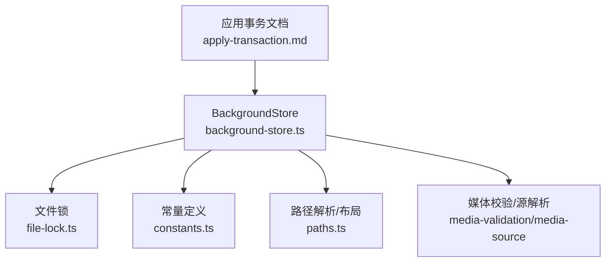
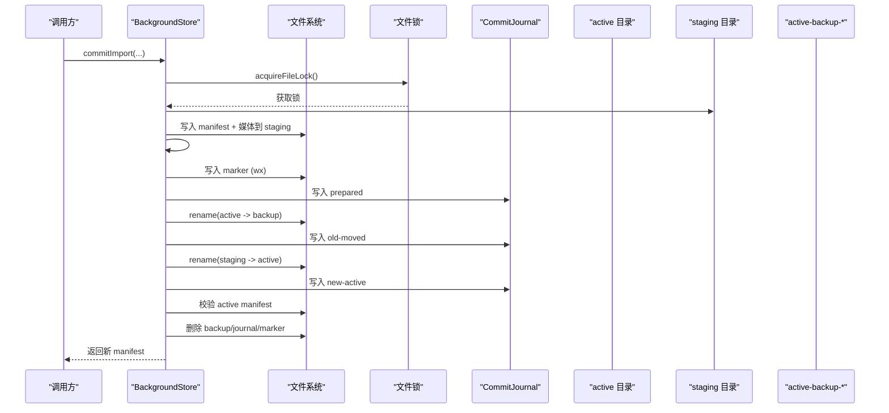
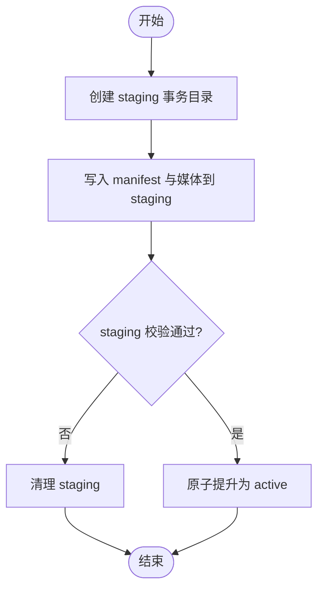
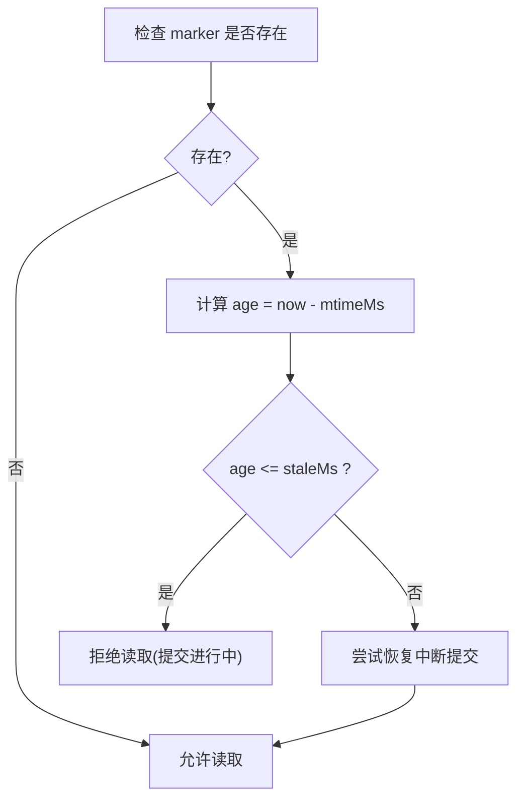
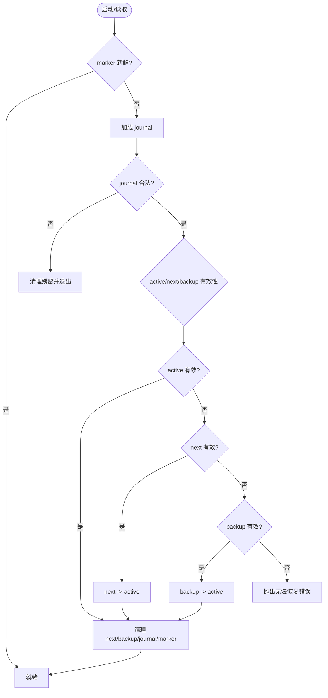
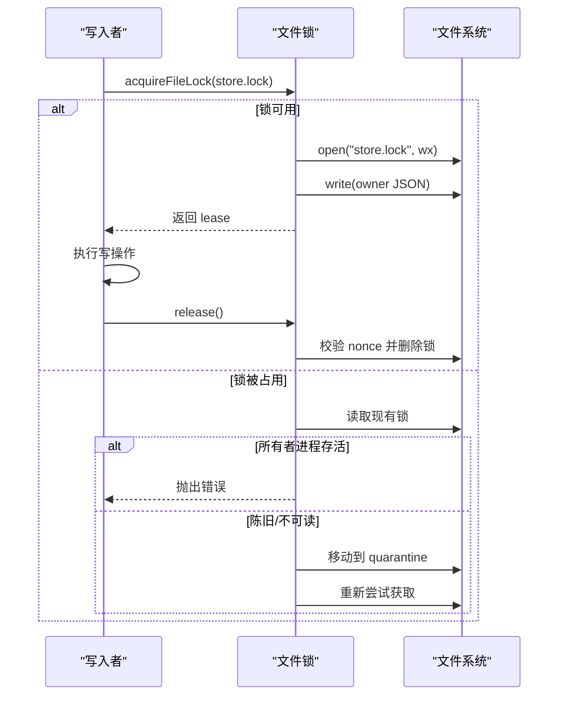
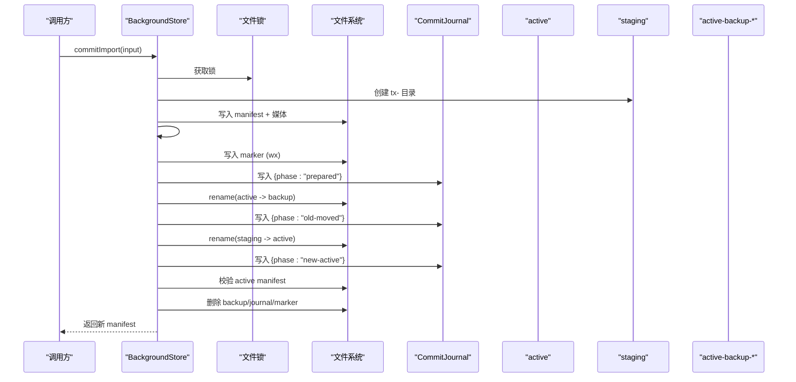
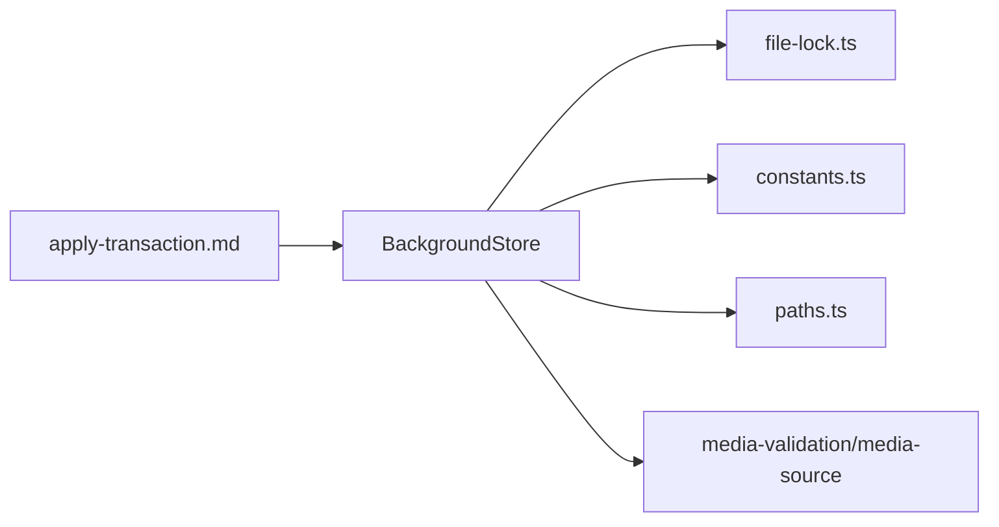

# 原子性提交机制

<cite>
**本文引用的文件**
- [background-store.ts](file://packages/core/src/background-store.ts)
- [file-lock.ts](file://packages/core/src/file-lock.ts)
- [constants.ts](file://packages/core/src/constants.ts)
- [paths.ts](file://packages/core/src/paths.ts)
- [apply-transaction.md](file://docs/apply-transaction.md)
- [background-store.test.js](file://packages/core/test/background-store.test.js)
</cite>

## 目录
1. [简介](#简介)
2. [项目结构](#项目结构)
3. [核心组件](#核心组件)
4. [架构总览](#架构总览)
5. [详细组件分析](#详细组件分析)
6. [依赖关系分析](#依赖关系分析)
7. [性能考虑](#性能考虑)
8. [故障排查指南](#故障排查指南)
9. [结论](#结论)
10. [附录](#附录)

## 简介
本文件面向“原子性提交系统”的实现与使用，聚焦以下目标：
- staging 目录的工作流程：临时事务目录的创建、写入、校验与原子提升。
- journal 日志文件的结构与状态机（prepared → old-moved → new-active）。
- commit marker 文件的作用与过期检测机制。
- 备份恢复流程：active-backup 目录的使用与中断恢复逻辑。
- 文件锁机制：如何防止并发写入冲突。
- 完整提交流程图与错误恢复场景分析。

该机制确保磁盘写入成功不等于用户可见成功；只有当宿主窗口确认或进入离线阶段模式后，变更才被视为最终提交。

## 项目结构
与原子性提交相关的核心代码集中在 packages/core 中：
- background-store.ts：实现 BackgroundStore，封装 staging、journal、marker、backup、恢复、快照、主题保存等能力。
- file-lock.ts：提供跨进程文件锁，用于串行化写操作。
- constants.ts：定义常量，如 COMMIT_MARKER_NAME、COMMIT_MARKER_STALE_MS、MANIFEST_NAME、STAGING_DIR_NAME、ACTIVE_DIR_NAME、SNAPSHOTS_DIR_NAME、DEFAULT_VIDEO_BASENAME 等。
- paths.ts：解析数据根目录布局，生成 DataPaths（stagingDir、activeDir、snapshotsDir、savedDir、runtimeMediaDir），并确保目录存在与所有权标记。
- apply-transaction.md：高层事务文档，描述快照、staging、commit-disk、publish-media、apply-host、live-verify、rollback 的状态机与约束。
- background-store.test.js：覆盖关键行为，包括提交进行中拒绝读取、中断恢复、路径安全校验等。



图表来源
- [background-store.ts:1-45](file://packages/core/src/background-store.ts#L1-L45)
- [file-lock.ts:1-20](file://packages/core/src/file-lock.ts#L1-L20)
- [constants.ts:21-61](file://packages/core/src/constants.ts#L21-L61)
- [paths.ts:44-81](file://packages/core/src/paths.ts#L44-L81)
- [apply-transaction.md:1-117](file://docs/apply-transaction.md#L1-L117)

章节来源
- [background-store.ts:1-45](file://packages/core/src/background-store.ts#L1-L45)
- [constants.ts:21-61](file://packages/core/src/constants.ts#L21-L61)
- [paths.ts:44-81](file://packages/core/src/paths.ts#L44-L81)
- [apply-transaction.md:1-117](file://docs/apply-transaction.md#L1-L117)

## 核心组件
- BackgroundStore：负责背景资源的导入、验证、暂存、原子提升、快照、恢复、运行时视频准备与清理、已保存主题管理等。
- CommitJournal：记录提交阶段的持久化日志，包含版本、阶段、nextDir、backupDir。
- Commit Marker：在数据根或 active 目录下放置的临时标记文件，指示提交进行中，并支持过期检测。
- File Lock：基于 O_EXCL 的跨进程文件锁，附带 nonce 与存活检测，避免竞态与僵尸锁。
- Paths/DataLayout：管理 data root 下的 active、staging、snapshots、saved、runtime-media 等子目录。

章节来源
- [background-store.ts:69-74](file://packages/core/src/background-store.ts#L69-L74)
- [background-store.ts:123-140](file://packages/core/src/background-store.ts#L123-L140)
- [file-lock.ts:5-20](file://packages/core/src/file-lock.ts#L5-L20)
- [constants.ts:21-61](file://packages/core/src/constants.ts#L21-L61)
- [paths.ts:44-81](file://packages/core/src/paths.ts#L44-L81)

## 架构总览
原子性提交通过“先写 staging，再原子切换 active”的方式保证一致性。提交期间通过 journal 和 marker 记录进度，并在异常时进行恢复。读端在检测到活跃 marker 时会拒绝读取半写树，除非 marker 过期。



图表来源
- [background-store.ts:564-678](file://packages/core/src/background-store.ts#L564-L678)
- [background-store.ts:757-798](file://packages/core/src/background-store.ts#L757-L798)
- [background-store.ts:169-188](file://packages/core/src/background-store.ts#L169-L188)
- [background-store.ts:190-199](file://packages/core/src/background-store.ts#L190-L199)
- [constants.ts:21-61](file://packages/core/src/constants.ts#L21-L61)

## 详细组件分析

### Staging 目录工作流程
- 创建临时事务目录：在 stagingDir 下以 tx- 前缀创建唯一目录，用于写入本次提交的 manifest 与受管媒体。
- 写入与校验：将 image/video/poster 等文件复制到 staging，并写入 manifest；随后对 staging 整体执行 #validateTree，确保所有引用有效。
- 原子提升：通过 #promoteStagingToActive 完成 atomic swap，见下文“提交流程”。
- 清理：无论成功或失败，finally 中都会 rmrf staging 目录，避免残留。



图表来源
- [background-store.ts:272-275](file://packages/core/src/background-store.ts#L272-L275)
- [background-store.ts:564-678](file://packages/core/src/background-store.ts#L564-L678)
- [background-store.ts:718-735](file://packages/core/src/background-store.ts#L718-L735)

章节来源
- [background-store.ts:272-275](file://packages/core/src/background-store.ts#L272-L275)
- [background-store.ts:564-678](file://packages/core/src/background-store.ts#L564-L678)
- [background-store.ts:718-735](file://packages/core/src/background-store.ts#L718-L735)

### Journal 日志文件与状态机
- 位置与格式：位于数据根目录的 .beauticode-commit.json，包含 version、phase、nextDir、backupDir。
- 状态机：
  - prepared：已创建 marker 与 journal，尚未移动 active。
  - old-moved：已将 active 重命名为 active-backup-*，等待 staging 替换。
  - new-active：已将 staging 重命名为 active，待校验通过后清理。
- 恢复逻辑：启动时若发现 stale marker，则读取 journal，根据 nextDir/backupDir 与 active 有效性决定恢复策略，并清理中间产物。

```mermaid
stateDiagram-v2
[*] --> prepared : "写入 marker + journal"
prepared --> old-moved : "rename(active -> backup)"
old-moved --> new-active : "rename(staging -> active)"
new-active --> [*] : "校验通过并清理"
note right of prepared : "写入 journal 阶段=prepared"
note right of old-moved : "journal 更新为 old-moved"
note right of new-active : "journal 更新为 new-active"
```

图表来源
- [background-store.ts:69-74](file://packages/core/src/background-store.ts#L69-L74)
- [background-store.ts:198-200](file://packages/core/src/background-store.ts#L198-L200)
- [background-store.ts:211-270](file://packages/core/src/background-store.ts#L211-L270)
- [background-store.ts:757-798](file://packages/core/src/background-store.ts#L757-L798)

章节来源
- [background-store.ts:69-74](file://packages/core/src/background-store.ts#L69-L74)
- [background-store.ts:211-270](file://packages/core/src/background-store.ts#L211-L270)
- [background-store.ts:757-798](file://packages/core/src/background-store.ts#L757-L798)

### Commit Marker 文件与过期检测
- 作用：标识“提交进行中”，阻止读端读取半写树，避免不一致视图。
- 位置：优先检查数据根目录下的 marker，其次兼容旧版 active 目录中的 marker。
- 过期检测：比较 mtimeMs 与 commitMarkerStaleMs（默认 120s），超过阈值视为 stale，允许继续。
- 测试覆盖：写入 busy marker 会拒绝读取；设置极短过期时间后可正常读取。



图表来源
- [background-store.ts:161-188](file://packages/core/src/background-store.ts#L161-L188)
- [background-store.ts:277-288](file://packages/core/src/background-store.ts#L277-L288)
- [background-store.test.js:198-216](file://packages/core/test/background-store.test.js#L198-L216)
- [constants.ts:21-22](file://packages/core/src/constants.ts#L21-L22)

章节来源
- [background-store.ts:161-188](file://packages/core/src/background-store.ts#L161-L188)
- [background-store.ts:277-288](file://packages/core/src/background-store.ts#L277-L288)
- [background-store.test.js:198-216](file://packages/core/test/background-store.test.js#L198-L216)
- [constants.ts:21-22](file://packages/core/src/constants.ts#L21-L22)

### 备份恢复流程与中断恢复
- 备份目录：active-backup-{token}，token 由时间戳+pid+随机数组成，避免命名冲突。
- 恢复触发：init 时发现 stale marker，进入 #recoverInterruptedCommit。
- 恢复策略：
  - 校验 journal 合法性（版本、阶段、路径正则、路径安全）。
  - 判断 active/next/backup 的 manifest 有效性。
  - 若 active 无效：优先用 next 恢复，否则用 backup，否则抛出错误。
  - 清理 next、backup、journal、marker。
- 测试覆盖：模拟 old-moved 阶段崩溃，重启后恢复到 next 版本并清理中间文件。



图表来源
- [background-store.ts:142-159](file://packages/core/src/background-store.ts#L142-L159)
- [background-store.ts:211-270](file://packages/core/src/background-store.ts#L211-L270)
- [background-store.test.js:791-856](file://packages/core/test/background-store.test.js#L791-L856)

章节来源
- [background-store.ts:142-159](file://packages/core/src/background-store.ts#L142-L159)
- [background-store.ts:211-270](file://packages/core/src/background-store.ts#L211-L270)
- [background-store.test.js:791-856](file://packages/core/test/background-store.test.js#L791-L856)

### 文件锁机制与并发控制
- 目的：防止并发 stage/commit 交错，避免竞争条件。
- 实现：acquireFileLock 使用 O_EXCL 创建锁文件，写入 owner（pid、nonce、startedAt、purpose），释放时校验 nonce 并删除锁文件。
- 竞态处理：若锁文件存在且所有者进程存活，直接报错；若锁文件陈旧或不可读，采用 quarantine 方式安全接管。
- 使用点：BackgroundStore 的写操作通过 #withWriteLock 串行化，嵌套调用可重入。



图表来源
- [file-lock.ts:65-170](file://packages/core/src/file-lock.ts#L65-L170)
- [background-store.ts:321-344](file://packages/core/src/background-store.ts#L321-L344)

章节来源
- [file-lock.ts:65-170](file://packages/core/src/file-lock.ts#L65-L170)
- [background-store.ts:321-344](file://packages/core/src/background-store.ts#L321-L344)

### 完整提交流程图
结合 staging、journal、marker、backup 的交互，形成端到端提交流程。



图表来源
- [background-store.ts:564-678](file://packages/core/src/background-store.ts#L564-L678)
- [background-store.ts:757-798](file://packages/core/src/background-store.ts#L757-L798)
- [background-store.ts:169-188](file://packages/core/src/background-store.ts#L169-L188)
- [background-store.ts:190-199](file://packages/core/src/background-store.ts#L190-L199)
- [constants.ts:21-61](file://packages/core/src/constants.ts#L21-L61)

章节来源
- [background-store.ts:564-678](file://packages/core/src/background-store.ts#L564-L678)
- [background-store.ts:757-798](file://packages/core/src/background-store.ts#L757-L798)
- [background-store.ts:169-188](file://packages/core/src/background-store.ts#L169-L188)
- [background-store.ts:190-199](file://packages/core/src/background-store.ts#L190-L199)
- [constants.ts:21-61](file://packages/core/src/constants.ts#L21-L61)

### 错误恢复场景分析
- 提交进行中读取：readActiveManifest 在读取前后均检查 marker，若在有效期内则拒绝读取，避免读到半写树。
- 中断恢复：init 时若 marker 过期，进入 #recoverInterruptedCommit，依据 journal 与目录有效性恢复 active，并清理中间文件。
- 路径安全：所有 staging/backup/snapshot/saved 路径均经过 isPathInsideRoot 与 basename 校验，防止逃逸数据根。
- 测试覆盖：
  - busy marker 导致读取失败；过期后可读取。
  - 模拟 old-moved 阶段崩溃，重启后恢复到 next 版本并清理中间文件。
  - 拒绝非空目录作为数据根，保护已有项目不被误接管。

章节来源
- [background-store.ts:142-188](file://packages/core/src/background-store.ts#L142-L188)
- [background-store.ts:211-270](file://packages/core/src/background-store.ts#L211-L270)
- [background-store.test.js:198-216](file://packages/core/test/background-store.test.js#L198-L216)
- [background-store.test.js:791-856](file://packages/core/test/background-store.test.js#L791-L856)

## 依赖关系分析
- BackgroundStore 依赖：
  - file-lock.ts：串行化写操作，避免并发冲突。
  - constants.ts：常量（marker 名称、过期时间、目录名、manifest 名、视频默认名）。
  - paths.ts：解析数据根布局，确保目录存在与所有权标记。
  - media-validation/media-source：媒体文件校验与路径解析。
- 外部约束：
  - 应用事务文档定义了更高层的事务状态机（snapshot → stage → commit-disk → publish-media → apply-host → live-verify → finalize/rollback）。



图表来源
- [background-store.ts:1-45](file://packages/core/src/background-store.ts#L1-L45)
- [file-lock.ts:1-20](file://packages/core/src/file-lock.ts#L1-L20)
- [constants.ts:21-61](file://packages/core/src/constants.ts#L21-L61)
- [paths.ts:44-81](file://packages/core/src/paths.ts#L44-L81)
- [apply-transaction.md:1-117](file://docs/apply-transaction.md#L1-L117)

章节来源
- [background-store.ts:1-45](file://packages/core/src/background-store.ts#L1-L45)
- [file-lock.ts:1-20](file://packages/core/src/file-lock.ts#L1-L20)
- [constants.ts:21-61](file://packages/core/src/constants.ts#L21-L61)
- [paths.ts:44-81](file://packages/core/src/paths.ts#L44-L81)
- [apply-transaction.md:1-117](file://docs/apply-transaction.md#L1-L117)

## 性能考虑
- 原子写入：JSON 文件通过 tmp + rename 原子写入，减少部分写入导致的损坏风险。
- 本地视频零拷贝：对于 local 模式的视频，直接流式读取原路径，避免复制开销；首次读取前预热头部与 moov 尾部以降低首帧延迟。
- 运行时视频缓存：按 generation 缓存副本，减少重复复制；会话结束后清理。
- 资源限制：已保存主题数量与大小上限，防止存储膨胀。
- 锁粒度：写操作串行化，避免复杂并发带来的额外同步成本。

[本节为通用性能讨论，不直接分析具体文件]

## 故障排查指南
- 读取失败提示“提交进行中”：检查数据根或 active 目录下的 marker 是否仍在有效期内；若为历史遗留，等待过期或手动清理。
- 中断恢复失败：查看 .beauticode-commit.json 内容，确认 nextDir/backupDir 是否有效；若 active/next/backup 均无效，需人工介入恢复。
- 路径安全错误：确认 staging/backup/snapshot/saved 路径未逃逸数据根；检查符号链接与非法字符。
- 锁冲突：若出现“另一个操作正在运行”，等待当前持有锁的进程结束；若为僵尸锁，系统将尝试 quarantine 并接管。

章节来源
- [background-store.ts:169-188](file://packages/core/src/background-store.ts#L169-L188)
- [background-store.ts:211-270](file://packages/core/src/background-store.ts#L211-L270)
- [file-lock.ts:133-170](file://packages/core/src/file-lock.ts#L133-L170)
- [background-store.test.js:198-216](file://packages/core/test/background-store.test.js#L198-L216)

## 结论
该原子性提交系统通过 staging + journal + marker + backup 的组合，实现了强一致性的背景资源切换。读端在提交进行中拒绝访问，避免看到不一致状态；写端通过文件锁串行化，确保多进程安全。中断恢复机制保障系统在异常情况下仍能回到一致状态。配合路径安全校验与资源限制，整体具备高可靠性与可维护性。

[本节为总结，不直接分析具体文件]

## 附录
- 术语说明：
  - staging：临时事务目录，用于构建完整的待提交树。
  - journal：提交日志，记录阶段与相关目录名。
  - marker：提交进行中标志，支持过期检测。
  - backup：active 的备份目录，用于回滚或恢复。
  - snapshot：用于回滚的只读副本，保存在 snapshots 目录。
  - saved theme：用户保存的主题，可在后续使用中恢复。

[本节为概念说明，不直接分析具体文件]