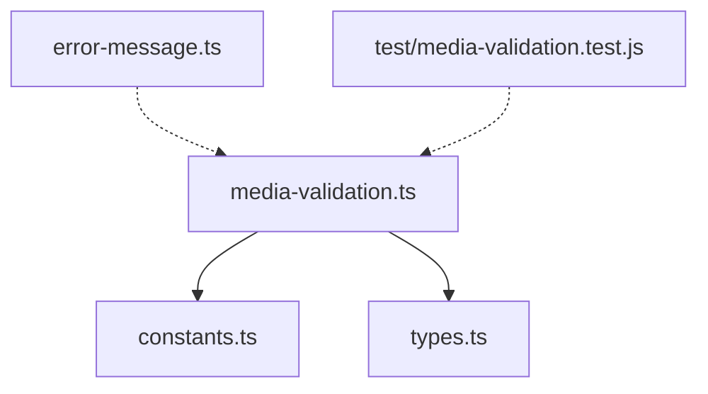
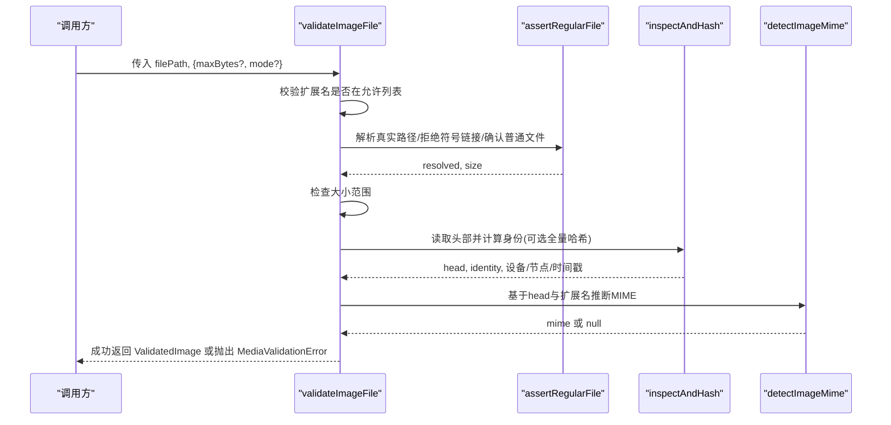
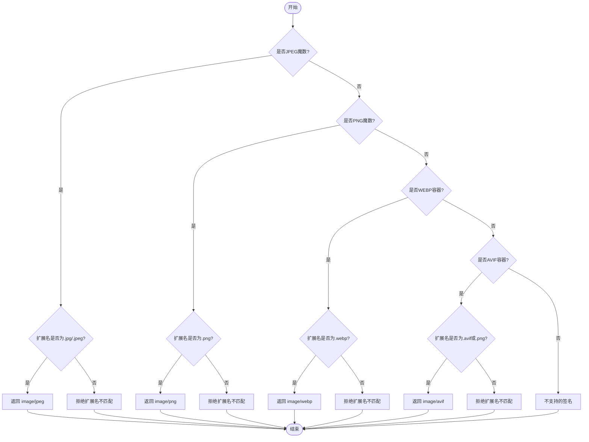
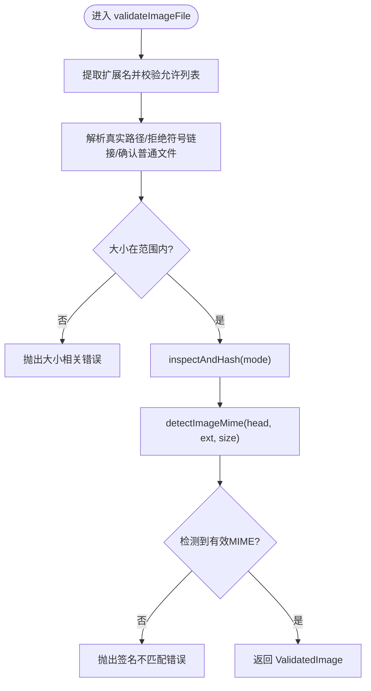
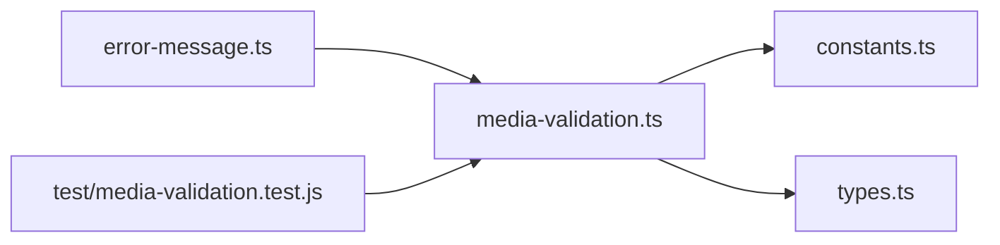

# 图片文件验证

<cite>
**本文引用的文件**
- [packages/core/src/media-validation.ts](file://packages/core/src/media-validation.ts)
- [packages/core/src/constants.ts](file://packages/core/src/constants.ts)
- [packages/core/src/types.ts](file://packages/core/src/types.ts)
- [packages/core/src/error-message.ts](file://packages/core/src/error-message.ts)
- [packages/core/test/media-validation.test.js](file://packages/core/test/media-validation.test.js)
</cite>

## 目录
1. [简介](#简介)
2. [项目结构](#项目结构)
3. [核心组件](#核心组件)
4. [架构总览](#架构总览)
5. [详细组件分析](#详细组件分析)
6. [依赖关系分析](#依赖关系分析)
7. [性能考虑](#性能考虑)
8. [故障排查指南](#故障排查指南)
9. [结论](#结论)
10. [附录](#附录)

## 简介
本文件系统化说明图片文件验证子系统，覆盖支持的图片格式（JPEG、PNG、WEBP、AVIF）及其魔数检测机制；完整验证流程包括扩展名检查、文件大小限制、符号链接防护与文件完整性校验；解释快速模式（fast mode）与完整模式（full mode）的差异与适用场景；描述图片 MIME 类型检测与兼容性处理；提供错误处理示例与最佳实践建议；并总结安全考量与性能优化策略。

## 项目结构
该功能位于 core 包的媒体验证模块中，围绕以下关键文件组织：
- media-validation.ts：实现图片/视频验证、魔数检测、路径安全、哈希身份等核心逻辑
- constants.ts：定义最大尺寸、允许的图片扩展名、视频扩展名等常量
- types.ts：定义验证结果类型与输入输出接口
- error-message.ts：将内部英文错误映射为面向用户的中文提示
- test/media-validation.test.js：覆盖 AVIF 兼容、MP4 容器检测、符号链接拒绝、大小限制等用例

图表来源
- [packages/core/src/media-validation.ts:1-10](file://packages/core/src/media-validation.ts#L1-L10)
- [packages/core/src/constants.ts:43-52](file://packages/core/src/constants.ts#L43-L52)
- [packages/core/src/types.ts:83-105](file://packages/core/src/types.ts#L83-L105)
- [packages/core/src/error-message.ts:148-161](file://packages/core/src/error-message.ts#L148-L161)
- [packages/core/test/media-validation.test.js:55-74](file://packages/core/test/media-validation.test.js#L55-L74)

章节来源
- [packages/core/src/media-validation.ts:1-358](file://packages/core/src/media-validation.ts#L1-L358)
- [packages/core/src/constants.ts:1-62](file://packages/core/src/constants.ts#L1-L62)
- [packages/core/src/types.ts:1-200](file://packages/core/src/types.ts#L1-L200)
- [packages/core/src/error-message.ts:1-211](file://packages/core/src/error-message.ts#L1-L211)
- [packages/core/test/media-validation.test.js:1-178](file://packages/core/test/media-validation.test.js#L1-L178)

## 核心组件
- 支持格式与魔数检测
  - JPEG：基于头部魔数前缀匹配
  - PNG：基于固定魔数前缀匹配
  - WEBP：基于 RIFF/WEBP 容器头检测
  - AVIF：基于 ISO-BMFF ftyp box 的 brand 字段检测，兼容误标为 .png 的情况
- 文件路径与权限安全
  - 拒绝符号链接与重解析点（含 Windows 目录联接）
  - 仅接受普通文件
- 大小限制
  - 图片默认上限由常量定义（约 18 MiB），可配置
  - 视频默认上限由常量定义（约 800 MiB）
- 完整性校验与身份标识
  - 读取文件头部并进行 SHA-256 计算
  - fast 模式使用元数据+头部生成指纹，避免对大文件全量扫描
  - full 模式对整文件进行分块哈希，确保内容一致性
- MIME 类型推断
  - 结合魔数与扩展名严格匹配，返回标准 MIME
- 辅助能力
  - 视频预热读取（减少冷启动卡顿）
  - 文件名白名单与安全基名校验

章节来源
- [packages/core/src/media-validation.ts:12-51](file://packages/core/src/media-validation.ts#L12-L51)
- [packages/core/src/media-validation.ts:62-123](file://packages/core/src/media-validation.ts#L62-L123)
- [packages/core/src/media-validation.ts:125-190](file://packages/core/src/media-validation.ts#L125-L190)
- [packages/core/src/media-validation.ts:192-221](file://packages/core/src/media-validation.ts#L192-L221)
- [packages/core/src/media-validation.ts:223-292](file://packages/core/src/media-validation.ts#L223-L292)
- [packages/core/src/media-validation.ts:294-328](file://packages/core/src/media-validation.ts#L294-L328)
- [packages/core/src/media-validation.ts:330-358](file://packages/core/src/media-validation.ts#L330-L358)
- [packages/core/src/constants.ts:3-13](file://packages/core/src/constants.ts#L3-L13)
- [packages/core/src/constants.ts:43-52](file://packages/core/src/constants.ts#L43-L52)

## 架构总览
下图展示图片验证的主流程：从入口函数到扩展名校验、路径安全、大小限制、完整性校验、MIME 推断，最终产出结构化验证结果。

图表来源
- [packages/core/src/media-validation.ts:223-259](file://packages/core/src/media-validation.ts#L223-L259)
- [packages/core/src/media-validation.ts:92-123](file://packages/core/src/media-validation.ts#L92-L123)
- [packages/core/src/media-validation.ts:125-190](file://packages/core/src/media-validation.ts#L125-L190)
- [packages/core/src/media-validation.ts:192-221](file://packages/core/src/media-validation.ts#L192-L221)

## 详细组件分析

### 图片格式与魔数检测
- JPEG：检测头部魔数前缀，并要求扩展名为 .jpg/.jpeg
- PNG：检测固定魔数前缀，要求扩展名为 .png
- WEBP：检测 RIFF/WEBP 容器头，要求扩展名为 .webp
- AVIF：检测 ISO-BMFF ftyp 与品牌标识（avif/avis），兼容误标为 .png 的场景，但不会放宽其他格式的不匹配

图表来源
- [packages/core/src/media-validation.ts:192-221](file://packages/core/src/media-validation.ts#L192-L221)
- [packages/core/src/media-validation.ts:12-23](file://packages/core/src/media-validation.ts#L12-L23)
- [packages/core/src/media-validation.ts:25-51](file://packages/core/src/media-validation.ts#L25-L51)

章节来源
- [packages/core/src/media-validation.ts:12-51](file://packages/core/src/media-validation.ts#L12-L51)
- [packages/core/src/media-validation.ts:192-221](file://packages/core/src/media-validation.ts#L192-L221)

### 完整验证流程（扩展名、大小、符号链接、完整性）
- 扩展名检查：仅允许 .jpg/.jpeg/.png/.webp/.avif
- 路径安全：拒绝符号链接与重解析点，仅接受普通文件
- 大小限制：非空且不超过上限（图片默认约 18 MiB）
- 完整性校验：
  - fast 模式：以“设备+inode+size+mtime+ctime+头部”计算身份，避免全量扫描大文件
  - full 模式：对整文件分块哈希，确保内容一致
- MIME 推断：基于头部魔数与扩展名严格匹配
- 返回结构：包含 kind、filePath、size、extension、mime、identity、设备/节点/时间戳等

图表来源
- [packages/core/src/media-validation.ts:223-259](file://packages/core/src/media-validation.ts#L223-L259)
- [packages/core/src/media-validation.ts:92-123](file://packages/core/src/media-validation.ts#L92-L123)
- [packages/core/src/media-validation.ts:125-190](file://packages/core/src/media-validation.ts#L125-L190)
- [packages/core/src/media-validation.ts:192-221](file://packages/core/src/media-validation.ts#L192-L221)

章节来源
- [packages/core/src/media-validation.ts:223-259](file://packages/core/src/media-validation.ts#L223-L259)
- [packages/core/src/media-validation.ts:92-123](file://packages/core/src/media-validation.ts#L92-L123)
- [packages/core/src/media-validation.ts:125-190](file://packages/core/src/media-validation.ts#L125-L190)
- [packages/core/src/media-validation.ts:192-221](file://packages/core/src/media-validation.ts#L192-L221)

### 快速模式与完整模式
- 快速模式（fast）
  - 用途：本地引用导入时避免对多 GB 文件做全量哈希
  - 指纹构成：设备号 + inode + 大小 + mtime + ctime + 头部
  - 风险：若后续元数据变化，服务端会拒绝资产
- 完整模式（full）
  - 用途：对整文件进行分块哈希，确保内容一致性
  - 开销：I/O 与 CPU 更高，适合需要强一致性的场景

章节来源
- [packages/core/src/media-validation.ts:125-190](file://packages/core/src/media-validation.ts#L125-L190)

### 视频背景验证（补充）
- 强制扩展名为 .mp4
- 同样执行路径安全、大小限制、完整性校验
- 通过 ftyp 容器检测确认为 MP4 容器

章节来源
- [packages/core/src/media-validation.ts:261-292](file://packages/core/src/media-validation.ts#L261-L292)
- [packages/core/src/media-validation.ts:78-90](file://packages/core/src/media-validation.ts#L78-L90)

### 错误处理与用户提示
- 内部统一抛出 MediaValidationError
- 上层通过 toChineseErrorMessage 将英文错误转换为中文提示，便于用户理解
- 典型错误类别：
  - 未找到文件
  - 路径不是普通文件或存在符号链接
  - 扩展名不在允许列表
  - 超过大小限制
  - 内容签名不匹配
  - 视频不是有效 MP4 容器

章节来源
- [packages/core/src/media-validation.ts:53-58](file://packages/core/src/media-validation.ts#L53-L58)
- [packages/core/src/error-message.ts:148-161](file://packages/core/src/error-message.ts#L148-L161)

## 依赖关系分析
- 常量依赖
  - 图片最大字节数、视频最大字节数、允许的图片扩展名、视频扩展名
- 类型依赖
  - ValidatedImage / ValidatedVideo 作为验证结果的结构化契约
- 测试依赖
  - 构造最小 PNG/AVIF/MP4 夹具，验证各分支行为

图表来源
- [packages/core/src/media-validation.ts:1-10](file://packages/core/src/media-validation.ts#L1-L10)
- [packages/core/src/constants.ts:3-13](file://packages/core/src/constants.ts#L3-L13)
- [packages/core/src/constants.ts:43-52](file://packages/core/src/constants.ts#L43-L52)
- [packages/core/src/types.ts:83-105](file://packages/core/src/types.ts#L83-L105)
- [packages/core/test/media-validation.test.js:18-46](file://packages/core/test/media-validation.test.js#L18-L46)

章节来源
- [packages/core/src/media-validation.ts:1-10](file://packages/core/src/media-validation.ts#L1-L10)
- [packages/core/src/constants.ts:3-13](file://packages/core/src/constants.ts#L3-L13)
- [packages/core/src/constants.ts:43-52](file://packages/core/src/constants.ts#L43-L52)
- [packages/core/src/types.ts:83-105](file://packages/core/src/types.ts#L83-L105)
- [packages/core/test/media-validation.test.js:18-46](file://packages/core/test/media-validation.test.js#L18-L46)

## 性能考虑
- 快速模式优先用于本地引用导入，避免对大文件的全量哈希，显著降低 I/O 与 CPU 开销
- 完整模式仅在需要强一致性时使用
- 视频预热读取：在暂存阶段主动读取文件头与尾部，降低首次播放时的冷启动延迟与防病毒扫描带来的阻塞
- 合理设置 maxBytes，防止超大文件导致内存与 I/O 压力

章节来源
- [packages/core/src/media-validation.ts:125-190](file://packages/core/src/media-validation.ts#L125-L190)
- [packages/core/src/media-validation.ts:294-328](file://packages/core/src/media-validation.ts#L294-L328)
- [packages/core/src/constants.ts:3-13](file://packages/core/src/constants.ts#L3-L13)

## 故障排查指南
- 常见错误及定位
  - “未找到媒体文件”：检查路径是否存在并可访问
    - 参考：[packages/core/src/media-validation.ts:98-102](file://packages/core/src/media-validation.ts#L98-L102)
  - “媒体路径必须指向普通文件/不能是符号链接”：检查路径是否包含符号链接或重解析点
    - 参考：[packages/core/src/media-validation.ts:103-121](file://packages/core/src/media-validation.ts#L103-L121)
  - “图片必须使用以下扩展名之一”：确认扩展名在允许列表中
    - 参考：[packages/core/src/media-validation.ts:227-233](file://packages/core/src/media-validation.ts#L227-L233)
  - “图片必须是非空文件，且不超过 X 字节”：检查文件大小
    - 参考：[packages/core/src/media-validation.ts:234-239](file://packages/core/src/media-validation.ts#L234-L239)
  - “图片内容与支持的 JPEG/PNG/WEBP/AVIF 格式不匹配”：检查魔数与扩展名是否一致
    - 参考：[packages/core/src/media-validation.ts:240-246](file://packages/core/src/media-validation.ts#L240-L246)
  - “视频背景不是有效的 MP4 容器”：检查 ftyp 容器头
    - 参考：[packages/core/src/media-validation.ts:276-281](file://packages/core/src/media-validation.ts#L276-L281)
- 用户可见错误翻译
  - 通过 toChineseErrorMessage 将上述错误转为中文提示，便于定位问题
    - 参考：[packages/core/src/error-message.ts:148-161](file://packages/core/src/error-message.ts#L148-L161)
- 测试用例参考
  - AVIF 兼容与误标 .png 的处理
    - 参考：[packages/core/test/media-validation.test.js:55-74](file://packages/core/test/media-validation.test.js#L55-L74)
  - MP4 容器检测与符号链接拒绝
    - 参考：[packages/core/test/media-validation.test.js:76-114](file://packages/core/test/media-validation.test.js#L76-L114)
  - 图片魔数校验
    - 参考：[packages/core/test/media-validation.test.js:133-147](file://packages/core/test/media-validation.test.js#L133-L147)

章节来源
- [packages/core/src/media-validation.ts:98-121](file://packages/core/src/media-validation.ts#L98-L121)
- [packages/core/src/media-validation.ts:227-246](file://packages/core/src/media-validation.ts#L227-L246)
- [packages/core/src/media-validation.ts:276-281](file://packages/core/src/media-validation.ts#L276-L281)
- [packages/core/src/error-message.ts:148-161](file://packages/core/src/error-message.ts#L148-L161)
- [packages/core/test/media-validation.test.js:55-74](file://packages/core/test/media-validation.test.js#L55-L74)
- [packages/core/test/media-validation.test.js:76-114](file://packages/core/test/media-validation.test.js#L76-L114)
- [packages/core/test/media-validation.test.js:133-147](file://packages/core/test/media-validation.test.js#L133-L147)

## 结论
该图片文件验证系统通过严格的扩展名与魔数双重校验、路径安全控制、大小限制与完整性校验，确保只有合法、安全的图片资源被接受。快速模式与完整模式的灵活选择兼顾了性能与一致性需求。配合中文错误提示与完善的测试覆盖，系统在易用性与健壮性方面达到良好平衡。对于大规模或高并发场景，建议优先采用快速模式并结合合理的 maxBytes 配置，必要时辅以视频预热以提升用户体验。

## 附录
- 支持的图片扩展名与上限
  - 扩展名：.jpg/.jpeg/.png/.webp/.avif
  - 图片最大字节数：约 18 MiB（可通过常量配置）
  - 视频最大字节数：约 800 MiB（可通过常量配置）
- 返回结果关键字段
  - kind、filePath、size、extension、mime、identity、device、inode、mtimeMs、ctimeMs

章节来源
- [packages/core/src/constants.ts:3-13](file://packages/core/src/constants.ts#L3-L13)
- [packages/core/src/constants.ts:43-52](file://packages/core/src/constants.ts#L43-L52)
- [packages/core/src/types.ts:83-105](file://packages/core/src/types.ts#L83-L105)