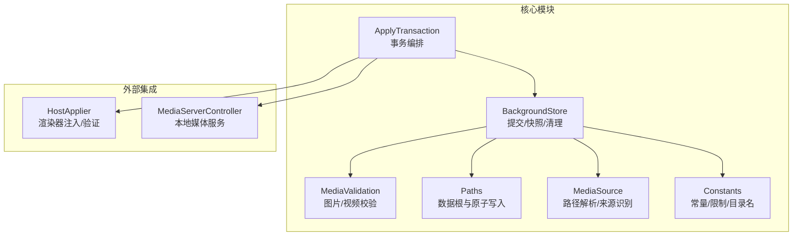
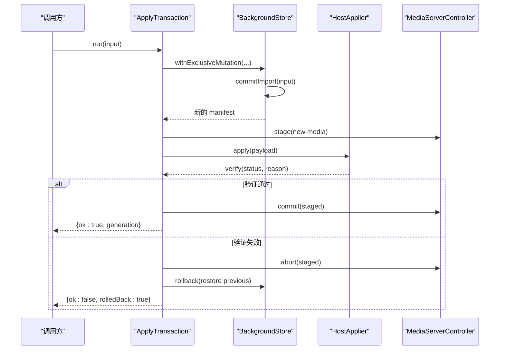
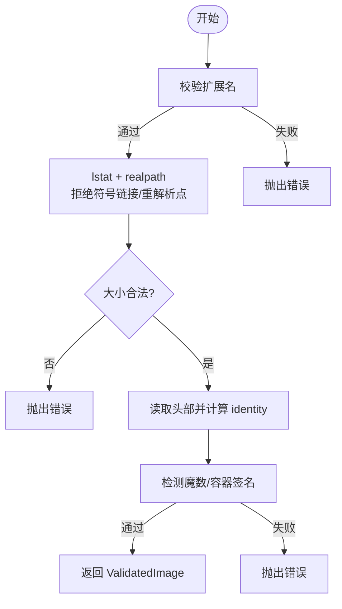
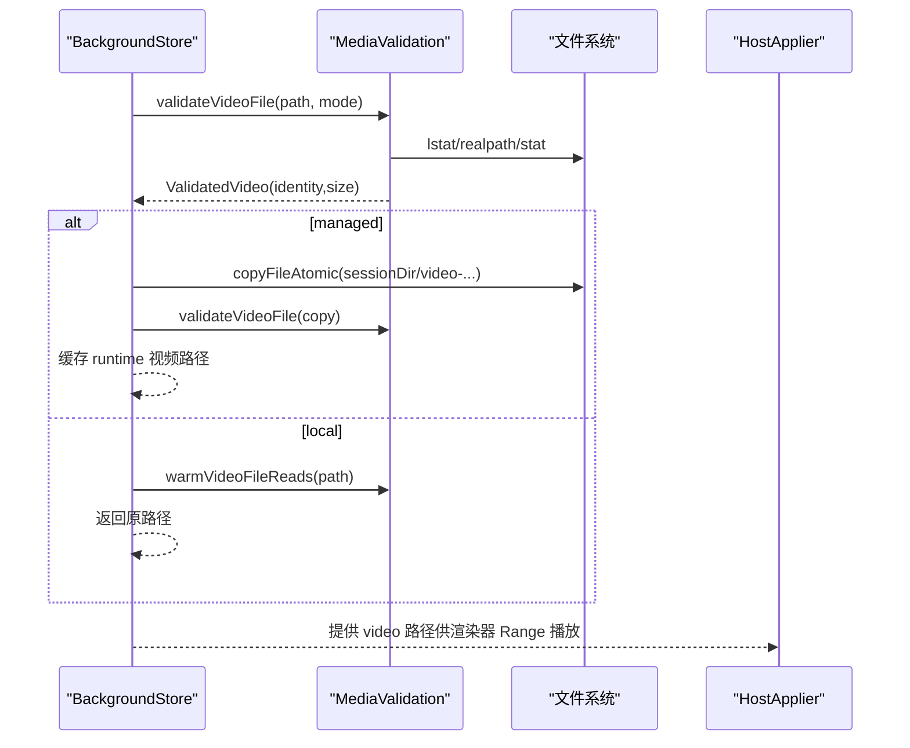
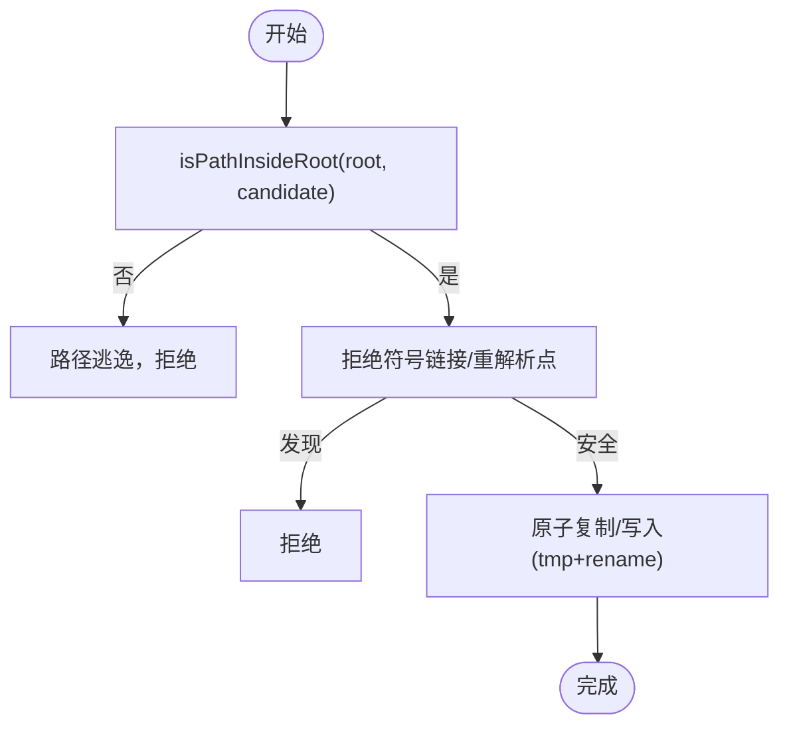
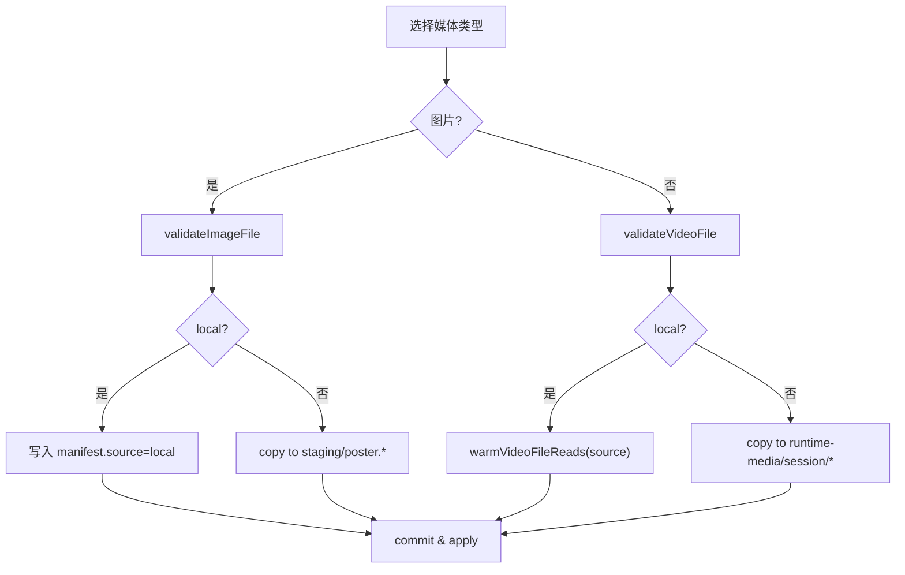
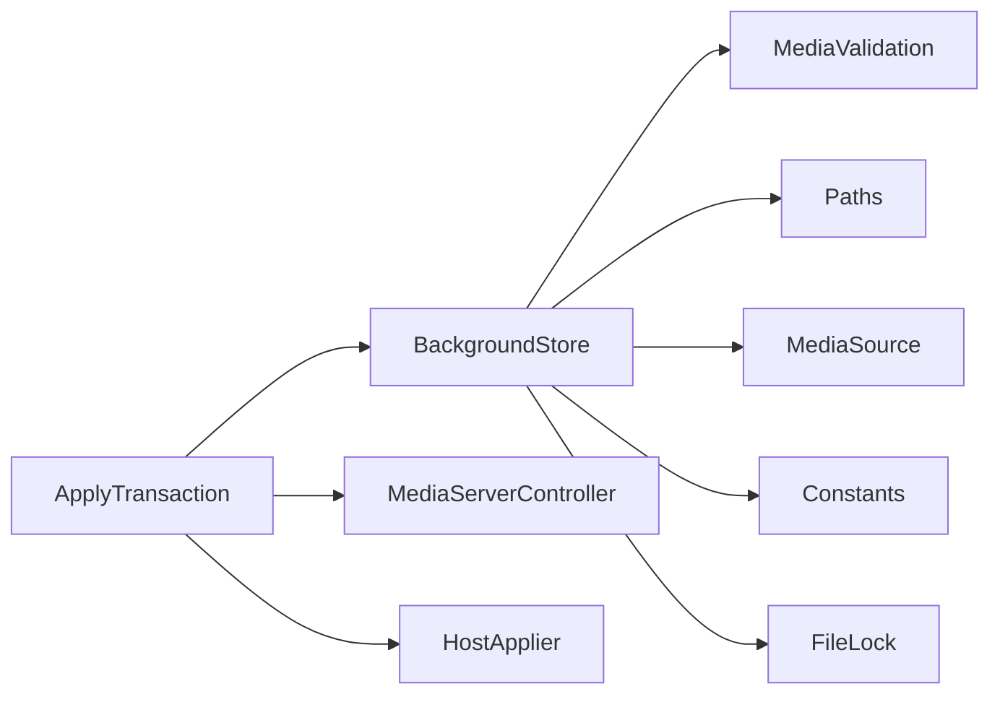

# 媒体文件管理

<cite>
**本文引用的文件**
- [media-validation.ts](file://packages/core/src/media-validation.ts)
- [background-store.ts](file://packages/core/src/background-store.ts)
- [paths.ts](file://packages/core/src/paths.ts)
- [constants.ts](file://packages/core/src/constants.ts)
- [media-source.ts](file://packages/core/src/media-source.ts)
- [apply-transaction.ts](file://packages/core/src/apply-transaction.ts)
- [media-contract.md](file://docs/media-contract.md)
- [apply-transaction.md](file://docs/apply-transaction.md)
- [error-message.ts](file://packages/core/src/error-message.ts)
</cite>

## 目录
1. [简介](#简介)
2. [项目结构](#项目结构)
3. [核心组件](#核心组件)
4. [架构总览](#架构总览)
5. [详细组件分析](#详细组件分析)
6. [依赖关系分析](#依赖关系分析)
7. [性能考量](#性能考量)
8. [故障排查指南](#故障排查指南)
9. [结论](#结论)
10. [附录](#附录)

## 简介
本文件系统负责主题背景媒体（图片与视频）的导入、验证、暂存、提交与运行时播放。系统支持两种本地引用模式：
- 本地引用模式（local）：直接引用外部路径，不复制文件到数据根目录，适用于用户自有媒体或受控环境。
- 管理模式（managed）：将媒体复制到数据根目录的 active/staging/snapshots/runtime-media 等子目录中，由系统统一管理生命周期。

文档重点说明：
- local 与 managed 的区别与适用场景
- 图片文件的验证流程（格式、大小、安全）
- 视频文件的处理策略（元数据提取、Range 请求、性能优化）
- 文件复制与移动的安全检查（路径校验、符号链接防护）
- 存储布局与命名约定
- 不同媒体类型的处理流程图与最佳实践

## 项目结构
媒体子系统位于 packages/core/src 下，围绕 BackgroundStore、ApplyTransaction、MediaValidation、Paths 等模块协作完成“导入→暂存→提交→应用→验证→回滚”的事务流程。

图表来源
- [background-store.ts:123-140](file://packages/core/src/background-store.ts#L123-L140)
- [apply-transaction.ts:103-121](file://packages/core/src/apply-transaction.ts#L103-L121)
- [media-validation.ts:1-10](file://packages/core/src/media-validation.ts#L1-L10)
- [paths.ts:39-49](file://packages/core/src/paths.ts#L39-L49)
- [media-source.ts:5-10](file://packages/core/src/media-source.ts#L5-L10)
- [constants.ts:1-13](file://packages/core/src/constants.ts#L1-L13)

章节来源
- [background-store.ts:123-140](file://packages/core/src/background-store.ts#L123-L140)
- [apply-transaction.ts:103-121](file://packages/core/src/apply-transaction.ts#L103-L121)
- [paths.ts:39-49](file://packages/core/src/paths.ts#L39-L49)
- [media-source.ts:5-10](file://packages/core/src/media-source.ts#L5-L10)
- [constants.ts:1-13](file://packages/core/src/constants.ts#L1-L13)

## 核心组件
- BackgroundStore：负责数据根初始化、暂存树构建、原子提交、快照与清理、运行时视频准备。
- ApplyTransaction：编排“快照→磁盘提交→媒体发布→宿主应用→实时验证→最终化/回滚”的事务。
- MediaValidation：统一进行图片/视频的扩展名、大小、魔数/容器头、符号链接/重解析点、内容一致性校验。
- Paths：提供数据根路径解析、目录创建、原子复制/链接、路径范围保护。
- MediaSource：根据 manifest 解析实际媒体路径，区分 local/managed 来源。
- Constants：定义媒体类型限制、目录名、默认文件名、传输相关常量等。

章节来源
- [background-store.ts:123-140](file://packages/core/src/background-store.ts#L123-L140)
- [apply-transaction.ts:103-121](file://packages/core/src/apply-transaction.ts#L103-L121)
- [media-validation.ts:53-60](file://packages/core/src/media-validation.ts#L53-L60)
- [paths.ts:39-49](file://packages/core/src/paths.ts#L39-L49)
- [media-source.ts:5-10](file://packages/core/src/media-source.ts#L5-L10)
- [constants.ts:1-13](file://packages/core/src/constants.ts#L1-L13)

## 架构总览
媒体变更通过 ApplyTransaction 驱动，内部调用 BackgroundStore 完成磁盘侧的暂存与提交；随后通过 HostApplier 向渲染器注入新背景并执行实时验证；失败则回滚到上一代。

图表来源
- [apply-transaction.ts:127-151](file://packages/core/src/apply-transaction.ts#L127-L151)
- [background-store.ts:564-678](file://packages/core/src/background-store.ts#L564-L678)
- [apply-transaction.md:7-19](file://docs/apply-transaction.md#L7-L19)

章节来源
- [apply-transaction.ts:127-151](file://packages/core/src/apply-transaction.ts#L127-L151)
- [background-store.ts:564-678](file://packages/core/src/background-store.ts#L564-L678)
- [apply-transaction.md:7-19](file://docs/apply-transaction.md#L7-L19)

## 详细组件分析

### 本地引用模式（local）与管理模式（managed）
- 本地引用模式（local）
  - 行为：不复制媒体文件，直接使用外部路径；在 manifest 中记录 source.kind=local 与绝对路径。
  - 适用场景：用户自有媒体、受控目录、避免重复拷贝大文件。
  - 注意：运行时若为视频，会预热首尾字节以降低首次 Range 读取延迟；不会进入 active 目录，避免被渲染器长时间占用句柄。
- 管理模式（managed）
  - 行为：将媒体复制到 active/staging/snapshots/runtime-media 等受控目录；manifest 仅保存相对基名。
  - 适用场景：需要系统统一管理生命周期、可快照/回滚、跨进程共享。
  - 注意：提交过程使用原子 rename 保证读者始终看到一致状态。

章节来源
- [background-store.ts:574-655](file://packages/core/src/background-store.ts#L574-L655)
- [media-source.ts:5-10](file://packages/core/src/media-source.ts#L5-L10)
- [background-store.ts:352-373](file://packages/core/src/background-store.ts#L352-L373)
- [background-store.ts:757-798](file://packages/core/src/background-store.ts#L757-L798)

### 图片文件验证流程
- 扩展名白名单：jpg/jpeg/png/webp/avif（大小写不敏感）。
- 路径安全：必须为普通文件；拒绝符号链接与 Windows 重解析点；逐段检查路径段是否包含符号链接。
- 大小限制：非空且不超过最大字节数（与内联 data URL 上限一致）。
- 内容签名：读取头部魔数检测 JPEG/PNG/WEBP/AVIF，确保内容与扩展名匹配。
- 身份标识：fast/full 两种模式；fast 基于设备号/inode/大小/时间戳+头部计算指纹，full 对全文件哈希。
- 结果：返回 validated image 对象，包含 filePath、size、extension、mime、identity、inode/mtime/ctime 等。

图表来源
- [media-validation.ts:223-259](file://packages/core/src/media-validation.ts#L223-L259)
- [media-validation.ts:92-123](file://packages/core/src/media-validation.ts#L92-L123)
- [media-validation.ts:125-190](file://packages/core/src/media-validation.ts#L125-L190)
- [media-validation.ts:192-221](file://packages/core/src/media-validation.ts#L192-L221)

章节来源
- [media-validation.ts:223-259](file://packages/core/src/media-validation.ts#L223-L259)
- [media-validation.ts:92-123](file://packages/core/src/media-validation.ts#L92-L123)
- [media-validation.ts:125-190](file://packages/core/src/media-validation.ts#L125-L190)
- [media-validation.ts:192-221](file://packages/core/src/media-validation.ts#L192-L221)

### 视频文件处理策略
- 扩展名与容器：仅接受 .mp4；校验 ISO-BMFF 容器头（ftyp box），确保容器有效。
- 大小限制：非空且不超过最大字节数（800 MiB）。
- 路径安全：同图片，拒绝符号链接/重解析点，逐段检查。
- 身份标识：fast/full 模式；fast 用于 local 引用，避免对超大文件做全量哈希。
- 运行时视频准备：
  - managed 视频：复制到 runtime-media/session 下的唯一命名文件，再次校验 identity 后缓存。
  - local 视频：直接返回源路径，并在渲染器验证前预热首尾字节，降低首次 Range 读取延迟。
- 播放语义：先显示 poster，视频就绪后再替换；失败时回滚到上一代。

图表来源
- [media-validation.ts:261-292](file://packages/core/src/media-validation.ts#L261-L292)
- [media-validation.ts:294-328](file://packages/core/src/media-validation.ts#L294-L328)
- [background-store.ts:352-437](file://packages/core/src/background-store.ts#L352-L437)

章节来源
- [media-validation.ts:261-292](file://packages/core/src/media-validation.ts#L261-L292)
- [media-validation.ts:294-328](file://packages/core/src/media-validation.ts#L294-L328)
- [background-store.ts:352-437](file://packages/core/src/background-store.ts#L352-L437)

### 文件复制与移动操作的安全检查
- 路径范围保护：所有候选路径需通过 isPathInsideRoot 校验，防止逃逸到数据根之外。
- 符号链接防护：
  - 导入边界拒绝符号链接与重解析点。
  - 逐段检查路径段是否存在符号链接。
  - 运行时 session 目录也需为真实目录且不被符号链接绕过。
- 原子写入：
  - 使用临时文件 + rename 实现原子复制/写入，避免中间态。
  - 提交阶段通过 journal + marker 机制，保证 readers 不会读到混合状态。
- 名称安全：仅允许基名，禁止路径分隔符、Windows 非法字符、保留设备名与控制字符。

图表来源
- [paths.ts:160-167](file://packages/core/src/paths.ts#L160-L167)
- [paths.ts:178-207](file://packages/core/src/paths.ts#L178-L207)
- [media-validation.ts:92-123](file://packages/core/src/media-validation.ts#L92-L123)
- [background-store.ts:757-798](file://packages/core/src/background-store.ts#L757-L798)

章节来源
- [paths.ts:160-167](file://packages/core/src/paths.ts#L160-L167)
- [paths.ts:178-207](file://packages/core/src/paths.ts#L178-L207)
- [media-validation.ts:92-123](file://packages/core/src/media-validation.ts#L92-L123)
- [background-store.ts:757-798](file://packages/core/src/background-store.ts#L757-L798)

### 存储布局与命名约定
- 数据根目录：
  - active：当前生效的媒体与 manifest。
  - staging：待提交的暂存目录，提交成功后原子替换 active。
  - snapshots：历史快照，用于恢复。
  - saved：已保存的主题资源。
  - runtime-media：运行时会话隔离的视频副本，按 session 目录组织。
- 关键文件：
  - background.json：manifest，包含 schema、generation、background、updatedAt。
  - theme.json：saved 元数据。
- 命名约定：
  - 图片：poster.jpg / poster.png（jpeg 统一为 .jpg）。
  - 视频：background.mp4（managed）。
  - 运行时视频：video-{generation}-{identity前缀}.mp4。
  - 快照目录：snap-{timestamp}-{pid}-{uuid}。
  - 提交标记：.beauticode-commit-in-progress；日志：.beauticode-commit.json。

章节来源
- [constants.ts:54-62](file://packages/core/src/constants.ts#L54-L62)
- [background-store.ts:504-523](file://packages/core/src/background-store.ts#L504-L523)
- [background-store.ts:757-798](file://packages/core/src/background-store.ts#L757-L798)
- [media-contract.md:5-41](file://docs/media-contract.md#L5-L41)

### 不同媒体类型的处理流程图与最佳实践
- 图片导入（managed/local）
  - 步骤：校验扩展名→路径安全→大小→魔数→fast/full 身份→写入 staging→整体校验→原子提交→可选 host 应用与验证。
  - 最佳实践：优先使用 managed 以利于快照/回滚；large image 注意 data URL 限制。
- 视频导入（managed/local）
  - 步骤：校验扩展名→路径安全→大小→容器头→fast/full 身份→（managed）复制到 runtime-media→预热首尾字节→host 应用与验证。
  - 最佳实践：使用 faststart MP4 以获得更好的 Range 播放体验；保持 H.264/AAC 或无音频以提升兼容性。
- 清除背景
  - 步骤：清空 manifest.background→移除活跃媒体→host 应用 clear。
  - 最佳实践：确保事件监听与对象 URL 释放，避免闪烁或内存泄漏。

图表来源
- [background-store.ts:574-655](file://packages/core/src/background-store.ts#L574-L655)
- [media-validation.ts:223-292](file://packages/core/src/media-validation.ts#L223-L292)
- [media-validation.ts:294-328](file://packages/core/src/media-validation.ts#L294-L328)

章节来源
- [background-store.ts:574-655](file://packages/core/src/background-store.ts#L574-L655)
- [media-validation.ts:223-292](file://packages/core/src/media-validation.ts#L223-L292)
- [media-validation.ts:294-328](file://packages/core/src/media-validation.ts#L294-L328)

## 依赖关系分析
- BackgroundStore 依赖：
  - MediaValidation：图片/视频校验与预热。
  - Paths：数据根、原子写入、路径范围保护。
  - MediaSource：解析 manifest 中的媒体路径与来源。
  - Constants：限制与目录名。
  - FileLock：并发写入互斥。
- ApplyTransaction 依赖：
  - BackgroundStore：提交与快照。
  - MediaServerController：本地媒体服务（Range/206 支持）。
  - HostApplier：注入与实时验证。

图表来源
- [background-store.ts:1-45](file://packages/core/src/background-store.ts#L1-L45)
- [apply-transaction.ts:103-121](file://packages/core/src/apply-transaction.ts#L103-L121)

章节来源
- [background-store.ts:1-45](file://packages/core/src/background-store.ts#L1-L45)
- [apply-transaction.ts:103-121](file://packages/core/src/apply-transaction.ts#L103-L121)

## 性能考量
- 快速模式（fast）：local 引用时使用 metadata+头部计算身份，避免对多 GB 文件做全量哈希，提升导入速度。
- 视频预热：在渲染器验证截止前预热首尾字节，减少冷启动时的 Range 读取延迟与杀毒扫描阻塞。
- 原子提交：通过 journal + marker + 目录 swap，避免读者读到不一致状态，提高稳定性。
- 运行时隔离：managed 视频复制到独立 session 目录，避免渲染器持有 active 目录句柄导致切换卡顿。
- 快照优化：在同一卷上使用硬链接避免复制大文件，不支持时回退到原子复制。

章节来源
- [media-validation.ts:125-190](file://packages/core/src/media-validation.ts#L125-L190)
- [media-validation.ts:294-328](file://packages/core/src/media-validation.ts#L294-L328)
- [background-store.ts:757-798](file://packages/core/src/background-store.ts#L757-L798)
- [paths.ts:193-207](file://packages/core/src/paths.ts#L193-L207)

## 故障排查指南
- 常见错误与定位
  - 未找到媒体文件：检查路径是否正确、权限是否足够。
  - 路径变成符号链接：检查上游输入是否包含符号链接或被重解析点绕过。
  - 媒体文件变化或超限：确认导入过程中未被外部修改或截断。
  - 媒体内容在暂存后发生变化：检查并发写入或外部工具修改。
  - 媒体过大无法嵌入：图片超过 data URL 限制；考虑使用 managed 或调整策略。
  - 数据根不是真实目录/所有权标记无效：检查 --data-root 指向与标记文件。
  - 图片/视频格式不匹配：确认扩展名与魔数/容器头一致。
- 建议排查步骤
  - 查看 manifest 与 staging/active 目录结构是否符合命名约定。
  - 检查提交标记与日志，确认是否有中断的提交。
  - 对于视频播放问题，确认是否为 faststart MP4，以及 Range/206 是否正常。
  - 在本地引用模式下，确认外部路径稳定且不会被其他进程锁定。

章节来源
- [error-message.ts:148-159](file://packages/core/src/error-message.ts#L148-L159)
- [media-validation.ts:92-123](file://packages/core/src/media-validation.ts#L92-L123)
- [media-validation.ts:223-292](file://packages/core/src/media-validation.ts#L223-L292)
- [background-store.ts:757-798](file://packages/core/src/background-store.ts#L757-L798)

## 结论
本系统通过严格的验证与安全控制、原子化的提交机制、以及针对视频的性能优化，实现了可靠的媒体文件管理。local 与 managed 两种模式满足不同场景需求：前者避免拷贝、适合受控环境；后者便于统一管理与回滚。遵循本文的流程图与最佳实践，可在保证安全性的同时获得良好的用户体验。

## 附录
- 媒体契约与播放语义参考：
  - 契约：schema、manifest 形状、规则、图片/视频校验表、播放语义、传输模式与非目标。
  - 事务：状态机、快照、暂存与提交、发布媒体、并发约束与 API 草图。

章节来源
- [media-contract.md:1-99](file://docs/media-contract.md#L1-L99)
- [apply-transaction.md:1-117](file://docs/apply-transaction.md#L1-L117)