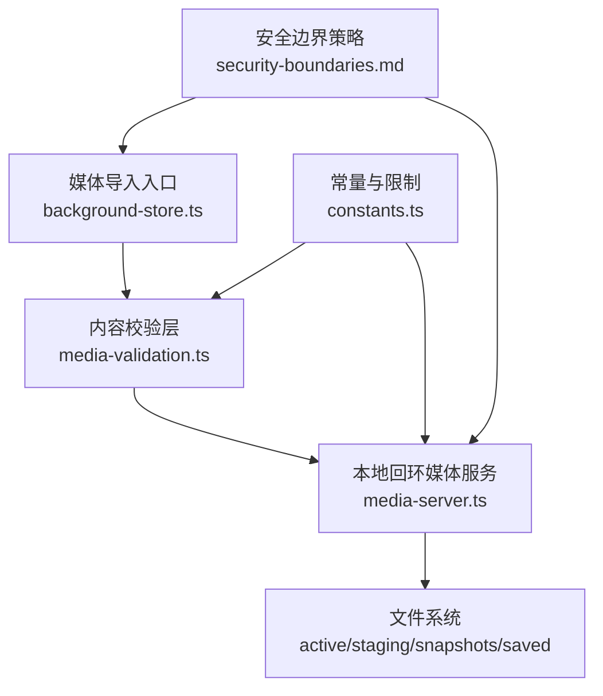
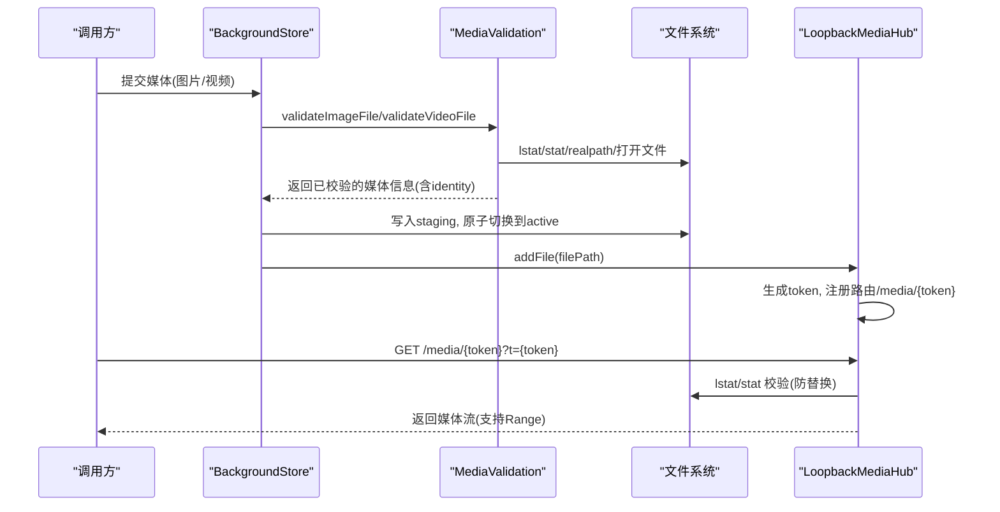
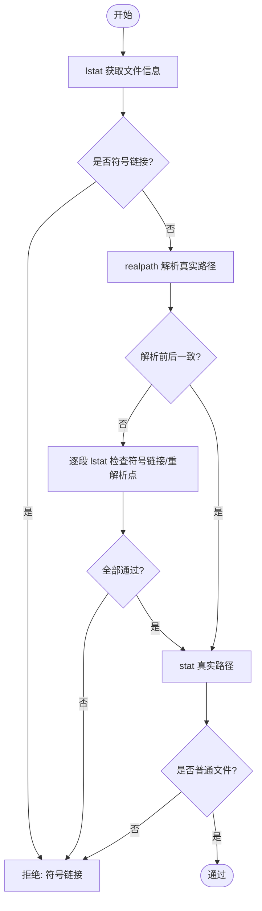
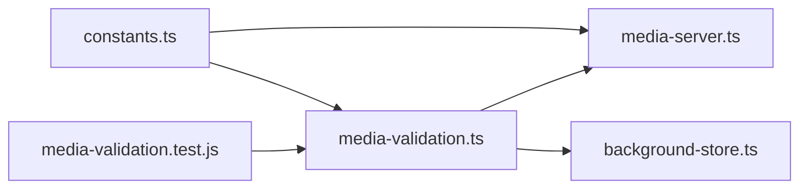

# 文件安全机制

<cite>
**本文引用的文件**
- [packages/core/src/media-validation.ts](file://packages/core/src/media-validation.ts)
- [packages/core/src/media-server.ts](file://packages/core/src/media-server.ts)
- [packages/core/src/constants.ts](file://packages/core/src/constants.ts)
- [packages/core/src/background-store.ts](file://packages/core/src/background-store.ts)
- [docs/security-boundaries.md](file://docs/security-boundaries.md)
- [packages/core/test/media-validation.test.js](file://packages/core/test/media-validation.test.js)
</cite>

## 目录
1. [简介](#简介)
2. [项目结构](#项目结构)
3. [核心组件](#核心组件)
4. [架构总览](#架构总览)
5. [详细组件分析](#详细组件分析)
6. [依赖关系分析](#依赖关系分析)
7. [性能考量](#性能考量)
8. [故障排查指南](#故障排查指南)
9. [结论](#结论)
10. [附录](#附录)

## 简介
本文件面向媒体文件的安全机制，覆盖路径验证、文件名安全校验、权限与访问控制、跨平台（尤其是 Windows）特殊处理、安全边界设计与防御策略、安全配置建议、常见问题解决方案以及安全审计与日志记录最佳实践。目标是帮助读者理解并正确使用本项目中的媒体导入、存储与本地回环服务，确保恶意或异常输入不会导致越权访问、路径穿越、符号链接劫持或重解析点攻击。

## 项目结构
围绕媒体安全的核心代码集中在 packages/core 中：
- 媒体内容与安全校验：media-validation.ts
- 本地回环媒体服务器：media-server.ts
- 常量与限制：constants.ts
- 背景资源存储与原子提交：background-store.ts
- 安全边界策略文档：docs/security-boundies.md
- 相关测试用例：test/media-validation.test.js

图表来源
- [packages/core/src/background-store.ts:295-333](file://packages/core/src/background-store.ts#L295-L333)
- [packages/core/src/media-validation.ts:92-123](file://packages/core/src/media-validation.ts#L92-L123)
- [packages/core/src/media-server.ts:148-167](file://packages/core/src/media-server.ts#L148-L167)
- [packages/core/src/constants.ts:1-62](file://packages/core/src/constants.ts#L1-L62)
- [docs/security-boundaries.md:1-51](file://docs/security-boundaries.md#L1-L51)

章节来源
- [packages/core/src/media-validation.ts:1-358](file://packages/core/src/media-validation.ts#L1-L358)
- [packages/core/src/media-server.ts:1-732](file://packages/core/src/media-server.ts#L1-L732)
- [packages/core/src/constants.ts:1-62](file://packages/core/src/constants.ts#L1-L62)
- [packages/core/src/background-store.ts:295-333](file://packages/core/src/background-store.ts#L295-L333)
- [docs/security-boundaries.md:1-51](file://docs/security-boundaries.md#L1-L51)

## 核心组件
- 媒体校验器（media-validation.ts）
  - 负责扩展名白名单、文件大小上限、容器签名嗅探（JPEG/PNG/WEBP/AVIF/MP4）、符号链接与重解析点检测、常规文件确认、元数据与内容指纹计算、控制字符与保留设备名检查等。
- 本地回环媒体服务（media-server.ts）
  - 提供仅绑定 127.0.0.1 的 HTTP 服务，基于不可猜测的路径令牌和请求头/查询参数双重鉴权；对每个请求进行来源校验、范围读取、内容变更检测与拒绝策略。
- 常量与限制（constants.ts）
  - 定义最大图片/视频字节数、允许的扩展名、媒体令牌头名称、默认可信来源前缀、目录与清单命名约定等。
- 背景存储（background-store.ts）
  - 管理 active/staging/snapshots/saved 目录，执行原子提交、写入锁、路径包含性检查、保存主题容量限制等。

章节来源
- [packages/core/src/media-validation.ts:53-123](file://packages/core/src/media-validation.ts#L53-L123)
- [packages/core/src/media-server.ts:148-167](file://packages/core/src/media-server.ts#L148-L167)
- [packages/core/src/constants.ts:1-62](file://packages/core/src/constants.ts#L1-L62)
- [packages/core/src/background-store.ts:295-333](file://packages/core/src/background-store.ts#L295-L333)

## 架构总览
媒体安全的关键流程如下：
- 导入阶段：对用户提供的媒体文件进行严格校验（扩展名、大小、容器签名、符号链接/重解析点、控制字符、保留设备名），通过后拷贝到 staging 目录并生成唯一身份标识。
- 提交阶段：通过原子目录交换将 staging 切换为 active，同时维护快照以便回滚。
- 服务阶段：通过本地回环媒体服务以“路径令牌 + 请求头/查询令牌”的方式暴露媒体，每次请求重新 stat/lstat 并校验元数据/内容指纹，防止运行时替换。

图表来源
- [packages/core/src/background-store.ts:295-333](file://packages/core/src/background-store.ts#L295-L333)
- [packages/core/src/media-validation.ts:223-292](file://packages/core/src/media-validation.ts#L223-L292)
- [packages/core/src/media-server.ts:220-301](file://packages/core/src/media-server.ts#L220-L301)
- [packages/core/src/media-server.ts:406-590](file://packages/core/src/media-server.ts#L406-L590)

## 详细组件分析

### 路径验证系统
- 符号链接检测
  - 使用 lstat 判断是否为符号链接，直接拒绝。
  - 使用 realpath 对比解析前后路径，若不一致则逐段 lstat 检查是否存在符号链接或重解析点，避免被目录联结或符号链接绕过。
- 重解析点防护
  - Windows 下目录联结等非普通文件的 reparse point 会被拒绝；当 realpath 展开路径时，会进一步逐段检查，确保只有真实文件被接受。
- 目录遍历攻击防护
  - 所有传入的媒体路径在内部统一 resolve 后再操作；服务端只暴露随机 token 路由，不直接暴露真实路径。
  - 文件名安全校验强制 basename-only，禁止包含路径分隔符、控制字符、非法字符及保留设备名。

图表来源
- [packages/core/src/media-validation.ts:92-123](file://packages/core/src/media-validation.ts#L92-L123)

章节来源
- [packages/core/src/media-validation.ts:62-123](file://packages/core/src/media-validation.ts#L62-L123)
- [packages/core/test/media-validation.test.js:94-114](file://packages/core/test/media-validation.test.js#L94-L114)

### 文件名安全验证
- 保留设备名称检查
  - 拒绝 Windows 保留设备名（如 con、prn、aux、nul、com[1-9]、lpt[1-9]）。
- 非法字符过滤
  - 拒绝包含路径分隔符、空字符、Windows 非法字符（<>:"|?*）以及以点或空格结尾的名称。
- 控制字符防护
  - 拒绝 ASCII < 32 或等于 127 的控制字符。
- 长度与格式
  - 限制名称长度，且必须为 basename-only，不允许路径片段。

章节来源
- [packages/core/src/media-validation.ts:330-357](file://packages/core/src/media-validation.ts#L330-L357)
- [packages/core/test/media-validation.test.js:149-158](file://packages/core/test/media-validation.test.js#L149-L158)

### 文件权限检查与访问控制策略
- 最小暴露面
  - 媒体服务仅监听 127.0.0.1，禁止局域网绑定。
- 双因子鉴权
  - 路径令牌（不可猜测的随机字符串）+ 请求头或查询参数中的相同令牌，二者之一匹配才允许访问。
- 来源校验
  - 校验 Origin，仅允许精确匹配或 app:// 前缀的可信来源。
- 运行时再验证
  - 每次请求重新 lstat/stat，检查文件类型、大小、元数据变化；必要时重新计算完整哈希，防止运行时替换。
- 响应头安全
  - 设置 X-Content-Type-Options: nosniff、Cache-Control: no-store，禁用缓存与类型嗅探。

章节来源
- [packages/core/src/media-server.ts:148-167](file://packages/core/src/media-server.ts#L148-L167)
- [packages/core/src/media-server.ts:406-590](file://packages/core/src/media-server.ts#L406-L590)
- [docs/security-boundaries.md:1-51](file://docs/security-boundaries.md#L1-L51)

### 跨平台安全考虑（Windows 特殊处理）
- 重解析点与目录联结
  - 在 Windows 上，目录联结属于 reparse point，非普通文件将被拒绝；当 realpath 展开路径时，逐段检查以确保不存在符号链接或联结。
- 路径大小写归一化
  - 比较路径时对 Windows 进行小写归一化，避免大小写差异导致的绕过。
- 脚本与安装器中的符号链接
  - 在插件安装等场景中，Windows 创建 junction 类型的符号链接，需确保目标路径受控且不被外部篡改。

章节来源
- [packages/core/src/media-validation.ts:106-117](file://packages/core/src/media-validation.ts#L106-L117)
- [integrations/deepseek-harness/cli.js:289-326](file://integrations/deepseek-harness/cli.js#L289-L326)

### 安全边界设计与防御策略
- 信任区域划分
  - 数据根目录为“自有”，导入媒体视为“不受信任输入”，经校验后复制进数据根；媒体服务为“受保护”，需要令牌与来源校验；宿主渲染器视为“不受信任对端”。
- 硬规则
  - 不修改官方主机安装、app.asar、签名或供应商配置；CDP 与媒体服务仅限回环；不暴露任意文件系统；内容在服务/应用前进行强校验；网络读取有长度限制；失败即关闭；用户媒体保持本地；注入 DOM 不得捕获宿主事件。
- 令牌与头部
  - 媒体令牌具备高熵，单路由能力，不在日志中记录完整令牌。

章节来源
- [docs/security-boundaries.md:1-51](file://docs/security-boundaries.md#L1-L51)

### 媒体内容校验与指纹
- 扩展名白名单
  - 图片：jpg/jpeg/png/webp/avif；视频：mp4。
- 大小限制
  - 图片与视频分别有最大字节限制，防止超大文件导致资源耗尽。
- 容器签名嗅探
  - JPEG/PNG/WebP/AVIF/MP4 均通过魔数或 ftyp box 校验，拒绝伪装文件。
- 指纹与变更检测
  - 校验阶段读取文件头并计算哈希；服务阶段根据 fast/full 模式决定是否全量哈希；若元数据或内容变化，立即拒绝。

章节来源
- [packages/core/src/media-validation.ts:12-51](file://packages/core/src/media-validation.ts#L12-L51)
- [packages/core/src/media-validation.ts:125-190](file://packages/core/src/media-validation.ts#L125-L190)
- [packages/core/src/media-validation.ts:192-292](file://packages/core/src/media-validation.ts#L192-L292)
- [packages/core/src/media-server.ts:488-522](file://packages/core/src/media-server.ts#L488-L522)
- [packages/core/src/constants.ts:1-62](file://packages/core/src/constants.ts#L1-L62)

### 背景存储与原子提交
- 目录隔离
  - active/staging/snapshots/saved 分离，确保当前生效与待生效互不影响。
- 写入锁
  - 使用 store.lock 保证并发写入安全，避免交错提交导致状态不一致。
- 容量限制
  - 保存主题数量与总字节数有限制，防止磁盘耗尽。
- 路径包含性检查
  - 确保生成的保存目录位于 savedDir 内，防止路径逃逸。

章节来源
- [packages/core/src/background-store.ts:295-333](file://packages/core/src/background-store.ts#L295-L333)
- [packages/core/src/background-store.ts:821-854](file://packages/core/src/background-store.ts#L821-L854)

## 依赖关系分析
- media-validation.ts 依赖 constants.ts 的扩展名与大小限制。
- media-server.ts 依赖 media-validation.ts 完成内容校验，依赖 constants.ts 的令牌头与可信来源。
- background-store.ts 依赖 media-validation.ts 进行导入校验，并在提交时使用写入锁与目录交换实现原子性。
- 测试用例验证了符号链接拒绝、重解析点拒绝、大小限制、魔数校验、文件名安全等关键行为。

图表来源
- [packages/core/src/constants.ts:1-62](file://packages/core/src/constants.ts#L1-L62)
- [packages/core/src/media-validation.ts:1-358](file://packages/core/src/media-validation.ts#L1-L358)
- [packages/core/src/media-server.ts:1-732](file://packages/core/src/media-server.ts#L1-L732)
- [packages/core/src/background-store.ts:295-333](file://packages/core/src/background-store.ts#L295-L333)
- [packages/core/test/media-validation.test.js:71-177](file://packages/core/test/media-validation.test.js#L71-L177)

章节来源
- [packages/core/src/media-validation.ts:1-358](file://packages/core/src/media-validation.ts#L1-L358)
- [packages/core/src/media-server.ts:1-732](file://packages/core/src/media-server.ts#L1-L732)
- [packages/core/src/background-store.ts:295-333](file://packages/core/src/background-store.ts#L295-L333)
- [packages/core/test/media-validation.test.js:71-177](file://packages/core/test/media-validation.test.js#L71-L177)

## 性能考量
- 快速指纹模式
  - 本地引用导入采用 fast 模式，仅对文件头与元数据计算指纹，避免对多 GB 文件全量扫描。
- 预热读取
  - 对大视频文件预热首尾字节范围，降低首次播放时的冷启动延迟与杀毒软件扫描阻塞。
- 流式传输与 Range 支持
  - 媒体服务使用流式管道与 Range 请求，减少内存占用并提升回放体验。
- 连接与超时控制
  - 设置请求超时、头部超时、每 socket 最大请求数，防止资源泄露与慢客户端攻击。

章节来源
- [packages/core/src/media-validation.ts:149-190](file://packages/core/src/media-validation.ts#L149-L190)
- [packages/core/src/media-validation.ts:294-328](file://packages/core/src/media-validation.ts#L294-L328)
- [packages/core/src/media-server.ts:177-218](file://packages/core/src/media-server.ts#L177-L218)
- [packages/core/src/media-server.ts:365-404](file://packages/core/src/media-server.ts#L365-L404)

## 故障排查指南
- 常见错误与原因
  - “媒体文件不是符号链接”：路径指向符号链接或被重解析点拦截。
  - “媒体文件必须是普通文件”：路径指向目录或其他非文件类型。
  - “媒体文件在验证过程中发生变化”：校验期间文件被替换或元数据改变。
  - “媒体文件内容在分派后发生变化”：服务阶段检测到内容或元数据变化，拒绝继续。
  - “不支持的媒体扩展名”：扩展名不在白名单。
  - “视频背景必须使用 MP4”：视频文件扩展名不为 .mp4。
  - “名称包含非法路径字符/控制字符/保留设备名”：文件名安全检查失败。
- 定位步骤
  - 检查导入路径是否经过 resolve，确认无相对路径逃逸。
  - 检查操作系统符号链接/联结情况，确保路径不包含任何中间符号链接。
  - 检查文件大小是否超过限制，容器签名是否符合预期。
  - 检查媒体服务请求是否携带正确的令牌与可信来源。
  - 查看服务阶段的 stat/lstat 结果与哈希比对，确认未被替换。
- 参考测试
  - 符号链接与重解析点拒绝、大小限制、魔数校验、文件名安全等用例可作为复现与验证依据。

章节来源
- [packages/core/src/media-validation.ts:92-123](file://packages/core/src/media-validation.ts#L92-L123)
- [packages/core/src/media-validation.ts:125-190](file://packages/core/src/media-validation.ts#L125-L190)
- [packages/core/src/media-server.ts:488-522](file://packages/core/src/media-server.ts#L488-L522)
- [packages/core/test/media-validation.test.js:71-177](file://packages/core/test/media-validation.test.js#L71-L177)

## 结论
本项目通过严格的媒体内容校验、路径与文件名安全策略、本地回环服务的强鉴权与运行时再验证，构建了端到端的媒体安全机制。结合原子提交、写入锁与容量限制，确保了后台资源管理的可靠性与安全性。针对 Windows 的重解析点与符号链接进行了专门防护，并通过可信来源与令牌机制限制了媒体暴露面。遵循安全边界文档的硬规则，可进一步降低风险并提高系统的整体健壮性。

## 附录

### 安全配置建议
- 始终启用 full 校验模式用于外部导入，fast 模式仅用于本地可信引用。
- 限制媒体服务端口仅绑定 127.0.0.1，并确保防火墙未开放该端口。
- 配置可信来源前缀为 app://*，避免其他来源访问媒体服务。
- 定期清理 staging 与 snapshots，避免磁盘空间耗尽。
- 监控媒体服务日志，关注 403/404/416 等异常响应。

### 安全审计与日志记录最佳实践
- 记录媒体导入结果（成功/失败、原因、文件大小、扩展名、指纹摘要的前几位）。
- 记录媒体服务请求（来源、令牌匹配结果、Range 请求、拒绝原因）。
- 对敏感信息（如完整令牌）脱敏或截断输出。
- 对异常路径与文件名进行告警，便于发现潜在攻击尝试。
- 对原子提交失败与回滚进行审计，确保一致性。