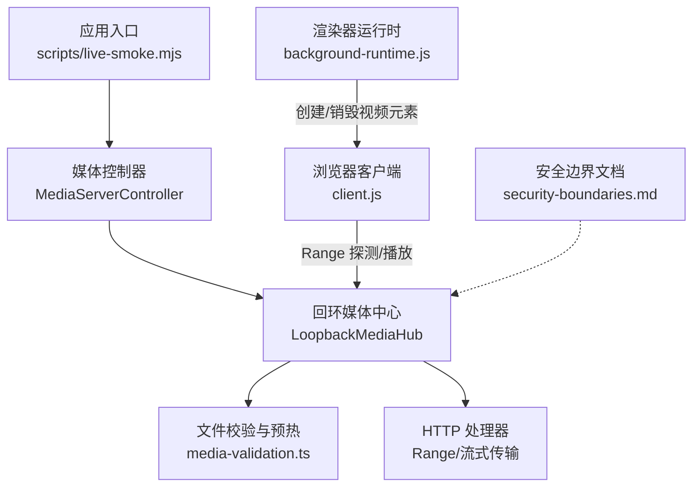
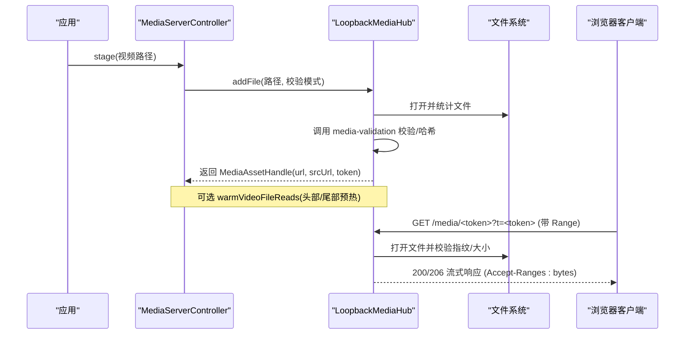
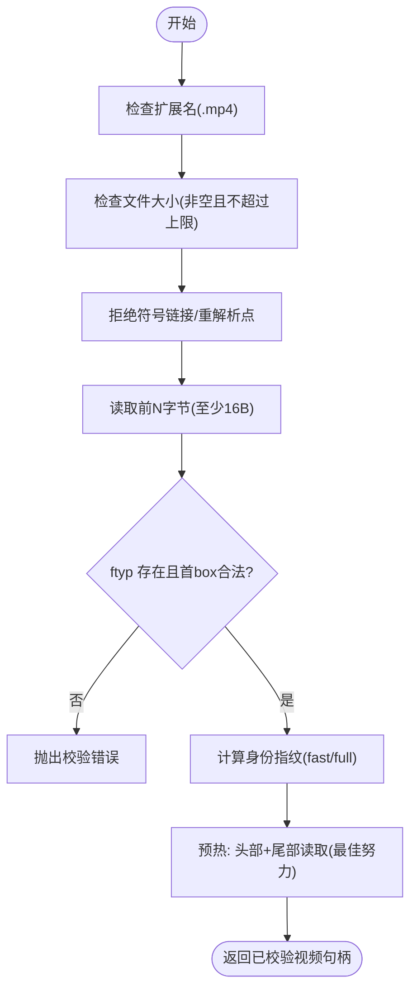
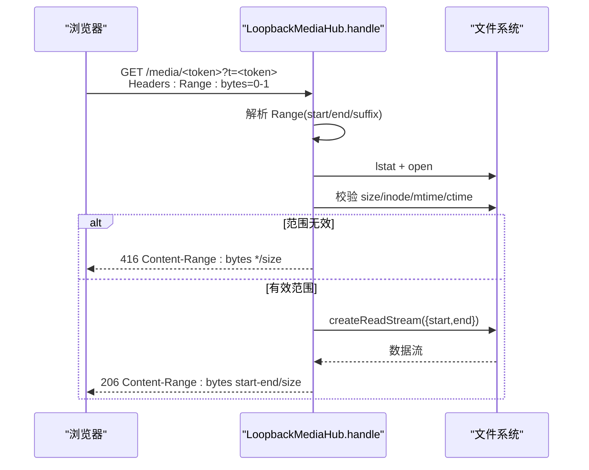
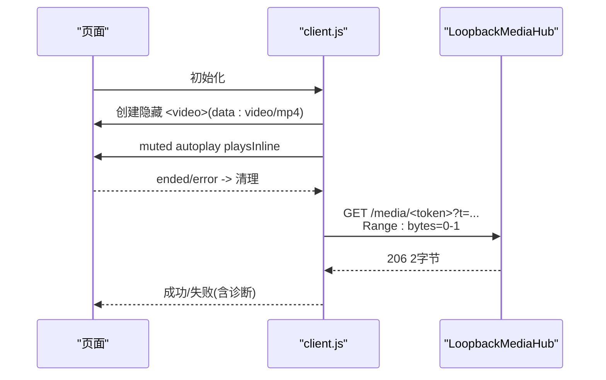
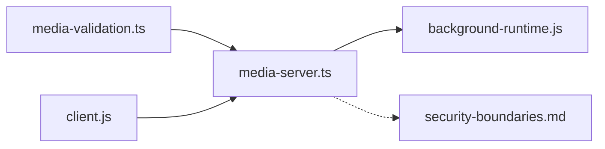

# 视频文件处理

<cite>
**本文引用的文件**
- [packages/core/src/media-validation.ts](file://packages/core/src/media-validation.ts)
- [packages/core/src/media-server.ts](file://packages/core/src/media-server.ts)
- [integrations/deepseek-harness/client.js](file://integrations/deepseek-harness/client.js)
- [packages/adapter-codex/src/renderer/background-runtime.js](file://packages/adapter-codex/src/renderer/background-runtime.js)
- [docs/security-boundaries.md](file://docs/security-boundaries.md)
- [packages/core/test/media-server.test.js](file://packages/core/test/media-server.test.js)
- [packages/core/test/media-validation.test.js](file://packages/core/test/media-validation.test.js)
- [scripts/live-smoke.mjs](file://scripts/live-smoke.mjs)
</cite>

## 目录
1. [简介](#简介)
2. [项目结构](#项目结构)
3. [核心组件](#核心组件)
4. [架构总览](#架构总览)
5. [详细组件分析](#详细组件分析)
6. [依赖关系分析](#依赖关系分析)
7. [性能考虑](#性能考虑)
8. [故障排除指南](#故障排除指南)
9. [结论](#结论)
10. [附录](#附录)

## 简介
本文件系统面向“背景视频”场景，提供从导入、校验、预热、存储到本地安全服务与前端播放的完整链路。重点覆盖：
- MP4 容器检测与文件格式验证
- 头部与尾部预读（warmup）策略，降低冷启动卡顿
- Range 请求支持（字节范围解析与流式传输）
- 元数据提取与安全哈希
- 本地回环媒体服务器的访问控制与跨域策略
- 浏览器端兼容性、错误处理与诊断

## 项目结构
围绕视频处理的代码主要分布在以下位置：
- 校验与预热：packages/core/src/media-validation.ts
- 本地媒体服务与 Range 支持：packages/core/src/media-server.ts
- 浏览器端媒体栈预热与 Range 探测：integrations/deepseek-harness/client.js
- 渲染器侧视频生命周期管理：packages/adapter-codex/src/renderer/background-runtime.js
- 安全边界与约束：docs/security-boundaries.md
- 测试与端到端脚本：packages/core/test/*.test.js, scripts/live-smoke.mjs

图表来源
- [packages/core/src/media-server.ts:148-590](file://packages/core/src/media-server.ts#L148-L590)
- [packages/core/src/media-validation.ts:261-328](file://packages/core/src/media-validation.ts#L261-L328)
- [integrations/deepseek-harness/client.js:583-649](file://integrations/deepseek-harness/client.js#L583-L649)
- [packages/adapter-codex/src/renderer/background-runtime.js:129-1816](file://packages/adapter-codex/src/renderer/background-runtime.js#L129-L1816)
- [docs/security-boundaries.md:1-27](file://docs/security-boundaries.md#L1-L27)

章节来源
- [scripts/live-smoke.mjs:294-323](file://scripts/live-smoke.mjs#L294-L323)

## 核心组件
- 媒体校验与预热模块
  - 负责扩展名检查、文件大小限制、符号链接/重解析点拒绝、MP4 容器签名检测、SHA-256 身份标识、以及头部/尾部预热读取。
- 本地媒体服务（回环 HTTP）
  - 基于 Node http.Server，绑定 127.0.0.1；为每个资产生成不可猜测的路径令牌；支持 GET/HEAD/OPTIONS；实现 Range 请求与流式传输；严格的同源/私有网络访问控制与令牌鉴权。
- 浏览器端媒体栈预热与探测
  - 页面初始化时以最小代价预热媒体栈；通过 Range 探针验证远端可访问性与 CORS；记录媒体事件用于诊断。
- 渲染器侧视频生命周期
  - 负责创建/挂载/销毁 <video> 元素，处理 blob/dataUrl/server 三种模式，兼容降级与重试，维护静音与可见性策略。

章节来源
- [packages/core/src/media-validation.ts:12-90](file://packages/core/src/media-validation.ts#L12-L90)
- [packages/core/src/media-validation.ts:261-328](file://packages/core/src/media-validation.ts#L261-L328)
- [packages/core/src/media-server.ts:148-590](file://packages/core/src/media-server.ts#L148-L590)
- [integrations/deepseek-harness/client.js:97-185](file://integrations/deepseek-harness/client.js#L97-L185)
- [integrations/deepseek-harness/client.js:583-649](file://integrations/deepseek-harness/client.js#L583-L649)
- [packages/adapter-codex/src/renderer/background-runtime.js:129-1816](file://packages/adapter-codex/src/renderer/background-runtime.js#L129-L1816)

## 架构总览
系统采用“服务端校验 + 本地安全服务 + 浏览器端轻量预热”的分层设计：
- 导入阶段：对 MP4 进行严格校验并计算身份指纹；必要时执行头部/尾部预热，规避首次读取时的系统级阻塞（如杀毒扫描）。
- 服务阶段：将已校验的视频暴露为仅本机可达的 /media/<token> 路由；所有请求需携带路径令牌或查询参数令牌，且受 Origin 白名单限制。
- 播放阶段：浏览器端先做 Range 探针，再按需加载；渲染器侧负责元素生命周期与错误恢复。

图表来源
- [packages/core/src/media-server.ts:220-301](file://packages/core/src/media-server.ts#L220-L301)
- [packages/core/src/media-server.ts:406-590](file://packages/core/src/media-server.ts#L406-L590)
- [packages/core/src/media-validation.ts:261-328](file://packages/core/src/media-validation.ts#L261-L328)

## 详细组件分析

### 组件A：MP4 容器检测与文件校验
- 扩展名与大小限制：仅接受 .mp4，空文件与超大文件直接拒绝。
- 路径安全：拒绝符号链接与重解析点；Windows 下对 8.3 别名进行段级检查。
- 容器签名检测：读取前 16 字节，校验首 box 长度与 ftyp 标记，确认是 ISO-BMFF 容器。
- 身份指纹：fast 模式下使用设备号、inode、大小、时间戳与头部内容组合哈希；full 模式对全文件哈希。
- 预热读取：在 staging 阶段异步读取头部（约 2MB）与尾部（约 4MB），避免首次播放时因系统扫描导致的卡顿。

图表来源
- [packages/core/src/media-validation.ts:78-90](file://packages/core/src/media-validation.ts#L78-L90)
- [packages/core/src/media-validation.ts:92-123](file://packages/core/src/media-validation.ts#L92-L123)
- [packages/core/src/media-validation.ts:125-190](file://packages/core/src/media-validation.ts#L125-L190)
- [packages/core/src/media-validation.ts:261-328](file://packages/core/src/media-validation.ts#L261-L328)

章节来源
- [packages/core/src/media-validation.ts:78-90](file://packages/core/src/media-validation.ts#L78-L90)
- [packages/core/src/media-validation.ts:92-123](file://packages/core/src/media-validation.ts#L92-L123)
- [packages/core/src/media-validation.ts:125-190](file://packages/core/src/media-validation.ts#L125-L190)
- [packages/core/src/media-validation.ts:261-328](file://packages/core/src/media-validation.ts#L261-L328)

### 组件B：Range 请求支持与流式传输
- 范围解析：支持 bytes=start-end 与 bytes=-suffix；非法或不满足范围返回 416。
- 流式管道：使用 createReadStream + pipeline 将文件片段流式写入响应；自动关闭 FileHandle，支持取消与超时。
- 安全校验：每次请求重新 lstat/open，校验 inode/mtime/size 与最大尺寸；fast 模式下若指纹变化直接拒绝。
- CORS 与私有网络：允许 Range、自定义令牌头；开启 Private Network Access 以支持 app:// → 127.0.0.1。

图表来源
- [packages/core/src/media-server.ts:66-94](file://packages/core/src/media-server.ts#L66-L94)
- [packages/core/src/media-server.ts:365-404](file://packages/core/src/media-server.ts#L365-L404)
- [packages/core/src/media-server.ts:488-590](file://packages/core/src/media-server.ts#L488-L590)

章节来源
- [packages/core/src/media-server.ts:66-94](file://packages/core/src/media-server.ts#L66-L94)
- [packages/core/src/media-server.ts:365-404](file://packages/core/src/media-server.ts#L365-L404)
- [packages/core/src/media-server.ts:488-590](file://packages/core/src/media-server.ts#L488-L590)

### 组件C：浏览器端媒体栈预热与 Range 探测
- 媒体栈预热：页面初始化时创建一个极小的隐藏 <video>，以 data:video/mp4;base64 作为源，触发解码/GPU/音频栈初始化，提升首次真实视频播放速度。
- Range 探针：以 Range: bytes=0-1 探测媒体可达性与 CORS；失败时给出包含页面/媒体 Origin 的诊断信息。
- 事件诊断：收集 loadstart/loadedmetadata/canplay 等事件，辅助定位问题。

图表来源
- [integrations/deepseek-harness/client.js:97-185](file://integrations/deepseek-harness/client.js#L97-L185)
- [integrations/deepseek-harness/client.js:583-649](file://integrations/deepseek-harness/client.js#L583-L649)

章节来源
- [integrations/deepseek-harness/client.js:97-185](file://integrations/deepseek-harness/client.js#L97-L185)
- [integrations/deepseek-harness/client.js:583-649](file://integrations/deepseek-harness/client.js#L583-L649)

### 组件D：渲染器侧视频生命周期与兼容性
- 多模式支持：blob、dataUrl、server（本地回环 URL）三种来源；优先 server 模式以获得 Range 能力。
- 元素管理：创建/挂载/移除 <video>，设置 poster、静音、playsInline、禁用画中画等属性，确保后台渲染不干扰前台交互。
- 错误与重试：捕获瞬时错误并尝试重试；当持有旧实例时进行资源释放与监听清理，避免内存泄漏与闪烁。
- 状态上报：向宿主上报 videoReady/videoFailed/hasPlayableSrc 等状态，便于上层决策。

章节来源
- [packages/adapter-codex/src/renderer/background-runtime.js:129-1816](file://packages/adapter-codex/src/renderer/background-runtime.js#L129-L1816)

### 组件E：存储布局与访问控制
- 存储布局：活跃与暂存目录位于数据根目录下；导入文件被复制进入，拒绝符号链接与重解析点；命名规范化与保留字过滤。
- 访问控制：
  - 仅本机绑定（127.0.0.1），禁止局域网暴露。
  - 每文件随机路径令牌；必须同时满足路径令牌与 Header/Query 令牌之一。
  - Origin 白名单匹配（精确或 app://* 前缀）；未授权返回 403。
  - 启用 Private Network Access 以支持 app:// → 127.0.0.1。
- 变更防护：请求时对文件 inode/mtime/size 再次校验；fast 模式下任何指纹变化即拒绝。

章节来源
- [docs/security-boundaries.md:1-27](file://docs/security-boundaries.md#L1-L27)
- [packages/core/src/media-server.ts:117-128](file://packages/core/src/media-server.ts#L117-L128)
- [packages/core/src/media-server.ts:460-486](file://packages/core/src/media-server.ts#L460-L486)
- [packages/core/src/media-server.ts:488-522](file://packages/core/src/media-server.ts#L488-L522)

## 依赖关系分析
- media-server.ts 依赖 media-validation.ts 完成输入校验与哈希；两者共同构成“安全接入面”。
- client.js 依赖 LoopbackMediaHub 提供的 /media/<token> 接口，并通过 Range 探测可用性。
- background-runtime.js 依赖 client.js 提供的 URL 与状态，管理 DOM 元素生命周期。
- security-boundaries.md 定义了整体约束，驱动上述组件的实现策略。

图表来源
- [packages/core/src/media-server.ts:18-22](file://packages/core/src/media-server.ts#L18-L22)
- [packages/core/src/media-server.ts:148-590](file://packages/core/src/media-server.ts#L148-L590)
- [integrations/deepseek-harness/client.js:583-649](file://integrations/deepseek-harness/client.js#L583-L649)
- [packages/adapter-codex/src/renderer/background-runtime.js:129-1816](file://packages/adapter-codex/src/renderer/background-runtime.js#L129-L1816)
- [docs/security-boundaries.md:1-27](file://docs/security-boundaries.md#L1-L27)

## 性能考虑
- 预热策略
  - 服务端：在 staging 阶段读取头部与尾部，减少首次播放时的系统级 I/O 停顿（如杀毒扫描）。
  - 浏览器端：初始化时以极小 data:video/mp4 预热解码/GPU/音频栈，缩短首帧延迟。
- Range 与流式传输
  - 使用 Accept-Ranges: bytes 与 206 分段响应，避免整片下载；结合 HEAD 探测与最小范围请求快速验证连通性。
- 资源复用与缓存
  - 相同文件复用同一资产句柄；服务器端禁用缓存（no-store）保证一致性；客户端根据需求选择 no-store 以避免陈旧数据。
- 连接与超时
  - 合理设置 headersTimeout、keepAliveTimeout、maxRequestsPerSocket；传输中使用 AbortController 及时释放资源。

[本节为通用指导，无需特定文件引用]

## 故障排除指南
- 常见错误与定位
  - 非 MP4 或容器签名不合法：检查文件是否以 ftyp 开头且首 box 长度合法。
  - 416 Range 不满足：确认 Range 格式与文件大小；服务端会返回 Content-Range: bytes */size。
  - 403 跨域/令牌错误：确认 Origin 在白名单内，且请求携带正确的路径令牌与 Header/Query 令牌。
  - 404 资源不存在：检查 token 是否过期或被移除；确认服务仍在运行。
  - 首次播放卡顿：确认已执行服务端预热与浏览器端媒体栈预热。
- 诊断手段
  - 使用 Range: bytes=0-1 探针验证可达性与 CORS。
  - 收集媒体事件（loadstart/loadedmetadata/canplay 等）定位加载阶段。
  - 检查服务端日志中的指纹变更与大小超限错误。
- 修复建议
  - 修正 MP4 编码与封装（确保 fast-start 或至少头部包含必要信息）。
  - 调整可信 Origin 列表，确保 app://* 前缀生效。
  - 增大或调整超时阈值，避免在网络抖动时误判。

章节来源
- [packages/core/test/media-server.test.js:33-113](file://packages/core/test/media-server.test.js#L33-L113)
- [packages/core/test/media-validation.test.js:40-74](file://packages/core/test/media-validation.test.js#L40-L74)
- [integrations/deepseek-harness/client.js:583-649](file://integrations/deepseek-harness/client.js#L583-L649)

## 结论
该视频处理系统通过严格的容器校验、安全的本地服务与高效的预热/Range 机制，实现了稳定、低延迟的背景视频播放体验。其设计兼顾了安全性（本地绑定、令牌鉴权、Origin 白名单）、性能（预热、分段流式传输）与可观测性（Range 探针与事件诊断）。在生产环境中，建议结合业务规模调整超时与并发参数，并持续监控 Range 命中率与错误率。

[本节为总结，无需特定文件引用]

## 附录
- 关键流程参考
  - 端到端视频应用流程：[scripts/live-smoke.mjs:294-323](file://scripts/live-smoke.mjs#L294-L323)
  - 媒体服务单元测试（Range/403/416/CORS）：[packages/core/test/media-server.test.js:33-113](file://packages/core/test/media-server.test.js#L33-L113)
  - 容器检测与 AVIF 兼容测试：[packages/core/test/media-validation.test.js:40-74](file://packages/core/test/media-validation.test.js#L40-L74)