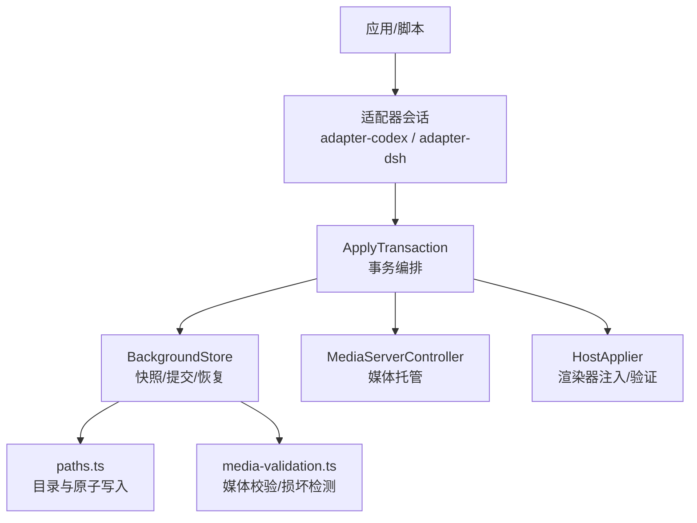
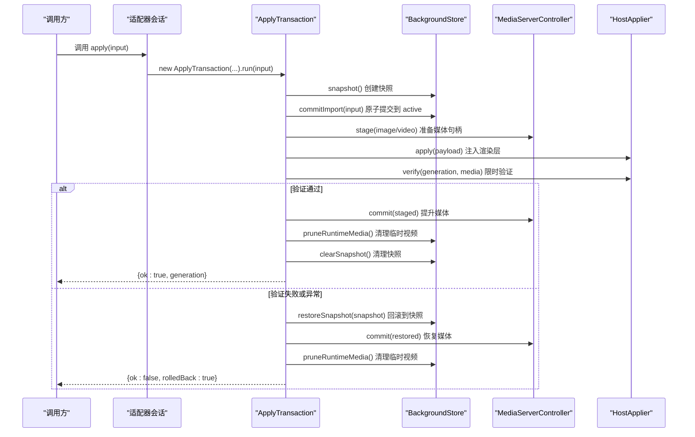
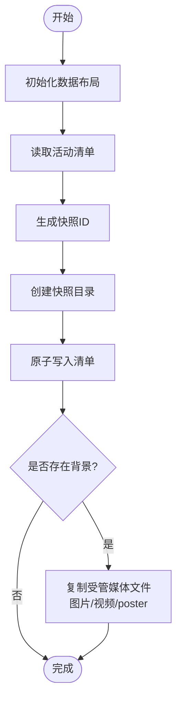
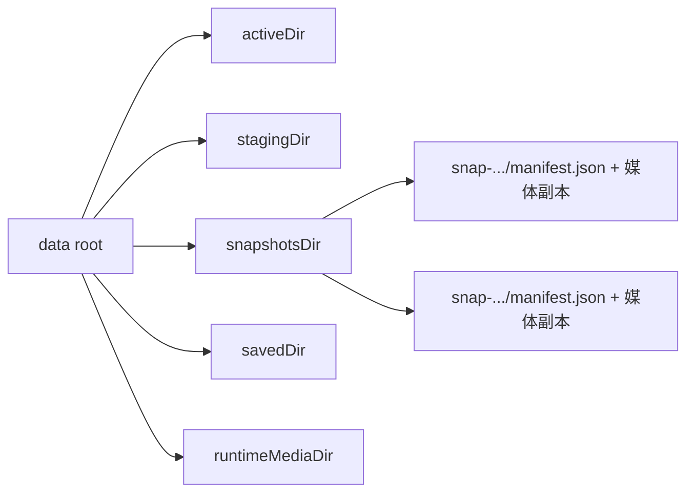
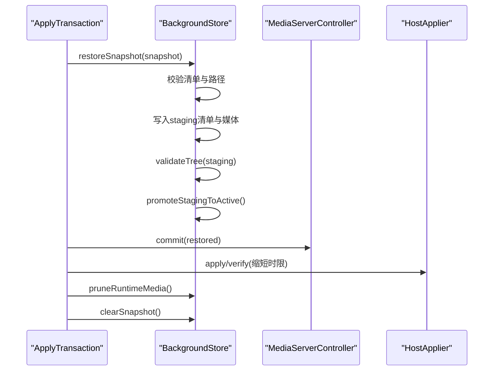
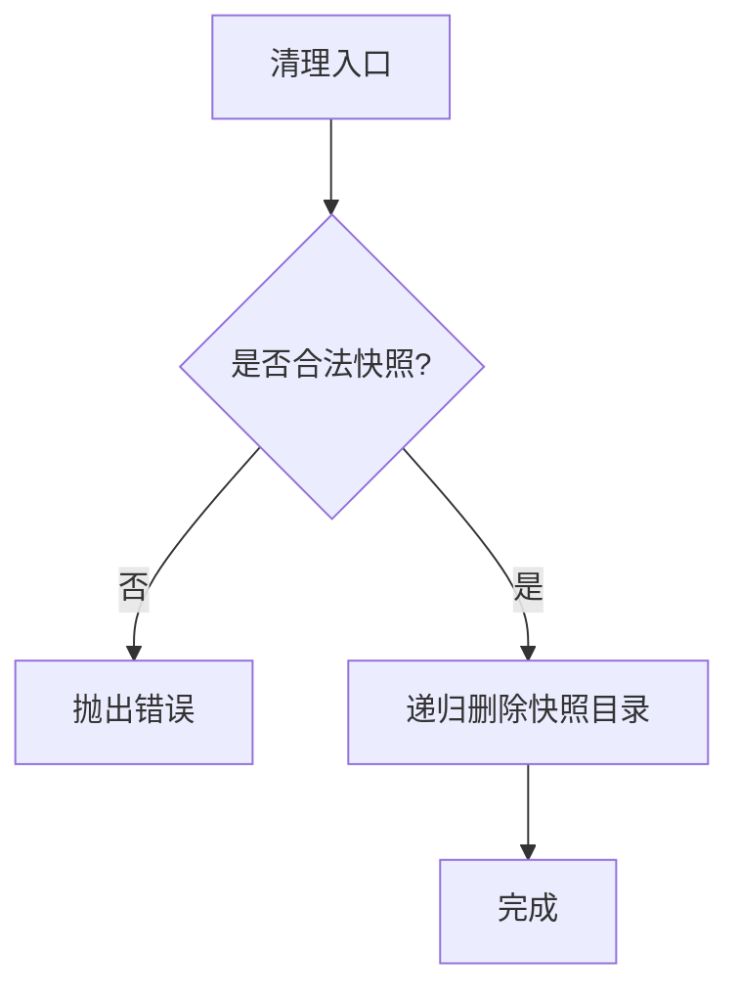
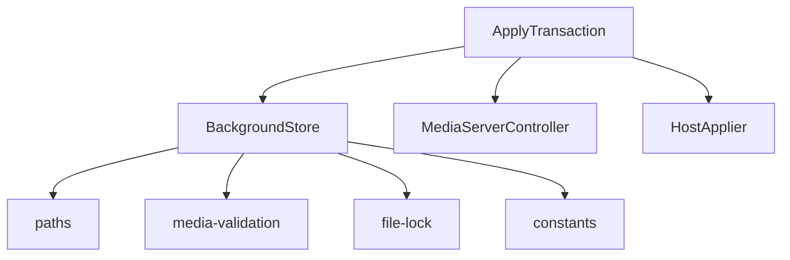

# 快照系统

<cite>
**本文引用的文件**
- [background-store.ts](file://packages/core/src/background-store.ts)
- [apply-transaction.ts](file://packages/core/src/apply-transaction.ts)
- [paths.ts](file://packages/core/src/paths.ts)
- [media-validation.ts](file://packages/core/src/media-validation.ts)
- [error-message.ts](file://packages/core/src/error-message.ts)
- [apply-transaction.md](file://docs/apply-transaction.md)
- [session.ts (adapter-codex)](file://packages/adapter-codex/src/session.ts)
- [session.ts (adapter-dsh)](file://packages/adapter-dsh/src/session.ts)
- [ui-host.mjs](file://integrations/deepseek-harness/ui-host.mjs)
- [agent.mjs](file://integrations/deepseek-harness/agent.mjs)
- [background-store.test.js](file://packages/core/test/background-store.test.js)
</cite>

## 目录
1. [简介](#简介)
2. [项目结构](#项目结构)
3. [核心组件](#核心组件)
4. [架构总览](#架构总览)
5. [详细组件分析](#详细组件分析)
6. [依赖关系分析](#依赖关系分析)
7. [性能考量](#性能考量)
8. [故障排查指南](#故障排查指南)
9. [结论](#结论)
10. [附录](#附录)

## 简介
本文件系统围绕“背景主题”的变更提供强一致、可回滚的快照能力。其目标包括：
- 在应用新主题前创建当前主题的完整快照，确保失败时可快速恢复。
- 通过原子化提交与日志恢复机制保证磁盘状态一致性。
- 将快照与主题版本（generation）关联，支持按代际管理。
- 提供清理策略以控制空间占用，并支持手动删除。
- 暴露清晰的 API 接口，便于上层集成与自动化。

## 项目结构
快照系统位于 core 包中，关键路径如下：
- 数据布局与目录解析：paths.ts
- 存储与快照实现：background-store.ts
- 事务编排与回滚：apply-transaction.ts
- 媒体校验与损坏检测：media-validation.ts
- 错误消息映射：error-message.ts
- 文档与流程说明：docs/apply-transaction.md
- 适配器层调用入口：adapter-codex/session.ts、adapter-dsh/session.ts
- 集成测试与示例：deepseek-harness 中的 ui-host.mjs、agent.mjs
- 行为验证用例：background-store.test.js

**图示来源**
- [apply-transaction.ts:127-294](file://packages/core/src/apply-transaction.ts#L127-L294)
- [background-store.ts:504-524](file://packages/core/src/background-store.ts#L504-L524)
- [paths.ts:39-49](file://packages/core/src/paths.ts#L39-L49)
- [media-validation.ts:223-269](file://packages/core/src/media-validation.ts#L223-L269)

**章节来源**
- [paths.ts:39-49](file://packages/core/src/paths.ts#L39-L49)
- [background-store.ts:504-524](file://packages/core/src/background-store.ts#L504-L524)
- [apply-transaction.ts:127-294](file://packages/core/src/apply-transaction.ts#L127-L294)

## 核心组件
- BackgroundStore：负责数据根目录初始化、活动清单读写、快照创建/清理、导入提交、恢复、运行时视频拷贝与清理等。
- ApplyTransaction：编排“快照 → 提交 → 媒体阶段化 → 主机应用 → 验证 → 最终化/回滚”的完整事务流程。
- paths：定义 data root、activeDir、stagingDir、snapshotsDir、savedDir、runtimeMediaDir 等目录结构，并提供原子写入、安全路径检查等工具。
- media-validation：对图片/视频进行格式、大小、符号链接、内容完整性校验，用于损坏检测与一致性保障。
- error-message：将内部错误信息映射为本地化用户可见提示。

**章节来源**
- [background-store.ts:123-140](file://packages/core/src/background-store.ts#L123-L140)
- [apply-transaction.ts:94-121](file://packages/core/src/apply-transaction.ts#L94-L121)
- [paths.ts:30-49](file://packages/core/src/paths.ts#L30-L49)
- [media-validation.ts:223-269](file://packages/core/src/media-validation.ts#L223-L269)
- [error-message.ts:120-133](file://packages/core/src/error-message.ts#L120-L133)

## 架构总览
快照系统在每次背景变更时采用“先快照、后提交、再验证、失败即回滚”的策略。事务由 ApplyTransaction 驱动，底层由 BackgroundStore 提供原子化的磁盘操作与恢复能力。

**图示来源**
- [apply-transaction.ts:127-294](file://packages/core/src/apply-transaction.ts#L127-L294)
- [background-store.ts:504-524](file://packages/core/src/background-store.ts#L504-L524)
- [background-store.ts:680-716](file://packages/core/src/background-store.ts#L680-L716)

## 详细组件分析

### 快照创建流程与文件复制策略
- 快照 ID 生成：使用“时间戳 + 进程ID + 随机UUID”组合，确保唯一性与可追溯性。
- 快照目录：位于 snapshotsDir 下，名称形如 snap-*，并通过严格的路径白名单与真实路径校验防止逃逸。
- 元数据保存：将当前活动的 manifest 原子写入快照目录的清单文件中。
- 文件复制策略：
  - 若存在背景图片，则复制该图片至快照目录。
  - 若为背景视频，则复制主媒体文件（managedPrimaryFile），同时保留 poster 图片。
  - 所有复制均通过原子写入完成，避免部分写入导致的损坏。

**图示来源**
- [background-store.ts:504-524](file://packages/core/src/background-store.ts#L504-L524)
- [background-store.ts:737-755](file://packages/core/src/background-store.ts#L737-L755)
- [paths.ts:178-187](file://packages/core/src/paths.ts#L178-L187)

**章节来源**
- [background-store.ts:504-524](file://packages/core/src/background-store.ts#L504-L524)
- [background-store.ts:737-755](file://packages/core/src/background-store.ts#L737-L755)
- [paths.ts:178-187](file://packages/core/src/paths.ts#L178-L187)

### 快照目录结构与管理机制
- 目录结构：
  - data root：包含 activeDir、stagingDir、snapshotsDir、savedDir、runtimeMediaDir。
  - snapshotsDir：每个快照一个子目录，命名规则 snap-[A-Za-z0-9._-]。
  - 每个快照目录包含清单文件与受管媒体文件的副本。
- 管理机制：
  - 路径安全：严格限制快照目录必须位于 snapshotsDir 内，且不能是符号链接。
  - 真实路径校验：通过 realpath 再次确认未逃逸。
  - 原子写入：清单与媒体文件均采用原子写入，避免中间态。
  - 并发保护：写锁与文件锁确保多实例互斥。

**图示来源**
- [paths.ts:39-49](file://packages/core/src/paths.ts#L39-L49)
- [background-store.ts:531-558](file://packages/core/src/background-store.ts#L531-L558)

**章节来源**
- [paths.ts:39-49](file://packages/core/src/paths.ts#L39-L49)
- [background-store.ts:531-558](file://packages/core/src/background-store.ts#L531-L558)

### 快照恢复过程：验证、回滚与一致性保证
- 恢复入口：restoreSnapshot(snapshot)。
- 恢复步骤：
  - 校验快照路径合法性。
  - 读取并校验快照清单。
  - 生成新的 generation（基于当前活动 generation+1），避免与失败尝试混淆。
  - 将快照清单与媒体文件复制到 stagingDir。
  - 校验 staging 树完整性。
  - 原子提升 staging 为 active。
  - 重新发布媒体并可选地重新应用宿主负载。
  - 清理临时资源与快照。
- 一致性保证：
  - 提交过程使用 journal 与 marker，支持中断恢复。
  - 恢复后重新验证宿主侧渲染，确保一致性。

**图示来源**
- [background-store.ts:680-716](file://packages/core/src/background-store.ts#L680-L716)
- [background-store.ts:757-798](file://packages/core/src/background-store.ts#L757-L798)
- [apply-transaction.ts:349-383](file://packages/core/src/apply-transaction.ts#L349-L383)

**章节来源**
- [background-store.ts:680-716](file://packages/core/src/background-store.ts#L680-L716)
- [background-store.ts:757-798](file://packages/core/src/background-store.ts#L757-L798)
- [apply-transaction.ts:349-383](file://packages/core/src/apply-transaction.ts#L349-L383)

### 快照清理策略：手动删除与自动空间管理
- 手动删除：clearSnapshot(snapshot)，仅允许删除生成的 snap-* 子目录，拒绝删除根目录或非法路径。
- 自动清理：
  - 事务成功后清理本次使用的快照。
  - 运行时媒体会话定期清理，保留当前活跃视频路径。
  - 提交失败或超时触发回滚并清理临时资源。
- 空间管理：
  - 保存主题数量与字节上限（maxSavedThemes、maxSavedBytes）。
  - 运行时视频缓存按 generation 维护，并在清理时剔除非活跃项。

**图示来源**
- [background-store.ts:526-558](file://packages/core/src/background-store.ts#L526-L558)
- [background-store.ts:444-494](file://packages/core/src/background-store.ts#L444-L494)
- [background-store.ts:805-821](file://packages/core/src/background-store.ts#L805-L821)

**章节来源**
- [background-store.ts:526-558](file://packages/core/src/background-store.ts#L526-L558)
- [background-store.ts:444-494](file://packages/core/src/background-store.ts#L444-L494)
- [background-store.ts:805-821](file://packages/core/src/background-store.ts#L805-L821)

### 快照与主题版本的关联关系
- 版本标识：manifest.generation 表示主题代际，每次提交递增。
- 快照与版本：
  - 快照记录的是某一代的主题状态（包含 background 与 updatedAt）。
  - 恢复时会基于当前 generation+1 生成新的 restored 清单，避免与失败尝试混淆。
- 已保存主题：
  - saveCurrentTheme 将当前主题保存到 savedDir，并记录位置进度（视频主题）。
  - useSavedTheme/loadSavedTheme 可将已保存主题作为输入应用到事务流程中，从而复用快照/回滚机制。

**章节来源**
- [background-store.ts:680-716](file://packages/core/src/background-store.ts#L680-L716)
- [background-store.ts:805-821](file://packages/core/src/background-store.ts#L805-L821)
- [background-store.ts:1066-1095](file://packages/core/src/background-store.ts#L1066-L1095)

### 快照操作的 API 接口与使用示例
- 核心接口（BackgroundStore）：
  - snapshot(): Promise<BackgroundSnapshot>
  - clearSnapshot(snapshot): Promise<void>
  - restoreSnapshot(snapshot): Promise<BackgroundManifest>
  - commitImport(input): Promise<BackgroundManifest>
  - saveCurrentTheme(name, opts): Promise<SavedThemeInfo>
  - loadSavedTheme(themeId): Promise<{input, videoPositionSec, themeId}>
- 事务接口（ApplyTransaction）：
  - run(input, hooks?): Promise<ApplyResult>
- 使用示例（来自集成层）：
  - deepseek-harness 的 ui-host.mjs 接收上传并调用 actions.applyImage/applyVideo，返回结果包含 sourceMode 与 timings。
  - agent.mjs 通过 /theme/apply 或 /apply/image 路由调用会话 apply，支持持久化主题。
  - adapter-codex/session.ts 与 adapter-dsh/session.ts 封装了 apply/useSavedTheme 等调用，统一进入 ApplyTransaction。

**章节来源**
- [background-store.ts:504-524](file://packages/core/src/background-store.ts#L504-L524)
- [background-store.ts:680-716](file://packages/core/src/background-store.ts#L680-L716)
- [background-store.ts:805-821](file://packages/core/src/background-store.ts#L805-L821)
- [background-store.ts:1066-1095](file://packages/core/src/background-store.ts#L1066-L1095)
- [apply-transaction.ts:127-294](file://packages/core/src/apply-transaction.ts#L127-L294)
- [ui-host.mjs:492-524](file://integrations/deepseek-harness/ui-host.mjs#L492-L524)
- [agent.mjs:207-228](file://integrations/deepseek-harness/agent.mjs#L207-L228)
- [session.ts (adapter-codex):275-305](file://packages/adapter-codex/src/session.ts#L275-L305)
- [session.ts (adapter-dsh):148-187](file://packages/adapter-dsh/src/session.ts#L148-L187)

### 损坏检测与修复方案
- 损坏检测：
  - 媒体校验：validateImageFile/validateVideoFile 检查扩展名、大小、魔数、符号链接、内容哈希与元数据一致性。
  - 路径安全：isPathInsideRoot 与 realpath 校验防止路径逃逸；禁止符号链接。
  - 清单校验：isManifest 检查 schema、generation、updatedAt、background 字段类型与来源。
- 修复方案：
  - 提交中断恢复：recoverInterruptedCommit 根据 journal 与 marker 恢复 active/staging/backup 状态。
  - 事务回滚：ApplyTransaction 在验证失败或异常时调用 restoreSnapshot，并重新发布媒体。
  - 运行时清理：pruneRuntimeMedia 清理过期会话与缓存，避免残留导致不一致。

**章节来源**
- [media-validation.ts:116-189](file://packages/core/src/media-validation.ts#L116-L189)
- [media-validation.ts:223-269](file://packages/core/src/media-validation.ts#L223-L269)
- [background-store.ts:211-270](file://packages/core/src/background-store.ts#L211-L270)
- [background-store.ts:718-735](file://packages/core/src/background-store.ts#L718-L735)
- [apply-transaction.ts:349-383](file://packages/core/src/apply-transaction.ts#L349-L383)

## 依赖关系分析
- BackgroundStore 依赖：
  - paths：目录解析、原子写入、安全路径检查。
  - media-validation：媒体校验与损坏检测。
  - file-lock：跨进程写锁。
  - constants：常量（清单文件名、schema id 等）。
- ApplyTransaction 依赖：
  - BackgroundStore：快照、提交、恢复、清理。
  - MediaServerController：媒体阶段化与提交。
  - HostApplier：渲染器注入与验证。
  - types：输入输出类型定义。

**图示来源**
- [apply-transaction.ts:1-42](file://packages/core/src/apply-transaction.ts#L1-L42)
- [background-store.ts:1-45](file://packages/core/src/background-store.ts#L1-L45)

**章节来源**
- [apply-transaction.ts:1-42](file://packages/core/src/apply-transaction.ts#L1-L42)
- [background-store.ts:1-45](file://packages/core/src/background-store.ts#L1-L45)

## 性能考量
- 原子写入：清单与媒体文件采用原子写入，减少竞争与损坏风险。
- 视频预热：prepareRuntimeVideo 对本地视频进行首帧与 moov-tail 预热，降低首次渲染延迟。
- 运行时缓存：按 generation 缓存视频路径，避免重复拷贝与校验。
- 批量清理：pruneRuntimeMedia 批量清理会话与缓存，保持资源整洁。
- 验证模式：本地引用使用 fast 模式校验，避免对大文件的完整哈希计算。

[本节为通用指导，不直接分析具体文件]

## 故障排查指南
- 常见问题定位：
  - 路径逃逸：检查 isPathInsideRoot 与 realpath 校验，确保快照目录位于 snapshotsDir。
  - 符号链接：禁止符号链接，确保目录与文件为真实路径。
  - 清单无效：检查 schema、generation、updatedAt、background 字段是否符合 isManifest。
  - 媒体损坏：检查 validateImageFile/validateVideoFile 的错误信息，确认魔数与大小。
- 恢复步骤：
  - 检查 journal 与 marker，必要时手动清理后重启服务。
  - 使用 restoreSnapshot 恢复到上一个有效状态。
  - 清理运行时媒体会话，避免残留句柄影响下一次提交。
- 错误消息映射：
  - 参考 error-message.ts 中的映射，获取本地化提示信息。

**章节来源**
- [background-store.ts:211-270](file://packages/core/src/background-store.ts#L211-L270)
- [background-store.ts:531-558](file://packages/core/src/background-store.ts#L531-L558)
- [media-validation.ts:223-269](file://packages/core/src/media-validation.ts#L223-L269)
- [error-message.ts:120-133](file://packages/core/src/error-message.ts#L120-L133)

## 结论
快照系统通过“快照 → 原子提交 → 宿主验证 → 失败回滚”的闭环设计，确保了背景主题变更的一致性与可恢复性。结合严格的媒体校验、路径安全与中断恢复机制，能够在复杂环境下稳定工作。上层适配器与集成层提供了便捷的 API 与示例，便于扩展与维护。

[本节为总结，不直接分析具体文件]

## 附录
- 事务流程文档：apply-transaction.md 描述了 apply-host、live verify 与 rollback 的关键信号与边界条件。
- 测试用例：background-store.test.js 覆盖了快照清理、事务回滚、恢复等场景，可作为行为参考。

**章节来源**
- [apply-transaction.md:50-97](file://docs/apply-transaction.md#L50-L97)
- [background-store.test.js:218-238](file://packages/core/test/background-store.test.js#L218-L238)
- [background-store.test.js:240-289](file://packages/core/test/background-store.test.js#L240-L289)