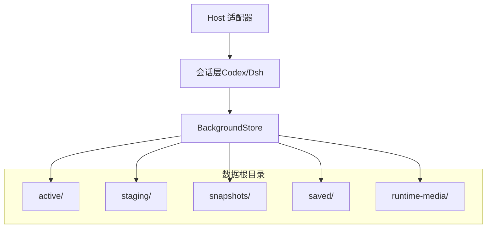
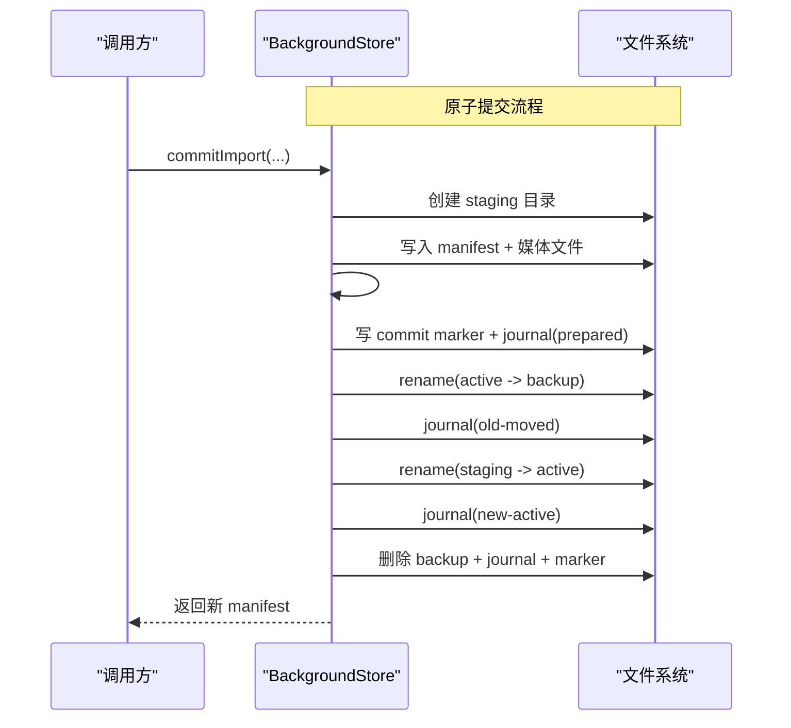
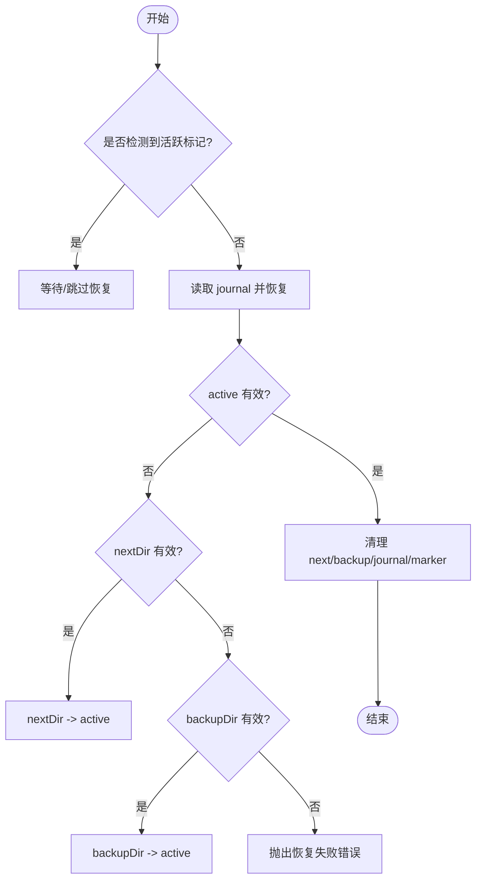
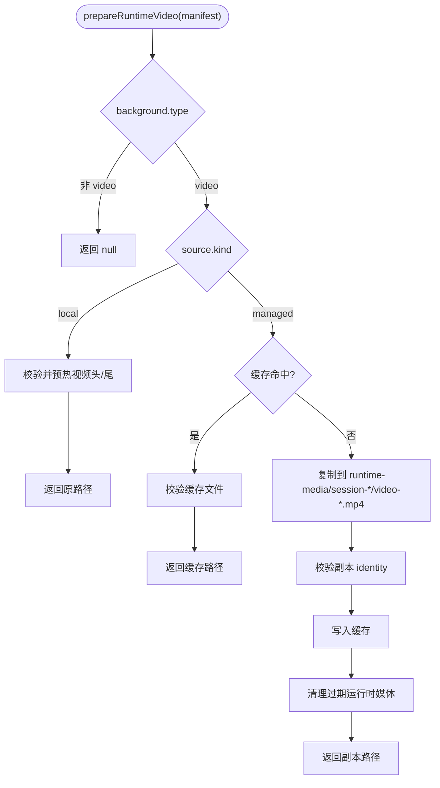
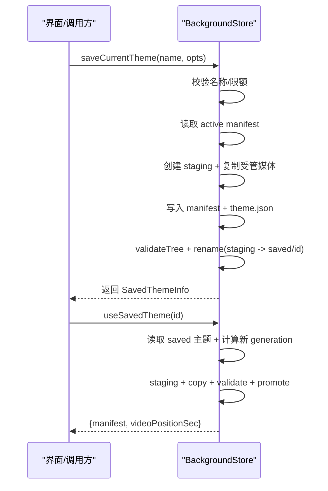
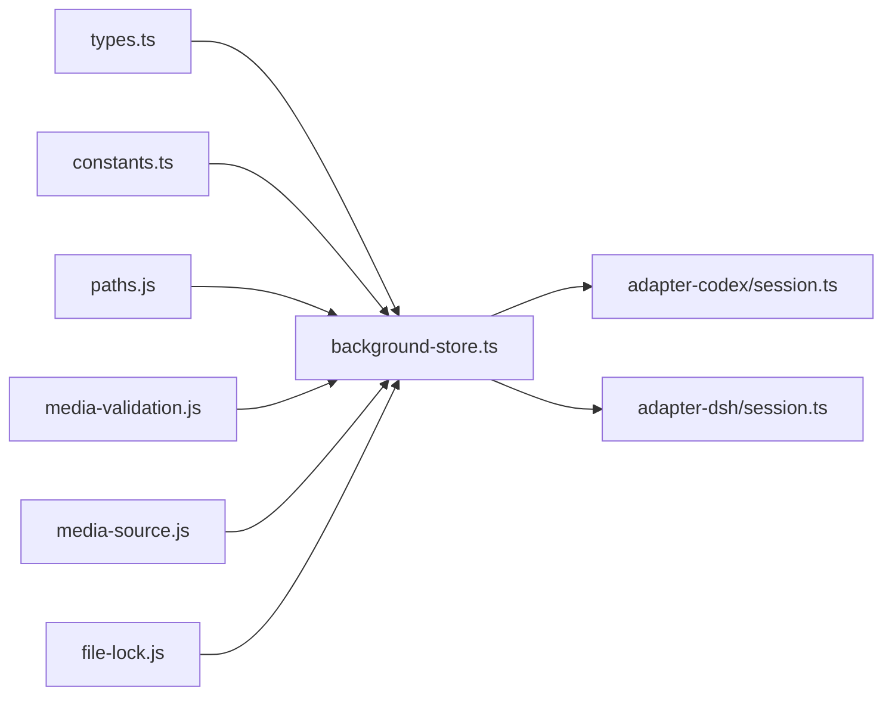

# 背景存储系统

<cite>
**本文引用的文件**
- [background-store.ts](file://packages/core/src/background-store.ts)
- [types.ts](file://packages/core/src/types.ts)
- [constants.ts](file://packages/core/src/constants.ts)
- [apply-transaction.md](file://docs/apply-transaction.md)
- [session.ts（Codex）](file://packages/adapter-codex/src/session.ts)
- [host-session.ts](file://packages/core/src/host-session.ts)
</cite>

## 目录
1. [简介](#简介)
2. [项目结构](#项目结构)
3. [核心组件](#核心组件)
4. [架构总览](#架构总览)
5. [详细组件分析](#详细组件分析)
6. [依赖关系分析](#依赖关系分析)
7. [性能考虑](#性能考虑)
8. [故障排查指南](#故障排查指南)
9. [结论](#结论)
10. [附录：API 接口文档](#附录api-接口文档)

## 简介
本文件系统化说明 BackgroundStore 背景存储系统，覆盖主题文件格式（BackgroundManifest）的 schema、generation 与 background 字段设计、版本管理机制；原子性提交流程（staging 目录、journal 日志、commit marker、备份恢复）；图片与视频背景的不同处理策略（本地引用模式与管理模式的区别）；运行时视频缓存与会话隔离；快照（保存当前主题）的创建、清理与恢复流程；以及完整的 API 接口文档（commitImport、snapshot、restoreSnapshot 等），并给出错误处理策略与性能优化建议。

## 项目结构
BackgroundStore 位于 core 包中，围绕“active/staging/snapshots/saved/runtime-media”等目录组织数据，并通过 manifest 描述当前生效的主题。上层会话（如 Codex/Dsh Session）通过 HostSession 接口调用 store 完成应用、保存、列表、删除、使用已保存主题等操作。

图表来源
- [background-store.ts:123-140](file://packages/core/src/background-store.ts#L123-L140)
- [constants.ts:54-62](file://packages/core/src/constants.ts#L54-L62)

章节来源
- [background-store.ts:123-140](file://packages/core/src/background-store.ts#L123-L140)
- [constants.ts:54-62](file://packages/core/src/constants.ts#L54-L62)

## 核心组件
- BackgroundStore：负责主题 manifest 读写、原子提交、媒体复制/校验、运行时视频准备、保存主题、快照恢复等。
- BackgroundManifest：描述当前或历史主题的元数据，包含 schema、generation、background、updatedAt。
- MediaSource：区分 managed（复制到 store）与 local（直接引用外部路径）。
- 持久化布局：active、staging、snapshots、saved、runtime-media 等目录由 paths 模块解析并保证安全边界。

章节来源
- [background-store.ts:123-140](file://packages/core/src/background-store.ts#L123-L140)
- [types.ts:64-81](file://packages/core/src/types.ts#L64-L81)
- [constants.ts:54-62](file://packages/core/src/constants.ts#L54-L62)

## 架构总览
BackgroundStore 以“先 staging、再原子 promote”的方式确保 active 目录始终处于一致状态。写入前会写 journal 与 commit marker，失败时通过 recovery 流程恢复。视频在运行时按需拷贝到 session 隔离目录，避免 Chromium 持有 active 目录句柄导致的问题。

图表来源
- [background-store.ts:757-797](file://packages/core/src/background-store.ts#L757-L797)
- [background-store.ts:211-270](file://packages/core/src/background-store.ts#L211-L270)
- [apply-transaction.md:1-48](file://docs/apply-transaction.md#L1-L48)

## 详细组件分析

### 主题文件格式 BackgroundManifest
- schema：固定为常量 SCHEMA_ID，用于识别格式版本。
- generation：单调递增的版本号，用于区分不同世代，防止旧 host payload 混淆。
- background：可为 null（清空背景），或对象：
  - type："image" | "video"
  - image：海报图名（视频必需）
  - video：受管主视频文件名（legacy managed 模式）
  - source：{ kind: "managed"|"local", file|path }，优先于 legacy 字段
  - effects：仅图片主题支持，包含 preset/rain/overlay/water
- updatedAt：更新时间戳

校验逻辑包括类型检查、source 合法性、路径安全（basename 安全）、effects 规范化等。

章节来源
- [types.ts:64-81](file://packages/core/src/types.ts#L64-L81)
- [background-store.ts:89-121](file://packages/core/src/background-store.ts#L89-L121)
- [constants.ts:1-2](file://packages/core/src/constants.ts#L1-L2)

### 原子性提交流程（Staging、Journal、Marker、备份恢复）
- Staging：所有变更先在 staging/tx-* 下构建完整树，验证通过后才提升。
- Journal：记录阶段（prepared/old-moved/new-active），配合 marker 实现中断恢复。
- Marker：active 根下的 .beauticode-commit-in-progress，读取时若新鲜则拒绝读取，避免读到半写状态。
- 备份恢复：promote 时将 active 重命名为 active-backup-*，成功后删除；若崩溃，启动时根据 journal 和 manifest 有效性决定回退到 nextDir 或 backupDir。

图表来源
- [background-store.ts:211-270](file://packages/core/src/background-store.ts#L211-L270)
- [background-store.ts:757-797](file://packages/core/src/background-store.ts#L757-L797)

章节来源
- [background-store.ts:211-270](file://packages/core/src/background-store.ts#L211-L270)
- [background-store.ts:757-797](file://packages/core/src/background-store.ts#L757-L797)
- [apply-transaction.md:1-48](file://docs/apply-transaction.md#L1-L48)

### 图片背景与视频背景的处理策略
- 图片背景：
  - 可嵌入 data URL 或通过 media server 提供；大小受 MAX_IMAGE_BYTES 限制。
  - 支持 effects（rain/overlay/water），仅图片主题。
  - 可选择 local 引用模式（不复制到 store）或 managed 模式（复制到 store）。
- 视频背景：
  - poster 图必须存在；主视频可为 managed 或 local。
  - prepareRuntimeVideo 对 managed 视频进行 session 隔离拷贝，避免 Chromium 打开 active 目录句柄；对 local 视频预热首段 IO。
  - 运行时缓存按 generation 键入 Map，失效后重建。

图表来源
- [background-store.ts:352-437](file://packages/core/src/background-store.ts#L352-L437)
- [constants.ts:3-19](file://packages/core/src/constants.ts#L3-L19)

章节来源
- [background-store.ts:352-437](file://packages/core/src/background-store.ts#L352-L437)
- [constants.ts:3-19](file://packages/core/src/constants.ts#L3-L19)

### 运行时视频缓存与会话隔离
- 每个进程内维护一个 Map<generation, path> 作为运行时缓存。
- 每次获取前先尝试从缓存读取并校验，失败则重新拷贝。
- 拷贝目标位于 runtime-media/<session-name>/，session-name 基于 pid+uuid，确保多实例/多会话隔离。
- 完成后执行 best-effort 清理，避免磁盘膨胀。

章节来源
- [background-store.ts:129-131](file://packages/core/src/background-store.ts#L129-L131)
- [background-store.ts:375-437](file://packages/core/src/background-store.ts#L375-L437)

### 快照功能（保存当前主题、清理与恢复）
- saveCurrentTheme：将当前 active 主题保存到 saved/<id>/，包含 manifest 与受管媒体；可选记录视频位置；受数量与字节上限限制。
- listSavedThemes：列出用户保存主题与内置主题，排序后返回。
- deleteSavedTheme：删除指定主题（内置不可删）。
- useSavedTheme：将 saved 主题提升到 active（生成新的 generation），返回新 manifest 与视频位置（如有）。
- restoreSnapshot：将某 snapshot 恢复到 active（同样走 staging + promote）。

图表来源
- [background-store.ts:805-913](file://packages/core/src/background-store.ts#L805-L913)
- [background-store.ts:1155-1224](file://packages/core/src/background-store.ts#L1155-L1224)
- [background-store.ts:680-716](file://packages/core/src/background-store.ts#L680-L716)

章节来源
- [background-store.ts:805-913](file://packages/core/src/background-store.ts#L805-L913)
- [background-store.ts:1155-1224](file://packages/core/src/background-store.ts#L1155-L1224)
- [background-store.ts:680-716](file://packages/core/src/background-store.ts#L680-L716)

### 与宿主适配器的交互
- HostSession 暴露 apply/reapply/saveCurrentTheme/list/delete/use 等方法，内部委托 BackgroundStore 完成持久化。
- Codex/Dsh 会话在保存主题时捕获播放进度，并在后续 use 时传入 startAt 以便恢复播放位置。

章节来源
- [host-session.ts:27-47](file://packages/core/src/host-session.ts#L27-L47)
- [session.ts（Codex）:556-596](file://packages/adapter-codex/src/session.ts#L556-L596)

## 依赖关系分析
- BackgroundStore 依赖：
  - constants：schema、目录名、常量限制
  - types：ApplyInput、BackgroundManifest、BackgroundMedia 等类型
  - paths：数据布局与安全校验
  - media-validation：媒体校验与预热
  - media-source：本地/受管源判定与路径解析
  - file-lock：跨进程写入互斥
- 上层依赖：
  - adapter-codex / adapter-dsh：封装会话生命周期与媒体服务控制
  - tray/UI：触发保存/恢复/切换主题等操作

图表来源
- [background-store.ts:1-45](file://packages/core/src/background-store.ts#L1-L45)
- [types.ts:1-81](file://packages/core/src/types.ts#L1-L81)
- [constants.ts:1-62](file://packages/core/src/constants.ts#L1-L62)

章节来源
- [background-store.ts:1-45](file://packages/core/src/background-store.ts#L1-L45)
- [types.ts:1-81](file://packages/core/src/types.ts#L1-L81)
- [constants.ts:1-62](file://packages/core/src/constants.ts#L1-L62)

## 性能考虑
- 写入串行化：通过 writeChain + 文件锁避免并发 stage/commit 交错。
- 原子写入：JSON 文件采用 tmp+rename 方式写入，避免部分写入。
- 视频预热：local 视频在首次 range 读取前预热头部与 moov 尾部，降低渲染侧 verify 超时风险。
- 运行时缓存：按 generation 缓存视频副本，减少重复拷贝与校验。
- 节流进度写入：会话层对视频位置更新做节流与去抖，避免频繁磁盘写入。
- 资源限制：图像/视频大小限制与 inline data URL 限制，避免过大负载。

章节来源
- [background-store.ts:321-344](file://packages/core/src/background-store.ts#L321-L344)
- [background-store.ts:366-372](file://packages/core/src/background-store.ts#L366-L372)
- [background-store.ts:375-437](file://packages/core/src/background-store.ts#L375-L437)
- [constants.ts:3-19](file://packages/core/src/constants.ts#L3-L19)
- [session.ts（Codex）:98-110](file://packages/adapter-codex/src/session.ts#L98-L110)

## 故障排查指南
- 读取时报“提交进行中”：active 目录下存在新鲜的 commit marker，需等待或等到 stale 后再读。
- 恢复失败：journal 无效或 active/next/backup 均不可用，需人工清理残留文件或检查磁盘权限。
- 保存主题失败：名称非法、达到主题数量或字节上限、路径越界等。
- 视频无法播放：运行时副本 identity 校验失败、路径被占用或权限不足。
- 会话冲突：多个 BackgroundStore 实例同时写入会被文件锁阻止。

章节来源
- [background-store.ts:169-188](file://packages/core/src/background-store.ts#L169-L188)
- [background-store.ts:211-270](file://packages/core/src/background-store.ts#L211-L270)
- [background-store.ts:805-913](file://packages/core/src/background-store.ts#L805-L913)
- [background-store.ts:375-437](file://packages/core/src/background-store.ts#L375-L437)

## 结论
BackgroundStore 通过严格的 schema 校验、原子化目录交换、journal 与 marker 的中断恢复机制，保证了背景主题的一致性与可靠性。针对图片与视频分别设计了高效且安全的处理路径，结合运行时缓存与会话隔离，提升了稳定性与性能。保存与恢复能力为用户提供了灵活的“主题”管理能力。

## 附录：API 接口文档

- commitImport(input): Promise<BackgroundManifest>
  - 输入 ApplyInput：
    - type: "image" | "video" | "clear"
    - image: imagePath, source?: "managed" | "local", effects?
    - video: videoPath, imagePath?, source?: "managed" | "local", startAt?
  - 行为：在 staging 构建完整主题树，校验后原子 promote 到 active，返回新 manifest。
  - 异常：媒体校验失败、路径越界、schema 不合法、提交进行中等。

- saveCurrentTheme(name, opts?): Promise<SavedThemeInfo>
  - name：1–80 字符，不含非法字符
  - opts.videoPositionSec：可选，视频主题保存播放位置
  - 行为：复制受管媒体到 saved/<id>/，写入 manifest 与 theme.json，原子重命名
  - 异常：名称非法、已达数量/容量上限、无活动背景等

- listSavedThemes(): Promise<SavedThemeInfo[]>
  - 返回用户保存主题与内置主题列表，含 sourceMode、videoPositionSec（视频）等

- deleteSavedTheme(themeId): Promise<boolean>
  - 删除指定主题（内置主题不可删）

- getSavedThemeVideoPosition(themeId): Promise<number | null>
  - 读取视频主题的播放位置，无效值返回 null

- updateSavedThemeVideoPosition(themeId, positionSec): Promise<{ ok, positionSec, error? }>
  - 增量更新视频主题播放位置，相同值跳过写入

- loadSavedTheme(themeId): Promise<{ input, videoPositionSec, themeId }>
  - 将 saved 主题转换为 ApplyInput，供上层 ApplyTransaction 使用

- useSavedTheme(themeId): Promise<{ manifest, videoPositionSec }>
  - 将 saved 主题提升到 active，生成新 generation，返回新 manifest 与视频位置

- restoreSnapshot(snapshot): Promise<BackgroundManifest>
  - 将 snapshot 恢复到 active，同样走 staging + promote

- readActiveManifest(): Promise<BackgroundManifest>
  - 读取当前 active manifest，若检测到活跃的 commit marker 则拒绝

- activeImagePath()/activeVideoPath(): Promise<string | null>
  - 解析当前 active 的图片/视频路径

- prepareRuntimeVideo(manifest): Promise<string | null>
  - 为渲染器准备视频路径：local 直接返回并预热；managed 复制到 session 隔离目录并缓存

章节来源
- [background-store.ts:277-319](file://packages/core/src/background-store.ts#L277-L319)
- [background-store.ts:352-437](file://packages/core/src/background-store.ts#L352-L437)
- [background-store.ts:680-716](file://packages/core/src/background-store.ts#L680-L716)
- [background-store.ts:805-913](file://packages/core/src/background-store.ts#L805-L913)
- [background-store.ts:915-983](file://packages/core/src/background-store.ts#L915-L983)
- [background-store.ts:990-1058](file://packages/core/src/background-store.ts#L990-L1058)
- [background-store.ts:1066-1148](file://packages/core/src/background-store.ts#L1066-L1148)
- [background-store.ts:1155-1224](file://packages/core/src/background-store.ts#L1155-L1224)