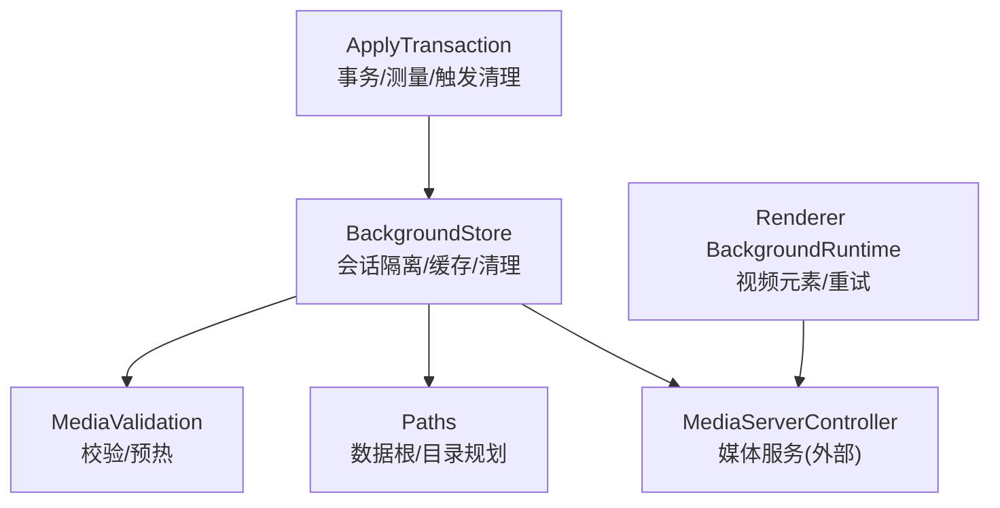
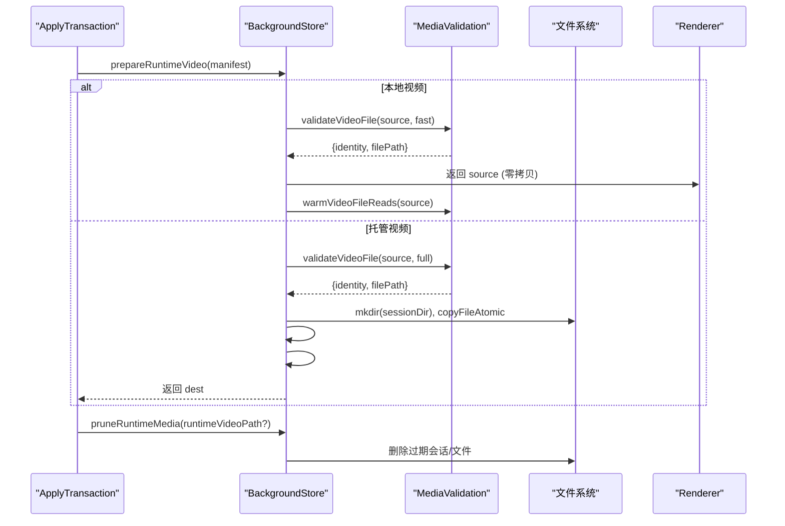
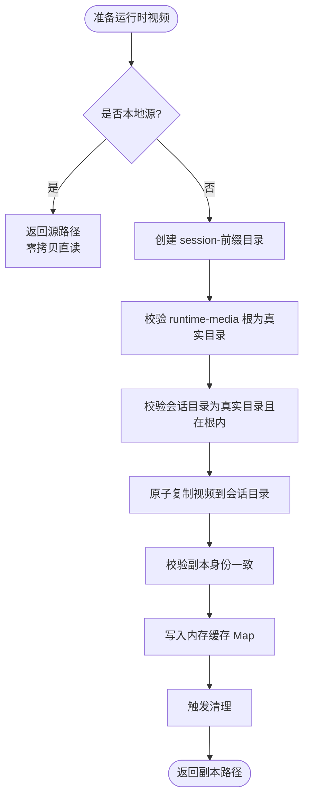
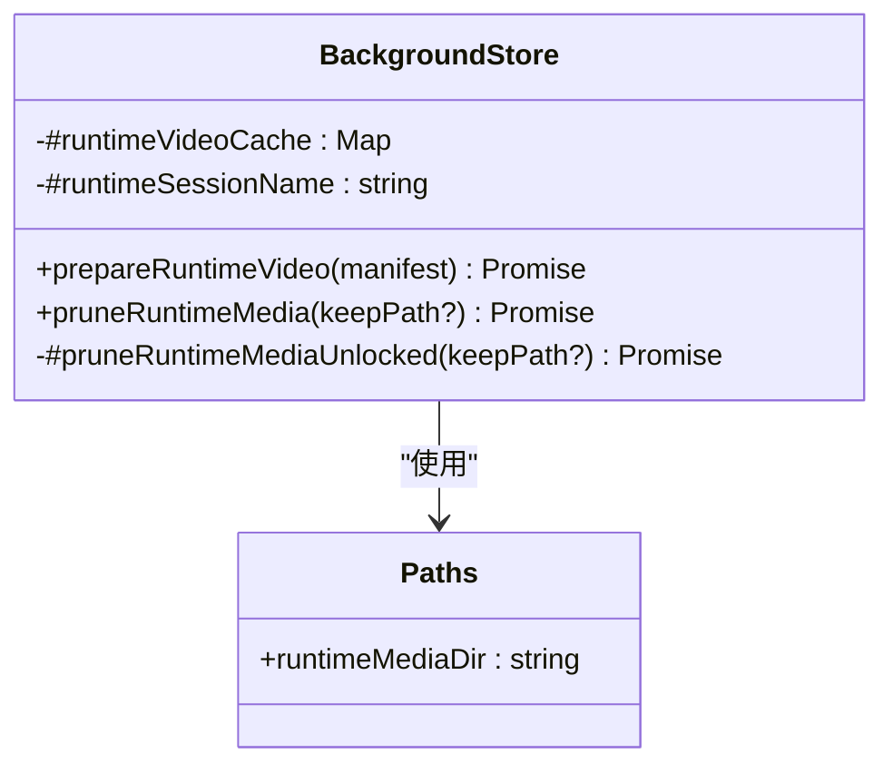
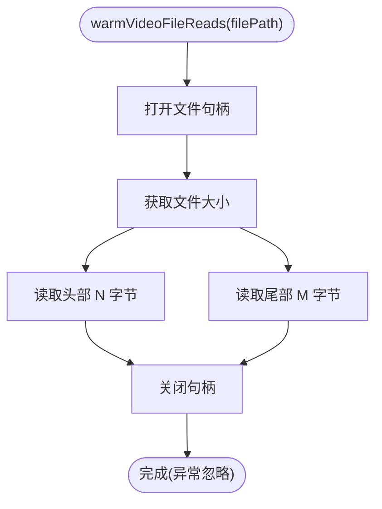
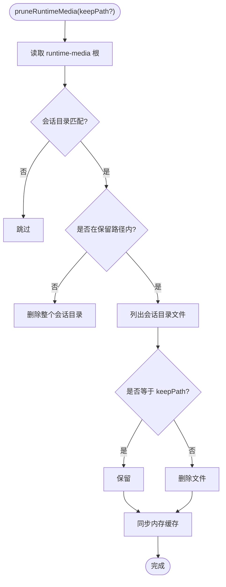
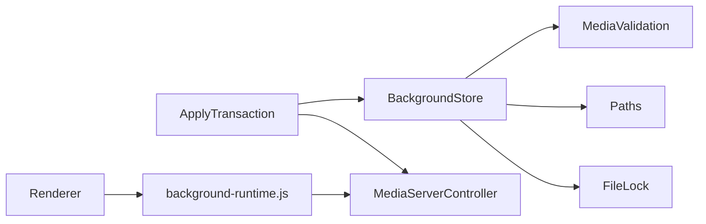

# 运行时缓存系统

<cite>
**本文引用的文件**
- [background-store.ts](file://packages/core/src/background-store.ts)
- [media-validation.ts](file://packages/core/src/media-validation.ts)
- [paths.ts](file://packages/core/src/paths.ts)
- [apply-transaction.ts](file://packages/core/src/apply-transaction.ts)
- [background-runtime.js](file://packages/adapter-codex/src/renderer/background-runtime.js)
- [media-validation.test.js](file://packages/core/test/media-validation.test.js)
- [background-store.test.js](file://packages/core/test/background-store.test.js)
</cite>

## 目录
1. [简介](#简介)
2. [项目结构](#项目结构)
3. [核心组件](#核心组件)
4. [架构总览](#架构总览)
5. [详细组件分析](#详细组件分析)
6. [依赖关系分析](#依赖关系分析)
7. [性能考量](#性能考量)
8. [故障排查指南](#故障排查指南)
9. [结论](#结论)
10. [附录](#附录)

## 简介
本文件系统性地梳理并文档化 beautiCode 的“运行时视频缓存系统”。该系统的目标是：
- 为渲染器提供隔离、安全、可回滚的视频播放资源，避免活动目录被长期占用导致主题切换阻塞。
- 通过会话隔离（session-前缀目录）与原子复制，确保多进程/多线程并发下的数据一致性。
- 对本地视频采用零拷贝直读策略，结合预读取优化，降低首帧延迟。
- 提供健壮的缓存清理机制，回收过期文件与空间，保证长期运行稳定。
- 内置性能监控点，便于定位瓶颈与调优。

## 项目结构
与运行时缓存相关的代码主要分布在 core 包与 adapter 包中：
- core 包负责数据布局、媒体校验、会话隔离、缓存生命周期管理。
- adapter 包负责渲染侧视频加载、事件处理与重试逻辑。

图表来源
- [background-store.ts:123-449](file://packages/core/src/background-store.ts#L123-L449)
- [media-validation.ts:261-328](file://packages/core/src/media-validation.ts#L261-L328)
- [paths.ts:30-48](file://packages/core/src/paths.ts#L30-L48)
- [apply-transaction.ts:249-290](file://packages/core/src/apply-transaction.ts#L249-L290)

章节来源
- [background-store.ts:123-449](file://packages/core/src/background-store.ts#L123-L449)
- [paths.ts:30-48](file://packages/core/src/paths.ts#L30-L48)

## 核心组件
- BackgroundStore：维护数据布局、会话隔离目录、运行时视频缓存、原子提交与清理。
- MediaValidation：媒体文件校验（图像/视频）、容器检测、哈希身份、预热读取。
- Paths：数据根与子目录解析、路径安全校验、原子复制工具。
- ApplyTransaction：应用事务编排，包含测量、失败回滚、触发运行时媒体清理。
- Renderer BackgroundRuntime：渲染端视频元素创建、状态监听、重试与就绪判定。

章节来源
- [background-store.ts:123-449](file://packages/core/src/background-store.ts#L123-L449)
- [media-validation.ts:261-328](file://packages/core/src/media-validation.ts#L261-L328)
- [paths.ts:30-48](file://packages/core/src/paths.ts#L30-L48)
- [apply-transaction.ts:249-290](file://packages/core/src/apply-transaction.ts#L249-L290)
- [background-runtime.js:1219-1254](file://packages/adapter-codex/src/renderer/background-runtime.js#L1219-L1254)

## 架构总览
运行时视频缓存的关键流程如下：
- 当背景类型为视频时，BackgroundStore.prepareRuntimeVideo 决定使用本地直读或复制到会话目录。
- 本地视频走零拷贝路径，直接返回源路径；受控于渲染器验证时限，提前预热头部与尾部。
- 托管视频则复制到 session-前缀目录，生成唯一文件名，写入内存缓存 Map，并触发清理。
- 应用事务在最终阶段调用 pruneRuntimeMedia，删除非保留的会话目录与多余文件。
- 渲染端通过 background-runtime.js 创建 video 元素，监听事件，必要时重试以应对冷启动首帧延迟。

图表来源
- [background-store.ts:352-436](file://packages/core/src/background-store.ts#L352-L436)
- [media-validation.ts:261-328](file://packages/core/src/media-validation.ts#L261-L328)
- [paths.ts:178-187](file://packages/core/src/paths.ts#L178-L187)
- [apply-transaction.ts:249-290](file://packages/core/src/apply-transaction.ts#L249-L290)

## 详细组件分析

### 会话隔离设计（session-前缀目录）
- 每个进程实例在运行时媒体根目录下创建一个唯一会话目录，命名形如 session-{pid}-{uuid}。
- 所有托管视频复制到此会话目录，避免活动目录被渲染器长时间持有句柄，从而不影响后续的主题切换。
- 路径安全校验严格：
  - 拒绝符号链接与重解析点。
  - 强制真实路径在 runtime-media 根内。
  - 会话目录必须为真实目录且位于根下。
- 文件名包含 generation 与 identity 前缀，确保唯一性与可追溯性。

图表来源
- [background-store.ts:352-436](file://packages/core/src/background-store.ts#L352-L436)
- [paths.ts:160-167](file://packages/core/src/paths.ts#L160-L167)

章节来源
- [background-store.ts:352-436](file://packages/core/src/background-store.ts#L352-L436)
- [paths.ts:160-167](file://packages/core/src/paths.ts#L160-L167)

### 运行时视频缓存的工作原理
- 缓存键：以 manifest.generation 作为键，值为会话目录中的视频副本路径。
- 缓存命中：若存在且校验通过，直接返回；否则失效并重新复制。
- 缓存失效：
  - 校验失败时从 Map 删除对应项。
  - 清理阶段按 keepPath 保留当前正在使用的文件，其余删除。
- 内存管理：Map 仅保存当前进程有效引用，进程退出即释放；清理时同步删除 Map 中非保留项。

图表来源
- [background-store.ts:123-140](file://packages/core/src/background-store.ts#L123-L140)
- [background-store.ts:352-436](file://packages/core/src/background-store.ts#L352-L436)
- [background-store.ts:444-494](file://packages/core/src/background-store.ts#L444-L494)
- [paths.ts:30-48](file://packages/core/src/paths.ts#L30-L48)

章节来源
- [background-store.ts:352-436](file://packages/core/src/background-store.ts#L352-L436)
- [background-store.ts:444-494](file://packages/core/src/background-store.ts#L444-L494)

### 零拷贝本地视频流式传输优化
- 本地视频不复制，直接返回源路径供渲染器读取，减少 I/O 与磁盘占用。
- 首次 range 请求发生在渲染器验证时限内，因此提前预热头部与尾部，规避冷启动卡顿。
- 预热策略：
  - 读取头部固定字节数（例如 2 MiB）。
  - 读取尾部固定字节数（例如 4 MiB），用于非 faststart MP4 的 moov atom。
  - 预热失败不影响导入正确性，属于建议性操作。

图表来源
- [media-validation.ts:294-328](file://packages/core/src/media-validation.ts#L294-L328)

章节来源
- [media-validation.ts:294-328](file://packages/core/src/media-validation.ts#L294-L328)

### 缓存清理机制（过期检测与空间回收）
- 清理入口：ApplyTransaction 在最终阶段调用 pruneRuntimeMedia，传入当前保留路径（可选）。
- 扫描规则：
  - 遍历 runtime-media 根目录，匹配 session-前缀的会话目录。
  - 对每个会话目录，删除除 keepPath 之外的所有文件。
  - 若会话目录不是保留路径的子路径，则整体删除。
- 内存同步：清理后删除 Map 中非保留项，保持内存与磁盘一致。
- 健壮性：错误捕获，避免清理失败影响主流程。

图表来源
- [background-store.ts:444-494](file://packages/core/src/background-store.ts#L444-L494)
- [apply-transaction.ts:249-290](file://packages/core/src/apply-transaction.ts#L249-L290)

章节来源
- [background-store.ts:444-494](file://packages/core/src/background-store.ts#L444-L494)
- [apply-transaction.ts:249-290](file://packages/core/src/apply-transaction.ts#L249-L290)

### warmVideoFileReads 预读取优化实现原理
- 目的：在渲染器验证时限之前，预先将可能引起冷启动延迟的字节范围载入内核页缓存，降低首次 range 请求的抖动。
- 行为：
  - 打开文件，统计大小。
  - 计算头部与尾部读取长度，分别读取。
  - 无论成功与否，均关闭句柄；异常被吞掉，不阻断导入。
- 适用场景：本地视频直读路径；托管视频在复制完成后由渲染器自行读取，预热主要在本地路径生效。

章节来源
- [media-validation.ts:294-328](file://packages/core/src/media-validation.ts#L294-L328)
- [background-store.ts:366-372](file://packages/core/src/background-store.ts#L366-L372)

### 渲染端视频加载与重试
- 渲染端创建 video 元素，监听 loadeddata/canplay/playing/error 等事件，判断就绪状态。
- 若首帧尚未就绪，进行短暂重试，以容忍冷启动导致的解码延迟。
- 与后端预热配合，显著降低首次播放等待时间。

章节来源
- [background-runtime.js:1219-1254](file://packages/adapter-codex/src/renderer/background-runtime.js#L1219-L1254)

## 依赖关系分析
- BackgroundStore 依赖：
  - MediaValidation：校验与预热。
  - Paths：路径解析与安全校验、原子复制。
  - FileLock：写锁保障并发安全。
- ApplyTransaction 依赖：
  - BackgroundStore：准备运行时视频与清理。
  - MediaServerController：媒体服务控制（外部）。
- 渲染端依赖：
  - background-runtime.js：视频元素生命周期管理。

图表来源
- [background-store.ts:123-140](file://packages/core/src/background-store.ts#L123-L140)
- [apply-transaction.ts:249-290](file://packages/core/src/apply-transaction.ts#L249-L290)

章节来源
- [background-store.ts:123-140](file://packages/core/src/background-store.ts#L123-L140)
- [apply-transaction.ts:249-290](file://packages/core/src/apply-transaction.ts#L249-L290)

## 性能考量
- 预热参数调优：
  - 头部与尾部读取大小可根据典型视频结构与存储介质调整，平衡预热成本与首帧延迟。
  - 对于小视频，预热收益有限；对于大视频或非 faststart，预热收益明显。
- 缓存命中率：
  - 同一 generation 的重复访问可命中内存缓存，减少复制与校验开销。
  - 频繁切换主题会降低命中率，需评估业务模式。
- I/O 路径选择：
  - 本地视频零拷贝路径优先，避免额外复制。
  - 托管视频复制至会话目录，避免活动目录句柄占用。
- 清理频率与时机：
  - 在应用事务最终阶段执行清理，避免中间态不一致。
  - 清理失败不应阻断主流程，采用 best-effort 策略。
- 监控指标：
  - 应用事务各阶段耗时（含 pruneRuntimeMedia）。
  - 渲染器验证阶段耗时与重试次数。
  - 预热调用次数与失败率。

[本节为通用指导，无需特定文件来源]

## 故障排查指南
- 常见问题与定位：
  - 首帧卡顿：检查是否启用预热；确认本地视频是否为 faststart；观察渲染端重试日志。
  - 主题切换阻塞：确认托管视频是否复制到会话目录；检查是否有残留句柄未释放。
  - 存储空间增长：检查清理是否被执行；查看会话目录数量与大小。
- 诊断手段：
  - 查看应用事务 timings，关注 rendererVerify 与 rollback 阶段。
  - 检查 runtime-media 根目录下的会话目录与文件。
  - 核对路径安全校验错误信息，确认是否存在符号链接或越界路径。

章节来源
- [background-store.test.js:514-549](file://packages/core/test/background-store.test.js#L514-L549)
- [media-validation.test.js:160-177](file://packages/core/test/media-validation.test.js#L160-L177)

## 结论
本运行时缓存系统通过会话隔离、原子复制、零拷贝直读与预热优化，实现了高性能、高可靠性的视频背景播放能力。其设计兼顾了安全性（路径校验、符号链接防护）、一致性（原子提交、写锁）、可维护性（清理机制、内存同步）与可观测性（事务计时、渲染端重试）。在生产环境中，建议结合业务特征调优预热参数与清理策略，并持续监控关键指标以确保稳定性与性能。

[本节为总结，无需特定文件来源]

## 附录
- 关键常量与配置：
  - 预热头部与尾部字节数定义在媒体校验模块。
  - 数据根与子目录名称在路径模块中集中管理。
- 测试覆盖：
  - 预热最佳实践与缺失文件容错。
  - 运行时视频路径隔离与句柄释放。
  - 应用事务回滚与清理协同。

章节来源
- [media-validation.ts:294-328](file://packages/core/src/media-validation.ts#L294-L328)
- [paths.ts:30-48](file://packages/core/src/paths.ts#L30-L48)
- [media-validation.test.js:160-177](file://packages/core/test/media-validation.test.js#L160-L177)
- [background-store.test.js:439-485](file://packages/core/test/background-store.test.js#L439-L485)