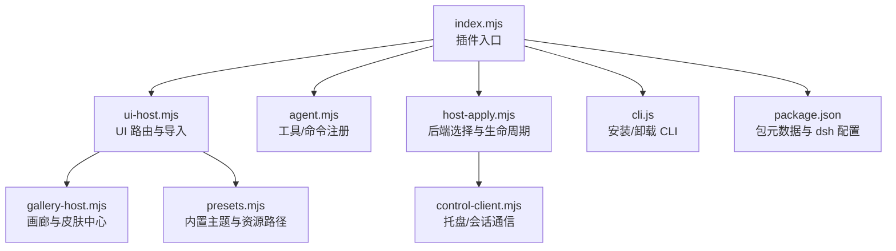
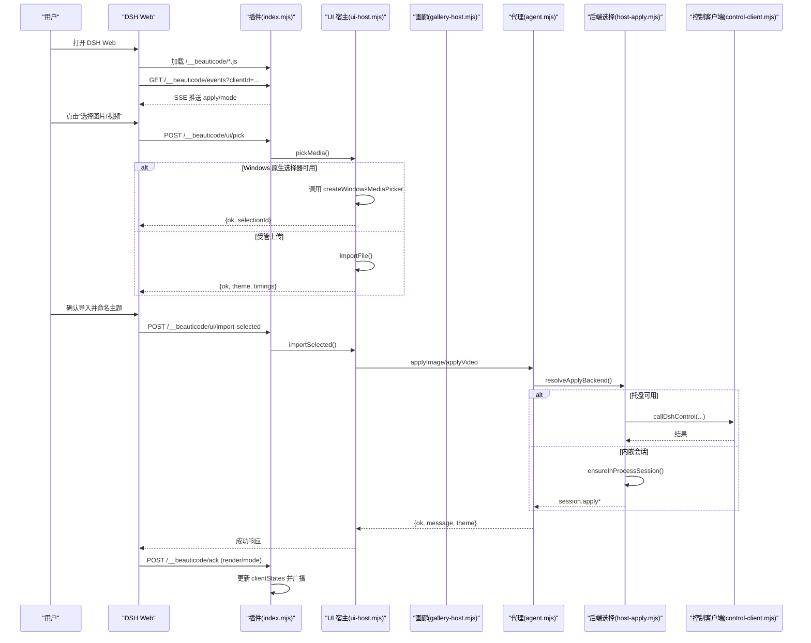
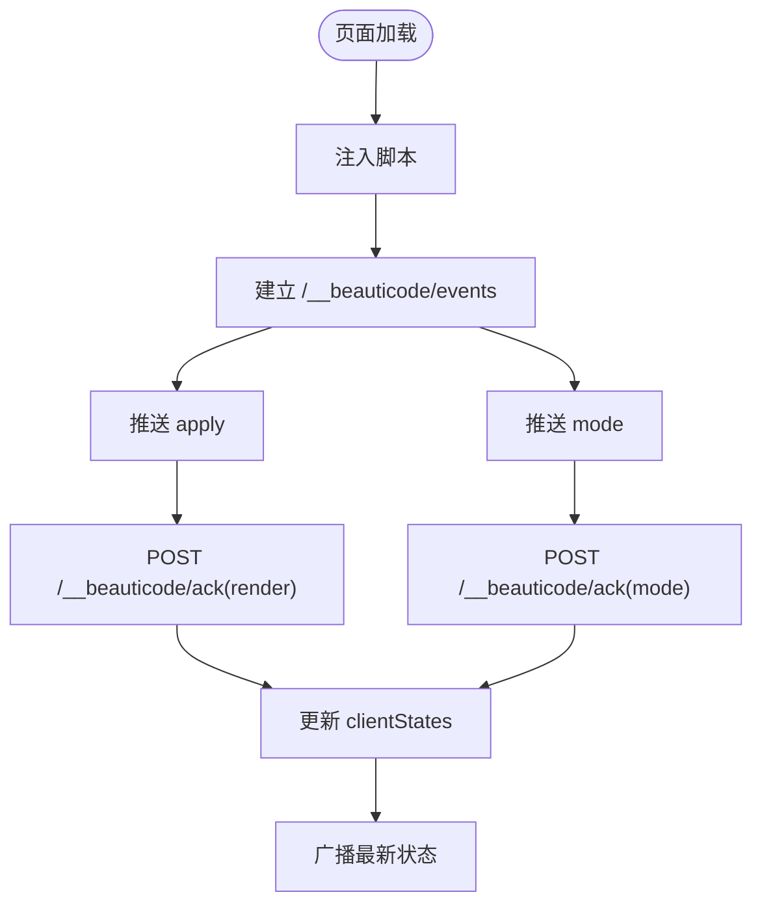
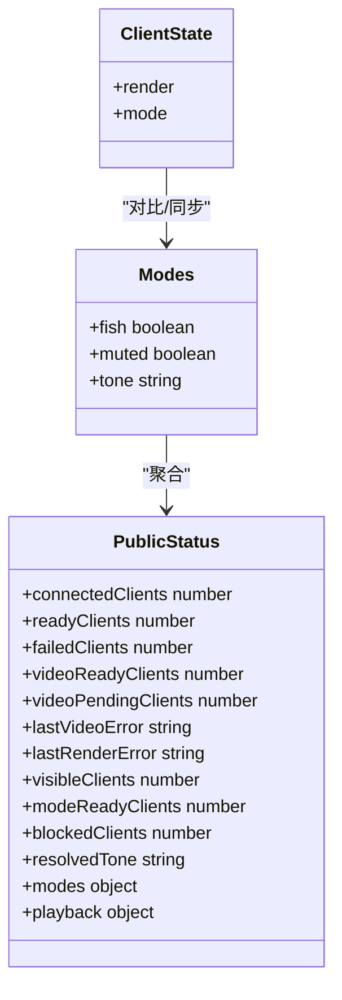
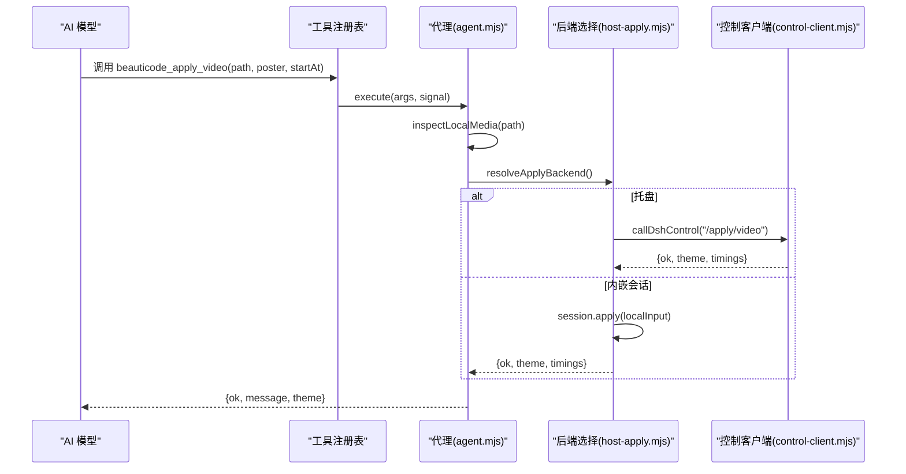
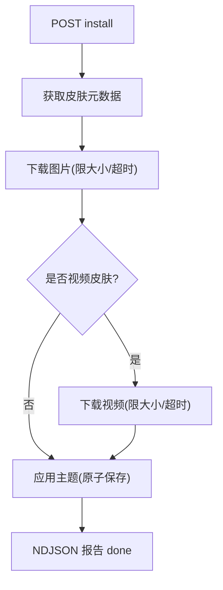
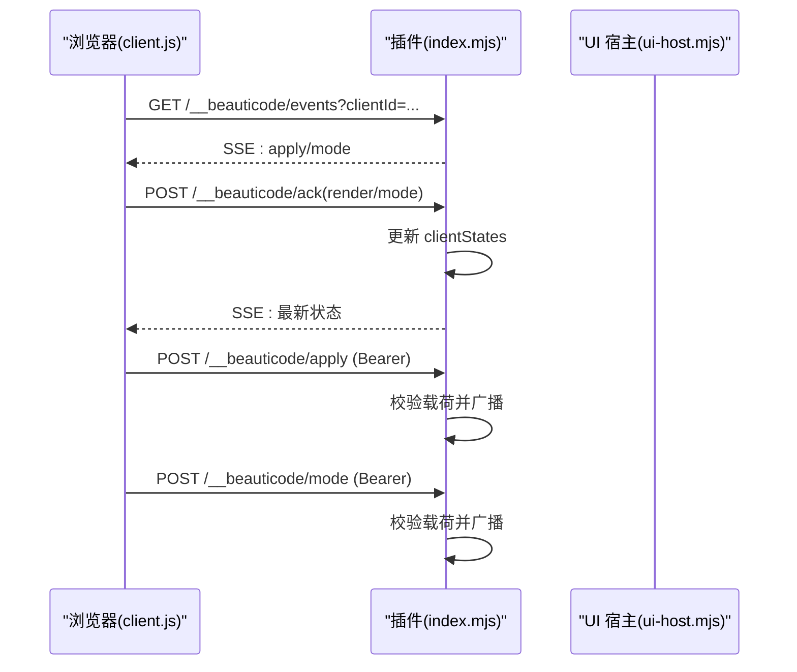
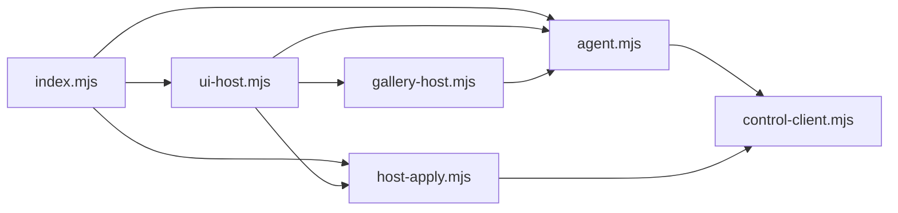

# DeepSeek Harness 插件界面

<cite>
**本文引用的文件**
- [index.mjs](file://integrations/deepseek-harness/index.mjs)
- [ui-host.mjs](file://integrations/deepseek-harness/ui-host.mjs)
- [gallery-host.mjs](file://integrations/deepseek-harness/gallery-host.mjs)
- [agent.mjs](file://integrations/deepseek-harness/agent.mjs)
- [host-apply.mjs](file://integrations/deepseek-harness/host-apply.mjs)
- [control-client.mjs](file://integrations/deepseek-harness/control-client.mjs)
- [presets.mjs](file://integrations/deepseek-harness/presets.mjs)
- [cli.js](file://integrations/deepseek-harness/cli.js)
- [package.json](file://integrations/deepseek-harness/package.json)
- [skin-center.json](file://integrations/deepseek-harness/skin-center.json)
- [README.zh-CN.md](file://integrations/deepseek-harness/README.zh-CN.md)
</cite>

## 目录
1. [简介](#简介)
2. [项目结构](#项目结构)
3. [核心组件](#核心组件)
4. [架构总览](#架构总览)
5. [详细组件分析](#详细组件分析)
6. [依赖关系分析](#依赖关系分析)
7. [性能与容量限制](#性能与容量限制)
8. [故障排查指南](#故障排查指南)
9. [结论](#结论)
10. [附录：配置项与扩展点](#附录：配置项与扩展点)

## 简介
DeepSeek Harness（DSH）插件为 DSH Web 注入 beautiCode 浏览器客户端，提供图片与视频背景、主题管理、摸鱼模式、声音控制、皮肤中心安装等功能。插件通过侧边栏“背景”入口嵌入 UI，并注册对话工具与斜杠命令，实现从 AI 对话到本地媒体应用的完整链路。安全方面，所有控制端点使用本机回环地址与随机令牌保护，媒体 URL 仅允许带令牌的本地 HTTP 地址，浏览器回执仅接受同源请求。

**章节来源**
- [README.zh-CN.md:1-49](file://integrations/deepseek-harness/README.zh-CN.md#L1-L49)

## 项目结构
插件以 Node ESM 模块形式组织，入口导出插件名、注入目标与桥协议版本；UI 宿主负责路由、状态机、文件选择器与导入流程；画廊宿主提供皮肤中心目录浏览与安装；代理层封装对 DSH 托盘或内嵌会话的调用；CLI 提供一键安装与卸载能力。

**图表来源**
- [index.mjs:1-20](file://integrations/deepseek-harness/index.mjs#L1-L20)
- [ui-host.mjs:1-30](file://integrations/deepseek-harness/ui-host.mjs#L1-L30)
- [agent.mjs:1-20](file://integrations/deepseek-harness/agent.mjs#L1-L20)
- [host-apply.mjs:1-20](file://integrations/deepseek-harness/host-apply.mjs#L1-L20)
- [control-client.mjs:1-20](file://integrations/deepseek-harness/control-client.mjs#L1-L20)
- [gallery-host.mjs:1-20](file://integrations/deepseek-harness/gallery-host.mjs#L1-L20)
- [presets.mjs:1-20](file://integrations/deepseek-harness/presets.mjs#L1-L20)
- [cli.js:1-20](file://integrations/deepseek-harness/cli.js#L1-L20)
- [package.json:1-40](file://integrations/deepseek-harness/package.json#L1-L40)

**章节来源**
- [package.json:1-60](file://integrations/deepseek-harness/package.json#L1-L60)
- [index.mjs:1-20](file://integrations/deepseek-harness/index.mjs#L1-L20)

## 核心组件
- 插件入口 index.mjs：注册 webServer 注入、暴露插件名与桥协议版本、挂载前端脚本与 API 路由、维护事件推送与状态同步。
- UI 宿主 ui-host.mjs：处理导入、选择、主题切换、模式设置、画廊接口、Windows 原生文件选择器集成与导入时序日志。
- 画廊宿主 gallery-host.mjs：皮肤中心配置解析、目录拉取、媒体下载与进度上报、原子化安装与应用。
- 代理 agent.mjs：将工具与斜杠命令映射到底层动作，统一错误与消息呈现。
- 后端选择 host-apply.mjs：优先复用托盘，否则启动内嵌会话，管理生命周期与重试。
- 控制客户端 control-client.mjs：读写控制文件、校验回环 URL、令牌鉴权、HTTP 调用与错误包装。
- 预设 presets.mjs：内置主题定义与资源路径解析。
- CLI cli.js：一键写入补丁、链接依赖、迁移旧插件、安装/卸载。

**章节来源**
- [index.mjs:204-645](file://integrations/deepseek-harness/index.mjs#L204-L645)
- [ui-host.mjs:302-798](file://integrations/deepseek-harness/ui-host.mjs#L302-L798)
- [gallery-host.mjs:163-352](file://integrations/deepseek-harness/gallery-host.mjs#L163-L352)
- [agent.mjs:176-781](file://integrations/deepseek-harness/agent.mjs#L176-L781)
- [host-apply.mjs:137-165](file://integrations/deepseek-harness/host-apply.mjs#L137-L165)
- [control-client.mjs:463-517](file://integrations/deepseek-harness/control-client.mjs#L463-L517)
- [presets.mjs:7-74](file://integrations/deepseek-harness/presets.mjs#L7-L74)
- [cli.js:362-455](file://integrations/deepseek-harness/cli.js#L362-L455)

## 架构总览
插件在 DSH Web 中注入四个前端脚本，并通过 /__beauticode/* 路由提供服务。页面通过 SSE 订阅事件，POST 回执渲染与模式状态；后台根据令牌与同源策略保护关键接口。导入流程支持 Windows 原生选择器与受管上传两种路径，最终通过托盘或内嵌会话应用背景。

**图表来源**
- [index.mjs:230-467](file://integrations/deepseek-harness/index.mjs#L230-L467)
- [ui-host.mjs:531-668](file://integrations/deepseek-harness/ui-host.mjs#L531-L668)
- [agent.mjs:190-328](file://integrations/deepseek-harness/agent.mjs#L190-L328)
- [host-apply.mjs:73-117](file://integrations/deepseek-harness/host-apply.mjs#L73-L117)
- [control-client.mjs:463-517](file://integrations/deepseek-harness/control-client.mjs#L463-L517)

## 详细组件分析

### 侧边栏集成与 UI 嵌入
- 注入方式：在 webServer 索引页插入 defer 脚本，包含 atmosphere.js、client.js、console.js、gallery.js，并标记 data-beauticode-bridge 以避免重复注入。
- 路由：/__beauticode/version、/__beauticode/themes/*、/__beauticode/client.js、/__beauticode/console.js、/__beauticode/gallery.js、/__beauticode/ui/*、/__beauticode/events、/__beauticode/apply、/__beauticode/mode、/__beauticode/status、/__beauticode/ack。
- 事件推送：SSE 连接按 clientId 去重，初始推送当前背景与模式，关闭时清理状态。
- 安全：/events 仅接受同源 GET；/ack 仅接受同源 POST；/apply 与 /mode 需要 Bearer 令牌校验；媒体 URL 必须为带 t 参数的本地回环地址。

**图表来源**
- [index.mjs:230-467](file://integrations/deepseek-harness/index.mjs#L230-L467)
- [index.mjs:468-632](file://integrations/deepseek-harness/index.mjs#L468-L632)

**章节来源**
- [index.mjs:230-632](file://integrations/deepseek-harness/index.mjs#L230-L632)

### 数据绑定机制
- 渲染回执：客户端上报 generation、media、ok、visible、videoReady、playback 等字段，服务端校验后更新对应客户端状态。
- 模式回执：上报 fish、muted、tone、resolvedTone、themeSynced、blocked，服务端校验后更新全局 modes。
- 状态聚合：publicStatus 汇总已就绪、失败、视频待就绪、可见客户端数量与播放信息，供 /status 查询。

**图表来源**
- [index.mjs:148-202](file://integrations/deepseek-harness/index.mjs#L148-L202)
- [index.mjs:550-632](file://integrations/deepseek-harness/index.mjs#L550-L632)

**章节来源**
- [index.mjs:148-202](file://integrations/deepseek-harness/index.mjs#L148-L202)
- [index.mjs:550-632](file://integrations/deepseek-harness/index.mjs#L550-L632)

### 命令工具与斜杠命令
- 工具注册：beauticode_apply_video、beauticode_apply_image、beauticode_theme_list、beauticode_theme_use、beauticode_clear、beauticode_status、beauticode_set_fish、beauticode_set_muted。每个工具描述参数、超时与输出渲染。
- 斜杠命令：/bg（设置背景）、/bg-theme（切换主题）、/bg-clear（清除背景）。/bg 支持直接传入绝对路径，自动识别图片/视频。
- 提示注入：向系统提示添加 tool:beauticode 段落，指导模型调用工具而非 shell。

**图表来源**
- [agent.mjs:551-577](file://integrations/deepseek-harness/agent.mjs#L551-L577)
- [agent.mjs:274-328](file://integrations/deepseek-harness/agent.mjs#L274-L328)
- [host-apply.mjs:137-165](file://integrations/deepseek-harness/host-apply.mjs#L137-L165)
- [control-client.mjs:463-517](file://integrations/deepseek-harness/control-client.mjs#L463-L517)

**章节来源**
- [agent.mjs:546-781](file://integrations/deepseek-harness/agent.mjs#L546-L781)

### 画廊宿主（gallery-host）
- 配置：读取环境变量 BEAUTICODE_SKIN_CENTER 或内置 skin-center.json，规范化 URL（禁止用户名/密码/hash，http 仅限回环）。
- 目录：GET /api/catalog，转发查询参数，超时 30s，返回 skins 与 nextCursor。
- 安装：POST /__beauticode/ui/gallery/install，NDJSON 流式反馈阶段与进度，下载 image/video 并原子应用，完成后回调下载计数。
- 安全：强制 origin 校验、大小限制、超时与客户端断开取消。

**图表来源**
- [gallery-host.mjs:239-347](file://integrations/deepseek-harness/gallery-host.mjs#L239-L347)
- [gallery-host.mjs:64-119](file://integrations/deepseek-harness/gallery-host.mjs#L64-L119)

**章节来源**
- [gallery-host.mjs:24-54](file://integrations/deepseek-harness/gallery-host.mjs#L24-L54)
- [gallery-host.mjs:163-352](file://integrations/deepseek-harness/gallery-host.mjs#L163-L352)

### 插件与主应用通信协议
- 事件通道：/__beauticode/events 使用 SSE，携带 clientId 去重，初始推送 apply 与 mode。
- 回执通道：/__beauticode/ack 接收 render 与 mode 回执，校验字段后更新状态。
- 控制通道：/__beauticode/apply 与 /__beauticode/mode 需要 Bearer 令牌，校验载荷后广播。
- 状态查询：/__beauticode/status 需要令牌，返回聚合状态与播放信息。
- 安全边界：同源校验、令牌校验、媒体 URL 白名单（本地回环+参数 t）。

**图表来源**
- [index.mjs:432-532](file://integrations/deepseek-harness/index.mjs#L432-L532)
- [index.mjs:550-632](file://integrations/deepseek-harness/index.mjs#L550-L632)

**章节来源**
- [index.mjs:90-146](file://integrations/deepseek-harness/index.mjs#L90-L146)
- [index.mjs:432-632](file://integrations/deepseek-harness/index.mjs#L432-L632)

### 配置选项、自定义扩展点与主题适配
- 数据根目录：BEAUTICODE_DATA_ROOT 决定 token 与临时文件位置；默认 Windows 使用 LOCALAPPDATA\beautiCode，其他平台使用 ~/.beauticode。
- 皮肤中心：BEAUTICODE_SKIN_CENTER 或 skin-center.json 配置远程目录。
- 主题预设：internal/infernal 内置主题，附带色调与图片路径。
- 扩展点：
  - 注入 webServer 并在索引页追加脚本。
  - 注入 tools 与 commands 注册表。
  - 可替换 pickMedia 与 allowManagedUpload 行为。
  - 可注入 now 用于测试时间控制。
  - 可注入 selectionTtlMs 控制选择有效期。

**章节来源**
- [control-client.mjs:20-28](file://integrations/deepseek-harness/control-client.mjs#L20-L28)
- [gallery-host.mjs:24-54](file://integrations/deepseek-harness/gallery-host.mjs#L24-L54)
- [presets.mjs:7-74](file://integrations/deepseek-harness/presets.mjs#L7-L74)
- [ui-host.mjs:302-334](file://integrations/deepseek-harness/ui-host.mjs#L302-L334)
- [index.mjs:204-223](file://integrations/deepseek-harness/index.mjs#L204-L223)

### 插件开发指南
- 前端组件开发：
  - 通过 /__beauticode/ui/status 获取当前背景、主题列表与导入策略。
  - 通过 /__beauticode/ui/pick 触发选择器，获得 selectionId。
  - 通过 /__beauticode/ui/import-selected 提交选择并命名主题。
  - 通过 /__beauticode/ui/gallery/config、catalog、install 完成画廊操作。
  - 通过 /__beauticode/events 订阅事件，通过 /__beauticode/ack 回执渲染与模式状态。
- 后端 API 集成：
  - 使用 callDshControl 调用托盘或内嵌会话，注意超时与信号取消。
  - 使用 resolveApplyBackend 自动选择后端，避免手动判断。
  - 使用 inspectLocalMedia 校验本地媒体路径与类型。
- 调试方法：
  - 启用导入时序日志 import-timing.jsonl，记录 picker 耗时与应用耗时。
  - 检查控制台 console.js 输出与浏览器网络面板。
  - 使用 /__beauticode/status 与 /__beauticode/version 验证连通性。

**章节来源**
- [ui-host.mjs:413-448](file://integrations/deepseek-harness/ui-host.mjs#L413-L448)
- [ui-host.mjs:531-668](file://integrations/deepseek-harness/ui-host.mjs#L531-L668)
- [gallery-host.mjs:172-347](file://integrations/deepseek-harness/gallery-host.mjs#L172-L347)
- [control-client.mjs:463-517](file://integrations/deepseek-harness/control-client.mjs#L463-L517)
- [host-apply.mjs:137-165](file://integrations/deepseek-harness/host-apply.mjs#L137-L165)
- [control-client.mjs:146-168](file://integrations/deepseek-harness/control-client.mjs#L146-L168)

## 依赖关系分析
- 插件入口依赖 UI 宿主、代理、后端选择与预设。
- UI 宿主依赖代理、画廊宿主、后端选择与控制客户端。
- 代理依赖控制客户端与后端选择。
- 画廊宿主依赖文件系统与网络下载，调用代理的 importTheme。
- 控制客户端依赖文件系统与可选的核心活体检测模块。

**图表来源**
- [index.mjs:1-20](file://integrations/deepseek-harness/index.mjs#L1-L20)
- [ui-host.mjs:1-12](file://integrations/deepseek-harness/ui-host.mjs#L1-L12)
- [agent.mjs:1-10](file://integrations/deepseek-harness/agent.mjs#L1-L10)
- [host-apply.mjs:1-9](file://integrations/deepseek-harness/host-apply.mjs#L1-L9)
- [gallery-host.mjs:1-9](file://integrations/deepseek-harness/gallery-host.mjs#L1-L9)
- [control-client.mjs:1-12](file://integrations/deepseek-harness/control-client.mjs#L1-L12)

**章节来源**
- [index.mjs:1-20](file://integrations/deepseek-harness/index.mjs#L1-L20)
- [ui-host.mjs:1-12](file://integrations/deepseek-harness/ui-host.mjs#L1-L12)
- [agent.mjs:1-10](file://integrations/deepseek-harness/agent.mjs#L1-L10)
- [host-apply.mjs:1-9](file://integrations/deepseek-harness/host-apply.mjs#L1-L9)
- [gallery-host.mjs:1-9](file://integrations/deepseek-harness/gallery-host.mjs#L1-L9)
- [control-client.mjs:1-12](file://integrations/deepseek-harness/control-client.mjs#L1-L12)

## 性能与容量限制
- 请求体限制：/apply 最大 64KB，防止过大载荷阻塞。
- 导入限制：图片最大 18MB，视频最大 800MB；受管上传与画廊下载均有限制与超时。
- 选择器超时：默认 5 分钟，避免长时间占用；可配置 selectionTtlMs 控制选择有效期。
- 进度上报节流：画廊下载每 250ms 或 1MiB 上报一次，减少 DOM 写入压力。
- 回放状态：视频首帧海报先 ack ok，后续再更新 videoReady，避免误判失败。

**章节来源**
- [index.mjs:55-88](file://integrations/deepseek-harness/index.mjs#L55-L88)
- [ui-host.mjs:13-26](file://integrations/deepseek-harness/ui-host.mjs#L13-L26)
- [gallery-host.mjs:12-17](file://integrations/deepseek-harness/gallery-host.mjs#L12-L17)
- [gallery-host.mjs:92-118](file://integrations/deepseek-harness/gallery-host.mjs#L92-L118)
- [index.mjs:171-180](file://integrations/deepseek-harness/index.mjs#L171-L180)

## 故障排查指南
- 加载失败：
  - 检查 /__beauticode/version 是否可达，确认端口与同源。
  - 确认 cordis.patch.yml 已正确插入插件接入项。
  - 若缺少引擎，执行 npx beauticode-dsh 重新安装。
- 通信异常：
  - 检查 /__beauticode/events 是否建立 SSE 连接。
  - 检查 /__beauticode/ack 是否被拒绝（同源或载荷无效）。
  - 检查 /__beauticode/apply 与 /__beauticode/mode 的 Bearer 令牌是否正确。
- 导入失败：
  - Windows 本地导入必须使用原生选择器，不支持静默上传。
  - 检查文件大小与格式限制，查看 import-timing.jsonl 定位瓶颈。
  - 画廊安装失败时检查皮肤中心 URL 与网络连通性。
- 性能优化：
  - 合理设置 selectionTtlMs 与 PICKER_TIMEOUT_MS。
  - 避免频繁 ACK，合并渲染与模式回执。
  - 使用受管上传时注意带宽与超时。

**章节来源**
- [index.mjs:246-258](file://integrations/deepseek-harness/index.mjs#L246-L258)
- [index.mjs:432-467](file://integrations/deepseek-harness/index.mjs#L432-L467)
- [index.mjs:468-532](file://integrations/deepseek-harness/index.mjs#L468-L532)
- [ui-host.mjs:450-529](file://integrations/deepseek-harness/ui-host.mjs#L450-L529)
- [ui-host.mjs:531-668](file://integrations/deepseek-harness/ui-host.mjs#L531-L668)
- [gallery-host.mjs:185-237](file://integrations/deepseek-harness/gallery-host.mjs#L185-L237)

## 结论
该插件通过安全的本地回环通信、严格的载荷校验与丰富的导入路径，实现了 DSH Web 的背景与主题管理能力。其模块化设计使 UI 宿主、画廊宿主、代理与后端选择职责清晰，便于扩展与维护。配合 CLI 与配置项，可在不同环境中快速部署与调试。

## 附录：配置项与扩展点
- 环境变量：
  - BEAUTICODE_DATA_ROOT：数据根目录，影响 token 与临时文件位置。
  - BEAUTICODE_SKIN_CENTER：皮肤中心地址，覆盖内置配置。
- 配置文件：
  - skin-center.json：内置皮肤中心 URL。
  - cordis.patch.yml：插件接入补丁，由 CLI 自动写入。
- 扩展点：
  - pickMedia：可注入自定义选择器。
  - allowManagedUpload：控制是否允许受管上传。
  - now：可注入时间函数用于测试。
  - selectionTtlMs：选择有效期。
  - 注入 tools 与 commands：注册更多工具与斜杠命令。

**章节来源**
- [control-client.mjs:20-28](file://integrations/deepseek-harness/control-client.mjs#L20-L28)
- [gallery-host.mjs:24-54](file://integrations/deepseek-harness/gallery-host.mjs#L24-L54)
- [cli.js:362-455](file://integrations/deepseek-harness/cli.js#L362-L455)
- [ui-host.mjs:302-334](file://integrations/deepseek-harness/ui-host.mjs#L302-L334)