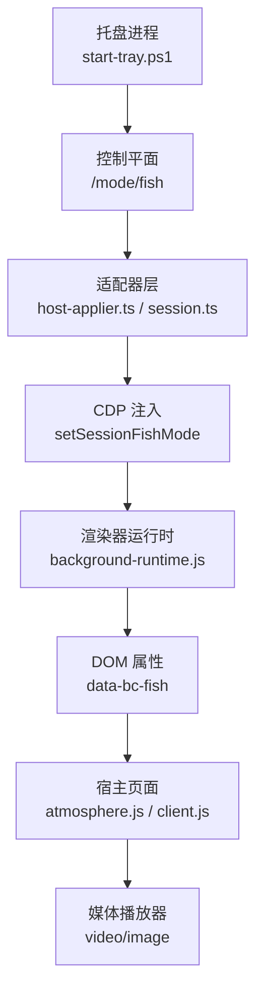
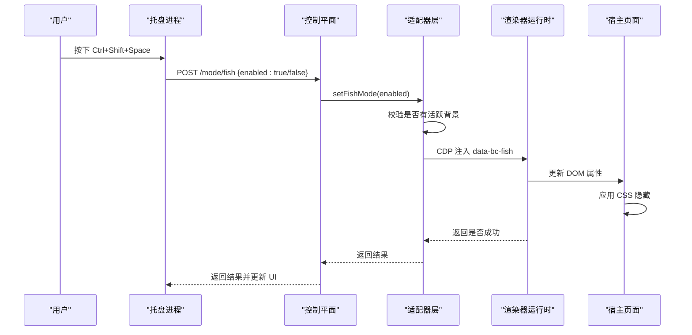
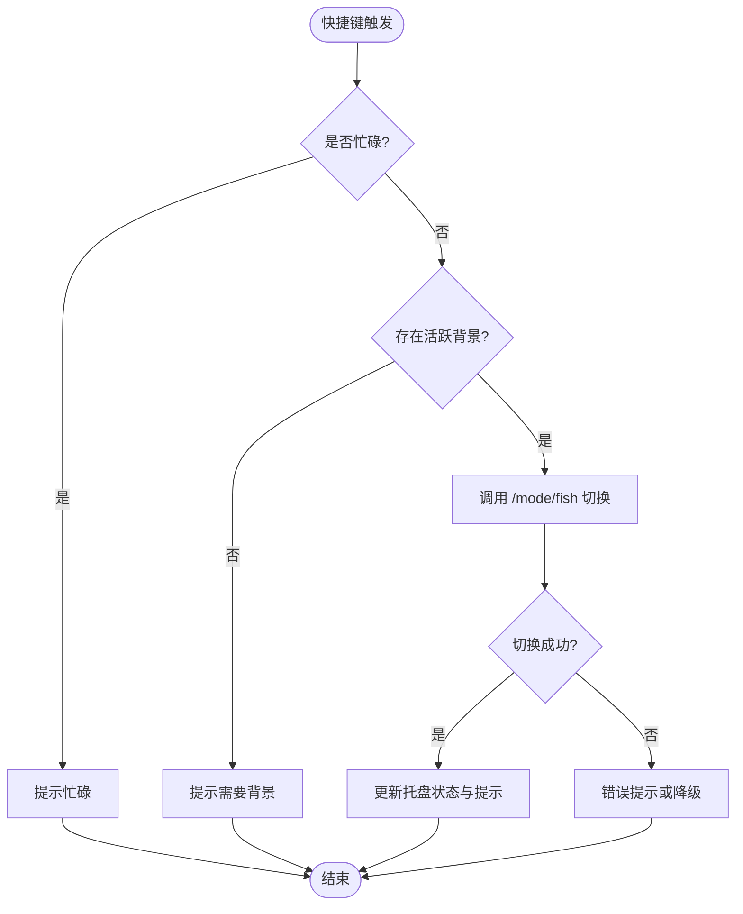
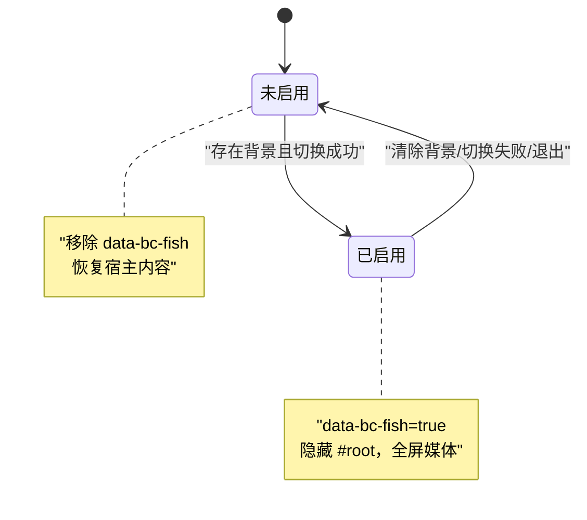
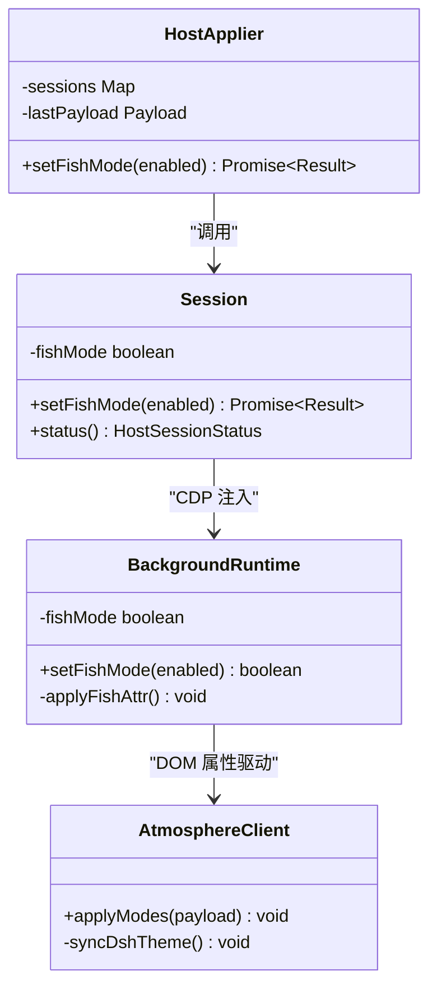
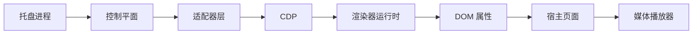

# 摸鱼模式

<cite>
**本文引用的文件**
- [apps/tray/README.md](file://apps/tray/README.md)
- [apps/tray/start-tray.ps1](file://apps/tray/start-tray.ps1)
- [packages/adapter-codex/src/host-applier.ts](file://packages/adapter-codex/src/host-applier.ts)
- [packages/adapter-codex/src/session.ts](file://packages/adapter-codex/src/session.ts)
- [packages/adapter-codex/src/renderer/background-runtime.js](file://packages/adapter-codex/src/renderer/background-runtime.js)
- [integrations/deepseek-harness/atmosphere.js](file://integrations/deepseek-harness/atmosphere.js)
- [integrations/deepseek-harness/client.js](file://integrations/deepseek-harness/client.js)
- [docs/host-adapter.md](file://docs/host-adapter.md)
- [packages/core/src/media-validation.ts](file://packages/core/src/media-validation.ts)
- [packages/core/src/media-server.ts](file://packages/core/src/media-server.ts)
- [packages/core/src/apply-transaction.ts](file://packages/core/src/apply-transaction.ts)
- [packages/adapter-codex/test/mock-cdp.js](file://packages/adapter-codex/test/mock-cdp.js)
- [packages/adapter-codex/test/adapter.test.js](file://packages/adapter-codex/test/adapter.test.js)
</cite>

## 目录
1. [简介](#简介)
2. [项目结构](#项目结构)
3. [核心组件](#核心组件)
4. [架构总览](#架构总览)
5. [详细组件分析](#详细组件分析)
6. [依赖关系分析](#依赖关系分析)
7. [性能考虑](#性能考虑)
8. [故障排除指南](#故障排除指南)
9. [结论](#结论)
10. [附录](#附录)

## 简介
本文件系统性说明“摸鱼模式”的设计与实现：在全屏背景下隐藏宿主应用内容（Chrome）、以原生亮度全屏播放媒体、通过全局快捷键 Ctrl+Shift+Space 触发、具备软输入保护与焦点管理、状态管理与持久化策略、DOM 属性注入 data-bc-fish、CSS 样式控制、媒体播放器集成，以及用户体验与配置选项。同时提供常见问题排查与优化建议。

## 项目结构
摸鱼模式横跨托盘进程、适配器层、渲染器运行时与宿主页面：
- 托盘进程负责注册全局快捷键、暴露菜单项、调用控制平面切换模式并反馈 UI。
- 适配器层封装对宿主会话的 CDP 调用，向渲染器注入 data-bc-fish 属性。
- 渲染器运行时维护 fishMode 状态、设置 DOM 属性、处理焦点与媒体静音偏好。
- 宿主页面（DeepSeek Harness）根据 data-bc-fish 切换 CSS，隐藏 #root 等宿主内容，保持背景媒体可见。

图表来源
- [apps/tray/start-tray.ps1:1665-1732](file://apps/tray/start-tray.ps1#L1665-L1732)
- [packages/adapter-codex/src/host-applier.ts:362-441](file://packages/adapter-codex/src/host-applier.ts#L362-L441)
- [packages/adapter-codex/src/renderer/background-runtime.js:543-573](file://packages/adapter-codex/src/renderer/background-runtime.js#L543-L573)
- [integrations/deepseek-harness/atmosphere.js:97-100](file://integrations/deepseek-harness/atmosphere.js#L97-L100)

章节来源
- [apps/tray/README.md:19-46](file://apps/tray/README.md#L19-L46)
- [apps/tray/start-tray.ps1:1665-1732](file://apps/tray/start-tray.ps1#L1665-L1732)

## 核心组件
- 托盘快捷键与菜单：注册 Ctrl+Shift+Space 全局热键；菜单项“摸鱼模式”可切换；退出时注销热键并关闭模式。
- 适配器层：在会话中执行 setFishMode，校验是否有活跃背景，向所有活跃 CDP 会话注入属性。
- 渲染器运行时：维护 fishMode，设置/移除 data-bc-fish，进入时主动 blur 当前焦点元素以避免误触输入框。
- 宿主页面：当 html[data-bc-fish="true"] 时隐藏 #root 及对话框，移除遮罩/滤镜，保持 pointer-events:none，使背景媒体全屏显示。
- 媒体静音：独立于摸鱼模式，默认静音；可通过控制平面切换，受浏览器自动播放策略影响可能阻塞。

章节来源
- [apps/tray/start-tray.ps1:1665-1732](file://apps/tray/start-tray.ps1#L1665-L1732)
- [packages/adapter-codex/src/host-applier.ts:362-441](file://packages/adapter-codex/src/host-applier.ts#L362-L441)
- [packages/adapter-codex/src/renderer/background-runtime.js:543-573](file://packages/adapter-codex/src/renderer/background-runtime.js#L543-L573)
- [integrations/deepseek-harness/atmosphere.js:97-100](file://integrations/deepseek-harness/atmosphere.js#L97-L100)
- [integrations/deepseek-harness/client.js:1521-1549](file://integrations/deepseek-harness/client.js#L1521-L1549)

## 架构总览
摸鱼模式的触发路径与控制流如下：

图表来源
- [apps/tray/start-tray.ps1:1665-1732](file://apps/tray/start-tray.ps1#L1665-L1732)
- [packages/adapter-codex/src/host-applier.ts:362-441](file://packages/adapter-codex/src/host-applier.ts#L362-L441)
- [packages/adapter-codex/src/renderer/background-runtime.js:543-573](file://packages/adapter-codex/src/renderer/background-runtime.js#L543-L573)
- [integrations/deepseek-harness/atmosphere.js:97-100](file://integrations/deepseek-harness/atmosphere.js#L97-L100)

## 详细组件分析

### 触发机制：全局快捷键与焦点管理
- 全局快捷键：使用 NativeWindow 注册系统级热键 Ctrl+Shift+Space；若被其他程序占用则失败软降级，托盘菜单仍可用。
- 触发逻辑：热键回调调用切换函数，先快速检查是否存在活跃背景，再调用控制平面切换；成功后提示用户。
- 焦点管理：进入摸鱼模式时在渲染器侧主动 blur 当前活动元素，降低误触输入框概率；不拦截键盘事件，避免全局键冲突。

图表来源
- [apps/tray/start-tray.ps1:1561-1607](file://apps/tray/start-tray.ps1#L1561-L1607)
- [apps/tray/start-tray.ps1:1665-1732](file://apps/tray/start-tray.ps1#L1665-L1732)
- [packages/adapter-codex/src/renderer/background-runtime.js:555-573](file://packages/adapter-codex/src/renderer/background-runtime.js#L555-L573)

章节来源
- [apps/tray/start-tray.ps1:1665-1732](file://apps/tray/start-tray.ps1#L1665-L1732)
- [apps/tray/start-tray.ps1:1561-1607](file://apps/tray/start-tray.ps1#L1561-L1607)
- [packages/adapter-codex/src/renderer/background-runtime.js:555-573](file://packages/adapter-codex/src/renderer/background-runtime.js#L555-L573)

### 状态管理：进入/退出、持久化与互斥
- 进入条件：必须存在活跃背景（图片/视频），否则拒绝进入并提示。
- 退出条件：清除背景会强制退出摸鱼模式；退出时移除 data-bc-fish。
- 持久化：摸鱼模式为进程内状态，不跨托盘重启持久化；但会在同一次会话中通过 runtime 与宿主页面属性维持。
- 互斥关系：与“视频声音”独立；与“主题色调”独立；与“应用生成/工作态”无直接互斥，但宿主页面在工作态下可能有遮罩，摸鱼模式会移除遮罩以保持背景原亮。

图表来源
- [packages/adapter-codex/src/host-applier.ts:362-441](file://packages/adapter-codex/src/host-applier.ts#L362-L441)
- [packages/adapter-codex/src/session.ts:311-351](file://packages/adapter-codex/src/session.ts#L311-L351)
- [packages/adapter-codex/src/renderer/background-runtime.js:543-573](file://packages/adapter-codex/src/renderer/background-runtime.js#L543-L573)

章节来源
- [packages/adapter-codex/src/host-applier.ts:362-441](file://packages/adapter-codex/src/host-applier.ts#L362-L441)
- [packages/adapter-codex/src/session.ts:311-351](file://packages/adapter-codex/src/session.ts#L311-L351)
- [packages/adapter-codex/src/renderer/background-runtime.js:543-573](file://packages/adapter-codex/src/renderer/background-runtime.js#L543-L573)

### 技术实现：DOM 属性注入、CSS 控制与媒体集成
- DOM 属性注入：渲染器运行时根据 fishMode 设置/移除根节点的 data-bc-fish；适配器通过 CDP 在宿主页面执行 setFishMode。
- CSS 控制：宿主页面在 html[data-bc-fish="true"] 时将 #root 设置为 opacity:0、visibility:hidden、pointer-events:none，移除遮罩与滤镜，确保背景媒体全屏可见。
- 媒体集成：视频默认静音；可通过控制平面切换静音状态；若自动播放策略阻止取消静音，保持静音并提示。

图表来源
- [packages/adapter-codex/src/host-applier.ts:362-441](file://packages/adapter-codex/src/host-applier.ts#L362-L441)
- [packages/adapter-codex/src/session.ts:351-409](file://packages/adapter-codex/src/session.ts#L351-L409)
- [packages/adapter-codex/src/renderer/background-runtime.js:543-573](file://packages/adapter-codex/src/renderer/background-runtime.js#L543-L573)
- [integrations/deepseek-harness/client.js:1521-1549](file://integrations/deepseek-harness/client.js#L1521-L1549)

章节来源
- [packages/adapter-codex/src/host-applier.ts:362-441](file://packages/adapter-codex/src/host-applier.ts#L362-L441)
- [packages/adapter-codex/src/session.ts:351-409](file://packages/adapter-codex/src/session.ts#L351-L409)
- [packages/adapter-codex/src/renderer/background-runtime.js:543-573](file://packages/adapter-codex/src/renderer/background-runtime.js#L543-L573)
- [integrations/deepseek-harness/client.js:1521-1549](file://integrations/deepseek-harness/client.js#L1521-L1549)

### 用户体验设计：平滑过渡、键盘导航与屏幕保护
- 平滑过渡：仅通过 CSS 切换 visibility/opacity，不重建媒体，避免闪烁与卡顿。
- 键盘导航：不吞掉全局按键，仅 blur 当前焦点元素，减少误输入；支持 Esc 关闭面板（非摸鱼模式本身）。
- 屏幕保护考虑：摸鱼模式不是屏保，不会阻止系统休眠；如需屏保请使用系统设置。

章节来源
- [apps/tray/README.md:39-46](file://apps/tray/README.md#L39-L46)
- [integrations/deepseek-harness/atmosphere.js:97-100](file://integrations/deepseek-harness/atmosphere.js#L97-L100)

### 配置选项
- 托盘菜单：
  - 摸鱼模式开关：与 Ctrl+Shift+Space 等效，需有活跃背景。
  - 视频声音：独立开关，默认静音；受自动播放策略限制可能保持静音。
  - 主题色调：dark/light/auto，仅影响覆盖层色调，不影响媒体。
- 快捷键：Ctrl+Shift+Space 全局切换；若冲突则失败软降级。
- 状态展示：托盘状态栏显示“摸鱼”标签与声音状态。

章节来源
- [apps/tray/README.md:19-46](file://apps/tray/README.md#L19-L46)
- [apps/tray/start-tray.ps1:1489-1507](file://apps/tray/start-tray.ps1#L1489-L1507)
- [apps/tray/start-tray.ps1:1521-1559](file://apps/tray/start-tray.ps1#L1521-L1559)

## 依赖关系分析
- 托盘进程依赖控制平面接口进行模式切换。
- 适配器层依赖 CDP 与宿主页面 runtime API 注入属性。
- 渲染器运行时依赖宿主页面的 DOM 与媒体节点，维护 fishMode 与静音偏好。
- 宿主页面依赖 CSS 规则与媒体播放器行为，响应 data-bc-fish 变化。

图表来源
- [apps/tray/start-tray.ps1:1665-1732](file://apps/tray/start-tray.ps1#L1665-L1732)
- [packages/adapter-codex/src/host-applier.ts:362-441](file://packages/adapter-codex/src/host-applier.ts#L362-L441)
- [packages/adapter-codex/src/renderer/background-runtime.js:543-573](file://packages/adapter-codex/src/renderer/background-runtime.js#L543-L573)
- [integrations/deepseek-harness/atmosphere.js:97-100](file://integrations/deepseek-harness/atmosphere.js#L97-L100)

章节来源
- [docs/host-adapter.md:39-78](file://docs/host-adapter.md#L39-L78)

## 性能考虑
- 属性切换开销低：仅修改 DOM 属性与 CSS，不重建媒体，避免重排重绘。
- 媒体验证预热：大 MP4 文件在 staging 阶段预读头部与尾部，减少冷启动卡顿。
- 多会话同步：适配器层遍历活跃会话批量注入，失败计数与错误收集，保证整体一致性。
- 静音策略：默认静音避免自动播放策略阻塞；必要时提示用户。

章节来源
- [packages/core/src/media-validation.ts:261-304](file://packages/core/src/media-validation.ts#L261-L304)
- [packages/adapter-codex/src/host-applier.ts:411-441](file://packages/adapter-codex/src/host-applier.ts#L411-L441)
- [packages/adapter-codex/src/renderer/background-runtime.js:222-232](file://packages/adapter-codex/src/renderer/background-runtime.js#L222-L232)

## 故障排除指南
- 快捷键冲突：若系统或其他程序已占用 Ctrl+Shift+Space，注册失败；使用托盘菜单作为备用入口。
- 无活跃背景：无法进入摸鱼模式；请先应用图片或视频背景。
- 媒体播放问题：视频默认静音；若尝试取消静音被浏览器策略阻止，将保持静音并提示。
- 宿主连接失败：适配器层报告“Host is not connected”或“No live CDP sessions”；检查宿主是否运行与 CDP 端口可达。
- 清理与退出：退出托盘时会注销热键并尝试关闭摸鱼模式；如异常可手动清除背景以退出。

章节来源
- [apps/tray/start-tray.ps1:1665-1732](file://apps/tray/start-tray.ps1#L1665-L1732)
- [apps/tray/start-tray.ps1:1561-1607](file://apps/tray/start-tray.ps1#L1561-L1607)
- [packages/adapter-codex/src/host-applier.ts:362-441](file://packages/adapter-codex/src/host-applier.ts#L362-L441)
- [packages/adapter-codex/src/session.ts:388-409](file://packages/adapter-codex/src/session.ts#L388-L409)

## 结论
摸鱼模式通过轻量级的 DOM 属性注入与 CSS 控制，实现了宿主内容隐藏与背景媒体全屏展示，配合全局快捷键与托盘菜单提供便捷操作。其状态管理清晰、与媒体静音和主题色调相互独立，具备良好的用户体验与可维护性。针对常见冲突与播放限制提供了友好提示与降级策略。

## 附录
- 相关测试用例验证了摸鱼模式的开启/关闭、状态同步与数据属性注入。
- 媒体服务器与事务提交流程确保背景资源的安全与一致性。

章节来源
- [packages/adapter-codex/test/adapter.test.js:747-781](file://packages/adapter-codex/test/adapter.test.js#L747-L781)
- [packages/core/src/media-server.ts:625-673](file://packages/core/src/media-server.ts#L625-L673)
- [packages/core/src/apply-transaction.ts:285-443](file://packages/core/src/apply-transaction.ts#L285-L443)