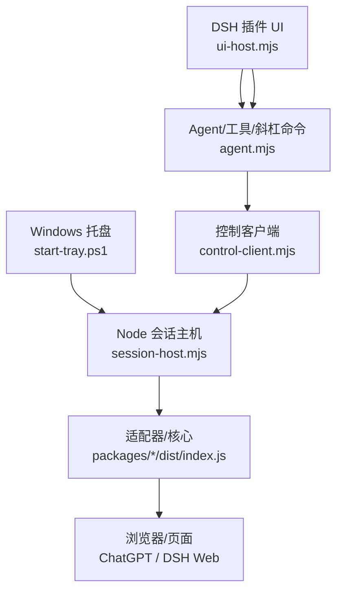
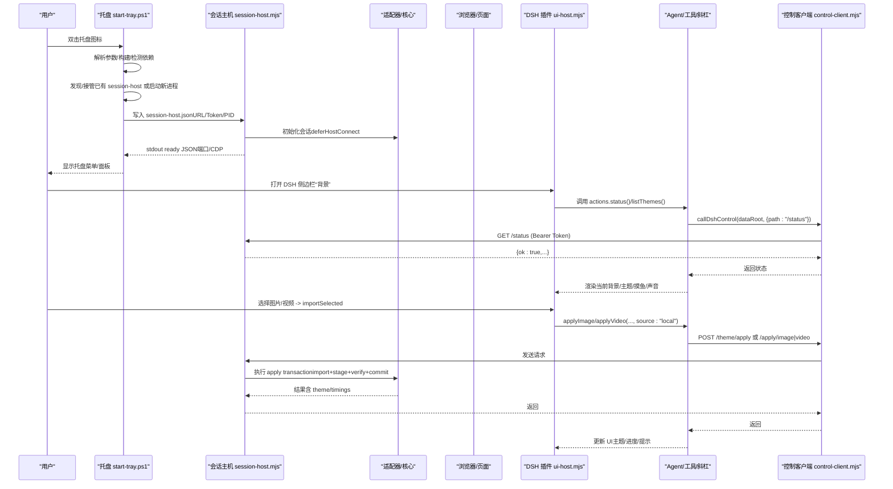
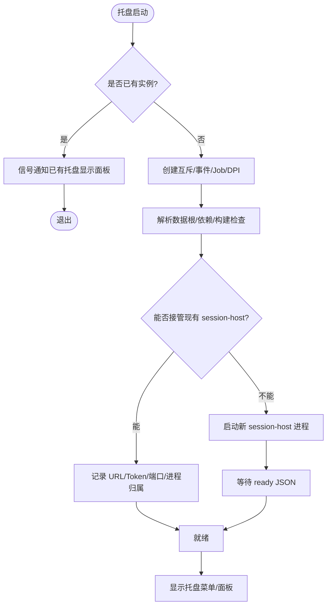
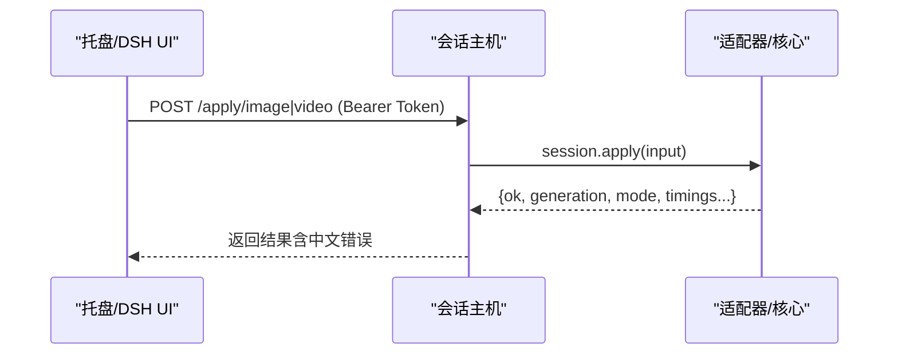
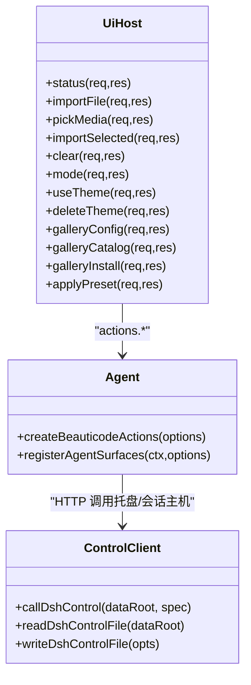
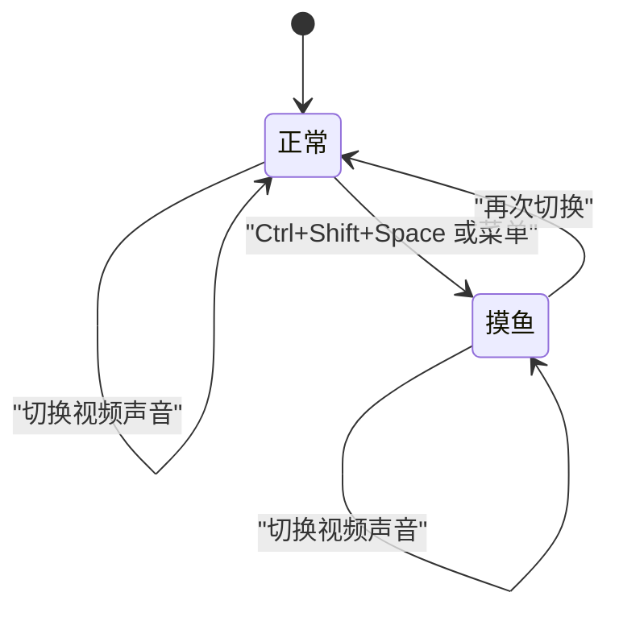
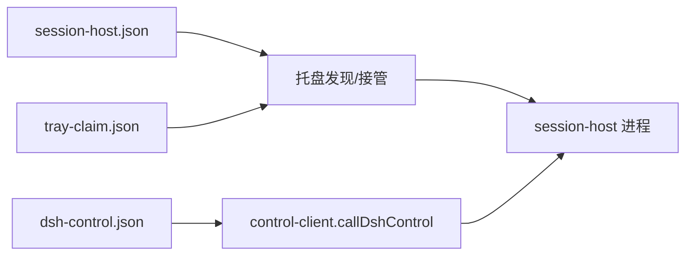

# 用户界面

<cite>
**本文引用的文件**
- [apps/tray/README.md](file://apps/tray/README.md)
- [apps/tray/start-tray.ps1](file://apps/tray/start-tray.ps1)
- [apps/tray/session-host.mjs](file://apps/tray/session-host.mjs)
- [integrations/deepseek-harness/README.zh-CN.md](file://integrations/deepseek-harness/README.zh-CN.md)
- [integrations/deepseek-harness/ui-host.mjs](file://integrations/deepseek-harness/ui-host.mjs)
- [integrations/deepseek-harness/agent.mjs](file://integrations/deepseek-harness/agent.mjs)
- [integrations/deepseek-harness/host-apply.mjs](file://integrations/deepseek-harness/host-apply.mjs)
- [integrations/deepseek-harness/control-client.mjs](file://integrations/deepseek-harness/control-client.mjs)
- [scripts/install-dsh-plugin.ps1](file://scripts/install-dsh-plugin.ps1)
</cite>

## 目录
1. [简介](#简介)
2. [项目结构](#项目结构)
3. [核心组件](#核心组件)
4. [架构总览](#架构总览)
5. [详细组件分析](#详细组件分析)
6. [依赖关系分析](#依赖关系分析)
7. [性能与可用性](#性能与可用性)
8. [故障排查指南](#故障排查指南)
9. [结论](#结论)
10. [附录：扩展与最佳实践](#附录：扩展与最佳实践)

## 简介
本文件面向 beautiCode 的用户界面与系统集成，重点覆盖 Windows 系统托盘应用、DeepSeek Harness（DSH）插件的侧边栏集成、命令工具与斜杠命令、摸鱼模式的全屏背景展示、状态管理与用户交互，以及主题与响应式考虑。文档同时给出启动流程、进程管理、与核心模块通信机制、常见问题与优化建议。

## 项目结构
beautiCode 的“界面”由两部分组成：
- Windows 托盘程序：基于 PowerShell + WinForms 的轻量托盘入口，通过本地回环 HTTP 控制通道与 Node 会话主机通信，驱动核心模块注入背景到浏览器。
- DSH 插件 UI：在 DeepSeek Harness Web 中提供“背景”面板，支持图片/视频选择、主题保存/切换、声音开关、皮肤中心安装等。

图表来源
- [apps/tray/start-tray.ps1:1-120](file://apps/tray/start-tray.ps1#L1-L120)
- [apps/tray/session-host.mjs:1-60](file://apps/tray/session-host.mjs#L1-L60)
- [integrations/deepseek-harness/ui-host.mjs:302-340](file://integrations/deepseek-harness/ui-host.mjs#L302-L340)
- [integrations/deepseek-harness/agent.mjs:176-236](file://integrations/deepseek-harness/agent.mjs#L176-L236)
- [integrations/deepseek-harness/control-client.mjs:463-516](file://integrations/deepseek-harness/control-client.mjs#L463-L516)

章节来源
- [apps/tray/README.md:5-55](file://apps/tray/README.md#L5-L55)
- [integrations/deepseek-harness/README.zh-CN.md:1-49](file://integrations/deepseek-harness/README.zh-CN.md#L1-L49)

## 核心组件
- 托盘启动器（PowerShell）：负责单实例互斥、DPI 感知、Job Object 子进程生命周期管理、发现/复用已有 session-host、启动或接管会话主机、写入 tray-claim。
- 会话主机（Node）：监听 127.0.0.1 随机端口，鉴权后暴露健康检查、状态查询、背景应用、主题管理、摸鱼/静音/色调控制、重启/关闭等接口；通过适配器调用核心模块完成注入与验证。
- DSH 插件 UI：提供文件选择器、导入/应用、主题列表/使用/删除、内置预设、皮肤中心等能力；可复用托盘或启动内嵌会话。
- Agent/工具/斜杠命令：将“设置背景/切换主题/清除/摸鱼/静音”等能力注册为 DSH 对话工具与斜杠命令，供 AI 或用户直接调用。
- 控制客户端：统一读写数据根下的控制文件（dsh-control.json、session-host.json、tray-claim.json），校验 URL 与令牌，封装对托盘/会话主机的安全调用。

章节来源
- [apps/tray/start-tray.ps1:71-124](file://apps/tray/start-tray.ps1#L71-L124)
- [apps/tray/session-host.mjs:1-25](file://apps/tray/session-host.mjs#L1-L25)
- [integrations/deepseek-harness/ui-host.mjs:302-340](file://integrations/deepseek-harness/ui-host.mjs#L302-L340)
- [integrations/deepseek-harness/agent.mjs:546-751](file://integrations/deepseek-harness/agent.mjs#L546-L751)
- [integrations/deepseek-harness/control-client.mjs:219-266](file://integrations/deepseek-harness/control-client.mjs#L219-L266)

## 架构总览
托盘与 DSH 插件共享同一套“控制面协议”和“数据根”，通过文件契约与本地 HTTP 进行解耦协作。托盘作为常驻后台，优先被复用；若未运行，DSH 插件可在进程内拉起会话。

图表来源
- [apps/tray/start-tray.ps1:663-798](file://apps/tray/start-tray.ps1#L663-L798)
- [apps/tray/session-host.mjs:290-540](file://apps/tray/session-host.mjs#L290-L540)
- [integrations/deepseek-harness/ui-host.mjs:593-668](file://integrations/deepseek-harness/ui-host.mjs#L593-L668)
- [integrations/deepseek-harness/agent.mjs:190-236](file://integrations/deepseek-harness/agent.mjs#L190-L236)
- [integrations/deepseek-harness/control-client.mjs:463-516](file://integrations/deepseek-harness/control-client.mjs#L463-L516)

## 详细组件分析

### Windows 托盘应用：界面设计、菜单项与快捷键
- 界面形态：无额外 Electron 壳层，采用原生 WinForms 无边框控制面板，配合 ContextMenuStrip 作为降级菜单。
- 菜单功能要点：
  - 状态显示：运行/忙碌、当前媒体类型（含摸鱼）。
  - 应用/重应用：确保 ChatGPT/Codex 已启动并导入默认背景。
  - 更改图片/视频：系统对话框选择文件，应用并验证。
  - 清除背景：清除并退出摸鱼。
  - 摸鱼模式：全局快捷键 Ctrl+Shift+Space 切换；仅属性注入，不重建媒体。
  - 视频声音：独立于摸鱼模式的静音开关，默认静音。
  - 主题保存/恢复/删除：保存当前媒体（视频保留播放位置）、恢复主题、删除主题。
  - 退出：清理摸鱼、停止会话主机、注销热键、移除托盘图标。
- 快捷键：
  - 全局切换摸鱼：Ctrl+Shift+Space（软失败时仍可通过菜单操作）。
- 安全与边界：
  - 控制服务器仅绑定 127.0.0.1；所有写操作需 Bearer Token。
  - 文件选择走系统对话框；路径经核心媒体门限校验。
  - 调试地址强制 loopback。

章节来源
- [apps/tray/README.md:19-55](file://apps/tray/README.md#L19-L55)
- [apps/tray/start-tray.ps1:71-124](file://apps/tray/start-tray.ps1#L71-L124)
- [apps/tray/start-tray.ps1:607-685](file://apps/tray/start-tray.ps1#L607-L685)

### 启动流程与进程管理
- 单实例与互斥：使用命名互斥量避免重复托盘；若已存在则触发已有托盘显示面板。
- DPI 感知：启用 Per-Monitor V2 或 DPIAware，保证高分屏下 UI 清晰。
- Job Object：将子进程纳入 Job，父进程退出时自动回收。
- 会话主机发现与接管：
  - 轮询读取 dataRoot 中的 session-host.json/dsh-control.json，校验存活与健康。
  - 若目标 host 不一致或不可用，尝试终止残留进程。
  - 若无可接管实例，启动新的 Node 会话主机进程，并通过 stdin 传递控制令牌。
  - 等待 stdout 输出 ready JSON，记录控制端口与 CDP 端口。
- 数据根与日志：
  - 数据根优先级：参数 > 环境变量 > LOCALAPPDATA/beautiCode > ~/.beauticode。
  - 日志写入 %LOCALAPPDATA%/beautiCode/logs/tray.log。

图表来源
- [apps/tray/start-tray.ps1:71-124](file://apps/tray/start-tray.ps1#L71-L124)
- [apps/tray/start-tray.ps1:500-559](file://apps/tray/start-tray.ps1#L500-L559)
- [apps/tray/start-tray.ps1:663-798](file://apps/tray/start-tray.ps1#L663-L798)

章节来源
- [apps/tray/start-tray.ps1:1-124](file://apps/tray/start-tray.ps1#L1-L124)
- [apps/tray/start-tray.ps1:496-559](file://apps/tray/start-tray.ps1#L496-L559)
- [apps/tray/start-tray.ps1:663-798](file://apps/tray/start-tray.ps1#L663-L798)

### 与核心模块的通信机制
- 会话主机暴露的 HTTP API（均要求 Authorization: Bearer <token>）：
  - GET /health、/status、/guidance
  - POST /discover
  - POST /apply/image、/apply/video、/apply/clear、/reapply
  - POST /theme/apply、/theme/save、/theme/list、/theme/use、/theme/delete
  - POST /mode/fish、/mode/muted、/mode/tone
  - POST /shutdown
- 认证与安全：
  - 随机 Bearer Token，长度至少 24 字符，进程间通过环境变量传递并在子进程启动后立即删除。
  - 仅监听 127.0.0.1；请求体大小限制；超时与连接数限制。
- 适配器与核心：
  - 根据 --host 动态加载 adapter-codex 或 adapter-dsh，构造对应 Session 类。
  - 支持 deferHostConnect 以先快速返回 UI，再后台连接与首次发布。
  - 错误信息通过 toChineseErrorMessage 转中文。

图表来源
- [apps/tray/session-host.mjs:290-540](file://apps/tray/session-host.mjs#L290-L540)
- [apps/tray/session-host.mjs:109-198](file://apps/tray/session-host.mjs#L109-L198)

章节来源
- [apps/tray/session-host.mjs:1-60](file://apps/tray/session-host.mjs#L1-L60)
- [apps/tray/session-host.mjs:290-540](file://apps/tray/session-host.mjs#L290-L540)

### DeepSeek Harness 插件：侧边栏集成、命令工具与斜杠命令
- 侧边栏“背景”：
  - 支持图片/视频选择（Windows 原生文件选择器），非 Windows 环境保留上传兼容但明确提示会保存托管副本。
  - 支持保存主题、恢复主题、删除主题、清空背景、开关声音、应用内置预设、打开皮肤中心。
  - 本地导入仅在 Node 端保存绝对路径，通过带 Range 的回环媒体服务读取原文件，不复制大文件。
- 工具与斜杠命令：
  - 工具：beauticode_apply_image、beauticode_apply_video、beauticode_theme_list、beauticode_theme_use、beauticode_clear、beauticode_status、beauticode_set_fish、beauticode_set_muted。
  - 斜杠命令：/bg、/bg-theme、/bg-clear。
  - 这些能力既可经由 DSH 插件 UI 使用，也可通过 AI 工具/斜杠命令调用，无需托盘。
- 后端路由策略：
  - 若检测到托盘在线，优先委托给托盘处理；否则尝试进程内会话；若托盘正在启动则提示稍后再试。

图表来源
- [integrations/deepseek-harness/ui-host.mjs:302-798](file://integrations/deepseek-harness/ui-host.mjs#L302-L798)
- [integrations/deepseek-harness/agent.mjs:176-751](file://integrations/deepseek-harness/agent.mjs#L176-L751)
- [integrations/deepseek-harness/control-client.mjs:219-516](file://integrations/deepseek-harness/control-client.mjs#L219-L516)

章节来源
- [integrations/deepseek-harness/README.zh-CN.md:1-49](file://integrations/deepseek-harness/README.zh-CN.md#L1-L49)
- [integrations/deepseek-harness/ui-host.mjs:302-798](file://integrations/deepseek-harness/ui-host.mjs#L302-L798)
- [integrations/deepseek-harness/agent.mjs:546-751](file://integrations/deepseek-harness/agent.mjs#L546-L751)

### 摸鱼模式：全屏背景展示、状态管理与交互
- 触发方式：托盘菜单或全局快捷键 Ctrl+Shift+Space。
- 行为特性：
  - 仅向内容区域注入属性（data-bc-fish），不重建媒体或增加生成计数。
  - 窗口标题栏/任务栏保持宿主可见；输入防误触（透明、无指针、模糊）。
  - 不持久化，托盘重启不记忆。
- 状态同步：
  - 通过 /mode/fish 切换；状态可由 /status 获取。
  - 与视频声音开关相互独立。

图表来源
- [apps/tray/README.md:39-46](file://apps/tray/README.md#L39-L46)
- [apps/tray/session-host.mjs:493-521](file://apps/tray/session-host.mjs#L493-L521)
- [integrations/deepseek-harness/agent.mjs:466-512](file://integrations/deepseek-harness/agent.mjs#L466-L512)

章节来源
- [apps/tray/README.md:39-46](file://apps/tray/README.md#L39-L46)
- [apps/tray/session-host.mjs:493-521](file://apps/tray/session-host.mjs#L493-L521)

### 界面定制选项、主题支持与响应式设计
- 主题：
  - 支持保存当前图片/视频为“主题”，视频主题记录播放位置，恢复时续播。
  - 内置预设（如 internal/infernal）可一键应用并设置色调。
  - 主题列表/使用/删除通过 /theme/* 接口管理。
- 色调：
  - 支持 dark/light/auto 三种背景色调，通过 /mode/tone 切换。
- 响应式与多显示器：
  - 托盘面板吸附到活动工作区；DPI 感知开启，适配高分屏。
  - 视频主题进度按主题粒度持续节流写入，切换或清除时停止写入但不擦除最后位置。

章节来源
- [apps/tray/README.md:47-55](file://apps/tray/README.md#L47-L55)
- [apps/tray/session-host.mjs:420-492](file://apps/tray/session-host.mjs#L420-L492)
- [apps/tray/session-host.mjs:513-521](file://apps/tray/session-host.mjs#L513-L521)
- [integrations/deepseek-harness/ui-host.mjs:773-795](file://integrations/deepseek-harness/ui-host.mjs#L773-L795)

## 依赖关系分析
- 托盘与 DSH 插件通过 dataRoot 下的控制文件协同：
  - dsh-control.json：DSH 插件发现托盘/会话主机控制端点与令牌。
  - session-host.json：托盘/插件发现并复用已有的会话主机。
  - tray-claim.json：标记托盘进程声明，防止冲突。
- 插件安装与接入：
  - install-dsh-plugin.ps1 将插件链接到 DSH web profile，并写入 cordis.patch.yml。
  - 支持移除与清理。

图表来源
- [integrations/deepseek-harness/control-client.mjs:219-516](file://integrations/deepseek-harness/control-client.mjs#L219-L516)
- [scripts/install-dsh-plugin.ps1:154-179](file://scripts/install-dsh-plugin.ps1#L154-L179)
- [scripts/install-dsh-plugin.ps1:277-297](file://scripts/install-dsh-plugin.ps1#L277-L297)

章节来源
- [integrations/deepseek-harness/control-client.mjs:219-516](file://integrations/deepseek-harness/control-client.mjs#L219-L516)
- [scripts/install-dsh-plugin.ps1:154-179](file://scripts/install-dsh-plugin.ps1#L154-L179)
- [scripts/install-dsh-plugin.ps1:277-297](file://scripts/install-dsh-plugin.ps1#L277-L297)

## 性能与可用性
- 快速启动：托盘优先复用已有会话主机，避免重复启动开销。
- 后台连接：会话主机支持 deferHostConnect，UI 立即可用，连接与首次发布在后台进行。
- 资源保护：
  - 请求体大小限制、连接超时、keepAlive 与每 socket 最大请求数限制。
  - 视频/图片导入大小限制与流式处理，避免内存溢出。
- 用户体验：
  - 文件选择器超时与取消机制，避免卡死。
  - 错误信息中文友好，便于定位问题。

[本节为通用指导，不直接分析具体文件]

## 故障排查指南
- 无法连接托盘/会话主机：
  - 检查 dataRoot 下是否存在有效的 dsh-control.json 或 session-host.json。
  - 确认 URL 为 127.0.0.1 且端口可达；令牌长度与格式正确。
- 托盘启动失败：
  - 查看 %LOCALAPPDATA%\beautiCode\logs\tray.log。
  - 确认 Node.js 版本满足要求；依赖 DLL/Assembly 可用。
- 文件选择器不可用：
  - Windows 上需要 PowerShell 与 WinForms；若非 Windows 环境，可能退化为托管上传（有提示）。
- 导入失败：
  - 检查路径是否为本机绝对路径；文件格式是否受支持；文件大小是否超限。
  - 关注返回码与错误消息（400/413/422/501 等）。
- 摸鱼模式无效：
  - 确保已有背景；快捷键可能被其他应用占用（软失败不影响菜单）。
- 声音无法开启：
  - 浏览器自动播放策略可能阻止开音；UI 会提示继续静音播放。

章节来源
- [apps/tray/start-tray.ps1:23-61](file://apps/tray/start-tray.ps1#L23-L61)
- [integrations/deepseek-harness/ui-host.mjs:115-258](file://integrations/deepseek-harness/ui-host.mjs#L115-L258)
- [integrations/deepseek-harness/control-client.mjs:463-516](file://integrations/deepseek-harness/control-client.mjs#L463-L516)

## 结论
beautiCode 的界面体系以“托盘 + DSH 插件”双轨实现：托盘提供稳定可靠的后台控制与全局快捷键，DSH 插件提供丰富的侧边栏体验与对话级能力。两者通过统一的数据根与控制协议协作，既保证了安全性（回环、令牌、最小权限），又兼顾了易用性（系统文件选择器、主题管理、内置预设）。在扩展方面，新增工具/斜杠命令或 UI 功能应遵循现有抽象（actions、control-client、session-host 接口），并保持错误信息与用户体验的一致性。

## 附录：扩展与最佳实践
- 新增托盘菜单项：
  - 在托盘脚本中添加菜单项与事件处理，必要时调用 session-host 的 /theme/* 或 /mode/* 接口。
  - 注意权限校验与错误提示。
- 新增 DSH 插件功能：
  - 在 ui-host.mjs 中新增路由处理器，复用 actions 与 gallery 能力。
  - 如需对话能力，在 agent.mjs 中注册工具或斜杠命令，并确保 schema 与超时合理。
- 安全与健壮性：
  - 所有写操作必须鉴权；URL 必须为回环；严格校验输入参数。
  - 使用原子写入控制文件，避免并发竞争。
- 性能优化：
  - 大文件导入使用流式处理与大小限制。
  - 长耗时操作提供超时与取消信号。
- 兼容性：
  - 非 Windows 环境保留上传兼容，但明确提示差异。
  - 多显示器与 DPI 感知已在托盘层处理。

章节来源
- [integrations/deepseek-harness/ui-host.mjs:302-798](file://integrations/deepseek-harness/ui-host.mjs#L302-L798)
- [integrations/deepseek-harness/agent.mjs:546-751](file://integrations/deepseek-harness/agent.mjs#L546-L751)
- [integrations/deepseek-harness/control-client.mjs:42-81](file://integrations/deepseek-harness/control-client.mjs#L42-L81)