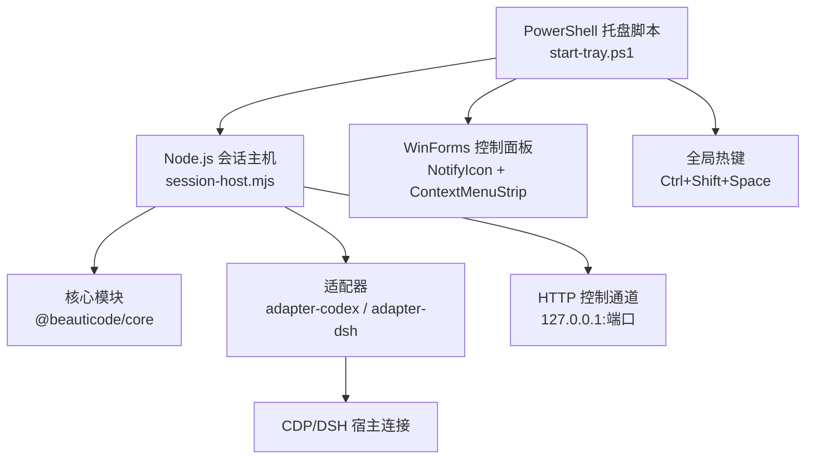
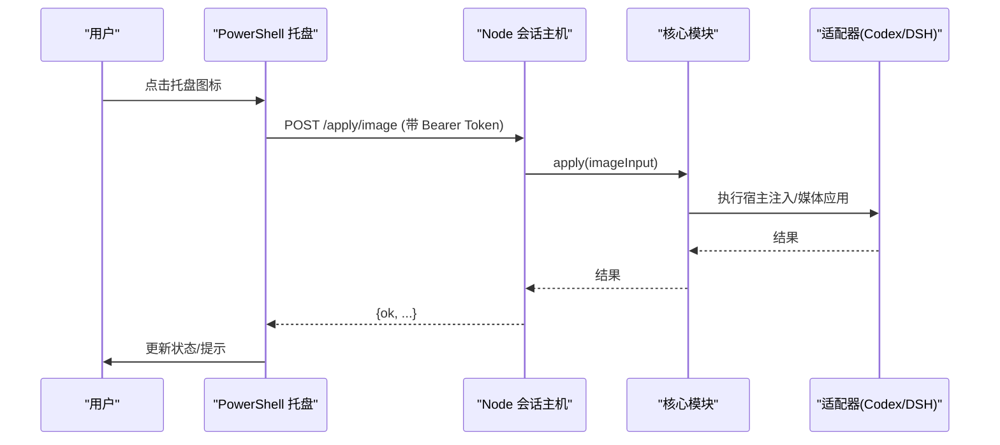
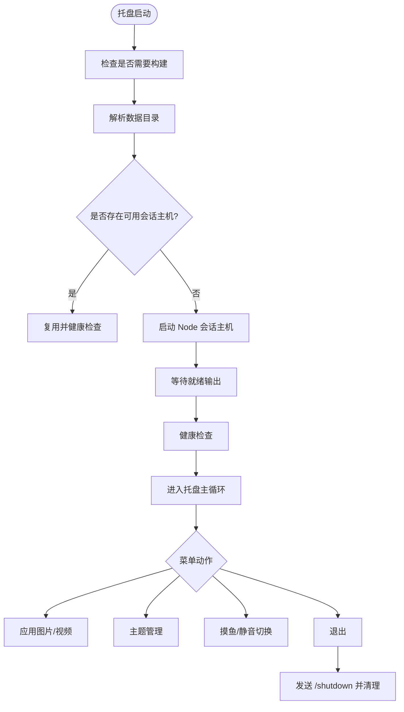
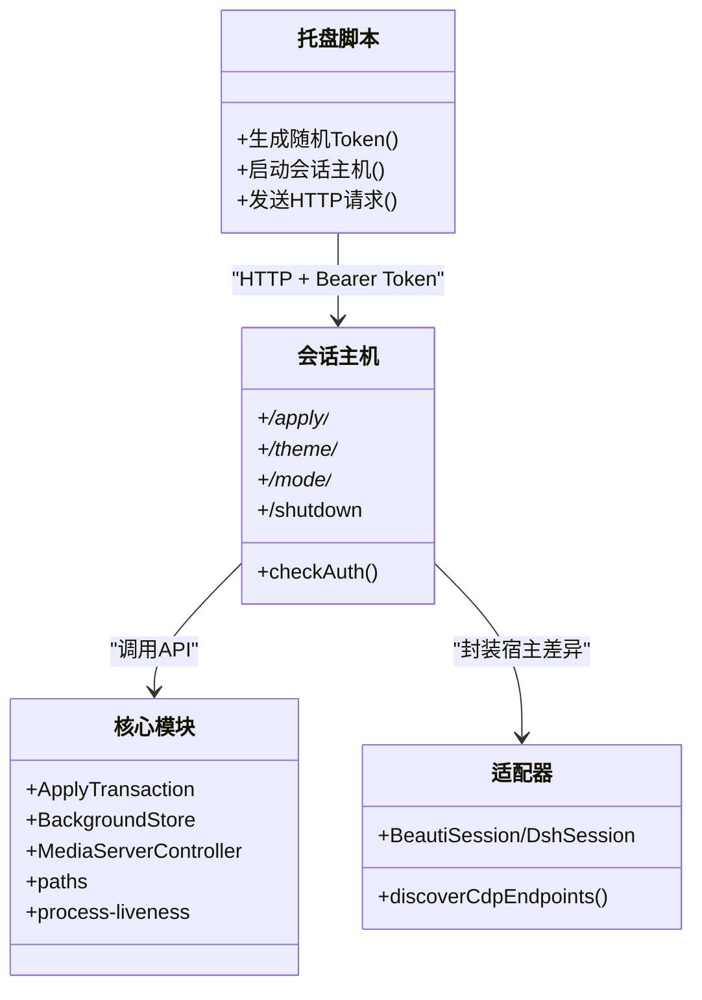
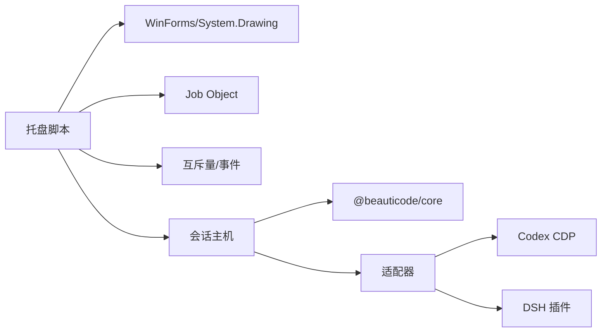

# 系统托盘应用

<cite>
**本文引用的文件**
- [apps/tray/README.md](file://apps/tray/README.md)
- [apps/tray/start-tray.ps1](file://apps/tray/start-tray.ps1)
- [apps/tray/session-host.mjs](file://apps/tray/session-host.mjs)
- [scripts/codex-launch.ps1](file://scripts/codex-launch.ps1)
- [packages/core/src/index.ts](file://packages/core/src/index.ts)
- [packages/adapter-codex/src/session.ts](file://packages/adapter-codex/src/session.ts)
</cite>

## 目录
1. [简介](#简介)
2. [项目结构](#项目结构)
3. [核心组件](#核心组件)
4. [架构总览](#架构总览)
5. [详细组件分析](#详细组件分析)
6. [依赖关系分析](#依赖关系分析)
7. [性能考虑](#性能考虑)
8. [故障排查指南](#故障排查指南)
9. [结论](#结论)
10. [附录](#附录)

## 简介
本仓库的 Windows 系统托盘应用为 beautiCode 提供轻量级、无 Electron 的托盘入口。它通过 PowerShell 原生 NotifyIcon + WinForms 控制面板，配合一个 Node.js 会话主机（session-host），在本地回环地址上暴露 HTTP 控制通道，并使用随机 Bearer Token 进行鉴权。托盘菜单支持状态显示、背景图片/视频选择与清理、主题保存/恢复、摸鱼模式切换、视频静音切换等常用操作；同时支持全局快捷键 Ctrl+Shift+Space 快速切换摸鱼模式。

## 项目结构
- apps/tray：托盘入口与 UI、会话主机启动与管理逻辑
  - start-tray.ps1：托盘主脚本，负责进程管理、UI、热键、配置解析、与 session-host 通信
  - session-host.mjs：Node.js 本地 HTTP 控制面，封装对核心模块与适配器的调用
  - README.md：设计说明、菜单项行为、安全注意事项
- scripts：辅助脚本
  - codex-launch.ps1：Codex/ChatGPT 桌面应用的发现、启动与优雅关闭
- packages/core：核心能力（媒体事务、存储、路径、验证、进程存活检测等）
- packages/adapter-codex / adapter-dsh：适配器实现，屏蔽不同宿主差异，对外暴露统一会话接口

图表来源
- [apps/tray/start-tray.ps1:698-798](file://apps/tray/start-tray.ps1#L698-L798)
- [apps/tray/session-host.mjs:290-540](file://apps/tray/session-host.mjs#L290-L540)
- [scripts/codex-launch.ps1:200-235](file://scripts/codex-launch.ps1#L200-L235)

章节来源
- [apps/tray/README.md:5-17](file://apps/tray/README.md#L5-L17)
- [apps/tray/start-tray.ps1:1-12](file://apps/tray/start-tray.ps1#L1-L12)

## 核心组件
- 托盘 UI 与交互层（PowerShell + WinForms）
  - 使用 NotifyIcon 作为常驻图标，ContextMenuStrip 作为降级菜单
  - 自定义无边框 WinForms 面板作为主要界面，支持 ESC 关闭、焦点丢失自动隐藏、多显示器工作区限制
  - 内置 Toggle 控件用于开关类选项（如视频静音）
- 会话主机（Node.js）
  - 监听 127.0.0.1 的随机端口，要求 Authorization: Bearer <token>
  - 暴露 /health、/status、/apply/*、/theme/*、/mode/*、/discover、/shutdown 等路由
  - 通过 core 与适配器完成媒体应用、主题管理、摸鱼模式、视频静音等
- 适配器与核心模块
  - 适配器封装 Codex/DSH 的差异，对外暴露 BeautiSession/DshSession
  - 核心模块提供媒体事务、存储、路径、验证、进程存活检测等基础能力

章节来源
- [apps/tray/start-tray.ps1:277-395](file://apps/tray/start-tray.ps1#L277-L395)
- [apps/tray/session-host.mjs:290-540](file://apps/tray/session-host.mjs#L290-L540)
- [packages/core/src/index.ts:1-19](file://packages/core/src/index.ts#L1-L19)
- [packages/adapter-codex/src/session.ts:27-41](file://packages/adapter-codex/src/session.ts#L27-L41)

## 架构总览
托盘应用采用“PowerShell 托盘 + Node 会话主机”的双进程模型：
- PowerShell 进程负责 UI、用户交互、进程生命周期管理、全局热键注册
- Node 会话主机负责与核心/适配器交互，并通过本地 HTTP 暴露受控 API
- 两者通过随机 Bearer Token 认证的安全通道通信，仅绑定 127.0.0.1

图表来源
- [apps/tray/start-tray.ps1:698-798](file://apps/tray/start-tray.ps1#L698-L798)
- [apps/tray/session-host.mjs:363-418](file://apps/tray/session-host.mjs#L363-L418)
- [packages/adapter-codex/src/session.ts:27-41](file://packages/adapter-codex/src/session.ts#L27-L41)

## 详细组件分析

### 托盘界面设计与交互
- 设计原则
  - 不使用第二份 Electron shell，保持轻量
  - 主界面为深色“墨控制台”风格的无边框 WinForms 面板
  - 保留原生 ContextMenuStrip 作为降级菜单，承载已保存主题子菜单
- 菜单项功能
  - 状态显示：运行中/忙碌、当前媒体类型、是否处于摸鱼模式；不显示 CDP/生成细节
  - 应用或重新应用：确保宿主运行并导入默认（活动）背景
  - 更改图片/视频：打开系统对话框选择文件，应用并实时校验
  - 清除背景：清除并校验，退出摸鱼模式
  - 摸鱼模式：切换属性标记，全屏媒体、原生亮度；无活动背景时拒绝
  - 视频声音：独立于摸鱼模式的静音切换，默认静音；若被浏览器策略阻止则保持静音并提示
  - 保存当前主题：持久化当前图片/视频（视频包含播放位置）
  - 已保存主题：恢复上次保存的主题（视频恢复到上次位置）
  - 删除已保存主题：确认后移除
  - 退出：必要时退出摸鱼模式、停止会话主机、注销热键、移除托盘图标
- 窗口与焦点管理
  - 面板在鼠标离开或按 ESC 时关闭
  - 面板始终吸附到当前活动显示器的工作区内
  - 使用定时器在失焦后延迟隐藏，避免误触

章节来源
- [apps/tray/README.md:19-55](file://apps/tray/README.md#L19-L55)
- [apps/tray/start-tray.ps1:2459-2496](file://apps/tray/start-tray.ps1#L2459-L2496)
- [apps/tray/start-tray.ps1:2831-2858](file://apps/tray/start-tray.ps1#L2831-L2858)

### 启动流程与进程管理
- 启动入口
  - 从仓库根目录执行 npm run tray，或直接运行 PowerShell 脚本
  - 参数支持 Port、DataRoot、NodePath、TargetHost、DshUrl、SkipBuild
- 构建与依赖检查
  - 若 dist 缺失或源文件更新，触发构建
  - 校验必需运行时文件存在（host 脚本、core、adapter）
- 数据目录解析
  - 优先级：命令行 DataRoot > 环境变量 BEAUTICODE_DATA_ROOT > LOCALAPPDATA/beautiCode > 用户目录 .beauticode
- 会话主机启动
  - 通过 PowerShell 桥接将随机 Bearer Token 以标准输入方式传递给子进程，设置子进程专属环境变量
  - 启动 Node 会话主机，等待其输出就绪 JSON（包含 controlPort、cdpPort）
  - 将子进程加入 Job Object，以便父进程退出时回收
- 健康检查与复用
  - 启动前尝试读取已有控制文件，校验健康后复用现有会话主机
  - 若检测到残留进程，尝试优雅停止
- 宿主应用管理（Codex）
  - 发现并启动 Codex/ChatGPT 桌面应用，强制使用 127.0.0.1 调试端口
  - 提供优雅关闭与强制终止两种策略

图表来源
- [apps/tray/start-tray.ps1:432-476](file://apps/tray/start-tray.ps1#L432-L476)
- [apps/tray/start-tray.ps1:500-559](file://apps/tray/start-tray.ps1#L500-L559)
- [apps/tray/start-tray.ps1:637-685](file://apps/tray/start-tray.ps1#L637-L685)
- [apps/tray/start-tray.ps1:698-798](file://apps/tray/start-tray.ps1#L698-L798)
- [scripts/codex-launch.ps1:200-235](file://scripts/codex-launch.ps1#L200-L235)

章节来源
- [apps/tray/start-tray.ps1:1-12](file://apps/tray/start-tray.ps1#L1-L12)
- [apps/tray/start-tray.ps1:432-476](file://apps/tray/start-tray.ps1#L432-L476)
- [apps/tray/start-tray.ps1:500-559](file://apps/tray/start-tray.ps1#L500-L559)
- [apps/tray/start-tray.ps1:637-685](file://apps/tray/start-tray.ps1#L637-L685)
- [apps/tray/start-tray.ps1:698-798](file://apps/tray/start-tray.ps1#L698-L798)
- [scripts/codex-launch.ps1:200-235](file://scripts/codex-launch.ps1#L200-L235)

### 与核心模块的通信机制与安全协议
- 控制通道
  - 仅绑定 127.0.0.1，端口由 Node 会话主机随机分配
  - 所有变更路由需携带 Authorization: Bearer <token>
  - Token 由 PowerShell 侧生成并通过子进程环境变量传递，不在命令行暴露
- 认证实现
  - 会话主机使用常量时间比较校验请求头中的 Bearer Token
- 核心调用
  - 会话主机通过适配器调用核心模块的媒体事务、存储、路径、验证等功能
  - 错误信息统一转换为中文便于 UI 展示

图表来源
- [apps/tray/session-host.mjs:279-288](file://apps/tray/session-host.mjs#L279-L288)
- [apps/tray/session-host.mjs:290-540](file://apps/tray/session-host.mjs#L290-L540)
- [packages/core/src/index.ts:1-19](file://packages/core/src/index.ts#L1-L19)
- [packages/adapter-codex/src/session.ts:27-41](file://packages/adapter-codex/src/session.ts#L27-L41)

章节来源
- [apps/tray/README.md:75-85](file://apps/tray/README.md#L75-L85)
- [apps/tray/session-host.mjs:279-288](file://apps/tray/session-host.mjs#L279-L288)
- [apps/tray/start-tray.ps1:687-727](file://apps/tray/start-tray.ps1#L687-L727)

### 摸鱼模式与全局热键
- 快捷键
  - 全局热键 Ctrl+Shift+Space 可切换摸鱼模式（进入/退出）
  - 若其他应用已占用该组合键，托盘仍正常工作，仅提示失败
- 行为特性
  - 仅作用于内容区域，不影响标题栏/任务栏
  - 通过属性标记实现，不重建媒体或增加生成次数
  - 软输入保护：不可见、无指针、失焦；不吞掉全局按键
- 状态同步
  - 通过 /mode/fish 接口切换，UI 即时反映状态

章节来源
- [apps/tray/README.md:39-46](file://apps/tray/README.md#L39-L46)
- [apps/tray/start-tray.ps1:2911-2913](file://apps/tray/start-tray.ps1#L2911-L2913)
- [apps/tray/session-host.mjs:493-501](file://apps/tray/session-host.mjs#L493-L501)

### 配置选项与数据目录
- 启动参数
  - Port：指定会话主机端口（可选）
  - DataRoot：数据目录（优先使用，其次环境变量，最后默认路径）
  - NodePath：指定 Node.js 可执行文件路径
  - TargetHost：目标宿主（codex 或 dsh）
  - DshUrl：DSH Web 地址（当 TargetHost=dsh 时使用）
  - SkipBuild：跳过构建
- 数据目录
  - 默认位于 %LOCALAPPDATA%\beautiCode，也可通过环境变量覆盖
  - 会话主机将控制文件写入该目录，供多实例识别与健康检查

章节来源
- [apps/tray/start-tray.ps1:1-10](file://apps/tray/start-tray.ps1#L1-L10)
- [apps/tray/start-tray.ps1:500-509](file://apps/tray/start-tray.ps1#L500-L509)
- [apps/tray/start-tray.ps1:698-715](file://apps/tray/start-tray.ps1#L698-L715)

## 依赖关系分析
- 托盘脚本依赖
  - WinForms 与 System.Drawing 用于 UI
  - 系统互斥量与事件对象用于单实例与跨进程信号
  - Job Object 用于子进程组生命周期管理
- 会话主机依赖
  - Node.js 22+
  - @beauticode/core 提供的媒体事务、存储、路径、验证等
  - 适配器（adapter-codex 或 adapter-dsh）屏蔽宿主差异
- 外部集成
  - Codex/ChatGPT 桌面应用通过 CDP 连接
  - DSH 通过插件桥接

图表来源
- [apps/tray/start-tray.ps1:126-275](file://apps/tray/start-tray.ps1#L126-L275)
- [apps/tray/session-host.mjs:40-43](file://apps/tray/session-host.mjs#L40-L43)
- [packages/core/src/index.ts:1-19](file://packages/core/src/index.ts#L1-L19)

章节来源
- [apps/tray/start-tray.ps1:126-275](file://apps/tray/start-tray.ps1#L126-L275)
- [apps/tray/session-host.mjs:40-43](file://apps/tray/session-host.mjs#L40-L43)

## 性能考虑
- 构建优化
  - 仅在 dist 缺失或源文件更新时触发构建，减少启动开销
- 会话复用
  - 启动前尝试复用已有会话主机，避免重复启动
- 资源限制
  - 通过 Job Object 限制子进程组生命周期，防止孤儿进程
- 网络与 I/O
  - 会话主机设置合理的超时与最大请求数，避免长连接堆积
- 内存与渲染
  - WinForms 面板启用双缓冲与抗锯齿，减少重绘闪烁

[本节为通用指导，不直接分析具体文件]

## 故障排查指南
- 权限问题
  - 日志目录位于 %LOCALAPPDATA%\beautiCode\logs，若无法写入请检查权限
  - 数据目录需要读写权限，建议使用 %LOCALAPPDATA%\beautiCode
- 进程管理
  - 若检测到残留会话主机进程，托盘会尝试优雅停止
  - Codex/ChatGPT 先尝试优雅关闭，再 fallback 到强制终止
- 端口冲突
  - 可通过 --port 指定会话主机端口；Codex CDP 端口默认 9335，冲突时自动选择可用端口
- 热键冲突
  - 若全局热键被其他应用占用，托盘会提示但继续工作
- 会话主机启动失败
  - 检查 Node.js 版本（需 22+）
  - 查看托盘日志与标准输出/错误输出，定位错误原因
- 媒体应用失败
  - 检查文件路径有效性及格式（图片/MP4）
  - 关注 verify 阶段返回的错误信息，避免磁盘成功但应用失败的误判

章节来源
- [apps/tray/start-tray.ps1:16-60](file://apps/tray/start-tray.ps1#L16-L60)
- [apps/tray/start-tray.ps1:595-605](file://apps/tray/start-tray.ps1#L595-L605)
- [scripts/codex-launch.ps1:33-79](file://scripts/codex-launch.ps1#L33-L79)
- [apps/tray/session-host.mjs:40-43](file://apps/tray/session-host.mjs#L40-L43)

## 结论
beautiCode 的 Windows 系统托盘应用通过 PowerShell + Node.js 的组合实现了轻量、安全且功能完整的后台控制体验。其设计强调：
- 无 Electron 的轻量化 UI
- 基于本地回环与随机 Bearer Token 的安全通信
- 健壮的多进程管理与健康检查
- 丰富的用户交互（菜单、热键、面板）
- 可扩展的适配器体系，支持 Codex 与 DSH

该方案在保证用户体验的同时，兼顾了安全性与可维护性，适合在 Windows 环境下长期稳定运行。

## 附录
- 运行方式
  - 从仓库根目录执行 npm run tray
  - 或直接运行 PowerShell 脚本，支持参数定制
- 安全建议
  - 不要将控制端口暴露到非本地地址
  - 不要将 Token 放入命令行或日志
  - 确保数据目录权限最小化

[本节为补充说明，不直接分析具体文件]