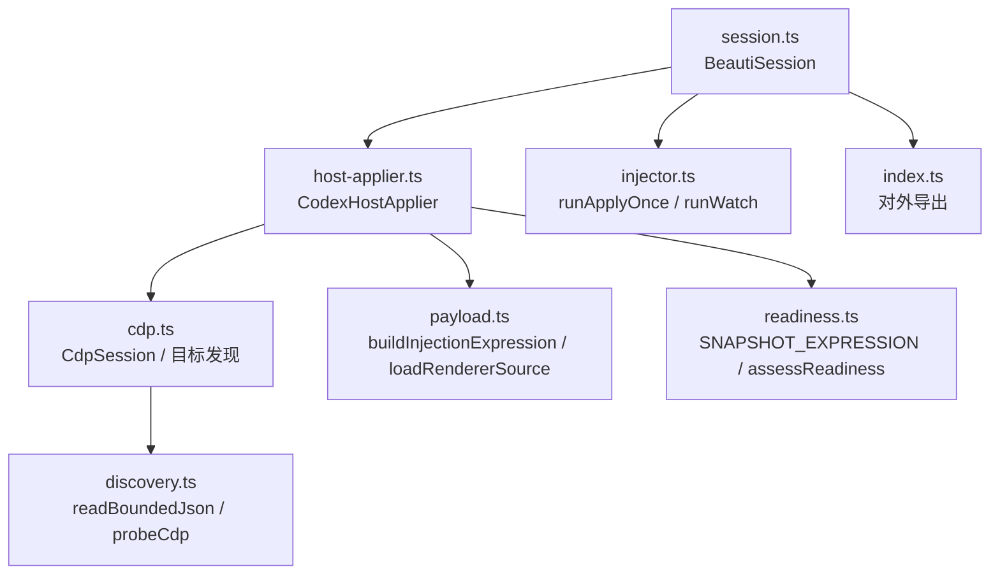
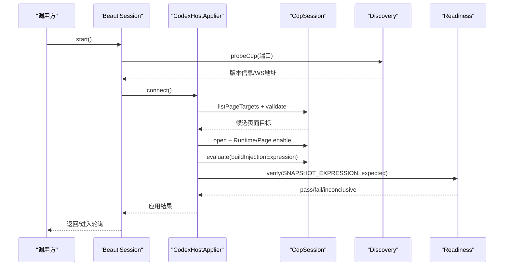
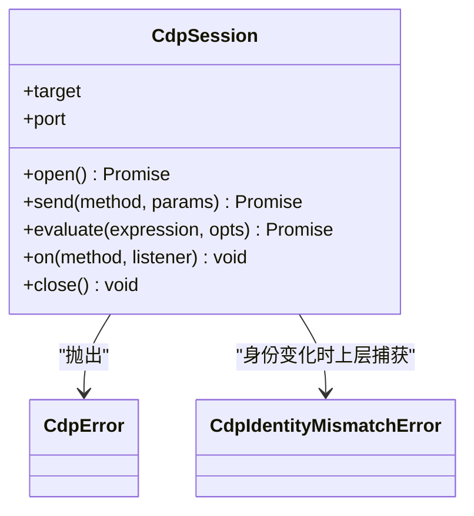
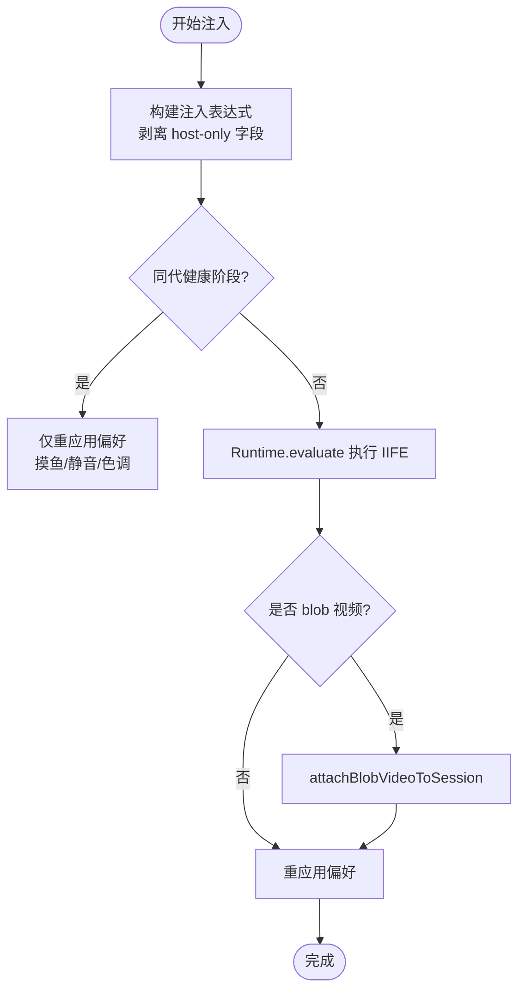
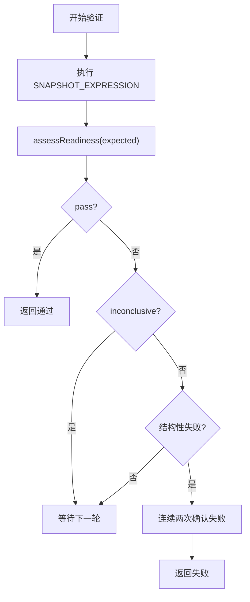
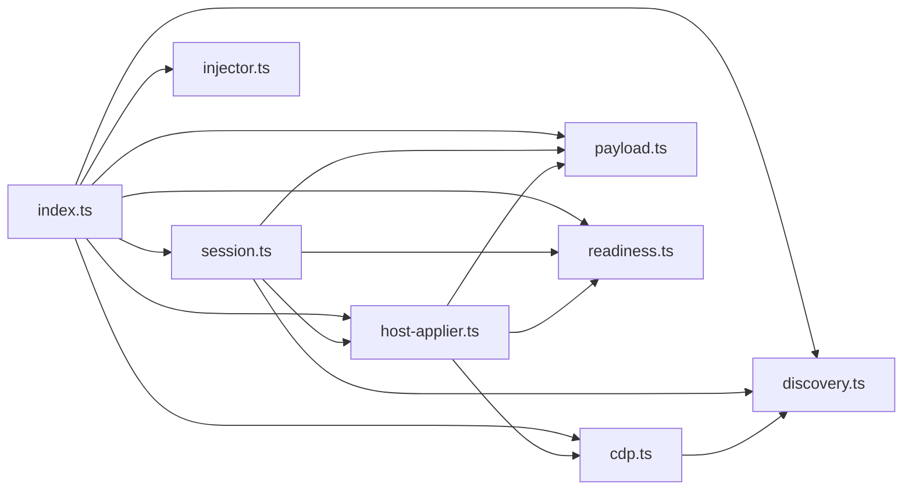

# Codex Desktop 适配器

<cite>
**本文引用的文件**
- [packages/adapter-codex/src/index.ts](file://packages/adapter-codex/src/index.ts)
- [packages/adapter-codex/src/cdp.ts](file://packages/adapter-codex/src/cdp.ts)
- [packages/adapter-codex/src/discovery.ts](file://packages/adapter-codex/src/discovery.ts)
- [packages/adapter-codex/src/host-applier.ts](file://packages/adapter-codex/src/host-applier.ts)
- [packages/adapter-codex/src/payload.ts](file://packages/adapter-codex/src/payload.ts)
- [packages/adapter-codex/src/readiness.ts](file://packages/adapter-codex/src/readiness.ts)
- [packages/adapter-codex/src/session.ts](file://packages/adapter-codex/src/session.ts)
- [packages/adapter-codex/src/injector.ts](file://packages/adapter-codex/src/injector.ts)
- [docs/codex-cdp-setup.md](file://docs/codex-cdp-setup.md)
</cite>

## 目录
1. [简介](#简介)
2. [项目结构](#项目结构)
3. [核心组件](#核心组件)
4. [架构总览](#架构总览)
5. [详细组件分析](#详细组件分析)
6. [依赖关系分析](#依赖关系分析)
7. [性能考虑](#性能考虑)
8. [故障排查指南](#故障排查指南)
9. [结论](#结论)
10. [附录：使用示例与调试方法](#附录使用示例与调试方法)

## 简介
本技术文档聚焦于 beautiCode 的 Codex Desktop 适配器，系统性说明其基于 Chrome DevTools Protocol（CDP）的通信机制、注入脚本执行流程、状态同步策略、错误处理与恢复机制，并给出连接、注入与异步处理的实践指引。该适配器仅通过回环地址（loopback）与 Codex Desktop 通信，不修改宿主二进制，确保安全性与可维护性。

## 项目结构
Codex Desktop 适配器位于 packages/adapter-codex，采用分层模块化设计：
- CDP 层：负责端点发现、目标筛选、WebSocket 会话建立与命令收发
- Host Applier 层：管理页面目标、注入运行时代码、应用背景与校验
- Session 层：封装长生命周期会话、轮询、持久化主题进度、用户操作编排
- Payload/Readiness 层：构建注入表达式、采集并评估渲染器就绪快照
- Discovery/Injector 层：端口探测、锁定、一次性或持续注入入口

图表来源
- [packages/adapter-codex/src/session.ts:167-273](file://packages/adapter-codex/src/session.ts#L167-L273)
- [packages/adapter-codex/src/host-applier.ts:115-198](file://packages/adapter-codex/src/host-applier.ts#L115-L198)
- [packages/adapter-codex/src/cdp.ts:158-197](file://packages/adapter-codex/src/cdp.ts#L158-L197)
- [packages/adapter-codex/src/discovery.ts:11-103](file://packages/adapter-codex/src/discovery.ts#L11-L103)
- [packages/adapter-codex/src/payload.ts:8-51](file://packages/adapter-codex/src/payload.ts#L8-L51)
- [packages/adapter-codex/src/readiness.ts:25-182](file://packages/adapter-codex/src/readiness.ts#L25-L182)
- [packages/adapter-codex/src/injector.ts:51-107](file://packages/adapter-codex/src/injector.ts#L51-L107)
- [packages/adapter-codex/src/index.ts:1-79](file://packages/adapter-codex/src/index.ts#L1-L79)

章节来源
- [packages/adapter-codex/src/index.ts:1-79](file://packages/adapter-codex/src/index.ts#L1-L79)

## 核心组件
- CdpError/CdpIdentityMismatchError：统一 CDP 异常类型，区分通用错误与浏览器身份变更
- CdpSession：最小化的 CDP WebSocket 会话，支持超时、消息分发、事件监听、evaluate
- CodexHostApplier：管理多个页面目标的生命周期、注入、偏好设置（摸鱼/静音/色调）、验证与重连
- BeautiSession：长生命周期会话，协调存储、媒体控制器、主机连接、轮询与用户操作
- Payload/Readiness：注入表达式构建与就绪快照评估
- Discovery：安全读取 CDP HTTP 接口与端口探测
- Injector：一次性应用与持续监控入口

章节来源
- [packages/adapter-codex/src/cdp.ts:9-23](file://packages/adapter-codex/src/cdp.ts#L9-L23)
- [packages/adapter-codex/src/cdp.ts:215-408](file://packages/adapter-codex/src/cdp.ts#L215-L408)
- [packages/adapter-codex/src/host-applier.ts:50-138](file://packages/adapter-codex/src/host-applier.ts#L50-L138)
- [packages/adapter-codex/src/session.ts:56-196](file://packages/adapter-codex/src/session.ts#L56-L196)
- [packages/adapter-codex/src/payload.ts:8-51](file://packages/adapter-codex/src/payload.ts#L8-L51)
- [packages/adapter-codex/src/readiness.ts:25-182](file://packages/adapter-codex/src/readiness.ts#L25-L182)
- [packages/adapter-codex/src/discovery.ts:11-103](file://packages/adapter-codex/src/discovery.ts#L11-L103)
- [packages/adapter-codex/src/injector.ts:51-107](file://packages/adapter-codex/src/injector.ts#L51-L107)

## 架构总览
适配器通过“发现 → 连接 → 注入 → 验证 → 轮询”的闭环工作流，将背景资源注入到 Codex Desktop 的主渲染页中，并通过就绪快照进行强一致性校验。所有网络访问均限制在 loopback，避免跨进程/跨主机风险。

图表来源
- [packages/adapter-codex/src/session.ts:167-273](file://packages/adapter-codex/src/session.ts#L167-L273)
- [packages/adapter-codex/src/host-applier.ts:115-198](file://packages/adapter-codex/src/host-applier.ts#L115-L198)
- [packages/adapter-codex/src/cdp.ts:158-197](file://packages/adapter-codex/src/cdp.ts#L158-L197)
- [packages/adapter-codex/src/discovery.ts:74-103](file://packages/adapter-codex/src/discovery.ts#L74-L103)
- [packages/adapter-codex/src/readiness.ts:151-182](file://packages/adapter-codex/src/readiness.ts#L151-L182)

## 详细组件分析

### CDP 通信机制
- 端点发现与校验
  - 通过 readBoundedJson 安全读取 /json/version 与 /json/list，限制响应大小与超时
  - validatedDebuggerUrl 严格校验 ws:// 协议、回环主机、端口与路径形状，防止恶意跳转
- 目标发现与过滤
  - fetchCdpTargetList 获取目标列表并限制数量上限
  - isCandidatePageTarget 仅允许 app:// 主壳或受限的本地 http 测试页，排除 overlay/titlebar 等不稳定页面
- 会话建立与消息传递
  - CdpSession.open 建立 WebSocket，启用 Runtime/Page 域，设置 open/command 超时
  - send 以 id 关联请求/响应，支持 on 订阅事件；evaluate 包装 Runtime.evaluate，自动处理异常
  - 关闭时清理 pending 任务与监听器

图表来源
- [packages/adapter-codex/src/cdp.ts:215-408](file://packages/adapter-codex/src/cdp.ts#L215-L408)
- [packages/adapter-codex/src/cdp.ts:9-23](file://packages/adapter-codex/src/cdp.ts#L9-L23)

章节来源
- [packages/adapter-codex/src/cdp.ts:49-197](file://packages/adapter-codex/src/cdp.ts#L49-L197)
- [packages/adapter-codex/src/discovery.ts:11-103](file://packages/adapter-codex/src/discovery.ts#L11-L103)

### 注入脚本执行机制
- 脚本构建
  - loadRendererSource 读取 background-runtime.js 与 background.css
  - buildInjectionExpression 将运行时 IIFE 与参数（CSS、图片数据、视频配置、generation、imageUrl、forceRebuild）拼接为表达式，剥离 host-only 字段（如 localPath），避免泄露到页面上下文
- 加载与执行
  - CodexHostApplier.applySessionsOnce 对每个健康 session 调用 evaluate 注入表达式
  - 若检测到相同 generation 的健康阶段，则跳过重复注入，仅重新应用偏好（摸鱼/静音/色调）
  - 对于 blob 视频路径，先 attachBlobVideoToSession，再注入，避免闪烁
- 幂等与防抖
  - applyChain 串行化注入，避免 watch 轮询打断冷启动的视频 attach
  - reapplyLast 在短窗口内避免全量重建，仅修复缺失 runtime 的情况

图表来源
- [packages/adapter-codex/src/payload.ts:23-51](file://packages/adapter-codex/src/payload.ts#L23-L51)
- [packages/adapter-codex/src/host-applier.ts:243-350](file://packages/adapter-codex/src/host-applier.ts#L243-L350)

章节来源
- [packages/adapter-codex/src/payload.ts:8-51](file://packages/adapter-codex/src/payload.ts#L8-L51)
- [packages/adapter-codex/src/host-applier.ts:243-350](file://packages/adapter-codex/src/host-applier.ts#L243-L350)

### 状态同步实现
- 就绪性检查
  - SNAPSHOT_EXPRESSION 在页面侧采集 __BEAUTICODE_BG__.snapshot()，补充 document.hidden/visibility、videoFailed、stage pointer-events、horizontalOverflow 等关键指标
  - assessReadiness 根据期望（clear/image/video）判定 pass/fail/inconclusive，区分结构性失败与等待型状态
- 实时状态更新
  - 验证循环在 deadline 内反复 reconcileSessions 并采样快照，直到 pass 或结构性失败确认
  - 视频场景下，document hidden 不会导致误回滚，而是延长等待直至 videoReady
- 主题进度持久化
  - 当保存视频主题后，绑定 activeThemeId，周期性读取播放位置并写入 theme.json，节流磁盘写入

图表来源
- [packages/adapter-codex/src/readiness.ts:25-182](file://packages/adapter-codex/src/readiness.ts#L25-L182)
- [packages/adapter-codex/src/host-applier.ts:648-768](file://packages/adapter-codex/src/host-applier.ts#L648-L768)

章节来源
- [packages/adapter-codex/src/readiness.ts:25-182](file://packages/adapter-codex/src/readiness.ts#L25-L182)
- [packages/adapter-codex/src/host-applier.ts:648-768](file://packages/adapter-codex/src/host-applier.ts#L648-L768)

### 错误处理策略
- CDP 错误类型
  - CdpError：通用 CDP 错误，携带可选 cdpCode
  - CdpIdentityMismatchError：浏览器身份变化（进程重启导致）
- 重试与恢复
  - connect/reconcile 在 deadline 内轮询，遇到身份变化立即重建 host 并重新连接
  - applyExclusive 对关闭会话错误进行最多两次尝试，必要时清空会话并重连
  - verify 对 transient evaluate 错误视为 inconclusive，继续采样直至 deadline
- 安全边界
  - 仅允许 loopback 主机与受控路径，拒绝非预期 URL/端口/用户名密码
  - JSON 响应大小限制，防止内存耗尽

章节来源
- [packages/adapter-codex/src/cdp.ts:9-23](file://packages/adapter-codex/src/cdp.ts#L9-L23)
- [packages/adapter-codex/src/cdp.ts:82-130](file://packages/adapter-codex/src/cdp.ts#L82-L130)
- [packages/adapter-codex/src/host-applier.ts:115-138](file://packages/adapter-codex/src/host-applier.ts#L115-L138)
- [packages/adapter-codex/src/host-applier.ts:258-286](file://packages/adapter-codex/src/host-applier.ts#L258-L286)
- [packages/adapter-codex/src/host-applier.ts:648-768](file://packages/adapter-codex/src/host-applier.ts#L648-L768)
- [packages/adapter-codex/src/discovery.ts:11-68](file://packages/adapter-codex/src/discovery.ts#L11-L68)

### 连接、注入与异步处理示例
- 连接 Codex Desktop
  - 使用 BeautiSession.start 自动发现端口并建立连接；或通过 injector.runWatch 指定端口持续同步
  - 参考：[packages/adapter-codex/src/session.ts:167-196](file://packages/adapter-codex/src/session.ts#L167-L196)、[packages/adapter-codex/src/injector.ts:83-107](file://packages/adapter-codex/src/injector.ts#L83-L107)
- 执行注入脚本
  - 通过 ApplyTransaction 构造 payload 并调用 tx.run；底层由 CodexHostApplier 构建表达式并 evaluate
  - 参考：[packages/adapter-codex/src/session.ts:279-332](file://packages/adapter-codex/src/session.ts#L279-L332)、[packages/adapter-codex/src/host-applier.ts:243-350](file://packages/adapter-codex/src/host-applier.ts#L243-L350)
- 处理异步操作
  - CdpSession.send/evaluate 返回 Promise，支持超时与错误传播；watch 轮询使用 setInterval 与 AbortSignal 控制生命周期
  - 参考：[packages/adapter-codex/src/cdp.ts:337-382](file://packages/adapter-codex/src/cdp.ts#L337-L382)、[packages/adapter-codex/src/injector.ts:109-125](file://packages/adapter-codex/src/injector.ts#L109-L125)

章节来源
- [packages/adapter-codex/src/session.ts:279-332](file://packages/adapter-codex/src/session.ts#L279-L332)
- [packages/adapter-codex/src/host-applier.ts:243-350](file://packages/adapter-codex/src/host-applier.ts#L243-L350)
- [packages/adapter-codex/src/cdp.ts:337-382](file://packages/adapter-codex/src/cdp.ts#L337-L382)
- [packages/adapter-codex/src/injector.ts:109-125](file://packages/adapter-codex/src/injector.ts#L109-L125)

## 依赖关系分析
- 模块耦合
  - session 依赖 host-applier、discovery、payload、readiness、core 的 BackgroundStore/MediaServerController
  - host-applier 依赖 cdp、payload、readiness
  - cdp 依赖 discovery（JSON 读取与大小限制）
- 外部集成点
  - Node 22+ 全局 WebSocket
  - Codex Desktop 的 CDP 端点（/json/version、/json/list、devtools/page/*）
- 潜在循环依赖
  - 当前无直接循环导入；通过 index.ts 聚合导出，降低耦合

图表来源
- [packages/adapter-codex/src/index.ts:1-79](file://packages/adapter-codex/src/index.ts#L1-L79)
- [packages/adapter-codex/src/session.ts:1-26](file://packages/adapter-codex/src/session.ts#L1-L26)
- [packages/adapter-codex/src/host-applier.ts:1-24](file://packages/adapter-codex/src/host-applier.ts#L1-L24)
- [packages/adapter-codex/src/cdp.ts:1-5](file://packages/adapter-codex/src/cdp.ts#L1-L5)

章节来源
- [packages/adapter-codex/src/index.ts:1-79](file://packages/adapter-codex/src/index.ts#L1-L79)

## 性能考虑
- 注入去抖与幂等
  - applyChain 串行化注入，避免 watch 轮询打断冷启动
  - 同 generation 健康阶段跳过重复注入，减少 DOM 重建与视频重附
- 验证优化
  - verify 在 deadline 内采样，结构性失败快速确认，非结构性失败延后判断
  - 视频 ready 前允许 poster 可见，避免阻塞
- 资源限制
  - readBoundedJson 限制响应大小，防止大 JSON 导致内存压力
  - CDP 命令与打开超时，避免长时间挂起
- 轮询频率
  - pollMs 可调，默认较短以保证及时恢复，但需平衡 CPU 占用

[本节为通用性能建议，不直接分析具体文件]

## 故障排查指南
- 常见问题定位
  - discover 计数为 0：确认 Codex 已运行且存在主窗口；检查进程命令行是否包含 --remote-debugging-port
  - probe 连接被拒：端口不正确；使用 discover 或查看进程命令行
  - Another injector is running：多实例冲突；退出其他实例并清理 stale injector.lock
  - identity changed：宿主重启；重试并重连
  - Verify fail + rollback：注入被拒/溢出/生成不一致；检查 status，清除后重试
  - Windows UV_HANDLE_CLOSING：旧 CLI 硬退出 WS 销毁；升级至新版 CLI
- 安全规则
  - 仅连接 127.0.0.1；禁止 0.0.0.0 或 LAN 绑定
  - 优先使用已设置 --remote-debugging-address=127.0.0.1 的宿主
  - 单一注入器拥有宿主（injector.lock）

章节来源
- [docs/codex-cdp-setup.md:7-14](file://docs/codex-cdp-setup.md#L7-L14)
- [docs/codex-cdp-setup.md:55-99](file://docs/codex-cdp-setup.md#L55-L99)

## 结论
Codex Desktop 适配器通过严格的 loopback 安全边界、健壮的 CDP 会话管理与幂等的注入流程，实现了稳定可靠的背景注入与状态同步。其分层设计与完善的错误处理、重试与恢复机制，使其能够在宿主重启、页面切换与隐藏等复杂场景下保持鲁棒性。配合轮询与验证，可在保证用户体验的同时，最大化系统稳定性。

[本节为总结，不直接分析具体文件]

## 附录：使用示例与调试方法
- 连接 Codex Desktop
  - 使用 BeautiSession.start 自动发现端口并连接；或在 CLI/watch 模式下指定端口
  - 参考：[packages/adapter-codex/src/session.ts:167-196](file://packages/adapter-codex/src/session.ts#L167-L196)、[packages/adapter-codex/src/injector.ts:83-107](file://packages/adapter-codex/src/injector.ts#L83-L107)
- 执行注入脚本
  - 通过 ApplyTransaction 构造输入并执行；底层构建表达式并在页面 evaluate
  - 参考：[packages/adapter-codex/src/session.ts:279-332](file://packages/adapter-codex/src/session.ts#L279-L332)、[packages/adapter-codex/src/host-applier.ts:243-350](file://packages/adapter-codex/src/host-applier.ts#L243-L350)
- 处理异步操作
  - CdpSession.send/evaluate 返回 Promise；watch 使用 setInterval 与 AbortSignal 控制
  - 参考：[packages/adapter-codex/src/cdp.ts:337-382](file://packages/adapter-codex/src/cdp.ts#L337-L382)、[packages/adapter-codex/src/injector.ts:109-125](file://packages/adapter-codex/src/injector.ts#L109-L125)
- 调试方法
  - 使用 npm run bc -- discover/probe/how-to-cdp 辅助定位 CDP 端点
  - 检查进程命令行中的 --remote-debugging-address/port
  - 观察日志中的身份变化与重连提示

章节来源
- [docs/codex-cdp-setup.md:25-53](file://docs/codex-cdp-setup.md#L25-L53)
- [packages/adapter-codex/src/session.ts:167-196](file://packages/adapter-codex/src/session.ts#L167-L196)
- [packages/adapter-codex/src/injector.ts:83-107](file://packages/adapter-codex/src/injector.ts#L83-L107)
- [packages/adapter-codex/src/cdp.ts:337-382](file://packages/adapter-codex/src/cdp.ts#L337-L382)
- [packages/adapter-codex/src/injector.ts:109-125](file://packages/adapter-codex/src/injector.ts#L109-L125)