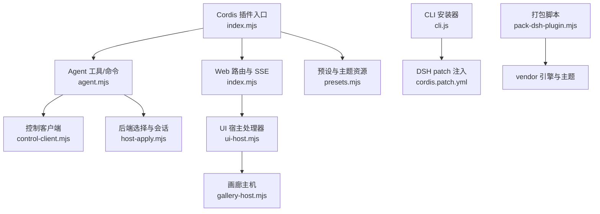
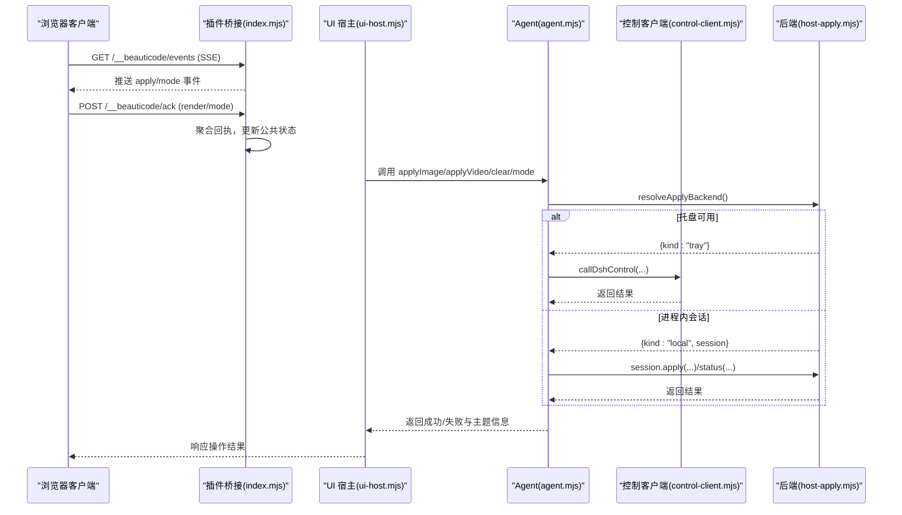
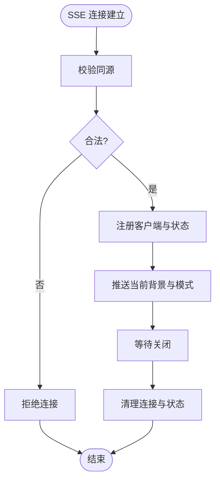
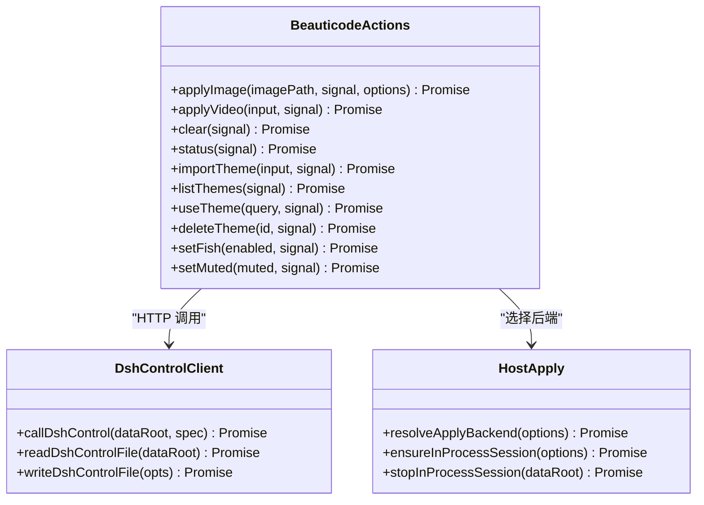
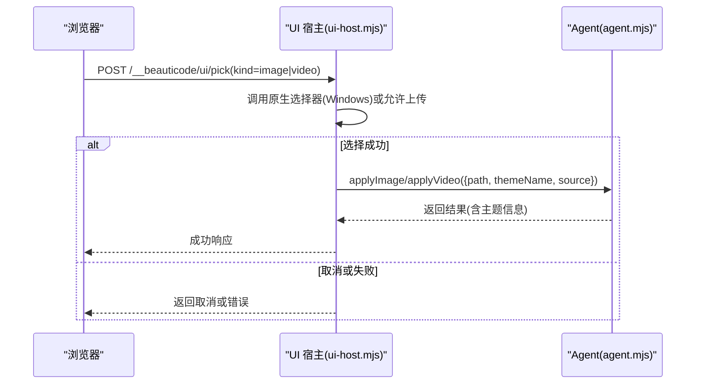
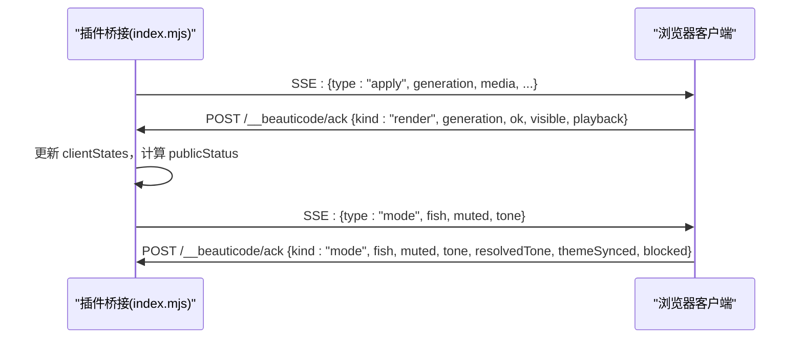
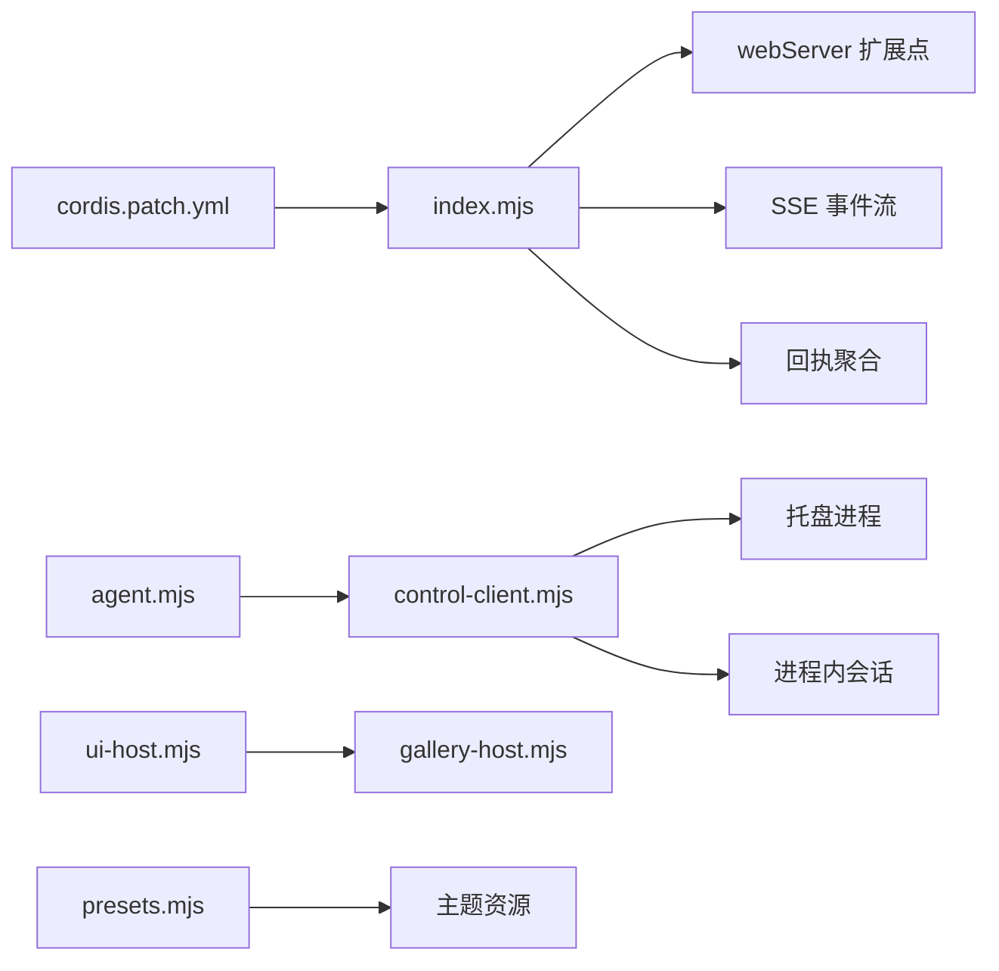

# DeepSeek Harness 适配器

<cite>
**本文引用的文件**
- [index.mjs](file://integrations/deepseek-harness/index.mjs)
- [agent.mjs](file://integrations/deepseek-harness/agent.mjs)
- [cli.js](file://integrations/deepseek-harness/cli.js)
- [control-client.mjs](file://integrations/deepseek-harness/control-client.mjs)
- [host-apply.mjs](file://integrations/deepseek-harness/host-apply.mjs)
- [ui-host.mjs](file://integrations/deepseek-harness/ui-host.mjs)
- [gallery-host.mjs](file://integrations/deepseek-harness/gallery-host.mjs)
- [presets.mjs](file://integrations/deepseek-harness/presets.mjs)
- [cordis.patch.yml](file://integrations/deepseek-harness/cordis.patch.yml)
- [package.json](file://integrations/deepseek-harness/package.json)
- [README.zh-CN.md](file://integrations/deepseek-harness/README.zh-CN.md)
- [pack-dsh-plugin.mjs](file://scripts/pack-dsh-plugin.mjs)
</cite>

## 目录
1. [简介](#简介)
2. [项目结构](#项目结构)
3. [核心组件](#核心组件)
4. [架构总览](#架构总览)
5. [详细组件分析](#详细组件分析)
6. [依赖关系分析](#依赖关系分析)
7. [性能与可靠性](#性能与可靠性)
8. [故障排查指南](#故障排查指南)
9. [结论](#结论)
10. [附录：集成示例与最佳实践](#附录：集成示例与最佳实践)

## 简介
DeepSeek Harness 适配器（beauticode-dsh）是一个 Cordis 插件，用于在 DSH Web 中注入 beautiCode 浏览器客户端，提供图片/视频背景、主题管理、摸鱼模式、声音控制、皮肤中心安装等能力。它通过本地回环 HTTP 接口与 DSH 或托盘进程通信，使用事件流向浏览器推送实时状态，并通过工具与斜杠命令暴露给 AI 代理和终端用户。

该插件不启动 DSH，需先运行 dsh web；若已有托盘进程则复用，否则会在进程内启动会话以完成背景应用。

**章节来源**
- [README.zh-CN.md:1-49](file://integrations/deepseek-harness/README.zh-CN.md#L1-L49)

## 项目结构
本插件采用“插件入口 + 服务端路由 + 代理动作 + UI 宿主 + 控制客户端”的分层组织：
- 插件入口 index.mjs：注册 Cordis 钩子、注入脚本、注册 Web API、维护 SSE 事件广播与回执聚合。
- agent.mjs：对外暴露 beauticode_* 工具与 /bg* 斜杠命令，封装 apply/status/mode 等业务动作。
- control-client.mjs：读取/写入 DSH 控制文件、校验回环 URL、发起受控 HTTP 调用。
- host-apply.mjs：选择后端（托盘 or 进程内会话），管理会话生命周期。
- ui-host.mjs：实现 Web UI 的导入、选择器、主题切换、预设应用、画廊安装等处理器。
- gallery-host.mjs：皮肤中心配置、目录拉取、下载与安装流程。
- presets.mjs：内置主题与资源路径解析。
- cli.js：一键安装/卸载插件，自动写入 cordis.patch.yml，并链接到 DSH profile。
- pack-dsh-plugin.mjs：打包插件与 vendored 引擎，供 npm/npx 分发。

**图表来源**
- [index.mjs:204-644](file://integrations/deepseek-harness/index.mjs#L204-L644)
- [agent.mjs:546-780](file://integrations/deepseek-harness/agent.mjs#L546-L780)
- [control-client.mjs:463-516](file://integrations/deepseek-harness/control-client.mjs#L463-L516)
- [host-apply.mjs:137-165](file://integrations/deepseek-harness/host-apply.mjs#L137-L165)
- [ui-host.mjs:302-798](file://integrations/deepseek-harness/ui-host.mjs#L302-L798)
- [gallery-host.mjs:163-352](file://integrations/deepseek-harness/gallery-host.mjs#L163-L352)
- [presets.mjs:7-74](file://integrations/deepseek-harness/presets.mjs#L7-L74)
- [cli.js:362-443](file://integrations/deepseek-harness/cli.js#L362-L443)
- [pack-dsh-plugin.mjs:89-159](file://scripts/pack-dsh-plugin.mjs#L89-L159)

**章节来源**
- [package.json:1-60](file://integrations/deepseek-harness/package.json#L1-L60)
- [cordis.patch.yml:1-5](file://integrations/deepseek-harness/cordis.patch.yml#L1-L5)

## 核心组件
- 插件生命周期与注入
  - 通过 Cordis 的 effect/tapIndex/register 机制，在 webServer 上注入脚本与路由，并在销毁时清理资源。
  - 注入的脚本包括 atmosphere.js、client.js、console.js、gallery.js，统一挂载到 DSH 页面 body。
- 事件系统与消息传递
  - 使用 Server-Sent Events（SSE）在 /__beauticode/events 推送 apply/mode 变更，支持多客户端连接与重连回放。
  - 浏览器端通过 POST /__beauticode/ack 上报渲染回执与模式回执，服务器聚合为公共状态。
- Web 端集成
  - 侧边栏 UI 由 ui-host.mjs 提供，包含导入、选择器、主题列表、预设应用、画廊安装等。
  - 斜杠命令 /bg、/bg-theme、/bg-clear 由 agent.mjs 注册，直接调用 Agent 动作。
- CLI 工具
  - 一键安装/卸载，自动写入 cordis.patch.yml，处理旧版迁移，创建符号链接或复制包。
- 安全边界
  - 令牌鉴权、同源校验、媒体 URL 白名单（仅带 token 的回环地址）、请求体大小限制。

**章节来源**
- [index.mjs:204-644](file://integrations/deepseek-harness/index.mjs#L204-L644)
- [agent.mjs:546-780](file://integrations/deepseek-harness/agent.mjs#L546-L780)
- [ui-host.mjs:302-798](file://integrations/deepseek-harness/ui-host.mjs#L302-L798)
- [control-client.mjs:219-279](file://integrations/deepseek-harness/control-client.mjs#L219-L279)
- [control-client.mjs:463-516](file://integrations/deepseek-harness/control-client.mjs#L463-L516)

## 架构总览
插件作为 Cordis 插件注入 DSH Web 服务，负责：
- 注入前端脚本与静态资源
- 提供受控 API（apply/mode/status/ack）
- 通过 SSE 将状态推送到浏览器
- 接收浏览器回执，计算全局可见性与播放状态
- 通过 Agent 与后端（托盘或进程内会话）交互，完成背景应用与主题管理

**图表来源**
- [index.mjs:432-632](file://integrations/deepseek-harness/index.mjs#L432-L632)
- [agent.mjs:176-514](file://integrations/deepseek-harness/agent.mjs#L176-L514)
- [host-apply.mjs:137-165](file://integrations/deepseek-harness/host-apply.mjs#L137-L165)
- [control-client.mjs:463-516](file://integrations/deepseek-harness/control-client.mjs#L463-L516)

## 详细组件分析

### 插件生命周期与事件系统（index.mjs）
- 生命周期
  - 通过 ctx.effect 注册一次性副作用，在 effect 内部注册路由与 tapIndex，返回清理函数。
  - 清理时销毁所有 SSE 响应、清空 Map、释放 UI 资源。
- 事件推送
  - /__beauticode/events 建立 SSE 连接，记录 clientId，初始推送当前背景与模式，关闭时移除连接。
  - broadcast 将 apply/mode 事件帧写入所有活跃客户端。
- 回执聚合
  - /__beauticode/ack 接收 render/mode 回执，校验字段后更新 clientStates，生成 publicStatus。
  - publicStatus 统计 ready/failed/videoReady/blocked/resolvedTone/playback 等指标。

**图表来源**
- [index.mjs:432-467](file://integrations/deepseek-harness/index.mjs#L432-L467)
- [index.mjs:148-202](file://integrations/deepseek-harness/index.mjs#L148-L202)

**章节来源**
- [index.mjs:204-644](file://integrations/deepseek-harness/index.mjs#L204-L644)

### Agent 工具与斜杠命令（agent.mjs）
- 工具注册
  - beauticode_apply_video/image/theme_list/use/clear/status/set_fish/set_muted 等工具，参数严格校验，输出统一 schema。
- 斜杠命令
  - /bg：解析输入，识别图片或 MP4 绝对路径，调用 apply 动作。
  - /bg-theme：按名称或 ID 切换已保存主题。
  - /bg-clear：清除背景。
- 动作实现
  - 优先检测托盘可用性，否则尝试进程内会话；托盘不可用时给出明确提示。
  - 对错误进行中文友好化转换，保留 sourceMode/timings 以便诊断。

**图表来源**
- [agent.mjs:176-514](file://integrations/deepseek-harness/agent.mjs#L176-L514)
- [control-client.mjs:463-516](file://integrations/deepseek-harness/control-client.mjs#L463-L516)
- [host-apply.mjs:73-165](file://integrations/deepseek-harness/host-apply.mjs#L73-L165)

**章节来源**
- [agent.mjs:516-780](file://integrations/deepseek-harness/agent.mjs#L516-L780)

### Web 端集成与 UI 宿主（ui-host.mjs）
- 侧边栏集成
  - 通过 index.mjs 的 tapIndex 注入脚本，确保只注入一次。
  - 提供 /__beauticode/ui/* 系列接口：status/import/pick/import-selected/clear/mode/useTheme/deleteTheme/preset/gallery/*。
- 文件选择器
  - Windows 原生选择器通过 PowerShell + WinForms 打开对话框，超时与父进程退出保护。
  - 非 Windows 环境可选择上传（可配置允许托管上传）。
- 导入流程
  - 本地导入：选择文件后，仅保存绝对路径，通过带 Range 支持的本地媒体服务读取原文件，不复制大文件。
  - 托管上传：限制文件大小，临时存储后应用并保存主题，成功后清理临时文件。
- 主题与预设
  - 内置预设 internal/infernal，自动设置色调与效果。
  - 主题列表公开 id/name/type/sourceMode/bundled。

**图表来源**
- [ui-host.mjs:115-258](file://integrations/deepseek-harness/ui-host.mjs#L115-L258)
- [ui-host.mjs:450-668](file://integrations/deepseek-harness/ui-host.mjs#L450-L668)
- [agent.mjs:190-328](file://integrations/deepseek-harness/agent.mjs#L190-L328)

**章节来源**
- [ui-host.mjs:302-798](file://integrations/deepseek-harness/ui-host.mjs#L302-L798)

### 事件推送机制（实时状态同步）
- 实时同步
  - SSE 推送 apply/mode 事件，浏览器端根据 generation/media 判断是否重放或加入进行中事务。
- 用户交互响应
  - 浏览器通过 ack 上报渲染与模式状态，服务器聚合为公共状态，便于 UI 显示 ready/failed/videoReady/blocked。
- 背景应用控制
  - apply/mode/status/ack 接口均进行载荷校验与安全检查，确保仅接受合法请求。

**图表来源**
- [index.mjs:432-632](file://integrations/deepseek-harness/index.mjs#L432-L632)

**章节来源**
- [index.mjs:148-202](file://integrations/deepseek-harness/index.mjs#L148-L202)
- [index.mjs:432-632](file://integrations/deepseek-harness/index.mjs#L432-L632)

### CLI 工具的命令行接口设计
- 参数解析
  - --dsh-home：指定 DSH 主目录，默认 ~/.dsh。
  - --plugin-home：指定插件安装目录，默认 $DSH_HOME/plugins/beauticode-dsh。
  - --remove：卸载插件，移除 patch 与依赖。
- 命令路由
  - install：复制/链接插件，写入 cordis.patch.yml，必要时迁移旧目录。
  - uninstall：移除 patch、依赖、链接与安装目录。
- 输出格式化
  - 控制台输出安装位置、patch 路径、迁移信息与后续步骤提示。

**章节来源**
- [cli.js:34-443](file://integrations/deepseek-harness/cli.js#L34-L443)

## 依赖关系分析
- 插件与 DSH
  - 通过 cordis.patch.yml 声明注入 webServer，使插件在 DSH Web 启动时加载。
  - 使用 DSH 的 webServer.tapIndex/register/effect 扩展点。
- 插件与托盘/会话
  - control-client.mjs 读取 dsh-control.json/session-host.json/tray-claim.json，校验 PID 存活与回环 URL。
  - host-apply.mjs 选择托盘或进程内会话，避免冲突与重复启动。
- 插件与浏览器
  - 注入的 client.js/atmosphere.js/console.js/gallery.js 通过 SSE 与 /ack 与服务器通信。
  - 媒体 URL 必须为带 token 的回环地址，防止跨域与越权访问。

**图表来源**
- [cordis.patch.yml:1-5](file://integrations/deepseek-harness/cordis.patch.yml#L1-L5)
- [index.mjs:204-644](file://integrations/deepseek-harness/index.mjs#L204-L644)
- [control-client.mjs:219-279](file://integrations/deepseek-harness/control-client.mjs#L219-L279)
- [host-apply.mjs:137-165](file://integrations/deepseek-harness/host-apply.mjs#L137-L165)
- [gallery-host.mjs:163-352](file://integrations/deepseek-harness/gallery-host.mjs#L163-L352)
- [presets.mjs:38-74](file://integrations/deepseek-harness/presets.mjs#L38-L74)

**章节来源**
- [control-client.mjs:296-440](file://integrations/deepseek-harness/control-client.mjs#L296-L440)
- [host-apply.mjs:32-117](file://integrations/deepseek-harness/host-apply.mjs#L32-L117)

## 性能与可靠性
- 传输与缓存
  - 静态资源使用 no-store 或短缓存策略，避免陈旧版本。
  - 媒体 URL 使用 Range 头探测与 CORS 兼容，提升首帧速度。
- 超时与取消
  - 文件选择器与下载过程支持 AbortSignal 与超时，避免阻塞。
  - 托盘/会话调用合并用户信号与超时信号，保证可中断。
- 资源清理
  - 插件销毁时清理 SSE 连接、Map、临时文件与进程内会话。
  - 导入流程在 finally 中清理临时文件，避免磁盘泄漏。

[本节为通用指导，无需特定文件引用]

## 故障排查指南
- 未授权请求
  - 检查 Authorization 头是否携带正确令牌，令牌文件路径与内容是否符合规范。
- 媒体不可达或 CORS 拒绝
  - 确认媒体 URL 为回环地址且带 token 参数，浏览器 Origin 与媒体 Origin 一致。
- 托盘缺失或占用
  - 若托盘未运行，会提示先启动 beautiCode；若托盘被其他进程占用，会提示稍后再试。
- 文件选择器不可用
  - Windows 需要 PowerShell 与 WinForms；非 Windows 环境可能要求托管上传。
- 主题名非法或过长
  - 主题名需去除非法字符，长度不超过 80 字符。

**章节来源**
- [index.mjs:90-146](file://integrations/deepseek-harness/index.mjs#L90-L146)
- [control-client.mjs:146-168](file://integrations/deepseek-harness/control-client.mjs#L146-L168)
- [ui-host.mjs:92-113](file://integrations/deepseek-harness/ui-host.mjs#L92-L113)
- [ui-host.mjs:450-529](file://integrations/deepseek-harness/ui-host.mjs#L450-L529)

## 结论
DeepSeek Harness 适配器通过 Cordis 插件机制将 beautiCode 的背景能力无缝接入 DSH Web，提供稳定的事件推送、安全的本地媒体访问、丰富的主题管理与便捷的 CLI 安装体验。其分层架构清晰，职责明确，具备完善的错误处理与性能优化，适合在生产环境中稳定运行。

[本节为总结性内容，无需特定文件引用]

## 附录：集成示例与最佳实践

### 在 DSH 中注册插件
- 使用 CLI 一键安装：
  - npx beauticode-dsh
  - 随后运行 npx @deepseek-ai/dsh web
- 手动安装：
  - 修改 cordis.patch.yml，添加插件注入项
  - 确保 BEAUTICODE_DATA_ROOT 一致
  - 运行 dsh web（或带 --patch）

**章节来源**
- [cli.js:362-443](file://integrations/deepseek-harness/cli.js#L362-L443)
- [cordis.patch.yml:1-5](file://integrations/deepseek-harness/cordis.patch.yml#L1-L5)
- [README.zh-CN.md:11-49](file://integrations/deepseek-harness/README.zh-CN.md#L11-L49)

### 处理用户输入与控制背景应用
- 斜杠命令
  - /bg <绝对路径>：设置图片或视频为背景
  - /bg-theme <名称>：切换已保存主题
  - /bg-clear：清除背景
- 工具调用
  - beauticode_apply_image/path：设置图片背景
  - beauticode_apply_video/path+poster+startAt：设置视频背景
  - beauticode_theme_use/name：切换主题
  - beauticode_set_fish/enabled：进入/退出摸鱼模式
  - beauticode_set_muted/muted：开关背景声音

**章节来源**
- [agent.mjs:516-780](file://integrations/deepseek-harness/agent.mjs#L516-L780)

### 插件开发指南与最佳实践
- 安全边界
  - 所有控制端点需绑定本机回环地址，使用随机令牌鉴权
  - 媒体 URL 仅允许带 token 的回环地址
  - 浏览器回执仅接受同源请求
- 性能优化
  - 使用 Range 头探测媒体可达性，减少首帧延迟
  - 限制请求体大小，避免内存溢出
  - 合理设置超时与取消信号，提升用户体验
- 错误处理
  - 对用户友好的中文错误信息
  - 保留 sourceMode/timings 便于诊断
  - 清理临时文件与资源，避免泄漏

**章节来源**
- [README.zh-CN.md:41-49](file://integrations/deepseek-harness/README.zh-CN.md#L41-L49)
- [index.mjs:55-88](file://integrations/deepseek-harness/index.mjs#L55-L88)
- [control-client.mjs:463-516](file://integrations/deepseek-harness/control-client.mjs#L463-L516)
- [ui-host.mjs:260-274](file://integrations/deepseek-harness/ui-host.mjs#L260-L274)