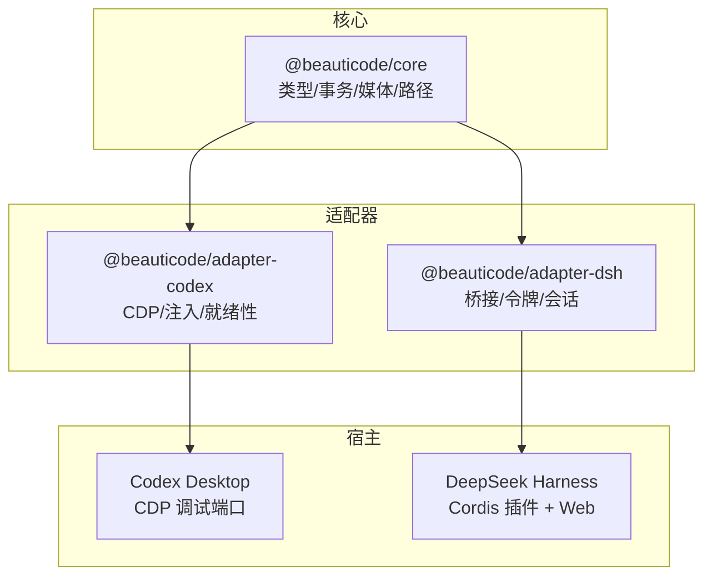
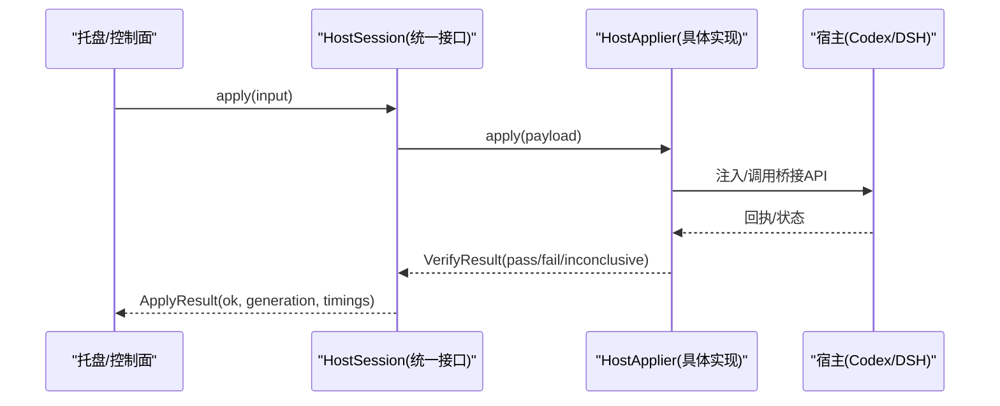
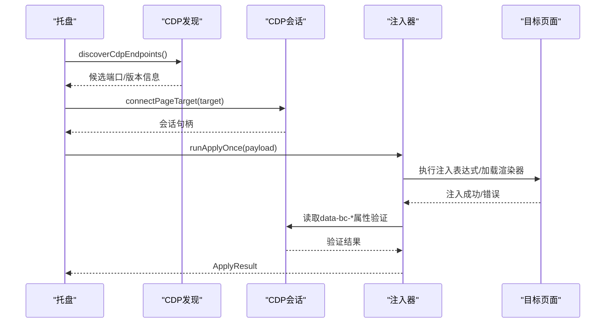
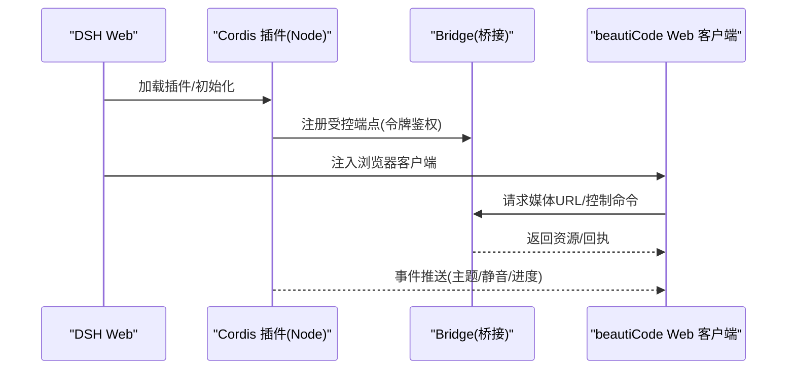
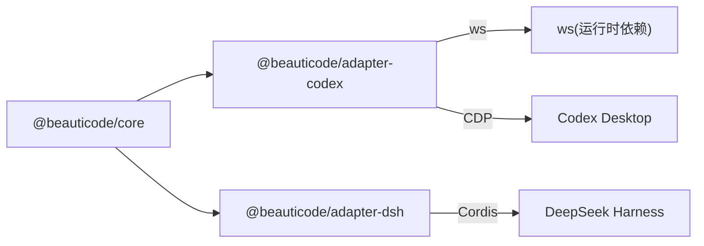

# 适配器层

<cite>
**本文引用的文件**
- [README.md](file://README.md)
- [host-adapter.md](file://docs/host-adapter.md)
- [packages/core/src/types.ts](file://packages/core/src/types.ts)
- [packages/core/src/host-session.ts](file://packages/core/src/host-session.ts)
- [packages/adapter-codex/src/index.ts](file://packages/adapter-codex/src/index.ts)
- [packages/adapter-dsh/src/index.ts](file://packages/adapter-dsh/src/index.ts)
- [integrations/deepseek-harness/README.zh-CN.md](file://integrations/deepseek-harness/README.zh-CN.md)
</cite>

## 目录
1. [简介](#简介)
2. [项目结构](#项目结构)
3. [核心组件](#核心组件)
4. [架构总览](#架构总览)
5. [详细组件分析](#详细组件分析)
6. [依赖分析](#依赖分析)
7. [性能考虑](#性能考虑)
8. [故障排除指南](#故障排除指南)
9. [结论](#结论)
10. [附录：新宿主适配开发指南](#附录：新宿主适配开发指南)

## 简介
beautiCode 是一个本地背景工具，主要面向 DeepSeek Harness（DSH）与 Codex Desktop。其“适配器层”通过统一的 HostSession 接口屏蔽不同宿主的差异，使托盘、UI 或上层控制面以一致的方式应用图片/视频背景、管理主题、切换摸鱼模式与静音等能力。

- 对 Codex Desktop：通过 Chrome DevTools Protocol（CDP）连接本机调试端口，注入脚本到目标页面，使用 DOM/CSS 契约完成背景渲染与状态同步。
- 对 DeepSeek Harness：通过 Cordis 插件在 DSH Web 中注入浏览器客户端，并提供本机鉴权接口；由插件侧负责事件推送与媒体服务集成。

本文件聚焦适配器层的实现原理、通信机制、状态同步、差异对比、性能与排障，以及新增宿主适配的开发规范。

## 项目结构
仓库采用多包结构：
- packages/core：定义通用类型、事务化应用流程、媒体源/校验、路径与进程存活等公共能力。
- packages/adapter-codex：Codex Desktop 适配器，包含 CDP 发现/连接、注入器、就绪性检查、HostApplier 实现与会话封装。
- packages/adapter-dsh：DeepSeek Harness 适配器，基于桥接（bridge）与令牌认证，提供 HostApplier 与会话封装。
- integrations/deepseek-harness：Cordis 插件代码，向 DSH Web 注入客户端并暴露控制端点。

图表来源
- [packages/core/src/types.ts:1-215](file://packages/core/src/types.ts#L1-L215)
- [packages/adapter-codex/src/index.ts:1-79](file://packages/adapter-codex/src/index.ts#L1-L79)
- [packages/adapter-dsh/src/index.ts:1-16](file://packages/adapter-dsh/src/index.ts#L1-L16)

章节来源
- [README.md:19-35](file://README.md#L19-L35)
- [packages/core/src/types.ts:1-215](file://packages/core/src/types.ts#L1-L215)

## 核心组件
- HostSession（统一会话接口）：托盘/控制面仅依赖该小表面进行启动、停止、状态查询与应用操作。
- HostApplier（宿主应用器）：具体将媒体与样式应用到宿主页面的能力，含 verify 用于验证注入结果。
- ApplyInput / BackgroundManifest / VerifyExpectation 等：描述应用输入、已生效清单与验证期望。
- HostDescriptor / HostCapabilities：稳定描述宿主种类、显示名与能力集。

这些类型与契约位于 core 包，确保各适配器对外行为一致。

章节来源
- [packages/core/src/host-session.ts:10-47](file://packages/core/src/host-session.ts#L10-L47)
- [packages/core/src/types.ts:18-34](file://packages/core/src/types.ts#L18-L34)
- [packages/core/src/types.ts:107-196](file://packages/core/src/types.ts#L107-L196)
- [packages/core/src/types.ts:198-215](file://packages/core/src/types.ts#L198-L215)

## 架构总览
适配器层通过 HostSession 抽象出跨宿主的统一控制平面；内部根据宿主类型选择不同 HostApplier：
- Codex：通过 CDP 发现并连接目标页面，注入脚本与 CSS，按 DOM/CSS 契约设置背景与状态。
- DSH：通过 Cordis 插件的桥接 API 与令牌认证，驱动 Web 端执行背景应用与状态同步。

图表来源
- [packages/core/src/types.ts:140-153](file://packages/core/src/types.ts#L140-L153)
- [packages/core/src/types.ts:198-215](file://packages/core/src/types.ts#L198-L215)
- [packages/adapter-codex/src/index.ts:36-57](file://packages/adapter-codex/src/index.ts#L36-L57)
- [packages/adapter-dsh/src/index.ts:1-16](file://packages/adapter-dsh/src/index.ts#L1-L16)

## 详细组件分析

### Codex Desktop 适配器（CDP 通信、注入脚本、状态同步）
- CDP 发现与连接：支持端口扫描、版本探测、目标页过滤与安全校验（仅回环、身份校验、限制响应体大小）。
- 注入与执行：构建注入表达式与加载渲染器源码，通过 CDP 在目标页面执行注入，建立背景舞台与媒体层。
- 就绪性与验证：评估页面是否就绪，并通过快照/属性读取验证注入结果（pass/fail/inconclusive），失败时回滚。
- 状态同步：依据 DOM/CSS 契约，维护 data-bc-* 属性与可见性，结合 working/fish/muted 等状态进行场景化表现。

图表来源
- [packages/adapter-codex/src/index.ts:1-79](file://packages/adapter-codex/src/index.ts#L1-L79)
- [docs/host-adapter.md:18-78](file://docs/host-adapter.md#L18-L78)

章节来源
- [packages/adapter-codex/src/index.ts:1-79](file://packages/adapter-codex/src/index.ts#L1-L79)
- [docs/host-adapter.md:18-78](file://docs/host-adapter.md#L18-L78)

### DeepSeek Harness 适配器（Cordis 插件、Web 集成、事件推送）
- 插件架构：作为 Cordis 插件被 DSH 加载，向 Web 注入浏览器客户端，并在 Node 端提供受控接口。
- Web 集成：通过桥接（bridge）与令牌（token）认证，保证控制端点安全；媒体 URL 仅允许带令牌的本地 HTTP。
- 事件推送：插件侧监听宿主事件并推送到浏览器客户端，触发背景应用、主题切换、静音/声音、进度同步等。

图表来源
- [integrations/deepseek-harness/README.zh-CN.md:1-49](file://integrations/deepseek-harness/README.zh-CN.md#L1-L49)
- [packages/adapter-dsh/src/index.ts:1-16](file://packages/adapter-dsh/src/index.ts#L1-L16)

章节来源
- [integrations/deepseek-harness/README.zh-CN.md:1-49](file://integrations/deepseek-harness/README.zh-CN.md#L1-L49)
- [packages/adapter-dsh/src/index.ts:1-16](file://packages/adapter-dsh/src/index.ts#L1-L16)

### 适配器间差异对比
- 通信方式
  - Codex：CDP 直接操控页面 DOM/CSS，严格的安全边界（仅回环、身份校验、响应体大小限制）。
  - DSH：通过 Cordis 插件桥接与令牌认证，Web 端由插件注入客户端。
- 注入与契约
  - Codex：遵循严格的 DOM/CSS 契约（data-bc-* 属性、舞台节点、指针事件禁用、工作态变暗、摸鱼模式隐藏内容区等）。
  - DSH：由插件决定注入策略，但同样需遵守同源与令牌安全约束。
- 媒体传输
  - Codex：优先使用 blob/data URL 或 CDP setFileInputFiles，避免 CSP 限制。
  - DSH：通过本地回环媒体服务与 Range 读取原文件，避免复制大文件。
- 能力暴露
  - 两者均通过 HostCapabilities 暴露 image/video/clear/reapply/savedThemes/fish/muted/tone 等能力，供上层统一决策。

章节来源
- [docs/host-adapter.md:5-16](file://docs/host-adapter.md#L5-L16)
- [docs/host-adapter.md:18-78](file://docs/host-adapter.md#L18-L78)
- [packages/core/src/types.ts:18-27](file://packages/core/src/types.ts#L18-L27)

## 依赖分析
- 适配器依赖 core 的类型与事务化应用流程，确保跨宿主一致的应用语义与回滚机制。
- Codex 适配器额外依赖 ws（WebSocket）用于 CDP 通信。
- DSH 适配器依赖 core 与自身桥接/令牌模块，插件侧由 Cordis 加载。

图表来源
- [packages/adapter-codex/package.json:19-27](file://packages/adapter-codex/package.json#L19-L27)
- [packages/adapter-dsh/package.json:19-24](file://packages/adapter-dsh/package.json#L19-L24)
- [packages/core/package.json:19-25](file://packages/core/package.json#L19-L25)

章节来源
- [packages/adapter-codex/package.json:1-33](file://packages/adapter-codex/package.json#L1-L33)
- [packages/adapter-dsh/package.json:1-31](file://packages/adapter-dsh/package.json#L1-L31)
- [packages/core/package.json:1-32](file://packages/core/package.json#L1-L32)

## 性能考虑
- 注入与验证
  - 使用 generation 与事务化应用，避免陈旧回调导致的竞态；验证阶段超时与回滚减少无效等待。
- CDP 安全与开销
  - 仅连接回环地址，限制 JSON 响应体大小，避免恶意或超大响应带来的解析压力。
- 媒体传输
  - Codex 优先使用 blob/data URL，减少网络往返；DSH 使用本地回环与 Range 读取，避免复制大文件。
- 状态同步
  - 仅在必要时更新 data-bc-* 属性与可见性；摸鱼/静音切换不重建媒体，降低重绘与重排成本。

[本节为通用指导，不直接分析具体文件]

## 故障排除指南
- CDP 不可用或目标不匹配
  - 现象：无法连接或注入失败。
  - 排查：确认已启用远程调试端口；检查目标页身份与标题；确认仅回环访问；查看响应体大小限制。
- 注入后未生效
  - 现象：背景未出现或状态不一致。
  - 排查：检查 data-bc-* 属性是否存在且正确；确认页面就绪；重试 verify；观察超时与回滚日志。
- DSH 插件问题
  - 现象：侧栏无“背景”或控制端点报错。
  - 排查：确认插件已安装且 DSH 运行；检查令牌与同源策略；确认媒体 URL 带令牌且为本地回环。
- 摸鱼/静音异常
  - 现象：切换无效或被重置。
  - 排查：确认切换仅修改 video.muted 或 html[data-bc-fish]；检查注入后的 watch/reapply 逻辑是否覆盖。

章节来源
- [docs/host-adapter.md:68-78](file://docs/host-adapter.md#L68-L78)
- [docs/host-adapter.md:97-127](file://docs/host-adapter.md#L97-L127)
- [integrations/deepseek-harness/README.zh-CN.md:1-49](file://integrations/deepseek-harness/README.zh-CN.md#L1-L49)

## 结论
适配器层通过 HostSession 与 HostApplier 将不同宿主的差异收敛为统一控制面：Codex 走 CDP 注入与严格契约，DSH 走 Cordis 插件与令牌桥接。两者共享 core 的能力与事务化应用流程，确保一致性、可验证性与可回滚性。扩展新宿主时，只需实现 HostApplier 与必要的会话封装，即可复用现有控制面与测试体系。

[本节为总结，不直接分析具体文件]

## 附录：新宿主适配开发指南

### 接口实现规范
- 实现 HostSession 的最小表面：descriptor、cdpPort、isBusy、isOpen、isHostReady、start/stop/status/apply/reapply/saveCurrentTheme/listSavedThemes/deleteSavedTheme/useSavedTheme/setFishMode/setMuted/setBackgroundTone。
- 实现 HostApplier：apply(payload) 与 verify(expected, opts)，其中 payload 包含 generation/media/imageDataUrl/video/cssText/atmosphere 等字段。
- 能力声明：在 HostDescriptor.capabilities 中声明 image/video/clear/reapply/savedThemes/fish/muted/tone 等能力。

章节来源
- [packages/core/src/host-session.ts:10-47](file://packages/core/src/host-session.ts#L10-L47)
- [packages/core/src/types.ts:140-196](file://packages/core/src/types.ts#L140-L196)
- [packages/core/src/types.ts:18-34](file://packages/core/src/types.ts#L18-L34)

### 通信与注入建议
- 若宿主暴露调试接口（如 CDP）：遵循安全边界（仅回环、身份校验、响应体大小限制），使用验证循环与超时回滚。
- 若宿主为 Web 应用：通过插件/桥接注入客户端，使用令牌鉴权与同源策略保护控制端点。

章节来源
- [docs/host-adapter.md:5-16](file://docs/host-adapter.md#L5-L16)
- [docs/host-adapter.md:68-78](file://docs/host-adapter.md#L68-L78)
- [integrations/deepseek-harness/README.zh-CN.md:1-49](file://integrations/deepseek-harness/README.zh-CN.md#L1-L49)

### 测试方法
- 单元测试：针对 HostApplier.apply/verify 的断言，覆盖 pass/fail/inconclusive 分支与超时回滚。
- 集成测试：模拟宿主环境（内存宿主或真实宿主），验证注入后 data-bc-* 属性与媒体播放状态。
- 端到端：在 Codex/DSH 中执行 apply/reapply/主题保存与恢复，验证状态一致性与性能指标。

章节来源
- [packages/adapter-codex/package.json:14-18](file://packages/adapter-codex/package.json#L14-L18)
- [packages/adapter-dsh/package.json:14-18](file://packages/adapter-dsh/package.json#L14-L18)
- [packages/core/package.json:18-22](file://packages/core/package.json#L18-L22)

### 部署流程
- Codex：确保宿主已启用远程调试端口；适配器发现并连接目标页；注入脚本与 CSS；验证通过后生效。
- DSH：安装插件至 DSH profile；运行 dsh web；通过侧栏“背景”或控制台命令触发应用；媒体通过本地回环服务提供。

章节来源
- [README.md:39-125](file://README.md#L39-L125)
- [integrations/deepseek-harness/README.zh-CN.md:11-49](file://integrations/deepseek-harness/README.zh-CN.md#L11-L49)