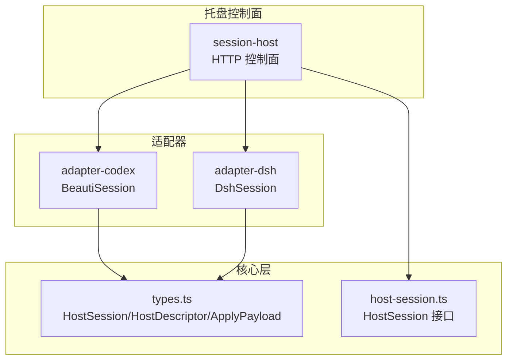
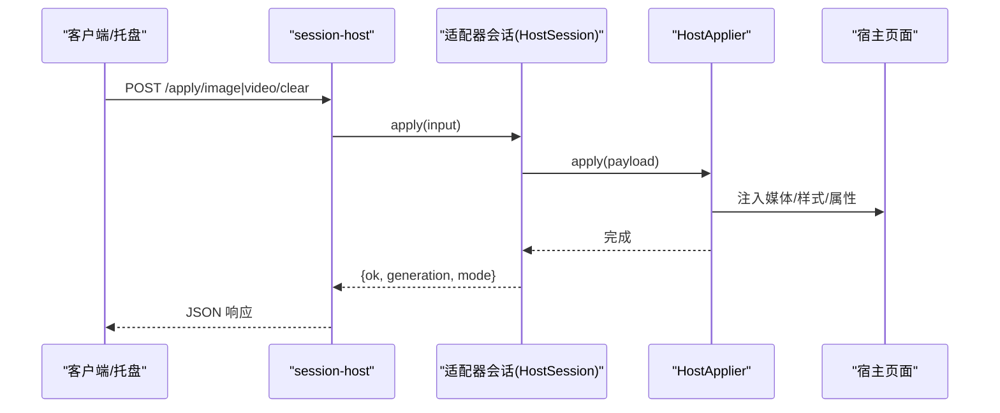
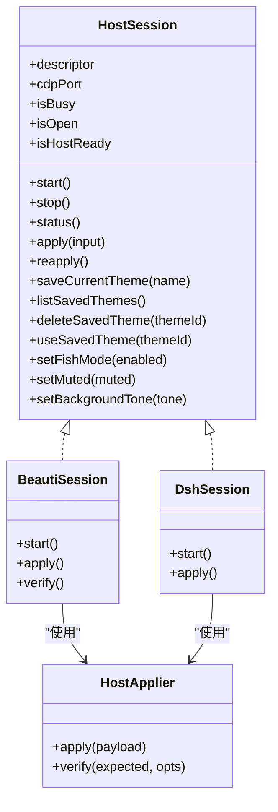
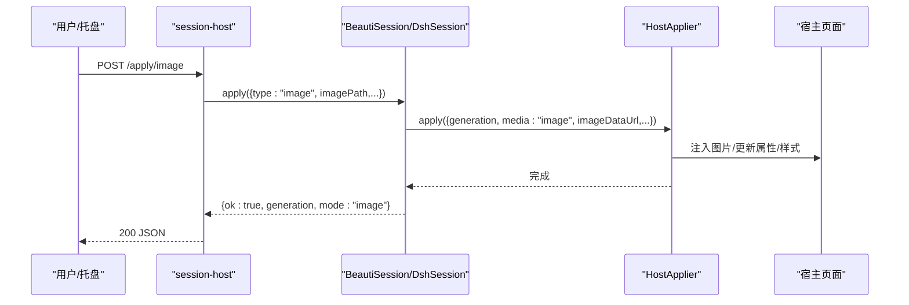
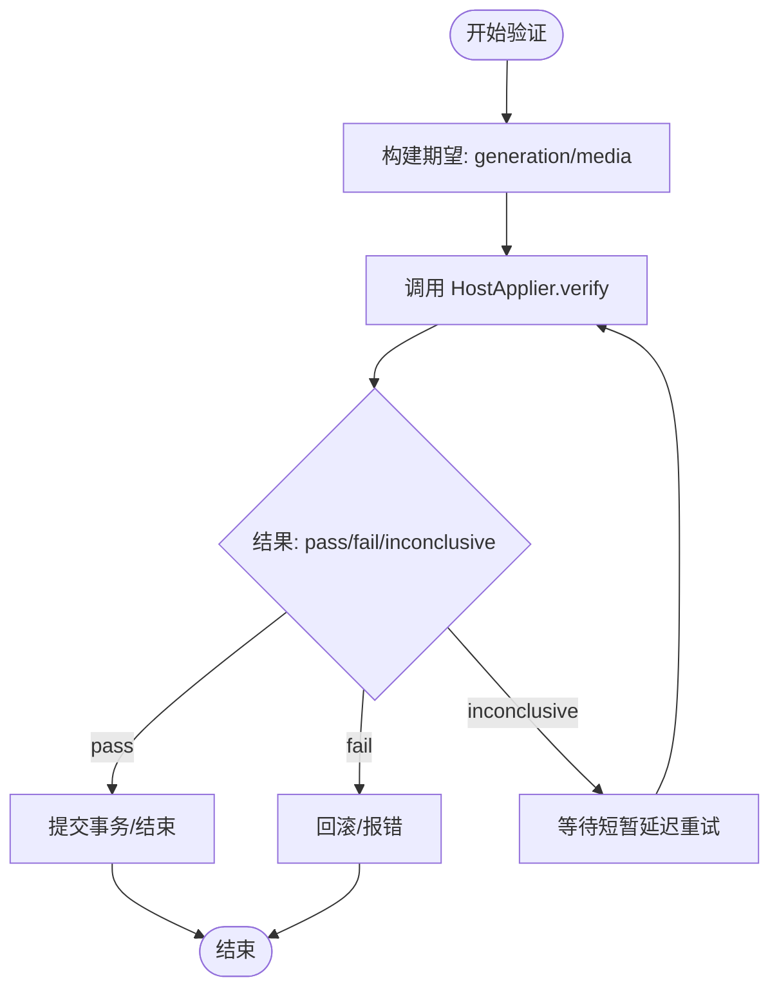
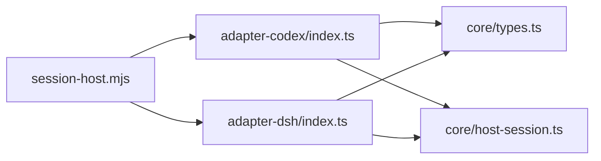

# 适配器开发指南

<cite>
**本文引用的文件**
- [packages/core/src/types.ts](file://packages/core/src/types.ts)
- [packages/core/src/host-session.ts](file://packages/core/src/host-session.ts)
- [packages/adapter-codex/src/session.ts](file://packages/adapter-codex/src/session.ts)
- [packages/adapter-codex/src/host-descriptor.ts](file://packages/adapter-codex/src/host-descriptor.ts)
- [packages/adapter-codex/src/index.ts](file://packages/adapter-codex/src/index.ts)
- [packages/adapter-dsh/src/session.ts](file://packages/adapter-dsh/src/session.ts)
- [packages/adapter-dsh/src/bridge.ts](file://packages/adapter-dsh/src/bridge.ts)
- [packages/adapter-dsh/src/index.ts](file://packages/adapter-dsh/src/index.ts)
- [apps/tray/session-host.mjs](file://apps/tray/session-host.mjs)
- [docs/host-adapter.md](file://docs/host-adapter.md)
</cite>

## 目录
1. [简介](#简介)
2. [项目结构](#项目结构)
3. [核心组件](#核心组件)
4. [架构总览](#架构总览)
5. [详细组件分析](#详细组件分析)
6. [依赖关系分析](#依赖关系分析)
7. [性能考虑](#性能考虑)
8. [故障排查指南](#故障排查指南)
9. [结论](#结论)
10. [附录：开发步骤与模板](#附录开发步骤与模板)

## 简介
本指南面向希望为 beautiCode 新增宿主应用适配器的开发者。文档围绕 HostSession 接口规范、适配器模式在 beautiCode 中的实现原理、HostDescriptor 设计模式、适配器与核心层的通信协议（消息格式、错误处理、状态同步），以及从初始化到测试部署的完整流程展开，并提供最佳实践与性能优化建议。

beautiCode 通过统一的抽象层屏蔽不同宿主应用的差异，托盘进程通过本地 HTTP 控制面调用统一会话接口，由具体适配器完成对宿主页面的注入或桥接，最终将图片/视频背景安全地应用到目标页面。

## 项目结构
- packages/core：定义跨宿主通用的类型、事务、媒体服务、存储等能力。
- packages/adapter-codex：Codex Desktop 适配器，基于 CDP 注入并管理 DOM 舞台与属性。
- packages/adapter-dsh：DeepSeek Harness 适配器，通过 DSH 内置桥进行背景应用。
- apps/tray：托盘进程提供的本地 HTTP 控制面，负责认证、路由、参数校验，并调用具体适配器会话。

图表来源
- [apps/tray/session-host.mjs:109-198](file://apps/tray/session-host.mjs#L109-L198)
- [packages/core/src/host-session.ts:27-47](file://packages/core/src/host-session.ts#L27-L47)
- [packages/core/src/types.ts:140-196](file://packages/core/src/types.ts#L140-L196)

章节来源
- [apps/tray/session-host.mjs:109-198](file://apps/tray/session-host.mjs#L109-L198)
- [packages/core/src/host-session.ts:27-47](file://packages/core/src/host-session.ts#L27-L47)
- [packages/core/src/types.ts:140-196](file://packages/core/src/types.ts#L140-L196)

## 核心组件
- HostSession 接口：托盘与适配器之间的最小稳定契约，包含启动、停止、状态查询、应用背景、主题管理、模式切换等能力。
- HostDescriptor：声明宿主种类、显示名称与能力集，用于 UI 与控制面按能力分支。
- HostApplier：适配器内部对“如何把背景应用到宿主”的具体实现，封装 CDP/桥调用细节。
- ApplyTransaction / MediaServerController：核心层负责媒体生命周期、事务阶段计时、回滚与验证。

章节来源
- [packages/core/src/host-session.ts:27-47](file://packages/core/src/host-session.ts#L27-L47)
- [packages/core/src/types.ts:18-34](file://packages/core/src/types.ts#L18-L34)
- [packages/core/src/types.ts:140-196](file://packages/core/src/types.ts#L140-L196)

## 架构总览
托盘进程监听本地端口，所有请求需携带 Bearer Token。请求进入后解析路径与方法，调用对应适配器会话方法；适配器通过 HostApplier 将背景以数据 URL、blob URL 或服务器 URL 形式注入到宿主页面，并通过验证器确认生效。

图表来源
- [apps/tray/session-host.mjs:363-418](file://apps/tray/session-host.mjs#L363-L418)
- [packages/core/src/types.ts:155-196](file://packages/core/src/types.ts#L155-L196)

## 详细组件分析

### HostSession 接口规范
- 必需方法与职责
  - start(): 启动会话，可能发现并连接宿主（CDP/桥），返回可选端口信息。
  - stop(): 优雅关闭，释放资源。
  - status(): 返回当前宿主描述、端口、会话数、清单、媒体服务器地址、模式与主题状态。
  - apply(input): 应用背景（图片/视频/清除），返回结果包含代数、模式、耗时等。
  - reapply(): 向已打开的宿主重新发布当前背景。
  - saveCurrentTheme(name)/listSavedThemes()/deleteSavedTheme(themeId)/useSavedTheme(themeId): 主题保存、列举、删除与应用。
  - setFishMode(enabled)/setMuted(muted)/setBackgroundTone(tone): 模式与外观控制。
- 可选扩展
  - 适配器可暴露私有 API，但托盘仅依赖上述稳定表面。

章节来源
- [packages/core/src/host-session.ts:27-47](file://packages/core/src/host-session.ts#L27-L47)

### HostDescriptor 设计模式
- 字段含义
  - kind: 宿主种类（codex/dsh）。
  - displayName: 用户可见名称。
  - capabilities: 能力布尔集合（image/video/clear/reapply/savedThemes/fish/muted/tone）。
- 用途
  - 控制面根据能力决定可用端点与行为。
  - UI 展示与功能开关。
- 版本兼容性
  - 通过能力集表达支持范围，避免硬编码版本判断。

章节来源
- [packages/core/src/types.ts:18-34](file://packages/core/src/types.ts#L18-L34)
- [packages/adapter-codex/src/host-descriptor.ts:1-17](file://packages/adapter-codex/src/host-descriptor.ts#L1-L17)

### Codex 适配器（BeautiSession）
- 关键特性
  - 通过 CDP 连接目标页面，注入舞台节点与 CSS，设置 html 属性（data-bc-active/media/video-ready/generation/working/fish）。
  - 提供 verify 集成，确保注入结果符合预期。
  - 支持 fish 模式与静音偏好，不重建媒体即可切换。
- 与核心层交互
  - 使用 HostApplyPayload 传递媒体源（data/blob/server）、CSS、氛围效果等。
  - 通过 ApplyTransaction 收集阶段耗时并保证一致性。

章节来源
- [packages/adapter-codex/src/session.ts:1-41](file://packages/adapter-codex/src/session.ts#L1-L41)
- [docs/host-adapter.md:18-78](file://docs/host-adapter.md#L18-L78)
- [docs/host-adapter.md:80-95](file://docs/host-adapter.md#L80-L95)
- [docs/host-adapter.md:97-145](file://docs/host-adapter.md#L97-L145)

### DeepSeek Harness 适配器（DshSession）
- 关键特性
  - 通过 DSH 内置桥发送背景应用指令，要求 loopback 海报/视频 URL。
  - 维护连接状态与活跃客户端计数。
- 与核心层交互
  - 同样遵循 HostApplyPayload 约定，但传输方式通过桥而非 CDP。

章节来源
- [packages/adapter-dsh/src/bridge.ts:85-124](file://packages/adapter-dsh/src/bridge.ts#L85-L124)
- [packages/adapter-dsh/src/index.ts:1-16](file://packages/adapter-dsh/src/index.ts#L1-L16)

### 适配器模式在 beautiCode 中的实现
- 统一入口
  - 托盘根据 --host 选择 adapter-codex 或 adapter-dsh 的会话类实例化。
- 解耦点
  - HostSession 作为稳定契约，适配器各自实现具体逻辑。
  - HostApplier 封装底层注入/桥调用的差异。
- 可扩展性
  - 新增宿主只需实现 HostSession 与 HostApplier，并声明 HostDescriptor。

章节来源
- [apps/tray/session-host.mjs:109-198](file://apps/tray/session-host.mjs#L109-L198)
- [packages/core/src/types.ts:140-196](file://packages/core/src/types.ts#L140-L196)

### 适配器与核心层通信协议
- 消息格式
  - 应用输入：ApplyInput（image/video/clear），含 source/effects/startAt 等。
  - 应用负载：HostApplyPayload（generation/media/imageDataUrl/imageUrl/video/cssText/atmosphere）。
  - 应用结果：ApplyResult（ok/generation/mode/sourceMode/timings/error/rolledBack）。
- 错误处理
  - 托盘统一将错误转换为中文消息返回。
  - 适配器应抛出明确错误，便于上层捕获与回滚。
- 状态同步
  - status() 返回 host/port/sessions/manifest/mediaServer/fish/muted/tone/themeId。
  - verify 机制确保注入结果与期望一致，失败则回滚。

章节来源
- [packages/core/src/types.ts:107-215](file://packages/core/src/types.ts#L107-L215)
- [apps/tray/session-host.mjs:260-273](file://apps/tray/session-host.mjs#L260-L273)
- [docs/host-adapter.md:80-95](file://docs/host-adapter.md#L80-L95)

### 类图：适配器与会话

图表来源
- [packages/core/src/host-session.ts:27-47](file://packages/core/src/host-session.ts#L27-L47)
- [packages/core/src/types.ts:140-153](file://packages/core/src/types.ts#L140-L153)

### 序列图：应用背景（图片）

图表来源
- [apps/tray/session-host.mjs:363-379](file://apps/tray/session-host.mjs#L363-L379)
- [packages/core/src/types.ts:155-196](file://packages/core/src/types.ts#L155-L196)

### 流程图：验证注入结果

图表来源
- [docs/host-adapter.md:80-95](file://docs/host-adapter.md#L80-L95)

## 依赖关系分析
- 托盘依赖适配器导出（BeautiSession/DshSession、discoverCdpEndpoints 等）。
- 适配器依赖核心层类型与工具（HostApplyPayload、ApplyResult、BackgroundStore 等）。
- Codex 适配器额外依赖 CDP 工具与注入锁。
- DSH 适配器依赖桥与令牌管理。

图表来源
- [apps/tray/session-host.mjs:109-198](file://apps/tray/session-host.mjs#L109-L198)
- [packages/adapter-codex/src/index.ts:1-79](file://packages/adapter-codex/src/index.ts#L1-L79)
- [packages/adapter-dsh/src/index.ts:1-16](file://packages/adapter-dsh/src/index.ts#L1-L16)
- [packages/core/src/types.ts:140-196](file://packages/core/src/types.ts#L140-L196)

章节来源
- [packages/adapter-codex/src/index.ts:1-79](file://packages/adapter-codex/src/index.ts#L1-L79)
- [packages/adapter-dsh/src/index.ts:1-16](file://packages/adapter-dsh/src/index.ts#L1-L16)
- [apps/tray/session-host.mjs:109-198](file://apps/tray/session-host.mjs#L109-L198)

## 性能考虑
- 媒体加载策略
  - 优先使用 data URL 或 blob URL 减少跨域与 CSP 限制；非 Codex 宿主可使用服务器 URL。
  - 小体积媒体适合 inline data；大体积媒体建议使用 blob/server。
- 注入与验证
  - 使用 verify 机制避免无效注入导致的重复重建。
  - 合理设置 verify 截止时间，避免长时间阻塞。
- 资源占用
  - 控制 CDP 连接超时与命令超时，避免资源泄漏。
  - 复用媒体服务器连接，减少重复上传。
- 模式切换
  - fish 与 muted 切换不重建媒体，降低开销。

[本节为通用指导，无需特定文件引用]

## 故障排查指南
- 常见错误
  - CDP 连接失败：检查远程调试端口是否开启、目标页身份是否匹配。
  - CSP 限制：Codex 下禁止 connect-src 到 127.0.0.1，需使用 data/blob URL。
  - 未授权：托盘控制面需要 Bearer Token，缺失或长度不符将拒绝。
  - 验证失败：verify 返回 fail/inconclusive 时检查注入脚本与宿主 DOM 结构。
- 定位方法
  - 查看托盘日志与 toChineseErrorMessage 输出。
  - 使用 /health 与 /status 检查会话状态。
  - 针对 DSH 适配器，检查桥状态与活跃客户端数。

章节来源
- [apps/tray/session-host.mjs:275-288](file://apps/tray/session-host.mjs#L275-L288)
- [apps/tray/session-host.mjs:303-321](file://apps/tray/session-host.mjs#L303-L321)
- [packages/adapter-dsh/src/bridge.ts:101-113](file://packages/adapter-dsh/src/bridge.ts#L101-L113)

## 结论
通过 HostSession 统一契约与 HostDescriptor 能力声明，beautiCode 实现了多宿主背景的无缝接入。适配器仅需关注自身宿主的注入或桥接细节，托盘与核心层保持稳定。遵循本文规范与最佳实践，可快速、安全地扩展新的宿主应用。

[本节为总结，无需特定文件引用]

## 附录：开发步骤与模板

### 从零开始：新建适配器
- 创建包目录与入口
  - 参考现有适配器结构，在 packages 下新增适配器包，提供 index.ts 导出必要符号。
- 实现 HostDescriptor
  - 声明 kind、displayName、capabilities，冻结对象以保证稳定性。
- 实现 HostApplier
  - 实现 apply(payload) 与 verify(expected, opts)，遵循 HostApplyPayload 与 VerifyExpectation。
- 实现 HostSession
  - 实现 start/stop/status/apply/reapply 及主题与模式相关方法。
- 集成托盘
  - 在 session-host 中增加对新适配器的识别与实例化逻辑（如需要）。
- 测试与部署
  - 编写单元测试覆盖 apply/verify/status。
  - 通过托盘控制面进行端到端验证。

章节来源
- [packages/core/src/types.ts:18-34](file://packages/core/src/types.ts#L18-L34)
- [packages/core/src/types.ts:140-196](file://packages/core/src/types.ts#L140-L196)
- [packages/core/src/host-session.ts:27-47](file://packages/core/src/host-session.ts#L27-L47)
- [apps/tray/session-host.mjs:109-198](file://apps/tray/session-host.mjs#L109-L198)

### 代码模板（路径指引）
- HostDescriptor 模板
  - 参考：[packages/adapter-codex/src/host-descriptor.ts:1-17](file://packages/adapter-codex/src/host-descriptor.ts#L1-L17)
- HostSession 接口
  - 参考：[packages/core/src/host-session.ts:27-47](file://packages/core/src/host-session.ts#L27-L47)
- HostApplier 接口
  - 参考：[packages/core/src/types.ts:140-153](file://packages/core/src/types.ts#L140-L153)
- 应用负载与结果
  - 参考：[packages/core/src/types.ts:155-215](file://packages/core/src/types.ts#L155-L215)
- 适配器导出入口
  - 参考：[packages/adapter-codex/src/index.ts:1-79](file://packages/adapter-codex/src/index.ts#L1-L79)
  - 参考：[packages/adapter-dsh/src/index.ts:1-16](file://packages/adapter-dsh/src/index.ts#L1-L16)

### 测试用例要点
- 单元测试
  - 验证 apply 在不同媒体类型下的行为。
  - 验证 verify 在 pass/fail/inconclusive 三种情况下的处理。
  - 验证 status 返回结构与字段完整性。
- 集成测试
  - 通过托盘控制面发起 /apply/image、/apply/video、/apply/clear。
  - 检查 /status 与 /health 返回。
  - 验证 fish/muted/tone 模式切换。

章节来源
- [docs/host-adapter.md:80-95](file://docs/host-adapter.md#L80-L95)
- [apps/tray/session-host.mjs:303-321](file://apps/tray/session-host.mjs#L303-L321)
- [apps/tray/session-host.mjs:363-418](file://apps/tray/session-host.mjs#L363-L418)

### 常见问题解决方案
- 无法连接 CDP
  - 确认宿主已启用远程调试端口，且只允许本地访问。
  - 检查目标页身份与标题是否符合生产环境约束。
- CSP 阻止媒体加载
  - 在 Codex 中使用 data/blob URL；非 Codex 宿主需允许 connect-src 到本地服务器。
- 注入后未生效
  - 检查 verify 返回值与原因；必要时调整注入时机与属性设置。
- 托盘报未授权
  - 确保请求头包含正确的 Bearer Token，且长度符合要求。

章节来源
- [docs/host-adapter.md:68-78](file://docs/host-adapter.md#L68-L78)
- [apps/tray/session-host.mjs:275-288](file://apps/tray/session-host.mjs#L275-L288)

### 最佳实践与性能优化
- 保持注入最小化：仅修改必要的 DOM 与属性，避免全局样式污染。
- 使用代数与验证：每次注入递增代数，结合 verify 确保一致性。
- 复用媒体资源：避免重复上传与重建，利用缓存与 blob 引用。
- 错误快速失败：对缺失 CDP、CSP 限制等情况立即返回清晰错误。
- 模式切换零重建：fish/muted 切换不应触发媒体重建。

[本节为通用指导，无需特定文件引用]