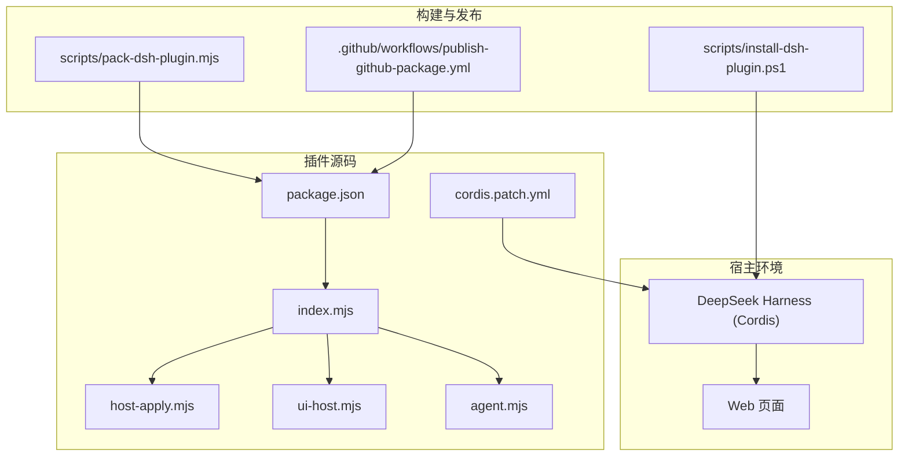
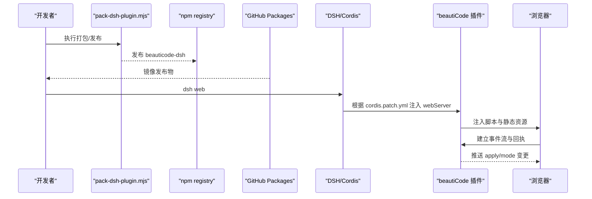
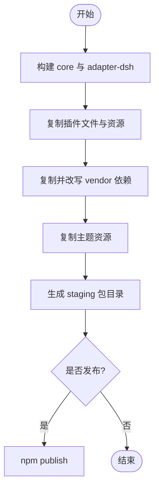
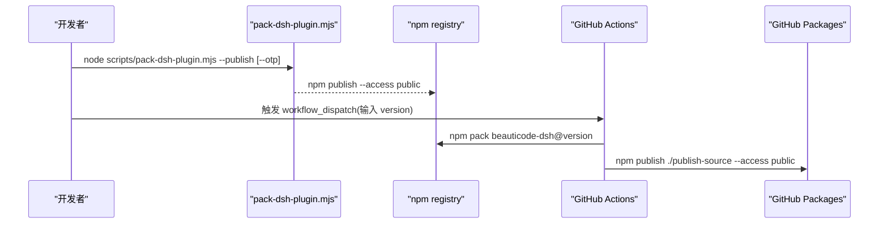
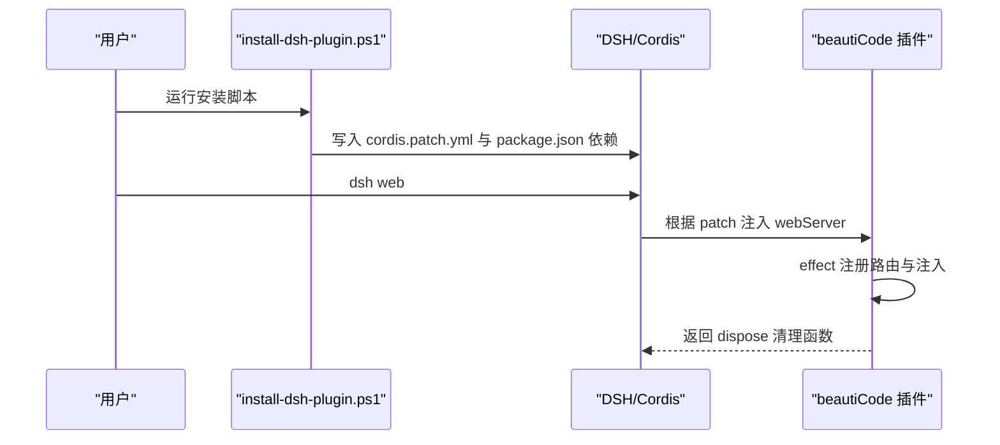
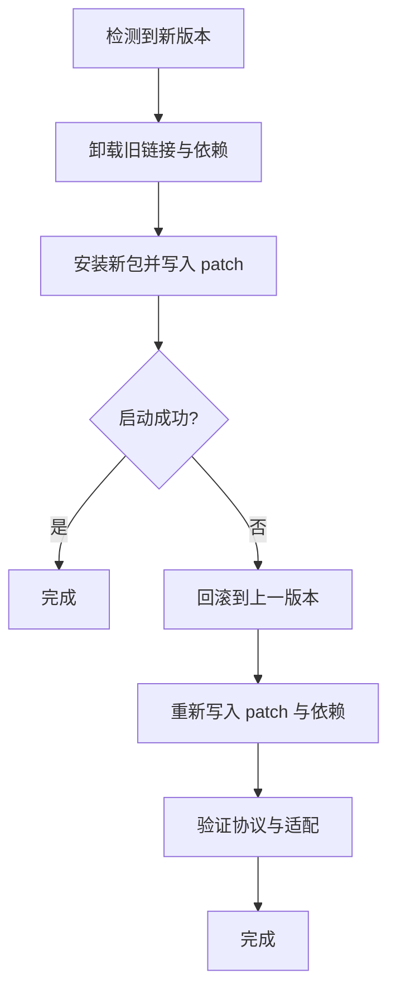
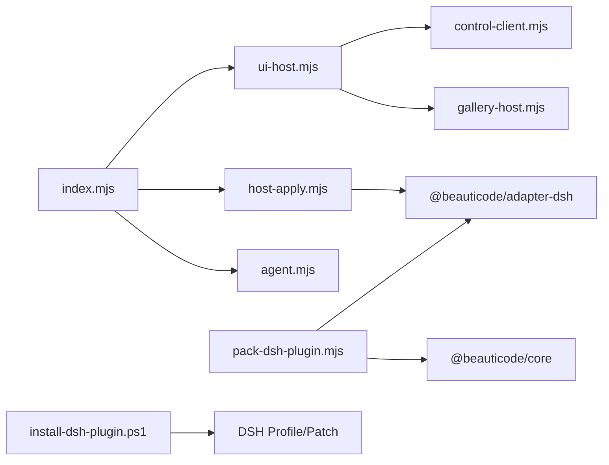

# DSH 插件分发

<cite>
**本文引用的文件**
- [package.json](file://integrations/deepseek-harness/package.json)
- [index.mjs](file://integrations/deepseek-harness/index.mjs)
- [host-apply.mjs](file://integrations/deepseek-harness/host-apply.mjs)
- [ui-host.mjs](file://integrations/deepseek-harness/ui-host.mjs)
- [agent.mjs](file://integrations/deepseek-harness/agent.mjs)
- [cordis.patch.yml](file://integrations/deepseek-harness/cordis.patch.yml)
- [pack-dsh-plugin.mjs](file://scripts/pack-dsh-plugin.mjs)
- [install-dsh-plugin.ps1](file://scripts/install-dsh-plugin.ps1)
- [publish-github-package.yml](file://.github/workflows/publish-github-package.yml)
- [beauticode.mjs](file://scripts/beauticode.mjs)
- [README.zh-CN.md](file://integrations/deepseek-harness/README.zh-CN.md)
</cite>

## 目录
1. [简介](#简介)
2. [项目结构](#项目结构)
3. [核心组件](#核心组件)
4. [架构总览](#架构总览)
5. [详细组件分析](#详细组件分析)
6. [依赖关系分析](#依赖关系分析)
7. [性能与可靠性](#性能与可靠性)
8. [故障排查指南](#故障排查指南)
9. [结论](#结论)
10. [附录：开发与发布工作流](#附录：开发与发布工作流)

## 简介
本文件面向 DeepSeek Harness（DSH）插件“beautiCode 桥接”的打包、发布、注册、更新与安全部署，提供从开发到发布的完整工作流指导。内容覆盖：
- 插件打包流程：依赖分析、资源收集、包结构生成
- npm 包发布流程：版本管理、标签管理与发布渠道配置
- 插件注册机制：自动发现、配置注入与生命周期管理
- 插件更新策略：增量更新、回滚机制与兼容性检查
- 开发环境搭建、调试方法与测试流程
- 签名验证、安全检查与部署监控方案

## 项目结构
该仓库将插件代码放在 integrations/deepseek-harness，构建与发布脚本在 scripts，CI 流水线在 .github/workflows。插件通过 Cordis 机制以 webServer 注入方式接入 DSH Web，并提供浏览器侧资源与服务端 API。

**图表来源**
- [package.json:1-60](file://integrations/deepseek-harness/package.json#L1-L60)
- [index.mjs:1-645](file://integrations/deepseek-harness/index.mjs#L1-L645)
- [host-apply.mjs:1-165](file://integrations/deepseek-harness/host-apply.mjs#L1-L165)
- [ui-host.mjs:1-798](file://integrations/deepseek-harness/ui-host.mjs#L1-L798)
- [agent.mjs:1-781](file://integrations/deepseek-harness/agent.mjs#L1-L781)
- [cordis.patch.yml:1-5](file://integrations/deepseek-harness/cordis.patch.yml#L1-L5)
- [pack-dsh-plugin.mjs:1-200](file://scripts/pack-dsh-plugin.mjs#L1-L200)
- [install-dsh-plugin.ps1:1-309](file://scripts/install-dsh-plugin.ps1#L1-L309)
- [publish-github-package.yml:1-57](file://.github/workflows/publish-github-package.yml#L1-L57)

**章节来源**
- [package.json:1-60](file://integrations/deepseek-harness/package.json#L1-L60)
- [README.zh-CN.md:1-49](file://integrations/deepseek-harness/README.zh-CN.md#L1-L49)

## 核心组件
- 插件入口 index.mjs：声明插件名、注入点、协议版本；注册路由、注入浏览器脚本、维护客户端状态与广播。
- host-apply.mjs：解析插件基础 URL、加载适配器、选择后端（托盘或进程内会话）、会话生命周期管理。
- ui-host.mjs：实现 UI 相关 API（导入、选择、主题、画廊、模式等），包含本地/托管上传策略、Windows 原生选择器集成、超时与限流。
- agent.mjs：暴露工具与斜杠命令，封装对 DSH 控制端点的调用，统一错误与结果格式。
- cordis.patch.yml：声明插件 ID、名称与注入点，供 Cordis 自动装配。
- pack-dsh-plugin.mjs：构建 core/adapter-dsh、复制插件文件与主题资源、重写 import、生成可发布包并支持直接发布。
- install-dsh-plugin.ps1：将插件链接到用户 DSH 配置文件，写入 patch 与 package 依赖，支持移除。
- publish-github-package.yml：从 npm 下载已验证包，重命名作用域并发布到 GitHub Packages。

**章节来源**
- [index.mjs:1-645](file://integrations/deepseek-harness/index.mjs#L1-L645)
- [host-apply.mjs:1-165](file://integrations/deepseek-harness/host-apply.mjs#L1-L165)
- [ui-host.mjs:1-798](file://integrations/deepseek-harness/ui-host.mjs#L1-L798)
- [agent.mjs:1-781](file://integrations/deepseek-harness/agent.mjs#L1-L781)
- [cordis.patch.yml:1-5](file://integrations/deepseek-harness/cordis.patch.yml#L1-L5)
- [pack-dsh-plugin.mjs:1-200](file://scripts/pack-dsh-plugin.mjs#L1-L200)
- [install-dsh-plugin.ps1:1-309](file://scripts/install-dsh-plugin.ps1#L1-L309)
- [publish-github-package.yml:1-57](file://.github/workflows/publish-github-package.yml#L1-L57)

## 架构总览
插件以 Cordis 插件形式注入 DSH Web 的 webServer，暴露一组 /__beauticode/* 路由，向浏览器注入 client.js、atmosphere.js、console.js、gallery.js 等资源，并通过事件流与回执机制同步渲染状态。应用层通过 agent 与 host-apply 抽象出托盘或进程内会话两种后端，UI 层处理导入、主题与画廊等交互。

**图表来源**
- [pack-dsh-plugin.mjs:140-199](file://scripts/pack-dsh-plugin.mjs#L140-L199)
- [publish-github-package.yml:30-56](file://.github/workflows/publish-github-package.yml#L30-L56)
- [cordis.patch.yml:1-5](file://integrations/deepseek-harness/cordis.patch.yml#L1-L5)
- [index.mjs:230-467](file://integrations/deepseek-harness/index.mjs#L230-L467)

## 详细组件分析

### 插件打包流程（依赖分析、资源收集、包结构生成）
- 依赖分析：
  - 构建 @beauticode/core 与 @beauticode/adapter-dsh 产物，复制到 vendor/core 与 vendor/adapter-dsh。
  - 重写 adapter 中对 core 的引用为相对路径，确保自包含。
- 资源收集：
  - 复制插件清单、入口、客户端脚本、控制台、画廊、主题资源等。
  - 复制 LICENSE 与 README 文档。
- 包结构生成：
  - 输出 staging 目录 artifacts/dsh-plugin，包含 package.json、vendor、themes 等。
  - 可选替换包名用于不同发布渠道。
- 发布：
  - 支持 --publish、--dry-run、--otp、--name 参数，直接调用 npm publish。

**图表来源**
- [pack-dsh-plugin.mjs:48-158](file://scripts/pack-dsh-plugin.mjs#L48-L158)
- [pack-dsh-plugin.mjs:161-199](file://scripts/pack-dsh-plugin.mjs#L161-L199)

**章节来源**
- [pack-dsh-plugin.mjs:1-200](file://scripts/pack-dsh-plugin.mjs#L1-L200)

### npm 包发布流程（版本管理、标签管理、发布渠道配置）
- 版本管理：
  - 插件 package.json 中维护版本号，打包时读取并输出 staging 包信息。
  - 可通过 --name 切换发布名称，便于多通道分发。
- 标签管理：
  - 当前脚本未显式设置标签；可在 CI 或本地发布时追加 npm dist-tag 逻辑。
- 发布渠道：
  - 本地：scripts/pack-dsh-plugin.mjs 支持直接 npm publish。
  - CI：.github/workflows/publish-github-package.yml 从 npm 下载已验证包，重命名为作用域包并发布到 GitHub Packages。

**图表来源**
- [pack-dsh-plugin.mjs:161-199](file://scripts/pack-dsh-plugin.mjs#L161-L199)
- [publish-github-package.yml:30-56](file://.github/workflows/publish-github-package.yml#L30-L56)

**章节来源**
- [package.json:1-60](file://integrations/deepseek-harness/package.json#L1-L60)
- [pack-dsh-plugin.mjs:140-199](file://scripts/pack-dsh-plugin.mjs#L140-L199)
- [publish-github-package.yml:1-57](file://.github/workflows/publish-github-package.yml#L1-L57)

### 插件注册机制（自动发现、配置注入、生命周期管理）
- 自动发现：
  - 安装脚本 detect DSH home/profile，若存在 web profile 则写入 cordis.patch.yml；否则在 home 级 patch 中以 file URI 形式注入。
- 配置注入：
  - 通过 cordis.patch.yml 声明 id、name、inject 点，使 Cordis 在 webServer 阶段加载插件。
  - 同时更新 web profile 的 package.json 依赖为 link 指向插件根目录，避免重复拷贝。
- 生命周期：
  - 插件在 effect 中注册路由与浏览器注入，并在 dispose 时清理连接与状态。
  - 会话按 dataRoot 维度缓存，支持停止与恢复。

**图表来源**
- [install-dsh-plugin.ps1:154-297](file://scripts/install-dsh-plugin.ps1#L154-L297)
- [cordis.patch.yml:1-5](file://integrations/deepseek-harness/cordis.patch.yml#L1-L5)
- [index.mjs:230-643](file://integrations/deepseek-harness/index.mjs#L230-L643)

**章节来源**
- [install-dsh-plugin.ps1:1-309](file://scripts/install-dsh-plugin.ps1#L1-L309)
- [index.mjs:230-643](file://integrations/deepseek-harness/index.mjs#L230-L643)

### 插件更新策略（增量更新、回滚机制、兼容性检查）
- 增量更新：
  - 通过 npm 发布新版本，用户重新安装或 CI 镜像至私有源后拉取最新包。
  - 安装脚本会清理旧链接并重建，确保使用最新版本。
- 回滚机制：
  - 若新版本异常，可回退到历史版本（本地或私有源），重新执行安装脚本。
  - 插件内部保留协议版本与 revision 校验，避免不兼容运行时。
- 兼容性检查：
  - 插件读取 bridge-manifest.json 校验 schema、protocol、revision。
  - host-apply 在加载适配器失败时抛出明确错误码，便于诊断。

**图表来源**
- [index.mjs:20-34](file://integrations/deepseek-harness/index.mjs#L20-L34)
- [host-apply.mjs:32-48](file://integrations/deepseek-harness/host-apply.mjs#L32-L48)
- [install-dsh-plugin.ps1:252-297](file://scripts/install-dsh-plugin.ps1#L252-L297)

**章节来源**
- [index.mjs:20-34](file://integrations/deepseek-harness/index.mjs#L20-L34)
- [host-apply.mjs:32-48](file://integrations/deepseek-harness/host-apply.mjs#L32-L48)
- [install-dsh-plugin.ps1:252-297](file://scripts/install-dsh-plugin.ps1#L252-L297)

### 插件开发环境搭建、调试方法与测试流程
- 环境搭建：
  - 确保 Node.js 版本满足要求（>=22）。
  - 使用安装脚本将插件链接到 DSH profile，或直接通过 dsh plugin add 指定本地路径。
- 调试方法：
  - 通过浏览器访问 /__beauticode/version 确认插件可用。
  - 使用 /__beauticode/events 观察事件流与回执。
  - 利用 beauticode.mjs CLI 进行离线/在线探测与状态查看。
- 测试流程：
  - 单元测试位于 test 目录，涵盖 agent、atmosphere、pack、plugin、ui-host 等模块。
  - 可使用脚本/test-runner.mjs 执行测试套件。

**章节来源**
- [beauticode.mjs:14-73](file://scripts/beauticode.mjs#L14-L73)
- [index.mjs:246-467](file://integrations/deepseek-harness/index.mjs#L246-L467)
- [README.zh-CN.md:11-49](file://integrations/deepseek-harness/README.zh-CN.md#L11-L49)

### 插件签名验证、安全检查与部署监控方案
- 签名验证：
  - 当前仓库未实现插件二进制签名；安全边界主要依靠网络与令牌机制。
- 安全检查：
  - 控制端点需要随机令牌（Bearer token），使用 timingSafeEqual 比较。
  - 媒体 URL 仅允许带令牌的回环地址（127.0.0.1、localhost、[::1]）。
  - 浏览器回执只接受同源请求（same-origin）。
  - 请求体大小限制（JSON 64KB，图片最大约 18MB，视频最大约 800MB）。
- 部署监控：
  - 通过 /__beauticode/status 获取连接数、就绪客户端、失败客户端、播放状态等。
  - 导入过程记录耗时日志到 dataRoot/logs/import-timing.jsonl。
  - 安装脚本输出日志到 LOCALAPPDATA/beautiCode/logs/dsh-plugin-install.log。

**章节来源**
- [index.mjs:90-142](file://integrations/deepseek-harness/index.mjs#L90-L142)
- [index.mjs:435-467](file://integrations/deepseek-harness/index.mjs#L435-L467)
- [ui-host.mjs:13-27](file://integrations/deepseek-harness/ui-host.mjs#L13-L27)
- [ui-host.mjs:32-44](file://integrations/deepseek-harness/ui-host.mjs#L32-L44)
- [install-dsh-plugin.ps1:46-60](file://scripts/install-dsh-plugin.ps1#L46-L60)

## 依赖关系分析
插件与宿主及外部依赖的关系如下：
- 插件入口依赖 agent、host-apply、ui-host、presets 等模块。
- host-apply 动态加载 adapter-dsh 或 tray 控制端点。
- ui-host 依赖 gallery-host、control-client、agent 等。
- 构建脚本依赖 core 与 adapter-dsh 的 dist 产物。
- 安装脚本操作 DSH profile 与 patch 文件。

**图表来源**
- [index.mjs:1-10](file://integrations/deepseek-harness/index.mjs#L1-L10)
- [host-apply.mjs:1-8](file://integrations/deepseek-harness/host-apply.mjs#L1-L8)
- [ui-host.mjs:1-11](file://integrations/deepseek-harness/ui-host.mjs#L1-L11)
- [pack-dsh-plugin.mjs:89-122](file://scripts/pack-dsh-plugin.mjs#L89-L122)
- [install-dsh-plugin.ps1:154-204](file://scripts/install-dsh-plugin.ps1#L154-L204)

**章节来源**
- [index.mjs:1-10](file://integrations/deepseek-harness/index.mjs#L1-L10)
- [host-apply.mjs:1-8](file://integrations/deepseek-harness/host-apply.mjs#L1-L8)
- [ui-host.mjs:1-11](file://integrations/deepseek-harness/ui-host.mjs#L1-L11)
- [pack-dsh-plugin.mjs:89-122](file://scripts/pack-dsh-plugin.mjs#L89-L122)
- [install-dsh-plugin.ps1:154-204](file://scripts/install-dsh-plugin.ps1#L154-L204)

## 性能与可靠性
- 性能优化：
  - 事件流广播采用最小帧格式，减少带宽占用。
  - 主题与静态资源启用合理缓存头（如图片 86400s）。
  - 导入过程分块限制与流式写入，避免内存峰值。
- 可靠性保障：
  - 会话按 dataRoot 维度缓存，避免重复启动。
  - 托盘抢占检测与等待，防止并发冲突。
  - 错误消息本地化与结构化返回，便于上层处理。

**章节来源**
- [index.mjs:225-228](file://integrations/deepseek-harness/index.mjs#L225-L228)
- [index.mjs:279-319](file://integrations/deepseek-harness/index.mjs#L279-L319)
- [host-apply.mjs:73-117](file://integrations/deepseek-harness/host-apply.mjs#L73-L117)
- [ui-host.mjs:260-274](file://integrations/deepseek-harness/ui-host.mjs#L260-L274)

## 故障排查指南
- 常见问题：
  - 插件未加载：检查 cordis.patch.yml 是否正确注入，确认 web profile 存在。
  - 令牌无效：确认 BEAUTICODE_DATA_ROOT 下的 token 文件存在且格式正确。
  - 媒体过大：检查文件大小限制，调整上传策略或使用本地导入。
  - 托盘冲突：等待托盘释放或终止冲突进程。
- 诊断工具：
  - 使用 /__beauticode/version 与 /__beauticode/status 检查插件状态。
  - 查看 logs/import-timing.jsonl 分析导入耗时与错误。
  - 使用 beauticode.mjs CLI 进行端口探测与状态查询。

**章节来源**
- [index.mjs:246-258](file://integrations/deepseek-harness/index.mjs#L246-L258)
- [index.mjs:535-547](file://integrations/deepseek-harness/index.mjs#L535-L547)
- [ui-host.mjs:32-44](file://integrations/deepseek-harness/ui-host.mjs#L32-L44)
- [beauticode.mjs:224-298](file://scripts/beauticode.mjs#L224-L298)

## 结论
本插件通过 Cordis 机制无缝接入 DSH Web，提供安全的背景与主题管理能力。打包与发布流程清晰，支持多通道分发与版本回滚。安全边界通过令牌、同源校验与媒体 URL 白名单实现。建议在生产环境中结合 CI 与私有源，实现受控发布与快速回滚。

## 附录：开发与发布工作流
- 开发：
  - 修改插件代码后，运行安装脚本链接到 DSH profile。
  - 启动 dsh web，通过浏览器与 CLI 验证功能。
- 打包：
  - 执行 scripts/pack-dsh-plugin.mjs，生成 staging 包。
  - 可选择 --publish 直接发布到 npm。
- 发布：
  - 本地发布：npm publish。
  - CI 发布：触发 workflow_dispatch，输入版本镜像到 GitHub Packages。
- 部署：
  - 用户使用 npx 或 dsh plugin add 安装插件。
  - 运行 dsh web，插件自动注入并生效。

**章节来源**
- [README.zh-CN.md:11-49](file://integrations/deepseek-harness/README.zh-CN.md#L11-L49)
- [pack-dsh-plugin.mjs:161-199](file://scripts/pack-dsh-plugin.mjs#L161-L199)
- [publish-github-package.yml:30-56](file://.github/workflows/publish-github-package.yml#L30-L56)